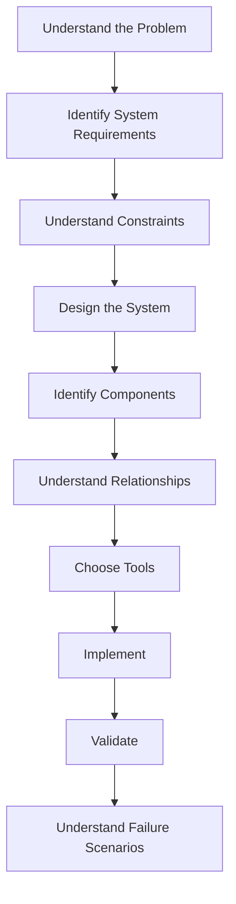
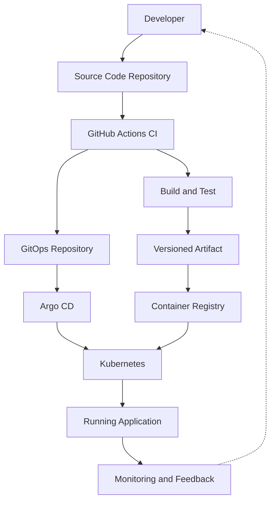

This will be our **official, fixed roadmap for learning CI/CD from first principles**.

We'll follow exactly **5 learning levels containing 16 phases**. I won't change the structure or introduce additional phases midway through the course.

### Our learning structure

|Level|Focus|Phases|Main Question|
|---|---|---|---|
|**Level 1**|Fundamentals|01–04|Why does CI/CD exist, and how does it fit into software engineering?|
|**Level 2**|Continuous Integration|05–08|How do we transform source code into a tested, trustworthy artifact?|
|**Level 3**|Continuous Delivery|09–12|How do GitHub Actions, GitOps, and Argo CD work together to deliver software?|
|**Level 4**|Production Engineering|13–15|How do we deploy safely, secure delivery, detect failures, and recover?|
|**Level 5**|System Design|16|How do we design and implement a complete production-style CI/CD system?|

### Rules for our lessons

**1. One response = one complete phase.**

Each phase will be comprehensive enough to save as a standalone Markdown note.

**2. First principles before tools.**

We'll follow this thinking process:

**3. GitHub Actions and Argo CD will be our primary tools.**

We'll use them as examples whenever appropriate, but we'll focus on the engineering principles behind them rather than memorizing YAML.

**4. Every phase will cover:**

- The fundamental problem and why it exists.
- First-principles reasoning.
- Important concepts explained from the ground up.
- System architecture and component relationships.
- Real-world engineering scenarios.
- Tool-specific examples when relevant.
- Failure scenarios, trade-offs, and design decisions.
- Practical exercises to develop system-design thinking.
- Knowledge-recall exercises to strengthen memorization.
- Key takeaways and interview-level questions.

**5. All diagrams will be compatible with Obsidian and VS Code.**

I'll use standard Mermaid syntax and plain code fences without generated IDs or unusual formatting.

**6. Every phase will connect to the overall CI/CD architecture.**

Our goal is to understand the entire system:

By the end of Phase 16, you should be able to **design a CI/CD architecture from requirements, justify each component, identify failure points, and implement the system**, rather than simply copying GitHub Actions workflows or Kubernetes manifests.

---

### Starting point

**Level 1 — Fundamentals**

**Phase 01: Why CI/CD Exists**

File: `Level-1-Fundamentals/Phase-01-Why-CICD-Exists.md`

We will begin with a fundamental engineering question:

**If developers can write code, test it, and deploy it manually, why do we need CI/CD at all?**

Understanding that problem is the foundation for everything that follows.

Send **`Start Phase 01`**, and we'll begin the course from the beginning, following this exact roadmap.
