# Phase 01 — Why CI/CD Exists
**Level 1: Fundamentals | CI/CD From First Principles**

**File:** `Level-1-Fundamentals/Phase-01-Why-CICD-Exists.md`

---

## 1. What Will You Learn?

Before learning GitHub Actions, Argo CD, GitOps, or writing a single YAML workflow, we need to understand the engineering problem that CI/CD solves.

By the end of this phase, you should be able to explain:

1. Why software delivery becomes difficult as systems grow.
2. Why writing correct code is not enough to deliver reliable software.
3. What problems Continuous Integration and Continuous Delivery solve.
4. Why CI/CD is fundamentally about controlling change, uncertainty, and risk.
5. How CI/CD connects development, testing, infrastructure, deployment, and production.
6. Why automation alone does not make a delivery system reliable.
7. How to approach the design of a CI/CD system from requirements rather than tools.

Our central question is:

> **If developers can write, test, build, and deploy software manually, why does CI/CD need to exist?**

To answer that, we must understand what software delivery actually means.

---

# 2. First Principle: Software Development Is Not Software Delivery

Imagine you are building a Node.js application.

You write an API:

```typescript id="rr1pu8"
app.get("/health", (req, res) => {
  res.status(200).json({
    status: "healthy"
  });
});
```

You run:

```bash id="duqr15"
npm install
npm run build
npm start
```

The application starts successfully.

You test:

```bash id="ebralv"
curl http://localhost:3000/health
```

The response is correct.

Does that mean your application has been successfully delivered?

**No.**

You have established that a particular version of the application works under your local conditions.

You have not established that:

- It works in another environment.
- It integrates correctly with other developers' changes.
- Its dependencies are available in production.
- Its configuration is correct.
- It can be deployed repeatedly.
- It will remain operational after deployment.
- It can be recovered if deployment fails.

This reveals our first important distinction.

### Software development

The process of creating and modifying software.

### Software delivery

The process of making a particular version of software available to its intended users in a controlled, repeatable, and verifiable way.

These processes are related but solve different problems.

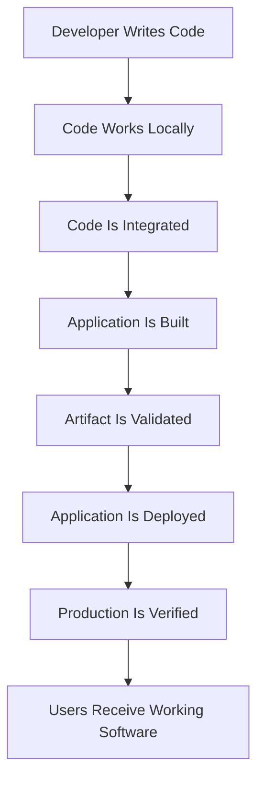

Notice something important.

**There are many engineering steps between writing code and delivering value to users.**

Every step can fail independently.

A program may compile successfully but fail at runtime.

A container may build successfully but fail to start in Kubernetes.

A Kubernetes Deployment may become ready while an important business workflow remains broken.

Therefore:

> The fundamental problem of software delivery is not simply moving code into production. It is moving changes into production while maintaining sufficient confidence that the system will continue to behave as intended.

This is the problem CI/CD exists to help solve.

---

# 3. Start With a World Without CI/CD

Let's construct a realistic scenario.

You have a backend application with:

- Node.js and TypeScript
- PostgreSQL
- Docker
- Kubernetes
- Five developers
- One production environment

There is no CI/CD system.

Developers must integrate and deploy changes manually.

## 3.1 The manual workflow

Developer A creates a feature.

Developer B fixes a bug.

Developer C updates a database query.

Each developer tests their changes locally.

Eventually, someone must combine these changes and release the application.

The deployment process might look like this:

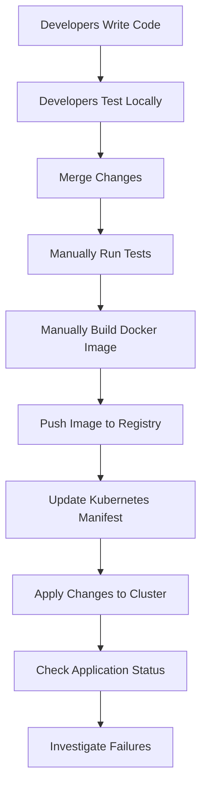

Technically, this system can work.

In fact, manual delivery may be perfectly reasonable for a small application with infrequent releases.

So why introduce CI/CD?

Because we need to understand what happens as the number of changes, people, environments, and deployments increases.

---

# 4. Deriving the Problems From First Principles

Instead of memorizing the benefits of CI/CD, we will derive them.

## Problem 1: Integration Uncertainty

Imagine two developers.

Developer A modifies:

```typescript id="8josnn"
function calculatePrice(price: number) {
  return price * 1.18;
}
```

Developer B modifies another part of the application:

```typescript id="61p3hk"
const finalPrice = calculatePrice(product);
```

Developer A expects a number.

Developer B passes an object.

Their changes might each appear acceptable in isolation, especially if their tests do not cover the shared interface.

But the integrated application fails.

### Why does this happen?

Because developers work on separate representations of the same evolving system.

Each developer validates only a portion of the complete system.

When changes are combined, new interactions emerge.

This gives us a fundamental principle:

> Correctness of individual components does not guarantee correctness of their integration.

### What do we need?

A mechanism that:

1. Combines changes frequently.
2. Checks the combined system.
3. Detects integration problems quickly.
4. Reports failures to developers.

That requirement leads us toward **Continuous Integration**.

The solution is not merely a tool that runs tests.

It is an engineering practice built around frequently integrating changes into a shared codebase and validating them automatically.

---

## Problem 2: Environment Uncertainty

Your application works locally.

But production has:

- Different environment variables
- Different network policies
- Different resource limits
- Different database permissions
- Different external services

A successful local test does not prove production compatibility.

Consider:

```typescript id="ut433o"
const databaseUrl = process.env.DATABASE_URL;
```

On your laptop:

```bash id="baqmug"
DATABASE_URL=postgresql://localhost:5432/app
```

But the production environment is missing the variable.

The application may fail during startup.

### First-principles reasoning

The program's behavior depends on more than source code.

We can represent this conceptually as:

```text id="t0uleq"
Application Behavior
        =
    Function of
        (
          Code,
          Dependencies,
          Configuration,
          Infrastructure,
          External Systems,
          Runtime Conditions
        )
```

Even when code is unchanged, different conditions can produce different behavior.

### What do we need?

We need to reduce uncontrolled differences between environments.

Possible mechanisms include:

- Consistent build processes
- Versioned dependencies
- Container images
- Environment-specific configuration
- Infrastructure as Code
- Deployment validation
- Production health checks

CI/CD coordinates these mechanisms, but it does not automatically make all environments identical.

**Important lesson:** CI/CD cannot eliminate environment differences. It helps make those differences explicit, manageable, and testable.

---

## Problem 3: Human Execution Variability

Suppose deployment requires these commands:

```bash id="m9pq68"
npm ci
npm run build
docker build -t myapp:v1 .
docker push myregistry/myapp:v1
kubectl set image deployment/myapp \
  myapp=myregistry/myapp:v1
```

A developer executes them manually.

Potential failures include:

- Forgetting a command
- Using the wrong image version
- Running against the wrong Kubernetes cluster
- Skipping tests
- Using the wrong registry
- Reusing an outdated artifact

Why do these problems exist?

Because the delivery process depends on humans repeatedly performing the same operational sequence correctly.

Humans are good at making engineering decisions.

They are less reliable at repeatedly executing long, detail-heavy procedures without variation.

### What do we need?

We need a repeatable execution process.

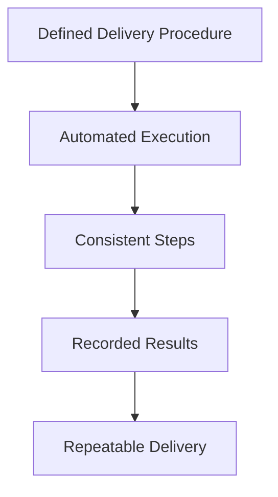

This leads us toward automation.

But remember:

**Automating a bad process does not make it a good process.**

If a pipeline deploys broken code automatically, it has simply automated failure.

Automation improves consistency. Testing, controls, and feedback are still needed to improve reliability.

---

## Problem 4: Slow Feedback

Imagine a developer introduces a bug on Monday.

Nobody tests the integrated system until Friday.

On Friday, the application fails.

Now the team must investigate changes from several developers across multiple days.

The debugging problem has become more complicated.

Why?

Because more changes have accumulated since the last known successful state.

We can describe this relationship conceptually:

```text id="2xzxpx"
More Unvalidated Changes
           |
           v
Larger Set of Possible Causes
           |
           v
More Difficult Investigation
           |
           v
Slower Recovery
```

This is not a universal mathematical law, but it is a useful engineering model.

### What do we need?

A system that reduces the delay between introducing a defect and discovering it.

For example:

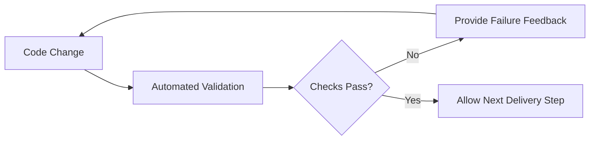

This introduces another major principle:

> The earlier a defect is detected, the fewer subsequent delivery steps may need to be investigated or repeated.

This principle helps explain why automated validation is so valuable.

---

## Problem 5: Release Uncertainty

Suppose your application is built several times.

The testing team validates one build.

Later, somebody rebuilds the application before production deployment.

Can you guarantee that the production build is identical to the tested build?

Not necessarily.

Dependencies, build environments, generated files, or other inputs may have changed.

### The underlying problem

We have lost the relationship between:

**What was validated** and **what was deployed**.

### What do we need?

A versioned, identifiable artifact.

For example:

```text id="ujraa4"
Source Commit
     |
     v
Build Process
     |
     v
Container Image
     |
     v
Image Digest
     |
     v
Testing and Validation
     |
     v
Deploy Same Image Digest
```

A container image digest identifies its exact content.

This allows us to establish a much stronger connection between the tested artifact and the deployed artifact.

The principle is:

> Build once, promote the same immutable artifact through environments whenever practical.

Configuration may differ between environments, but the application artifact should not need to be rebuilt for each promotion.

This idea will become central in Phase 07.

---

## Problem 6: Production Uncertainty

Suppose all tests pass.

The application deploys successfully.

Kubernetes reports:

```text id="4g2fzm"
deployment/myapp successfully rolled out
```

Is the release successful?

Not necessarily.

Users might still experience:

- HTTP 500 errors
- Increased latency
- Failed database transactions
- Broken authentication
- Incorrect business results

Kubernetes rollout success is evidence about deployment progress and readiness, not proof that every business function works.

### What do we need?

Feedback from the actual running system.

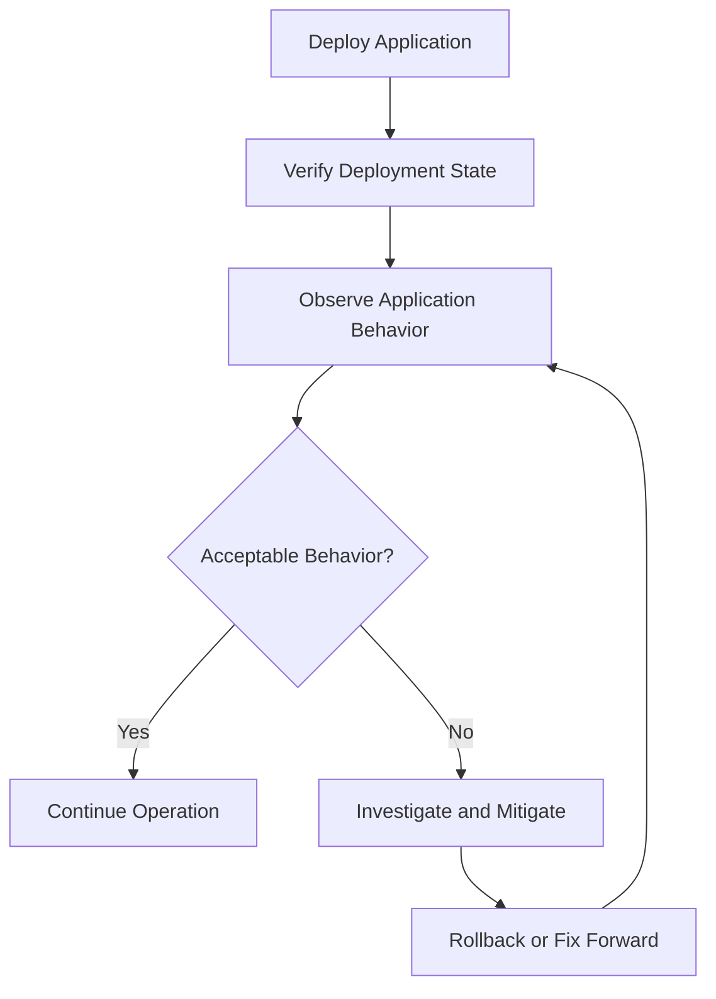

This establishes an important distinction:

**Deployment completion is not the same as release success.**

A reliable delivery process must include post-deployment validation and a recovery strategy.

This connects CI/CD to observability, incident response, and reliability engineering.

---

# 5. We Have Derived the Requirements for CI/CD

Notice how we approached the problem.

We did not begin by choosing GitHub Actions.

We began by investigating why manual software delivery becomes difficult.

From those problems, we derived system requirements.

| Fundamental problem | Engineering requirement | Possible mechanism |
|---|---|---|
| Integration uncertainty | Validate combined changes frequently | Continuous Integration |
| Environment uncertainty | Control and validate runtime differences | Containers, configuration management, IaC |
| Human execution variability | Execute procedures consistently | Automated workflows |
| Slow defect discovery | Shorten validation feedback time | Automated tests and reporting |
| Release uncertainty | Identify exactly what is deployed | Immutable artifacts and versioning |
| Production uncertainty | Verify actual system behavior | Observability and deployment validation |
| Recovery uncertainty | Restore acceptable operation after failures | Rollback, roll-forward, recovery procedures |
| Poor traceability | Connect changes to builds and deployments | Git history, artifact metadata, deployment records |

We can now define CI/CD from first principles.

> **CI/CD is a set of engineering practices and supporting automation that helps teams integrate, validate, package, release, and deliver software changes consistently, with feedback and controls appropriate to their risks.**

It is not simply a collection of YAML files.

---

# 6. Understanding CI and CD Separately

The terms CI and CD are frequently used together.

But they solve different parts of the delivery problem.

## 6.1 Continuous Integration — CI

Continuous Integration focuses on integrating changes into a shared codebase frequently and validating those changes.

Its objective is to discover integration and quality problems early.

A common CI workflow looks like:

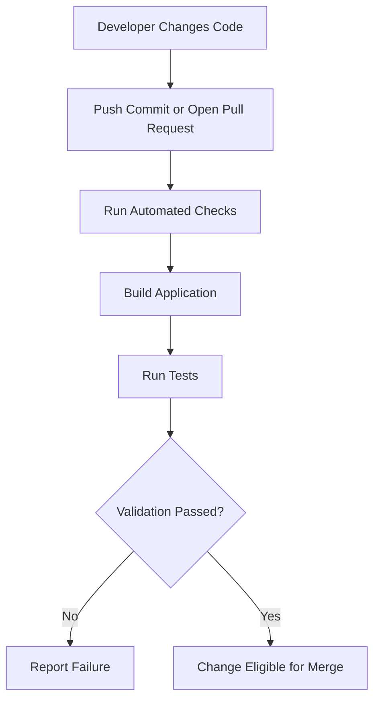

CI commonly includes:

- Source code validation
- Dependency installation
- Compilation
- Unit tests
- Integration tests
- Static analysis
- Build verification

Not every project needs every check.

The important question is:

**Which checks provide enough useful confidence about an integrated change?**

For our learning project, we will eventually use GitHub Actions to implement CI.

However, GitHub Actions is not CI itself.

CI is the engineering practice.

GitHub Actions is one possible automation platform supporting that practice.

---

## 6.2 Continuous Delivery — CD

Continuous Delivery focuses on ensuring that validated changes can be released reliably.

Its objective is to keep software in a releasable state.

A simplified process is:

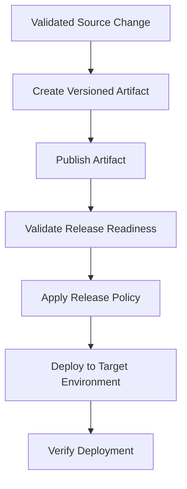

A key distinction:

**Continuous Delivery does not require every successful change to be deployed automatically to production.**

A team may require human approval before production release.

The goal is that the application remains ready to deploy when the organization decides to release it.

---

## 6.3 Continuous Deployment

Continuous Deployment goes a step further.

Changes that satisfy the required automated release criteria are deployed automatically without a separate manual release decision.

Compare:

| Property | Continuous Delivery | Continuous Deployment |
|---|---|---|
| Changes are integrated frequently | Yes | Yes |
| Automated validation | Yes | Yes |
| Changes remain releasable | Yes | Yes |
| Production deployment can require approval | Yes | Generally no manual approval per change |
| Production deployment automatically follows successful release gates | Not required | Yes |

Neither approach is automatically better.

A financial application may require explicit production approvals.

A low-risk internal service may use automatic deployment.

The right choice depends on business requirements, operational risk, compliance obligations, and recovery capabilities.

---

# 7. CI/CD Is a Change-Management System

This is one of the most important mental models in the course.

Instead of thinking:

```text id="2jikmc"
CI/CD = Build + Test + Deploy
```

Think:

```text id="xmxjk6"
CI/CD = Controlled Movement of Software Changes
```

A change starts with an uncertain outcome.

We need to gather evidence about that change before increasing its exposure to users.

Consider this system:

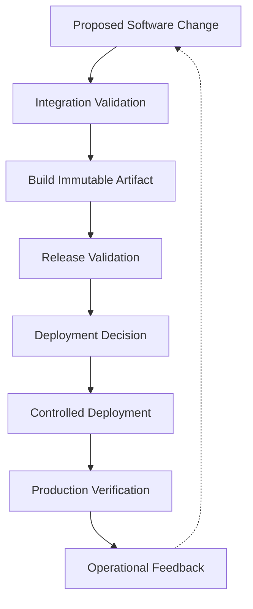

Every stage exists for a reason.

### Integration validation

Answers:

Does this change work with the shared codebase?

### Build

Answers:

Can we produce a deployable software artifact?

### Release validation

Answers:

Do we have sufficient evidence that this artifact is suitable for release?

### Deployment decision

Answers:

Is the release permitted under our current policy and operational conditions?

### Deployment

Answers:

Can we move the target environment toward the intended version?

### Production verification

Answers:

Is the system functioning acceptably under real operating conditions?

### Operational feedback

Answers:

What did we learn from the deployed change?

The system is not simply moving software forward.

It is making decisions based on available evidence.

That is a much more useful way to understand CI/CD architecture.

---

# 8. Where CI/CD Fits Into the Whole DevOps System

Now let's expand our perspective.

DevOps involves much more than CI/CD.

A production software system contains several interacting engineering domains:

- Application development
- Source control
- Software validation
- Artifact management
- Infrastructure provisioning
- Configuration management
- Deployment orchestration
- Security
- Observability
- Incident response

CI/CD connects several of these domains.

It is a delivery mechanism inside a larger software engineering and operations system.

## 8.1 High-level architecture

We will use GitHub Actions, Docker, and Argo CD as examples throughout the course.

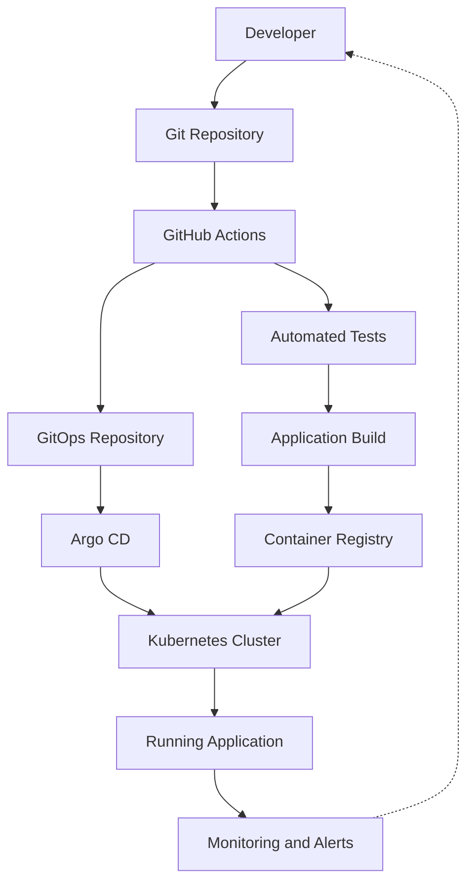

This is a simplified reference architecture, not a universal mandatory sequence.

For example, the GitOps repository update should occur only after the required build and validation steps have succeeded and the artifact has been published.

Let's understand what each major component contributes.

### Git repository

Holds the application source code and its change history.

Its job is not to deploy applications.

It provides a versioned representation of the source.

### GitHub Actions

Executes automated workflows.

It may:

- Validate code.
- Run tests.
- Build container images.
- Publish artifacts.
- Propose deployment configuration changes.

Its primary responsibility in our chosen design will be CI and release preparation.

### Container registry

Stores container images.

It provides a location from which deployment platforms can retrieve application artifacts.

### GitOps repository

Stores the declared desired configuration of the deployed application.

For example:

```yaml id="biz2e7"
image:
  repository: ghcr.io/example/myapp
  digest: sha256:exampledigest
```

This is a conceptual configuration fragment. An actual digest is a full SHA-256 value, and the exact format depends on the deployment tool.

### Argo CD

Observes the desired state recorded in Git and compares it with the state of Kubernetes resources.

It can apply changes to bring managed Kubernetes resources toward the desired state.

This is called **reconciliation**.

### Kubernetes

Runs and manages the application workload.

It is responsible for workload scheduling, controllers, service discovery, and other cluster capabilities.

### Monitoring

Provides information about what is actually happening after deployment.

It helps answer whether the application is meeting its operational expectations.

The important architectural idea is:

> Each component should have a clearly defined responsibility, and the relationships between components are just as important as the components themselves.

We will explore these boundaries in depth in later phases.

---

# 9. Why CI/CD Needs Feedback

Think about a simple machine.

You tell it to perform an action.

But you never inspect the result.

Can you know whether it succeeded?

No.

A delivery pipeline has the same problem.

Imagine:

```text id="8rp1kx"
Build
  |
  v
Deploy
  |
  v
Finish
```

What happens if the application deploys but starts returning HTTP 500 responses?

The pipeline has no mechanism to learn that the outcome is unacceptable.

This is an **open-loop process** with respect to application health.

Now consider:

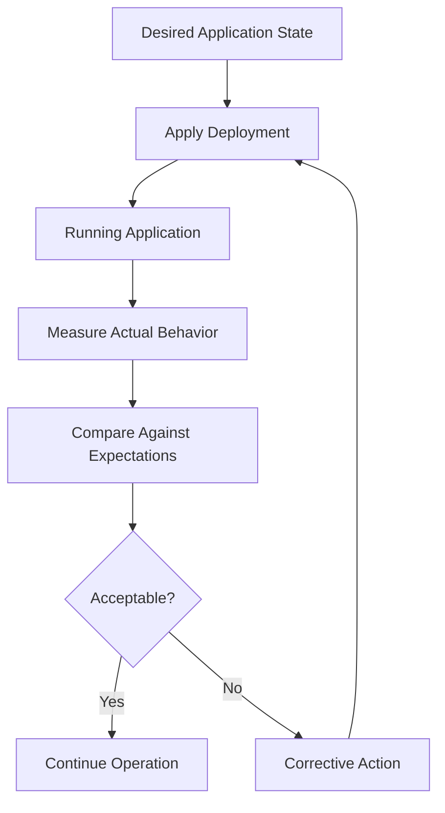

This is a simplified feedback-controlled delivery process.

The corrective action must be chosen carefully. Repeating the same failed deployment is not necessarily useful.

Corrections may involve:

- Halting a rollout
- Rolling back
- Rolling forward with a fix
- Restoring configuration
- Investigating infrastructure
- Escalating an incident

We will explore feedback and control systems properly in Phase 02.

For now, remember:

**A pipeline that only executes steps is weaker than a delivery system that also verifies outcomes and responds to failure.**

---

# 10. Why Faster Delivery Does Not Mean Less Safety

A common misconception is:

> CI/CD is primarily about deploying more frequently.

Faster delivery is often a benefit.

But speed alone is not the objective.

Imagine two teams.

### Team A

- Deploys once every two weeks.
- Combines many changes into one release.
- Uses manual validation.
- Has limited deployment evidence.
- Cannot easily identify which change caused a failure.

### Team B

- Integrates changes frequently.
- Uses automated validation.
- Produces versioned artifacts.
- Deploys smaller changes.
- Monitors deployment outcomes.
- Can recover from failed releases.

Team B may be able to deliver more frequently with lower operational risk.

Why?

Because smaller changes can be easier to understand, validate, and troubleshoot.

However, smaller changes alone do not guarantee safety.

A one-line database migration can still cause a major incident.

The important principle is:

> Delivery speed becomes sustainable when validation, deployment controls, observability, and recovery capabilities improve together.

This is why CI/CD engineering must consider both delivery efficiency and system reliability.

---

# 11. An Engineering Model for Evaluating CI/CD

When designing a CI/CD system, we need ways to evaluate whether it is working.

Start with four questions.

### 1. How long does delivery take?

We want to understand the time between a code change and its availability in production.

This includes:

- Waiting for integration
- Automated validation
- Artifact creation
- Approval delays
- Deployment execution

This relates to **change lead time**.

### 2. How often can we deliver?

Can the system support frequent, controlled releases?

This relates to **deployment frequency**.

### 3. How often do changes cause problems?

Do deployments require unplanned remediation or recovery?

This relates to **change failure rate**.

### 4. How quickly can we recover?

When a deployment creates a problem, how rapidly can the team restore acceptable service?

This relates to **failed deployment recovery time**.

These are related to established software delivery performance metrics.

However, metrics must be interpreted in context. High deployment frequency is not automatically good, and numbers can be misleading when definitions or incentives are poor.

### The deeper lesson

A delivery system should be evaluated by its outcomes, not by how many tools or pipeline stages it contains.

A project with 30 GitHub Actions workflows is not necessarily more mature than a project with three well-designed workflows.

Good engineering means implementing the controls the system actually needs.

---

# 12. Real-World Example: A Broken Production Release

Let's examine a production scenario.

You maintain a Node.js API deployed on Kubernetes.

A developer changes the application's database configuration.

The code builds successfully.

Unit tests pass.

The Docker image is created.

The deployment reaches Kubernetes.

But the application cannot connect to PostgreSQL.

## Step 1: Understand the failure

The application code may be correct.

The container image may also be valid.

The problem is the relationship between the application and its production environment.

Perhaps:

- The database hostname is incorrect.
- A required Secret is missing.
- Database credentials have expired.
- A Kubernetes NetworkPolicy blocks connectivity.
- The database is unavailable.

## Step 2: Identify which system should detect it

Different systems provide different evidence.

| Component | What it can reveal |
|---|---|
| GitHub Actions | Whether configured build and test checks passed |
| Container registry | Which image artifact was published |
| Argo CD | Whether desired Kubernetes resources were synchronized and their reported health |
| Kubernetes | Whether Pods are scheduled, started, and ready |
| Application health checks | Whether specified application dependencies and functions appear healthy |
| Monitoring | Whether production behavior satisfies operational expectations |

No single component can answer every question.

## Step 3: Design a better response

Imagine the readiness probe verifies that the application can satisfy a defined readiness condition.

The new Pods cannot become ready because a critical dependency is unavailable.

Kubernetes may avoid sending Service traffic to those unready Pods.

The deployment can fail to progress.

Argo CD may show the workload as unhealthy or progressing, depending on the resource state.

Monitoring may report degraded capacity or elevated errors.

An operator or deployment controller can then initiate an appropriate recovery procedure.

A simple recovery path could look like:

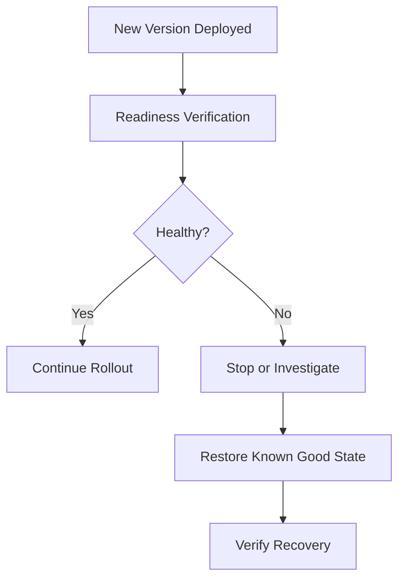

**Important:** This recovery is not automatic merely because GitHub Actions, Argo CD, and Kubernetes exist.

Automatic rollback requires an explicitly designed mechanism, and restoration may involve more than reverting an image.

For example, an incompatible database schema change may require a separate recovery strategy.

This is exactly why understanding system relationships matters more than memorizing commands.

---

# 13. Think Like a CI/CD System Designer

Now let's approach CI/CD as an architecture problem.

Imagine you are given this requirement:

> Design a delivery system for a Node.js API. Developers should receive fast feedback, production changes should be traceable, and failed deployments should be detectable and recoverable.

Do not immediately write a GitHub Actions workflow.

Start with the problem.

## Step 1: Translate the request into requirements

We need:

1. Automated validation of proposed changes.
2. A repeatable build process.
3. Versioned application artifacts.
4. A controlled release mechanism.
5. A clear record of the intended deployed version.
6. Deployment verification.
7. A defined recovery process.

## Step 2: Identify the components

Potential components:

```text id="a941am"
GitHub
GitHub Actions
Docker
Container Registry
GitOps Repository
Argo CD
Kubernetes
Monitoring System
```

At this stage, we are selecting candidate components based on responsibilities.

## Step 3: Define component relationships

Ask:

- What triggers validation?
- Which component builds the artifact?
- Where is the artifact stored?
- Who decides whether a release is allowed?
- Where is the desired production version recorded?
- Who applies deployment changes?
- How does Kubernetes obtain the artifact?
- Which component checks production behavior?
- Who initiates recovery when something fails?

These questions expose important architectural boundaries.

## Step 4: Define delivery policies

For example:

| Decision | Possible policy |
|---|---|
| When does CI run? | Every pull request and relevant branch update |
| When can code merge? | Required checks pass and review requirements are satisfied |
| When is an artifact published? | After validation of the designated source revision |
| What identifies a release? | Git commit and immutable image digest |
| Who deploys to Kubernetes? | Argo CD reconciles approved desired state |
| How is deployment success checked? | Kubernetes health plus application-level verification |
| What happens on failure? | Stop promotion and follow a defined recovery procedure |

Notice that this architecture can be described without writing YAML.

That is system-design thinking.

## Step 5: Choose an implementation

Only after understanding requirements and responsibilities should we write:

- GitHub Actions workflows
- Dockerfiles
- Kubernetes manifests
- Argo CD Applications
- Release policies
- Monitoring configurations

This will be our standard engineering approach throughout the course.

---

# 14. Practical Exercise — Design Before Implementation

**Exercise 01: Replace a Manual Deployment Process**

### Scenario

A team has three developers working on a Node.js application.

The application runs on Kubernetes.

Currently:

- Developers merge code manually.
- Testing is inconsistent.
- Docker images are built on developer laptops.
- Images sometimes use the `latest` tag.
- Production deployment uses `kubectl apply`.
- There is no formal release history.
- Rollbacks require manual investigation.

The team wants a more reliable delivery process.

### Task A: Identify the problems

Write down at least five failure scenarios.

For each failure, answer:

1. What can go wrong?
2. Why can it happen?
3. How could we detect it?
4. How could we prevent or reduce the risk?
5. What should happen if it occurs?

Do this without choosing tools.

### Task B: Design the responsibilities

Create a table:

| Responsibility | Proposed component | Reason |
|---|---|---|
| Source control | ? | ? |
| Automated validation | ? | ? |
| Artifact creation | ? | ? |
| Artifact storage | ? | ? |
| Desired deployment state | ? | ? |
| Deployment reconciliation | ? | ? |
| Runtime orchestration | ? | ? |
| Post-deployment verification | ? | ? |

You may use the tools we discussed, but justify each choice.

### Task C: Draw the architecture

Create a Mermaid diagram containing:

```text id="d7zrjj"
Developer
    |
    v
Source Repository
    |
    v
Integration and Validation
    |
    v
Versioned Artifact
    |
    v
Release Decision
    |
    v
Deployment
    |
    v
Production Verification
    |
    v
Operational Feedback
```

Decide where GitHub Actions, the registry, the GitOps repository, Argo CD, and Kubernetes belong.

### Task D: Investigate failure behavior

Assume:

```text id="a3a56n"
Build: Successful
Tests: Successful
Image Push: Successful
Deployment: Completed
Application: HTTP 500 Errors
```

Answer:

1. Did CI necessarily fail?
2. Did the deployment mechanism necessarily fail?
3. Is the release successful?
4. Which component should detect the application errors?
5. What should happen next?
6. Which additional checks could reduce the chance of recurrence?

**Do not solve this by simply adding more tests.**

Consider runtime configuration, environment dependencies, deployment strategy, observability, and recovery.

---

# 15. Memorization — Build Mental Models, Not Definitions

You mentioned that memorization is difficult, so our learning process will use active recall.

Rather than trying to memorize everything, remember a few foundational relationships.

### Mental Model 1

```text id="8gnsa6"
Development
    =
Creating Software

Delivery
    =
Making Software Available Reliably
```

### Mental Model 2

```text id="q46utx"
CI
    =
Frequent Integration
    +
Automated Validation
    +
Fast Feedback
```

### Mental Model 3

```text id="76m52t"
Continuous Delivery
    =
Releasable Software
    +
Controlled Release Process
```

### Mental Model 4

```text id="7fwcfv"
Reliable Deployment
    =
Controlled Change
    +
Verification
    +
Recovery Capability
```

These are conceptual learning models, not strict mathematical equations or complete formal definitions.

### Active recall questions

Close your notes and explain these without looking:

**Q1.** Why does an application working locally not guarantee that it will work in production?

**Q2.** What fundamental problem does Continuous Integration solve?

**Q3.** Why should we prefer deploying the same immutable artifact that was validated?

**Q4.** What is the difference between Continuous Delivery and Continuous Deployment?

**Q5.** Why is deployment success different from application success?

**Q6.** Why is GitHub Actions not the same thing as CI?

**Q7.** Why does a reliable delivery system need feedback?

**Q8.** What are the risks of deploying many unrelated changes together?

Try answering immediately after studying, again the next day, and again several days later.

The goal is to strengthen retrieval, not just familiarity.

---

# 16. Phase 01 — Engineering Takeaways

Here are the principles you should remember.

| Principle | Engineering meaning |
|---|---|
| **Code correctness is not delivery correctness** | Local success does not guarantee production success. |
| **Integration creates new failure possibilities** | Independently developed components may behave incorrectly together. |
| **Automation improves consistency** | Repeatable execution reduces variability but does not guarantee correctness. |
| **Fast feedback reduces uncertainty** | Problems discovered earlier are often easier to isolate. |
| **Artifacts need identity** | We must know exactly what was built, validated, and deployed. |
| **Deployment is not the final step** | Actual production behavior must be verified. |
| **Recovery must be designed** | A pipeline is incomplete as an operational process if failures cannot be handled. |
| **Architecture precedes tools** | Requirements should determine technology choices. |
| **CI/CD is part of DevOps** | It connects development, integration, release engineering, infrastructure, and operations. |
| **System boundaries matter** | GitHub Actions, Argo CD, Kubernetes, and monitoring have different responsibilities. |

---

# 17. Interview and System-Design Questions

After completing this phase, you should be comfortable discussing the following.

**Question 1:**

Your team already runs tests manually before every release. Why would you introduce CI?

**Question 2:**

A GitHub Actions workflow successfully builds a Docker image, but the deployed application fails. Is this a CI failure, a CD failure, or a production failure?

Explain how you would determine the answer.

**Question 3:**

Why would you avoid building a different Docker image for every deployment environment?

**Question 4:**

A company wants to deploy 20 times per day. What engineering capabilities should be considered before increasing deployment frequency?

**Question 5:**

Would you recommend Continuous Deployment for every application? What factors influence that decision?

**Question 6:**

If Argo CD successfully synchronizes Kubernetes manifests, why might additional application-level verification still be necessary?

These questions test engineering reasoning rather than command memorization.

---

# 18. Final Understanding

Return to our original question:

**Why does CI/CD exist?**

Because software delivery involves more than writing correct code.

It involves integrating changes, controlling environmental differences, validating behavior, creating identifiable artifacts, coordinating releases, deploying consistently, and responding to production failures.

As systems grow, these responsibilities become difficult to manage through inconsistent manual procedures.

CI/CD introduces engineering practices and automation to make delivery more repeatable, visible, and reliable.

But its real value comes from how the complete system is designed.

Remember this progression:

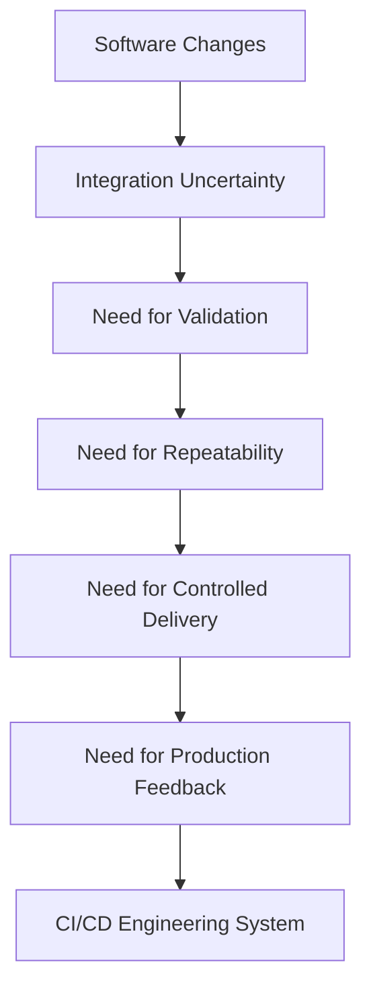

### The most important principle of Phase 01

> **CI/CD is not fundamentally about automating commands. It is about designing a reliable process for moving software changes from development into real-world operation, with validation, control, feedback, and recovery.**

Everything we study next builds on this principle.

---

## Phase 01 Complete

**Completed:** Level 1 — Phase 01: Why CI/CD Exists

**Next:** Phase 02 — Feedback and Control Systems

**File:** `Level-1-Fundamentals/Phase-02-Feedback-Control-Systems.md`

In Phase 02, we will investigate a deeper engineering question:

**How can a software delivery system detect that its actual behavior differs from its intended behavior—and what mechanisms allow it to respond?**

We will explore feedback loops, desired versus actual state, control systems, measurement, reconciliation, and the foundations of how GitOps and Argo CD operate.

**Send `next` to begin Phase 02.**