# Phase 02 — Feedback and Control Systems

**Level 1: Fundamentals | CI/CD From First Principles**

**File:** `Level-1-Fundamentals/Phase-02-Feedback-Control-Systems.md`

**Previous:** Phase 01 — Why CI/CD Exists  
**Next:** Phase 03 — Delivery Architecture

---

# 1. What Will You Learn?

In Phase 01, we established that:

> CI/CD is not fundamentally about automating commands. It is about managing software changes through validation, control, feedback, and recovery.

Now we need to understand something deeper.

**How does a system know whether it is working correctly?**

And more importantly:

**How can a system detect differences between intended behavior and actual behavior, then respond appropriately?**

These questions lead us to one of the most important concepts in modern infrastructure engineering:

**Feedback and Control Systems.**

This concept helps explain how:

- Continuous Integration provides developer feedback.
- GitHub Actions detects failed validations.
- Kubernetes maintains desired workload state.
- Argo CD reconciles Git configuration with Kubernetes.
- Monitoring detects production problems.
- Automated systems make corrective decisions.
- DevOps teams design reliable delivery architectures.

By the end of this phase, you should understand:

1. What feedback means from first principles.
2. Why automation without feedback is insufficient.
3. Open-loop versus closed-loop systems.
4. The fundamental components of a control system.
5. Desired state versus actual state.
6. How Kubernetes reconciliation works.
7. How Argo CD implements GitOps reconciliation.
8. How CI feedback differs from CD reconciliation.
9. Why monitoring alone does not guarantee reliability.
10. How to design feedback loops for production systems.

Our central question is:

> **What is the difference between a system that executes instructions and a system that continuously checks whether its intended outcome has been achieved?**

---

# 2. First Principle: Executing an Action Does Not Guarantee an Outcome

Imagine you want to deploy a Node.js application to Kubernetes.

You execute:

```bash
kubectl apply -f deployment.yaml
```

The command succeeds.

Does this mean your application is running correctly?

Not necessarily.

The command may successfully submit the desired configuration to Kubernetes.

But several things can happen afterward.

The container image may not exist.

The application may crash.

The readiness probe may fail.

The database connection may be unavailable.

Or the Pods may run successfully while important API endpoints return errors.

This gives us our first principle:

> **Successfully executing an action is not the same as achieving the intended outcome.**

Consider the following process.

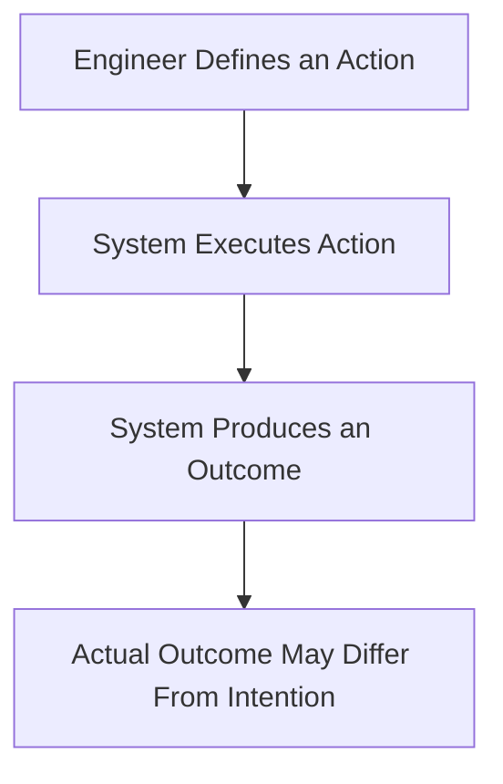

The problem is simple.

We know what action was requested.

But we do not necessarily know whether the desired outcome occurred.

To solve this, we need a way to observe the result.

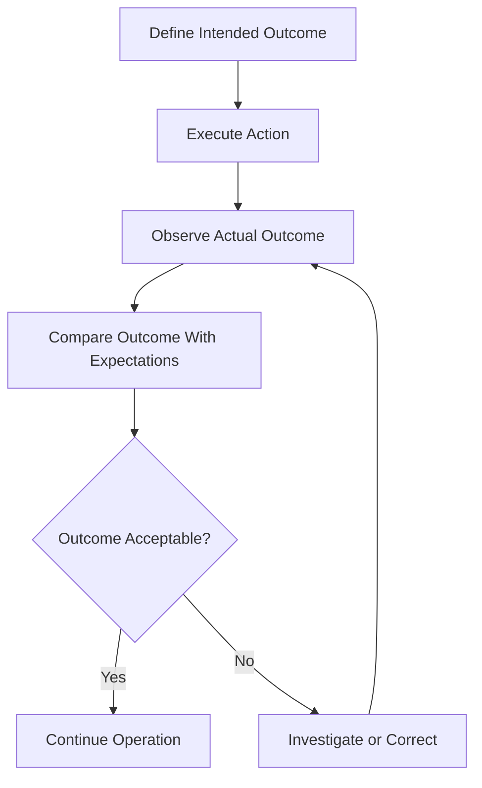

Notice the new components:

1. Observation
2. Comparison
3. Decision
4. Corrective action

These form the foundation of feedback-based control.

However, this diagram is still only a simplified model. Whether correction should automatically repeat depends on the problem, the available evidence, and the risk of repeating an action.

---

# 3. Deriving Feedback Systems From Everyday Life

Before understanding Kubernetes or Argo CD, consider a familiar system.

## 3.1 Example: Maintaining Room Temperature

Imagine a room.

You want the temperature to remain at 24°C.

Outside conditions change throughout the day.

Sometimes the room becomes warmer.

Sometimes it becomes cooler.

If you simply turn on an air conditioner for 30 minutes, you are executing a fixed action.

But will the room remain at 24°C?

No guarantee.

The room's temperature depends on:

- Outside temperature
- Heat entering through windows
- Number of people inside
- Air conditioner capacity
- Insulation
- Airflow

Therefore, operating the air conditioner for a fixed duration does not guarantee the desired temperature.

### What is actually required?

A mechanism that:

1. Knows the desired temperature.
2. Measures the actual temperature.
3. Compares both values.
4. Decides whether cooling is necessary.
5. Controls the air conditioner.
6. Continues observing the room.

This is a feedback control system.

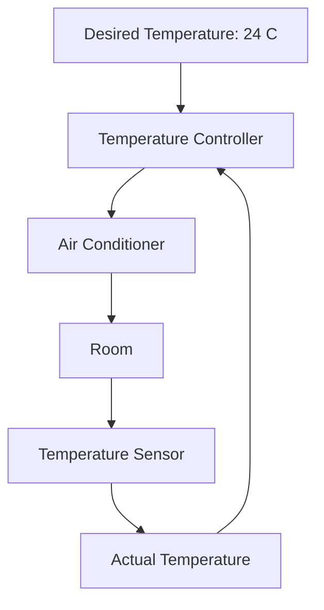

The controller continuously receives information about the room.

If the room becomes too warm, it increases cooling or turns cooling on.

If the room becomes sufficiently cool, it reduces cooling or turns cooling off.

The exact behavior depends on the controller design.

### Fundamental insight

The system does not merely execute instructions.

It repeatedly evaluates whether the environment satisfies its intended condition.

That distinction becomes extremely important in DevOps.

---

# 4. Open-Loop Systems vs Closed-Loop Systems

Now we can introduce two fundamental engineering models.

## 4.1 Open-Loop System

An open-loop system executes actions without using measured output to adjust those actions.

For example:

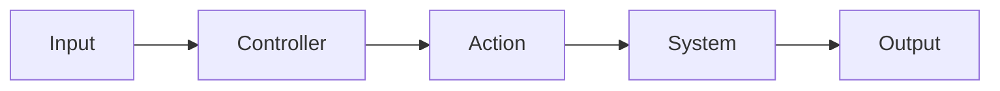

The system receives an instruction.

It performs an action.

An output is produced.

But the output is not used to influence the controller.

### CI/CD example

Imagine a deployment script:

```bash
docker build -t myapp:v1 .
docker push registry.example.com/myapp:v1

kubectl set image deployment/myapp \
  myapp=registry.example.com/myapp:v1
```

The script builds an image, publishes it, and requests a deployment update.

But it does not check:

- Whether the rollout completes.
- Whether the Pods become ready.
- Whether the application serves requests successfully.
- Whether production errors increase.
- Whether the release should be stopped.

With respect to application health, this is an open-loop delivery process.

**Important distinction:** Kubernetes may still run its own internal control loops. Calling this script open-loop does not mean the entire Kubernetes platform lacks feedback.

It means this particular deployment process does not use application-health feedback to make decisions.

---

## 4.2 Closed-Loop System

A closed-loop system uses observations of its output to influence subsequent actions.

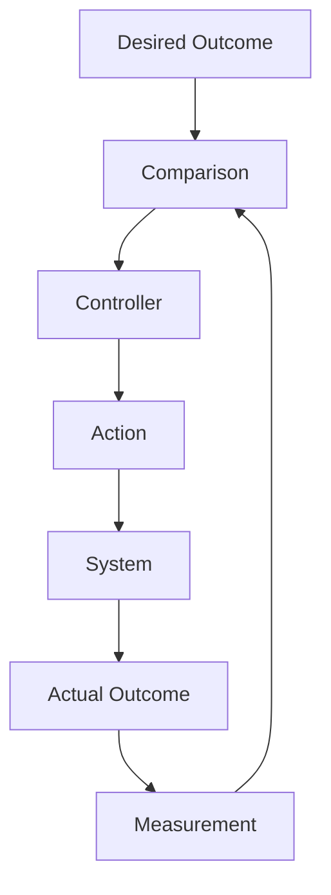

The system repeatedly asks:

**Is the current outcome acceptable?**

If not, the controller determines whether a corrective action is possible and appropriate.

### CI/CD example

Imagine a deployment process:

```text
Build Application
        |
        v
Run Tests
        |
        v
Publish Artifact
        |
        v
Deploy Application
        |
        v
Check Deployment Health
        |
        v
Check Application Metrics
        |
        v
Accept or Investigate Release
```

Now the delivery process incorporates observations.

If the application becomes unhealthy, the system can produce an alert or trigger a defined recovery action.

If the system also uses those observations to automatically control the deployment, it implements a closed-loop control mechanism for that decision.

### Comparison

| Property | Open-loop process | Closed-loop process |
|---|---|---|
| Executes actions | Yes | Yes |
| Measures relevant outcomes | Not required | Yes |
| Compares outcomes against expectations | Not required | Yes |
| Uses observations to adjust actions | No | Yes |
| Responds to disturbances | Only through predefined behavior | Can respond using feedback |
| Requires careful control design | Yes | Yes |

### Important lesson

Closed-loop systems are not automatically safe.

A poorly designed feedback mechanism can create:

- Repeated failures
- Unnecessary changes
- Excessive resource consumption
- Conflicting corrective actions
- Oscillation between states

We will examine these problems later in this phase.

---

# 5. The Five Fundamental Components of a Control System

To understand Kubernetes, GitOps, and delivery automation, learn these five concepts.

## Component 1: Desired State

The condition the system is expected to achieve.

Examples:

```text
Application replicas = 3

Container image = version 2.0

Application availability >= 99.9%

HTTP error rate < 1%
```

These examples represent different kinds of desired conditions.

Some describe infrastructure configuration.

Others describe operational performance.

They are not necessarily controlled by the same controller.

---

## Component 2: Actual State

The condition the system is currently in.

Examples:

```text
Running replicas = 2

Deployment image = version 1.9

Application availability = 98.5%

HTTP error rate = 4%
```

Actual state must be determined through observation.

Different systems expose different observations.

For example:

```bash
kubectl get deployment myapp
```

Might reveal:

```text
NAME    READY   UP-TO-DATE   AVAILABLE
myapp   2/3     3            2
```

This tells us something about Kubernetes deployment status.

It does not tell us whether every API endpoint works correctly.

---

## Component 3: Sensor or Observer

A sensor collects information about the system.

In DevOps, observers can include:

- Kubernetes API observations
- Readiness probes
- GitHub Actions job results
- Application logs
- Prometheus metrics
- Synthetic HTTP checks
- Distributed traces

Different sensors answer different questions.

For example:

| Observer | Information |
|---|---|
| GitHub Actions | Test and build results |
| Kubernetes API | Resource specifications and reported status |
| Argo CD | Desired/live resource differences and resource health |
| Prometheus | Collected operational metrics |
| Application logs | Recorded application events |
| HTTP health endpoint | Result of a defined health check |

The observer must measure something relevant to the desired outcome.

A poor measurement can lead to incorrect decisions.

---

## Component 4: Controller

The controller compares observed conditions against desired conditions and determines what action is necessary.

Conceptually:

```text
Desired State
      |
      v
  Controller <----- Actual State
      |
      v
Corrective Action
```

Examples:

- Kubernetes Deployment controller
- Kubernetes ReplicaSet controller
- Argo CD application controller
- Horizontal Pod Autoscaler
- Deployment automation using health signals

Not every system that produces feedback is itself an automated controller.

For example, GitHub Actions may report a failing test, leaving the developer to decide and implement the correction.

In that case, the developer participates in the overall feedback loop.

---

## Component 5: Actuator

An actuator performs the corrective action selected by the controller.

Examples include:

- Creating Pods
- Deleting Pods
- Updating Kubernetes resources
- Adjusting replica counts
- Starting or stopping a rollout
- Changing traffic allocation

A controller decides what should change.

An actuator performs or initiates that change.

In software systems, these roles are often implemented by interacting components rather than physically separate devices.

---

# 6. Understanding the Complete Control Loop

Let's combine the components.

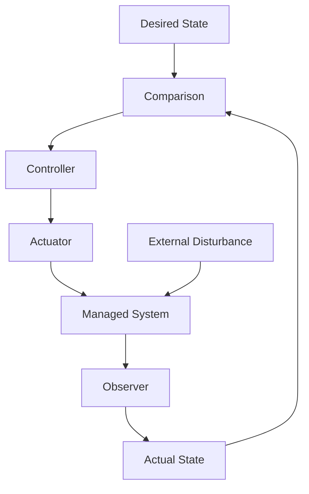

### Step 1: Define the desired state

Example:

```text
Required application replicas = 3
```

### Step 2: Observe the actual state

Example:

```text
Available application replicas = 2
```

### Step 3: Compare

For a numeric value, we can express the difference as:

```text
Error = Desired Value - Measured Value
```

In our example:

```text
Error = 3 - 2

Error = 1
```

The system has one fewer available replica than desired.

However, available replicas are an outcome measurement. The Deployment controller's actions depend on the relevant Kubernetes specifications and observed resource states, not simply this arithmetic expression.

### Step 4: Determine corrective action

The system must determine why capacity is below the desired level.

For example, the ReplicaSet may need to create a replacement Pod.

### Step 5: Execute the action

The controller requests the necessary changes through the Kubernetes API.

Other Kubernetes components schedule and run the workload.

### Step 6: Observe again

The system checks whether the desired condition has been achieved.

This process is called a **control loop**.

In Kubernetes, controllers observe cluster state and work to move relevant resources toward their desired state. [Kubernetes](https://kubernetes.io/docs/concepts/architecture/controller/?utm_source=chatgpt.com)

---

# 7. Why Desired State Is More Powerful Than a Sequence of Commands

This is a major architectural principle.

Consider two approaches to managing infrastructure.

## Approach A: Imperative Instructions

Imperative management focuses on the actions to perform.

Example:

```bash
kubectl scale deployment myapp --replicas=3
```

You are telling Kubernetes:

> Set this Deployment's desired replica count to three.

You are requesting a specific action that modifies the resource configuration.

The command itself is not responsible for continuously ensuring the desired number of replicas exists.

Kubernetes controllers perform that ongoing work.

### The limitation of an imperative workflow

If the desired configuration exists only in a deployment script or someone's memory, it becomes difficult to answer:

- What should the system look like tomorrow?
- Is the current state correct?
- Who changed the replica count?
- How should unexpected changes be corrected?
- What happens when two operators make conflicting changes?

The problem is not that imperative commands are inherently wrong.

The problem is relying on commands alone as the long-term source of truth.

---

## Approach B: Declarative Desired State

Declarative management describes the state the system should maintain.

For example:

```yaml
apiVersion: apps/v1
kind: Deployment
metadata:
  name: myapp
spec:
  replicas: 3
  selector:
    matchLabels:
      app: myapp
  template:
    metadata:
      labels:
        app: myapp
    spec:
      containers:
        - name: myapp
          image: nginx:1.27
          ports:
            - containerPort: 80
```

This configuration declares:

```text
I want a Deployment named myapp.

Its Pod template should use the specified image.

The desired replica count should be three.
```

The Kubernetes controllers work to maintain the resource conditions represented by that configuration.

### Fundamental difference

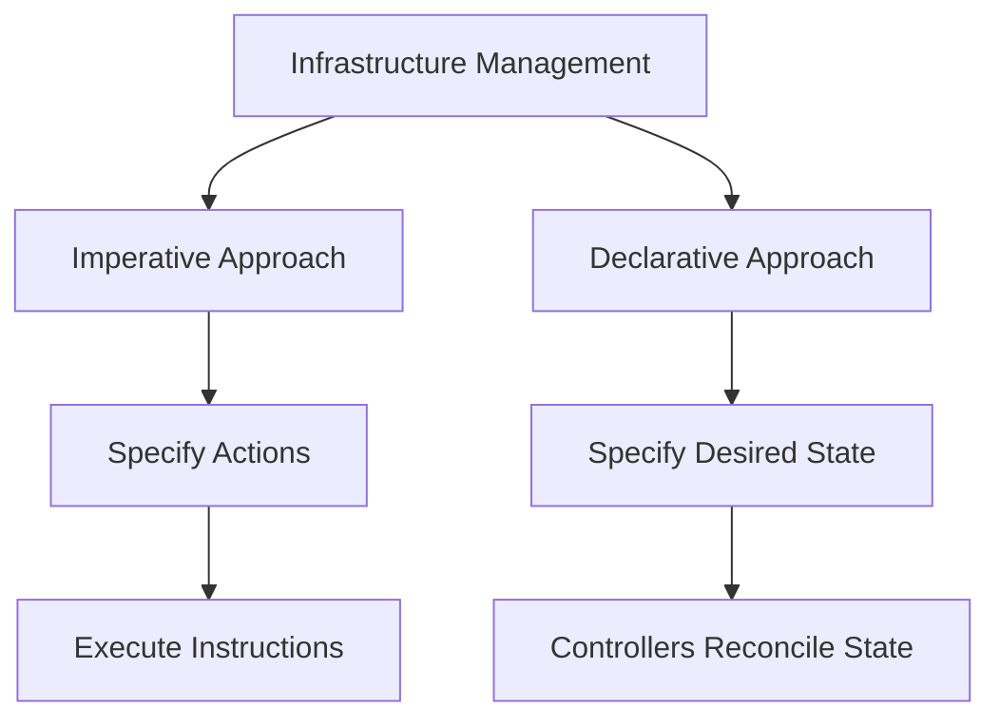

**Important:** Kubernetes can maintain a declaratively specified workload after an imperative command changes it.

Imperative and declarative are ways of expressing and managing intent. They are not necessarily two entirely different execution engines.

### System-design insight

Declarative configurations provide a stable reference point for reconciliation.

That enables a system to repeatedly answer:

> Does the observed configuration match the intended configuration?

This principle is foundational to both Kubernetes and GitOps.

---

# 8. Kubernetes as a System of Control Loops

Now let's connect our control-system model to Kubernetes.

Kubernetes is not merely a tool that starts containers.

It contains controllers that continuously work toward declared resource states.

## 8.1 A simple example

You define:

```yaml
spec:
  replicas: 3
```

Kubernetes eventually creates three Pods, assuming the necessary resources and conditions are available.

Now imagine a node fails.

One Pod becomes unavailable.

What should happen?

Without reconciliation, the system could remain degraded until a human intervenes.

With Kubernetes controllers, the platform can detect changes and create replacement Pods to restore the desired workload state.

The exact behavior depends on which controller manages the workload, node conditions, scheduling constraints, and other factors.

---

## 8.2 The Kubernetes reconciliation model

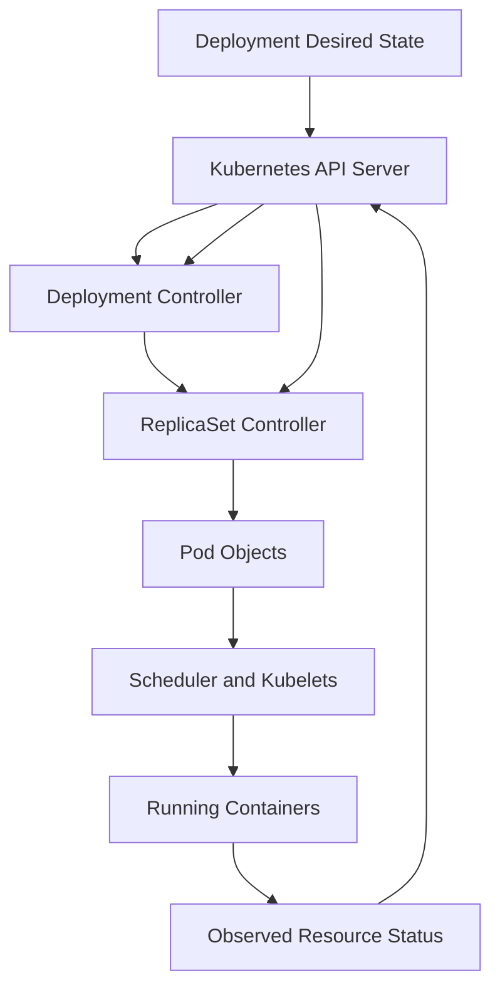

This diagram represents the relationship between major components, not a complete sequence of every internal Kubernetes operation.

Let's understand the responsibilities.

### Deployment controller

Manages the desired Deployment configuration and the ReplicaSets associated with it.

### ReplicaSet controller

Works to maintain the desired number of Pods for its ReplicaSet.

### Scheduler

Assigns unscheduled Pods to appropriate nodes.

### Kubelet

Works to run and manage assigned Pods on a node.

### API server

Provides the interface through which Kubernetes objects and their states are accessed and modified.

The important point:

**Kubernetes uses multiple specialized control loops rather than one controller performing every operation.**

The official Kubernetes architecture describes controllers as mechanisms that watch cluster state and make changes to bring the current state closer to the desired state. [Kubernetes](https://kubernetes.io/docs/concepts/architecture/controller/?utm_source=chatgpt.com)

---

# 9. Reconciliation: The Heart of Kubernetes and GitOps

You will encounter the word **reconciliation** repeatedly in Kubernetes, Argo CD, Terraform-related discussions, and cloud infrastructure engineering.

Let's derive its meaning.

Suppose we have:

```text
Desired replicas = 3

Actual replicas = 2
```

The desired and actual states do not match.

A controller needs to determine what action will reduce that difference.

This is reconciliation.

Conceptually:

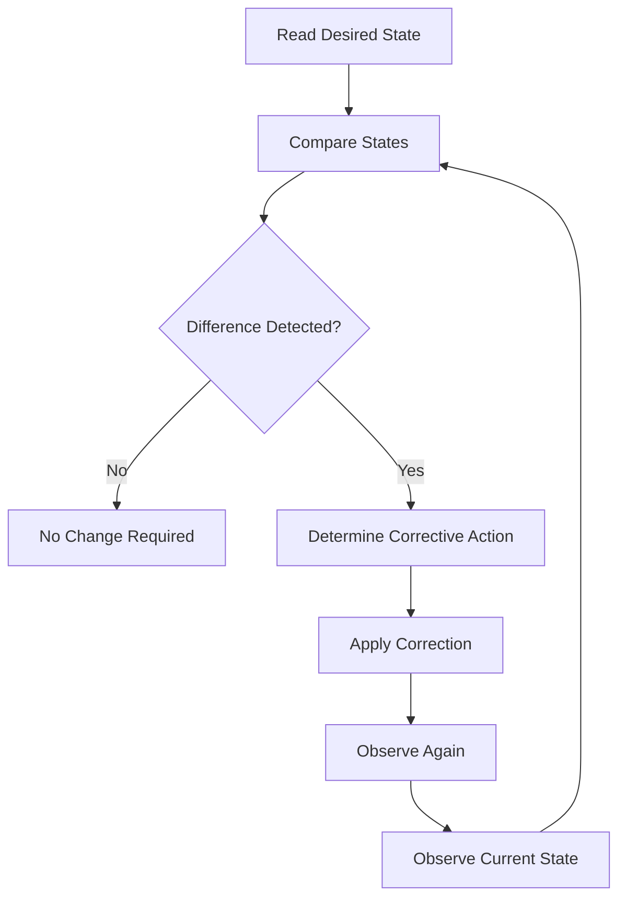

## 9.1 Why reconciliation matters

Imagine a system that does not continuously reconcile state.

A developer deploys three replicas.

Later, a node fails.

One replica disappears.

If nobody notices, the system remains degraded.

With reconciliation, the platform attempts to restore the intended workload conditions.

This is useful because production environments are dynamic.

Failures and unexpected changes are normal engineering conditions.

Systems must be designed to tolerate and respond to them.

---

## 9.2 Reconciliation is not always successful

A controller may repeatedly attempt to achieve the desired state without succeeding.

For example:

```text
Desired replicas = 3

Available replicas = 2
```

But the Kubernetes cluster lacks enough resources for the third replica.

The controller cannot create capacity from nothing.

It may create a pending Pod, but scheduling cannot complete.

### Important principle

> A controller can attempt to restore desired state, but reconciliation cannot overcome every infrastructure, configuration, or application constraint.

This is why feedback must include failure reporting.

A good control system must distinguish between:

- A state that is temporarily changing.
- A state that has converged.
- A state that cannot converge.
- A state that appears correct but produces unacceptable business outcomes.

---

# 10. Why GitOps Is Built Around Feedback and Reconciliation

Now let's connect this to Argo CD.

Imagine we store our desired Kubernetes configuration in Git.

For example:

```text
gitops-repository/
└── applications/
    └── myapp/
        └── deployment.yaml
```

The Deployment specifies:

```yaml
spec:
  replicas: 3
```

Git contains the desired configuration.

Kubernetes contains the live resources.

Who ensures they match?

This is where Argo CD enters.

---

## 10.1 Argo CD as a Reconciliation Controller

Argo CD compares the desired manifests generated from Git with the live resources in Kubernetes.

When differences exist, Argo CD can synchronize the resources according to its configured policies.

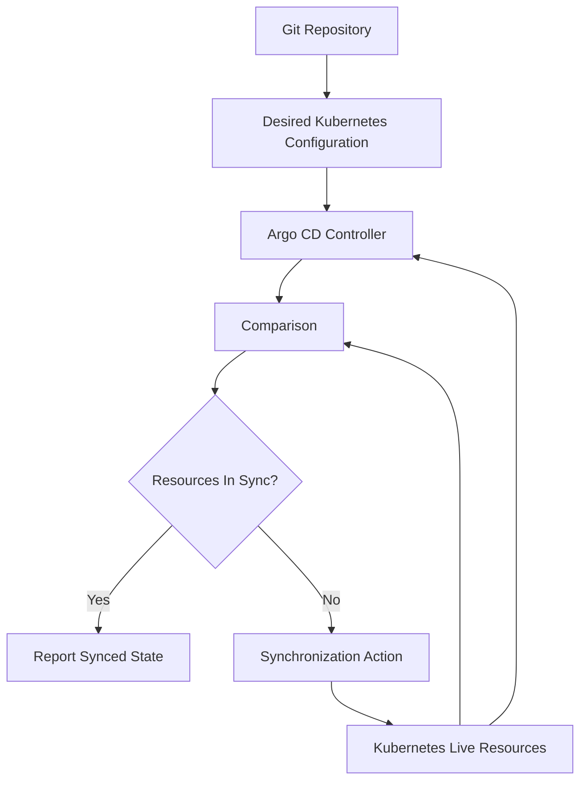

This is conceptually similar to the thermostat.

| Temperature-control system | Argo CD |
|---|---|
| Desired temperature | Desired Kubernetes manifests in Git |
| Temperature sensor | Observation of live Kubernetes resources |
| Controller | Argo CD application controller |
| Corrective action | Kubernetes resource synchronization |
| Actual temperature | Live Kubernetes resource state |
| Temperature deviation | Configuration drift |

Argo CD supports automated synchronization when desired Git manifests differ from the live cluster state. [Argo CD](https://argo-cd.readthedocs.io/en/stable/user-guide/auto_sync/?utm_source=chatgpt.com)

However, automated synchronization and automatic self-healing are policy-dependent.

We must understand that distinction.

---

# 11. Understanding Configuration Drift

Configuration drift is a key concept in GitOps.

Suppose Git specifies:

```yaml
spec:
  replicas: 3
```

But an engineer executes:

```bash
kubectl scale deployment myapp --replicas=5
```

The live Deployment now specifies five replicas.

We have:

```text
Git Desired State = 3

Kubernetes Deployment Spec = 5
```

This is a configuration difference.

### Why is it a problem?

Not every manual change is harmful.

Perhaps the engineer scaled the application during an incident.

The problem is that we now have two different expressions of the intended configuration.

Which one should be authoritative?

Without clear ownership, different systems or operators may repeatedly overwrite each other's decisions.

---

## 11.1 How Argo CD detects drift

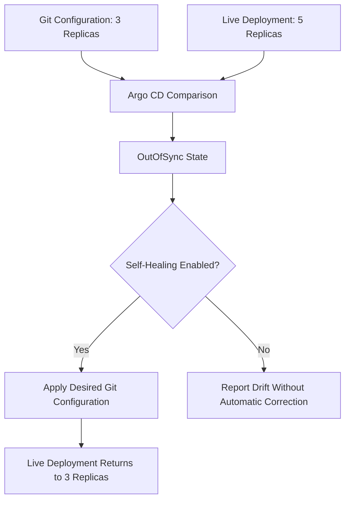

For this example, assume automatic synchronization and self-healing are both enabled and no other controller is intentionally managing the same field.

Argo CD can restore the Deployment specification to the value declared in Git.

### Critical distinction

If self-healing is not enabled, Argo CD may detect and report the difference without automatically correcting that particular live-state change.

Enabling automated sync does not mean every kind of drift will always be automatically corrected.

Argo CD documents self-healing and automated synchronization as distinct controls. [Argo CD](https://argo-cd.readthedocs.io/en/stable/user-guide/auto_sync/?utm_source=chatgpt.com)

---

# 12. How Argo CD and Kubernetes Work Together

This is an important part of system-design thinking.

Both Argo CD and Kubernetes perform reconciliation.

But they reconcile different things.

## 12.1 Argo CD's responsibility

Argo CD works to align managed Kubernetes resources with the desired manifests stored in Git.

For example:

```text
Git specifies:

Deployment image = v2
Replicas = 3
```

Argo CD can apply that desired configuration to the Kubernetes API.

## 12.2 Kubernetes' responsibility

Kubernetes controllers work to realize the desired resource state inside the cluster.

For example:

```text
Deployment replicas = 3
```

The Deployment and ReplicaSet controllers work toward the required Pods.

The scheduler and kubelets participate in placing and running those Pods.

## 12.3 Combined architecture

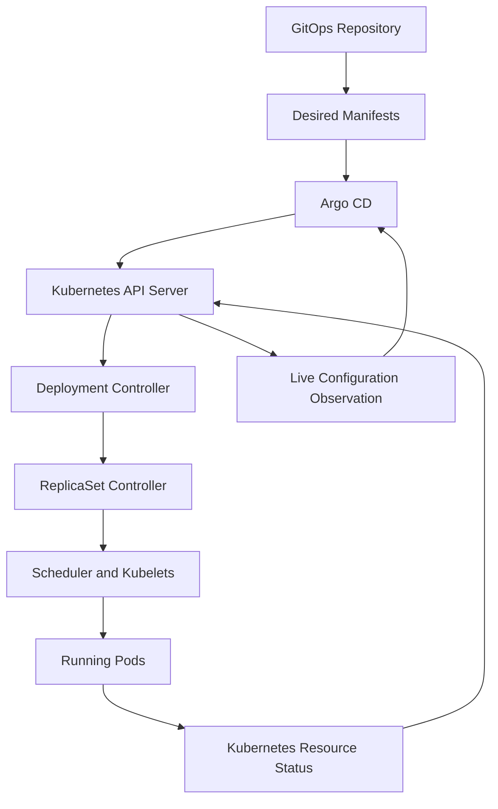

This architecture contains multiple interacting feedback loops.

### Loop 1: GitOps reconciliation

```text
Git Desired Configuration
          |
          v
        Argo CD
          |
          v
Kubernetes Resource Configuration
          |
          v
   Live-State Observation
          |
          v
        Argo CD
```

Argo CD checks whether managed Kubernetes resources match the desired Git configuration.

### Loop 2: Kubernetes reconciliation

```text
Deployment Specification
          |
          v
Kubernetes Controllers
          |
          v
      Running Pods
          |
          v
  Observed Pod State
          |
          v
Kubernetes Controllers
```

Kubernetes works to maintain the required workload resources.

### Why are two loops useful?

Because they solve different problems.

Argo CD addresses:

**Does the live Kubernetes configuration match our declared deployment configuration?**

Kubernetes addresses:

**Are the resources and workloads being maintained according to their Kubernetes specifications?**

Neither question alone establishes that users are receiving correct responses.

That requires another layer of observation.

---

# 13. A Third Feedback Loop: Application Reliability

Suppose Argo CD reports:

```text
Sync Status: Synced
```

And Kubernetes reports:

```text
3/3 Pods Ready
```

But users are receiving HTTP 500 errors.

What happened?

The infrastructure may have reached its declared configuration.

The Pods may satisfy their configured readiness checks.

Yet the application may not satisfy business requirements.

This reveals a crucial distinction.

## Configuration correctness vs operational correctness

### Configuration correctness

The live infrastructure matches the declared configuration.

### Operational correctness

The application behaves acceptably for users and business operations.

These are related but not equivalent.

A system can be correctly configured and still deliver incorrect results.

---

## 13.1 Application-level feedback

We need additional observations.

For example:

```text
HTTP error rate
Request latency
Successful transactions
Database query failures
User authentication failures
```

These can be collected using application instrumentation, logs, metrics, and synthetic checks.

A monitoring system such as Prometheus may collect relevant metrics.

An alerting or analysis mechanism can compare those metrics against thresholds or service objectives.

But monitoring alone does not perform recovery.

We need a defined response mechanism.

---

## 13.2 Combining the feedback layers

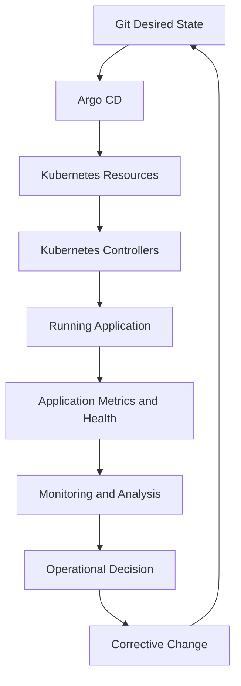

Here, the corrective change is made through Git.

That is an intentional architectural decision.

For example, if a release is unhealthy, the team or an authorized release controller may update Git to restore the previously approved image digest.

Argo CD then reconciles the new desired configuration.

This preserves the GitOps model.

The diagram does not imply that Prometheus automatically changes Git or that Argo CD automatically performs application-aware rollbacks.

Those capabilities must be explicitly implemented.

---

# 14. GitHub Actions and Feedback Systems

Now let's examine CI.

We have discussed continuous controllers such as Kubernetes and Argo CD.

But CI operates differently.

GitHub Actions typically executes workflows in response to defined events.

For example:

```text
Developer Pushes Code
          |
          v
GitHub Actions Workflow
          |
          v
Build and Test
          |
          v
Report Results
```

This is not the same as continuously reconciling desired infrastructure state.

It is primarily an event-triggered validation process.

---

## 14.1 Feedback in Continuous Integration

Imagine a developer opens a pull request.

GitHub Actions starts running tests.

One test fails.

The developer receives a failure result.

The developer fixes the problem.

The tests run again.

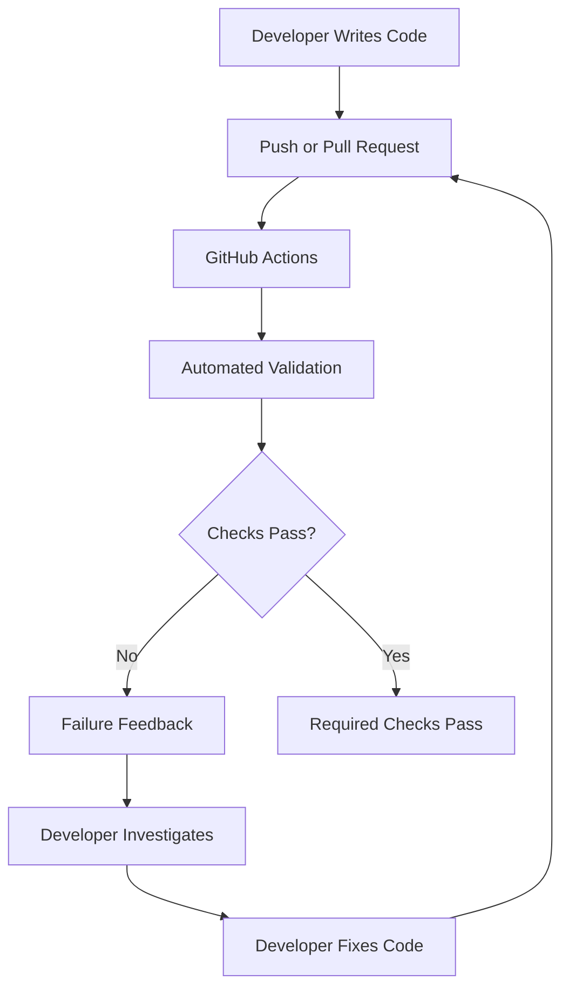

Notice something interesting.

The developer is part of the feedback loop.

GitHub Actions detects the failure.

It does not normally understand how to correct arbitrary application bugs.

The developer uses the results to determine an appropriate change.

### Fundamental insight

> Feedback does not always require automatic correction. A human can be the decision-making component of a feedback loop.

This is common in software engineering.

CI creates evidence.

Developers interpret that evidence and make corrections.

---

# 15. CI Feedback vs GitOps Reconciliation

Both systems use feedback.

But their operational models differ.

| Aspect | GitHub Actions CI | Argo CD GitOps |
|---|---|---|
| Primary objective | Validate software changes | Align Kubernetes resources with desired Git configuration |
| Main input | Source changes and workflow events | Desired manifests and observed live resources |
| Typical trigger | Push, pull request, manual or scheduled event | Reconciliation and detected changes |
| Main output | Test/build results and artifacts | Synchronization status and managed resource changes |
| Detects | Failed configured validations | Differences between desired and live managed resources |
| Typical corrective actor | Developer or automation | Argo CD synchronization controller |
| Continuous reconciliation | Not inherent to ordinary CI workflows | Core architectural behavior |
| Main responsibility | Change validation | Deployment-state reconciliation |

Let's make the separation even clearer.

### CI asks:

**Is this software change sufficiently validated to move forward?**

### GitOps asks:

**Does the deployed resource configuration match the approved desired configuration?**

### Kubernetes asks:

**Are the managed workloads being maintained according to their specifications?**

### Observability asks:

**What is actually happening in the running system?**

### Release engineering asks:

**Should this version remain deployed, be promoted, or be replaced?**

These questions belong to different engineering responsibilities.

Understanding their boundaries is much more important than knowing which YAML keywords configure them.

---

# 16. Putting Everything Together: A CI/CD Feedback Architecture

Now we can design a complete conceptual architecture.

Our requirements are:

1. Validate software changes.
2. Build immutable artifacts.
3. Maintain approved desired deployment configuration.
4. Reconcile Kubernetes resources.
5. Verify production behavior.
6. Support corrective action.

A possible architecture is:

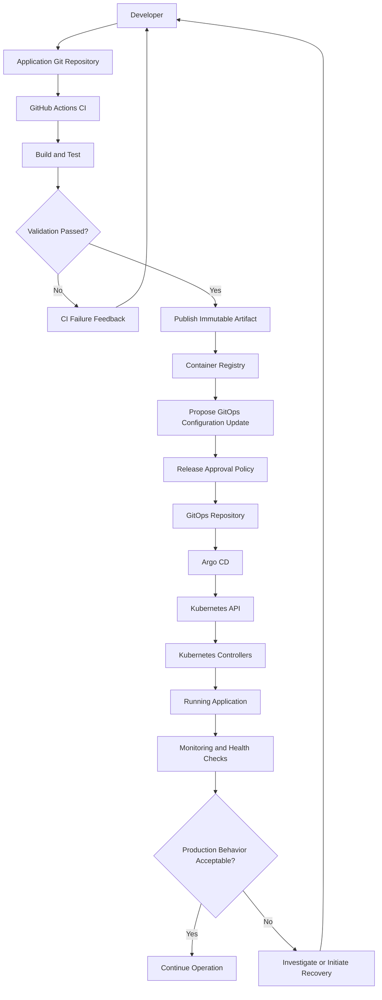

This diagram is conceptual.

The release approval policy must actually accept the proposed change before the GitOps repository is updated. The diagram represents that responsibility without prescribing a particular approval implementation.

Similarly, the container registry stores the image artifact. During deployment, Kubernetes nodes obtain the image from the registry when needed.

The important architecture contains three major forms of feedback.

## Feedback Loop 1: Developer feedback

```text
Source Change
     |
     v
CI Validation
     |
     v
Test Results
     |
     v
Developer Correction
```

Purpose:

**Detect problems before changes are released.**

## Feedback Loop 2: Configuration reconciliation

```text
Git Desired State
     |
     v
Argo CD
     |
     v
Kubernetes Resources
     |
     v
Observed Live Configuration
     |
     v
Argo CD
```

Purpose:

**Maintain consistency between approved configuration and managed live resources.**

## Feedback Loop 3: Operational feedback

```text
Running Application
     |
     v
Metrics and Health Checks
     |
     v
Evaluation
     |
     v
Operational Decision
     |
     v
Corrective Action
```

Purpose:

**Detect unacceptable production behavior and support recovery.**

### Most important insight

These loops are connected, but they are not identical.

A system can pass CI while failing during deployment.

A system can be synchronized by Argo CD while experiencing application errors.

A system can have healthy Pods while failing business transactions.

Therefore, reliable delivery requires multiple forms of evidence.

---

# 17. System-Design Problem: What Happens When Feedback Is Wrong?

So far, we have assumed that observers report useful information.

But what if measurements are incorrect?

Imagine your application exposes:

```text
/health
```

The endpoint always returns:

```json
{
  "status": "healthy"
}
```

Even when the database is unavailable.

The monitoring system observes:

```text
HTTP 200
```

It concludes that the health check passed.

But the application is unable to process requests requiring PostgreSQL.

### What is the underlying problem?

The measurement does not represent the intended operational condition.

The controller or operator may receive accurate information about the health endpoint while drawing an incorrect conclusion about the overall application.

### First-principles lesson

> A feedback system is only as useful as the relationship between what it measures and what it is trying to control.

This introduces the idea of **observability quality**.

We need to choose signals based on the questions we want answered.

For example:

| Engineering question | Useful signal |
|---|---|
| Is the process running? | Process and container status |
| Can the application accept traffic? | Readiness checks |
| Are API requests succeeding? | Request success and error metrics |
| Can critical workflows complete? | Synthetic transaction checks |
| Is the database responding? | Relevant database connectivity and query measurements |
| Is the service meeting latency objectives? | Request latency measurements |

No single measurement guarantees complete correctness.

We need enough complementary evidence to make informed operational decisions.

---

# 18. Feedback Delay: Why Timing Matters

Imagine a deployment occurs at 10:00.

The new version introduces a serious bug.

But application monitoring only evaluates the problem at 10:30.

For 30 minutes, users may experience failures before the problem is identified.

This is a feedback delay.

A control system receives information after some amount of time.

That delay influences how quickly the system can respond.

## 18.1 Different feedback timescales

| Feedback mechanism | Typical timing model |
|---|---|
| Unit tests | During CI execution |
| Pull-request validation | After relevant repository events |
| Kubernetes reconciliation | Event-driven and repeated controller processing |
| Argo CD reconciliation | Repeated comparison and refresh behavior |
| Application metrics | Based on collection and evaluation intervals |
| Human incident response | Depends on detection, investigation, and decisions |

Exact timing depends on configuration and operating conditions.

### Why delays matter

Suppose an application is deployed and immediately begins producing errors.

If the release process waits for meaningful health evidence before increasing user exposure, the potential impact may be reduced.

If the deployment completes and nobody examines production behavior, failures may remain undetected longer.

The goal is not to make every feedback loop run as frequently as possible.

Excessive polling and poorly designed retries can waste resources or increase instability.

The goal is:

**Make feedback timely enough for the risk being controlled.**

---

# 19. Control-System Failures in Production

A feedback system can create problems if it is designed incorrectly.

Let's examine three important scenarios.

## Failure 1: Conflicting Controllers

Imagine a Kubernetes Deployment.

Git specifies:

```yaml
spec:
  replicas: 3
```

Argo CD is configured to self-heal changes.

At the same time, another controller, such as a Horizontal Pod Autoscaler, needs to adjust the replica count based on load.

Now two systems may attempt to influence the same field.

One is trying to enforce a fixed Git value.

The other is trying to change that value dynamically.

Depending on the ownership and configuration, the systems may conflict.

### Why does this happen?

Both systems are attempting to control related state.

Their objectives are not coordinated.

### Engineering solution

Define clear control ownership.

For example, the Deployment configuration can avoid continuously enforcing a fixed replica count when an HPA is intentionally responsible for dynamic scaling.

Argo CD can also be configured to account for appropriately managed differences.

The deeper principle is:

> Multiple controllers should not independently fight for authority over the same state.

---

## Failure 2: Repeated Actions Without Progress

Suppose a Kubernetes workload cannot start because its container image does not exist.

A controller repeatedly attempts to maintain the desired workload.

But the underlying problem remains.

More retries do not create the missing image.

### Why does this happen?

The problem cannot be solved through repetition of the same corrective action.

### Engineering lesson

Feedback systems need mechanisms to recognize persistent failure.

Possible responses include:

- Reporting a failed condition
- Using retry limits where appropriate
- Applying backoff
- Raising alerts
- Requiring human investigation
- Stopping unsafe promotion

Repeated action is not equivalent to progress.

---

## Failure 3: Correcting the Wrong State

Imagine production error rates increase.

An automated controller assumes every error increase is caused by the newest application version.

It immediately rolls back.

But the actual cause is an external database outage.

The rollback does not fix the problem.

It may also introduce unnecessary changes during an incident.

### Why does this happen?

The controller has observed a symptom but incorrectly inferred the cause.

This is why the distinction between **detection** and **diagnosis** is important.

### Detection

Something is wrong.

### Diagnosis

What is causing the problem?

### Correction

What action is likely to restore acceptable operation?

A reliable system should not assume these are identical tasks.

---

# 20. Real-World Case Study: A Failed Release Through GitOps

Let's construct a realistic incident.

## Scenario

You maintain a Node.js application running on Kubernetes.

Your delivery architecture uses:

- GitHub
- GitHub Actions
- Docker
- Container registry
- GitOps repository
- Argo CD
- Kubernetes
- Prometheus

A developer introduces version `v2`.

Version `v1` is currently running successfully.

---

## Step 1: The developer creates a change

A pull request is opened.

GitHub Actions runs validation.

```text
TypeScript Compilation: Passed

Unit Tests: Passed

Integration Tests: Passed

Container Build: Passed
```

The CI process succeeds.

### What have we learned?

The configured tests and build checks passed.

We have not proven that `v2` will function correctly in production.

---

## Step 2: The artifact is published

The pipeline builds and publishes an immutable container image.

For example:

```text
registry.example.com/myapp@sha256:<digest>
```

The digest uniquely identifies the image content.

This allows the release process to reference the exact built artifact.

---

## Step 3: GitOps configuration is updated

The approved GitOps configuration changes from the digest associated with `v1` to the digest associated with `v2`.

Conceptually:

```text
Previous desired release: v1 image digest

New desired release: v2 image digest
```

Git records the configuration change.

The team can identify which Git revision introduced the new desired release.

---

## Step 4: Argo CD detects the change

Argo CD refreshes its view of desired configuration and live Kubernetes resources.

It detects that the desired configuration differs from the live Deployment.

The Application becomes OutOfSync.

If automated synchronization is enabled and the relevant conditions permit synchronization, Argo CD applies the approved configuration.

---

## Step 5: Kubernetes performs the rollout

The Deployment controller manages the transition toward the new Pod template.

New Pods are created.

Old Pods are removed according to the Deployment strategy and rollout progress.

Suppose all new Pods become ready.

Kubernetes may report a successful rollout.

Argo CD may report the application as Synced and Healthy according to its resource-health assessment.

---

## Step 6: Production metrics reveal a problem

Five minutes later, application monitoring reports:

```text
HTTP 500 error rate: 8%
```

The team's acceptable error threshold is:

```text
HTTP 500 error rate: < 1%
```

This is an unacceptable operational outcome.

### What failed?

We should not immediately conclude that the CI system was defective or that Kubernetes deployment failed.

We need to investigate.

The problem may be:

- Missing test coverage
- Production-only configuration
- Incorrect business logic
- Dependency incompatibility
- Database behavior
- Unexpected production traffic

---

## Step 7: The release response is initiated

The team's release procedure requires investigation and, when appropriate, restoration of the previously approved version.

One possible recovery action is:

```text
Update GitOps desired image digest back to v1
```

The change is approved according to the team's emergency release policy.

Argo CD detects the new desired configuration.

It reconciles the Deployment.

Kubernetes performs another rollout.

The team then verifies that application behavior has recovered.

### Important qualification

Restoring an older image is not guaranteed to restore the service.

For example, incompatible database migrations may make application rollback unsafe.

Recovery procedures must account for stateful dependencies and other irreversible changes.

---

## Step 8: The team improves the system

After recovery, the team investigates why the issue escaped earlier validation.

Possible improvements include:

- Better integration tests
- Production-representative test data
- More accurate readiness checks
- Canary deployment
- Automated release analysis
- Stronger dependency validation

The objective is not simply to add another tool.

It is to improve the quality of feedback and the system's ability to make safe decisions.

---

# 21. Designing a Feedback System From Requirements

Now we will develop a repeatable design method.

Suppose an engineering team gives you this requirement:

> Deploy application updates through GitOps, detect configuration drift, and identify unhealthy production releases.

Do not start with Argo CD YAML.

Instead, follow this process.

## Step 1: Identify the controlled conditions

Ask:

**What exactly should remain correct?**

Possible answers:

```text
Kubernetes manifests should match approved Git configuration.

Required replicas should remain available.

Production error rates should remain within acceptable limits.
```

Notice that these are three different conditions.

They may require three different control mechanisms.

---

## Step 2: Identify authoritative desired state

Ask:

**Where is the desired state defined?**

For example:

| Controlled condition | Desired-state source |
|---|---|
| Kubernetes application configuration | GitOps repository |
| Replica count | Kubernetes Deployment or autoscaler policy |
| Maximum error rate | Service objective or alert policy |

We must avoid vague ownership.

If two systems disagree about the desired state, automation can become unpredictable.

---

## Step 3: Identify observers

Ask:

**How will we know what is happening?**

Examples:

```text
Kubernetes API
Argo CD resource comparison
Readiness probes
Prometheus metrics
Synthetic API checks
```

Every measurement should support a specific decision.

---

## Step 4: Define comparison logic

Ask:

**What constitutes an unacceptable difference?**

Examples:

```text
Git says image v2.
Cluster says image v1.

Deployment requires 3 replicas.
Only 2 are available.

HTTP error rate exceeds the defined threshold.
```

For configuration, the comparison may involve structured resource differences.

For reliability, the comparison may involve metrics, evaluation windows, and thresholds.

---

## Step 5: Identify the responsible controller

Ask:

**Who is allowed to react?**

Possible answers:

| Condition | Responsible mechanism |
|---|---|
| Git configuration drift | Argo CD |
| Missing workload replicas | Kubernetes controllers |
| Failed CI test | Developer or corrective automation |
| Production error-rate violation | Alerting and authorized response mechanism |

Avoid assigning every problem to one tool.

---

## Step 6: Define corrective actions

Ask:

**What should happen when the condition is unacceptable?**

Examples:

- Reconcile configuration.
- Replace failed workload instances.
- Block a pull-request merge.
- Stop a release.
- Notify an operator.
- Restore a previously approved configuration.

Different failures require different responses.

---

## Step 7: Define failure boundaries

Ask:

**When should automation stop?**

Examples:

- Retry attempts cannot make progress.
- Required dependencies are unavailable.
- Observations are unreliable.
- The action could destroy production data.
- The corrective action requires human authorization.

A reliable system must recognize when automatic correction is no longer appropriate.

---

# 22. Practical Exercise 02 — Design Three Feedback Loops

**Exercise:** Design feedback systems for a Node.js application delivered with GitHub Actions and Argo CD.

You do not need to write complete configuration files yet.

The objective is to develop engineering reasoning.

## Part A: CI Feedback Loop

### Requirements

Developers frequently create pull requests.

The team wants to prevent changes from merging if they fail important validation.

### Your task

Answer:

1. What is the desired condition?
2. What event starts the validation process?
3. What measurements are collected?
4. Who interprets the results?
5. Who performs corrective actions?
6. How is the next validation triggered?
7. What happens if the validation infrastructure itself fails?

Draw a Mermaid diagram representing your design.

---

## Part B: Kubernetes Feedback Loop

### Requirements

An application should run with three replicas.

One Pod crashes.

### Your task

Explain:

1. Where is the desired replica count recorded?
2. How does Kubernetes learn that a Pod has failed?
3. Which Kubernetes controllers participate in maintaining the replica count?
4. What happens if the cluster lacks sufficient resources?
5. Why does Kubernetes not guarantee that the API's business logic is correct?

Now modify the scenario.

Suppose someone changes the Deployment's replica count to five.

Explain why Kubernetes may maintain five replicas rather than restoring three.

**Hint:** Think about the difference between a Deployment specification and the Git configuration that originally produced it.

---

## Part C: Argo CD Feedback Loop

### Requirements

Git specifies:

```yaml
spec:
  replicas: 3
```

A developer manually changes the live Deployment to:

```yaml
spec:
  replicas: 5
```

### Your task

Answer:

1. What is the source of desired configuration?
2. What is the live state?
3. What difference will Argo CD detect?
4. What happens if self-healing is disabled?
5. What happens if automatic synchronization and self-healing are enabled?
6. Why could enforcing three replicas conflict with autoscaling?
7. How would you establish clear ownership over the replica count?

---

## Part D: Production Feedback Loop

### Scenario

The new release reports:

```text
Argo CD: Synced

Kubernetes: 3/3 Ready

HTTP 500 error rate: 12%
```

### Your task

Answer:

1. Is GitOps reconciliation successful?
2. Is Kubernetes workload readiness satisfied?
3. Is the application operationally healthy?
4. Which measurements should influence the release decision?
5. Who should initiate corrective action?
6. Would reverting the image always fix the problem?
7. What additional evidence would help diagnose the incident?

The objective is to recognize that different systems evaluate different forms of correctness.

---

# 23. Memorization — Build Five Mental Models

We will now reduce the entire phase into a few concepts worth remembering.

## Mental Model 1: Action vs Outcome

```text
Action
  !=
Guaranteed Outcome
```

Executing an instruction does not guarantee the intended result.

---

## Mental Model 2: Feedback System

```text
Desired State
      |
      v
  Comparison
      ^
      |
Actual State
```

The system must know what it wants and what it currently observes.

---

## Mental Model 3: Control Loop

```text
Observe
   |
   v
Compare
   |
   v
Decide
   |
   v
Act
   |
   v
Observe Again
```

Remember these five words:

**Observe → Compare → Decide → Act → Repeat**

---

## Mental Model 4: Three Major DevOps Feedback Loops

```text
CI
  =
Validate Changes
  +
Provide Developer Feedback
```

```text
GitOps
  =
Compare Desired and Live Configuration
  +
Reconcile Differences
```

```text
Production Reliability
  =
Measure Runtime Behavior
  +
Evaluate Operational Outcomes
  +
Coordinate Corrective Action
```

---

## Mental Model 5: Tool Responsibilities

```text
GitHub Actions
      |
      v
Change Validation
```

```text
Argo CD
      |
      v
Configuration Reconciliation
```

```text
Kubernetes
      |
      v
Workload State Management
```

```text
Observability
      |
      v
Operational Evidence
```

These are simplified mental models.

Real implementations may contain additional responsibilities and integrations.

---

# 24. Active Recall Questions

Close your notes before answering.

**Q1.** What is the fundamental difference between open-loop and closed-loop systems?

**Q2.** Why doesn't successfully executing `kubectl apply` guarantee that an application works correctly?

**Q3.** What are the five fundamental components of a control system?

**Q4.** What is desired state?

**Q5.** What is actual state?

**Q6.** What does reconciliation mean?

**Q7.** How does Kubernetes maintain the desired number of Pods?

**Q8.** What is configuration drift?

**Q9.** How does Argo CD detect differences between Git and Kubernetes?

**Q10.** Why does Argo CD synchronization not guarantee application correctness?

**Q11.** What is the difference between GitHub Actions feedback and Argo CD reconciliation?

**Q12.** Why can conflicting controllers create unstable behavior?

**Q13.** What happens when a controller cannot achieve the desired state?

**Q14.** Why must operational measurements represent actual user-facing conditions?

**Q15.** How can feedback delays increase production risk?

### Recommended revision method

Study this phase once.

Then attempt the questions without looking.

Repeat them:

- After finishing the lesson
- The following day
- Three days later
- One week later

For questions you cannot answer, revisit the corresponding concept and explain it in your own words.

---

# 25. Interview and System-Design Questions

These questions focus on how feedback systems behave in real engineering environments.

### Question 1

Kubernetes already maintains desired state.

Why do we need Argo CD?

Explain the difference between Kubernetes reconciliation and GitOps reconciliation.

### Question 2

A Deployment specifies three replicas.

An engineer manually changes the replica count to five.

Why does Kubernetes maintain five replicas instead of restoring three?

Under what conditions could Argo CD restore the Git-defined value?

### Question 3

A GitHub Actions workflow passes.

Argo CD reports the application is Synced.

Kubernetes reports all Pods Ready.

Users report failed transactions.

Which systems are behaving according to their responsibilities, and which additional evidence is required?

### Question 4

A monitoring system detects a high HTTP error rate.

Why is it potentially dangerous to configure automatic rollback for every error-rate increase?

### Question 5

Two independent controllers repeatedly change the same resource field.

What architectural problem does this represent?

How would you approach solving it?

### Question 6

A controller repeatedly attempts to create Pods, but the scheduler cannot place them.

What is the difference between reconciliation activity and successful convergence?

### Question 7

How would you design a delivery system that distinguishes between:

- A failed build
- A failed deployment
- Configuration drift
- An unhealthy application
- An infrastructure outage

Explain which components would provide the evidence for each condition.

---

# 26. Phase 02 — Engineering Takeaways

| Principle | Engineering meaning |
|---|---|
| **Actions are not outcomes** | A successful command does not guarantee that the intended result occurred. |
| **Feedback provides evidence** | Systems must observe relevant outcomes before responding intelligently. |
| **Desired state defines intention** | Controllers require a reference against which observed conditions can be compared. |
| **Actual state must be measured** | Assumptions about the running system are insufficient. |
| **Reconciliation reduces state differences** | Controllers attempt to move managed resources toward desired conditions. |
| **Kubernetes contains multiple control loops** | Different controllers manage different aspects of resource state. |
| **GitOps provides configuration reconciliation** | Argo CD connects Git-defined configuration with live Kubernetes resources. |
| **CI feedback is not identical to reconciliation** | CI usually validates event-triggered changes and reports results. |
| **Healthy infrastructure does not guarantee healthy software** | Resource status and application behavior require separate evidence. |
| **Feedback quality matters** | Incorrect or incomplete measurements can lead to poor decisions. |
| **Controller ownership matters** | Conflicting controllers can interfere with each other's objectives. |
| **Retries are not always solutions** | Repeating an action cannot fix every underlying failure. |
| **Feedback timing matters** | Detection and response delays influence operational risk. |
| **Recovery needs explicit design** | Monitoring a problem does not automatically correct it. |

---

# 27. Final Understanding

Let's return to the question that started this phase.

**What is the difference between executing instructions and maintaining an intended system state?**

An instruction-driven process focuses on performing actions.

A feedback-controlled process focuses on observing outcomes and deciding whether additional actions are needed.

This is why modern infrastructure systems frequently use controllers and reconciliation mechanisms.

Kubernetes uses controllers to maintain workload-related desired states.

Argo CD uses reconciliation to help align Kubernetes resources with desired configuration stored in Git.

GitHub Actions provides automated validation and feedback during software integration.

Monitoring provides evidence about application behavior.

These systems serve different purposes, but their outputs can be combined into a reliable delivery architecture.

### The complete mental model

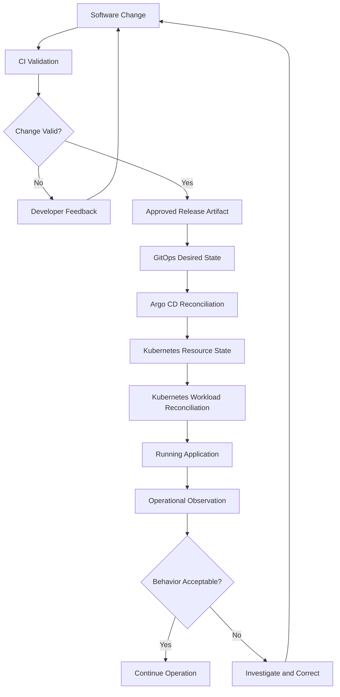

The final corrective path represents one possible response: creating a new software or configuration change that passes through the delivery system.

Operational incidents may also require immediate containment or recovery actions outside this simplified path.

### The most important principle of Phase 02

> **Reliable CI/CD is not simply a sequence of automated tasks. It is a coordinated system of validation, observation, comparison, decision-making, and corrective action.**

And remember this distinction:

**GitHub Actions helps answer whether a change has passed its configured validation.**

**Argo CD helps answer whether the managed Kubernetes configuration matches the approved Git configuration.**

**Kubernetes helps maintain the declared workload state.**

**Observability helps determine whether the running application is behaving acceptably.**

These responsibilities must work together to create confidence in software delivery.

---

# 28. Official Documentation for Further Study

Use these references to reinforce the engineering concepts rather than trying to memorize configuration immediately.

**1. Kubernetes — Controllers**

https://kubernetes.io/docs/concepts/architecture/controller/

Focus on:

- Control loops
- Desired state
- Current state
- Controller responsibilities

**2. Kubernetes — Deployments**

https://kubernetes.io/docs/concepts/workloads/controllers/deployment/

Focus on:

- Desired replicas
- ReplicaSets
- Rollouts
- Deployment status

**3. Argo CD — Automated Sync Policy**

https://argo-cd.readthedocs.io/en/stable/user-guide/auto_sync/

Focus on:

- Automated synchronization
- Self-healing
- Pruning
- Reconciliation behavior

**4. GitHub Actions — Workflow Documentation**

https://docs.github.com/en/actions

Focus on:

- Workflow events
- Jobs and steps
- Workflow results
- Status checks

You do not need to implement everything in these references yet.

For this phase, concentrate on understanding which problems each mechanism solves.

---

# Phase 02 Complete

**Completed:** Level 1 — Phase 02: Feedback and Control Systems

**Next:** Phase 03 — Delivery Architecture

**File:** `Level-1-Fundamentals/Phase-03-Delivery-Architecture.md`

### What comes next?

So far, we have established two foundations.

**Phase 01:**

Why software delivery needs controlled validation and automation.

**Phase 02:**

How feedback, desired state, and reconciliation help systems detect and respond to differences.

In Phase 03, we will combine these principles to design the architecture of an end-to-end software delivery system.

We will investigate:

- How a software change moves through an organization.
- How to identify architectural components from requirements.
- How to separate CI and CD responsibilities.
- How artifacts, registries, environments, and GitOps repositories interact.
- Where trust boundaries exist.
- Why GitHub Actions should not automatically need direct production access.
- How to design deployment and feedback paths.
- How to identify single points of failure and architectural trade-offs.

Our central engineering question will be:

> **Given a software application, multiple developers, and a production Kubernetes environment, how do we design the complete delivery architecture before selecting tools or writing YAML?**

**Send `next` for Phase 03 — Delivery Architecture.**