# Phase 03 — Software Delivery Architecture: Designing CI/CD as a Complete System

**Level 1: Fundamentals | CI/CD From First Principles**

**File:** `Level-1-Fundamentals/Phase-03-Delivery-Architecture.md`

**Previous:** Phase 02 — Feedback and Control Systems  
**Next:** Phase 04 — Git Lifecycle

---

# 1. What Will You Learn?

In Phase 01, we understood **why CI/CD exists**.

In Phase 02, we explored **how feedback, control loops, and reconciliation help systems maintain intended behavior**.

Now we will connect these principles to design a complete software delivery architecture.

This is where we begin thinking like a **DevOps Engineer, Platform Engineer, or Software Delivery Architect**.

We will not start by writing GitHub Actions workflows or Argo CD manifests.

Instead, we will begin with a business requirement and derive the architecture that can satisfy it.

By the end of this phase, you should understand:

1. How to approach CI/CD as a system-design problem.
2. How to convert software delivery requirements into architectural components.
3. How to identify responsibilities, boundaries, and relationships between components.
4. How source code becomes a deployable artifact.
5. How software artifacts move from CI to production.
6. Why we separate source repositories, artifact registries, and GitOps repositories.
7. How GitHub Actions, Argo CD, Docker, and Kubernetes fit into one architecture.
8. How to design the complete delivery flow without giving CI direct production access.
9. How trust boundaries and permissions affect delivery architecture.
10. How to reason about environment promotion, failure isolation, recovery, and traceability.
11. How to evaluate architectural trade-offs rather than blindly following tutorials.
12. How to design a CI/CD system before writing YAML.

Our central engineering question is:

> **Given a software application, multiple developers, and a Kubernetes production environment, how do we design a reliable delivery system from first principles?**

---

# 2. First Principle: Architecture Exists to Satisfy Requirements

Imagine you join a company as a DevOps Engineer.

The development team maintains a Node.js backend application.

The engineering manager gives you this requirement:

> We have multiple developers working on the same application. We need to test changes automatically, deploy reliably to Kubernetes, track what is running in production, and recover when deployments fail.

What would you do?

A beginner might immediately think:

- We need GitHub Actions.
- We need Docker.
- We need Kubernetes.
- We need Argo CD.
- Let's write some YAML files.

But this approach has a fundamental problem.

**We are selecting tools before understanding the responsibilities those tools must fulfill.**

A system architect approaches the problem differently.

## 2.1 The correct thinking sequence

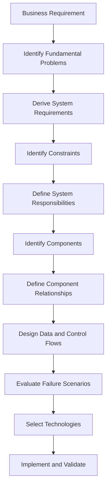

Notice where technology selection appears.

Near the end.

Why?

Because technology is an implementation decision.

Architecture begins by understanding what the system needs to accomplish.

### Important principle

> **Architecture is the arrangement of responsibilities, components, relationships, and constraints required to achieve a system's objectives.**

A good architecture is not measured by how many technologies it contains.

It is measured by whether its design satisfies its requirements under expected operating conditions.

---

# 3. Step 1 — Understand the System We Are Building For

Before designing CI/CD, we need to understand the application and its operating environment.

Let's establish a realistic scenario.

## 3.1 Application background

We have an e-commerce backend.

Technology stack:

| Category | Technology |
|---|---|
| Application | Node.js + TypeScript |
| Framework | Express |
| Database | PostgreSQL |
| Source control | GitHub |
| Containerization | Docker |
| Orchestration | Kubernetes |
| Cloud | Azure |
| Kubernetes platform | AKS |
| Environments | Development, Staging, Production |
| Developers | 8 |
| CI platform | GitHub Actions |
| GitOps controller | Argo CD |
| Monitoring | Prometheus and Grafana |

We will use these tools as examples throughout the phase.

The architecture principles will also apply to other platforms.

For instance, the same requirements might be implemented using GitLab CI, Jenkins, GKE, or EKS.

The engineering responsibilities remain largely the same.

## 3.2 Application structure

Imagine the application repository contains:

```text
ecommerce-api/
│
├── src/
│   ├── controllers/
│   ├── services/
│   ├── routes/
│   ├── middleware/
│   └── app.ts
│
├── tests/
│   ├── unit/
│   └── integration/
│
├── package.json
├── package-lock.json
├── tsconfig.json
├── Dockerfile
│
└── README.md
```

This repository contains the source code and information needed to develop, test, and build the application.

It does not necessarily contain everything required to operate the application in production.

That distinction matters.

---

# 4. Step 2 — Derive Requirements From Problems

Now let's translate the business request into specific engineering requirements.

We will use this method repeatedly:

**Problem → Consequence → Required Capability**

## Requirement 1: Developers must integrate changes safely

### Problem

Eight developers modify the same application.

Each developer works independently.

Changes that work individually may fail when combined.

### Consequence

The shared codebase can become unstable.

Integration problems may remain undiscovered until release.

### Required capability

We need:

- Frequent integration.
- Automated validation.
- Merge policies.
- Fast failure feedback.

This leads us toward Continuous Integration.

At this point, we have identified a responsibility, not yet a specific tool.

---

## Requirement 2: Builds must be repeatable

### Problem

Different developers may use different operating systems, dependencies, or build configurations.

### Consequence

A build created on one laptop may behave differently from another build.

### Required capability

We need:

- A defined build environment.
- Controlled dependency versions.
- A repeatable build process.
- Identifiable build outputs.

This leads us toward automated build execution and artifact management.

---

## Requirement 3: We must know exactly what is deployed

### Problem

Suppose someone reports:

> Production was working yesterday. What changed?

Without reliable release records, answering this becomes difficult.

### Required capability

We need to connect:

```text
Source Commit
      |
      v
Build Execution
      |
      v
Artifact Identity
      |
      v
Deployment Configuration
      |
      v
Production Environment
```

We need traceability.

Every deployed artifact should be identifiable.

Ideally, we can answer:

- Which commit produced this artifact?
- Which workflow built it?
- Which tests passed?
- Which artifact was approved?
- Which environment received it?
- When was it deployed?
- What version was running before it?

---

## Requirement 4: Production deployment must be controlled

### Problem

Developers should not need unrestricted production access just to release software.

### Consequence

Giving every developer or CI workflow broad Kubernetes credentials increases the impact of mistakes and compromised credentials.

### Required capability

We need a controlled deployment mechanism.

It should:

- Receive approved deployment intent.
- Have defined permissions.
- Apply permitted changes.
- Report deployment state.
- Preserve a useful audit trail.

This requirement will strongly influence our architecture.

---

## Requirement 5: Environments must support controlled promotion

### Problem

A new version may pass tests but still contain problems that become apparent only after deployment.

Deploying directly to production may expose all users to those problems.

### Required capability

We need a process for promoting releases through environments.

For example:

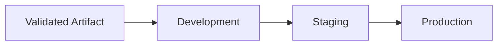

But notice an important detail.

**Promotion should ideally reuse the same immutable application artifact.**

We should not need to rebuild the application simply because it is moving from staging to production.

The environment configuration can differ, but the artifact identity should remain stable.

---

## Requirement 6: The system must detect failures

### Problem

A successful deployment command does not prove application correctness.

### Required capability

We need to observe:

- Build results.
- Test results.
- Deployment progression.
- Kubernetes resource health.
- Application health.
- Important production metrics.

This creates multiple feedback loops.

We already studied the theory behind them in Phase 02.

---

## Requirement 7: Failed releases must be recoverable

### Problem

Even well-tested software can fail in production.

### Required capability

We need:

- Previous release information.
- A defined recovery procedure.
- A way to stop unsafe rollout progression.
- Application and dependency compatibility checks.
- Post-recovery verification.

Recovery might involve rolling back or rolling forward.

Not every failure can be fixed by changing the container image.

Database migrations and other stateful changes require additional consideration.

---

# 5. Convert the Requirements Into Architecture

We now have enough information to identify the main responsibilities.

| Requirement | System responsibility | Candidate component |
|---|---|---|
| Maintain source history | Source version control | GitHub |
| Validate changes | Continuous Integration | GitHub Actions |
| Produce application packages | Build execution | Docker build |
| Identify release artifacts | Artifact versioning | Image digest and metadata |
| Store built artifacts | Artifact storage | Container registry |
| Record intended deployment versions | Desired-state management | GitOps repository |
| Approve environment changes | Release authorization | Git reviews and release policies |
| Apply Kubernetes configuration | Deployment reconciliation | Argo CD |
| Maintain running workloads | Runtime orchestration | Kubernetes |
| Measure application behavior | Observability | Prometheus and application checks |
| Support recovery | Release recovery | GitOps changes and recovery procedures |

This table is extremely important.

We selected each candidate technology because we first identified a responsibility.

That is how you should approach infrastructure and CI/CD system design.

## 5.1 Distinguish responsibility from technology

Consider:

```text
Responsibility:
Automated validation of source changes

Possible implementations:
GitHub Actions
GitLab CI
Jenkins
Azure Pipelines
```

The responsibility is relatively stable.

The tool is replaceable.

Similarly:

```text
Responsibility:
Reconcile desired Kubernetes resources

Possible implementations:
Argo CD
Flux
Other purpose-built controllers
```

You should be capable of describing the architecture even if the implementation tools change.

**This is the difference between understanding systems and memorizing tools.**

---

# 6. The First Complete CI/CD Architecture

Now we can construct our reference architecture.

This will form the foundation for the remaining phases.

## 6.1 High-level system diagram

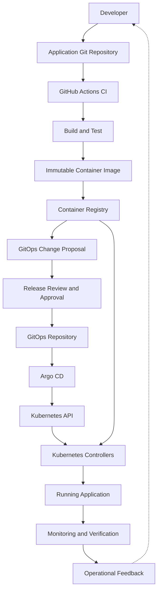

This diagram represents the logical delivery flow.

Several details are intentionally simplified:

- The registry does not initiate a GitOps update by itself.
- Release automation proposes a change referencing the published artifact.
- Approval must occur before the approved desired state is updated.
- Argo CD reads desired configuration and interacts with the Kubernetes API.
- Kubernetes node agents and the container runtime retrieve images from the registry when required.
- Monitoring supplies evidence; it does not automatically guarantee corrective action.

Let's understand the architecture carefully.

## 6.2 Divide the architecture into major systems

Rather than memorizing thirteen components, divide the architecture into six major areas.

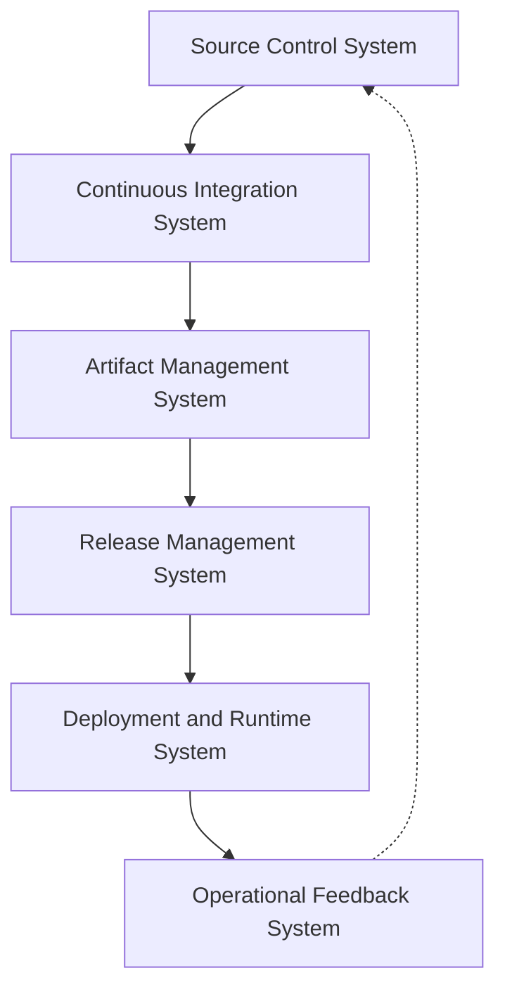

Each system has an independent engineering responsibility.

### System 1: Source Control

**Question:** What code is being changed?

### System 2: Continuous Integration

**Question:** Does the integrated change satisfy our validation requirements?

### System 3: Artifact Management

**Question:** What exact software package was produced?

### System 4: Release Management

**Question:** Which validated artifact is approved for a particular environment?

### System 5: Deployment and Runtime

**Question:** Can we establish and maintain the intended application deployment?

### System 6: Operational Feedback

**Question:** Is the deployed application actually behaving acceptably?

### The architectural insight

These systems are connected, but they should not all have the same responsibilities or permissions.

We want to define clear boundaries between them.

**A reliable CI/CD architecture is not one enormous automation script. It is a coordinated set of components with well-defined responsibilities and interfaces.**

---

# 7. Understand the Four Fundamental Objects in Software Delivery

Before going deeper into the architecture, we must distinguish four things that beginners often confuse.

They are:

1. Source code
2. Build artifact
3. Deployment configuration
4. Running application

These are different objects with different lifecycles.

## 7.1 Source code

Source code describes the application we want to build.

Example:

```typescript
app.get("/products", async (req, res) => {
  const products = await productService.getAll();

  res.json(products);
});
```

The source code belongs in Git.

A Git commit gives us a reference to a particular version of the repository.

For example:

```text
Commit:
a3f91c2
```

This commit identifies a specific source revision.

But source code alone is not necessarily executable in the production environment.

It may need compilation, dependency installation, and packaging.

---

## 7.2 Build artifact

A build artifact is the output of a build process.

For our application, that artifact is a container image.

Example:

```text
ghcr.io/example/ecommerce-api:v1.4.0
```

The image includes the application and its packaged runtime dependencies.

It is what we intend to run in production.

### Important distinction

A Git commit and a container image are not the same thing.

The same source commit can potentially produce different image contents if the build inputs or environment differ.

For example, a build may depend on:

- Base image versions.
- Dependency resolution.
- Build arguments.
- Build tools.
- Generated files.
- Timestamps or other nondeterministic inputs.

Therefore, a Git commit alone does not uniquely identify the resulting container image.

We need artifact identity.

---

## 7.3 Deployment configuration

Deployment configuration describes how an application should be deployed.

Example:

```yaml
apiVersion: apps/v1
kind: Deployment
metadata:
  name: ecommerce-api
spec:
  replicas: 3
  selector:
    matchLabels:
      app: ecommerce-api
  template:
    metadata:
      labels:
        app: ecommerce-api
    spec:
      containers:
        - name: api
          image: ghcr.io/example/ecommerce-api:v1.4.0
          ports:
            - containerPort: 3000
```

This configuration describes a Kubernetes Deployment.

It specifies:

- The Deployment name.
- The number of desired replicas.
- The Pod labels and selector.
- The container image reference.
- The container port.

It does not contain the complete application source code.

It references the artifact that should run.

---

## 7.4 Running application

The running application is the actual workload executing in the target environment.

It depends on:

```text
Application Artifact
        +
Deployment Configuration
        +
Runtime Infrastructure
        +
External Dependencies
        +
Operating Conditions
```

Even when the deployment configuration is valid, the application can experience runtime failures.

That is why runtime verification is necessary.

## 7.5 Relationship between the four objects

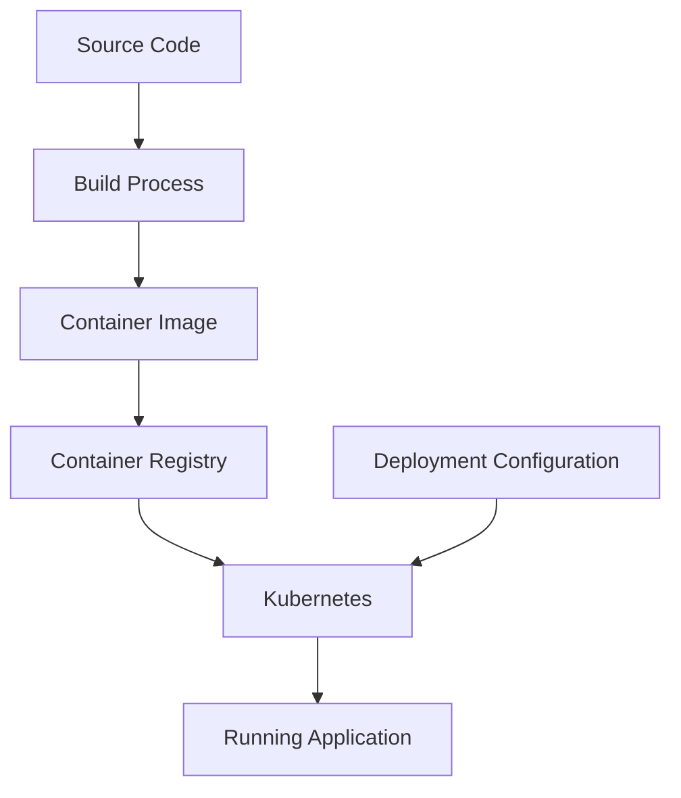

Remember these distinctions:

| Object | Main purpose | Typical identity |
|---|---|---|
| Source code | Describe application implementation | Git commit SHA |
| Build artifact | Package software for execution | Container image digest |
| Deployment configuration | Describe intended runtime resources | GitOps commit SHA |
| Running application | Serve requests and perform work | Observed workload and deployed image |

### First-principles insight

> A software release connects a particular source revision, a particular artifact, and a particular deployment configuration to an actual running system.

For traceability, we need to preserve those relationships.

---

# 8. Step 3 — Design the Continuous Integration Boundary

Let's focus on the first part of our architecture.

We have developers modifying source code.

We need to validate those modifications before allowing them to enter the shared codebase.

## 8.1 Start with the problem

Suppose Developer A changes an API endpoint.

Developer B modifies authentication middleware.

Developer C updates database queries.

Every developer claims:

> My changes work locally.

But how do we establish that their changes can safely coexist?

We need a common validation mechanism.

### Derived requirements

The CI system should:

1. Receive a source revision.
2. Execute checks in a defined environment.
3. Produce results linked to that revision.
4. Report failures.
5. Support merge decisions.
6. Preserve useful execution evidence.

Now we can select GitHub Actions.

---

## 8.2 The CI architecture

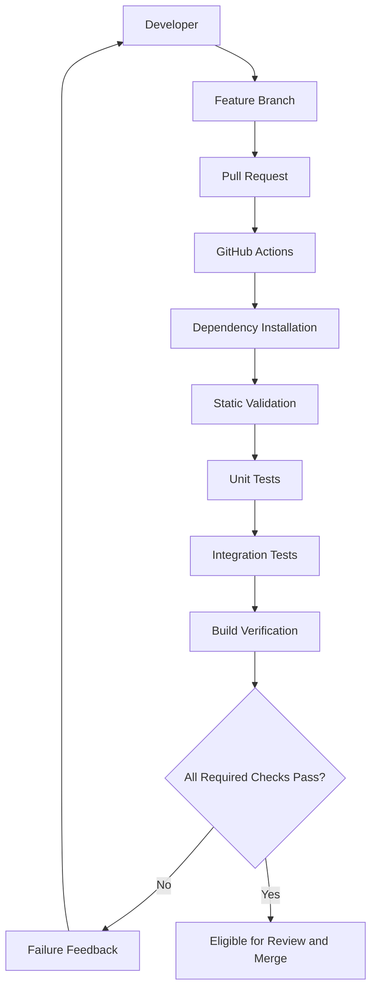

This is a logical validation sequence.

A real implementation may execute independent checks in parallel.

### What does GitHub Actions actually do?

GitHub Actions provides workflow execution.

A workflow may run on a GitHub-hosted or self-hosted runner.

The runner executes jobs and steps.

For example:

```yaml
name: Pull Request Validation

on:
  pull_request:
    branches:
      - main

permissions:
  contents: read

jobs:
  validate:
    runs-on: ubuntu-latest

    steps:
      - name: Checkout source
        uses: actions/checkout@v4

      - name: Configure Node.js
        uses: actions/setup-node@v4
        with:
          node-version: "22"
          cache: npm

      - name: Install dependencies
        run: npm ci

      - name: TypeScript validation
        run: npx tsc --noEmit

      - name: Run tests
        run: npm test

      - name: Build application
        run: npm run build
```

This is an illustrative workflow. Its commands and runtime version must match the actual application, and production workflows should review and pin third-party action versions according to the team's security policy.

Do not focus on memorizing the YAML.

Instead, understand its architectural responsibility.

### Why do these steps exist?

| Step | Engineering reason |
|---|---|
| Checkout source | Obtain the revision being evaluated |
| Configure Node.js | Establish the runtime environment |
| Install dependencies | Reconstruct the application's dependency environment |
| TypeScript validation | Detect type-level problems |
| Run tests | Evaluate expected behavior |
| Build application | Verify that source can produce the required output |

The workflow exists because the system needs evidence about a proposed change.

GitHub Actions is the execution mechanism.

---

## 8.3 Separate pull-request validation from release publishing

This distinction is important.

A pull request represents a proposed change.

A release represents an approved source revision being packaged and prepared for deployment.

These should not automatically have the same privileges.

### Pull-request workflow

Primary responsibility:

```text
Validate Proposed Changes
```

Typically requires:

- Source read access.
- Build and test capabilities.
- Limited external permissions.

It should not require unrestricted production credentials.

### Release workflow

Primary responsibility:

```text
Package an Approved Source Revision
          |
          v
Publish an Identifiable Artifact
```

Typically runs after an approved change is integrated into the designated release branch, or through another explicitly authorized release event.

It may require:

- Registry publishing permissions.
- Artifact metadata permissions.
- Limited access to propose release configuration updates.

### Architecture

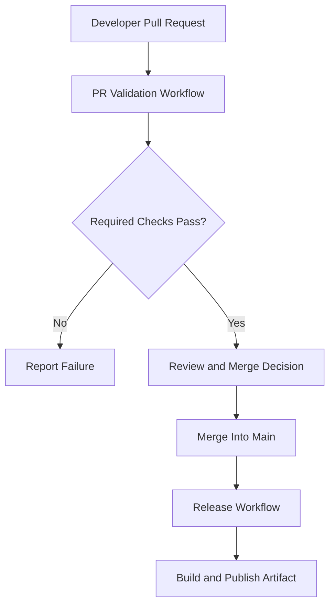

One subtle point:

The revision validated by a pull-request workflow may differ from the final merged revision.

For example, the base branch can change while the pull request is open.

Therefore, a robust release process also validates or builds the actual source revision selected for release.

Branch protection, required checks, and merge queues can help enforce appropriate validation policies.

### Engineering principle

> Validation evidence must be connected to the exact change or source revision it is intended to authorize.

We will explore this in Phase 05 and Phase 08.

---

# 9. Step 4 — Design the Artifact Management Boundary

Now suppose the application passes validation.

What should happen next?

Many beginners think:

> CI passed, so let's deploy the code.

But Kubernetes does not ordinarily deploy TypeScript source code directly.

It runs containers.

Therefore, we need a build artifact.

## 9.1 Derive the artifact pipeline

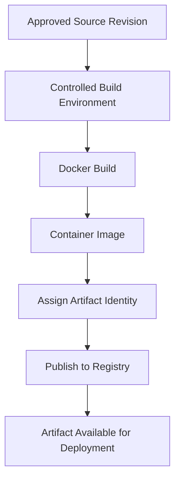

The important design question is:

**How will we identify the exact container image that passed through the release process?**

---

## 9.2 Why image tags are not sufficient for strong identity

Consider:

```text
ecommerce-api:latest
```

What does this identify?

A registry tag named `latest`.

Does it guarantee the tag will always reference the same image content?

No.

Tags can be reassigned unless registry policies prevent it.

The same problem can affect version tags.

For example:

```text
ecommerce-api:v1.4.0
```

The tag is useful for humans, but a registry may allow it to be overwritten.

That creates uncertainty.

### Example

On Monday:

```text
v1.4.0 -> Image A
```

On Tuesday, someone overwrites the tag:

```text
v1.4.0 -> Image B
```

The deployment configuration has not changed.

But resolving the tag may now produce a different artifact.

This is dangerous when we want to prove exactly what was deployed.

---

## 9.3 Use immutable image digests

Container registries support content-addressed image references.

Conceptually:

```text
ghcr.io/example/ecommerce-api@sha256:<image-digest>
```

The digest identifies the image content.

A GitOps manifest can reference a specific digest:

```yaml
containers:
  - name: api
    image: ghcr.io/example/ecommerce-api@sha256:aaaaaaaaaaaaaaaaaaaaaaaaaaaaaaaaaaaaaaaaaaaaaaaaaaaaaaaaaaaaaaaa
```

The digest shown is illustrative, not the digest of a real published image.

### Why does this matter?

Suppose:

```text
Staging:
Image Digest = ABC

Production:
Image Digest = ABC
```

We know both environments are configured to run the same image content, even though their runtime settings may differ.

This is stronger than merely trusting that a tag was not overwritten.

Kubernetes documents image tags and digests as distinct ways to reference container images. [Kubernetes](https://kubernetes.io/docs/concepts/containers/images/?utm_source=chatgpt.com)

---

## 9.4 Understand build once, deploy many

Imagine three environments:

```text
Development
Staging
Production
```

A weak delivery process might rebuild the application separately for each environment.

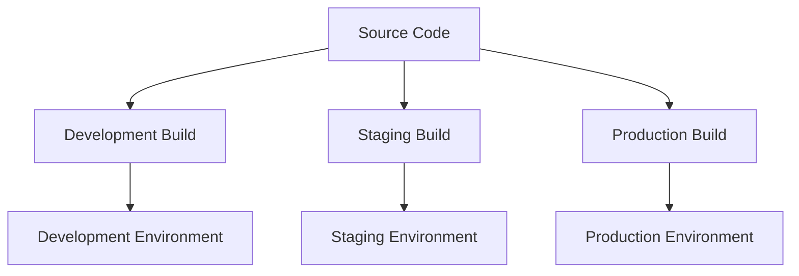

This introduces a problem.

Even if all builds use the same source commit, differences in build conditions could produce different artifacts.

Now consider an alternative.

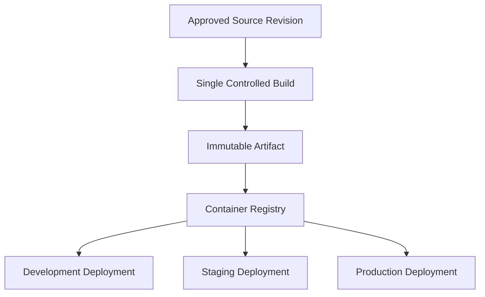

This illustrates a stronger architectural approach.

Build the artifact once.

Validate it.

Promote its identity across environments.

### What changes between environments?

Possibly:

- Database endpoints.
- Replica counts.
- Resource limits.
- External service endpoints.
- Scaling policies.
- Environment-specific configuration.

### What should remain stable?

The application artifact being promoted.

### Fundamental principle

> Separate the identity of the software from the configuration of the environment in which it runs.

This separation is one of the foundations of reliable release engineering.

---

# 10. Step 5 — Design the Release Management Boundary

Now we have a validated container image in a registry.

Should production immediately deploy it?

Not necessarily.

We need to distinguish two decisions:

**Decision 1:** Is the artifact technically valid?

**Decision 2:** Is the artifact approved for a specific environment?

Those decisions are related, but not identical.

## 10.1 Why artifact publication should not automatically imply production deployment

Imagine a developer merges a feature.

CI succeeds.

An image is published.

But the feature is scheduled for release next week.

Or perhaps staging must be validated first.

The existence of a new artifact does not necessarily mean production should use it.

Therefore, we need a separate representation of release intent.

This is where the GitOps repository becomes useful.

---

## 10.2 Application repository vs GitOps repository

Let's understand their responsibilities.

### Application repository

Stores information needed to develop and build software.

For example:

```text
ecommerce-api/
│
├── src/
├── tests/
├── Dockerfile
├── package.json
├── package-lock.json
│
└── .github/
    └── workflows/
        ├── ci.yaml
        └── release.yaml
```

### GitOps repository

Stores the desired configuration for deployed environments.

For example:

```text
ecommerce-gitops/
│
├── applications/
│   └── ecommerce-api/
│       │
│       ├── base/
│       │   ├── deployment.yaml
│       │   ├── service.yaml
│       │   └── kustomization.yaml
│       │
│       └── overlays/
│           ├── dev/
│           │   └── kustomization.yaml
│           │
│           ├── staging/
│           │   └── kustomization.yaml
│           │
│           └── production/
│               └── kustomization.yaml
│
└── argocd/
    ├── dev-application.yaml
    ├── staging-application.yaml
    └── production-application.yaml
```

This is an illustrative repository structure using Kustomize-style directories.

The precise structure depends on the deployment design.

### Why separate them?

Because they answer different questions.

The application repository answers:

> What software are we building?

The GitOps repository answers:

> Which software artifact and configuration should be running in each environment?

---

## 10.3 The separation of responsibilities

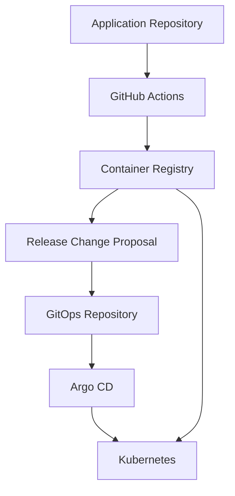

The release proposal is created by automation or an authorized operator.

The registry does not independently decide to deploy an image.

Likewise, Argo CD does not normally select a new application image simply because the registry contains one.

Argo CD follows the desired Kubernetes configuration supplied through its configured source.

### Why is this powerful?

Because building an artifact and authorizing its deployment become separate responsibilities.

This is a form of **separation of duties**.

---

## 10.4 Do we always need two Git repositories?

No.

You could store application source and deployment configuration in a single repository.

For example:

```text
ecommerce-api/
│
├── src/
├── tests/
├── Dockerfile
│
├── .github/
│   └── workflows/
│
└── deploy/
    ├── dev/
    ├── staging/
    └── production/
```

This is a valid design for some projects.

### Single-repository approach

Advantages:

- Simpler initial setup.
- Fewer repositories to maintain.
- Application and deployment configuration are easier to view together.

Disadvantages:

- Application and deployment changes may need more careful workflow separation.
- Release permissions can be harder to isolate.
- Multiple application teams may share deployment responsibilities.
- Repository changes can trigger more complex automation.

### Separate-repository approach

Advantages:

- Clear separation between application development and deployment intent.
- Independent release history.
- Independent access policies.
- Easier separation of development and production approvals.
- Potentially clearer ownership for platform teams.

Disadvantages:

- More repositories and automation.
- Extra coordination between artifact publication and GitOps updates.
- More cross-repository traceability requirements.

### Our architectural choice

For this course, we will use:

**One application repository + one GitOps repository.**

Why?

Because it helps us understand and practice the separation between:

1. Software creation.
2. Software validation.
3. Artifact publication.
4. Release authorization.
5. Deployment reconciliation.

It is a teaching choice that also applies to many production environments, not a universal requirement.

---

# 11. Step 6 — Design the Deployment Boundary

We now have:

- A validated artifact.
- An immutable image identity.
- An approved GitOps configuration.
- A target Kubernetes environment.

Who should perform deployment?

One option is GitHub Actions.

Another option is Argo CD.

Let's analyze both.

## 11.1 Approach A: CI directly modifies Kubernetes

Consider:

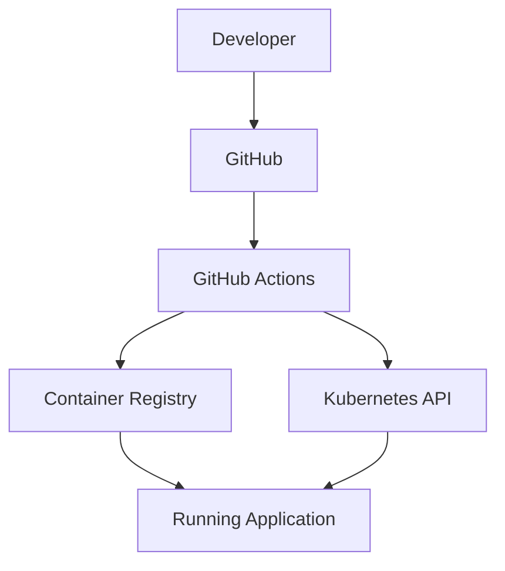

In this architecture, GitHub Actions directly interacts with the Kubernetes API.

It might execute:

```bash
kubectl apply -f deployment.yaml
```

Or:

```bash
helm upgrade --install ecommerce-api ./chart
```

This can be a perfectly valid CI/CD design.

But it introduces architectural questions.

### Question 1

What credentials does GitHub Actions need?

It needs an authorized way to interact with the target cluster.

### Question 2

What permissions are granted?

Can the workflow modify only the application namespace?

Or can it change cluster-wide resources?

### Question 3

What happens if someone changes a live resource manually?

The CI workflow may not run again until its next trigger.

Unless another mechanism continuously checks for drift, the unexpected change may persist.

### Question 4

Where is the authoritative deployed configuration?

Is it the repository?

The last workflow execution?

The current Kubernetes state?

We need a clear answer.

### Question 5

What happens when the workflow is compromised?

If the workflow has powerful production credentials, an attacker may gain the ability to modify production resources.

The risk depends on the identity and permissions granted.

---

## 11.2 Approach B: CI publishes artifacts, Argo CD deploys

Now consider a GitOps-oriented architecture.

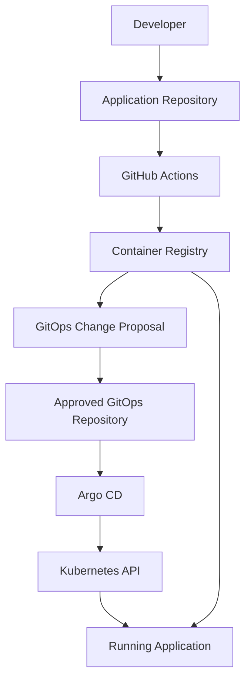

Here, GitHub Actions does not need direct Kubernetes deployment access.

Instead:

1. CI validates the application.
2. CI builds and publishes an artifact.
3. Release automation proposes a GitOps configuration update.
4. The change passes the required approval process.
5. Argo CD reads the approved desired configuration.
6. Argo CD synchronizes Kubernetes resources.
7. Kubernetes runs the requested workload.

The registry-to-application arrow represents image retrieval by Kubernetes nodes, not direct registry-driven deployment.

### What changed architecturally?

We separated **artifact creation** from **deployment execution**.

GitHub Actions is responsible for preparing a deployable release.

Argo CD is responsible for applying the approved desired configuration.

This makes the responsibilities more explicit.

---

## 11.3 Why CI does not need direct production cluster credentials

In our chosen design, GitHub Actions can fulfill its primary responsibilities without receiving a production Kubernetes credential.

It needs authorization to:

- Read source code.
- Execute the build.
- Publish the image.
- Propose an approved deployment configuration change.

Argo CD is configured separately with access to the target Kubernetes cluster.

This reduces the production authority granted directly to CI.

However, the architecture is not automatically secure.

A workflow that can unilaterally modify the production GitOps branch may still have effective production deployment authority.

Therefore, GitOps branch permissions and approval policies are critical.

### Key security principle

> **Separate who can produce software from who can authorize production deployment.**

This is an architectural control, not simply a YAML configuration.

---

# 12. Step 7 — Understand Data Flow vs Control Flow

This is one of the most useful system-design concepts.

When looking at CI/CD diagrams, people often draw arrows without explaining what those arrows represent.

But not all connections carry the same kind of information.

We should distinguish:

**Data flow:** What information or artifact moves between components?

**Control flow:** What event, instruction, or decision causes an operation to happen?

## 12.1 Data flow

Examples:

- Git source code is checked out by the CI runner.
- A Docker image is published to a registry.
- A container image is pulled onto a Kubernetes node.
- Monitoring systems collect application metrics.

These are movements of data or artifacts.

## 12.2 Control flow

Examples:

- A pull request triggers a CI workflow.
- A failed test blocks a release decision.
- An approved Git commit changes the desired deployment state.
- Argo CD initiates synchronization.
- Kubernetes controllers request creation or modification of resources.

These are operations driven by events, decisions, or controllers.

---

## 12.3 The two flows in our architecture

### Artifact data flow

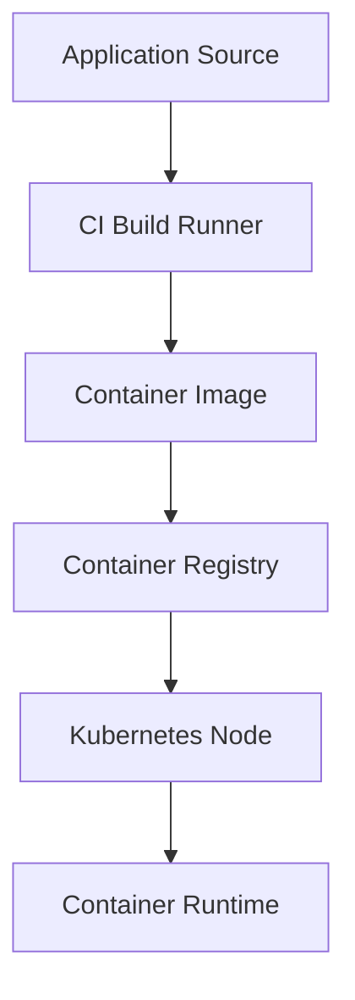

This represents the path through which application bytes are built, stored, and made available for execution.

More precisely, the kubelet and container runtime coordinate image retrieval on the Kubernetes node, subject to the configured image pull policy and local image availability.

The Argo CD controller does not normally download the application's container image and copy it into Pods.

### Deployment control flow

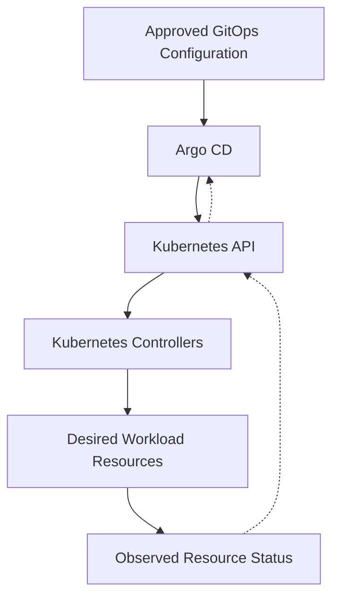

This represents the relationship through which approved configuration becomes Kubernetes resource changes.

Argo CD compares and synchronizes managed resources.

Kubernetes controllers act on the resulting resource specifications.

### Why does this distinction matter?

Imagine the container registry becomes unavailable.

Argo CD may still be able to read Git and apply Kubernetes configuration.

But a node that needs to pull an unavailable image may fail to start the requested container.

Now imagine Git is unavailable.

Existing application containers may continue running.

But Argo CD may be unable to retrieve new desired configuration from that source.

These are different failure scenarios because the systems have different dependencies.

### First-principles insight

> **Understanding which components exchange data, which components issue instructions, and which components make decisions is essential for identifying failure points in distributed systems.**

---

# 13. Step 8 — Identify Trust Boundaries

We have identified the components and their relationships.

Now we need to ask a different question:

**Which components should be trusted to perform which operations?**

This is a fundamental system-design problem.

A successful CI/CD pipeline should not automatically have unrestricted access to every environment.

## 13.1 What is a trust boundary?

A trust boundary separates systems, identities, or operations that have different security assumptions or permissions.

For example:

```text
Developer Laptop
        |
        v
GitHub Repository
        |
        v
GitHub Actions Runner
        |
        v
Container Registry
        |
        v
Production Kubernetes
```

These environments do not necessarily have the same trust level.

A developer laptop is not equivalent to a production cluster.

A pull-request workflow executing untrusted code is not equivalent to an authorized production deployment controller.

A container registry stores artifacts, but it should not automatically be trusted to decide what runs in production.

### Important insight

**A component should receive the minimum authority needed for its responsibilities.**

This is the principle of least privilege.

---

## 13.2 Identify the trust boundaries

For our architecture, we can identify several boundaries.

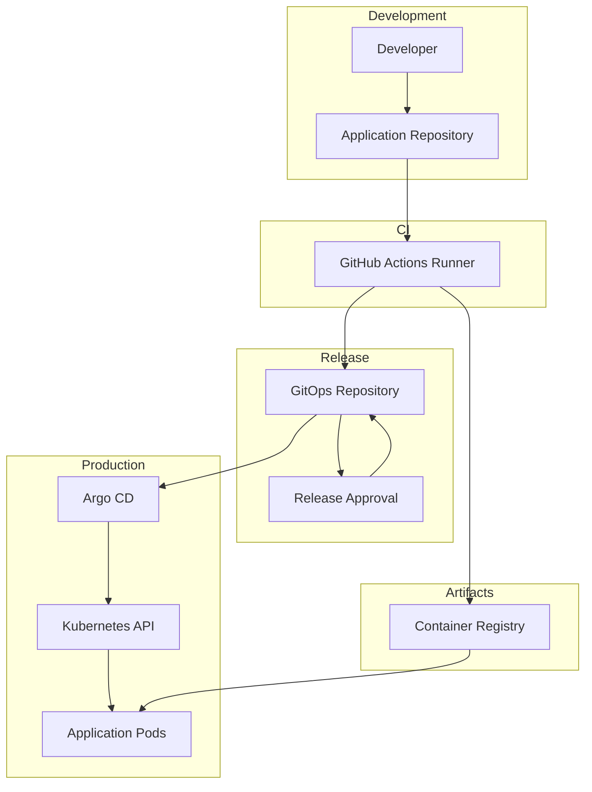

The subgraphs represent different responsibility and trust domains.

The arrows are conceptual. In particular, the GitOps update must be approved according to the repository's policies, and Kubernetes nodes retrieve application images from the registry.

Let's examine the most important boundaries.

---

## 13.3 Boundary 1: Developer to source repository

### Problem

Developers need to change code.

But not every change should automatically become production code.

### Possible controls

- Pull requests.
- Code review.
- Protected branches.
- Required CI checks.
- Restricted merge permissions.

### Architectural reasoning

A developer can propose a change.

The repository's policies determine whether that change can become part of the approved source history.

We separate:

```text
Ability to Propose Code
          !=
Authority to Approve Code
```

This becomes more important as teams grow.

---

## 13.4 Boundary 2: Source repository to CI runner

### Problem

A CI runner executes instructions from repository-controlled workflows and often processes code contributed by developers.

What happens if a pull request contains malicious code?

For example, a test script could attempt to read sensitive files or send data to an external service.

Therefore, executing repository code introduces a trust consideration.

### Architectural reasoning

We should not give every CI job access to:

- Production credentials.
- Unrestricted cloud permissions.
- Sensitive deployment tokens.
- Powerful organization-wide credentials.

For a pull-request validation job, a simple permission model might be:

```yaml
permissions:
  contents: read
```

This limits the workflow's GitHub token permissions to those required for the task, although runner isolation, secrets exposure, third-party actions, and other execution risks still need consideration.

### Important principle

> Source code being tested must not automatically inherit the privileges required for production deployment.

We will study the detailed security mechanisms in Phase 14.

---

## 13.5 Boundary 3: CI runner to container registry

### Problem

The CI system must publish images.

But does it need permission to delete all images?

Does it need administrator-level registry access?

Usually not.

### Required capability

The release workflow needs authorization to publish artifacts to the intended registry location.

For GitHub Container Registry, this may involve an appropriately scoped GitHub token with package publishing permission.

For Azure Container Registry, this may involve a workload identity with appropriate registry permissions.

The exact permissions depend on the registry.

### Architectural principle

Separate artifact publishing permissions from infrastructure administration permissions.

---

## 13.6 Boundary 4: CI to GitOps repository

This is one of the most important boundaries.

Suppose GitHub Actions successfully builds a container image.

It then modifies the production GitOps manifest.

For example:

```yaml
containers:
  - name: api
    image: ghcr.io/example/ecommerce-api:v2.0.0
```

If this change is immediately accepted into the production desired state, it may trigger a deployment.

Therefore:

**Permission to modify approved production GitOps configuration can effectively become permission to change production.**

This remains true even if the CI workflow has no direct Kubernetes credentials.

### Safer architectural separation

Instead of allowing CI to directly modify the protected production branch, it can propose a change.

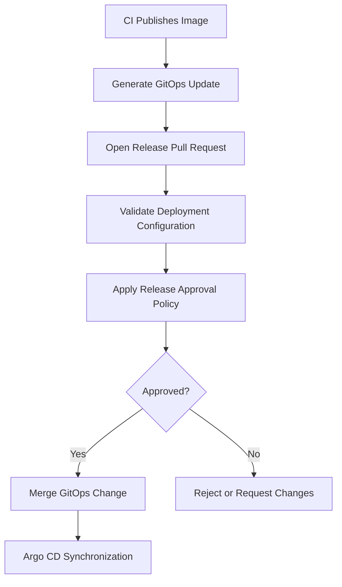

This creates a clear release authorization boundary.

Different environments may use different approval policies.

For example:

- Development updates may be automated.
- Staging promotion may require successful environment checks.
- Production promotion may require approval.

These are engineering choices, not universal rules.

---

## 13.7 Boundary 5: Argo CD to Kubernetes

Argo CD needs Kubernetes API permissions to manage the resources it owns.

But does every Argo CD instance need unrestricted cluster-admin permissions?

Not necessarily.

Its permissions should be designed according to the resources and destinations it manages.

This may involve:

- Kubernetes RBAC.
- Namespace boundaries.
- Restricted service accounts.
- Argo CD Projects.
- Allowed source repositories.
- Allowed deployment destinations.
- Resource restrictions.

### Architectural reasoning

GitOps does not eliminate privileged access.

It moves deployment responsibilities into a controlled reconciliation system.

That system itself must be configured and protected appropriately.

---

## 13.8 What about OIDC?

You may already be familiar with Azure workload identity and GitHub Actions OIDC.

OIDC is useful when workflows need temporary authorization to external platforms such as Azure.

Instead of storing a long-lived cloud credential in GitHub, a workflow can request an OIDC token and exchange it under a configured trust relationship for a short-lived cloud credential.

For example:

```text
GitHub Actions Workflow
          |
          v
Request OIDC Token
          |
          v
Cloud Identity Provider
          |
          v
Validate Trust Conditions
          |
          v
Issue Short-Lived Cloud Credential
          |
          v
Perform Authorized Cloud Operation
```

However, OIDC does not automatically grant access.

The cloud-side trust conditions and identity permissions determine what operations are allowed.

Also, a workflow that only builds and publishes to GitHub Container Registry may not need Azure OIDC authentication at all.

**Choose authentication according to the required responsibility.**

GitHub documents OIDC-based cloud authentication and the importance of appropriately scoped workflow permissions. [GitHub Docs](https://docs.github.com/en/actions/how-tos/secure-your-work/security-harden-deployments?utm_source=chatgpt.com)

---

# 14. Step 9 — Design Environment Promotion

We have designed the main delivery architecture.

Now we need to decide how releases progress through environments.

Imagine three environments:

```text
Development
Staging
Production
```

Each environment serves a different purpose.

## 14.1 Development environment

Purpose:

Provide fast feedback about integrated software behavior in a deployed environment.

Typical characteristics:

- Frequent updates.
- Rapid testing.
- Lower deployment approval overhead.
- Greater tolerance for controlled experimentation.

## 14.2 Staging environment

Purpose:

Evaluate release behavior under conditions that are sufficiently representative of production.

Typical characteristics:

- Integration testing.
- Release verification.
- Configuration validation.
- Compatibility checks.
- Operational readiness checks.

Staging does not need to be identical to production in every respect.

But differences should be understood.

## 14.3 Production environment

Purpose:

Serve real users and business workloads.

Typical requirements:

- Controlled changes.
- Traceable releases.
- Defined availability objectives.
- Appropriate deployment strategies.
- Monitoring and incident response.
- Recovery capabilities.

---

## 14.4 The promotion architecture

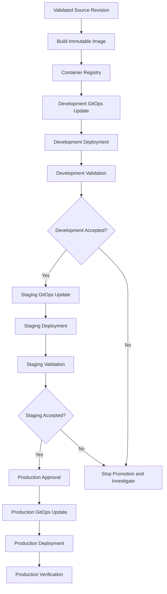

The same published image digest is selected for each environment.

The GitOps configuration changes to indicate which environment should run that artifact.

---

## 14.5 Promotion does not mean rebuilding

Imagine we have:

```text
Commit:
a3f91c2

Image Digest:
sha256:ABC123
```

The digest shown here is shortened for illustration.

Our promotion records might look like:

| Environment | Selected artifact | Release status |
|---|---|---|
| Development | Digest ABC123 | Validated |
| Staging | Digest ABC123 | Validated |
| Production | Digest ABC123 | Approved and deployed |

The artifact identity remains the same.

The release configuration and authorization state change.

### Why is this important?

If a problem occurs in production, we can determine which artifact is running.

If staging ran the same image, we can investigate whether the failure resulted from:

- Environment-specific configuration.
- Different data.
- Different traffic patterns.
- Infrastructure differences.
- External dependency behavior.
- Missing validation coverage.

We have reduced one source of uncertainty: artifact identity.

---

# 15. Step 10 — Design Traceability Across the Delivery System

Let's imagine a production incident.

The application is returning HTTP 500 responses.

A developer asks:

> Which code change caused this?

To investigate, we need to work backward through the delivery system.

## 15.1 The traceability chain

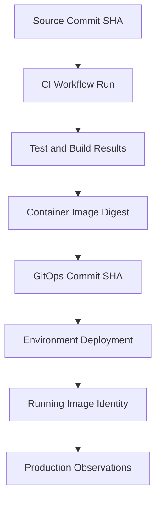

A useful release record should connect these identities.

For example:

| Field | Example |
|---|---|
| Application | ecommerce-api |
| Source revision | `a3f91c2` |
| CI workflow run | `10542` |
| Artifact reference | Full image digest |
| GitOps revision | `b7d21e4` |
| Environment | production |
| Deployment outcome | Healthy according to configured checks |
| Release time | Recorded by the delivery system |

The values above are illustrative.

### Why not just use image tags?

Because mutable tags may not provide a permanent identity.

### Why not just use Git commits?

Because a Git commit identifies source revision, not necessarily the exact produced binary or container image.

### Why record the GitOps revision?

Because two deployments can use the same image with different configuration.

For example:

```text
Same application image
        +
Different database configuration
        =
Potentially different application behavior
```

Therefore, we want both artifact identity and configuration identity.

---

## 15.2 Traceability is not the same as observability

These terms are related but different.

### Traceability

Helps answer:

> How did this version get here?

### Observability

Helps answer:

> What is happening inside the running system?

For example:

```text
Traceability:
Production runs the image built from commit a3f91c2.
```

```text
Observability:
Requests to /checkout are failing with database timeouts.
```

We need both to investigate production problems effectively.

---

# 16. Step 11 — Design for Failure, Not Just Success

A system architecture must describe more than the happy path.

Let's identify failures at each boundary.

## 16.1 Failure analysis table

| Failure | Where it occurs | Likely effect | Required system behavior |
|---|---|---|---|
| Source checkout fails | CI | Validation cannot begin | Report infrastructure or checkout failure |
| Dependency installation fails | CI | Build cannot proceed | Stop validation and retain logs |
| Unit tests fail | CI | Change is not validated | Block progression under the defined policy |
| Image build fails | Build system | No new artifact | Stop release preparation |
| Registry push fails | Artifact management | Artifact not published | Prevent promotion of unavailable artifact |
| GitOps update fails | Release management | Desired configuration remains unchanged | Report failure and retry safely if appropriate |
| Approval rejected | Release authorization | Production release not authorized | Do not promote |
| Argo CD cannot read Git | Deployment controller | Cannot obtain fresh desired configuration | Report source error and avoid claiming successful reconciliation |
| Kubernetes API unavailable | Deployment | Resource synchronization cannot complete | Report deployment failure |
| Image pull fails | Runtime | New containers may fail to start | Report workload failure |
| Pod readiness fails | Runtime | Deployment may not progress | Stop or investigate rollout |
| Application returns HTTP 500 | Production | Users may experience failures | Alert and initiate appropriate recovery |
| Monitoring unavailable | Observability | Reduced ability to assess operational state | Report loss of monitoring and use defined fallback procedures |

Notice something important.

**Every component introduces dependencies and possible failure modes.**

Adding a tool may solve one problem while creating new operational responsibilities.

This is why good system design is not simply about adding more technology.

---

## 16.2 Failure scenario A: CI passes but registry publishing fails

Imagine:

```text
Tests: Passed

Docker Build: Passed

Registry Push: Failed
```

Should the release process update production GitOps configuration?

No.

The artifact may not be available to the target runtime.

### Correct behavior

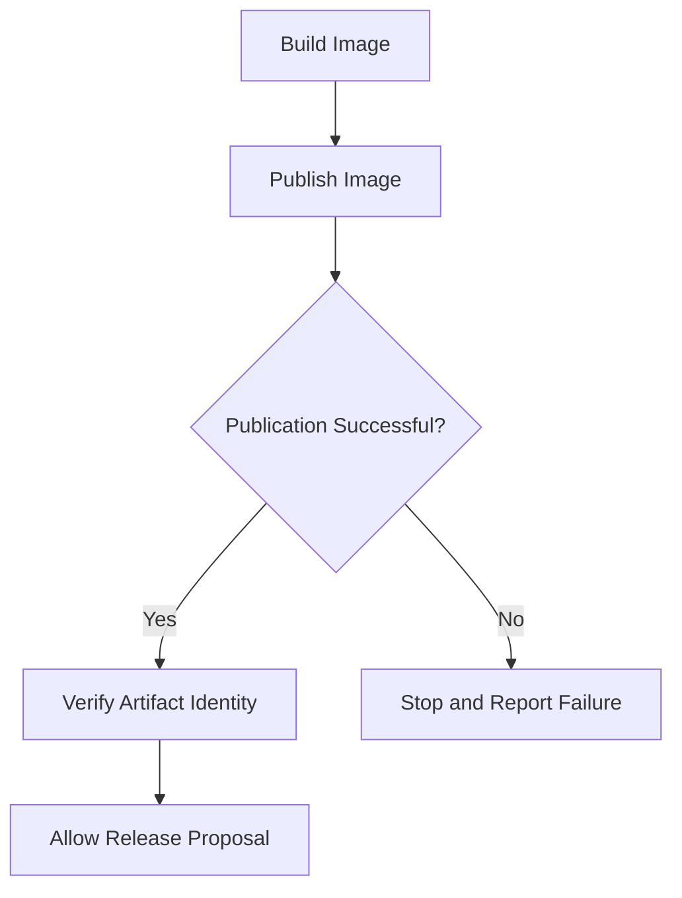

This illustrates a dependency rule:

**Do not authorize a downstream operation until its required upstream conditions are satisfied.**

---

## 16.3 Failure scenario B: GitOps update succeeds but deployment fails

Imagine:

```text
GitOps PR: Approved

GitOps Change: Merged

Argo CD: Synced

Kubernetes: ImagePullBackOff
```

What happened?

The desired configuration was accepted by Git.

Argo CD may have successfully submitted the intended Kubernetes resource configuration.

But Kubernetes could not start the new container.

Possible reasons:

- Image reference is incorrect.
- Registry credentials are missing.
- Network access is unavailable.
- The image is incompatible with the node architecture.

### Architectural lesson

**Configuration synchronization and successful workload execution are different outcomes.**

A release system must evaluate both.

---

## 16.4 Failure scenario C: Argo CD becomes unavailable

Suppose Argo CD stops running.

What happens to the existing application?

In a typical architecture, Kubernetes continues managing existing workloads.

Argo CD is not the component executing application containers.

Its temporary failure does not necessarily stop the already-running application.

However:

- New GitOps deployments may be delayed.
- Configuration drift may not be corrected by Argo CD.
- Desired-state comparisons may become unavailable.
- GitOps visibility may be reduced.

This demonstrates an important distributed-systems concept:

**A component can fail without necessarily causing the entire system to fail.**

The impact depends on component responsibilities and dependencies.

---

## 16.5 Failure scenario D: Container registry becomes unavailable

Suppose the application is already running.

The registry becomes unavailable.

Do all running containers immediately stop?

No.

Existing containers do not ordinarily need continuous registry access to keep executing.

However, if Kubernetes needs to start a container whose image is unavailable locally, image retrieval may fail.

The outcome depends on image availability, node state, credentials, and image pull policy.

### Architectural insight

The registry is critical to artifact distribution.

It is not necessarily required for every second of application execution.

That distinction helps us reason about failure impact.

---

## 16.6 Failure scenario E: Monitoring fails during deployment

Suppose:

```text
CI: Passed

Artifact: Published

Argo CD: Synced

Kubernetes: Ready

Monitoring: Unavailable
```

Should the delivery system declare the release fully verified?

Not if operational verification is a required release gate and the necessary evidence cannot be obtained.

A safer release policy might treat missing verification as an unknown state.

```mermaid
flowchart TD
    A["Deployment Completed"]
    B["Collect Required Health Evidence"]
    C{"Evidence Available?"}
    D["Evaluate Health"]
    E["Verification Unknown"]
    F{"Health Acceptable?"}
    G["Accept Release"]
    H["Investigate or Recover"]

    A --> B
    B --> C

    C -->|Yes| D
    C -->|No| E

    D --> F

    F -->|Yes| G
    F -->|No| H
```

The correct response to unavailable monitoring depends on risk and release policy.

It might involve pausing further promotion, maintaining the current rollout stage, or initiating manual verification.

### Fundamental principle

> Absence of failure evidence is not the same as evidence of successful operation.

---

# 17. Step 12 — Understand Architectural Trade-offs

Now let's consider an important question.

**Is our GitHub Actions + GitOps + Argo CD architecture always the best solution?**

No.

Architecture depends on requirements and constraints.

Let's compare three possible designs.

## Architecture A: Simple Direct Deployment

```mermaid
flowchart LR
    A["GitHub"]
    B["GitHub Actions"]
    C["Container Registry"]
    D["Kubernetes"]

    A --> B
    B --> C
    B --> D
    C --> D
```

### Characteristics

- Fewer components.
- Straightforward implementation.
- CI workflow directly interacts with Kubernetes.
- Additional mechanisms may be required for ongoing drift detection.

### Appropriate when

- The system is relatively small.
- Deployment requirements are simple.
- Direct deployment permissions are acceptable.
- Continuous Git-based reconciliation is not a requirement.

### Trade-off

Simplicity is gained at the cost of a tighter relationship between workflow execution and production deployment.

---

## Architecture B: GitOps-Based Deployment

```mermaid
flowchart TD
    A["GitHub Application Repository"]
    B["GitHub Actions"]
    C["Container Registry"]
    D["GitOps Repository"]
    E["Argo CD"]
    F["Kubernetes"]

    A --> B
    B --> C
    B --> D

    D --> E
    E --> F

    C --> F
```

### Characteristics

- Separate CI and deployment responsibilities.
- Git provides the desired deployment configuration.
- Argo CD performs reconciliation.
- Deployment changes can follow repository approval policies.
- Configuration drift can be detected and, with appropriate settings, corrected.

### Appropriate when

- The team wants Git-based deployment management.
- Multiple environments require clear release histories.
- Kubernetes is the primary deployment platform.
- Ongoing configuration reconciliation is valuable.

### Trade-off

Additional operational complexity.

The team must manage:

- Argo CD.
- GitOps repository structure.
- Application definitions.
- Source access.
- Deployment permissions.
- Synchronization policies.
- Release automation.

---

## Architecture C: GitOps With Progressive Delivery

```mermaid
flowchart TD
    A["Application Git Repository"]
    B["CI Validation and Build"]
    C["Container Registry"]
    D["GitOps Repository"]
    E["Argo CD"]
    F["Progressive Delivery Controller"]
    G["Kubernetes Workloads"]
    H["Production Metrics"]
    I["Release Analysis"]

    A --> B
    B --> C
    B --> D

    D --> E
    E --> F
    F --> G

    C --> G

    G --> H
    H --> I
    I --> F
```

This represents one possible design in which a progressive delivery controller manages rollout progression based on defined policies and analysis.

Not every progressive delivery implementation has exactly this component layout.

### Characteristics

- Supports staged rollout progression.
- May use canary or blue-green strategies.
- Can incorporate operational metrics into release decisions.
- Requires additional policies and controller coordination.

### Appropriate when

- Releases carry substantial operational risk.
- The application serves important production workloads.
- The team needs controlled traffic exposure.
- The organization can operate and maintain the added complexity.

### Trade-off

More sophisticated release control introduces more components, configuration, and failure scenarios.

### The engineering lesson

> **Choose the simplest architecture that satisfies the system's functional, operational, reliability, and security requirements.**

Do not introduce additional controllers just to make a project appear more advanced.

Complexity must be justified by a specific requirement.

---

# 18. Complete Worked Example — Design a CI/CD System From Scratch

Let's apply everything we have learned.

Imagine you receive the following engineering assignment.

## 18.1 Business requirements

Your company operates a Node.js API.

The application uses PostgreSQL and runs on Azure Kubernetes Service.

The engineering team requires:

1. Multiple developers can work independently.
2. Pull requests must be validated.
3. Only approved code should be released.
4. Every release must produce an identifiable container image.
5. Development deployments should be automated.
6. Production deployments require approval.
7. Kubernetes deployment configuration must be version-controlled.
8. The system must detect configuration drift.
9. Failed deployments must be visible.
10. Operators must be able to identify and restore previous releases.

**Your task: Design the delivery architecture.**

We will solve this using our standard engineering method.

---

## 18.2 Step A — Identify the core responsibilities

We need five principal delivery responsibilities.

| Responsibility | Description |
|---|---|
| Source management | Maintain the history of application changes |
| Integration validation | Verify proposed source changes |
| Artifact production | Build and identify deployable software |
| Release management | Determine what each environment should run |
| Deployment management | Reconcile Kubernetes resources with approved configuration |

We also need cross-cutting capabilities:

- Authentication and authorization.
- Observability.
- Auditability.
- Failure handling.
- Recovery.

These capabilities influence multiple components rather than necessarily requiring one separate tool each.

---

## 18.3 Step B — Identify required state

A useful design technique is to ask:

**What information must the system remember?**

For our example:

| State | Authoritative location |
|---|---|
| Application source revision | Application Git repository |
| CI execution result | CI platform |
| Container image identity | Container registry and release metadata |
| Desired development deployment | GitOps repository |
| Desired staging deployment | GitOps repository |
| Desired production deployment | GitOps repository |
| Current Kubernetes resource state | Kubernetes API |
| Application operating condition | Observability systems |

This helps us avoid confusing desired state with actual state.

It also establishes where investigators should look during an incident.

---

## 18.4 Step C — Identify system components

Now we select technologies.

```text
Source Control:
GitHub

Continuous Integration:
GitHub Actions

Artifact Build:
Docker

Artifact Storage:
GitHub Container Registry

Desired Deployment State:
Git Repository

Deployment Reconciliation:
Argo CD

Runtime:
Azure Kubernetes Service

Observability:
Prometheus and Grafana
```

These choices satisfy the responsibilities we identified.

They are not the only possible choices.

---

## 18.5 Step D — Design the complete architecture

```mermaid
flowchart TD
    A["Developer"]
    B["Application Repository"]
    C["Pull Request"]
    D["GitHub Actions CI"]
    E{"Validation Passed?"}
    F["Review and Merge"]
    G["Release Build"]
    H["Container Registry"]
    I["GitOps Release Proposal"]
    J{"Release Authorized?"}
    K["Approved GitOps Configuration"]
    L["Argo CD"]
    M["Kubernetes API"]
    N["Kubernetes Controllers"]
    O["Running Application"]
    P["Monitoring and Verification"]
    Q["Operational Feedback"]

    A --> B
    B --> C
    C --> D
    D --> E

    E -->|No| A
    E -->|Yes| F

    F --> G
    G --> H
    H --> I
    I --> J

    J -->|No| I
    J -->|Yes| K

    K --> L
    L --> M
    M --> N
    N --> O

    H --> O

    O --> P
    P --> Q
    Q -.-> A
```

Again, this is a logical architecture.

The registry-to-application relationship represents Kubernetes nodes obtaining container images.

The release approval decision controls whether the proposed desired state becomes approved configuration.

### Why is this architecture reasonable?

Because each major responsibility has an identifiable owner.

GitHub Actions validates and builds.

The container registry stores artifacts.

The GitOps repository represents desired deployment state.

Argo CD reconciles managed Kubernetes resources.

Kubernetes operates the workloads.

Monitoring produces operational evidence.

The architecture also provides opportunities for independent failure detection.

---

## 18.6 Step E — Define architectural contracts

In system design, a **contract** describes what one component expects from another.

We can define the important handoffs.

### Contract 1: Source to CI

Input:

```text
Repository
Source Revision
Workflow Event
```

Output:

```text
Validation Result
Build Logs
Test Reports
```

Required condition:

The result must be associated with the source revision being validated.

### Contract 2: CI to registry

Input:

```text
Approved Source Revision
Build Inputs
Build Configuration
```

Output:

```text
Published Container Image
Immutable Image Reference
Build Metadata
```

Required condition:

The release process must know whether the image was successfully published.

### Contract 3: Release automation to GitOps

Input:

```text
Published Image Digest
Target Environment
Release Policy
```

Output:

```text
Proposed or Approved Deployment Configuration
```

Required condition:

The artifact must exist, and the configuration change must satisfy the environment's authorization policy.

### Contract 4: GitOps to Argo CD

Input:

```text
Approved Git Revision
Application Manifests
Target Cluster
Target Namespace
```

Output:

```text
Synchronization Status
Managed Resource Health
```

Required condition:

Argo CD must have the necessary source access and Kubernetes permissions.

### Contract 5: Deployment to observability

Input:

```text
Running Application
Runtime Metrics
Health Checks
```

Output:

```text
Operational Evidence
Alerts
Release Assessment
```

Required condition:

The measurements must be useful for evaluating the release's expected behavior.

### Important lesson

> A well-designed architecture has explicit contracts between components, not just arrows connecting tool names.

---

## 18.7 Step F — Define release policies

Suppose the team chooses these policies:

| Event | Policy |
|---|---|
| Pull request created | Run automated validation |
| Required test fails | Prevent merge under the branch policy |
| Pull request approved | Permit merge when all required conditions are satisfied |
| Release build succeeds | Publish immutable artifact |
| Image published | Create development release proposal |
| Development release approved by automation policy | Update development desired state |
| Development verification succeeds | Permit staging promotion |
| Staging verification succeeds | Make production release eligible for approval |
| Production approval granted | Update production desired state |
| Production deployment completes | Perform required operational verification |
| Release verification fails | Stop further promotion and initiate recovery policy |

Now the architecture contains actual engineering decisions.

It does not merely describe which tools exist.

---

## 18.8 Step G — Define recovery behavior

Suppose production deployment of version `v2` causes a serious application error.

We should be able to determine:

```text
Current Source Revision
Current Image Digest
Current GitOps Revision
Previous Approved Release
Current Deployment Status
Application Error Evidence
```

An authorized operator can decide whether to:

- Restore the previous image.
- Correct a configuration change.
- Roll forward with a fix.
- Mitigate an external dependency failure.
- Perform additional data recovery.

The corrective action must be reflected in the appropriate authoritative configuration.

For example, reverting a GitOps release change can restore a previously approved image reference.

However, the system must verify the actual recovery outcome.

### Recovery architecture

```mermaid
flowchart TD
    A["Production Failure Detected"]
    B["Collect Operational Evidence"]
    C["Identify Likely Cause"]
    D["Choose Recovery Strategy"]
    E["Authorize Corrective Change"]
    F["Update Approved Desired State"]
    G["Argo CD Reconciliation"]
    H["Kubernetes Rollout"]
    I["Verify Application Recovery"]
    J{"Recovery Successful?"}
    K["Close Incident and Review"]
    L["Escalate Investigation"]

    A --> B
    B --> C
    C --> D
    D --> E
    E --> F
    F --> G
    G --> H
    H --> I
    I --> J

    J -->|Yes| K
    J -->|No| L

    L --> C
```

This is a simplified incident workflow.

Real recovery may require emergency actions before the full diagnosis is known.

Our architectural objective is to make such actions controlled, visible, and recoverable.

---

# 19. Practical Exercise 03 — Become the CI/CD Architect

This phase's exercise is more important than memorizing the technology descriptions.

You will design an architecture independently.

## Scenario

You are the DevOps Engineer for a SaaS application.

The application consists of:

```text
Frontend:
React

Backend:
Node.js + TypeScript

Database:
PostgreSQL

Infrastructure:
Azure Kubernetes Service

Developers:
12

Environments:
Development
Staging
Production
```

The company currently performs deployment manually.

Developers build Docker images on their laptops.

They use the `latest` image tag.

A senior developer runs `kubectl apply` to deploy.

Sometimes production deployment fails because configuration differs from development.

The organization wants a reliable software delivery process.

You have been asked to design the solution.

---

## Exercise A — Problem identification

Identify at least eight problems in the existing process.

For every problem, write:

```text
Problem:

Why it exists:

What can go wrong:

Required system capability:

How success can be measured:
```

Do not select tools yet.

The objective is to derive capabilities from problems.

---

## Exercise B — Component discovery

Using your requirements, determine which components are necessary.

Complete this table.

| Responsibility | Component | Why is it needed? |
|---|---|---|
| Source versioning | ? | ? |
| Change validation | ? | ? |
| Application packaging | ? | ? |
| Artifact storage | ? | ? |
| Release authorization | ? | ? |
| Desired deployment configuration | ? | ? |
| Deployment reconciliation | ? | ? |
| Runtime orchestration | ? | ? |
| Production verification | ? | ? |
| Recovery | ? | ? |

Explain why you selected each component.

---

## Exercise C — Draw the complete architecture

Create a Mermaid diagram.

It must include:

- Developers.
- Application Git repository.
- GitHub Actions.
- Docker build.
- Container registry.
- GitOps repository.
- Release approval.
- Argo CD.
- Kubernetes.
- Monitoring.
- Developer feedback.

Your diagram must distinguish between:

1. The application artifact flow.
2. The deployment control flow.
3. Operational feedback.

**Challenge:** Determine whether all components need direct communication with each other.

For example:

Should GitHub Actions communicate directly with the production Kubernetes API?

Explain your decision.

---

## Exercise D — Design the release lifecycle

A developer merges a feature.

Describe how it reaches production.

Use this format:

```text
Step 1:
Event:

Responsible component:

Input:

Action:

Output:

Possible failure:
```

Repeat for every major stage.

Your goal is to understand the relationships between the systems.

---

## Exercise E — Security architecture

Answer:

1. Which component needs permission to publish container images?
2. Which component needs Kubernetes deployment permissions?
3. Should pull-request validation have production credentials?
4. Who can approve a production GitOps change?
5. Can GitOps repository write access indirectly authorize production changes?
6. What happens if an attacker compromises a CI runner?
7. How could permissions limit the impact?

Do not try to solve every security detail yet.

Focus on identifying trust boundaries and their consequences.

---

## Exercise F — Production incident

Assume the following:

```text
GitHub Actions: Passed

Container Registry: Image Available

GitOps Repository: Updated

Argo CD: Synced

Kubernetes: 3/3 Pods Ready

Production API: 40% HTTP 500 Errors
```

Answer:

1. Which systems have successfully completed their declared responsibilities?
2. Which operating requirement is not being satisfied?
3. Why might the problem have escaped CI?
4. Which additional measurements would be useful?
5. Who should authorize recovery?
6. Would reverting the GitOps commit necessarily fix the issue?
7. What architectural improvements could reduce the risk?

---

## Exercise G — Architecture trade-offs

Compare two designs.

**Design A:** GitHub Actions deploys directly using `kubectl`.

**Design B:** GitHub Actions publishes artifacts, and Argo CD deploys using approved GitOps configuration.

Evaluate:

| Criterion | Design A | Design B |
|---|---|---|
| Initial complexity | ? | ? |
| Number of components | ? | ? |
| Production access model | ? | ? |
| Configuration drift handling | ? | ? |
| Release traceability | ? | ? |
| Operational maintenance | ? | ? |
| Recovery mechanisms | ? | ? |
| Best use cases | ? | ? |

Do not assume Design B wins every category.

Your job is to justify the design based on requirements.

---

# 20. Memorization — Seven Mental Models

You mentioned earlier that remembering infrastructure concepts can be difficult.

Instead of memorizing every diagram, remember seven architectural relationships.

## Mental Model 1: Requirements before tools

```text
Problem
   |
   v
Requirements
   |
   v
Responsibilities
   |
   v
Components
   |
   v
Relationships
   |
   v
Technology
```

This is the most important architectural thinking process.

---

## Mental Model 2: Software has different identities

```text
Source Code
    =
Git Commit

Built Software
    =
Artifact Digest

Desired Deployment
    =
GitOps Configuration

Running Software
    =
Actual Runtime State
```

These are simplified relationships, not interchangeable identities.

---

## Mental Model 3: CI validates, CD delivers

```text
CI:
Can this change proceed?

CD:
How does an approved release reach its environment?
```

Remember that CD includes release engineering, authorization, deployment, and verification responsibilities.

---

## Mental Model 4: Build once, promote the same artifact

```text
Source Commit
      |
      v
Controlled Build
      |
      v
Immutable Image
      |
      v
Development
      |
      v
Staging
      |
      v
Production
```

The environments should reference the same image digest when promoting the same release artifact.

---

## Mental Model 5: GitHub Actions and Argo CD have different jobs

```text
GitHub Actions:
Validate
Build
Publish
Propose Release
```

```text
Argo CD:
Observe Git
Compare Live State
Synchronize Resources
Report Status
```

This describes their responsibilities in our chosen architecture.

---

## Mental Model 6: GitOps separates creation from deployment

```text
Application Repository
          |
          v
Software Artifact
          |
          v
Release Authorization
          |
          v
GitOps Desired State
          |
          v
Argo CD
          |
          v
Kubernetes
```

Remember:

**Publishing an artifact is not the same as authorizing its deployment.**

---

## Mental Model 7: A complete delivery system needs feedback

```text
Validate Change
      |
      v
Create Artifact
      |
      v
Authorize Release
      |
      v
Deploy Application
      |
      v
Verify Runtime Behavior
      |
      v
Respond to Results
```

The final step is important.

Without meaningful feedback, the system cannot establish whether delivery achieved its objectives.

---

# 21. Interview and System-Design Questions

These are the types of questions you should be able to answer after studying this phase.

### Question 1

Design a complete CI/CD architecture for a Node.js application running on Kubernetes.

Explain every major component and why it is required.

### Question 2

Why would you separate an application repository from a GitOps repository?

When might a single repository be preferable?

### Question 3

Why should a production release reference an immutable image digest rather than rely only on a mutable tag?

### Question 4

How does a Git commit differ from a container image digest?

Why do we need both identities for release traceability?

### Question 5

What is the difference between artifact publication and release authorization?

### Question 6

How can GitHub Actions and Argo CD work together without GitHub Actions having direct Kubernetes credentials?

### Question 7

A GitOps workflow has no Kubernetes credentials but can freely modify the production GitOps branch.

Does it still possess effective deployment authority?

Explain.

### Question 8

Why might a successfully synchronized Argo CD Application still be unhealthy?

### Question 9

What happens when the container registry becomes unavailable after all existing Pods have started?

What happens when Kubernetes needs to schedule a new Pod?

### Question 10

How would you design deployment promotion across development, staging, and production without rebuilding the application?

### Question 11

Explain the difference between:

- Application data flow.
- Artifact flow.
- Deployment control flow.
- Operational feedback.

### Question 12

Why is adding more tools not necessarily an improvement to CI/CD architecture?

### Question 13

How would you design a delivery system where development deployments are automatic but production deployments require approval?

### Question 14

Which components should produce evidence needed to investigate a failed production release?

### Question 15

What architectural problems can arise if multiple components independently modify production configuration?

---

# 22. Official Documentation — Learn How to Discover the Implementation

This phase is about architecture rather than configuration.

However, you should begin developing the habit of finding implementation details in official documentation.

A good DevOps Engineer does not memorize every YAML field.

They understand the required behavior and know where to verify the configuration needed to implement it.

## 22.1 GitHub Actions architecture

**Documentation:**

https://docs.github.com/en/actions

Study:

- Workflows.
- Events.
- Jobs.
- Steps.
- Runners.
- Workflow permissions.
- Artifacts.

Ask:

**Which GitHub Actions features help satisfy the CI responsibilities we identified?**

Do not memorize syntax yet.

---

## 22.2 Kubernetes Deployments

**Documentation:**

https://kubernetes.io/docs/concepts/workloads/controllers/deployment/

Study:

- Desired replicas.
- Deployment specifications.
- Deployment controllers.
- Rollout status.
- Updating applications.

Ask:

**Which part of our delivery architecture is Kubernetes responsible for maintaining?**

---

## 22.3 Kubernetes container images

**Documentation:**

https://kubernetes.io/docs/concepts/containers/images/

Study:

- Image names.
- Tags.
- Digests.
- Image pull policies.
- Registry authentication.

Ask:

**Why is artifact identity important, and which component actually retrieves the container image?**

---

## 22.4 Argo CD architecture

**Documentation:**

https://argo-cd.readthedocs.io/en/stable/

Study:

- Applications.
- Source repositories.
- Destination clusters.
- Synchronization.
- Health status.
- Automated sync.
- Self-healing.

Ask:

**How does Argo CD transform approved Git configuration into Kubernetes resource changes?**

---

## 22.5 GitHub Actions security

**Documentation:**

https://docs.github.com/en/actions/security-for-github-actions

Study:

- Token permissions.
- Workflow authentication.
- OIDC.
- Secrets.
- Deployment authorization.

Ask:

**What authority does each workflow actually need to perform its assigned responsibility?**

### How to study documentation effectively

Use this process:

```text
Identify Required Behavior
           |
           v
Find Relevant Official Documentation
           |
           v
Understand Resource or Feature Purpose
           |
           v
Read Available Configuration Options
           |
           v
Identify Required Permissions
           |
           v
Implement Small Example
           |
           v
Validate Actual Behavior
```

This method will become particularly useful when we start implementing GitHub Actions in Phase 08 and GitOps in Phases 10–12.

---

# 23. Phase 03 — Engineering Takeaways

| Principle | Engineering meaning |
|---|---|
| **Architecture begins with requirements** | Choose components because they satisfy defined responsibilities. |
| **Responsibilities should be explicit** | Every component should have a clear purpose. |
| **Source and artifacts are different objects** | A source revision does not automatically identify the resulting artifact. |
| **Artifacts require identity** | Immutable image references improve traceability and reproducibility. |
| **Release authorization is separate from building** | A published artifact is not necessarily approved for production. |
| **GitOps represents desired deployment state** | Git records the approved configuration that Argo CD uses for reconciliation. |
| **CI and CD should have clear boundaries** | Validation, publication, authorization, and deployment are distinct responsibilities. |
| **Data and control flows differ** | Artifact movement is different from deployment decision-making. |
| **Permissions should match responsibilities** | Components should not receive unnecessary production authority. |
| **Promotion should reuse artifacts** | Rebuilding between environments introduces additional uncertainty. |
| **Traceability connects the delivery lifecycle** | Source, build, artifact, configuration, and deployment identities should be related. |
| **Failure isolation matters** | A failure in one component need not cause total system failure. |
| **Operational verification is essential** | Successful synchronization does not prove that an application behaves correctly. |
| **Complexity requires justification** | More tools do not automatically create a better architecture. |
| **Recovery is an architectural concern** | Delivery systems should support identification and restoration of acceptable operation. |

---

# 24. Final Understanding

Let's return to the question that started this phase:

**How do we design a complete CI/CD architecture from first principles?**

We start by understanding the application and the problems associated with delivering changes.

We derive requirements.

We identify the responsibilities necessary to satisfy those requirements.

We assign components to those responsibilities.

We define the relationships, data flows, control flows, permissions, and trust boundaries between those components.

Then we evaluate the failure scenarios and trade-offs.

Only after that do we choose the technology and write its configuration.

Our complete mental model is:

```mermaid
flowchart TD
    A["Understand Business Requirements"]
    B["Identify Delivery Problems"]
    C["Define Engineering Requirements"]
    D["Assign System Responsibilities"]
    E["Design Component Architecture"]
    F["Define Artifact and Control Flows"]
    G["Define Trust Boundaries"]
    H["Define Release Policies"]
    I["Design Feedback and Recovery"]
    J["Select Tools"]
    K["Implement and Test"]
    L["Evaluate System Outcomes"]

    A --> B
    B --> C
    C --> D
    D --> E
    E --> F
    F --> G
    G --> H
    H --> I
    I --> J
    J --> K
    K --> L

    L -.-> B
```

And for our reference implementation:

```mermaid
flowchart TD
    A["Developer"]
    B["GitHub Source Repository"]
    C["GitHub Actions CI"]
    D["Validated Container Image"]
    E["Container Registry"]
    F["Release Authorization"]
    G["GitOps Repository"]
    H["Argo CD"]
    I["Kubernetes"]
    J["Running Application"]
    K["Observability"]
    L["Engineering Feedback"]

    A --> B
    B --> C
    C --> D
    D --> E

    E --> F
    F --> G

    G --> H
    H --> I

    E --> I
    I --> J

    J --> K
    K --> L
    L -.-> A
```

The second diagram is a logical architecture: artifact publication enables a release proposal, approved GitOps configuration expresses deployment intent, and Kubernetes nodes retrieve the referenced image from the registry.

### The most important principle of Phase 03

> **A CI/CD architecture is not a collection of tools connected by YAML. It is a system of clearly defined responsibilities, controlled changes, trusted boundaries, identifiable artifacts, feedback mechanisms, and recovery processes.**

If you understand why each component exists, what information it consumes, what outputs it produces, and what happens when it fails, you can reason about CI/CD systems even when the technologies change.

That is the foundation of software delivery system design.

---

# Phase 03 Complete

**Completed:** Level 1 — Phase 03: Delivery Architecture

### Progress

| Phase | Topic | Status |
|---|---|---|
| 01 | Why CI/CD Exists | Completed |
| 02 | Feedback and Control Systems | Completed |
| 03 | Delivery Architecture | Completed |
| 04 | Git Lifecycle | Next |
| 05–16 | Remaining phases | Upcoming |

---

## Next: Phase 04 — Git Lifecycle

**File:** `Level-1-Fundamentals/Phase-04-Git-Lifecycle.md`

Before we begin implementing CI pipelines, we need to understand the system responsible for controlling source changes.

In Phase 04, we will explore Git from the perspective of software delivery architecture rather than merely learning commands.

We will study:

- Why version control is fundamental to CI/CD.
- Git's underlying model of commits, trees, references, and history.
- How branches represent independent lines of development.
- Why merging introduces integration risk.
- How pull requests function as change-review boundaries.
- Trunk-based development versus GitFlow.
- How Git events trigger CI workflows.
- How branch protection and required checks support delivery policies.
- Why source history and release history are different.
- How Git enables traceability across the CI/CD lifecycle.
- Common Git workflow failures and their impact on delivery systems.

### Central question for Phase 04

> **How should developers organize, integrate, review, and authorize source-code changes so that a CI/CD system can validate and deliver them reliably?**

**Send `next` to begin Phase 04 — Git Lifecycle.**