# Phase 04 — Git Lifecycle: The Foundation of CI/CD

**Level 1: Fundamentals | CI/CD From First Principles**

**File:** `Level-1-Fundamentals/Phase-04-Git-Lifecycle.md`

**Previous:** Phase 03 — Delivery Architecture  
**Next:** Phase 05 — CI Architecture

---

# 1. What Will You Learn?

In Phase 01, we understood **why CI/CD exists**.

In Phase 02, we learned **how feedback systems detect and respond to changes**.

In Phase 03, we designed **a complete software delivery architecture using GitHub Actions, GitOps, Argo CD, and Kubernetes**.

But there is one fundamental component we haven't examined properly:

**Git.**

Most developers learn Git as a collection of commands:

```bash
git add .
git commit -m "update"
git push origin main
git pull
```

But Git plays a much more important role in software delivery architecture.

Git provides the underlying mechanisms for:

- Identifying software changes.
- Maintaining source history.
- Coordinating independent development.
- Establishing integration points.
- Connecting commits to automated validation.
- Supporting code review and merge policies.
- Identifying source revisions used in builds.
- Recording intended deployment configuration.
- Tracing production releases to their origins.

In a well-designed CI/CD system, Git is not simply where code is stored.

**Git provides the versioned information that allows software delivery systems to reason about changes.**

By the end of this phase, you should understand:

1. Why source version control is fundamental to CI/CD.
2. How Git represents snapshots, commits, branches, and history.
3. How the working directory, staging area, and repository relate.
4. Why branches are lightweight references rather than independent copies of entire repositories.
5. How multiple developers create integration uncertainty.
6. What actually happens during merging and rebasing.
7. How pull requests become change-review boundaries.
8. How GitHub Actions connects validation results to Git events.
9. How protected branches and required checks control integration.
10. How trunk-based development differs from GitFlow.
11. Why merge queues exist.
12. How Git commits connect to build artifacts and production releases.
13. How Git-based delivery can fail even when individual tests pass.
14. How to design a Git workflow for a production CI/CD system.

Our central engineering question is:

> **How do we organize, validate, integrate, and authorize software changes so that CI/CD can reliably transform them into production releases?**

---

# 2. First Principle: Software Changes Over Time

Let's begin without Git.

Imagine you are developing a Node.js API.

On Monday, your application contains:

```typescript
function calculatePrice(price: number) {
  return price;
}
```

On Tuesday, you add tax:

```typescript
function calculatePrice(price: number) {
  return price * 1.18;
}
```

On Wednesday, you discover a calculation bug and change it again.

What questions might you need to answer?

1. What did the code look like on Monday?
2. What changed on Tuesday?
3. Who introduced the change?
4. Why was the change introduced?
5. Can we recover the previous implementation?
6. Which version was deployed to production?
7. Which other changes were introduced at the same time?

Without a version-control mechanism, answering these questions becomes difficult.

You might manually create copies:

```text
project/
project-backup/
project-final/
project-final-v2/
project-final-v2-fixed/
```

But this approach is unreliable.

The problem is not simply file storage.

**The problem is preserving the evolution and identity of a changing system.**

## 2.1 Derive the requirements

From this simple scenario, we can identify several requirements.

| Problem | Required capability |
|---|---|
| Files change over time | Preserve previous versions |
| Multiple developers modify files | Coordinate concurrent changes |
| Bugs are introduced | Identify when changes occurred |
| Releases contain many changes | Identify the exact source revision |
| Different features develop independently | Support isolated development |
| Teams need reviews | Provide inspectable changes |
| CI must validate specific code | Provide stable revision identifiers |
| Incidents require investigation | Preserve relationships between revisions |

Now we can understand why Git exists.

Git provides a distributed version-control model based on content-addressed objects, snapshots, references, and commit history.

These mechanisms allow us to identify and organize different states of a software project.

### The first mental model

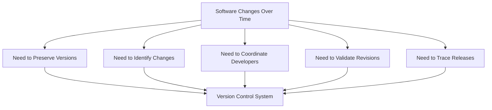

### Fundamental principle

> Version control transforms an evolving collection of files into an identifiable history that other engineering systems can use.

This is why Git forms an important foundation for CI/CD.

---

# 3. Understanding Git From First Principles

Before learning branches and pull requests, we need to understand Git's internal model.

Many Git problems become easier to understand once you know what Git actually stores.

## 3.1 Git is primarily a snapshot-based system

Imagine a repository containing:

```text
myapp/
├── app.ts
├── package.json
└── README.md
```

You create your first commit.

Later, you modify `app.ts` and create another commit.

Conceptually:

```text
Commit A
    |
    v
Snapshot of Project at Time A

Commit B
    |
    v
Snapshot of Project at Time B
```

Git represents committed project states through snapshots.

It does not primarily store every commit as a complete standalone textual patch.

Internally, Git stores content-addressed objects and reuses unchanged objects.

This makes snapshots and history practical.

The official Git documentation explains that commits reference trees representing snapshots and include references to parent commits. [Git](https://git-scm.com/book/en/v2/Git-Branching-Branches-in-a-Nutshell?utm_source=chatgpt.com)

---

# 4. The Four Important Git Object Concepts

To understand Git architecture, learn four terms:

1. Blob
2. Tree
3. Commit
4. Reference

Git also supports annotated tag objects, which we will discuss later.

## 4.1 Blob — File content

A blob represents file contents.

For example:

```typescript
console.log("Hello");
```

Git can store these bytes as a blob object.

The blob does not inherently know the filename or directory path.

It represents content.

### Why does this matter?

Because identical content can be represented by the same object.

Git's object model is based on content identity.

---

## 4.2 Tree — Directory structure

A tree records directory entries.

Entries reference blobs or other trees.

Conceptually:

```text
Tree: project
│
├── app.ts ----------> Blob A
├── package.json ----> Blob B
└── src/ ------------> Tree C
                         |
                         └── service.ts --> Blob D
```

The tree represents the organization of files and subdirectories.

This is how Git represents a project snapshot.

---

## 4.3 Commit — A historical snapshot reference

A commit object contains information such as:

- A reference to a root tree.
- Parent commit references.
- Author information.
- Committer information.
- A commit message.

Conceptually:

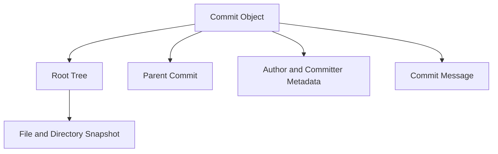

A commit identifies a particular recorded state of the repository and its place in history.

### Why are commits so important for CI/CD?

Suppose GitHub Actions runs tests.

We want the result associated with a particular source revision.

For example:

```text
Source commit:
abc1234

CI validation:
Passed
```

This relationship gives the CI system a concrete revision to validate.

However, the commit identifier alone does not prove that testing occurred or that an artifact is trustworthy.

Those facts require separate evidence.

---

## 4.4 Reference — A name pointing to an object

Git references include branch names and tags.

For example:

```text
main -> Commit C
```

The branch name `main` is a reference.

It is not a separate copy of every file in the repository.

When new commits are added to a branch, its reference can advance to the new commit.

Consider:

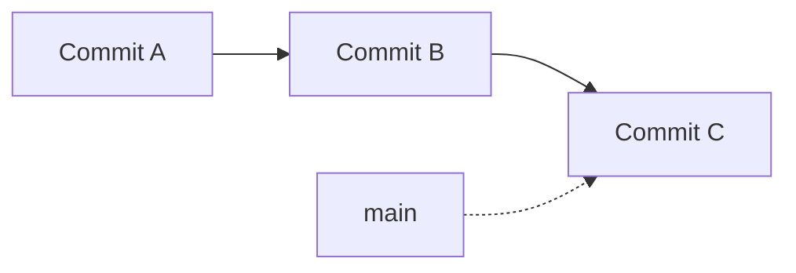

Now another commit is created.

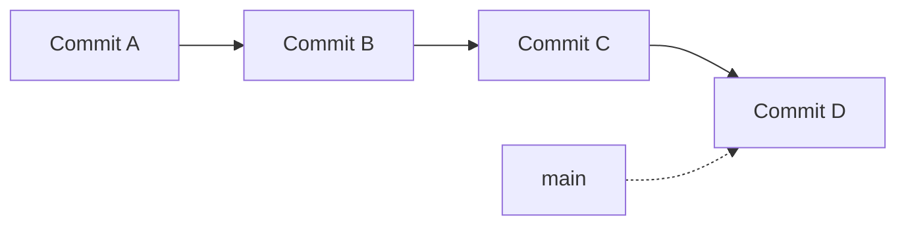

The branch reference moves.

The existing commit objects do not need to be modified.

### Key insight

**A commit represents a recorded revision. A branch name is a movable reference to a revision.**

This distinction becomes critical when designing CI triggers and release processes.

---

# 5. The Working Directory, Staging Area, and Repository

Git beginners often memorize:

```bash
git add
git commit
git push
```

But what do these commands actually do?

To understand them, we need to distinguish three areas.

## 5.1 Working directory

The working directory contains the files you are currently editing.

Example:

```text
app.ts
package.json
README.md
```

You can modify these files without immediately creating a commit.

Your working directory represents the current checked-out project state plus your local modifications.

---

## 5.2 Staging area

The staging area, also called the index, represents what you are preparing for the next commit.

Imagine you modify three files:

```text
app.ts
package.json
README.md
```

But you want to commit only:

```text
app.ts
package.json
```

You can stage them:

```bash
git add app.ts package.json
```

Now the staging area contains the selected versions of those files for the next commit.

### Why is this useful?

Because a commit should ideally represent a logical change.

You may have several unrelated modifications in your working directory.

The staging area allows you to decide what belongs in the next recorded revision.

---

## 5.3 Local repository

When you commit, Git creates objects representing the staged snapshot and commit metadata.

The local repository stores the Git objects and references needed to represent history.

The `.git` directory normally contains Git's local repository metadata.

---

## 5.4 The complete local model

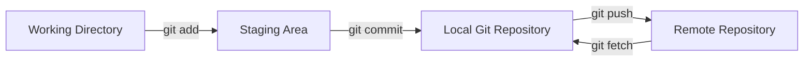

The arrows represent the primary conceptual roles of these commands.

`git add` updates the index from selected working-tree content.

`git commit` records the staged snapshot.

`git push` transfers objects and requests remote reference updates.

`git fetch` retrieves remote objects and updates local remote-tracking references.

Commands such as `git pull` combine fetching with an integration operation, depending on configuration.

### Important distinction

Running:

```bash
git commit -m "Add health endpoint"
```

does not automatically publish the commit to GitHub.

The commit is created locally.

Running:

```bash
git push origin feature/health
```

requests that the remote repository update the specified branch reference.

### First-principles lesson

> Git separates creating a change, selecting a change for a commit, recording a revision, and sharing that revision with other systems.

Those operations have different responsibilities.

---

# 6. Understanding Commit History as a Directed Graph

Now we reach a particularly important concept.

Git history is not simply a chronological list.

Git commits form a **directed acyclic graph**, commonly abbreviated DAG.

A commit generally references its parent commit.

A merge commit can reference multiple parents.

## 6.1 Linear history

Consider:

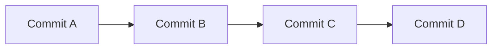

This represents a simple linear history.

Each new commit builds on the previous revision.

---

## 6.2 Divergent history

Now imagine two developers create changes independently.

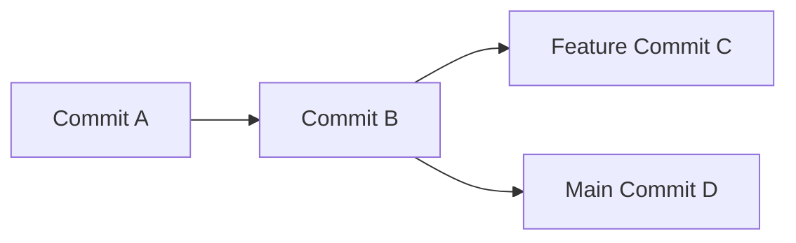

Both changes originate from Commit B.

But they evolve independently.

Neither change automatically contains the other.

This is the foundation of branching.

---

## 6.3 Merge history

Eventually, both lines of development may need to be combined.

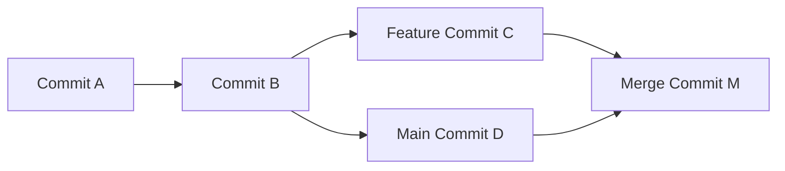

The merge commit combines the histories.

Its commit object can reference both parent commits.

### Why does this matter to CI/CD?

Because different branches may have been validated independently.

But the final combined revision may not be identical to either independently tested revision.

This introduces the fundamental problem of **integration correctness**.

---

# 7. Why Branches Exist

Imagine eight developers working on the same application.

Everyone directly modifies `main`.

Developer A changes authentication.

Developer B changes database queries.

Developer C changes payment processing.

They may introduce incomplete changes into the shared branch.

We need a way to organize independent work.

Branches provide this mechanism.

## 7.1 A branch is not a complete copy of the project

Imagine:

```text
main -> Commit A
```

You create:

```bash
git switch -c feature/login
```

Initially:

```text
main          -> Commit A
feature/login -> Commit A
```

Both references point to the same commit.

Now you create another commit on the feature branch.

```text
main          -> Commit A
feature/login -> Commit B
```

The branch references now point to different revisions.

Git does not need to duplicate the entire repository to create the branch.

This lightweight branching model is explained in the official Git book. [Git](https://git-scm.com/book/en/v2/Git-Branching-Branches-in-a-Nutshell?utm_source=chatgpt.com)

---

## 7.2 Branch lifecycle

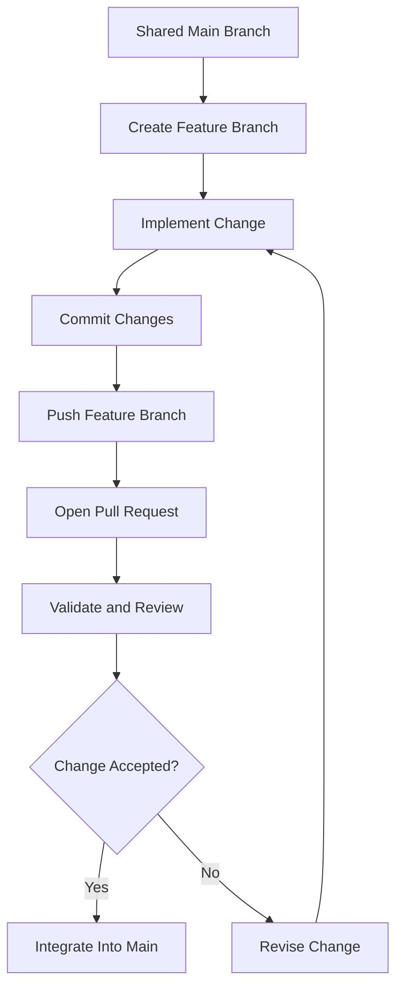

A branch allows changes to evolve before they are integrated into the shared development history.

But branches are not security boundaries by themselves.

A branch does not automatically guarantee:

- Isolation from production infrastructure.
- Secure execution of contributed code.
- Correctness of changes.
- Authorization to merge.
- Successful testing.

Those properties require additional mechanisms.

---

# 8. The Fundamental Problem: Integration Uncertainty

Let's investigate why merging is one of the most important events in a CI/CD system.

Imagine two developers.

Developer A works on authentication.

Developer B works on user-profile functionality.

Both start from the same commit.

### Developer A

Changes the function:

```typescript
function getUser(id: string) {
  return database.findUser(id);
}
```

To:

```typescript
function getUser(id: string, tenantId: string) {
  return database.findUser(id, tenantId);
}
```

### Developer B

Adds code that calls:

```typescript
const user = getUser(userId);
```

Both developers independently validate their features.

Their isolated tests may pass, particularly if their validation does not include the other's change.

But after integration, the combined code may fail type checking or behave incorrectly.

## 8.1 Why?

Because both developers validated different versions of the system.

Developer A validated:

```text
Base Code + Authentication Change
```

Developer B validated:

```text
Base Code + Profile Change
```

But the integrated system is:

```text
Base Code
    +
Authentication Change
    +
Profile Change
```

That is a different software state.

### Fundamental principle

> Validating changes independently does not guarantee that their combined result is valid.

This is one of the core reasons Continuous Integration exists.

---

# 9. Merging: Combining Independent Histories

Now let's understand Git integration strategies.

Suppose our history looks like this:


Both branches changed independently.

We need to integrate them.

## 9.1 Merge commit

One approach creates a new merge commit.


The merge commit preserves the relationship between the two histories.

### Advantages

- Preserves branch integration history.
- Provides an explicit integration point.
- Does not require rewriting existing feature commits.

### Trade-offs

- History can become more complex.
- Frequent merges can create additional merge commits.
- Graph visualization may become harder in large repositories.

---

## 9.2 Squash merge

Another approach combines the net changes from a feature branch into a new commit on the target branch.

Conceptually:

```text
Feature branch:

A -- B -- C -- D

After squash merge into main:

A -- S
```

`S` represents a newly created commit containing the resulting changes.

The original feature commits do not become ancestors of `S` through that squash operation.

### Advantages

- Keeps the target branch history relatively compact.
- Can represent one pull request as one commit.
- Makes it easier to inspect changes at the feature level.

### Trade-offs

- Individual feature-branch commit relationships are not preserved in the target branch history.
- Detailed intermediate development history may be less visible from the main branch.
- Traceability must account for the newly created squash commit.

---

## 9.3 Rebase

Rebase takes changes introduced by one line of history and reapplies them onto a different base.

Suppose:


After rebasing the feature changes onto the updated main branch:

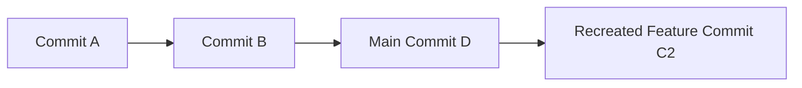

Notice:

The resulting feature commit is a new commit object.

Its parent changed.

Therefore, its identity changes.

### Important principle

**Rebasing rewrites the identities of the commits being replayed.**

It does not simply move their original commit objects to another location.

The official Git documentation distinguishes merge and rebase as two different ways of integrating changes. [Git](https://git-scm.com/book/en/v2/Git-Branching-Rebasing?utm_source=chatgpt.com)

---

# 10. Why Rewriting Git History Matters to CI/CD

Imagine a workflow validates:

```text
Commit SHA:
abc123
```

Then a developer rebases the branch.

The resulting commit becomes:

```text
Commit SHA:
def456
```

Even if the application changes are logically similar, `def456` is a new revision identity.

### Engineering consequence

CI evidence associated with `abc123` should not automatically be treated as evidence that `def456` passed the same validation.

The validation system must consider the relevant source revision and, where appropriate, its intended merge result.

This is why branch updates can trigger new CI executions.

## 10.1 Why force pushing requires care

After rebasing a published feature branch, updating the remote may require rewriting the remote branch reference.

Developers sometimes use:

```bash
git push --force-with-lease
```

This is generally safer than unconditional `--force` because it checks the expected remote reference state before overwriting it.

However, it can still rewrite shared history.

### Risks

- Collaborators may base work on commits that are no longer referenced by the branch.
- Existing review context can become confusing.
- Validation may need to run again.
- Commit references in external systems may no longer represent the branch's current state.

For shared or protected integration branches, history rewriting should generally be restricted.

### Mental model

```text
Commit Identity Changes
          |
          v
Previously Recorded Validation
May No Longer Apply
          |
          v
Re-evaluate the New Revision
```

This principle will be very important when we study GitHub Actions triggers.

---

# 11. Pull Requests: Turning Git Changes Into Controlled Integration

Now we have developers creating branches and commits.

But how should a team decide whether changes are allowed into `main`?

Git itself provides versioning, branching, and merging.

However, Git does not inherently enforce a complete organizational review process.

Platforms such as GitHub provide pull requests and repository rules.

## 11.1 What problem does a pull request solve?

Imagine a developer implements payment functionality.

Before integrating it into `main`, the team wants to know:

1. What changed?
2. Why was the change necessary?
3. Does the implementation meet the requirements?
4. Did automated validation pass?
5. Has someone reviewed the implementation?
6. Can it safely be integrated?

A pull request provides a place to evaluate those questions.

### The architectural model

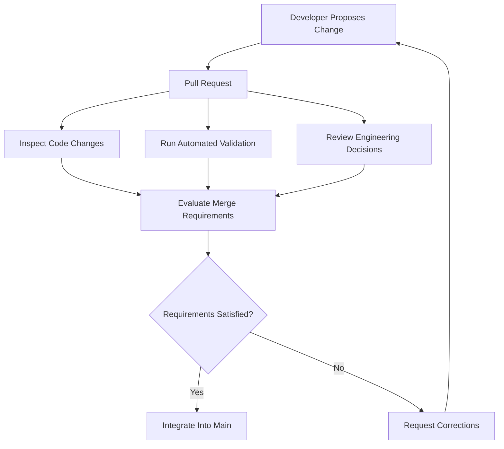

### First-principles insight

> A pull request is a proposed integration of changes, not proof that the changes are correct.

A pull request can exist with failing tests.

It can contain security problems.

It can also be approved despite incomplete validation if the repository's policies allow that.

The platform needs explicit rules to enforce the desired integration process.

---

# 12. Pull Requests as Quality and Authorization Boundaries

Consider our delivery architecture:

```text
Developer
    |
    v
Feature Branch
    |
    v
Pull Request
    |
    v
Validation and Review
    |
    v
Main Branch
    |
    v
Release Build
```

Where does the first major authorization decision occur?

At the integration boundary.

The team must decide whether the proposed change can become part of the shared codebase.

## 12.1 Separate three responsibilities

### Developer

Proposes an implementation.

### CI system

Evaluates configured technical checks.

### Reviewer or authorized policy

Determines whether the change meets the relevant integration requirements.

These responsibilities provide different forms of evidence.

| Responsibility | Question |
|---|---|
| Development | What change are we proposing? |
| Automated validation | Does the change satisfy configured checks? |
| Code review | Is the change appropriate and maintainable? |
| Merge policy | Are the required conditions satisfied? |

A passing CI workflow does not replace engineering review.

Similarly, an approval does not prove that the code compiles.

These mechanisms complement each other.

---

# 13. Branch Protection: Enforcing the Integration Contract

Now imagine we define this rule:

> No change may enter `main` unless required tests pass and the required review policy is satisfied.

How do we enforce it?

GitHub provides branch protection rules and rulesets.

Depending on repository settings and available features, these can require pull requests, status checks, reviews, and other conditions. [GitHub Docs](https://docs.github.com/en/repositories/configuring-branches-and-merges-in-your-repository/managing-protected-branches/about-protected-branches?ref=the-mergify-blog\&utm_source=chatgpt.com)

## 13.1 Without enforcement

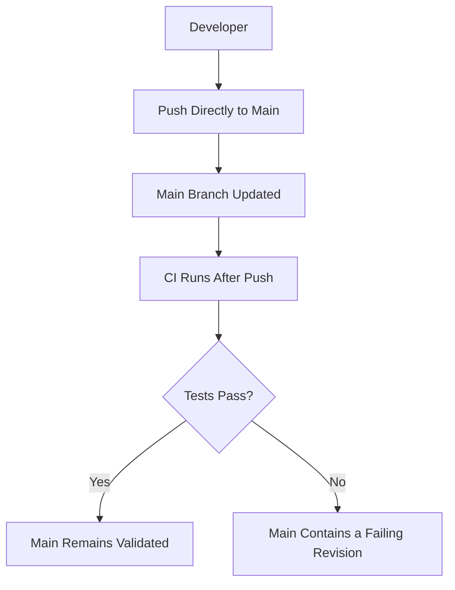

The problem is that CI may discover the failure only after the change has already entered `main`.

The workflow provides feedback, but it may not prevent integration.

## 13.2 With required validation

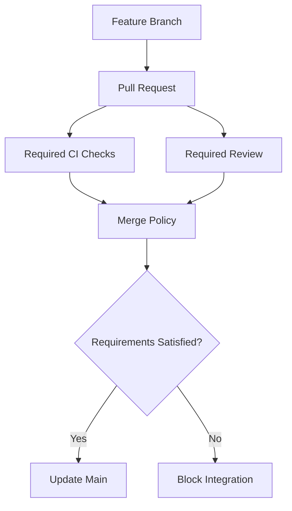

Now the validation result influences the integration decision.

This is a feedback-controlled process.

### Important distinction

**CI execution and CI enforcement are not the same thing.**

You can have a GitHub Actions workflow that runs tests but does not block merges.

For CI results to act as an integration gate, repository policies must require the appropriate checks.

### Additional consideration

Repository administrators, permitted bypass actors, or configuration mistakes can weaken these controls.

The existence of a protection rule does not eliminate the need to audit the actual authorization model.

---

# 14. How GitHub Actions Connects to Git Events

We now understand:

- Commits represent revisions.
- Branches identify lines of development.
- Pull requests propose integration.
- Branch protection can enforce requirements.

But how does GitHub Actions know when to run?

It uses events.

## 14.1 What is an event?

An event represents something that occurred within the platform.

Examples:

- A commit was pushed.
- A pull request was opened.
- A pull request's branch was updated.
- A release was published.
- A workflow was manually requested.
- A merge queue requested validation.

The event can trigger a workflow.

GitHub documents these events and their associated Git references and commit identities. [GitHub Docs](https://docs.github.com/en/actions/reference/workflows-and-actions/events-that-trigger-workflows?utm_source=chatgpt.com)

---

## 14.2 Event-driven architecture

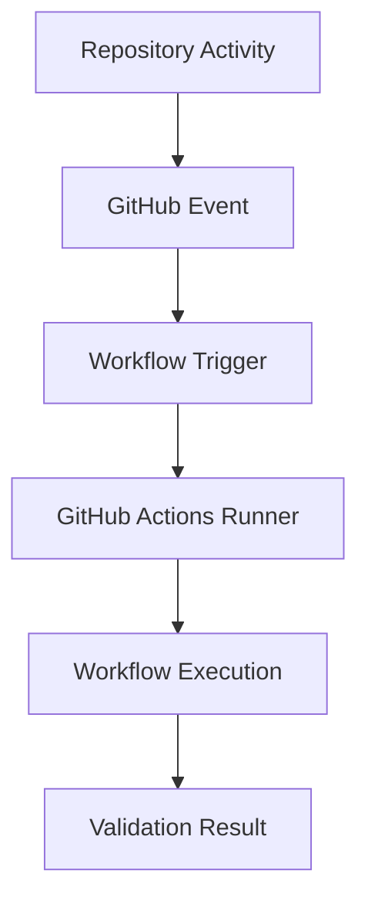

This is a useful architectural concept.

GitHub Actions generally does not need to continuously inspect your repository to discover every change.

GitHub evaluates configured workflow triggers against repository events.

### First-principles explanation

```text
A Relevant Event Occurs
          |
          v
Workflow Trigger Conditions Match
          |
          v
A Workflow Run Is Created
          |
          v
Jobs Execute
          |
          v
Results Are Recorded
```

This is an event-driven execution model.

It differs from the continuous state reconciliation performed by Argo CD.

---

# 15. Understanding `push` and `pull_request`

These two GitHub Actions triggers are especially important.

## 15.1 The `push` event

A push event occurs when a relevant Git reference is updated.

For example:

```bash
git push origin main
```

An illustrative workflow:

```yaml
name: Main Validation

on:
  push:
    branches:
      - main

permissions:
  contents: read

jobs:
  validate:
    runs-on: ubuntu-latest

    steps:
      - name: Checkout source
        uses: actions/checkout@v4

      - name: Show source revision
        run: git rev-parse HEAD
```

The workflow is configured to run on matching pushes to `main`.

### Why is this useful?

Because we may want to validate the actual revision that entered the shared branch.

We can then associate validation and subsequent release operations with that revision.

---

## 15.2 The `pull_request` event

A pull-request workflow validates proposed integration changes.

Example:

```yaml
name: Pull Request Validation

on:
  pull_request:
    branches:
      - main

permissions:
  contents: read

jobs:
  validate:
    runs-on: ubuntu-latest

    steps:
      - name: Checkout code
        uses: actions/checkout@v4

      - name: Show checked-out revision
        run: git rev-parse HEAD
```

The `branches` filter here refers to the pull request's target branch.

It does not mean the feature branch must be named `main`.

### Important GitHub Actions detail

For ordinary `pull_request` workflow execution, `GITHUB_SHA` commonly identifies the synthetic merge commit associated with the pull request.

That is not necessarily the same as the latest commit on the feature branch.

This distinction matters because validation may evaluate the proposed merge result rather than only the contributor's branch tip.

The exact Git reference and SHA depend on the workflow event.

### Engineering consequence

When interpreting CI results, always ask:

**Which revision was actually checked out and tested?**

This is a better question than simply asking whether a pull request has a green check mark.

---

# 16. Why Testing the Feature Branch Alone Is Not Enough

Let's examine a more advanced integration problem.

Suppose `main` currently points to Commit A.

Two developers create separate pull requests.

Developer 1 introduces Commit B.

Developer 2 introduces Commit C.

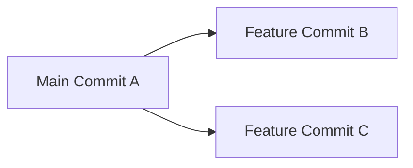

Both developers pass their tests.

Now Developer 1 merges.

The shared branch advances.

```text
main now includes:

A + B
```

Developer 2's existing validation may have been performed without Developer 1's newly merged changes.

The next merge produces:

```text
A + B + C
```

But that combined state may not have been validated.

## 16.1 The integration race

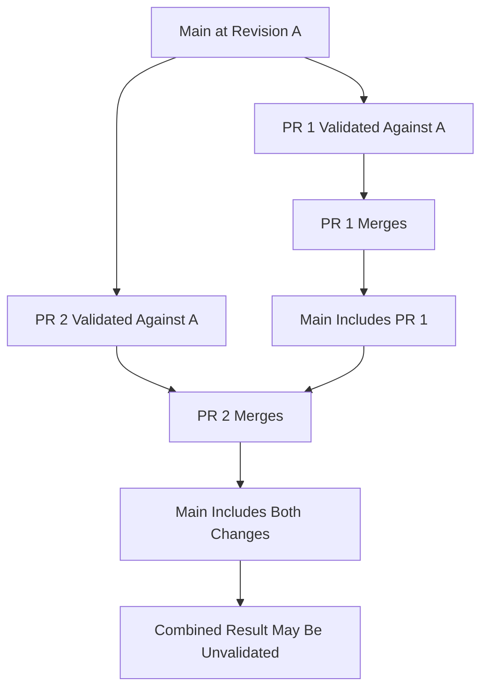

Even if both pull requests passed independently, that does not guarantee their combined result will pass.

### Why does this matter?

Because the source revision used during validation matters.

A CI system should be designed to validate the relevant integration state, especially when several developers merge changes frequently.

---

# 17. Strict Required Checks and Merge Queues

GitHub offers mechanisms to address integration races.

Two important concepts are:

1. Strict required status checks.
2. Merge queues.

## 17.1 Strict required checks

A protected branch can require a pull-request branch to be up to date with the target branch before merging.

This reduces the risk of merging a change that was validated against an outdated target branch.

However, it can cause frequent branch updates and repeated CI runs when the target branch changes often.

GitHub describes strict and loose required-check policies and their trade-offs. [GitHub Docs](https://docs.github.com/en/repositories/configuring-branches-and-merges-in-your-repository/managing-protected-branches/about-protected-branches?ref=the-mergify-blog\&utm_source=chatgpt.com)

---

## 17.2 Merge queues

Imagine a repository receiving many pull requests.

Requiring every developer to repeatedly update their branches can become inefficient.

A merge queue provides another approach.

It prepares proposed merge results based on the current target branch and other queued changes.

Required validation is then performed against the relevant merge-group state.

### Conceptual model

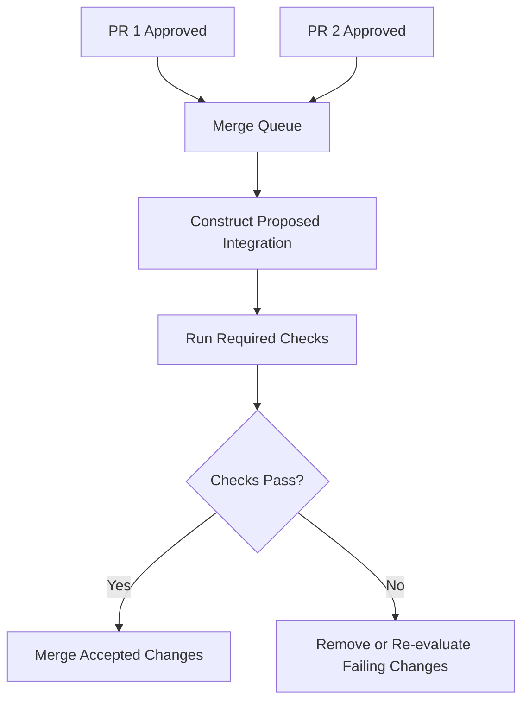

### Why is this valuable?

Because integration validation should reflect the code that is actually intended to enter the target branch.

A merge queue helps coordinate this when many changes arrive concurrently.

GitHub specifically documents merge queues as a mechanism for validating queued combinations against the target branch. [GitHub Docs](https://docs.github.com/en/repositories/configuring-branches-and-merges-in-your-repository/configuring-pull-request-merges/managing-a-merge-queue?utm_source=chatgpt.com)

---

## 17.3 The `merge_group` event

When GitHub's merge queue uses GitHub Actions for required checks, the workflow needs to support the `merge_group` event.

Example:

```yaml
name: Integration Validation

on:
  pull_request:
    branches:
      - main

  merge_group:
    types:
      - checks_requested

permissions:
  contents: read

jobs:
  validate:
    runs-on: ubuntu-latest

    steps:
      - name: Checkout source
        uses: actions/checkout@v4

      - name: Show validated revision
        run: git rev-parse HEAD
```

The `merge_group` event is separate from `push` and `pull_request`.

If a required GitHub Actions check does not run for the merge group, the queue may be unable to complete the merge.

This is explicitly documented by GitHub. [GitHub Docs](https://docs.github.com/en/actions/reference/workflows-and-actions/events-that-trigger-workflows?utm_source=chatgpt.com)

### System-design insight

> As integration concurrency increases, validating isolated changes becomes less sufficient. The delivery system must also account for the combined state entering the shared branch.

For our learning project, a merge queue is not mandatory.

But understanding the problem it solves is valuable.

---

# 18. Trunk-Based Development vs GitFlow

Now we need to make an architectural decision.

**How should developers organize branches?**

There is no universal branching strategy for every organization.

Different strategies optimize for different workflows.

Let's examine two important models.

## 18.1 Trunk-based development

Trunk-based development emphasizes frequent integration into a shared branch, commonly `main`.

Developers may use short-lived branches, but changes are integrated frequently.

```mermaid
flowchart LR
    A["Main A"]
    B["Main B"]
    C["Main C"]
    D["Main D"]
    E["Feature 1"]
    F["Feature 2"]

    A --> B
    B --> C
    C --> D

    A --> E
    E --> B

    B --> F
    F --> C
```

This diagram is conceptual: the main-line commits represent integration points.

### Characteristics

- Frequent integration.
- Short-lived feature branches.
- Rapid automated feedback.
- Smaller integration changes.
- Shared branch maintained in a releasable condition.

### Why does it work well with CI?

Because frequent integration reduces the amount of independently evolving code.

Developers discover incompatibilities earlier.

### Potential challenge

What happens when a feature is incomplete but the team wants to integrate its code?

One solution is a feature flag.

---

## 18.2 Feature flags

Imagine a new checkout implementation is under development.

It is not ready for all users.

Instead of maintaining a feature branch for several months, the team might integrate the implementation behind a flag.

Conceptually:

```typescript
if (featureFlags.newCheckoutEnabled) {
  return newCheckoutService.process(order);
}

return existingCheckoutService.process(order);
```

The new code can be present in the shared codebase while the feature remains disabled for most users.

### Important distinction

**Deploying code is not necessarily the same as enabling a feature for users.**

Feature flags can separate those decisions.

However, flags introduce their own complexity:

- Multiple execution paths.
- Configuration management.
- Testing requirements.
- Cleanup of old flags.
- Authorization and rollout decisions.

They should be used deliberately.

---

## 18.3 GitFlow

GitFlow uses a more structured branching model.

Common branches include:

- `main`
- `develop`
- Feature branches.
- Release branches.
- Hotfix branches.

A simplified architecture:

```mermaid
flowchart TD
    A["Main Branch"]
    B["Develop Branch"]
    C["Feature Branch"]
    D["Release Branch"]
    E["Hotfix Branch"]

    B --> C
    C --> B

    B --> D
    D --> A
    D --> B

    A --> E
    E --> A
    E --> B
```

The arrows describe typical branching and integration relationships, not every individual Git command.

### Why might a team use GitFlow?

Because it wants explicit separation between:

- Ongoing feature development.
- Release stabilization.
- Production releases.
- Emergency fixes.

This can be useful for certain release schedules or products requiring multiple maintained versions.

### Trade-offs

- More branches to coordinate.
- More merge operations.
- Potentially longer integration delays.
- Additional CI policies.
- Greater risk of branch divergence.

---

## 18.4 Compare the strategies

| Criterion | Trunk-based development | GitFlow |
|---|---|---|
| Shared integration branch | Usually `main` | Commonly `develop` |
| Integration frequency | Typically high | Depends on branch lifecycle |
| Feature branches | Usually short-lived | May be longer-lived |
| Release branches | Optional | Central to the model |
| Integration complexity | Often lower with small changes | Can increase with long-lived branches |
| Continuous Delivery compatibility | Strong fit | Possible, with more coordination |
| Multiple maintained versions | Requires an explicit strategy | Release branches can help |
| Operational overhead | Often lower | Often higher |

### Our choice for this course

We will use:

**Trunk-based development with short-lived feature branches and pull requests.**

Our basic model:

```text
feature/* -> Pull Request -> main
```

Then:

```text
main -> Release Build -> Artifact -> GitOps Promotion
```

Why?

Because it provides a relatively simple foundation for frequent integration and automated delivery.

We will introduce release branches only when a requirement justifies them.

---

# 19. Git Branches Are Not Deployment Environments

This is a common source of confusion.

Suppose a project has:

```text
dev
staging
production
```

branches.

A beginner may assume:

```text
dev branch        = Development
staging branch    = Staging
production branch = Production
```

This is possible to implement, but it is not automatically the best design.

Why?

Because a source branch identifies a line of development.

A deployment environment identifies where a selected artifact and configuration should run.

Those are different concepts.

## 19.1 The problem with coupling every environment to a source branch

Imagine:

```text
dev branch -> Builds Image A

staging branch -> Builds Image B

production branch -> Builds Image C
```

Now each environment potentially runs a different independently built artifact.

Even if the intention is to promote the same software, source histories and build outputs can diverge.

This creates unnecessary uncertainty.

---

## 19.2 Alternative: Promote artifact identities

In our reference architecture:

```mermaid
flowchart TD
    A["Application Main Branch"]
    B["Release Build"]
    C["Immutable Image Digest"]
    D["Development GitOps Configuration"]
    E["Staging GitOps Configuration"]
    F["Production GitOps Configuration"]

    A --> B
    B --> C

    C --> D
    C --> E
    C --> F
```

The same artifact can be referenced by multiple environments.

Each environment can have a different approved deployment configuration.

### Example

```text
Source:
main at commit abc123

Artifact:
Image digest XYZ

Development:
Deploy digest XYZ

Staging:
Deploy digest XYZ

Production:
Deploy digest XYZ after approval
```

Here, development, staging, and production are represented through deployment configuration, not necessarily separate application source branches.

### Fundamental principle

> Source integration strategy and environment promotion strategy are separate architectural decisions.

This distinction will become especially important when we study GitOps and Argo CD.

---

# 20. Git Tags and Release Identity

We have discussed branches and commits.

Now let's understand tags.

## 20.1 What is a Git tag?

A tag is a named reference used to identify a particular object, often a commit.

For example:

```bash
git tag -a v1.0.0 -m "Release 1.0.0"
```

This creates an annotated tag.

Conceptually:

```mermaid
flowchart LR
    A["Commit A"]
    B["Commit B"]
    C["Commit C"]
    D["Release Tag v1.0.0"]

    A --> B
    B --> C

    D -.-> C
```

Tags are useful for identifying software releases.

But a tag is not the same thing as a container image.

---

## 20.2 Lightweight vs annotated tags

### Lightweight tag

A simple reference to an object.

Example:

```bash
git tag v1.0.0
```

### Annotated tag

Creates a tag object that can contain metadata such as:

- Tagger information.
- Tagging date.
- Message.
- Optional cryptographic signature.

Example:

```bash
git tag -a v1.0.0 -m "Production release 1.0.0"
```

Annotated tags are often useful for formal release records.

However, tags can be changed or deleted by authorized actors unless appropriate protections prevent it.

### Important distinction

**A Git tag is a convenient release reference, not automatic proof of artifact integrity or deployment authorization.**

---

# 21. Git Commit vs Build Artifact vs Deployed Release

Let's connect Git to Phase 03.

Suppose our application is at:

```text
Git commit:
abc123
```

GitHub Actions builds an image.

The image is published with a digest.

Then the GitOps repository is updated.

```mermaid
flowchart TD
    A["Application Git Commit"]
    B["CI Workflow Run"]
    C["Container Image Digest"]
    D["GitOps Commit"]
    E["Argo CD"]
    F["Kubernetes Deployment"]
    G["Running Application"]

    A --> B
    B --> C
    C --> D
    D --> E
    E --> F
    F --> G
```

Now we have several identities.

| Identity | What it identifies |
|---|---|
| Application commit SHA | Source revision |
| Workflow run ID | CI execution |
| Image digest | Built container artifact |
| GitOps commit SHA | Desired deployment configuration revision |
| Kubernetes resource state | Observed deployment configuration and status |

These identities answer different questions.

### Question 1

Which application source produced the image?

Use the source revision recorded in build metadata.

### Question 2

Which workflow created the image?

Use the recorded workflow execution information.

### Question 3

Which image was deployed?

Inspect the selected image reference and the actual image identity reported by the runtime.

### Question 4

Who authorized the production deployment?

Inspect the release approval and GitOps change history.

### Question 5

What was running during the incident?

Use deployment history and actual runtime evidence.

### The deeper lesson

> Git is a major foundation of delivery traceability, but complete traceability requires connections between source history, builds, artifacts, configuration, and observed runtime state.

---

# 22. The Complete Git Lifecycle in CI/CD

We now understand the individual components.

Let's combine them into the complete lifecycle of a software change.

Our scenario:

A developer needs to add a new endpoint to a Node.js application.

The application is deployed to Kubernetes through GitHub Actions and Argo CD.

## 22.1 The complete lifecycle

```mermaid
flowchart TD
    A["Developer Receives Requirement"]
    B["Create Feature Branch"]
    C["Implement Change"]
    D["Create Commits"]
    E["Push Branch to GitHub"]
    F["Open Pull Request"]
    G["GitHub Actions Validation"]
    H{"Validation Passed?"}
    I["Fix and Push New Commit"]
    J["Code Review"]
    K{"Review Approved?"}
    L["Merge Into Main"]
    M["Release Workflow"]
    N["Build and Publish Image"]
    O["Propose GitOps Update"]
    P["Release Authorization"]
    Q["Approved GitOps Configuration"]
    R["Argo CD Reconciliation"]
    S["Kubernetes Deployment"]
    T["Production Verification"]

    A --> B
    B --> C
    C --> D
    D --> E
    E --> F
    F --> G
    G --> H

    H -->|No| I
    I --> E

    H -->|Yes| J
    J --> K

    K -->|No| I
    K -->|Yes| L

    L --> M
    M --> N
    N --> O
    O --> P
    P --> Q
    Q --> R
    R --> S
    S --> T
```

This diagram represents the logical responsibilities.

It does not imply every change must reach production immediately after merging.

Release authorization and environment promotion policies determine when a validated artifact becomes eligible for deployment.

---

## 22.2 Understand every transition

| Stage | Event | System responsibility |
|---|---|---|
| Requirement | Work is requested | Define intended software change |
| Feature branch | Developer creates branch | Isolate development history |
| Commit | Developer records revision | Preserve an identifiable source state |
| Push | Remote branch is updated | Share the revision |
| Pull request | Integration is proposed | Start review and validation |
| CI | Workflow evaluates change | Produce validation evidence |
| Review | Change is evaluated | Determine engineering acceptability |
| Merge | Shared branch advances | Integrate approved source changes |
| Release workflow | Release event occurs | Build a chosen source revision |
| Artifact publication | Image is published | Store identifiable software |
| GitOps change | Deployment update is proposed | Record desired release intent |
| Release authorization | Policy is evaluated | Permit or reject deployment |
| Argo CD | Desired state is reconciled | Synchronize managed Kubernetes resources |
| Kubernetes | Workload state is managed | Run the requested application |
| Verification | Runtime behavior is observed | Assess release outcome |

### Important architectural distinction

A Git commit is a source-control event.

A successful CI workflow is validation evidence.

A merge is an integration event.

Artifact publication is a release-engineering event.

Updating the GitOps repository is a deployment-intent change.

Argo CD synchronization is a deployment-management operation.

These are separate events, even when automation connects them.

---

# 23. Failure Scenarios in the Git Lifecycle

A good CI/CD Engineer understands what happens when the source-control workflow fails.

Let's analyze common situations.

## Failure 1: Developers commit directly to `main`

### Problem

A developer bypasses the intended review process.

### Consequence

The change may enter the shared branch without satisfying the required validation policy.

### Architectural response

Configure appropriate branch protection or repository rulesets.

Require applicable checks and review policies.

Restrict unauthorized bypasses.

---

## Failure 2: CI runs but merges are not blocked

### Problem

Tests execute on pull requests, but the repository does not require their results.

### Consequence

Developers may merge changes even when tests fail.

### Architectural response

Make the appropriate status checks mandatory through repository protection.

Also ensure the checks actually execute for the relevant changes.

**Remember:** Running validation and enforcing validation are different responsibilities.

---

## Failure 3: CI validates an outdated integration state

### Problem

A pull request passes tests, but `main` changes before integration.

### Consequence

The final combination of changes may not have been validated.

### Architectural response

Depending on requirements, use:

- Strict required checks.
- Merge queues.
- Post-merge validation.
- Additional integration testing.

The appropriate mechanism depends on repository activity and the required confidence level.

---

## Failure 4: A required workflow does not execute

Imagine a workflow uses:

```yaml
on:
  pull_request:
    paths:
      - "src/**"
```

But the repository requires a status check produced by that workflow.

A pull request changes only:

```text
package.json
```

The workflow might not run because the path filter does not match.

The required check can remain pending, preventing integration.

GitHub documents this as a possible cause of missing required-check results. [GitHub Docs](https://docs.github.com/en/pull-requests/how-tos/merge-and-close-pull-requests/troubleshooting-required-status-checks?apiVersion=2022-11-28\&utm_source=chatgpt.com)

### Architectural lesson

A validation policy must align with the events and paths that actually trigger its implementation.

Do not accidentally make an essential check disappear for relevant changes.

---

## Failure 5: Force push rewrites shared history

### Problem

Someone changes commit history after collaborators or automation have based work on existing revisions.

### Consequence

- Existing references become outdated.
- Integration becomes more complicated.
- Validation must account for new commit identities.
- Release traceability becomes harder.

### Architectural response

Restrict history rewriting on shared integration branches.

Prefer new corrective commits over rewriting already published release history.

---

## Failure 6: A tag is moved after release

### Problem

A release workflow relies entirely on a mutable tag.

Someone reassigns that tag.

### Consequence

The tag may now identify a different source revision.

### Architectural response

Use appropriate tag protection or rulesets.

Record the exact source SHA and artifact digest.

For sensitive release processes, add suitable artifact integrity and provenance controls.

---

## Failure 7: A compromised workflow modifies production GitOps configuration

### Problem

CI automation has unrestricted write access to the production GitOps branch.

### Consequence

An attacker or faulty workflow may be able to change the production desired state.

Even without direct Kubernetes credentials, the workflow may have effective deployment authority.

### Architectural response

Separate artifact publishing from production authorization.

Use appropriately scoped identities and permissions.

Require approval where necessary.

Protect the authoritative production configuration.

### Important insight

> The security of a GitOps deployment system depends partly on who can change the Git references that Argo CD trusts.

We will explore this further in Phase 14.

---

# 24. Practical Lab 04 — Understand Git Through Its Internal Behavior

Now let's implement a small experiment.

We will not use Docker, Azure, or Kubernetes.

The purpose is to understand Git's fundamental behavior before adding CI/CD tooling.

**Lab objective:** Observe snapshots, branch references, divergence, merging, and conflicts.

You only need:

- Git
- A terminal
- A text editor

The experiment is completely local.

---

## Lab Part A — Create a repository

Create a directory:

```bash
mkdir cicd-git-lab

cd cicd-git-lab
```

Initialize Git:

```bash
git init -b main
```

If Git reports that your author identity is not configured, set an identity locally for this laboratory:

```bash
git config user.name "Git Lab"
git config user.email "git-lab@example.invalid"
```

Create a file:

```bash
printf "service=ecommerce-api\n" > service.txt
```

Inspect the working directory:

```bash
git status
```

### Think before proceeding

What does Git know about this file?

Is it committed?

Does it belong to the repository's recorded history?

At this point, the file exists in the working directory but has not been committed.

---

## Lab Part B — Create your first snapshot

Stage the file:

```bash
git add service.txt
```

Inspect the staging area:

```bash
git diff --cached
```

Create a commit:

```bash
git commit -m "chore: initialize ecommerce service"
```

Inspect history:

```bash
git log --oneline
```

### Your task

Answer:

1. What changed after `git add`?
2. What changed after `git commit`?
3. What does the commit SHA identify?
4. Where is the commit stored?
5. Has the commit been published to GitHub?

Do not simply memorize the commands.

Explain the state transitions.

---

## Lab Part C — Inspect Git objects

Run:

```bash
git rev-parse HEAD
```

This displays the current commit identifier.

Now inspect the commit:

```bash
git cat-file -p HEAD
```

You should see information such as:

```text
tree <object-id>
author ...
committer ...

chore: initialize ecommerce service
```

The exact values depend on your repository.

### What should you observe?

The commit references a tree object.

It also contains metadata.

Now run:

```bash
git ls-tree HEAD
```

This displays entries in the committed tree.

### Engineering questions

What does the commit point to?

What does the tree describe?

Where is the content of `service.txt` represented?

### Key learning

A commit does not simply mean "a folder of files."

It identifies a recorded snapshot through Git's object model.

---

## Lab Part D — Create independent branches

Create the first feature branch:

```bash
git switch -c feature/catalog
```

Modify the file:

```bash
printf "service=ecommerce-api\nfeature=catalog\n" > service.txt
```

Commit:

```bash
git add service.txt

git commit -m "feat: add catalog configuration"
```

Return to `main`:

```bash
git switch main
```

Create another branch:

```bash
git switch -c feature/pricing
```

Modify the same file:

```bash
printf "service=ecommerce-api\nfeature=pricing\n" > service.txt
```

Commit:

```bash
git add service.txt

git commit -m "feat: add pricing configuration"
```

Now inspect the repository:

```bash
git log --graph --oneline --decorate --all
```

### Expected conceptual history

```mermaid
flowchart LR
    A["Initial Commit"]
    B["Catalog Commit"]
    C["Pricing Commit"]

    A --> B
    A --> C
```

### Think

Both branches began at the same commit.

Both modified the same file.

Do their changes automatically include one another?

No.

They represent independent lines of development.

This is the source of integration uncertainty.

---

## Lab Part E — Integrate the first feature

Switch to `main`:

```bash
git switch main
```

Merge the catalog branch:

```bash
git merge --no-ff feature/catalog \
  -m "merge: integrate catalog feature"
```

Inspect the history:

```bash
git log --graph --oneline --decorate --all
```

The catalog change is now part of `main`.

### Think

Why is `feature/pricing` not automatically updated?

Because moving the `main` reference does not automatically rewrite every other branch.

---

## Lab Part F — Attempt the second integration

Run:

```bash
git merge --no-ff feature/pricing \
  -m "merge: integrate pricing feature"
```

Because both branches replaced the same content differently, Git should report a merge conflict.

Inspect the status:

```bash
git status
```

Inspect the file:

```bash
cat service.txt
```

You should see conflict markers similar to:

```text
<<<<<<< HEAD
service=ecommerce-api
feature=catalog
=======
service=ecommerce-api
feature=pricing
>>>>>>> feature/pricing
```

### What does this mean?

Git could not automatically determine the intended combined content.

The two histories contain conflicting modifications.

A human must decide what the final file should contain.

### Resolve the conflict

For this exercise, we want both features.

Replace the file:

```bash
printf "service=ecommerce-api\nfeature=catalog\nfeature=pricing\n" > service.txt
```

Stage the resolution:

```bash
git add service.txt
```

Complete the merge:

```bash
git commit
```

Git will normally open the editor with the prepared merge message.

Save and close the editor to finish the merge.

Now inspect:

```bash
git log --graph --oneline --decorate --all
```

And:

```bash
cat service.txt
```

### Final conceptual history

```mermaid
flowchart LR
    A["Initial Commit"]
    B["Catalog Commit"]
    C["Pricing Commit"]
    D["Catalog Merge"]
    E["Pricing Merge"]

    A --> B
    A --> C

    B --> D
    A --> D

    C --> E
    D --> E
```

This represents the parent relationships of the commits in this exercise.

---

## Lab Part G — Reason about the result

Now answer these questions without looking at the explanations:

1. Why did the two feature branches diverge?
2. Why was the first merge straightforward?
3. Why did the second merge require manual resolution?
4. Does resolving a textual conflict prove that the combined application works?
5. Why should CI validate the integrated result?
6. Could two branches introduce a behavioral conflict even if Git reports no merge conflict?
7. What does the final merge commit represent?
8. Which revision should a release workflow build?

### The most important observation

Git can detect some conflicting modifications to files.

But Git does not understand all application behavior.

Two changes can merge cleanly and still produce an incorrect application.

Therefore:

> **Successful Git integration is not the same as successful software integration.**

That is one of the strongest arguments for Continuous Integration.

---

# 25. Practical Lab 04B — Connect Git to GitHub Actions

Now extend your understanding.

Imagine the repository contains a Node.js application.

You want:

- Pull requests to trigger validation.
- Merges to `main` to trigger additional validation.
- Releases to be created only from approved source revisions.

We will start with the workflow architecture rather than implementing a complex pipeline.

## 25.1 Create a workflow

File:

```text
.github/workflows/validate.yaml
```

Example:

```yaml
name: Source Validation

on:
  pull_request:
    branches:
      - main

  push:
    branches:
      - main

permissions:
  contents: read

jobs:
  validate:
    runs-on: ubuntu-latest

    steps:
      - name: Checkout repository
        uses: actions/checkout@v4

      - name: Print revision information
        run: |
          echo "Event: $GITHUB_EVENT_NAME"
          echo "Ref: $GITHUB_REF"
          echo "SHA: $GITHUB_SHA"

      - name: Validate patch formatting
        run: git diff --check
```

This is an introductory example.

`git diff --check` is not a substitute for application tests. It checks for whitespace-related problems in the relevant diff.

### What should you study?

Do not memorize the workflow syntax.

Instead, answer:

1. What events can trigger the workflow?
2. Which branch filter is used?
3. What identity does the workflow execute as?
4. What repository permissions are granted?
5. What source revision is checked out?
6. What information is produced?
7. Does a passing workflow automatically block bad merges?

The final answer is no.

Repository protection must require the appropriate checks for them to become an enforced merge condition.

---

## 25.2 Extend the architecture mentally

Suppose the validation workflow passes.

The pull request is reviewed and merged.

A separate release workflow runs on `main`.

What should it do?

Think in responsibilities:

```mermaid
flowchart TD
    A["Approved Main Revision"]
    B["Release Workflow"]
    C["Build Application"]
    D["Build Container Image"]
    E["Publish Image"]
    F["Record Image Digest"]
    G["Propose GitOps Release Update"]

    A --> B
    B --> C
    C --> D
    D --> E
    E --> F
    F --> G
```

### Questions

Why should the release workflow record the source SHA?

Why should it record the image digest?

Why should publication succeed before promotion?

Why should the workflow not automatically require cluster-admin access?

If you can explain these questions, you are beginning to understand the relationship between Git and CI/CD architecture.

---

# 26. Design Exercise — Choose a Git Workflow for a Real Team

Imagine the following organization.

### Company requirements

- 12 backend developers.
- One Node.js application.
- Approximately 15 pull requests each day.
- Kubernetes production environment.
- GitHub Actions for CI.
- Argo CD for deployment.
- Development deployments should be frequent.
- Production releases require approval.
- The team wants to minimize integration problems.

You are the DevOps Engineer.

Your job is to design the Git lifecycle.

## Step 1: Choose the branching model

Would you choose:

- Trunk-based development?
- GitFlow?
- A custom branching strategy?

Explain the reason.

Do not choose GitFlow merely because it contains more branches.

---

## Step 2: Define the integration policy

Answer:

1. Can developers push directly to `main`?
2. Are pull requests required?
3. Which checks are mandatory?
4. Is code review required?
5. Are force pushes allowed on `main`?
6. Should a merge queue be used?
7. What happens if CI fails?

---

## Step 3: Define release triggers

Answer:

1. When should an artifact be built?
2. Which source revision should the release workflow use?
3. Should every merge automatically deploy to development?
4. What event should initiate staging promotion?
5. Who authorizes production promotion?
6. Is production deployment tied to a source branch or a GitOps configuration change?

---

## Step 4: Define traceability

For each production release, determine how to retrieve:

```text
Application Source Commit
        |
        v
Validation Results
        |
        v
Release Build Execution
        |
        v
Container Image Digest
        |
        v
Production GitOps Revision
        |
        v
Production Deployment Evidence
```

Explain where each piece of information is stored.

---

## Step 5: Define failure behavior

Consider this situation:

```text
PR 1: Passed

PR 2: Passed

PR 1: Merged

PR 2: Merged

Main Branch CI: Failed
```

Explain:

- How this could happen.
- Why independently passing checks may not be enough.
- How strict checks or merge queues could help.
- What the team should do if `main` becomes broken.
- How you would prevent an unvalidated release from reaching production.

### Design challenge

Your solution should minimize unnecessary complexity.

You do not need to introduce a separate tool for every problem.

Use GitHub repository policies, GitHub Actions, and the delivery architecture we have already established.

---

# 27. Memorization — Build Six Mental Models

Let's reduce the entire phase to six important ideas.

## Mental Model 1: Git preserves software evolution

```text
Changing Files
      |
      v
Recorded Snapshots
      |
      v
Commit History
      |
      v
Identifiable Source Revisions
```

Remember:

**Git gives software changes history and identity.**

---

## Mental Model 2: A branch is a movable reference

```text
Commit:
Recorded Revision

Branch:
Movable Reference to a Commit
```

Branches are not complete duplicated repositories.

---

## Mental Model 3: Git integration is not software validation

```text
Merge Successful
       !=
Application Correct
```

Git combines changes.

CI evaluates whether the resulting software satisfies configured checks.

---

## Mental Model 4: A pull request proposes integration

```text
Developer Change
       |
       v
Pull Request
       |
       v
Validation and Review
       |
       v
Merge Decision
```

A pull request organizes proposed integration.

Policies determine whether it is authorized.

---

## Mental Model 5: Git events trigger CI

```text
Git Event
    |
    v
Workflow Trigger
    |
    v
CI Execution
    |
    v
Validation Result
```

The workflow should evaluate the relevant revision or proposed integration state.

---

## Mental Model 6: Git history connects development to production

```text
Source Commit
      |
      v
CI Validation
      |
      v
Build Artifact
      |
      v
GitOps Desired State
      |
      v
Production Deployment
```

Remember:

**Git identifies source revisions, but artifacts and deployments require their own identities and evidence.**

---

# 28. Active Recall Questions

Close your notes and answer from memory.

### Git fundamentals

**Q1.** What fundamental problem does version control solve?

**Q2.** What is the difference between a blob, tree, commit, and branch reference?

**Q3.** Why is a branch not a complete copy of the repository?

**Q4.** What is the staging area?

**Q5.** What changes when you execute `git add`, `git commit`, and `git push`?

**Q6.** Why is Git history described as a directed acyclic graph?

### Integration thinking

**Q7.** Why can two independently correct changes fail when merged?

**Q8.** What is the difference between merging and rebasing?

**Q9.** Why does rebase create new commit identities?

**Q10.** Why doesn't a successful merge guarantee application correctness?

### CI/CD architecture

**Q11.** What is the architectural purpose of a pull request?

**Q12.** What is the difference between running CI and enforcing required CI checks?

**Q13.** Why can a pull request pass CI and still break `main` after integration?

**Q14.** What problem does a merge queue solve?

**Q15.** Why should source branching and environment promotion be treated as separate design decisions?

**Q16.** What is the relationship between a Git commit SHA and a container image digest?

**Q17.** How do GitHub Actions events connect Git changes to CI execution?

**Q18.** Why can write access to a production GitOps branch represent effective deployment authority?

### Revision method

Use active recall rather than rereading the entire phase repeatedly.

Suggested schedule:

| When | Activity |
|---|---|
| Immediately | Answer all 18 questions |
| Next day | Reconstruct Git's object and branching model |
| After 3 days | Explain PR validation and integration races |
| After 7 days | Redraw the Git-to-production lifecycle from memory |

Try to explain the concepts without using tool names first.

Then connect each concept to its implementation.

---

# 29. Interview and System-Design Questions

These questions require deeper reasoning.

### Question 1

Your team has ten developers.

Every pull request runs automated tests.

However, `main` frequently breaks after merges.

Why can this happen, and what changes would you recommend?

### Question 2

A developer rebases a branch after CI passes.

Should the team assume the new revision is already validated?

Explain using Git's commit identity model.

### Question 3

How would you enforce a policy requiring review and successful CI checks before integrating code into `main`?

### Question 4

Explain the difference between:

- Git merge.
- Git rebase.
- Squash merge.

How might each affect source history and traceability?

### Question 5

When is trunk-based development a better fit than GitFlow?

When might release branches be justified?

### Question 6

Why is it risky to use the `latest` container image tag for production releases?

How is this different from identifying the application source with a Git commit SHA?

### Question 7

A GitHub Actions workflow publishes a new image whenever `main` changes.

Should publishing that image automatically authorize a production deployment?

Explain your release architecture.

### Question 8

How would you use GitHub Actions and Argo CD together while maintaining separate responsibilities for source integration, artifact production, and production deployment?

### Question 9

A company maintains independent `dev`, `staging`, and `production` source branches.

Each branch rebuilds the application before deployment.

What problems might arise?

How would you redesign the workflow to promote immutable artifacts?

### Question 10

Your company wants to use GitHub merge queues.

What GitHub Actions event must be supported for required merge-group validation?

Why is the normal pull-request event alone insufficient?

---

# 30. Official Documentation — Learn Through the Underlying Model

Do not attempt to memorize every Git command.

Use official documentation to connect the commands to the behavior we discussed.

## 30.1 Git internals

**Git Book — Git Internals**

https://git-scm.com/book/en/v2/Git-Internals-Git-Objects

Study:

- Git objects.
- Blobs.
- Trees.
- Commits.
- References.

**Your question:**

How does Git represent a project snapshot without creating an independent full copy of the repository for every branch?

---

## 30.2 Git branching

**Git Book — Branches in a Nutshell**

https://git-scm.com/book/en/v2/Git-Branching-Branches-in-a-Nutshell

Study:

- Branch references.
- Commit relationships.
- Divergent history.
- Merge commits.

**Your question:**

What actually changes when a branch receives a new commit?

---

## 30.3 Git merging and rebasing

**Git Book — Rebasing**

https://git-scm.com/book/en/v2/Git-Branching-Rebasing

Study:

- Three-way merging.
- Rebasing.
- History rewriting.
- Shared history implications.

**Your question:**

Why does changing a commit's parent create a new commit identity?

---

## 30.4 GitHub protected branches

**GitHub — About Protected Branches**

https://docs.github.com/en/repositories/configuring-branches-and-merges-in-your-repository/managing-protected-branches/about-protected-branches

Study:

- Required checks.
- Required reviews.
- Strict validation.
- Force-push restrictions.
- Bypass controls.

**Your question:**

What mechanisms convert a recommended development process into an enforceable integration policy?

---

## 30.5 GitHub Actions events

**GitHub — Events That Trigger Workflows**

https://docs.github.com/en/actions/reference/workflows-and-actions/events-that-trigger-workflows

Study:

- `push`
- `pull_request`
- `merge_group`
- Event payloads.
- Git references.
- Commit SHA behavior.

**Your question:**

How does GitHub Actions know which source revision should be validated?

---

## 30.6 Merge queues

**GitHub — Managing a Merge Queue**

https://docs.github.com/en/repositories/configuring-branches-and-merges-in-your-repository/configuring-pull-request-merges/managing-a-merge-queue

Study:

- Merge-group validation.
- Required checks.
- Integration sequencing.
- Queued pull requests.

**Your question:**

How can a team safely integrate many independently developed changes without relying only on stale validation results?

---

# 31. Phase 04 — Engineering Takeaways

| Principle | Engineering meaning |
|---|---|
| **Git preserves change history** | Software revisions can be identified and investigated. |
| **Commits represent snapshots** | Each commit references a recorded project state and its history. |
| **Branches are movable references** | Independent development does not require separate repository copies. |
| **Staging controls commit contents** | Developers can select the changes that belong in a logical commit. |
| **Git history is a graph** | Independent histories can diverge and later be integrated. |
| **Merging is not validation** | Successfully combining files does not prove application correctness. |
| **Commit identity matters** | CI evidence must correspond to the relevant source revision. |
| **Pull requests propose integration** | They provide a place for validation, review, and merge decisions. |
| **Repository policies enforce requirements** | Tests that run but are not required may not prevent bad merges. |
| **Integration concurrency creates risk** | Independently passing changes can produce an unvalidated combination. |
| **Merge queues coordinate integration** | They help validate changes against the intended target-branch state. |
| **Branching strategies are architectural decisions** | Different models produce different coordination costs. |
| **Source branches are not environments** | Application integration and deployment promotion are separate concerns. |
| **Tags are release references** | They do not replace immutable artifact identities. |
| **GitOps makes Git operationally important** | Changes to approved GitOps configuration can affect production. |
| **Traceability crosses systems** | Source commits must connect to builds, artifacts, configuration, and deployments. |

---

# 32. Final Understanding

Let's return to our central question.

**How do we organize, validate, integrate, and authorize software changes so that CI/CD can deliver them reliably?**

We begin by representing software changes as identifiable Git revisions.

Developers work on branches.

Their commits form independent lines of history.

Pull requests propose the integration of those changes.

CI validates the relevant source revisions and integration states.

Repository policies determine whether integration is allowed.

Once approved changes enter the shared branch, release automation can produce identifiable artifacts.

Release policies then determine when those artifacts may be deployed.

GitOps configuration records the desired deployment state.

Argo CD and Kubernetes perform their respective reconciliation responsibilities.

Finally, production feedback helps the engineering team evaluate actual behavior.

## 32.1 The complete system

```mermaid
flowchart TD
    A["Developer Requirement"]
    B["Feature Branch"]
    C["Git Commits"]
    D["Pull Request"]
    E["CI Validation"]
    F{"Integration Requirements Met?"}
    G["Developer Correction"]
    H["Shared Main Branch"]
    I["Release Build"]
    J["Immutable Artifact"]
    K["Container Registry"]
    L["Release Authorization"]
    M["GitOps Repository"]
    N["Argo CD"]
    O["Kubernetes"]
    P["Running Application"]
    Q["Operational Feedback"]

    A --> B
    B --> C
    C --> D
    D --> E
    E --> F

    F -->|No| G
    G --> C

    F -->|Yes| H

    H --> I
    I --> J
    J --> K

    K --> L
    L --> M

    M --> N
    N --> O
    O --> P
    P --> Q

    Q -.-> A
```

The most important realization is that Git is much more than a command-line utility.

Git supplies the versioned source history on which the rest of the delivery system depends.

CI builds on that history to produce validation evidence.

Release engineering connects validated revisions to artifacts.

GitOps uses version-controlled configuration to communicate deployment intent.

### The most important principle of Phase 04

> **Git provides the history and identity of software changes. CI validates those changes, repository policies control their integration, and release engineering connects approved revisions to deployable artifacts and production environments.**

Once you understand this relationship, GitHub Actions becomes easier to reason about.

You stop thinking only about:

```yaml
on:
  push:
    branches:
      - main
```

And start asking:

**Which event occurred? Which revision is being validated? What authorization does this event represent? What evidence must exist before the next stage can proceed?**

That is first-principles thinking in CI/CD.

---

# Phase 04 Complete

**Completed:** Level 1 — Phase 04: Git Lifecycle

## Level 1 Progress

| Phase | Topic | Status |
|---|---|---|
| 01 | Why CI/CD Exists | Completed |
| 02 | Feedback and Control Systems | Completed |
| 03 | Delivery Architecture | Completed |
| 04 | Git Lifecycle | Completed |

**Level 1 — Fundamentals is complete.**

We have established four foundations:

1. **Why:** CI/CD exists to make software delivery controlled, repeatable, and verifiable.
2. **Feedback:** Systems must observe results and respond to differences between intended and actual behavior.
3. **Architecture:** Delivery systems consist of components with distinct responsibilities, relationships, and trust boundaries.
4. **Change management:** Git provides the revision history and integration model on which CI/CD operates.

---

## Next: Level 2 — Continuous Integration

### Phase 05 — CI Architecture

**File:** `Level-2-Continuous-Integration/Phase-05-CI-Architecture.md`

In Phase 05, we will begin designing the internal architecture of a Continuous Integration system.

We will investigate:

- What actually happens after a developer pushes a commit.
- The architecture of a CI platform.
- Events, workflow orchestration, jobs, steps, and runners.
- How GitHub Actions schedules and executes work.
- Why CI runners should be treated as execution environments.
- How to divide validation into stages.
- Sequential versus parallel execution.
- Dependencies between CI jobs.
- Fail-fast behavior and failure propagation.
- Caching versus artifact storage.
- Ephemeral versus persistent runners.
- CI performance, reliability, and cost trade-offs.
- How to design a CI pipeline from application requirements.
- How to distinguish a successful workflow from a trustworthy build.

### Central engineering question

> **Given a source revision and a set of validation requirements, how do we design a CI system that produces reliable evidence about the change while balancing execution time, resource cost, and failure isolation?**

We'll use **GitHub Actions** as our implementation platform while continuing to derive every major decision from the underlying engineering problem.

**Send `next` to begin Phase 05 — CI Architecture.**