# Phase 05 — CI Architecture: Designing Continuous Integration From First Principles

**Level 2: Continuous Integration | CI/CD From First Principles**

**File:** `Level-2-Continuous-Integration/Phase-05-CI-Architecture.md`

**Previous:** Phase 04 — Git Lifecycle  
**Next:** Phase 06 — Testing and Quality Gates

---

# 1. What Will You Learn?

Welcome to **Level 2 — Continuous Integration**.

In Level 1, we established four foundations:

- **Phase 01:** Why CI/CD exists.
- **Phase 02:** How feedback and control systems work.
- **Phase 03:** How to design a complete software delivery architecture.
- **Phase 04:** How Git organizes, integrates, and identifies software changes.

Now we will investigate what happens **after a developer submits a change and before that change becomes a trusted software artifact**.

This is where Continuous Integration operates.

Most CI/CD tutorials begin with something like:

```
name: CI

on:
  push:
    branches:
      - main

jobs:
  build:
    runs-on: ubuntu-latest

    steps:
      - run: echo "Hello CI"
```

You learn the syntax.

But you still might not understand:

- Why do we need jobs?
- Why does each job need a runner?
- Why are jobs sometimes executed in parallel?
- What determines execution order?
- Why can one job succeed while the entire workflow fails?
- Why doesn't a job automatically access files created by another job?
- What is the difference between a cache and an artifact?
- Why might a successful pipeline still produce an unreliable build?
- How should a CI system handle failure?
- How do we decide which tests should execute first?
- How do we balance speed, cost, reliability, and confidence?

These are architecture questions.

Our objective is to understand the engineering principles behind the workflow rather than memorize GitHub Actions YAML.

## Learning objectives

By the end of this phase, you should understand:

1. What a CI system fundamentally does.
2. How CI differs from generic task automation.
3. How to translate validation requirements into pipeline architecture.
4. The fundamental components of a CI platform.
5. GitHub Actions events, workflows, jobs, steps, actions, and runners.
6. How a source revision becomes an executable CI workload.
7. Job isolation and execution environments.
8. Sequential versus parallel execution.
9. How dependency graphs determine execution order.
10. How failures propagate through a CI pipeline.
11. The difference between caches, artifacts, and job outputs.
12. Ephemeral versus persistent execution environments.
13. How to optimize feedback speed without sacrificing useful validation.
14. How to design reliable CI pipelines that are reproducible and traceable.
15. How to implement and experimentally validate a small multi-job CI system.

Our central question is:

> **Given a specific source revision and a set of engineering requirements, how do we design a system that executes validation reliably and produces trustworthy evidence about that revision?**

---

# 2. First Principle: CI Is an Evidence-Producing System

Let's begin with a simple problem.

You maintain a Node.js and TypeScript backend.

A developer modifies the payment calculation logic.

Previously:

```
export function calculateTotal(price: number): number {
  return price;
}
```

The developer changes it:

```
export function calculateTotal(price: number): number {
  return price * 1.18;
}
```

The developer says:

> The feature is complete. It works on my machine.

As the engineer responsible for software delivery, should you immediately approve the change?

Not necessarily.

We need evidence.

## 2.1 What do we actually want to know?

Before integration, we may want answers to these questions:

1. Does the TypeScript code compile?
2. Are dependencies installed consistently?
3. Does the application pass its tests?
4. Does the change break existing behavior?
5. Can the application be built?
6. Does the proposed change work with the target branch?
7. Are the required checks actually evaluating the intended revision?

Notice something important.

We are not asking whether the developer is confident.

We are asking whether the system can produce evidence supporting the integration decision.

This reveals our first principle:

> **Continuous Integration is fundamentally a practice of frequently integrating software changes and systematically gathering feedback about their correctness and compatibility.**

Automation supports that practice.

---

# 3. Deriving the Requirements for a CI System

Let's derive the architecture from the engineering problem.

Suppose eight developers are modifying the same application.

Every developer must validate their changes.

Without CI, they might execute:

```
npm install
npm run build
npm test
```

But each developer may:

- Use a different Node.js version.
- Have different installed dependencies.
- Forget a test command.
- Have uncommitted local changes.
- Use a different operating system.
- Accidentally ignore failing checks.
- Test a different revision from the one submitted.

The problem is not simply that testing is manual.

**The deeper problem is that validation evidence is inconsistent and difficult to reproduce.**

## 3.1 Problem → Requirement → System capability

|Fundamental problem|Engineering requirement|Required capability|
|---|---|---|
|Developers test different revisions|Identify the exact source being tested|Source revision selection|
|Validation starts inconsistently|Start validation from defined events|Trigger mechanism|
|Developers use different environments|Standardize execution conditions|Managed execution environments|
|Different checks must run|Coordinate validation tasks|Workflow orchestration|
|Some checks depend on others|Enforce execution dependencies|Dependency management|
|Failures can be overlooked|Record and report results|Status reporting|
|Builds produce files needed later|Preserve selected outputs|Artifact management|
|Repeated work wastes time|Reuse safe intermediate data|Dependency caching|
|Many changes arrive simultaneously|Allocate execution capacity|Scheduling and concurrency control|
|Untrusted code may execute|Restrict permissions and execution boundaries|Runner isolation and authorization|
|Results must support decisions|Associate results with the relevant revision|Traceability|

Now we have the responsibilities of a CI system.

We still haven't selected GitHub Actions.

That is intentional.

**First identify what the system must do. Then choose technology that provides those capabilities.**

---

# 4. The Fundamental CI Architecture

At its simplest, a CI system needs:

1. An input.
2. A trigger.
3. An execution mechanism.
4. Validation operations.
5. Results.
6. Feedback.

Let's draw that architecture.

#chatgpt-mermaid-_r_9r9_{font-family:-apple-system-body,ui-sans-serif,-apple-system,system-ui,"Segoe UI","Helvetica","Apple Color Emoji","Arial",sans-serif,"Segoe UI Emoji","Segoe UI Symbol";font-size:16px;fill:rgb(237, 237, 237);}@keyframes edge-animation-frame{from{stroke-dashoffset:0;}}@keyframes dash{to{stroke-dashoffset:0;}}#chatgpt-mermaid-_r_9r9_ .edge-animation-slow{stroke-dasharray:9,5!important;stroke-dashoffset:900;animation:dash 50s linear infinite;stroke-linecap:round;}#chatgpt-mermaid-_r_9r9_ .edge-animation-fast{stroke-dasharray:9,5!important;stroke-dashoffset:900;animation:dash 20s linear infinite;stroke-linecap:round;}#chatgpt-mermaid-_r_9r9_ .error-icon{fill:rgb(48, 48, 48);}#chatgpt-mermaid-_r_9r9_ .error-text{fill:rgb(237, 237, 237);stroke:rgb(237, 237, 237);}#chatgpt-mermaid-_r_9r9_ .edge-thickness-normal{stroke-width:1px;}#chatgpt-mermaid-_r_9r9_ .edge-thickness-thick{stroke-width:3.5px;}#chatgpt-mermaid-_r_9r9_ .edge-pattern-solid{stroke-dasharray:0;}#chatgpt-mermaid-_r_9r9_ .edge-thickness-invisible{stroke-width:0;fill:none;}#chatgpt-mermaid-_r_9r9_ .edge-pattern-dashed{stroke-dasharray:3;}#chatgpt-mermaid-_r_9r9_ .edge-pattern-dotted{stroke-dasharray:2;}#chatgpt-mermaid-_r_9r9_ .marker{fill:rgb(175, 175, 175);stroke:rgb(175, 175, 175);}#chatgpt-mermaid-_r_9r9_ .marker.cross{stroke:rgb(175, 175, 175);}#chatgpt-mermaid-_r_9r9_ svg{font-family:-apple-system-body,ui-sans-serif,-apple-system,system-ui,"Segoe UI","Helvetica","Apple Color Emoji","Arial",sans-serif,"Segoe UI Emoji","Segoe UI Symbol";font-size:16px;}#chatgpt-mermaid-_r_9r9_ p{margin:0;}#chatgpt-mermaid-_r_9r9_ .label{font-family:-apple-system-body,ui-sans-serif,-apple-system,system-ui,"Segoe UI","Helvetica","Apple Color Emoji","Arial",sans-serif,"Segoe UI Emoji","Segoe UI Symbol";color:rgb(237, 237, 237);}#chatgpt-mermaid-_r_9r9_ .cluster-label text{fill:rgb(237, 237, 237);}#chatgpt-mermaid-_r_9r9_ .cluster-label span{color:rgb(237, 237, 237);}#chatgpt-mermaid-_r_9r9_ .cluster-label span p{background-color:transparent;}#chatgpt-mermaid-_r_9r9_ .label text,#chatgpt-mermaid-_r_9r9_ span{fill:rgb(237, 237, 237);color:rgb(237, 237, 237);}#chatgpt-mermaid-_r_9r9_ .node rect,#chatgpt-mermaid-_r_9r9_ .node circle,#chatgpt-mermaid-_r_9r9_ .node ellipse,#chatgpt-mermaid-_r_9r9_ .node polygon,#chatgpt-mermaid-_r_9r9_ .node path{fill:rgb(9, 23, 44);stroke:rgb(31, 78, 148);stroke-width:1px;}#chatgpt-mermaid-_r_9r9_ .rough-node .label text,#chatgpt-mermaid-_r_9r9_ .node .label text,#chatgpt-mermaid-_r_9r9_ .image-shape .label,#chatgpt-mermaid-_r_9r9_ .icon-shape .label{text-anchor:middle;}#chatgpt-mermaid-_r_9r9_ .node .katex path{fill:#000;stroke:#000;stroke-width:1px;}#chatgpt-mermaid-_r_9r9_ .rough-node .label,#chatgpt-mermaid-_r_9r9_ .node .label,#chatgpt-mermaid-_r_9r9_ .image-shape .label,#chatgpt-mermaid-_r_9r9_ .icon-shape .label{text-align:center;}#chatgpt-mermaid-_r_9r9_ .node.clickable{cursor:pointer;}#chatgpt-mermaid-_r_9r9_ .root .anchor path{fill:rgb(175, 175, 175)!important;stroke-width:0;stroke:rgb(175, 175, 175);}#chatgpt-mermaid-_r_9r9_ .arrowheadPath{fill:rgb(175, 175, 175);}#chatgpt-mermaid-_r_9r9_ .edgePath .path{stroke:rgb(175, 175, 175);stroke-width:1px;}#chatgpt-mermaid-_r_9r9_ .flowchart-link{stroke:rgb(175, 175, 175);fill:none;}#chatgpt-mermaid-_r_9r9_ .edgeLabel{background-color:rgb(0, 0, 0);text-align:center;}#chatgpt-mermaid-_r_9r9_ .edgeLabel p{background-color:rgb(0, 0, 0);}#chatgpt-mermaid-_r_9r9_ .edgeLabel rect{opacity:0.5;background-color:rgb(0, 0, 0);fill:rgb(0, 0, 0);}#chatgpt-mermaid-_r_9r9_ .labelBkg{background-color:rgba(0, 0, 0, 0.5);}#chatgpt-mermaid-_r_9r9_ .cluster rect{fill:rgb(48, 48, 48);stroke:rgba(255, 255, 255, 0.15);stroke-width:1px;}#chatgpt-mermaid-_r_9r9_ .cluster text{fill:rgb(237, 237, 237);}#chatgpt-mermaid-_r_9r9_ .cluster span{color:rgb(237, 237, 237);}#chatgpt-mermaid-_r_9r9_ div.mermaidTooltip{position:absolute;text-align:center;max-width:200px;padding:2px;font-family:-apple-system-body,ui-sans-serif,-apple-system,system-ui,"Segoe UI","Helvetica","Apple Color Emoji","Arial",sans-serif,"Segoe UI Emoji","Segoe UI Symbol";font-size:12px;background:rgb(48, 48, 48);border:1px solid rgba(255, 255, 255, 0.15);border-radius:2px;pointer-events:none;z-index:100;}#chatgpt-mermaid-_r_9r9_ .flowchartTitleText{text-anchor:middle;font-size:18px;fill:rgb(237, 237, 237);}#chatgpt-mermaid-_r_9r9_ rect.text{fill:none;stroke-width:0;}#chatgpt-mermaid-_r_9r9_ .icon-shape,#chatgpt-mermaid-_r_9r9_ .image-shape{background-color:rgb(0, 0, 0);text-align:center;}#chatgpt-mermaid-_r_9r9_ .icon-shape p,#chatgpt-mermaid-_r_9r9_ .image-shape p{background-color:rgb(0, 0, 0);padding:2px;}#chatgpt-mermaid-_r_9r9_ .icon-shape .label rect,#chatgpt-mermaid-_r_9r9_ .image-shape .label rect{opacity:0.5;background-color:rgb(0, 0, 0);fill:rgb(0, 0, 0);}#chatgpt-mermaid-_r_9r9_ .label-icon{display:inline-block;height:1em;overflow:visible;vertical-align:-0.125em;}#chatgpt-mermaid-_r_9r9_ .node .label-icon path{fill:currentColor;stroke:revert;stroke-width:revert;}#chatgpt-mermaid-_r_9r9_ .node .neo-node{stroke:rgb(31, 78, 148);}#chatgpt-mermaid-_r_9r9_ [data-look="neo"].node rect,#chatgpt-mermaid-_r_9r9_ [data-look="neo"].cluster rect,#chatgpt-mermaid-_r_9r9_ [data-look="neo"].node polygon{stroke:url(#chatgpt-mermaid-_r_9r9_-gradient);filter:drop-shadow( 1px 2px 2px rgba(185,185,185,1));}#chatgpt-mermaid-_r_9r9_ [data-look="neo"].swimlane.cluster rect{filter:none;}#chatgpt-mermaid-_r_9r9_ [data-look="neo"].node path{stroke:url(#chatgpt-mermaid-_r_9r9_-gradient);stroke-width:1px;}#chatgpt-mermaid-_r_9r9_ [data-look="neo"].node .outer-path{filter:drop-shadow( 1px 2px 2px rgba(185,185,185,1));}#chatgpt-mermaid-_r_9r9_ [data-look="neo"].node .neo-line path{stroke:rgb(31, 78, 148);filter:none;}#chatgpt-mermaid-_r_9r9_ [data-look="neo"].node circle{stroke:url(#chatgpt-mermaid-_r_9r9_-gradient);filter:drop-shadow( 1px 2px 2px rgba(185,185,185,1));}#chatgpt-mermaid-_r_9r9_ [data-look="neo"].node circle .state-start{fill:#000000;}#chatgpt-mermaid-_r_9r9_ [data-look="neo"].icon-shape .icon{fill:url(#chatgpt-mermaid-_r_9r9_-gradient);filter:drop-shadow( 1px 2px 2px rgba(185,185,185,1));}#chatgpt-mermaid-_r_9r9_ [data-look="neo"].icon-shape .icon-neo path{stroke:url(#chatgpt-mermaid-_r_9r9_-gradient);filter:drop-shadow( 1px 2px 2px rgba(185,185,185,1));}#chatgpt-mermaid-_r_9r9_ .node text{font-size:14px;font-weight:600;letter-spacing:normal;fill:rgb(232, 232, 232);}#chatgpt-mermaid-_r_9r9_ .edgeLabels text{font-size:13px;font-weight:600;letter-spacing:-0.08px;fill:rgb(232, 232, 232);}#chatgpt-mermaid-_r_9r9_ .node tspan[font-weight="normal"],#chatgpt-mermaid-_r_9r9_ .edgeLabels tspan[font-weight="normal"]{font-weight:600;}#chatgpt-mermaid-_r_9r9_ .edgeLabel .label rect{opacity:1;rx:13px;ry:13px;fill:rgb(19, 19, 19);stroke:rgb(47, 47, 47);stroke-width:1px;}#chatgpt-mermaid-_r_9r9_ .node rect,#chatgpt-mermaid-_r_9r9_ .node circle,#chatgpt-mermaid-_r_9r9_ .node ellipse,#chatgpt-mermaid-_r_9r9_ .node polygon,#chatgpt-mermaid-_r_9r9_ .node path{fill:rgb(24, 24, 24);stroke:rgba(255, 255, 255, 0.1);stroke-width:1px;}#chatgpt-mermaid-_r_9r9_ .node rect{rx:16px;ry:16px;}#chatgpt-mermaid-_r_9r9_ .node.mermaid-decision .label-container{fill:rgb(19, 19, 19);stroke:rgb(47, 47, 47);stroke-dasharray:2px,2px;}#chatgpt-mermaid-_r_9r9_ .edgePaths .flowchart-link{stroke:rgb(175, 175, 175);stroke-width:1px;stroke-linecap:round;stroke-linejoin:round;}#chatgpt-mermaid-_r_9r9_ .marker{fill:rgb(175, 175, 175);stroke:rgb(175, 175, 175);}#chatgpt-mermaid-_r_9r9_ :root{--mermaid-font-family:-apple-system-body,ui-sans-serif,-apple-system,system-ui,"Segoe UI","Helvetica","Apple Color Emoji","Arial",sans-serif,"Segoe UI Emoji","Segoe UI Symbol";}Source RevisionRepository EventCI OrchestratorExecution EnvironmentValidation TasksValidation ResultsDeveloper FeedbackIntegration Decision

This is a generic CI architecture.

It could be implemented with:

- GitHub Actions.
- Jenkins.
- GitLab CI.
- Azure Pipelines.
- Another CI orchestration platform.

The architecture remains conceptually similar.

## 4.1 Input: Source revision

The system needs to know exactly which source revision to validate.

For example:

```
Repository:
ecommerce-api

Git Commit:
abc1234

Event:
pull_request
```

A CI result is meaningful only when we know what it evaluated.

---

## 4.2 Trigger: Why should CI start?

Possible events include:

```
Pull Request Opened

Pull Request Updated

Commit Pushed

Merge Group Created

Manual Workflow Request
```

The trigger defines when validation begins.

This is a control-plane responsibility.

---

## 4.3 Orchestrator: What should execute?

The orchestrator determines which configured jobs should run.

It coordinates:

- Workflow triggers.
- Job dependencies.
- Runner allocation.
- Execution status.
- Conditional execution.
- Completion reporting.

For our implementation, GitHub Actions provides these orchestration capabilities.

---

## 4.4 Execution environment: Where should tasks run?

The system needs computing resources.

These resources might be:

- Virtual machines.
- Containers.
- Self-hosted servers.
- Ephemeral Kubernetes-based runners.

In GitHub Actions, the execution worker is called a **runner**.

We will examine runners in detail shortly.

---

## 4.5 Validation tasks: What should the system evaluate?

Examples include:

```
Dependency Installation
        |
        v
Static Analysis
        |
        v
Type Checking
        |
        v
Unit Tests
        |
        v
Integration Tests
        |
        v
Build Verification
```

This is only one possible sequence.

Some checks can execute independently.

Others require outputs from earlier tasks.

Determining the correct relationships is a pipeline architecture problem.

---

## 4.6 Results: What evidence was produced?

A validation run can produce:

- Exit codes.
- Test reports.
- Build logs.
- Coverage reports.
- Compiled files.
- Validation metadata.
- Workflow status.

Results must be interpreted according to what the checks actually measured.

For example:

```
TypeScript Compilation: Passed

Unit Tests: Passed

Integration Tests: Not Executed
```

This does not mean the entire application has been verified.

It means the executed checks passed.

### Fundamental principle

> A CI system can only provide confidence about the properties it actually evaluates.

This distinction will become central in Phase 06.

---

# 5. CI as a Function of Source, Environment, and Validation

We can represent a CI execution conceptually as:

```
CI Result
    =
Evaluate(
    Source Revision,
    Dependencies,
    Execution Environment,
    Validation Rules,
    External Test Conditions
)
```

Why do we include so many inputs?

Because the same source code can produce different validation outcomes under different conditions.

For example:

```
Source Revision: abc123

Node.js 22:
Tests Passed

Node.js 18:
Tests Failed
```

Or:

```
Source Revision: abc123

PostgreSQL Available:
Integration Tests Passed

PostgreSQL Unavailable:
Integration Tests Failed
```

Therefore, the CI result depends on more than Git history.

### Two important forms of failure

**Product failure:** The application violates a required property.

**Validation infrastructure failure:** The mechanism evaluating the application cannot execute correctly.

For example:

```
Unit assertion failed
    -> Potential application defect
```

```
Runner lost network connectivity
    -> Potential infrastructure failure
```

Both may result in a failed workflow.

But they require different corrective actions.

A well-designed CI system should preserve enough information to distinguish them.

---

# 6. Understand the GitHub Actions Architecture

Now that we have derived the responsibilities, let's map them to GitHub Actions.

## 6.1 Main components

GitHub Actions uses several important concepts:

|Component|Responsibility|
|---|---|
|Event|Indicates when something happened|
|Workflow|Defines an automation process|
|Workflow run|Represents one execution of a workflow|
|Job|Groups steps executed on a runner|
|Step|Performs one operation within a job|
|Action|Reusable implementation of a task|
|Runner|Provides the execution environment|
|Artifact|Preserves selected files produced by execution|
|Cache|Reuses selected data to accelerate later execution|
|Status/result|Records execution outcomes|

GitHub documents workflows, jobs, steps, actions, and runners as core concepts of its automation platform. [GitHub Docs](https://docs.github.com/en/actions/concepts/workflows-and-actions?utm_source=chatgpt.com)

---

## 6.2 Architecture diagram

#chatgpt-mermaid-_r_9sm_{font-family:-apple-system-body,ui-sans-serif,-apple-system,system-ui,"Segoe UI","Helvetica","Apple Color Emoji","Arial",sans-serif,"Segoe UI Emoji","Segoe UI Symbol";font-size:16px;fill:rgb(237, 237, 237);}@keyframes edge-animation-frame{from{stroke-dashoffset:0;}}@keyframes dash{to{stroke-dashoffset:0;}}#chatgpt-mermaid-_r_9sm_ .edge-animation-slow{stroke-dasharray:9,5!important;stroke-dashoffset:900;animation:dash 50s linear infinite;stroke-linecap:round;}#chatgpt-mermaid-_r_9sm_ .edge-animation-fast{stroke-dasharray:9,5!important;stroke-dashoffset:900;animation:dash 20s linear infinite;stroke-linecap:round;}#chatgpt-mermaid-_r_9sm_ .error-icon{fill:rgb(48, 48, 48);}#chatgpt-mermaid-_r_9sm_ .error-text{fill:rgb(237, 237, 237);stroke:rgb(237, 237, 237);}#chatgpt-mermaid-_r_9sm_ .edge-thickness-normal{stroke-width:1px;}#chatgpt-mermaid-_r_9sm_ .edge-thickness-thick{stroke-width:3.5px;}#chatgpt-mermaid-_r_9sm_ .edge-pattern-solid{stroke-dasharray:0;}#chatgpt-mermaid-_r_9sm_ .edge-thickness-invisible{stroke-width:0;fill:none;}#chatgpt-mermaid-_r_9sm_ .edge-pattern-dashed{stroke-dasharray:3;}#chatgpt-mermaid-_r_9sm_ .edge-pattern-dotted{stroke-dasharray:2;}#chatgpt-mermaid-_r_9sm_ .marker{fill:rgb(175, 175, 175);stroke:rgb(175, 175, 175);}#chatgpt-mermaid-_r_9sm_ .marker.cross{stroke:rgb(175, 175, 175);}#chatgpt-mermaid-_r_9sm_ svg{font-family:-apple-system-body,ui-sans-serif,-apple-system,system-ui,"Segoe UI","Helvetica","Apple Color Emoji","Arial",sans-serif,"Segoe UI Emoji","Segoe UI Symbol";font-size:16px;}#chatgpt-mermaid-_r_9sm_ p{margin:0;}#chatgpt-mermaid-_r_9sm_ .label{font-family:-apple-system-body,ui-sans-serif,-apple-system,system-ui,"Segoe UI","Helvetica","Apple Color Emoji","Arial",sans-serif,"Segoe UI Emoji","Segoe UI Symbol";color:rgb(237, 237, 237);}#chatgpt-mermaid-_r_9sm_ .cluster-label text{fill:rgb(237, 237, 237);}#chatgpt-mermaid-_r_9sm_ .cluster-label span{color:rgb(237, 237, 237);}#chatgpt-mermaid-_r_9sm_ .cluster-label span p{background-color:transparent;}#chatgpt-mermaid-_r_9sm_ .label text,#chatgpt-mermaid-_r_9sm_ span{fill:rgb(237, 237, 237);color:rgb(237, 237, 237);}#chatgpt-mermaid-_r_9sm_ .node rect,#chatgpt-mermaid-_r_9sm_ .node circle,#chatgpt-mermaid-_r_9sm_ .node ellipse,#chatgpt-mermaid-_r_9sm_ .node polygon,#chatgpt-mermaid-_r_9sm_ .node path{fill:rgb(9, 23, 44);stroke:rgb(31, 78, 148);stroke-width:1px;}#chatgpt-mermaid-_r_9sm_ .rough-node .label text,#chatgpt-mermaid-_r_9sm_ .node .label text,#chatgpt-mermaid-_r_9sm_ .image-shape .label,#chatgpt-mermaid-_r_9sm_ .icon-shape .label{text-anchor:middle;}#chatgpt-mermaid-_r_9sm_ .node .katex path{fill:#000;stroke:#000;stroke-width:1px;}#chatgpt-mermaid-_r_9sm_ .rough-node .label,#chatgpt-mermaid-_r_9sm_ .node .label,#chatgpt-mermaid-_r_9sm_ .image-shape .label,#chatgpt-mermaid-_r_9sm_ .icon-shape .label{text-align:center;}#chatgpt-mermaid-_r_9sm_ .node.clickable{cursor:pointer;}#chatgpt-mermaid-_r_9sm_ .root .anchor path{fill:rgb(175, 175, 175)!important;stroke-width:0;stroke:rgb(175, 175, 175);}#chatgpt-mermaid-_r_9sm_ .arrowheadPath{fill:rgb(175, 175, 175);}#chatgpt-mermaid-_r_9sm_ .edgePath .path{stroke:rgb(175, 175, 175);stroke-width:1px;}#chatgpt-mermaid-_r_9sm_ .flowchart-link{stroke:rgb(175, 175, 175);fill:none;}#chatgpt-mermaid-_r_9sm_ .edgeLabel{background-color:rgb(0, 0, 0);text-align:center;}#chatgpt-mermaid-_r_9sm_ .edgeLabel p{background-color:rgb(0, 0, 0);}#chatgpt-mermaid-_r_9sm_ .edgeLabel rect{opacity:0.5;background-color:rgb(0, 0, 0);fill:rgb(0, 0, 0);}#chatgpt-mermaid-_r_9sm_ .labelBkg{background-color:rgba(0, 0, 0, 0.5);}#chatgpt-mermaid-_r_9sm_ .cluster rect{fill:rgb(48, 48, 48);stroke:rgba(255, 255, 255, 0.15);stroke-width:1px;}#chatgpt-mermaid-_r_9sm_ .cluster text{fill:rgb(237, 237, 237);}#chatgpt-mermaid-_r_9sm_ .cluster span{color:rgb(237, 237, 237);}#chatgpt-mermaid-_r_9sm_ div.mermaidTooltip{position:absolute;text-align:center;max-width:200px;padding:2px;font-family:-apple-system-body,ui-sans-serif,-apple-system,system-ui,"Segoe UI","Helvetica","Apple Color Emoji","Arial",sans-serif,"Segoe UI Emoji","Segoe UI Symbol";font-size:12px;background:rgb(48, 48, 48);border:1px solid rgba(255, 255, 255, 0.15);border-radius:2px;pointer-events:none;z-index:100;}#chatgpt-mermaid-_r_9sm_ .flowchartTitleText{text-anchor:middle;font-size:18px;fill:rgb(237, 237, 237);}#chatgpt-mermaid-_r_9sm_ rect.text{fill:none;stroke-width:0;}#chatgpt-mermaid-_r_9sm_ .icon-shape,#chatgpt-mermaid-_r_9sm_ .image-shape{background-color:rgb(0, 0, 0);text-align:center;}#chatgpt-mermaid-_r_9sm_ .icon-shape p,#chatgpt-mermaid-_r_9sm_ .image-shape p{background-color:rgb(0, 0, 0);padding:2px;}#chatgpt-mermaid-_r_9sm_ .icon-shape .label rect,#chatgpt-mermaid-_r_9sm_ .image-shape .label rect{opacity:0.5;background-color:rgb(0, 0, 0);fill:rgb(0, 0, 0);}#chatgpt-mermaid-_r_9sm_ .label-icon{display:inline-block;height:1em;overflow:visible;vertical-align:-0.125em;}#chatgpt-mermaid-_r_9sm_ .node .label-icon path{fill:currentColor;stroke:revert;stroke-width:revert;}#chatgpt-mermaid-_r_9sm_ .node .neo-node{stroke:rgb(31, 78, 148);}#chatgpt-mermaid-_r_9sm_ [data-look="neo"].node rect,#chatgpt-mermaid-_r_9sm_ [data-look="neo"].cluster rect,#chatgpt-mermaid-_r_9sm_ [data-look="neo"].node polygon{stroke:url(#chatgpt-mermaid-_r_9sm_-gradient);filter:drop-shadow( 1px 2px 2px rgba(185,185,185,1));}#chatgpt-mermaid-_r_9sm_ [data-look="neo"].swimlane.cluster rect{filter:none;}#chatgpt-mermaid-_r_9sm_ [data-look="neo"].node path{stroke:url(#chatgpt-mermaid-_r_9sm_-gradient);stroke-width:1px;}#chatgpt-mermaid-_r_9sm_ [data-look="neo"].node .outer-path{filter:drop-shadow( 1px 2px 2px rgba(185,185,185,1));}#chatgpt-mermaid-_r_9sm_ [data-look="neo"].node .neo-line path{stroke:rgb(31, 78, 148);filter:none;}#chatgpt-mermaid-_r_9sm_ [data-look="neo"].node circle{stroke:url(#chatgpt-mermaid-_r_9sm_-gradient);filter:drop-shadow( 1px 2px 2px rgba(185,185,185,1));}#chatgpt-mermaid-_r_9sm_ [data-look="neo"].node circle .state-start{fill:#000000;}#chatgpt-mermaid-_r_9sm_ [data-look="neo"].icon-shape .icon{fill:url(#chatgpt-mermaid-_r_9sm_-gradient);filter:drop-shadow( 1px 2px 2px rgba(185,185,185,1));}#chatgpt-mermaid-_r_9sm_ [data-look="neo"].icon-shape .icon-neo path{stroke:url(#chatgpt-mermaid-_r_9sm_-gradient);filter:drop-shadow( 1px 2px 2px rgba(185,185,185,1));}#chatgpt-mermaid-_r_9sm_ .node text{font-size:14px;font-weight:600;letter-spacing:normal;fill:rgb(232, 232, 232);}#chatgpt-mermaid-_r_9sm_ .edgeLabels text{font-size:13px;font-weight:600;letter-spacing:-0.08px;fill:rgb(232, 232, 232);}#chatgpt-mermaid-_r_9sm_ .node tspan[font-weight="normal"],#chatgpt-mermaid-_r_9sm_ .edgeLabels tspan[font-weight="normal"]{font-weight:600;}#chatgpt-mermaid-_r_9sm_ .edgeLabel .label rect{opacity:1;rx:13px;ry:13px;fill:rgb(19, 19, 19);stroke:rgb(47, 47, 47);stroke-width:1px;}#chatgpt-mermaid-_r_9sm_ .node rect,#chatgpt-mermaid-_r_9sm_ .node circle,#chatgpt-mermaid-_r_9sm_ .node ellipse,#chatgpt-mermaid-_r_9sm_ .node polygon,#chatgpt-mermaid-_r_9sm_ .node path{fill:rgb(24, 24, 24);stroke:rgba(255, 255, 255, 0.1);stroke-width:1px;}#chatgpt-mermaid-_r_9sm_ .node rect{rx:16px;ry:16px;}#chatgpt-mermaid-_r_9sm_ .node.mermaid-decision .label-container{fill:rgb(19, 19, 19);stroke:rgb(47, 47, 47);stroke-dasharray:2px,2px;}#chatgpt-mermaid-_r_9sm_ .edgePaths .flowchart-link{stroke:rgb(175, 175, 175);stroke-width:1px;stroke-linecap:round;stroke-linejoin:round;}#chatgpt-mermaid-_r_9sm_ .marker{fill:rgb(175, 175, 175);stroke:rgb(175, 175, 175);}#chatgpt-mermaid-_r_9sm_ :root{--mermaid-font-family:-apple-system-body,ui-sans-serif,-apple-system,system-ui,"Segoe UI","Helvetica","Apple Color Emoji","Arial",sans-serif,"Segoe UI Emoji","Segoe UI Symbol";}GitHub RepositoryRepository EventGitHub Actions PlatformWorkflow RunJob SchedulerRunner 1Runner 2Runner 3Build StepsUnit Test StepsStatic Check StepsJob ResultsWorkflow ResultPull Request Status

The diagram illustrates a possible workflow in which three independent jobs can run concurrently.

It does not imply that every GitHub Actions workflow uses three runners.

Nor does it mean that a dedicated runner always becomes available immediately.

Scheduling depends on job configuration, runner availability, access rules, and applicable concurrency limits.

---

# 7. Workflow vs Job vs Step vs Action vs Runner

These concepts are easy to confuse.

Understanding their boundaries is essential before designing a pipeline.

## 7.1 Workflow

A workflow is a configured automation process.

For example:

```
Workflow:
Pull Request Validation
```

It may contain:

```
Type Checking
Unit Testing
Build Verification
```

A workflow is defined in a YAML file under:

```
.github/workflows/
```

For example:

```
.github/workflows/ci.yaml
```

---

## 7.2 Job

A job is a group of steps executed together on a runner.

For example:

```
jobs:
  unit-tests:
    runs-on: ubuntu-latest

    steps:
      - name: Run tests
        run: npm test
```

A job defines an execution boundary.

GitHub-hosted jobs typically receive fresh runner environments.

This is important because two jobs do not automatically share the same filesystem.

---

## 7.3 Step

A step is an individual operation inside a job.

For example:

```
steps:
  - name: Install dependencies
    run: npm ci

  - name: Run tests
    run: npm test
```

Steps in a job execute in the defined order, subject to conditions and failures.

They normally share the job's workspace and filesystem.

### Important distinction

**Steps in a job share an execution environment. Separate jobs should be treated as isolated executions.**

This distinction determines how you design dependencies.

---

## 7.4 Action

An action is a reusable task implementation.

For example:

```
- name: Checkout repository
  uses: actions/checkout@v4
```

This invokes a reusable action.

Compare:

```
- name: Show files
  run: ls -la
```

The first uses a reusable action.

The second executes a shell command.

An action can implement complex behavior while exposing a simpler interface.

However, third-party actions are executable dependencies and should be reviewed appropriately.

---

## 7.5 Runner

A runner provides the environment in which a job executes.

For example:

```
runs-on: ubuntu-latest
```

This requests a runner matching the specified label.

A runner may provide:

- Operating system.
- CPU and memory.
- Filesystem.
- Network connectivity.
- Preinstalled tools.
- Access to configured resources.

A runner is not the same thing as a workflow.

The workflow defines what should happen.

The runner provides compute capacity to execute the job.

---

## 7.6 The complete hierarchy

````
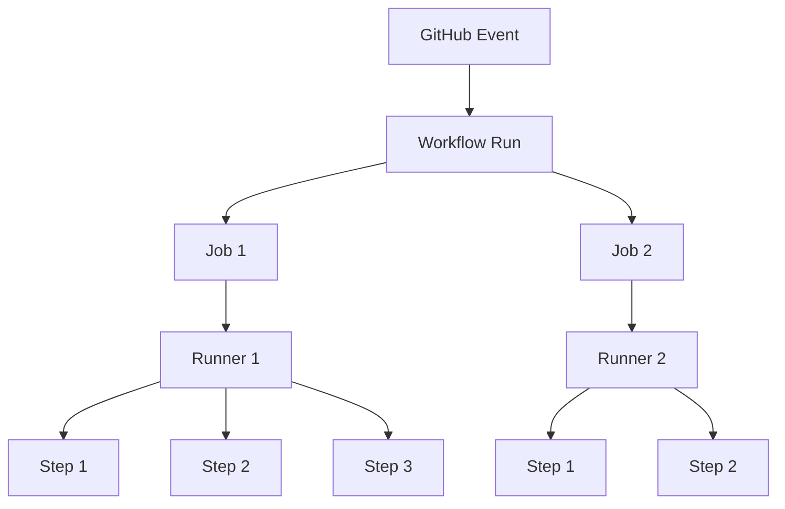
````

### Memorization shortcut

```
Event
  -> Starts a Workflow Run

Workflow
  -> Defines Jobs

Job
  -> Executes on a Runner

Step
  -> Performs an Operation

Action
  -> Provides Reusable Functionality
```

This is the basic execution model of GitHub Actions.

---

# 8. How a Source Change Becomes a CI Workflow Run

Let's trace one change through the CI system.

A developer modifies a Node.js application.

They create a commit:

```
git add .
git commit -m "feat: improve checkout calculation"
git push origin feature/checkout
```

They open a pull request targeting `main`.

What happens next?

## 8.1 Step-by-step execution

### Step 1: GitHub receives an event

A pull request is opened or updated.

GitHub evaluates the repository's workflow trigger configurations.

### Step 2: GitHub identifies matching workflows

For example:

```
on:
  pull_request:
    branches:
      - main
```

If the event satisfies this trigger and the workflow is eligible to run, GitHub creates a workflow run.

### Step 3: The workflow determines which jobs are eligible

Suppose the workflow contains three independent jobs:

```
Type Checking
Unit Tests
Build Verification
```

The orchestration system can schedule these jobs independently.

### Step 4: Runners execute the jobs

Each job executes its configured steps.

### Step 5: GitHub records results

Jobs can succeed, fail, be skipped, or be cancelled.

The workflow's overall result depends on the relevant job outcomes.

### Step 6: Feedback becomes available

The developer can inspect:

- Workflow status.
- Individual job results.
- Failed steps.
- Execution logs.
- Available test reports.

Repository rules can then use required checks to help determine merge eligibility.

## 8.2 Complete event lifecycle

#chatgpt-mermaid-_r_9u8_{font-family:-apple-system-body,ui-sans-serif,-apple-system,system-ui,"Segoe UI","Helvetica","Apple Color Emoji","Arial",sans-serif,"Segoe UI Emoji","Segoe UI Symbol";font-size:16px;fill:rgb(237, 237, 237);}@keyframes edge-animation-frame{from{stroke-dashoffset:0;}}@keyframes dash{to{stroke-dashoffset:0;}}#chatgpt-mermaid-_r_9u8_ .edge-animation-slow{stroke-dasharray:9,5!important;stroke-dashoffset:900;animation:dash 50s linear infinite;stroke-linecap:round;}#chatgpt-mermaid-_r_9u8_ .edge-animation-fast{stroke-dasharray:9,5!important;stroke-dashoffset:900;animation:dash 20s linear infinite;stroke-linecap:round;}#chatgpt-mermaid-_r_9u8_ .error-icon{fill:rgb(48, 48, 48);}#chatgpt-mermaid-_r_9u8_ .error-text{fill:rgb(237, 237, 237);stroke:rgb(237, 237, 237);}#chatgpt-mermaid-_r_9u8_ .edge-thickness-normal{stroke-width:1px;}#chatgpt-mermaid-_r_9u8_ .edge-thickness-thick{stroke-width:3.5px;}#chatgpt-mermaid-_r_9u8_ .edge-pattern-solid{stroke-dasharray:0;}#chatgpt-mermaid-_r_9u8_ .edge-thickness-invisible{stroke-width:0;fill:none;}#chatgpt-mermaid-_r_9u8_ .edge-pattern-dashed{stroke-dasharray:3;}#chatgpt-mermaid-_r_9u8_ .edge-pattern-dotted{stroke-dasharray:2;}#chatgpt-mermaid-_r_9u8_ .marker{fill:rgb(175, 175, 175);stroke:rgb(175, 175, 175);}#chatgpt-mermaid-_r_9u8_ .marker.cross{stroke:rgb(175, 175, 175);}#chatgpt-mermaid-_r_9u8_ svg{font-family:-apple-system-body,ui-sans-serif,-apple-system,system-ui,"Segoe UI","Helvetica","Apple Color Emoji","Arial",sans-serif,"Segoe UI Emoji","Segoe UI Symbol";font-size:16px;}#chatgpt-mermaid-_r_9u8_ p{margin:0;}#chatgpt-mermaid-_r_9u8_ .label{font-family:-apple-system-body,ui-sans-serif,-apple-system,system-ui,"Segoe UI","Helvetica","Apple Color Emoji","Arial",sans-serif,"Segoe UI Emoji","Segoe UI Symbol";color:rgb(237, 237, 237);}#chatgpt-mermaid-_r_9u8_ .cluster-label text{fill:rgb(237, 237, 237);}#chatgpt-mermaid-_r_9u8_ .cluster-label span{color:rgb(237, 237, 237);}#chatgpt-mermaid-_r_9u8_ .cluster-label span p{background-color:transparent;}#chatgpt-mermaid-_r_9u8_ .label text,#chatgpt-mermaid-_r_9u8_ span{fill:rgb(237, 237, 237);color:rgb(237, 237, 237);}#chatgpt-mermaid-_r_9u8_ .node rect,#chatgpt-mermaid-_r_9u8_ .node circle,#chatgpt-mermaid-_r_9u8_ .node ellipse,#chatgpt-mermaid-_r_9u8_ .node polygon,#chatgpt-mermaid-_r_9u8_ .node path{fill:rgb(9, 23, 44);stroke:rgb(31, 78, 148);stroke-width:1px;}#chatgpt-mermaid-_r_9u8_ .rough-node .label text,#chatgpt-mermaid-_r_9u8_ .node .label text,#chatgpt-mermaid-_r_9u8_ .image-shape .label,#chatgpt-mermaid-_r_9u8_ .icon-shape .label{text-anchor:middle;}#chatgpt-mermaid-_r_9u8_ .node .katex path{fill:#000;stroke:#000;stroke-width:1px;}#chatgpt-mermaid-_r_9u8_ .rough-node .label,#chatgpt-mermaid-_r_9u8_ .node .label,#chatgpt-mermaid-_r_9u8_ .image-shape .label,#chatgpt-mermaid-_r_9u8_ .icon-shape .label{text-align:center;}#chatgpt-mermaid-_r_9u8_ .node.clickable{cursor:pointer;}#chatgpt-mermaid-_r_9u8_ .root .anchor path{fill:rgb(175, 175, 175)!important;stroke-width:0;stroke:rgb(175, 175, 175);}#chatgpt-mermaid-_r_9u8_ .arrowheadPath{fill:rgb(175, 175, 175);}#chatgpt-mermaid-_r_9u8_ .edgePath .path{stroke:rgb(175, 175, 175);stroke-width:1px;}#chatgpt-mermaid-_r_9u8_ .flowchart-link{stroke:rgb(175, 175, 175);fill:none;}#chatgpt-mermaid-_r_9u8_ .edgeLabel{background-color:rgb(0, 0, 0);text-align:center;}#chatgpt-mermaid-_r_9u8_ .edgeLabel p{background-color:rgb(0, 0, 0);}#chatgpt-mermaid-_r_9u8_ .edgeLabel rect{opacity:0.5;background-color:rgb(0, 0, 0);fill:rgb(0, 0, 0);}#chatgpt-mermaid-_r_9u8_ .labelBkg{background-color:rgba(0, 0, 0, 0.5);}#chatgpt-mermaid-_r_9u8_ .cluster rect{fill:rgb(48, 48, 48);stroke:rgba(255, 255, 255, 0.15);stroke-width:1px;}#chatgpt-mermaid-_r_9u8_ .cluster text{fill:rgb(237, 237, 237);}#chatgpt-mermaid-_r_9u8_ .cluster span{color:rgb(237, 237, 237);}#chatgpt-mermaid-_r_9u8_ div.mermaidTooltip{position:absolute;text-align:center;max-width:200px;padding:2px;font-family:-apple-system-body,ui-sans-serif,-apple-system,system-ui,"Segoe UI","Helvetica","Apple Color Emoji","Arial",sans-serif,"Segoe UI Emoji","Segoe UI Symbol";font-size:12px;background:rgb(48, 48, 48);border:1px solid rgba(255, 255, 255, 0.15);border-radius:2px;pointer-events:none;z-index:100;}#chatgpt-mermaid-_r_9u8_ .flowchartTitleText{text-anchor:middle;font-size:18px;fill:rgb(237, 237, 237);}#chatgpt-mermaid-_r_9u8_ rect.text{fill:none;stroke-width:0;}#chatgpt-mermaid-_r_9u8_ .icon-shape,#chatgpt-mermaid-_r_9u8_ .image-shape{background-color:rgb(0, 0, 0);text-align:center;}#chatgpt-mermaid-_r_9u8_ .icon-shape p,#chatgpt-mermaid-_r_9u8_ .image-shape p{background-color:rgb(0, 0, 0);padding:2px;}#chatgpt-mermaid-_r_9u8_ .icon-shape .label rect,#chatgpt-mermaid-_r_9u8_ .image-shape .label rect{opacity:0.5;background-color:rgb(0, 0, 0);fill:rgb(0, 0, 0);}#chatgpt-mermaid-_r_9u8_ .label-icon{display:inline-block;height:1em;overflow:visible;vertical-align:-0.125em;}#chatgpt-mermaid-_r_9u8_ .node .label-icon path{fill:currentColor;stroke:revert;stroke-width:revert;}#chatgpt-mermaid-_r_9u8_ .node .neo-node{stroke:rgb(31, 78, 148);}#chatgpt-mermaid-_r_9u8_ [data-look="neo"].node rect,#chatgpt-mermaid-_r_9u8_ [data-look="neo"].cluster rect,#chatgpt-mermaid-_r_9u8_ [data-look="neo"].node polygon{stroke:url(#chatgpt-mermaid-_r_9u8_-gradient);filter:drop-shadow( 1px 2px 2px rgba(185,185,185,1));}#chatgpt-mermaid-_r_9u8_ [data-look="neo"].swimlane.cluster rect{filter:none;}#chatgpt-mermaid-_r_9u8_ [data-look="neo"].node path{stroke:url(#chatgpt-mermaid-_r_9u8_-gradient);stroke-width:1px;}#chatgpt-mermaid-_r_9u8_ [data-look="neo"].node .outer-path{filter:drop-shadow( 1px 2px 2px rgba(185,185,185,1));}#chatgpt-mermaid-_r_9u8_ [data-look="neo"].node .neo-line path{stroke:rgb(31, 78, 148);filter:none;}#chatgpt-mermaid-_r_9u8_ [data-look="neo"].node circle{stroke:url(#chatgpt-mermaid-_r_9u8_-gradient);filter:drop-shadow( 1px 2px 2px rgba(185,185,185,1));}#chatgpt-mermaid-_r_9u8_ [data-look="neo"].node circle .state-start{fill:#000000;}#chatgpt-mermaid-_r_9u8_ [data-look="neo"].icon-shape .icon{fill:url(#chatgpt-mermaid-_r_9u8_-gradient);filter:drop-shadow( 1px 2px 2px rgba(185,185,185,1));}#chatgpt-mermaid-_r_9u8_ [data-look="neo"].icon-shape .icon-neo path{stroke:url(#chatgpt-mermaid-_r_9u8_-gradient);filter:drop-shadow( 1px 2px 2px rgba(185,185,185,1));}#chatgpt-mermaid-_r_9u8_ .node text{font-size:14px;font-weight:600;letter-spacing:normal;fill:rgb(232, 232, 232);}#chatgpt-mermaid-_r_9u8_ .edgeLabels text{font-size:13px;font-weight:600;letter-spacing:-0.08px;fill:rgb(232, 232, 232);}#chatgpt-mermaid-_r_9u8_ .node tspan[font-weight="normal"],#chatgpt-mermaid-_r_9u8_ .edgeLabels tspan[font-weight="normal"]{font-weight:600;}#chatgpt-mermaid-_r_9u8_ .edgeLabel .label rect{opacity:1;rx:13px;ry:13px;fill:rgb(19, 19, 19);stroke:rgb(47, 47, 47);stroke-width:1px;}#chatgpt-mermaid-_r_9u8_ .node rect,#chatgpt-mermaid-_r_9u8_ .node circle,#chatgpt-mermaid-_r_9u8_ .node ellipse,#chatgpt-mermaid-_r_9u8_ .node polygon,#chatgpt-mermaid-_r_9u8_ .node path{fill:rgb(24, 24, 24);stroke:rgba(255, 255, 255, 0.1);stroke-width:1px;}#chatgpt-mermaid-_r_9u8_ .node rect{rx:16px;ry:16px;}#chatgpt-mermaid-_r_9u8_ .node.mermaid-decision .label-container{fill:rgb(19, 19, 19);stroke:rgb(47, 47, 47);stroke-dasharray:2px,2px;}#chatgpt-mermaid-_r_9u8_ .edgePaths .flowchart-link{stroke:rgb(175, 175, 175);stroke-width:1px;stroke-linecap:round;stroke-linejoin:round;}#chatgpt-mermaid-_r_9u8_ .marker{fill:rgb(175, 175, 175);stroke:rgb(175, 175, 175);}#chatgpt-mermaid-_r_9u8_ :root{--mermaid-font-family:-apple-system-body,ui-sans-serif,-apple-system,system-ui,"Segoe UI","Helvetica","Apple Color Emoji","Arial",sans-serif,"Segoe UI Emoji","Segoe UI Symbol";}Developer Pushes ChangeGitHub Repository EventEvaluate Workflow TriggersWorkflow Matches?No Workflow RunCreate Workflow RunEvaluate Job DependenciesSchedule Eligible JobsAllocate RunnersExecute StepsCollect ResultsReport Workflow StatusDeveloper Receives FeedbackNoYes

### Important architectural insight

> A Git event initiates execution, the workflow defines required work, the orchestration system coordinates jobs, and runners perform the actual computation.

This is why a CI platform needs both an orchestration mechanism and execution capacity.

---

# 9. Designing the Validation Workflow

Now we reach a major system-design problem.

Suppose our Node.js application requires:

1. Type checking.
2. Static analysis.
3. Unit testing.
4. Integration testing.
5. Build verification.

How should we organize these tasks?

A beginner might simply put everything into one job.

But is that always the best architecture?

Let's investigate.

## 9.1 Approach A: One job with sequential steps

````
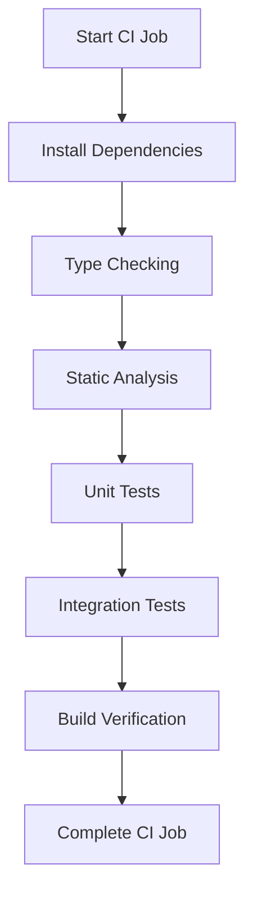
````

All steps run inside one job.

### Advantages

- Simple implementation.
- Minimal orchestration complexity.
- Steps share the same workspace.
- Dependencies can be installed once.
- Debugging execution order is straightforward.

### Disadvantages

- Independent checks execute sequentially.
- Long-running validation can delay feedback.
- A failing step normally prevents subsequent steps from executing.
- One execution environment handles all tasks.
- Different checks cannot independently select runner configurations.

### Is this architecture wrong?

No.

For a small application, one job may be the best design.

We should not introduce multiple jobs unless they provide useful benefits.

---

# 10. Sequential vs Parallel CI Architecture

This is one of the most important optimization decisions.

Imagine these validation tasks:

|Task|Illustrative duration|
|---|---|
|Type checking|2 minutes|
|Static analysis|1 minute|
|Unit tests|3 minutes|
|Build verification|4 minutes|

If every task runs sequentially:

```
Type Checking:     2 minutes
Static Analysis:   1 minute
Unit Tests:        3 minutes
Build:             4 minutes
----------------------------
Total:            10 minutes
```

Now ask:

**Do all these tasks genuinely depend on one another?**

Not necessarily.

Type checking may not require unit tests to complete.

Static analysis may be independent of the build.

Unit tests may depend on compiled output, depending on the project's design.

Therefore, we can consider parallel execution.

## 10.1 Parallel architecture

#chatgpt-mermaid-_r_9un_{font-family:-apple-system-body,ui-sans-serif,-apple-system,system-ui,"Segoe UI","Helvetica","Apple Color Emoji","Arial",sans-serif,"Segoe UI Emoji","Segoe UI Symbol";font-size:16px;fill:rgb(237, 237, 237);}@keyframes edge-animation-frame{from{stroke-dashoffset:0;}}@keyframes dash{to{stroke-dashoffset:0;}}#chatgpt-mermaid-_r_9un_ .edge-animation-slow{stroke-dasharray:9,5!important;stroke-dashoffset:900;animation:dash 50s linear infinite;stroke-linecap:round;}#chatgpt-mermaid-_r_9un_ .edge-animation-fast{stroke-dasharray:9,5!important;stroke-dashoffset:900;animation:dash 20s linear infinite;stroke-linecap:round;}#chatgpt-mermaid-_r_9un_ .error-icon{fill:rgb(48, 48, 48);}#chatgpt-mermaid-_r_9un_ .error-text{fill:rgb(237, 237, 237);stroke:rgb(237, 237, 237);}#chatgpt-mermaid-_r_9un_ .edge-thickness-normal{stroke-width:1px;}#chatgpt-mermaid-_r_9un_ .edge-thickness-thick{stroke-width:3.5px;}#chatgpt-mermaid-_r_9un_ .edge-pattern-solid{stroke-dasharray:0;}#chatgpt-mermaid-_r_9un_ .edge-thickness-invisible{stroke-width:0;fill:none;}#chatgpt-mermaid-_r_9un_ .edge-pattern-dashed{stroke-dasharray:3;}#chatgpt-mermaid-_r_9un_ .edge-pattern-dotted{stroke-dasharray:2;}#chatgpt-mermaid-_r_9un_ .marker{fill:rgb(175, 175, 175);stroke:rgb(175, 175, 175);}#chatgpt-mermaid-_r_9un_ .marker.cross{stroke:rgb(175, 175, 175);}#chatgpt-mermaid-_r_9un_ svg{font-family:-apple-system-body,ui-sans-serif,-apple-system,system-ui,"Segoe UI","Helvetica","Apple Color Emoji","Arial",sans-serif,"Segoe UI Emoji","Segoe UI Symbol";font-size:16px;}#chatgpt-mermaid-_r_9un_ p{margin:0;}#chatgpt-mermaid-_r_9un_ .label{font-family:-apple-system-body,ui-sans-serif,-apple-system,system-ui,"Segoe UI","Helvetica","Apple Color Emoji","Arial",sans-serif,"Segoe UI Emoji","Segoe UI Symbol";color:rgb(237, 237, 237);}#chatgpt-mermaid-_r_9un_ .cluster-label text{fill:rgb(237, 237, 237);}#chatgpt-mermaid-_r_9un_ .cluster-label span{color:rgb(237, 237, 237);}#chatgpt-mermaid-_r_9un_ .cluster-label span p{background-color:transparent;}#chatgpt-mermaid-_r_9un_ .label text,#chatgpt-mermaid-_r_9un_ span{fill:rgb(237, 237, 237);color:rgb(237, 237, 237);}#chatgpt-mermaid-_r_9un_ .node rect,#chatgpt-mermaid-_r_9un_ .node circle,#chatgpt-mermaid-_r_9un_ .node ellipse,#chatgpt-mermaid-_r_9un_ .node polygon,#chatgpt-mermaid-_r_9un_ .node path{fill:rgb(9, 23, 44);stroke:rgb(31, 78, 148);stroke-width:1px;}#chatgpt-mermaid-_r_9un_ .rough-node .label text,#chatgpt-mermaid-_r_9un_ .node .label text,#chatgpt-mermaid-_r_9un_ .image-shape .label,#chatgpt-mermaid-_r_9un_ .icon-shape .label{text-anchor:middle;}#chatgpt-mermaid-_r_9un_ .node .katex path{fill:#000;stroke:#000;stroke-width:1px;}#chatgpt-mermaid-_r_9un_ .rough-node .label,#chatgpt-mermaid-_r_9un_ .node .label,#chatgpt-mermaid-_r_9un_ .image-shape .label,#chatgpt-mermaid-_r_9un_ .icon-shape .label{text-align:center;}#chatgpt-mermaid-_r_9un_ .node.clickable{cursor:pointer;}#chatgpt-mermaid-_r_9un_ .root .anchor path{fill:rgb(175, 175, 175)!important;stroke-width:0;stroke:rgb(175, 175, 175);}#chatgpt-mermaid-_r_9un_ .arrowheadPath{fill:rgb(175, 175, 175);}#chatgpt-mermaid-_r_9un_ .edgePath .path{stroke:rgb(175, 175, 175);stroke-width:1px;}#chatgpt-mermaid-_r_9un_ .flowchart-link{stroke:rgb(175, 175, 175);fill:none;}#chatgpt-mermaid-_r_9un_ .edgeLabel{background-color:rgb(0, 0, 0);text-align:center;}#chatgpt-mermaid-_r_9un_ .edgeLabel p{background-color:rgb(0, 0, 0);}#chatgpt-mermaid-_r_9un_ .edgeLabel rect{opacity:0.5;background-color:rgb(0, 0, 0);fill:rgb(0, 0, 0);}#chatgpt-mermaid-_r_9un_ .labelBkg{background-color:rgba(0, 0, 0, 0.5);}#chatgpt-mermaid-_r_9un_ .cluster rect{fill:rgb(48, 48, 48);stroke:rgba(255, 255, 255, 0.15);stroke-width:1px;}#chatgpt-mermaid-_r_9un_ .cluster text{fill:rgb(237, 237, 237);}#chatgpt-mermaid-_r_9un_ .cluster span{color:rgb(237, 237, 237);}#chatgpt-mermaid-_r_9un_ div.mermaidTooltip{position:absolute;text-align:center;max-width:200px;padding:2px;font-family:-apple-system-body,ui-sans-serif,-apple-system,system-ui,"Segoe UI","Helvetica","Apple Color Emoji","Arial",sans-serif,"Segoe UI Emoji","Segoe UI Symbol";font-size:12px;background:rgb(48, 48, 48);border:1px solid rgba(255, 255, 255, 0.15);border-radius:2px;pointer-events:none;z-index:100;}#chatgpt-mermaid-_r_9un_ .flowchartTitleText{text-anchor:middle;font-size:18px;fill:rgb(237, 237, 237);}#chatgpt-mermaid-_r_9un_ rect.text{fill:none;stroke-width:0;}#chatgpt-mermaid-_r_9un_ .icon-shape,#chatgpt-mermaid-_r_9un_ .image-shape{background-color:rgb(0, 0, 0);text-align:center;}#chatgpt-mermaid-_r_9un_ .icon-shape p,#chatgpt-mermaid-_r_9un_ .image-shape p{background-color:rgb(0, 0, 0);padding:2px;}#chatgpt-mermaid-_r_9un_ .icon-shape .label rect,#chatgpt-mermaid-_r_9un_ .image-shape .label rect{opacity:0.5;background-color:rgb(0, 0, 0);fill:rgb(0, 0, 0);}#chatgpt-mermaid-_r_9un_ .label-icon{display:inline-block;height:1em;overflow:visible;vertical-align:-0.125em;}#chatgpt-mermaid-_r_9un_ .node .label-icon path{fill:currentColor;stroke:revert;stroke-width:revert;}#chatgpt-mermaid-_r_9un_ .node .neo-node{stroke:rgb(31, 78, 148);}#chatgpt-mermaid-_r_9un_ [data-look="neo"].node rect,#chatgpt-mermaid-_r_9un_ [data-look="neo"].cluster rect,#chatgpt-mermaid-_r_9un_ [data-look="neo"].node polygon{stroke:url(#chatgpt-mermaid-_r_9un_-gradient);filter:drop-shadow( 1px 2px 2px rgba(185,185,185,1));}#chatgpt-mermaid-_r_9un_ [data-look="neo"].swimlane.cluster rect{filter:none;}#chatgpt-mermaid-_r_9un_ [data-look="neo"].node path{stroke:url(#chatgpt-mermaid-_r_9un_-gradient);stroke-width:1px;}#chatgpt-mermaid-_r_9un_ [data-look="neo"].node .outer-path{filter:drop-shadow( 1px 2px 2px rgba(185,185,185,1));}#chatgpt-mermaid-_r_9un_ [data-look="neo"].node .neo-line path{stroke:rgb(31, 78, 148);filter:none;}#chatgpt-mermaid-_r_9un_ [data-look="neo"].node circle{stroke:url(#chatgpt-mermaid-_r_9un_-gradient);filter:drop-shadow( 1px 2px 2px rgba(185,185,185,1));}#chatgpt-mermaid-_r_9un_ [data-look="neo"].node circle .state-start{fill:#000000;}#chatgpt-mermaid-_r_9un_ [data-look="neo"].icon-shape .icon{fill:url(#chatgpt-mermaid-_r_9un_-gradient);filter:drop-shadow( 1px 2px 2px rgba(185,185,185,1));}#chatgpt-mermaid-_r_9un_ [data-look="neo"].icon-shape .icon-neo path{stroke:url(#chatgpt-mermaid-_r_9un_-gradient);filter:drop-shadow( 1px 2px 2px rgba(185,185,185,1));}#chatgpt-mermaid-_r_9un_ .node text{font-size:14px;font-weight:600;letter-spacing:normal;fill:rgb(232, 232, 232);}#chatgpt-mermaid-_r_9un_ .edgeLabels text{font-size:13px;font-weight:600;letter-spacing:-0.08px;fill:rgb(232, 232, 232);}#chatgpt-mermaid-_r_9un_ .node tspan[font-weight="normal"],#chatgpt-mermaid-_r_9un_ .edgeLabels tspan[font-weight="normal"]{font-weight:600;}#chatgpt-mermaid-_r_9un_ .edgeLabel .label rect{opacity:1;rx:13px;ry:13px;fill:rgb(19, 19, 19);stroke:rgb(47, 47, 47);stroke-width:1px;}#chatgpt-mermaid-_r_9un_ .node rect,#chatgpt-mermaid-_r_9un_ .node circle,#chatgpt-mermaid-_r_9un_ .node ellipse,#chatgpt-mermaid-_r_9un_ .node polygon,#chatgpt-mermaid-_r_9un_ .node path{fill:rgb(24, 24, 24);stroke:rgba(255, 255, 255, 0.1);stroke-width:1px;}#chatgpt-mermaid-_r_9un_ .node rect{rx:16px;ry:16px;}#chatgpt-mermaid-_r_9un_ .node.mermaid-decision .label-container{fill:rgb(19, 19, 19);stroke:rgb(47, 47, 47);stroke-dasharray:2px,2px;}#chatgpt-mermaid-_r_9un_ .edgePaths .flowchart-link{stroke:rgb(175, 175, 175);stroke-width:1px;stroke-linecap:round;stroke-linejoin:round;}#chatgpt-mermaid-_r_9un_ .marker{fill:rgb(175, 175, 175);stroke:rgb(175, 175, 175);}#chatgpt-mermaid-_r_9un_ :root{--mermaid-font-family:-apple-system-body,ui-sans-serif,-apple-system,system-ui,"Segoe UI","Helvetica","Apple Color Emoji","Arial",sans-serif,"Segoe UI Emoji","Segoe UI Symbol";}Source RevisionType CheckingStatic AnalysisUnit TestsBuild VerificationCollect Validation Results

In this hypothetical design, the four tasks are independent.

If all runners are immediately available and there is no shared setup overhead, the execution time is determined approximately by the longest task.

In this example:

```
Longest task = 4 minutes
```

The theoretical validation stage can complete much sooner than the sequential version.

But real CI systems also have:

- Runner startup time.
- Dependency installation.
- Source checkout.
- Cache restoration.
- Artifact transfers.
- Scheduling delays.
- Shared infrastructure limitations.

Therefore, parallel execution does not automatically guarantee a proportional speedup.

### First-principles insight

> Parallelism reduces elapsed time only when work can genuinely execute independently and sufficient execution capacity is available.

---

# 11. The Dependency Graph: The Heart of Pipeline Architecture

Not every task is independent.

Imagine a TypeScript application with this requirement:

> Unit tests must run against the compiled JavaScript output.

Now unit testing depends on compilation.

The architecture changes.

````
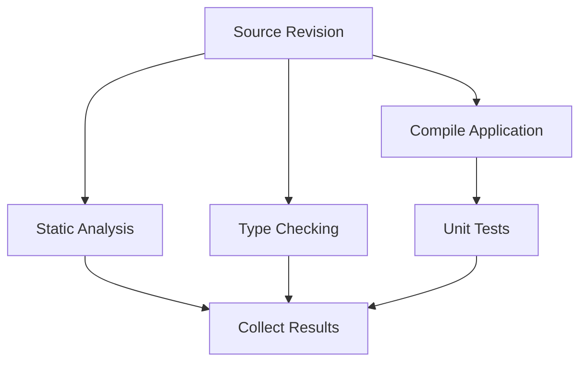
````

Notice the relationship:

```
Compile Application
        |
        v
Unit Tests
```

The unit test job cannot meaningfully execute until its required compiled output is available.

But static analysis may run independently.

This gives us a **directed acyclic graph**, or DAG.

We already encountered DAGs when studying Git history.

Here, they represent task dependencies rather than commit ancestry.

## 11.1 What is a dependency?

A dependency exists when one task requires something another task produces or establishes.

Examples:

```
Unit Tests
    depend on
Compiled Application
```

```
Container Publication
    depends on
Successful Image Build
```

```
Release Promotion
    depends on
Required Validation
```

A dependency should exist for an engineering reason.

Do not make two jobs sequential merely because one appears earlier in the YAML file.

---

## 11.2 How GitHub Actions represents dependencies

GitHub Actions provides the `needs` keyword.

For example:

```
jobs:
  build:
    runs-on: ubuntu-latest

    steps:
      - name: Build
        run: echo "Building application"

  test:
    needs: build
    runs-on: ubuntu-latest

    steps:
      - name: Test
        run: echo "Running tests"
```

This means:

```
Build Job
    |
    v
Test Job
```

The test job normally becomes eligible after the build job succeeds.

If the build job fails or is skipped, dependent jobs are normally skipped unless their conditions explicitly permit execution.

Independent jobs can execute concurrently.

This behavior is part of GitHub Actions workflow dependency handling. [GitHub Docs](https://docs.github.com/en/actions/reference/workflows-and-actions/workflow-syntax?utm_source=chatgpt.com)

### Important distinction

The `needs` keyword establishes **execution dependencies**.

It does not automatically transfer files between jobs.

We will return to this shortly.

---

# 12. Critical Path: Why Some Optimizations Matter More Than Others

Suppose our pipeline is:

#chatgpt-mermaid-_r_9vj_{font-family:-apple-system-body,ui-sans-serif,-apple-system,system-ui,"Segoe UI","Helvetica","Apple Color Emoji","Arial",sans-serif,"Segoe UI Emoji","Segoe UI Symbol";font-size:16px;fill:rgb(237, 237, 237);}@keyframes edge-animation-frame{from{stroke-dashoffset:0;}}@keyframes dash{to{stroke-dashoffset:0;}}#chatgpt-mermaid-_r_9vj_ .edge-animation-slow{stroke-dasharray:9,5!important;stroke-dashoffset:900;animation:dash 50s linear infinite;stroke-linecap:round;}#chatgpt-mermaid-_r_9vj_ .edge-animation-fast{stroke-dasharray:9,5!important;stroke-dashoffset:900;animation:dash 20s linear infinite;stroke-linecap:round;}#chatgpt-mermaid-_r_9vj_ .error-icon{fill:rgb(48, 48, 48);}#chatgpt-mermaid-_r_9vj_ .error-text{fill:rgb(237, 237, 237);stroke:rgb(237, 237, 237);}#chatgpt-mermaid-_r_9vj_ .edge-thickness-normal{stroke-width:1px;}#chatgpt-mermaid-_r_9vj_ .edge-thickness-thick{stroke-width:3.5px;}#chatgpt-mermaid-_r_9vj_ .edge-pattern-solid{stroke-dasharray:0;}#chatgpt-mermaid-_r_9vj_ .edge-thickness-invisible{stroke-width:0;fill:none;}#chatgpt-mermaid-_r_9vj_ .edge-pattern-dashed{stroke-dasharray:3;}#chatgpt-mermaid-_r_9vj_ .edge-pattern-dotted{stroke-dasharray:2;}#chatgpt-mermaid-_r_9vj_ .marker{fill:rgb(175, 175, 175);stroke:rgb(175, 175, 175);}#chatgpt-mermaid-_r_9vj_ .marker.cross{stroke:rgb(175, 175, 175);}#chatgpt-mermaid-_r_9vj_ svg{font-family:-apple-system-body,ui-sans-serif,-apple-system,system-ui,"Segoe UI","Helvetica","Apple Color Emoji","Arial",sans-serif,"Segoe UI Emoji","Segoe UI Symbol";font-size:16px;}#chatgpt-mermaid-_r_9vj_ p{margin:0;}#chatgpt-mermaid-_r_9vj_ .label{font-family:-apple-system-body,ui-sans-serif,-apple-system,system-ui,"Segoe UI","Helvetica","Apple Color Emoji","Arial",sans-serif,"Segoe UI Emoji","Segoe UI Symbol";color:rgb(237, 237, 237);}#chatgpt-mermaid-_r_9vj_ .cluster-label text{fill:rgb(237, 237, 237);}#chatgpt-mermaid-_r_9vj_ .cluster-label span{color:rgb(237, 237, 237);}#chatgpt-mermaid-_r_9vj_ .cluster-label span p{background-color:transparent;}#chatgpt-mermaid-_r_9vj_ .label text,#chatgpt-mermaid-_r_9vj_ span{fill:rgb(237, 237, 237);color:rgb(237, 237, 237);}#chatgpt-mermaid-_r_9vj_ .node rect,#chatgpt-mermaid-_r_9vj_ .node circle,#chatgpt-mermaid-_r_9vj_ .node ellipse,#chatgpt-mermaid-_r_9vj_ .node polygon,#chatgpt-mermaid-_r_9vj_ .node path{fill:rgb(9, 23, 44);stroke:rgb(31, 78, 148);stroke-width:1px;}#chatgpt-mermaid-_r_9vj_ .rough-node .label text,#chatgpt-mermaid-_r_9vj_ .node .label text,#chatgpt-mermaid-_r_9vj_ .image-shape .label,#chatgpt-mermaid-_r_9vj_ .icon-shape .label{text-anchor:middle;}#chatgpt-mermaid-_r_9vj_ .node .katex path{fill:#000;stroke:#000;stroke-width:1px;}#chatgpt-mermaid-_r_9vj_ .rough-node .label,#chatgpt-mermaid-_r_9vj_ .node .label,#chatgpt-mermaid-_r_9vj_ .image-shape .label,#chatgpt-mermaid-_r_9vj_ .icon-shape .label{text-align:center;}#chatgpt-mermaid-_r_9vj_ .node.clickable{cursor:pointer;}#chatgpt-mermaid-_r_9vj_ .root .anchor path{fill:rgb(175, 175, 175)!important;stroke-width:0;stroke:rgb(175, 175, 175);}#chatgpt-mermaid-_r_9vj_ .arrowheadPath{fill:rgb(175, 175, 175);}#chatgpt-mermaid-_r_9vj_ .edgePath .path{stroke:rgb(175, 175, 175);stroke-width:1px;}#chatgpt-mermaid-_r_9vj_ .flowchart-link{stroke:rgb(175, 175, 175);fill:none;}#chatgpt-mermaid-_r_9vj_ .edgeLabel{background-color:rgb(0, 0, 0);text-align:center;}#chatgpt-mermaid-_r_9vj_ .edgeLabel p{background-color:rgb(0, 0, 0);}#chatgpt-mermaid-_r_9vj_ .edgeLabel rect{opacity:0.5;background-color:rgb(0, 0, 0);fill:rgb(0, 0, 0);}#chatgpt-mermaid-_r_9vj_ .labelBkg{background-color:rgba(0, 0, 0, 0.5);}#chatgpt-mermaid-_r_9vj_ .cluster rect{fill:rgb(48, 48, 48);stroke:rgba(255, 255, 255, 0.15);stroke-width:1px;}#chatgpt-mermaid-_r_9vj_ .cluster text{fill:rgb(237, 237, 237);}#chatgpt-mermaid-_r_9vj_ .cluster span{color:rgb(237, 237, 237);}#chatgpt-mermaid-_r_9vj_ div.mermaidTooltip{position:absolute;text-align:center;max-width:200px;padding:2px;font-family:-apple-system-body,ui-sans-serif,-apple-system,system-ui,"Segoe UI","Helvetica","Apple Color Emoji","Arial",sans-serif,"Segoe UI Emoji","Segoe UI Symbol";font-size:12px;background:rgb(48, 48, 48);border:1px solid rgba(255, 255, 255, 0.15);border-radius:2px;pointer-events:none;z-index:100;}#chatgpt-mermaid-_r_9vj_ .flowchartTitleText{text-anchor:middle;font-size:18px;fill:rgb(237, 237, 237);}#chatgpt-mermaid-_r_9vj_ rect.text{fill:none;stroke-width:0;}#chatgpt-mermaid-_r_9vj_ .icon-shape,#chatgpt-mermaid-_r_9vj_ .image-shape{background-color:rgb(0, 0, 0);text-align:center;}#chatgpt-mermaid-_r_9vj_ .icon-shape p,#chatgpt-mermaid-_r_9vj_ .image-shape p{background-color:rgb(0, 0, 0);padding:2px;}#chatgpt-mermaid-_r_9vj_ .icon-shape .label rect,#chatgpt-mermaid-_r_9vj_ .image-shape .label rect{opacity:0.5;background-color:rgb(0, 0, 0);fill:rgb(0, 0, 0);}#chatgpt-mermaid-_r_9vj_ .label-icon{display:inline-block;height:1em;overflow:visible;vertical-align:-0.125em;}#chatgpt-mermaid-_r_9vj_ .node .label-icon path{fill:currentColor;stroke:revert;stroke-width:revert;}#chatgpt-mermaid-_r_9vj_ .node .neo-node{stroke:rgb(31, 78, 148);}#chatgpt-mermaid-_r_9vj_ [data-look="neo"].node rect,#chatgpt-mermaid-_r_9vj_ [data-look="neo"].cluster rect,#chatgpt-mermaid-_r_9vj_ [data-look="neo"].node polygon{stroke:url(#chatgpt-mermaid-_r_9vj_-gradient);filter:drop-shadow( 1px 2px 2px rgba(185,185,185,1));}#chatgpt-mermaid-_r_9vj_ [data-look="neo"].swimlane.cluster rect{filter:none;}#chatgpt-mermaid-_r_9vj_ [data-look="neo"].node path{stroke:url(#chatgpt-mermaid-_r_9vj_-gradient);stroke-width:1px;}#chatgpt-mermaid-_r_9vj_ [data-look="neo"].node .outer-path{filter:drop-shadow( 1px 2px 2px rgba(185,185,185,1));}#chatgpt-mermaid-_r_9vj_ [data-look="neo"].node .neo-line path{stroke:rgb(31, 78, 148);filter:none;}#chatgpt-mermaid-_r_9vj_ [data-look="neo"].node circle{stroke:url(#chatgpt-mermaid-_r_9vj_-gradient);filter:drop-shadow( 1px 2px 2px rgba(185,185,185,1));}#chatgpt-mermaid-_r_9vj_ [data-look="neo"].node circle .state-start{fill:#000000;}#chatgpt-mermaid-_r_9vj_ [data-look="neo"].icon-shape .icon{fill:url(#chatgpt-mermaid-_r_9vj_-gradient);filter:drop-shadow( 1px 2px 2px rgba(185,185,185,1));}#chatgpt-mermaid-_r_9vj_ [data-look="neo"].icon-shape .icon-neo path{stroke:url(#chatgpt-mermaid-_r_9vj_-gradient);filter:drop-shadow( 1px 2px 2px rgba(185,185,185,1));}#chatgpt-mermaid-_r_9vj_ .node text{font-size:14px;font-weight:600;letter-spacing:normal;fill:rgb(232, 232, 232);}#chatgpt-mermaid-_r_9vj_ .edgeLabels text{font-size:13px;font-weight:600;letter-spacing:-0.08px;fill:rgb(232, 232, 232);}#chatgpt-mermaid-_r_9vj_ .node tspan[font-weight="normal"],#chatgpt-mermaid-_r_9vj_ .edgeLabels tspan[font-weight="normal"]{font-weight:600;}#chatgpt-mermaid-_r_9vj_ .edgeLabel .label rect{opacity:1;rx:13px;ry:13px;fill:rgb(19, 19, 19);stroke:rgb(47, 47, 47);stroke-width:1px;}#chatgpt-mermaid-_r_9vj_ .node rect,#chatgpt-mermaid-_r_9vj_ .node circle,#chatgpt-mermaid-_r_9vj_ .node ellipse,#chatgpt-mermaid-_r_9vj_ .node polygon,#chatgpt-mermaid-_r_9vj_ .node path{fill:rgb(24, 24, 24);stroke:rgba(255, 255, 255, 0.1);stroke-width:1px;}#chatgpt-mermaid-_r_9vj_ .node rect{rx:16px;ry:16px;}#chatgpt-mermaid-_r_9vj_ .node.mermaid-decision .label-container{fill:rgb(19, 19, 19);stroke:rgb(47, 47, 47);stroke-dasharray:2px,2px;}#chatgpt-mermaid-_r_9vj_ .edgePaths .flowchart-link{stroke:rgb(175, 175, 175);stroke-width:1px;stroke-linecap:round;stroke-linejoin:round;}#chatgpt-mermaid-_r_9vj_ .marker{fill:rgb(175, 175, 175);stroke:rgb(175, 175, 175);}#chatgpt-mermaid-_r_9vj_ :root{--mermaid-font-family:-apple-system-body,ui-sans-serif,-apple-system,system-ui,"Segoe UI","Helvetica","Apple Color Emoji","Arial",sans-serif,"Segoe UI Emoji","Segoe UI Symbol";}StartStatic Checks: 3 minBuild: 4 minUnit Tests: 2 minCI Completion

There are two paths.

### Path 1

```
Static Checks
    =
3 minutes
```

### Path 2

```
Build + Unit Tests
    =
4 + 2
    =
6 minutes
```

The longest dependency path takes six minutes.

That is the **critical path**.

In an idealized model with adequate parallel capacity, the pipeline cannot complete in less than the critical path duration.

### What happens if we optimize static checks?

Suppose static checks improve from three minutes to one minute.

The critical path is still:

```
Build -> Unit Tests
```

And it still takes six minutes.

The overall elapsed time may remain almost unchanged.

### What happens if we optimize the build?

Suppose build time drops from four minutes to two minutes.

Now:

```
Build + Unit Tests = 4 minutes
```

The total pipeline duration may improve.

### Engineering lesson

> Optimize the dependency path that limits completion time, not merely the job that looks slowest in isolation.

This is useful when designing large CI systems.

A pipeline containing twenty jobs may have a small number of dependency paths responsible for most of its completion time.

---

# 13. Why Parallelism Has a Cost

Suppose your CI pipeline has ten independent jobs.

You decide to run all ten simultaneously.

That may reduce the elapsed time.

But each job may require:

- A separate runner.
- Repository checkout.
- Runtime initialization.
- Dependency installation.
- Network access.
- CPU and memory.
- Artifact transfer.

Parallelism can increase simultaneous compute demand.

Depending on billing and runner type, it may also affect cost.

## 13.1 Two different optimization objectives

### Optimize developer feedback time

Question:

**How quickly can developers learn whether their change is acceptable?**

### Optimize execution resource consumption

Question:

**How much total compute and infrastructure capacity does validation consume?**

These are not the same objective.

A highly parallel pipeline may finish sooner while consuming more resources concurrently.

A single-job pipeline may use fewer runner startups but take longer to provide results.

### Example trade-off

|Design|Feedback latency|Runner parallelism|Complexity|
|---|---|---|---|
|One sequential job|Potentially higher|Low|Low|
|Several independent jobs|Potentially lower|Higher|Moderate|
|Large matrix pipeline|Depends on scheduling|Potentially high|Higher|
|Optimized dependency DAG|Targets critical path|Controlled|Moderate|

The correct design depends on requirements.

For a small personal application, minimizing complexity may matter most.

For a busy engineering organization, reducing feedback latency may justify more parallel execution.

---

# 14. Runner Architecture: Where Does CI Actually Execute?

Let's return to runners.

A CI workflow is configuration.

The runner performs the actual work.

For example:

```
jobs:
  build:
    runs-on: ubuntu-latest
```

This requests a compatible execution environment.

But where does that environment come from?

GitHub Actions supports multiple runner models, including GitHub-hosted and self-hosted runners. [GitHub Docs](https://docs.github.com/en/actions/concepts/runners?utm_source=chatgpt.com)

---

## 14.1 GitHub-hosted runners

GitHub provides and manages the runner environment.

Conceptually:

````
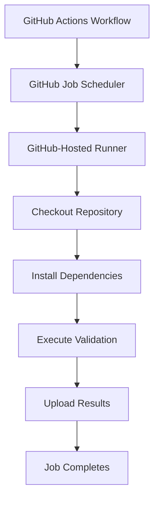
````

For standard GitHub-hosted jobs, a fresh runner environment is provided for each job.

The environment is not intended to retain arbitrary filesystem changes for a future job.

### Advantages

- Minimal infrastructure management.
- Convenient access to predefined environments.
- Fresh execution environments.
- Straightforward setup.
- Useful for ordinary application CI.

### Trade-offs

- Available resources are determined by runner options and plan.
- Runner startup and environment setup introduce overhead.
- Network access to private infrastructure may require additional configuration.
- Execution cost and limits depend on repository and account arrangements.

### When would you choose this?

For our Node.js learning project, GitHub-hosted runners are a reasonable default.

We do not need to maintain a dedicated CI server just to compile and test a small application.

---

## 14.2 Self-hosted runners

A self-hosted runner executes jobs on infrastructure you manage.

For example:

```
Your VM
Your Kubernetes Cluster
Your Internal Build Server
```

A simplified architecture:

````
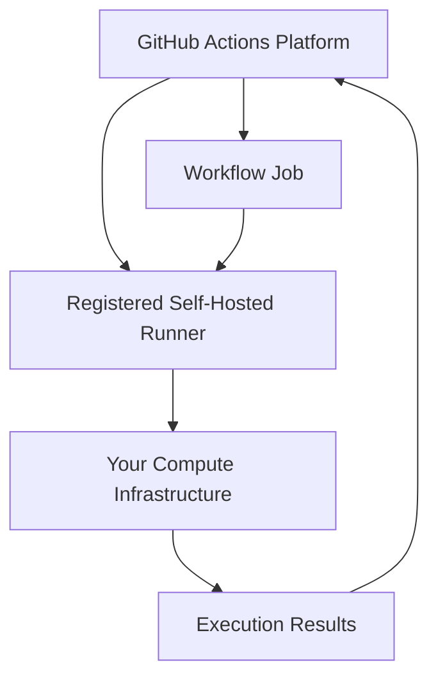
````

### Why might a team use self-hosted runners?

Possible requirements include:

- Special hardware.
- Large build workloads.
- Custom execution environments.
- Access to private internal systems.
- Dedicated compute capacity.
- Greater control over runner configuration.

### What new responsibilities appear?

You now need to consider:

- Operating system patching.
- Runner updates.
- Capacity management.
- Network security.
- Credential exposure.
- Disk cleanup.
- Job isolation.
- Recovery when runners become unavailable.

This is an important trade-off.

**You gain infrastructure control, but you also inherit infrastructure operational responsibilities.**

---

# 15. Ephemeral vs Persistent Runner Environments

Now let's explore an architectural property that is particularly important for CI reliability and security.

## 15.1 Persistent runner

A persistent runner is reused across multiple jobs or workflow runs.

Conceptually:

```
Job A
  |
  v
Same Runner
  |
  v
Job B
  |
  v
Same Runner
```

If the runner is not correctly isolated or cleaned, previous jobs may leave behind:

- Temporary files.
- Build outputs.
- Modified tooling.
- Sensitive data.
- Cached credentials.
- Background processes.

This can affect later execution.

### Example

Job A modifies a local tool configuration.

Job B executes afterward.

Its behavior may depend on the modified configuration.

Now Job B's result depends on something outside its intended inputs.

That weakens reproducibility.

---

## 15.2 Ephemeral runner

An ephemeral runner is intended to execute a limited workload and then be discarded.

Conceptually:

````
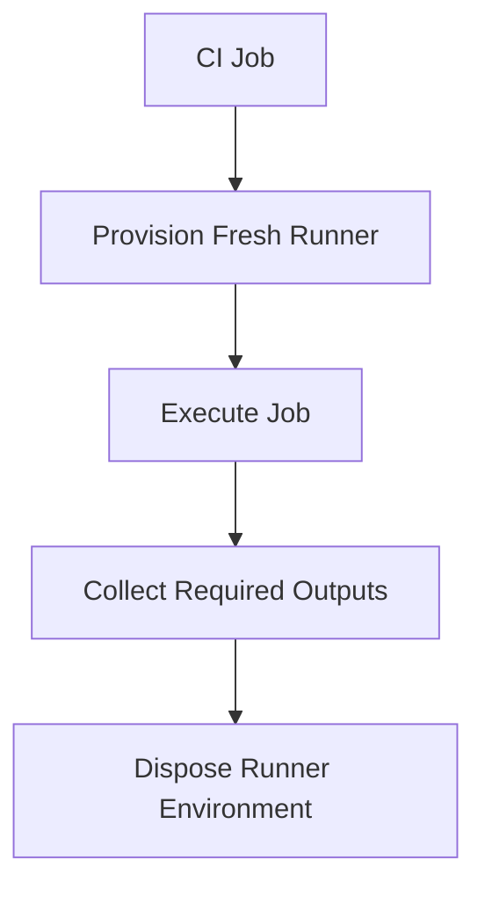
````

### Benefits

- Better isolation between executions.
- Reduced persistence of accidental state.
- More predictable initial conditions.
- Easier cleanup.
- Potentially reduced cross-job contamination risk.

However, ephemeral execution alone does not guarantee security.

The job can still be compromised during execution.

External credentials, caches, artifacts, and network permissions still require appropriate controls.

### Our architectural choice

For normal pull-request validation:

**Prefer isolated execution environments with limited permissions.**

For our learning project:

**Use GitHub-hosted runners.**

We do not need self-hosted runners at this stage.

---

# 16. Job Isolation and the Filesystem Problem

Let's investigate a common GitHub Actions mistake.

Imagine this workflow:

```
jobs:
  build:
    runs-on: ubuntu-latest

    steps:
      - name: Create build output
        run: |
          mkdir -p dist
          echo "compiled application" > dist/app.js

  test:
    needs: build
    runs-on: ubuntu-latest

    steps:
      - name: Read build output
        run: cat dist/app.js
```

Will the second job find the file?

**Not on a fresh GitHub-hosted runner.**

Why?

Because the jobs execute in different runner environments.

The `needs` dependency guarantees ordering under normal successful execution.

It does not automatically copy the first job's filesystem to the second job.

## 16.1 Visualize the problem

#chatgpt-mermaid-_r_a12_{font-family:-apple-system-body,ui-sans-serif,-apple-system,system-ui,"Segoe UI","Helvetica","Apple Color Emoji","Arial",sans-serif,"Segoe UI Emoji","Segoe UI Symbol";font-size:16px;fill:rgb(237, 237, 237);}@keyframes edge-animation-frame{from{stroke-dashoffset:0;}}@keyframes dash{to{stroke-dashoffset:0;}}#chatgpt-mermaid-_r_a12_ .edge-animation-slow{stroke-dasharray:9,5!important;stroke-dashoffset:900;animation:dash 50s linear infinite;stroke-linecap:round;}#chatgpt-mermaid-_r_a12_ .edge-animation-fast{stroke-dasharray:9,5!important;stroke-dashoffset:900;animation:dash 20s linear infinite;stroke-linecap:round;}#chatgpt-mermaid-_r_a12_ .error-icon{fill:rgb(48, 48, 48);}#chatgpt-mermaid-_r_a12_ .error-text{fill:rgb(237, 237, 237);stroke:rgb(237, 237, 237);}#chatgpt-mermaid-_r_a12_ .edge-thickness-normal{stroke-width:1px;}#chatgpt-mermaid-_r_a12_ .edge-thickness-thick{stroke-width:3.5px;}#chatgpt-mermaid-_r_a12_ .edge-pattern-solid{stroke-dasharray:0;}#chatgpt-mermaid-_r_a12_ .edge-thickness-invisible{stroke-width:0;fill:none;}#chatgpt-mermaid-_r_a12_ .edge-pattern-dashed{stroke-dasharray:3;}#chatgpt-mermaid-_r_a12_ .edge-pattern-dotted{stroke-dasharray:2;}#chatgpt-mermaid-_r_a12_ .marker{fill:rgb(175, 175, 175);stroke:rgb(175, 175, 175);}#chatgpt-mermaid-_r_a12_ .marker.cross{stroke:rgb(175, 175, 175);}#chatgpt-mermaid-_r_a12_ svg{font-family:-apple-system-body,ui-sans-serif,-apple-system,system-ui,"Segoe UI","Helvetica","Apple Color Emoji","Arial",sans-serif,"Segoe UI Emoji","Segoe UI Symbol";font-size:16px;}#chatgpt-mermaid-_r_a12_ p{margin:0;}#chatgpt-mermaid-_r_a12_ .label{font-family:-apple-system-body,ui-sans-serif,-apple-system,system-ui,"Segoe UI","Helvetica","Apple Color Emoji","Arial",sans-serif,"Segoe UI Emoji","Segoe UI Symbol";color:rgb(237, 237, 237);}#chatgpt-mermaid-_r_a12_ .cluster-label text{fill:rgb(237, 237, 237);}#chatgpt-mermaid-_r_a12_ .cluster-label span{color:rgb(237, 237, 237);}#chatgpt-mermaid-_r_a12_ .cluster-label span p{background-color:transparent;}#chatgpt-mermaid-_r_a12_ .label text,#chatgpt-mermaid-_r_a12_ span{fill:rgb(237, 237, 237);color:rgb(237, 237, 237);}#chatgpt-mermaid-_r_a12_ .node rect,#chatgpt-mermaid-_r_a12_ .node circle,#chatgpt-mermaid-_r_a12_ .node ellipse,#chatgpt-mermaid-_r_a12_ .node polygon,#chatgpt-mermaid-_r_a12_ .node path{fill:rgb(9, 23, 44);stroke:rgb(31, 78, 148);stroke-width:1px;}#chatgpt-mermaid-_r_a12_ .rough-node .label text,#chatgpt-mermaid-_r_a12_ .node .label text,#chatgpt-mermaid-_r_a12_ .image-shape .label,#chatgpt-mermaid-_r_a12_ .icon-shape .label{text-anchor:middle;}#chatgpt-mermaid-_r_a12_ .node .katex path{fill:#000;stroke:#000;stroke-width:1px;}#chatgpt-mermaid-_r_a12_ .rough-node .label,#chatgpt-mermaid-_r_a12_ .node .label,#chatgpt-mermaid-_r_a12_ .image-shape .label,#chatgpt-mermaid-_r_a12_ .icon-shape .label{text-align:center;}#chatgpt-mermaid-_r_a12_ .node.clickable{cursor:pointer;}#chatgpt-mermaid-_r_a12_ .root .anchor path{fill:rgb(175, 175, 175)!important;stroke-width:0;stroke:rgb(175, 175, 175);}#chatgpt-mermaid-_r_a12_ .arrowheadPath{fill:rgb(175, 175, 175);}#chatgpt-mermaid-_r_a12_ .edgePath .path{stroke:rgb(175, 175, 175);stroke-width:1px;}#chatgpt-mermaid-_r_a12_ .flowchart-link{stroke:rgb(175, 175, 175);fill:none;}#chatgpt-mermaid-_r_a12_ .edgeLabel{background-color:rgb(0, 0, 0);text-align:center;}#chatgpt-mermaid-_r_a12_ .edgeLabel p{background-color:rgb(0, 0, 0);}#chatgpt-mermaid-_r_a12_ .edgeLabel rect{opacity:0.5;background-color:rgb(0, 0, 0);fill:rgb(0, 0, 0);}#chatgpt-mermaid-_r_a12_ .labelBkg{background-color:rgba(0, 0, 0, 0.5);}#chatgpt-mermaid-_r_a12_ .cluster rect{fill:rgb(48, 48, 48);stroke:rgba(255, 255, 255, 0.15);stroke-width:1px;}#chatgpt-mermaid-_r_a12_ .cluster text{fill:rgb(237, 237, 237);}#chatgpt-mermaid-_r_a12_ .cluster span{color:rgb(237, 237, 237);}#chatgpt-mermaid-_r_a12_ div.mermaidTooltip{position:absolute;text-align:center;max-width:200px;padding:2px;font-family:-apple-system-body,ui-sans-serif,-apple-system,system-ui,"Segoe UI","Helvetica","Apple Color Emoji","Arial",sans-serif,"Segoe UI Emoji","Segoe UI Symbol";font-size:12px;background:rgb(48, 48, 48);border:1px solid rgba(255, 255, 255, 0.15);border-radius:2px;pointer-events:none;z-index:100;}#chatgpt-mermaid-_r_a12_ .flowchartTitleText{text-anchor:middle;font-size:18px;fill:rgb(237, 237, 237);}#chatgpt-mermaid-_r_a12_ rect.text{fill:none;stroke-width:0;}#chatgpt-mermaid-_r_a12_ .icon-shape,#chatgpt-mermaid-_r_a12_ .image-shape{background-color:rgb(0, 0, 0);text-align:center;}#chatgpt-mermaid-_r_a12_ .icon-shape p,#chatgpt-mermaid-_r_a12_ .image-shape p{background-color:rgb(0, 0, 0);padding:2px;}#chatgpt-mermaid-_r_a12_ .icon-shape .label rect,#chatgpt-mermaid-_r_a12_ .image-shape .label rect{opacity:0.5;background-color:rgb(0, 0, 0);fill:rgb(0, 0, 0);}#chatgpt-mermaid-_r_a12_ .label-icon{display:inline-block;height:1em;overflow:visible;vertical-align:-0.125em;}#chatgpt-mermaid-_r_a12_ .node .label-icon path{fill:currentColor;stroke:revert;stroke-width:revert;}#chatgpt-mermaid-_r_a12_ .node .neo-node{stroke:rgb(31, 78, 148);}#chatgpt-mermaid-_r_a12_ [data-look="neo"].node rect,#chatgpt-mermaid-_r_a12_ [data-look="neo"].cluster rect,#chatgpt-mermaid-_r_a12_ [data-look="neo"].node polygon{stroke:url(#chatgpt-mermaid-_r_a12_-gradient);filter:drop-shadow( 1px 2px 2px rgba(185,185,185,1));}#chatgpt-mermaid-_r_a12_ [data-look="neo"].swimlane.cluster rect{filter:none;}#chatgpt-mermaid-_r_a12_ [data-look="neo"].node path{stroke:url(#chatgpt-mermaid-_r_a12_-gradient);stroke-width:1px;}#chatgpt-mermaid-_r_a12_ [data-look="neo"].node .outer-path{filter:drop-shadow( 1px 2px 2px rgba(185,185,185,1));}#chatgpt-mermaid-_r_a12_ [data-look="neo"].node .neo-line path{stroke:rgb(31, 78, 148);filter:none;}#chatgpt-mermaid-_r_a12_ [data-look="neo"].node circle{stroke:url(#chatgpt-mermaid-_r_a12_-gradient);filter:drop-shadow( 1px 2px 2px rgba(185,185,185,1));}#chatgpt-mermaid-_r_a12_ [data-look="neo"].node circle .state-start{fill:#000000;}#chatgpt-mermaid-_r_a12_ [data-look="neo"].icon-shape .icon{fill:url(#chatgpt-mermaid-_r_a12_-gradient);filter:drop-shadow( 1px 2px 2px rgba(185,185,185,1));}#chatgpt-mermaid-_r_a12_ [data-look="neo"].icon-shape .icon-neo path{stroke:url(#chatgpt-mermaid-_r_a12_-gradient);filter:drop-shadow( 1px 2px 2px rgba(185,185,185,1));}#chatgpt-mermaid-_r_a12_ .node text{font-size:14px;font-weight:600;letter-spacing:normal;fill:rgb(232, 232, 232);}#chatgpt-mermaid-_r_a12_ .edgeLabels text{font-size:13px;font-weight:600;letter-spacing:-0.08px;fill:rgb(232, 232, 232);}#chatgpt-mermaid-_r_a12_ .node tspan[font-weight="normal"],#chatgpt-mermaid-_r_a12_ .edgeLabels tspan[font-weight="normal"]{font-weight:600;}#chatgpt-mermaid-_r_a12_ .edgeLabel .label rect{opacity:1;rx:13px;ry:13px;fill:rgb(19, 19, 19);stroke:rgb(47, 47, 47);stroke-width:1px;}#chatgpt-mermaid-_r_a12_ .node rect,#chatgpt-mermaid-_r_a12_ .node circle,#chatgpt-mermaid-_r_a12_ .node ellipse,#chatgpt-mermaid-_r_a12_ .node polygon,#chatgpt-mermaid-_r_a12_ .node path{fill:rgb(24, 24, 24);stroke:rgba(255, 255, 255, 0.1);stroke-width:1px;}#chatgpt-mermaid-_r_a12_ .node rect{rx:16px;ry:16px;}#chatgpt-mermaid-_r_a12_ .node.mermaid-decision .label-container{fill:rgb(19, 19, 19);stroke:rgb(47, 47, 47);stroke-dasharray:2px,2px;}#chatgpt-mermaid-_r_a12_ .edgePaths .flowchart-link{stroke:rgb(175, 175, 175);stroke-width:1px;stroke-linecap:round;stroke-linejoin:round;}#chatgpt-mermaid-_r_a12_ .marker{fill:rgb(175, 175, 175);stroke:rgb(175, 175, 175);}#chatgpt-mermaid-_r_a12_ :root{--mermaid-font-family:-apple-system-body,ui-sans-serif,-apple-system,system-ui,"Segoe UI","Helvetica","Apple Color Emoji","Arial",sans-serif,"Segoe UI Emoji","Segoe UI Symbol";}Build JobRunner Adist/app.js CreatedTest JobRunner Bdist/app.js Missing

The file exists in Runner A's workspace.

Runner B does not automatically inherit that workspace.

### What do we need?

A mechanism to transfer the required output.

This leads us to workflow artifacts.

---

# 17. Artifacts: Moving Outputs Across Jobs

Suppose the build job produces:

```
dist/
├── app.js
├── services/
└── controllers/
```

The test job needs the compiled files.

We can upload the output as an artifact.

## 17.1 Artifact architecture

````
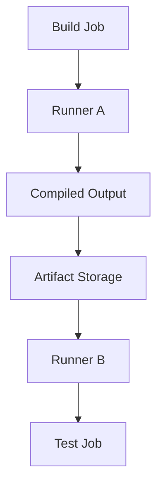
````

The build job uploads selected files.

The downstream job downloads them into its own workspace.

GitHub Actions provides upload and download artifact actions for this purpose. [GitHub Docs](https://docs.github.com/en/actions/concepts/workflows-and-actions/workflow-artifacts?apiVersion=2022-11-28&utm_source=chatgpt.com)

---

## 17.2 Example: Upload an artifact

```
- name: Upload compiled output
  uses: actions/upload-artifact@v4
  with:
    name: compiled-app
    path: dist/
    if-no-files-found: error
```

This stores the selected `dist/` files as a workflow artifact.

### Why use `if-no-files-found: error`?

Because a build that unexpectedly produces no compiled output should not silently proceed as though the required artifact exists.

This is a small example of turning an assumption into an explicit validation rule.

---

## 17.3 Example: Download an artifact

```
- name: Download compiled output
  uses: actions/download-artifact@v4
  with:
    name: compiled-app
    path: dist/
```

Now the downstream job can access the downloaded files.

### Architectural principle

> When separate jobs depend on generated files, the pipeline must explicitly define how those files are transferred.

This is a contract between jobs.

A dependency edge alone is not a file-transfer mechanism.

---

# 18. Cache vs Artifact: Two Different Responsibilities

This is one of the most important concepts to understand before optimizing CI.

Many beginners treat caching and artifacts as interchangeable.

They are not.

## 18.1 What is a cache?

A cache stores reusable data to reduce repeated work.

For example:

```
npm Downloaded Package Cache
```

Suppose dependencies take time to download.

If the necessary package data is available in a compatible cache, a later job may avoid downloading everything again.

### Cache objective

**Improve execution efficiency.**

---

## 18.2 What is an artifact?

An artifact preserves output from a workflow job.

Examples:

```
Compiled application
Test report
Coverage report
Build log
Packaged binary
```

### Artifact objective

**Preserve or transfer the output of execution.**

---

## 18.3 Comparison

|Property|Cache|Artifact|
|---|---|---|
|Main purpose|Reuse intermediate data|Preserve execution output|
|Typical example|npm download cache|Compiled application|
|Shared across workflow runs|Depending on cache rules|Typically tied to a specific run|
|Required for correctness|Should not be|May be required downstream|
|What if unavailable?|Recreate or redownload|Dependent job may be unable to proceed|
|Security consideration|Cache poisoning and data exposure|Untrusted artifact content and access control|
|Identity role|Performance optimization|Explicit output of an execution|

GitHub's documentation explicitly distinguishes dependency caching from workflow artifacts and advises that jobs remain capable of recreating cached data when a cache is unavailable. [GitHub Docs](https://docs.github.com/en/actions/concepts/workflows-and-actions/dependency-caching?utm_source=chatgpt.com)

---

## 18.4 Important example: `npm ci`

Suppose your application contains:

```
package.json
package-lock.json
```

You run:

```
npm ci
```

This installs dependencies according to the lockfile and performs consistency checks.

Now consider:

```
- name: Configure Node.js
  uses: actions/setup-node@v4
  with:
    node-version: "22"
    cache: npm
```

This allows the setup action to use npm dependency caching.

It does **not** mean the action automatically installs your project dependencies.

You still need:

```
- name: Install dependencies
  run: npm ci
```

The cache is a performance optimization.

The installation command reconstructs the dependency environment.

### Important distinction

```
Cache Available
      |
      v
Potentially Faster Installation
```

Not:

```
Cache Available
      |
      v
Skip All Dependency Validation
```

A trustworthy CI system should not depend on a cache hit for correctness.

---

# 19. Job Outputs: Passing Small Pieces of Information

Now suppose a job calculates a version identifier.

A downstream job needs that value.

Should we upload an entire artifact just to communicate a short string?

Not necessarily.

GitHub Actions supports job outputs.

For example:

```
jobs:
  identify:
    runs-on: ubuntu-latest

    outputs:
      short_sha: ${{ steps.revision.outputs.short_sha }}

    steps:
      - name: Checkout
        uses: actions/checkout@v4

      - name: Determine revision
        id: revision
        run: |
          SHORT_SHA=$(git rev-parse --short HEAD)
          echo "short_sha=$SHORT_SHA" >> "$GITHUB_OUTPUT"

  report:
    needs: identify
    runs-on: ubuntu-latest

    steps:
      - name: Print revision
        env:
          SHORT_SHA: ${{ needs.identify.outputs.short_sha }}
        run: |
          echo "Source revision: $SHORT_SHA"
```

What happens here?

1. The first job identifies the source revision.
2. A step exposes the result.
3. The job maps the step result to a job output.
4. The second job reads that output.

### When should you use each mechanism?

|Need|Mechanism|
|---|---|
|Pass a short value between jobs|Job output|
|Transfer compiled files|Workflow artifact|
|Reuse downloaded dependencies|Cache|
|Preserve execution logs|Workflow logs or uploaded reports|
|Store deployable container image|Container registry|

These mechanisms solve different architectural problems.

---

# 20. Failure Propagation: How CI Decides What Happens Next

Now let's examine another fundamental design question.

**What should happen when one job fails?**

Imagine:

````
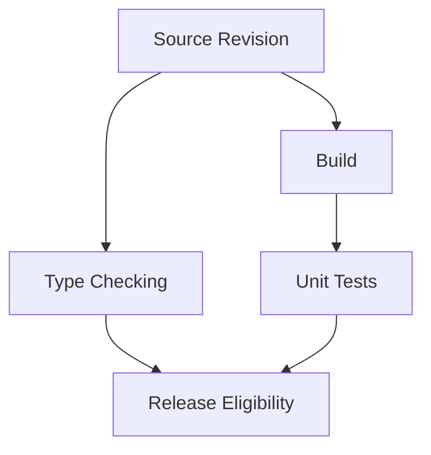
````

Suppose:

```
Type Checking: Failed

Build: Passed

Unit Tests: Passed
```

Should the change be considered valid?

No, if type checking is a required condition.

The important issue is not merely whether the final job executed.

It is whether all required validation conditions were satisfied.

## 20.1 Required checks vs optional checks

Not every CI job needs to be a mandatory gate.

Consider:

|Check|Example policy|
|---|---|
|Type checking|Required|
|Unit tests|Required|
|Build verification|Required|
|Experimental performance test|Informational|
|Optional compatibility experiment|Informational|

An informational check can provide useful evidence without necessarily blocking integration.

However, required checks must influence the integration decision.

### First-principles insight

> A quality gate is a decision policy built on validation evidence, not simply a collection of executed commands.

We will explore quality-gate design deeply in Phase 06.

---

## 20.2 Failure propagation through dependencies

Suppose the pipeline is:

#chatgpt-mermaid-_r_a2q_{font-family:-apple-system-body,ui-sans-serif,-apple-system,system-ui,"Segoe UI","Helvetica","Apple Color Emoji","Arial",sans-serif,"Segoe UI Emoji","Segoe UI Symbol";font-size:16px;fill:rgb(237, 237, 237);}@keyframes edge-animation-frame{from{stroke-dashoffset:0;}}@keyframes dash{to{stroke-dashoffset:0;}}#chatgpt-mermaid-_r_a2q_ .edge-animation-slow{stroke-dasharray:9,5!important;stroke-dashoffset:900;animation:dash 50s linear infinite;stroke-linecap:round;}#chatgpt-mermaid-_r_a2q_ .edge-animation-fast{stroke-dasharray:9,5!important;stroke-dashoffset:900;animation:dash 20s linear infinite;stroke-linecap:round;}#chatgpt-mermaid-_r_a2q_ .error-icon{fill:rgb(48, 48, 48);}#chatgpt-mermaid-_r_a2q_ .error-text{fill:rgb(237, 237, 237);stroke:rgb(237, 237, 237);}#chatgpt-mermaid-_r_a2q_ .edge-thickness-normal{stroke-width:1px;}#chatgpt-mermaid-_r_a2q_ .edge-thickness-thick{stroke-width:3.5px;}#chatgpt-mermaid-_r_a2q_ .edge-pattern-solid{stroke-dasharray:0;}#chatgpt-mermaid-_r_a2q_ .edge-thickness-invisible{stroke-width:0;fill:none;}#chatgpt-mermaid-_r_a2q_ .edge-pattern-dashed{stroke-dasharray:3;}#chatgpt-mermaid-_r_a2q_ .edge-pattern-dotted{stroke-dasharray:2;}#chatgpt-mermaid-_r_a2q_ .marker{fill:rgb(175, 175, 175);stroke:rgb(175, 175, 175);}#chatgpt-mermaid-_r_a2q_ .marker.cross{stroke:rgb(175, 175, 175);}#chatgpt-mermaid-_r_a2q_ svg{font-family:-apple-system-body,ui-sans-serif,-apple-system,system-ui,"Segoe UI","Helvetica","Apple Color Emoji","Arial",sans-serif,"Segoe UI Emoji","Segoe UI Symbol";font-size:16px;}#chatgpt-mermaid-_r_a2q_ p{margin:0;}#chatgpt-mermaid-_r_a2q_ .label{font-family:-apple-system-body,ui-sans-serif,-apple-system,system-ui,"Segoe UI","Helvetica","Apple Color Emoji","Arial",sans-serif,"Segoe UI Emoji","Segoe UI Symbol";color:rgb(237, 237, 237);}#chatgpt-mermaid-_r_a2q_ .cluster-label text{fill:rgb(237, 237, 237);}#chatgpt-mermaid-_r_a2q_ .cluster-label span{color:rgb(237, 237, 237);}#chatgpt-mermaid-_r_a2q_ .cluster-label span p{background-color:transparent;}#chatgpt-mermaid-_r_a2q_ .label text,#chatgpt-mermaid-_r_a2q_ span{fill:rgb(237, 237, 237);color:rgb(237, 237, 237);}#chatgpt-mermaid-_r_a2q_ .node rect,#chatgpt-mermaid-_r_a2q_ .node circle,#chatgpt-mermaid-_r_a2q_ .node ellipse,#chatgpt-mermaid-_r_a2q_ .node polygon,#chatgpt-mermaid-_r_a2q_ .node path{fill:rgb(9, 23, 44);stroke:rgb(31, 78, 148);stroke-width:1px;}#chatgpt-mermaid-_r_a2q_ .rough-node .label text,#chatgpt-mermaid-_r_a2q_ .node .label text,#chatgpt-mermaid-_r_a2q_ .image-shape .label,#chatgpt-mermaid-_r_a2q_ .icon-shape .label{text-anchor:middle;}#chatgpt-mermaid-_r_a2q_ .node .katex path{fill:#000;stroke:#000;stroke-width:1px;}#chatgpt-mermaid-_r_a2q_ .rough-node .label,#chatgpt-mermaid-_r_a2q_ .node .label,#chatgpt-mermaid-_r_a2q_ .image-shape .label,#chatgpt-mermaid-_r_a2q_ .icon-shape .label{text-align:center;}#chatgpt-mermaid-_r_a2q_ .node.clickable{cursor:pointer;}#chatgpt-mermaid-_r_a2q_ .root .anchor path{fill:rgb(175, 175, 175)!important;stroke-width:0;stroke:rgb(175, 175, 175);}#chatgpt-mermaid-_r_a2q_ .arrowheadPath{fill:rgb(175, 175, 175);}#chatgpt-mermaid-_r_a2q_ .edgePath .path{stroke:rgb(175, 175, 175);stroke-width:1px;}#chatgpt-mermaid-_r_a2q_ .flowchart-link{stroke:rgb(175, 175, 175);fill:none;}#chatgpt-mermaid-_r_a2q_ .edgeLabel{background-color:rgb(0, 0, 0);text-align:center;}#chatgpt-mermaid-_r_a2q_ .edgeLabel p{background-color:rgb(0, 0, 0);}#chatgpt-mermaid-_r_a2q_ .edgeLabel rect{opacity:0.5;background-color:rgb(0, 0, 0);fill:rgb(0, 0, 0);}#chatgpt-mermaid-_r_a2q_ .labelBkg{background-color:rgba(0, 0, 0, 0.5);}#chatgpt-mermaid-_r_a2q_ .cluster rect{fill:rgb(48, 48, 48);stroke:rgba(255, 255, 255, 0.15);stroke-width:1px;}#chatgpt-mermaid-_r_a2q_ .cluster text{fill:rgb(237, 237, 237);}#chatgpt-mermaid-_r_a2q_ .cluster span{color:rgb(237, 237, 237);}#chatgpt-mermaid-_r_a2q_ div.mermaidTooltip{position:absolute;text-align:center;max-width:200px;padding:2px;font-family:-apple-system-body,ui-sans-serif,-apple-system,system-ui,"Segoe UI","Helvetica","Apple Color Emoji","Arial",sans-serif,"Segoe UI Emoji","Segoe UI Symbol";font-size:12px;background:rgb(48, 48, 48);border:1px solid rgba(255, 255, 255, 0.15);border-radius:2px;pointer-events:none;z-index:100;}#chatgpt-mermaid-_r_a2q_ .flowchartTitleText{text-anchor:middle;font-size:18px;fill:rgb(237, 237, 237);}#chatgpt-mermaid-_r_a2q_ rect.text{fill:none;stroke-width:0;}#chatgpt-mermaid-_r_a2q_ .icon-shape,#chatgpt-mermaid-_r_a2q_ .image-shape{background-color:rgb(0, 0, 0);text-align:center;}#chatgpt-mermaid-_r_a2q_ .icon-shape p,#chatgpt-mermaid-_r_a2q_ .image-shape p{background-color:rgb(0, 0, 0);padding:2px;}#chatgpt-mermaid-_r_a2q_ .icon-shape .label rect,#chatgpt-mermaid-_r_a2q_ .image-shape .label rect{opacity:0.5;background-color:rgb(0, 0, 0);fill:rgb(0, 0, 0);}#chatgpt-mermaid-_r_a2q_ .label-icon{display:inline-block;height:1em;overflow:visible;vertical-align:-0.125em;}#chatgpt-mermaid-_r_a2q_ .node .label-icon path{fill:currentColor;stroke:revert;stroke-width:revert;}#chatgpt-mermaid-_r_a2q_ .node .neo-node{stroke:rgb(31, 78, 148);}#chatgpt-mermaid-_r_a2q_ [data-look="neo"].node rect,#chatgpt-mermaid-_r_a2q_ [data-look="neo"].cluster rect,#chatgpt-mermaid-_r_a2q_ [data-look="neo"].node polygon{stroke:url(#chatgpt-mermaid-_r_a2q_-gradient);filter:drop-shadow( 1px 2px 2px rgba(185,185,185,1));}#chatgpt-mermaid-_r_a2q_ [data-look="neo"].swimlane.cluster rect{filter:none;}#chatgpt-mermaid-_r_a2q_ [data-look="neo"].node path{stroke:url(#chatgpt-mermaid-_r_a2q_-gradient);stroke-width:1px;}#chatgpt-mermaid-_r_a2q_ [data-look="neo"].node .outer-path{filter:drop-shadow( 1px 2px 2px rgba(185,185,185,1));}#chatgpt-mermaid-_r_a2q_ [data-look="neo"].node .neo-line path{stroke:rgb(31, 78, 148);filter:none;}#chatgpt-mermaid-_r_a2q_ [data-look="neo"].node circle{stroke:url(#chatgpt-mermaid-_r_a2q_-gradient);filter:drop-shadow( 1px 2px 2px rgba(185,185,185,1));}#chatgpt-mermaid-_r_a2q_ [data-look="neo"].node circle .state-start{fill:#000000;}#chatgpt-mermaid-_r_a2q_ [data-look="neo"].icon-shape .icon{fill:url(#chatgpt-mermaid-_r_a2q_-gradient);filter:drop-shadow( 1px 2px 2px rgba(185,185,185,1));}#chatgpt-mermaid-_r_a2q_ [data-look="neo"].icon-shape .icon-neo path{stroke:url(#chatgpt-mermaid-_r_a2q_-gradient);filter:drop-shadow( 1px 2px 2px rgba(185,185,185,1));}#chatgpt-mermaid-_r_a2q_ .node text{font-size:14px;font-weight:600;letter-spacing:normal;fill:rgb(232, 232, 232);}#chatgpt-mermaid-_r_a2q_ .edgeLabels text{font-size:13px;font-weight:600;letter-spacing:-0.08px;fill:rgb(232, 232, 232);}#chatgpt-mermaid-_r_a2q_ .node tspan[font-weight="normal"],#chatgpt-mermaid-_r_a2q_ .edgeLabels tspan[font-weight="normal"]{font-weight:600;}#chatgpt-mermaid-_r_a2q_ .edgeLabel .label rect{opacity:1;rx:13px;ry:13px;fill:rgb(19, 19, 19);stroke:rgb(47, 47, 47);stroke-width:1px;}#chatgpt-mermaid-_r_a2q_ .node rect,#chatgpt-mermaid-_r_a2q_ .node circle,#chatgpt-mermaid-_r_a2q_ .node ellipse,#chatgpt-mermaid-_r_a2q_ .node polygon,#chatgpt-mermaid-_r_a2q_ .node path{fill:rgb(24, 24, 24);stroke:rgba(255, 255, 255, 0.1);stroke-width:1px;}#chatgpt-mermaid-_r_a2q_ .node rect{rx:16px;ry:16px;}#chatgpt-mermaid-_r_a2q_ .node.mermaid-decision .label-container{fill:rgb(19, 19, 19);stroke:rgb(47, 47, 47);stroke-dasharray:2px,2px;}#chatgpt-mermaid-_r_a2q_ .edgePaths .flowchart-link{stroke:rgb(175, 175, 175);stroke-width:1px;stroke-linecap:round;stroke-linejoin:round;}#chatgpt-mermaid-_r_a2q_ .marker{fill:rgb(175, 175, 175);stroke:rgb(175, 175, 175);}#chatgpt-mermaid-_r_a2q_ :root{--mermaid-font-family:-apple-system-body,ui-sans-serif,-apple-system,system-ui,"Segoe UI","Helvetica","Apple Color Emoji","Arial",sans-serif,"Segoe UI Emoji","Segoe UI Symbol";}BuildUnit TestsIntegration TestsValidation Complete

If the build fails, downstream jobs normally cannot execute.

Why?

Because their prerequisites are not satisfied.

GitHub Actions implements this through dependency relationships.

For example:

```
jobs:
  build:
    runs-on: ubuntu-latest

    steps:
      - run: exit 1

  tests:
    needs: build
    runs-on: ubuntu-latest

    steps:
      - run: echo "Run tests"
```

The `build` job fails.

The `tests` job is normally skipped because its dependency did not succeed.

### Why is this reasonable?

Executing tests that require a successful build may provide no useful information.

The pipeline should not continue blindly when required prerequisites are unavailable.

---

## 20.3 When should jobs continue after failure?

Imagine these independent checks:

```
Type Checking
Unit Tests
Static Analysis
```

If type checking fails, should we immediately cancel every other validation?

Not always.

Running the other independent checks may provide developers with more complete feedback.

Instead of fixing one problem, waiting for CI, and discovering another problem, developers can see multiple failures in one execution.

But executing expensive checks after a fundamental failure may waste resources.

### Two strategies

**Fail early:** Stop dependent or selected remaining work when failure makes that work unnecessary.

**Collect comprehensive feedback:** Continue independent checks so developers receive more information.

Neither strategy is universally correct.

### How to choose?

Ask:

1. Does the remaining job depend on the failed job?
2. Can the remaining job produce useful evidence?
3. How expensive is it?
4. How valuable is early feedback?
5. Does continuing introduce additional risk?

---

# 21. Matrix Builds: Validating Multiple Execution Conditions

Now consider another problem.

Your application works on Node.js 22.

But the team also supports Node.js 24.

Can one validation job prove compatibility with both environments?

No.

We need to evaluate both.

One option is to create two separate jobs manually.

Another option is to use a matrix.

## 21.1 What is a matrix?

A matrix defines variations of a job.

For example:

```
jobs:
  compatibility:
    strategy:
      fail-fast: false
      matrix:
        node-version: [22, 24]

    runs-on: ubuntu-latest

    steps:
      - name: Checkout source
        uses: actions/checkout@v4

      - name: Configure Node.js
        uses: actions/setup-node@v4
        with:
          node-version: ${{ matrix.node-version }}
          cache: npm

      - name: Install dependencies
        run: npm ci

      - name: Build
        run: npm run build

      - name: Test
        run: npm test
```

This creates job variations for the specified Node.js versions.

## 21.2 Matrix architecture

#chatgpt-mermaid-_r_a3a_{font-family:-apple-system-body,ui-sans-serif,-apple-system,system-ui,"Segoe UI","Helvetica","Apple Color Emoji","Arial",sans-serif,"Segoe UI Emoji","Segoe UI Symbol";font-size:16px;fill:rgb(237, 237, 237);}@keyframes edge-animation-frame{from{stroke-dashoffset:0;}}@keyframes dash{to{stroke-dashoffset:0;}}#chatgpt-mermaid-_r_a3a_ .edge-animation-slow{stroke-dasharray:9,5!important;stroke-dashoffset:900;animation:dash 50s linear infinite;stroke-linecap:round;}#chatgpt-mermaid-_r_a3a_ .edge-animation-fast{stroke-dasharray:9,5!important;stroke-dashoffset:900;animation:dash 20s linear infinite;stroke-linecap:round;}#chatgpt-mermaid-_r_a3a_ .error-icon{fill:rgb(48, 48, 48);}#chatgpt-mermaid-_r_a3a_ .error-text{fill:rgb(237, 237, 237);stroke:rgb(237, 237, 237);}#chatgpt-mermaid-_r_a3a_ .edge-thickness-normal{stroke-width:1px;}#chatgpt-mermaid-_r_a3a_ .edge-thickness-thick{stroke-width:3.5px;}#chatgpt-mermaid-_r_a3a_ .edge-pattern-solid{stroke-dasharray:0;}#chatgpt-mermaid-_r_a3a_ .edge-thickness-invisible{stroke-width:0;fill:none;}#chatgpt-mermaid-_r_a3a_ .edge-pattern-dashed{stroke-dasharray:3;}#chatgpt-mermaid-_r_a3a_ .edge-pattern-dotted{stroke-dasharray:2;}#chatgpt-mermaid-_r_a3a_ .marker{fill:rgb(175, 175, 175);stroke:rgb(175, 175, 175);}#chatgpt-mermaid-_r_a3a_ .marker.cross{stroke:rgb(175, 175, 175);}#chatgpt-mermaid-_r_a3a_ svg{font-family:-apple-system-body,ui-sans-serif,-apple-system,system-ui,"Segoe UI","Helvetica","Apple Color Emoji","Arial",sans-serif,"Segoe UI Emoji","Segoe UI Symbol";font-size:16px;}#chatgpt-mermaid-_r_a3a_ p{margin:0;}#chatgpt-mermaid-_r_a3a_ .label{font-family:-apple-system-body,ui-sans-serif,-apple-system,system-ui,"Segoe UI","Helvetica","Apple Color Emoji","Arial",sans-serif,"Segoe UI Emoji","Segoe UI Symbol";color:rgb(237, 237, 237);}#chatgpt-mermaid-_r_a3a_ .cluster-label text{fill:rgb(237, 237, 237);}#chatgpt-mermaid-_r_a3a_ .cluster-label span{color:rgb(237, 237, 237);}#chatgpt-mermaid-_r_a3a_ .cluster-label span p{background-color:transparent;}#chatgpt-mermaid-_r_a3a_ .label text,#chatgpt-mermaid-_r_a3a_ span{fill:rgb(237, 237, 237);color:rgb(237, 237, 237);}#chatgpt-mermaid-_r_a3a_ .node rect,#chatgpt-mermaid-_r_a3a_ .node circle,#chatgpt-mermaid-_r_a3a_ .node ellipse,#chatgpt-mermaid-_r_a3a_ .node polygon,#chatgpt-mermaid-_r_a3a_ .node path{fill:rgb(9, 23, 44);stroke:rgb(31, 78, 148);stroke-width:1px;}#chatgpt-mermaid-_r_a3a_ .rough-node .label text,#chatgpt-mermaid-_r_a3a_ .node .label text,#chatgpt-mermaid-_r_a3a_ .image-shape .label,#chatgpt-mermaid-_r_a3a_ .icon-shape .label{text-anchor:middle;}#chatgpt-mermaid-_r_a3a_ .node .katex path{fill:#000;stroke:#000;stroke-width:1px;}#chatgpt-mermaid-_r_a3a_ .rough-node .label,#chatgpt-mermaid-_r_a3a_ .node .label,#chatgpt-mermaid-_r_a3a_ .image-shape .label,#chatgpt-mermaid-_r_a3a_ .icon-shape .label{text-align:center;}#chatgpt-mermaid-_r_a3a_ .node.clickable{cursor:pointer;}#chatgpt-mermaid-_r_a3a_ .root .anchor path{fill:rgb(175, 175, 175)!important;stroke-width:0;stroke:rgb(175, 175, 175);}#chatgpt-mermaid-_r_a3a_ .arrowheadPath{fill:rgb(175, 175, 175);}#chatgpt-mermaid-_r_a3a_ .edgePath .path{stroke:rgb(175, 175, 175);stroke-width:1px;}#chatgpt-mermaid-_r_a3a_ .flowchart-link{stroke:rgb(175, 175, 175);fill:none;}#chatgpt-mermaid-_r_a3a_ .edgeLabel{background-color:rgb(0, 0, 0);text-align:center;}#chatgpt-mermaid-_r_a3a_ .edgeLabel p{background-color:rgb(0, 0, 0);}#chatgpt-mermaid-_r_a3a_ .edgeLabel rect{opacity:0.5;background-color:rgb(0, 0, 0);fill:rgb(0, 0, 0);}#chatgpt-mermaid-_r_a3a_ .labelBkg{background-color:rgba(0, 0, 0, 0.5);}#chatgpt-mermaid-_r_a3a_ .cluster rect{fill:rgb(48, 48, 48);stroke:rgba(255, 255, 255, 0.15);stroke-width:1px;}#chatgpt-mermaid-_r_a3a_ .cluster text{fill:rgb(237, 237, 237);}#chatgpt-mermaid-_r_a3a_ .cluster span{color:rgb(237, 237, 237);}#chatgpt-mermaid-_r_a3a_ div.mermaidTooltip{position:absolute;text-align:center;max-width:200px;padding:2px;font-family:-apple-system-body,ui-sans-serif,-apple-system,system-ui,"Segoe UI","Helvetica","Apple Color Emoji","Arial",sans-serif,"Segoe UI Emoji","Segoe UI Symbol";font-size:12px;background:rgb(48, 48, 48);border:1px solid rgba(255, 255, 255, 0.15);border-radius:2px;pointer-events:none;z-index:100;}#chatgpt-mermaid-_r_a3a_ .flowchartTitleText{text-anchor:middle;font-size:18px;fill:rgb(237, 237, 237);}#chatgpt-mermaid-_r_a3a_ rect.text{fill:none;stroke-width:0;}#chatgpt-mermaid-_r_a3a_ .icon-shape,#chatgpt-mermaid-_r_a3a_ .image-shape{background-color:rgb(0, 0, 0);text-align:center;}#chatgpt-mermaid-_r_a3a_ .icon-shape p,#chatgpt-mermaid-_r_a3a_ .image-shape p{background-color:rgb(0, 0, 0);padding:2px;}#chatgpt-mermaid-_r_a3a_ .icon-shape .label rect,#chatgpt-mermaid-_r_a3a_ .image-shape .label rect{opacity:0.5;background-color:rgb(0, 0, 0);fill:rgb(0, 0, 0);}#chatgpt-mermaid-_r_a3a_ .label-icon{display:inline-block;height:1em;overflow:visible;vertical-align:-0.125em;}#chatgpt-mermaid-_r_a3a_ .node .label-icon path{fill:currentColor;stroke:revert;stroke-width:revert;}#chatgpt-mermaid-_r_a3a_ .node .neo-node{stroke:rgb(31, 78, 148);}#chatgpt-mermaid-_r_a3a_ [data-look="neo"].node rect,#chatgpt-mermaid-_r_a3a_ [data-look="neo"].cluster rect,#chatgpt-mermaid-_r_a3a_ [data-look="neo"].node polygon{stroke:url(#chatgpt-mermaid-_r_a3a_-gradient);filter:drop-shadow( 1px 2px 2px rgba(185,185,185,1));}#chatgpt-mermaid-_r_a3a_ [data-look="neo"].swimlane.cluster rect{filter:none;}#chatgpt-mermaid-_r_a3a_ [data-look="neo"].node path{stroke:url(#chatgpt-mermaid-_r_a3a_-gradient);stroke-width:1px;}#chatgpt-mermaid-_r_a3a_ [data-look="neo"].node .outer-path{filter:drop-shadow( 1px 2px 2px rgba(185,185,185,1));}#chatgpt-mermaid-_r_a3a_ [data-look="neo"].node .neo-line path{stroke:rgb(31, 78, 148);filter:none;}#chatgpt-mermaid-_r_a3a_ [data-look="neo"].node circle{stroke:url(#chatgpt-mermaid-_r_a3a_-gradient);filter:drop-shadow( 1px 2px 2px rgba(185,185,185,1));}#chatgpt-mermaid-_r_a3a_ [data-look="neo"].node circle .state-start{fill:#000000;}#chatgpt-mermaid-_r_a3a_ [data-look="neo"].icon-shape .icon{fill:url(#chatgpt-mermaid-_r_a3a_-gradient);filter:drop-shadow( 1px 2px 2px rgba(185,185,185,1));}#chatgpt-mermaid-_r_a3a_ [data-look="neo"].icon-shape .icon-neo path{stroke:url(#chatgpt-mermaid-_r_a3a_-gradient);filter:drop-shadow( 1px 2px 2px rgba(185,185,185,1));}#chatgpt-mermaid-_r_a3a_ .node text{font-size:14px;font-weight:600;letter-spacing:normal;fill:rgb(232, 232, 232);}#chatgpt-mermaid-_r_a3a_ .edgeLabels text{font-size:13px;font-weight:600;letter-spacing:-0.08px;fill:rgb(232, 232, 232);}#chatgpt-mermaid-_r_a3a_ .node tspan[font-weight="normal"],#chatgpt-mermaid-_r_a3a_ .edgeLabels tspan[font-weight="normal"]{font-weight:600;}#chatgpt-mermaid-_r_a3a_ .edgeLabel .label rect{opacity:1;rx:13px;ry:13px;fill:rgb(19, 19, 19);stroke:rgb(47, 47, 47);stroke-width:1px;}#chatgpt-mermaid-_r_a3a_ .node rect,#chatgpt-mermaid-_r_a3a_ .node circle,#chatgpt-mermaid-_r_a3a_ .node ellipse,#chatgpt-mermaid-_r_a3a_ .node polygon,#chatgpt-mermaid-_r_a3a_ .node path{fill:rgb(24, 24, 24);stroke:rgba(255, 255, 255, 0.1);stroke-width:1px;}#chatgpt-mermaid-_r_a3a_ .node rect{rx:16px;ry:16px;}#chatgpt-mermaid-_r_a3a_ .node.mermaid-decision .label-container{fill:rgb(19, 19, 19);stroke:rgb(47, 47, 47);stroke-dasharray:2px,2px;}#chatgpt-mermaid-_r_a3a_ .edgePaths .flowchart-link{stroke:rgb(175, 175, 175);stroke-width:1px;stroke-linecap:round;stroke-linejoin:round;}#chatgpt-mermaid-_r_a3a_ .marker{fill:rgb(175, 175, 175);stroke:rgb(175, 175, 175);}#chatgpt-mermaid-_r_a3a_ :root{--mermaid-font-family:-apple-system-body,ui-sans-serif,-apple-system,system-ui,"Segoe UI","Helvetica","Apple Color Emoji","Arial",sans-serif,"Segoe UI Emoji","Segoe UI Symbol";}Source RevisionCompatibility MatrixNode.js 22 JobNode.js 24 JobCollect Results

The jobs can execute concurrently when compatible runners are available.

### Why use `fail-fast: false`?

For a matrix, this allows other matrix jobs to continue rather than cancelling unfinished siblings simply because one non-experimental matrix job fails.

This is useful when you want compatibility results for every supported runtime.

GitHub documents matrix expansion, `fail-fast`, and `max-parallel` as controls for running job variations. ([docs.github.com](https://docs.github.com/en/actions/how-tos/write-workflows/choose-what-workflows-do/run-job-variations?utm_source=chatgpt.com))

### Important distinction

`strategy.fail-fast` controls cancellation behavior within a matrix strategy.

It is not a general instruction to stop every job in the entire workflow whenever one job fails.

---

# 22. Concurrency: Managing Multiple Workflow Runs

Now imagine a developer pushes five commits in quick succession.

Each push triggers CI.

You may end up with:

```
CI Run 1
CI Run 2
CI Run 3
CI Run 4
CI Run 5
```

But perhaps only the latest version of the pull request matters for immediate developer feedback.

Should all five runs always complete?

Not necessarily.

## 22.1 The problem

Repeated validation of superseded revisions can consume compute resources.

It can also delay newer, more relevant feedback when runner capacity is limited.

We need a policy for managing concurrent executions.

---

## 22.2 Example concurrency policy

```
concurrency:
  group: ci-${{ github.workflow }}-${{ github.event.pull_request.number || github.ref }}
  cancel-in-progress: ${{ github.event_name == 'pull_request' }}
```

This example groups runs by workflow and pull request where available, falling back to the Git reference.

It cancels an already running workflow in the same group when a newer pull-request run supersedes it.

For other event types, the example does not request cancellation of an already running workflow.

GitHub Actions supports workflow-level and job-level concurrency groups and configurable cancellation behavior. ([docs.github.com](https://docs.github.com/en/actions/how-tos/write-workflows/choose-when-workflows-run/control-workflow-concurrency?utm_source=chatgpt.com))

### Why not cancel every workflow?

Because some workflows represent operations that should not be interrupted casually.

For example:

```
Release Publication
Production Promotion
Database Migration
```

A new commit should not automatically cancel an unrelated production operation.

### Architectural principle

> Concurrency control must reflect whether a workflow execution can safely be superseded.

Pull-request validation and production release execution may require very different policies.

---

# 23. Reproducibility: Why Passing Once Is Not Enough

Suppose CI passes today.

Tomorrow, the same source revision fails.

What changed?

Possible causes:

- Dependency versions.
- Base images.
- Runtime versions.
- External services.
- Test data.
- Tool versions.
- Environment variables.
- Network conditions.

This is a reproducibility problem.

## 23.1 What does reproducibility mean?

For CI, reproducibility means reducing uncontrolled variability so repeated executions under equivalent conditions produce consistent results.

Perfect reproducibility can be difficult, especially when tests depend on live external systems.

But we can improve it.

### Controls include

- Dependency lockfiles.
- Controlled runtime versions.
- Defined build commands.
- Consistent environment configuration.
- Isolated runners.
- Deterministic test data.
- Stable test dependencies.
- Explicit external service requirements.

---

## 23.2 Why `npm ci` matters

Compare:

```
npm install
```

And:

```
npm ci
```

For CI environments, `npm ci` is generally preferable when the project has an appropriate lockfile.

It performs a clean dependency installation based on the package lock and fails when the package manifest and lockfile are inconsistent.

This reduces uncontrolled dependency resolution during CI.

### Important requirement

The repository must contain:

```
package.json
package-lock.json
```

If `package-lock.json` is missing, `npm ci` fails.

The solution is not to replace `npm ci` with a less predictable installation command in every workflow.

Instead, generate and commit the appropriate lockfile as part of the project.

### Mental model

```
Source Revision
      +
Dependency Lockfile
      +
Defined Runtime
      +
Controlled Build Commands
      |
      v
More Reproducible Validation
```

This is not a guarantee of identical behavior under every condition, but it reduces important sources of variation.

---

# 24. Flaky Tests: When Feedback Becomes Unreliable

Now imagine this situation:

```
Commit: abc123

CI Run 1: Failed
CI Run 2: Passed
CI Run 3: Failed
CI Run 4: Passed
```

The source revision has not changed.

Why are the outcomes inconsistent?

Possible reasons:

- Race conditions.
- Timing assumptions.
- External dependency instability.
- Shared test data.
- Non-isolated tests.
- Resource contention.
- Uncontrolled environment differences.

This is the problem of flaky validation.

## 24.1 Why is flakiness dangerous?

CI exists to provide useful feedback.

But if developers frequently receive false alarms, they may stop trusting the results.

They may rerun failed workflows until they pass without investigating the underlying issue.

This weakens the integration process.

### First-principles lesson

> A validation system must be evaluated not only by how many failures it detects, but also by how reliably its results represent the properties being tested.

---

## 24.2 Should we automatically retry every failure?

Not necessarily.

Retries can be useful when a known transient infrastructure failure occurs.

But retries can also hide application defects.

Consider:

```
Test Fails
    |
    v
Automatically Retry
    |
    v
Test Passes
```

What have we learned?

Possibly that the failure was transient.

But we have not necessarily established why.

The original failure should remain visible.

### Better engineering approach

Distinguish:

- Application assertion failure.
- Test environment failure.
- External service outage.
- Known transient infrastructure error.

Design retry policies accordingly.

We will study test quality and flaky-test management in Phase 06.

---

# 25. CI Security: Runners Execute Code

We should briefly examine security because it influences the architecture.

Imagine your CI workflow executes:

```
npm ci
npm test
```

These commands can execute repository-controlled code and dependency lifecycle scripts.

That means CI runners are execution environments for potentially untrusted code.

### Important architectural questions

- Who can modify the workflow?
- Who can submit code to be executed?
- What secrets are accessible?
- What GitHub token permissions are granted?
- Can the runner reach internal infrastructure?
- Are artifacts and caches trusted?
- Can workflow changes affect production?

This is why permissions and runner isolation matter.

## 25.1 A minimal validation permission model

For a simple pull-request validation workflow:

```
permissions:
  contents: read
```

The workflow may only need read access to source code.

It typically does not require:

```
Production Kubernetes Credentials
Cloud Administrator Permissions
Container Registry Deletion Permissions
```

### Important distinction

GitHub-hosted runner isolation and limited permissions reduce risk but do not eliminate it.

For example, privileged workflows should not execute untrusted pull-request code while exposing sensitive credentials.

GitHub specifically warns against unsafe combinations of privileged workflow triggers and execution of untrusted code. ([docs.github.com](https://docs.github.com/en/actions/reference/security/securely-using-pull_request_target?utm_source=chatgpt.com))

We will cover CI/CD security comprehensively in Phase 14.

For now, remember:

> **A CI runner is a code execution boundary. Its permissions should match the validation responsibility, not the permissions of the entire delivery platform.**

---

# 26. Putting the Architecture Together

We now have enough understanding to design a practical CI system.

Suppose our application needs:

- Type checking.
- Compilation.
- Unit testing against compiled output.
- Preservation of compiled files.
- A final required validation result.

Let's derive the job relationships.

## 26.1 Identify independent work

Type checking can execute independently from the build job.

Both need source code and dependencies.

Therefore, they can run concurrently.

## 26.2 Identify dependent work

Unit testing requires compiled JavaScript.

Therefore:

```
Build
  |
  v
Unit Tests
```

But the tests execute in a different runner.

So the compiled output must be transferred explicitly.

## 26.3 Define final validation

The final result should depend on:

- Type-checking result.
- Build result.
- Unit-test result.

The complete architecture becomes:

#chatgpt-mermaid-_r_a4p_{font-family:-apple-system-body,ui-sans-serif,-apple-system,system-ui,"Segoe UI","Helvetica","Apple Color Emoji","Arial",sans-serif,"Segoe UI Emoji","Segoe UI Symbol";font-size:16px;fill:rgb(237, 237, 237);}@keyframes edge-animation-frame{from{stroke-dashoffset:0;}}@keyframes dash{to{stroke-dashoffset:0;}}#chatgpt-mermaid-_r_a4p_ .edge-animation-slow{stroke-dasharray:9,5!important;stroke-dashoffset:900;animation:dash 50s linear infinite;stroke-linecap:round;}#chatgpt-mermaid-_r_a4p_ .edge-animation-fast{stroke-dasharray:9,5!important;stroke-dashoffset:900;animation:dash 20s linear infinite;stroke-linecap:round;}#chatgpt-mermaid-_r_a4p_ .error-icon{fill:rgb(48, 48, 48);}#chatgpt-mermaid-_r_a4p_ .error-text{fill:rgb(237, 237, 237);stroke:rgb(237, 237, 237);}#chatgpt-mermaid-_r_a4p_ .edge-thickness-normal{stroke-width:1px;}#chatgpt-mermaid-_r_a4p_ .edge-thickness-thick{stroke-width:3.5px;}#chatgpt-mermaid-_r_a4p_ .edge-pattern-solid{stroke-dasharray:0;}#chatgpt-mermaid-_r_a4p_ .edge-thickness-invisible{stroke-width:0;fill:none;}#chatgpt-mermaid-_r_a4p_ .edge-pattern-dashed{stroke-dasharray:3;}#chatgpt-mermaid-_r_a4p_ .edge-pattern-dotted{stroke-dasharray:2;}#chatgpt-mermaid-_r_a4p_ .marker{fill:rgb(175, 175, 175);stroke:rgb(175, 175, 175);}#chatgpt-mermaid-_r_a4p_ .marker.cross{stroke:rgb(175, 175, 175);}#chatgpt-mermaid-_r_a4p_ svg{font-family:-apple-system-body,ui-sans-serif,-apple-system,system-ui,"Segoe UI","Helvetica","Apple Color Emoji","Arial",sans-serif,"Segoe UI Emoji","Segoe UI Symbol";font-size:16px;}#chatgpt-mermaid-_r_a4p_ p{margin:0;}#chatgpt-mermaid-_r_a4p_ .label{font-family:-apple-system-body,ui-sans-serif,-apple-system,system-ui,"Segoe UI","Helvetica","Apple Color Emoji","Arial",sans-serif,"Segoe UI Emoji","Segoe UI Symbol";color:rgb(237, 237, 237);}#chatgpt-mermaid-_r_a4p_ .cluster-label text{fill:rgb(237, 237, 237);}#chatgpt-mermaid-_r_a4p_ .cluster-label span{color:rgb(237, 237, 237);}#chatgpt-mermaid-_r_a4p_ .cluster-label span p{background-color:transparent;}#chatgpt-mermaid-_r_a4p_ .label text,#chatgpt-mermaid-_r_a4p_ span{fill:rgb(237, 237, 237);color:rgb(237, 237, 237);}#chatgpt-mermaid-_r_a4p_ .node rect,#chatgpt-mermaid-_r_a4p_ .node circle,#chatgpt-mermaid-_r_a4p_ .node ellipse,#chatgpt-mermaid-_r_a4p_ .node polygon,#chatgpt-mermaid-_r_a4p_ .node path{fill:rgb(9, 23, 44);stroke:rgb(31, 78, 148);stroke-width:1px;}#chatgpt-mermaid-_r_a4p_ .rough-node .label text,#chatgpt-mermaid-_r_a4p_ .node .label text,#chatgpt-mermaid-_r_a4p_ .image-shape .label,#chatgpt-mermaid-_r_a4p_ .icon-shape .label{text-anchor:middle;}#chatgpt-mermaid-_r_a4p_ .node .katex path{fill:#000;stroke:#000;stroke-width:1px;}#chatgpt-mermaid-_r_a4p_ .rough-node .label,#chatgpt-mermaid-_r_a4p_ .node .label,#chatgpt-mermaid-_r_a4p_ .image-shape .label,#chatgpt-mermaid-_r_a4p_ .icon-shape .label{text-align:center;}#chatgpt-mermaid-_r_a4p_ .node.clickable{cursor:pointer;}#chatgpt-mermaid-_r_a4p_ .root .anchor path{fill:rgb(175, 175, 175)!important;stroke-width:0;stroke:rgb(175, 175, 175);}#chatgpt-mermaid-_r_a4p_ .arrowheadPath{fill:rgb(175, 175, 175);}#chatgpt-mermaid-_r_a4p_ .edgePath .path{stroke:rgb(175, 175, 175);stroke-width:1px;}#chatgpt-mermaid-_r_a4p_ .flowchart-link{stroke:rgb(175, 175, 175);fill:none;}#chatgpt-mermaid-_r_a4p_ .edgeLabel{background-color:rgb(0, 0, 0);text-align:center;}#chatgpt-mermaid-_r_a4p_ .edgeLabel p{background-color:rgb(0, 0, 0);}#chatgpt-mermaid-_r_a4p_ .edgeLabel rect{opacity:0.5;background-color:rgb(0, 0, 0);fill:rgb(0, 0, 0);}#chatgpt-mermaid-_r_a4p_ .labelBkg{background-color:rgba(0, 0, 0, 0.5);}#chatgpt-mermaid-_r_a4p_ .cluster rect{fill:rgb(48, 48, 48);stroke:rgba(255, 255, 255, 0.15);stroke-width:1px;}#chatgpt-mermaid-_r_a4p_ .cluster text{fill:rgb(237, 237, 237);}#chatgpt-mermaid-_r_a4p_ .cluster span{color:rgb(237, 237, 237);}#chatgpt-mermaid-_r_a4p_ div.mermaidTooltip{position:absolute;text-align:center;max-width:200px;padding:2px;font-family:-apple-system-body,ui-sans-serif,-apple-system,system-ui,"Segoe UI","Helvetica","Apple Color Emoji","Arial",sans-serif,"Segoe UI Emoji","Segoe UI Symbol";font-size:12px;background:rgb(48, 48, 48);border:1px solid rgba(255, 255, 255, 0.15);border-radius:2px;pointer-events:none;z-index:100;}#chatgpt-mermaid-_r_a4p_ .flowchartTitleText{text-anchor:middle;font-size:18px;fill:rgb(237, 237, 237);}#chatgpt-mermaid-_r_a4p_ rect.text{fill:none;stroke-width:0;}#chatgpt-mermaid-_r_a4p_ .icon-shape,#chatgpt-mermaid-_r_a4p_ .image-shape{background-color:rgb(0, 0, 0);text-align:center;}#chatgpt-mermaid-_r_a4p_ .icon-shape p,#chatgpt-mermaid-_r_a4p_ .image-shape p{background-color:rgb(0, 0, 0);padding:2px;}#chatgpt-mermaid-_r_a4p_ .icon-shape .label rect,#chatgpt-mermaid-_r_a4p_ .image-shape .label rect{opacity:0.5;background-color:rgb(0, 0, 0);fill:rgb(0, 0, 0);}#chatgpt-mermaid-_r_a4p_ .label-icon{display:inline-block;height:1em;overflow:visible;vertical-align:-0.125em;}#chatgpt-mermaid-_r_a4p_ .node .label-icon path{fill:currentColor;stroke:revert;stroke-width:revert;}#chatgpt-mermaid-_r_a4p_ .node .neo-node{stroke:rgb(31, 78, 148);}#chatgpt-mermaid-_r_a4p_ [data-look="neo"].node rect,#chatgpt-mermaid-_r_a4p_ [data-look="neo"].cluster rect,#chatgpt-mermaid-_r_a4p_ [data-look="neo"].node polygon{stroke:url(#chatgpt-mermaid-_r_a4p_-gradient);filter:drop-shadow( 1px 2px 2px rgba(185,185,185,1));}#chatgpt-mermaid-_r_a4p_ [data-look="neo"].swimlane.cluster rect{filter:none;}#chatgpt-mermaid-_r_a4p_ [data-look="neo"].node path{stroke:url(#chatgpt-mermaid-_r_a4p_-gradient);stroke-width:1px;}#chatgpt-mermaid-_r_a4p_ [data-look="neo"].node .outer-path{filter:drop-shadow( 1px 2px 2px rgba(185,185,185,1));}#chatgpt-mermaid-_r_a4p_ [data-look="neo"].node .neo-line path{stroke:rgb(31, 78, 148);filter:none;}#chatgpt-mermaid-_r_a4p_ [data-look="neo"].node circle{stroke:url(#chatgpt-mermaid-_r_a4p_-gradient);filter:drop-shadow( 1px 2px 2px rgba(185,185,185,1));}#chatgpt-mermaid-_r_a4p_ [data-look="neo"].node circle .state-start{fill:#000000;}#chatgpt-mermaid-_r_a4p_ [data-look="neo"].icon-shape .icon{fill:url(#chatgpt-mermaid-_r_a4p_-gradient);filter:drop-shadow( 1px 2px 2px rgba(185,185,185,1));}#chatgpt-mermaid-_r_a4p_ [data-look="neo"].icon-shape .icon-neo path{stroke:url(#chatgpt-mermaid-_r_a4p_-gradient);filter:drop-shadow( 1px 2px 2px rgba(185,185,185,1));}#chatgpt-mermaid-_r_a4p_ .node text{font-size:14px;font-weight:600;letter-spacing:normal;fill:rgb(232, 232, 232);}#chatgpt-mermaid-_r_a4p_ .edgeLabels text{font-size:13px;font-weight:600;letter-spacing:-0.08px;fill:rgb(232, 232, 232);}#chatgpt-mermaid-_r_a4p_ .node tspan[font-weight="normal"],#chatgpt-mermaid-_r_a4p_ .edgeLabels tspan[font-weight="normal"]{font-weight:600;}#chatgpt-mermaid-_r_a4p_ .edgeLabel .label rect{opacity:1;rx:13px;ry:13px;fill:rgb(19, 19, 19);stroke:rgb(47, 47, 47);stroke-width:1px;}#chatgpt-mermaid-_r_a4p_ .node rect,#chatgpt-mermaid-_r_a4p_ .node circle,#chatgpt-mermaid-_r_a4p_ .node ellipse,#chatgpt-mermaid-_r_a4p_ .node polygon,#chatgpt-mermaid-_r_a4p_ .node path{fill:rgb(24, 24, 24);stroke:rgba(255, 255, 255, 0.1);stroke-width:1px;}#chatgpt-mermaid-_r_a4p_ .node rect{rx:16px;ry:16px;}#chatgpt-mermaid-_r_a4p_ .node.mermaid-decision .label-container{fill:rgb(19, 19, 19);stroke:rgb(47, 47, 47);stroke-dasharray:2px,2px;}#chatgpt-mermaid-_r_a4p_ .edgePaths .flowchart-link{stroke:rgb(175, 175, 175);stroke-width:1px;stroke-linecap:round;stroke-linejoin:round;}#chatgpt-mermaid-_r_a4p_ .marker{fill:rgb(175, 175, 175);stroke:rgb(175, 175, 175);}#chatgpt-mermaid-_r_a4p_ :root{--mermaid-font-family:-apple-system-body,ui-sans-serif,-apple-system,system-ui,"Segoe UI","Helvetica","Apple Color Emoji","Arial",sans-serif,"Segoe UI Emoji","Segoe UI Symbol";}Git Source RevisionGitHub Actions WorkflowTypecheck JobBuild JobCompiled ArtifactUnit Test JobFinal CI ResultAll Required Checks Passed?Change Eligible for IntegrationDeveloper Failure FeedbackYesNo

### Why is this architecture useful?

Because it demonstrates multiple important CI concepts simultaneously:

1. One source revision.
2. One workflow run.
3. Multiple jobs.
4. Independent execution.
5. Explicit dependencies.
6. Runner isolation.
7. Artifact transfer.
8. Failure propagation.
9. Final validation policy.

Now we will implement it.

---

# 27. Practical Lab 05 — Build a Multi-Job CI System

**Project:** CI Architecture Lab  
**Platform:** GitHub Actions  
**Application:** Node.js + TypeScript  
**Infrastructure required:** None  
**Cloud resources required:** None

This lab is intentionally small.

We are not trying to create an impressive application.

We are trying to understand how CI orchestration works.

## 27.1 What will we build?

A small TypeScript module that calculates a price including tax.

The CI system will:

1. Validate TypeScript types.
2. Compile the application.
3. Upload the compiled output.
4. Start a dependent test job.
5. Download the compiled output.
6. Run unit tests.
7. Evaluate all required job results.
8. Report whether the validation requirements passed.

### Architecture

#chatgpt-mermaid-_r_a52_{font-family:-apple-system-body,ui-sans-serif,-apple-system,system-ui,"Segoe UI","Helvetica","Apple Color Emoji","Arial",sans-serif,"Segoe UI Emoji","Segoe UI Symbol";font-size:16px;fill:rgb(237, 237, 237);}@keyframes edge-animation-frame{from{stroke-dashoffset:0;}}@keyframes dash{to{stroke-dashoffset:0;}}#chatgpt-mermaid-_r_a52_ .edge-animation-slow{stroke-dasharray:9,5!important;stroke-dashoffset:900;animation:dash 50s linear infinite;stroke-linecap:round;}#chatgpt-mermaid-_r_a52_ .edge-animation-fast{stroke-dasharray:9,5!important;stroke-dashoffset:900;animation:dash 20s linear infinite;stroke-linecap:round;}#chatgpt-mermaid-_r_a52_ .error-icon{fill:rgb(48, 48, 48);}#chatgpt-mermaid-_r_a52_ .error-text{fill:rgb(237, 237, 237);stroke:rgb(237, 237, 237);}#chatgpt-mermaid-_r_a52_ .edge-thickness-normal{stroke-width:1px;}#chatgpt-mermaid-_r_a52_ .edge-thickness-thick{stroke-width:3.5px;}#chatgpt-mermaid-_r_a52_ .edge-pattern-solid{stroke-dasharray:0;}#chatgpt-mermaid-_r_a52_ .edge-thickness-invisible{stroke-width:0;fill:none;}#chatgpt-mermaid-_r_a52_ .edge-pattern-dashed{stroke-dasharray:3;}#chatgpt-mermaid-_r_a52_ .edge-pattern-dotted{stroke-dasharray:2;}#chatgpt-mermaid-_r_a52_ .marker{fill:rgb(175, 175, 175);stroke:rgb(175, 175, 175);}#chatgpt-mermaid-_r_a52_ .marker.cross{stroke:rgb(175, 175, 175);}#chatgpt-mermaid-_r_a52_ svg{font-family:-apple-system-body,ui-sans-serif,-apple-system,system-ui,"Segoe UI","Helvetica","Apple Color Emoji","Arial",sans-serif,"Segoe UI Emoji","Segoe UI Symbol";font-size:16px;}#chatgpt-mermaid-_r_a52_ p{margin:0;}#chatgpt-mermaid-_r_a52_ .label{font-family:-apple-system-body,ui-sans-serif,-apple-system,system-ui,"Segoe UI","Helvetica","Apple Color Emoji","Arial",sans-serif,"Segoe UI Emoji","Segoe UI Symbol";color:rgb(237, 237, 237);}#chatgpt-mermaid-_r_a52_ .cluster-label text{fill:rgb(237, 237, 237);}#chatgpt-mermaid-_r_a52_ .cluster-label span{color:rgb(237, 237, 237);}#chatgpt-mermaid-_r_a52_ .cluster-label span p{background-color:transparent;}#chatgpt-mermaid-_r_a52_ .label text,#chatgpt-mermaid-_r_a52_ span{fill:rgb(237, 237, 237);color:rgb(237, 237, 237);}#chatgpt-mermaid-_r_a52_ .node rect,#chatgpt-mermaid-_r_a52_ .node circle,#chatgpt-mermaid-_r_a52_ .node ellipse,#chatgpt-mermaid-_r_a52_ .node polygon,#chatgpt-mermaid-_r_a52_ .node path{fill:rgb(9, 23, 44);stroke:rgb(31, 78, 148);stroke-width:1px;}#chatgpt-mermaid-_r_a52_ .rough-node .label text,#chatgpt-mermaid-_r_a52_ .node .label text,#chatgpt-mermaid-_r_a52_ .image-shape .label,#chatgpt-mermaid-_r_a52_ .icon-shape .label{text-anchor:middle;}#chatgpt-mermaid-_r_a52_ .node .katex path{fill:#000;stroke:#000;stroke-width:1px;}#chatgpt-mermaid-_r_a52_ .rough-node .label,#chatgpt-mermaid-_r_a52_ .node .label,#chatgpt-mermaid-_r_a52_ .image-shape .label,#chatgpt-mermaid-_r_a52_ .icon-shape .label{text-align:center;}#chatgpt-mermaid-_r_a52_ .node.clickable{cursor:pointer;}#chatgpt-mermaid-_r_a52_ .root .anchor path{fill:rgb(175, 175, 175)!important;stroke-width:0;stroke:rgb(175, 175, 175);}#chatgpt-mermaid-_r_a52_ .arrowheadPath{fill:rgb(175, 175, 175);}#chatgpt-mermaid-_r_a52_ .edgePath .path{stroke:rgb(175, 175, 175);stroke-width:1px;}#chatgpt-mermaid-_r_a52_ .flowchart-link{stroke:rgb(175, 175, 175);fill:none;}#chatgpt-mermaid-_r_a52_ .edgeLabel{background-color:rgb(0, 0, 0);text-align:center;}#chatgpt-mermaid-_r_a52_ .edgeLabel p{background-color:rgb(0, 0, 0);}#chatgpt-mermaid-_r_a52_ .edgeLabel rect{opacity:0.5;background-color:rgb(0, 0, 0);fill:rgb(0, 0, 0);}#chatgpt-mermaid-_r_a52_ .labelBkg{background-color:rgba(0, 0, 0, 0.5);}#chatgpt-mermaid-_r_a52_ .cluster rect{fill:rgb(48, 48, 48);stroke:rgba(255, 255, 255, 0.15);stroke-width:1px;}#chatgpt-mermaid-_r_a52_ .cluster text{fill:rgb(237, 237, 237);}#chatgpt-mermaid-_r_a52_ .cluster span{color:rgb(237, 237, 237);}#chatgpt-mermaid-_r_a52_ div.mermaidTooltip{position:absolute;text-align:center;max-width:200px;padding:2px;font-family:-apple-system-body,ui-sans-serif,-apple-system,system-ui,"Segoe UI","Helvetica","Apple Color Emoji","Arial",sans-serif,"Segoe UI Emoji","Segoe UI Symbol";font-size:12px;background:rgb(48, 48, 48);border:1px solid rgba(255, 255, 255, 0.15);border-radius:2px;pointer-events:none;z-index:100;}#chatgpt-mermaid-_r_a52_ .flowchartTitleText{text-anchor:middle;font-size:18px;fill:rgb(237, 237, 237);}#chatgpt-mermaid-_r_a52_ rect.text{fill:none;stroke-width:0;}#chatgpt-mermaid-_r_a52_ .icon-shape,#chatgpt-mermaid-_r_a52_ .image-shape{background-color:rgb(0, 0, 0);text-align:center;}#chatgpt-mermaid-_r_a52_ .icon-shape p,#chatgpt-mermaid-_r_a52_ .image-shape p{background-color:rgb(0, 0, 0);padding:2px;}#chatgpt-mermaid-_r_a52_ .icon-shape .label rect,#chatgpt-mermaid-_r_a52_ .image-shape .label rect{opacity:0.5;background-color:rgb(0, 0, 0);fill:rgb(0, 0, 0);}#chatgpt-mermaid-_r_a52_ .label-icon{display:inline-block;height:1em;overflow:visible;vertical-align:-0.125em;}#chatgpt-mermaid-_r_a52_ .node .label-icon path{fill:currentColor;stroke:revert;stroke-width:revert;}#chatgpt-mermaid-_r_a52_ .node .neo-node{stroke:rgb(31, 78, 148);}#chatgpt-mermaid-_r_a52_ [data-look="neo"].node rect,#chatgpt-mermaid-_r_a52_ [data-look="neo"].cluster rect,#chatgpt-mermaid-_r_a52_ [data-look="neo"].node polygon{stroke:url(#chatgpt-mermaid-_r_a52_-gradient);filter:drop-shadow( 1px 2px 2px rgba(185,185,185,1));}#chatgpt-mermaid-_r_a52_ [data-look="neo"].swimlane.cluster rect{filter:none;}#chatgpt-mermaid-_r_a52_ [data-look="neo"].node path{stroke:url(#chatgpt-mermaid-_r_a52_-gradient);stroke-width:1px;}#chatgpt-mermaid-_r_a52_ [data-look="neo"].node .outer-path{filter:drop-shadow( 1px 2px 2px rgba(185,185,185,1));}#chatgpt-mermaid-_r_a52_ [data-look="neo"].node .neo-line path{stroke:rgb(31, 78, 148);filter:none;}#chatgpt-mermaid-_r_a52_ [data-look="neo"].node circle{stroke:url(#chatgpt-mermaid-_r_a52_-gradient);filter:drop-shadow( 1px 2px 2px rgba(185,185,185,1));}#chatgpt-mermaid-_r_a52_ [data-look="neo"].node circle .state-start{fill:#000000;}#chatgpt-mermaid-_r_a52_ [data-look="neo"].icon-shape .icon{fill:url(#chatgpt-mermaid-_r_a52_-gradient);filter:drop-shadow( 1px 2px 2px rgba(185,185,185,1));}#chatgpt-mermaid-_r_a52_ [data-look="neo"].icon-shape .icon-neo path{stroke:url(#chatgpt-mermaid-_r_a52_-gradient);filter:drop-shadow( 1px 2px 2px rgba(185,185,185,1));}#chatgpt-mermaid-_r_a52_ .node text{font-size:14px;font-weight:600;letter-spacing:normal;fill:rgb(232, 232, 232);}#chatgpt-mermaid-_r_a52_ .edgeLabels text{font-size:13px;font-weight:600;letter-spacing:-0.08px;fill:rgb(232, 232, 232);}#chatgpt-mermaid-_r_a52_ .node tspan[font-weight="normal"],#chatgpt-mermaid-_r_a52_ .edgeLabels tspan[font-weight="normal"]{font-weight:600;}#chatgpt-mermaid-_r_a52_ .edgeLabel .label rect{opacity:1;rx:13px;ry:13px;fill:rgb(19, 19, 19);stroke:rgb(47, 47, 47);stroke-width:1px;}#chatgpt-mermaid-_r_a52_ .node rect,#chatgpt-mermaid-_r_a52_ .node circle,#chatgpt-mermaid-_r_a52_ .node ellipse,#chatgpt-mermaid-_r_a52_ .node polygon,#chatgpt-mermaid-_r_a52_ .node path{fill:rgb(24, 24, 24);stroke:rgba(255, 255, 255, 0.1);stroke-width:1px;}#chatgpt-mermaid-_r_a52_ .node rect{rx:16px;ry:16px;}#chatgpt-mermaid-_r_a52_ .node.mermaid-decision .label-container{fill:rgb(19, 19, 19);stroke:rgb(47, 47, 47);stroke-dasharray:2px,2px;}#chatgpt-mermaid-_r_a52_ .edgePaths .flowchart-link{stroke:rgb(175, 175, 175);stroke-width:1px;stroke-linecap:round;stroke-linejoin:round;}#chatgpt-mermaid-_r_a52_ .marker{fill:rgb(175, 175, 175);stroke:rgb(175, 175, 175);}#chatgpt-mermaid-_r_a52_ :root{--mermaid-font-family:-apple-system-body,ui-sans-serif,-apple-system,system-ui,"Segoe UI","Helvetica","Apple Color Emoji","Arial",sans-serif,"Segoe UI Emoji","Segoe UI Symbol";}Pull Request or Main PushGitHub ActionsTypecheck JobBuild JobTypecheck RunnerBuild RunnerCompiled ArtifactArtifact StorageUnit Test JobTest RunnerFinal CI EvaluationWorkflow Result

The build and type-checking jobs can run independently.

The test job depends on the build.

The final result evaluates all three required validation jobs.

---

## Lab Part A — Create the project

Create a new directory:

```
mkdir ci-architecture-lab
cd ci-architecture-lab
```

Create the directories:

```
mkdir -p src tests .github/workflows
```

Our structure will be:

```
ci-architecture-lab/
│
├── src/
│   └── price.ts
│
├── tests/
│   └── price.test.mjs
│
├── .github/
│   └── workflows/
│       └── ci.yaml
│
├── package.json
├── package-lock.json
├── tsconfig.json
└── .gitignore
```

The lockfile will be generated during dependency installation.

---

## Lab Part B — Define the application

Create `package.json`:

```
{
  "name": "ci-architecture-lab",
  "version": "1.0.0",
  "private": true,
  "type": "module",
  "scripts": {
    "typecheck": "tsc --noEmit -p tsconfig.json",
    "build": "tsc -p tsconfig.json",
    "test": "node --test tests/*.test.mjs"
  },
  "devDependencies": {
    "typescript": "5.9.3"
  }
}
```

### Why define three separate scripts?

Because each script represents a distinct validation responsibility.

**Typecheck**

```
npm run typecheck
```

Evaluates TypeScript type correctness without producing compiled output.

**Build**

```
npm run build
```

Compiles TypeScript into JavaScript.

**Test**

```
npm test
```

Executes the tests against the compiled application.

This separation allows the CI architecture to decide which operations can execute independently.

---

## Lab Part C — Configure TypeScript

Create `tsconfig.json`:

```
{
  "compilerOptions": {
    "target": "ES2022",
    "module": "NodeNext",
    "moduleResolution": "NodeNext",
    "strict": true,
    "rootDir": "src",
    "outDir": "dist"
  },
  "include": [
    "src/**/*.ts"
  ]
}
```

### Why does this file matter to CI?

Because a build depends on its compiler configuration.

Two environments using different compiler settings may produce different outcomes.

By committing `tsconfig.json`, we make these settings part of the versioned source revision.

---

## Lab Part D — Write the application

Create `src/price.ts`:

```
export function calculateTotal(
  subtotal: number,
  taxRate: number
): number {
  if (subtotal < 0 || taxRate < 0) {
    throw new RangeError("Values must be non-negative");
  }

  return Math.round(
    (subtotal * (1 + taxRate) + Number.EPSILON) * 100
  ) / 100;
}
```

This function calculates a total including tax.

For example:

```
Subtotal = 100

Tax rate = 0.18

Total = 118
```

The purpose is to create application behavior that we can validate automatically.

For this lab, we deliberately keep the domain logic simple.

---

## Lab Part E — Write unit tests

Create `tests/price.test.mjs`:

```
import test from "node:test";
import assert from "node:assert/strict";

import { calculateTotal } from "../dist/price.js";

test("calculates tax correctly", () => {
  assert.equal(calculateTotal(100, 0.18), 118);
});

test("handles zero tax", () => {
  assert.equal(calculateTotal(100, 0), 100);
});

test("rejects negative amounts", () => {
  assert.throws(
    () => calculateTotal(-1, 0.18),
    RangeError
  );
});
```

### Important architectural detail

Look at this import:

```
import { calculateTotal } from "../dist/price.js";
```

The tests expect the compiled JavaScript file.

They do not directly import the TypeScript source.

That means the build output must exist before these tests execute.

This is an intentional dependency.

We are creating a reason for the CI system to transfer a build artifact between jobs.

---

## Lab Part F — Install dependencies and generate the lockfile

Run:

```
npm install
```

This installs the declared development dependency and generates `package-lock.json`.

Verify:

```
ls package-lock.json
```

Now test the project locally.

Typecheck:

```
npm run typecheck
```

Build:

```
npm run build
```

Run tests:

```
npm test
```

Expected result:

```
3 tests passed
0 tests failed
```

The exact output formatting depends on the Node.js version.

### Why do we validate locally first?

Because separating application problems from CI configuration problems makes debugging easier.

If the application fails locally, we should not immediately assume GitHub Actions is responsible.

We want to establish a known working baseline before introducing orchestration.

---

## Lab Part G — Add `.gitignore`

Create `.gitignore`:

```
node_modules/
dist/
.env
```

### Why exclude these files?

**`node_modules/`**

Dependencies can be reconstructed from the package manifest and lockfile.

**`dist/`**

Compiled output will be generated during the build process.

**`.env`**

Local environment configuration may contain secrets and should not be committed.

Do not ignore:

```
package-lock.json
```

The lockfile is an important input to reproducible dependency installation.

---

# 28. Build the GitHub Actions Workflow

Now we are ready to implement the CI architecture.

Create:

```
.github/workflows/ci.yaml
```

Use the following workflow:

```
name: CI Architecture Lab

on:
  pull_request:
    branches:
      - main

  push:
    branches:
      - main

permissions:
  contents: read

jobs:
  typecheck:
    name: TypeScript Validation
    runs-on: ubuntu-latest
    timeout-minutes: 10

    steps:
      - name: Checkout source
        uses: actions/checkout@v4

      - name: Configure Node.js
        uses: actions/setup-node@v4
        with:
          node-version: "22"
          cache: npm

      - name: Install dependencies
        run: npm ci

      - name: Run type checking
        run: npm run typecheck

  build:
    name: Build Application
    runs-on: ubuntu-latest
    timeout-minutes: 10

    steps:
      - name: Checkout source
        uses: actions/checkout@v4

      - name: Configure Node.js
        uses: actions/setup-node@v4
        with:
          node-version: "22"
          cache: npm

      - name: Install dependencies
        run: npm ci

      - name: Compile application
        run: npm run build

      - name: Upload compiled artifact
        uses: actions/upload-artifact@v4
        with:
          name: compiled-application
          path: dist/
          if-no-files-found: error

  unit-tests:
    name: Unit Tests
    needs: build
    runs-on: ubuntu-latest
    timeout-minutes: 10

    steps:
      - name: Checkout test files
        uses: actions/checkout@v4

      - name: Configure Node.js
        uses: actions/setup-node@v4
        with:
          node-version: "22"

      - name: Download compiled artifact
        uses: actions/download-artifact@v4
        with:
          name: compiled-application
          path: dist/

      - name: Run unit tests
        run: npm test

  ci-result:
    name: Required CI Result
    if: ${{ always() }}
    needs:
      - typecheck
      - build
      - unit-tests
    runs-on: ubuntu-latest

    steps:
      - name: Evaluate required job results
        env:
          TYPECHECK_RESULT: ${{ needs.typecheck.result }}
          BUILD_RESULT: ${{ needs.build.result }}
          UNIT_TEST_RESULT: ${{ needs.unit-tests.result }}
        run: |
          echo "Typecheck: $TYPECHECK_RESULT"
          echo "Build: $BUILD_RESULT"
          echo "Unit tests: $UNIT_TEST_RESULT"

          if [ "$TYPECHECK_RESULT" != "success" ]; then
            echo "Type checking did not succeed"
            exit 1
          fi

          if [ "$BUILD_RESULT" != "success" ]; then
            echo "Build did not succeed"
            exit 1
          fi

          if [ "$UNIT_TEST_RESULT" != "success" ]; then
            echo "Unit tests did not succeed"
            exit 1
          fi

          echo "All required CI checks passed"
```

This is a complete introductory multi-job workflow for the sample project.

It does not publish a container image or deploy to production.

Those responsibilities belong to later parts of our course.

For this lab, we're focusing on the architecture of CI execution.

---

# 29. Understand Every Architectural Decision in the Workflow

Let's analyze what we just created.

## 29.1 Why are there two triggers?

```
on:
  pull_request:
    branches:
      - main

  push:
    branches:
      - main
```

The pull-request trigger provides validation feedback during proposed integration.

The push trigger validates source revisions that enter `main`.

These are related but different events.

The actual revision checked out depends on the event type, as discussed in Phase 04.

---

## 29.2 Why do we restrict permissions?

```
permissions:
  contents: read
```

The workflow needs to read source code.

It does not need to modify repository contents or access production infrastructure.

This is an example of aligning permissions with responsibilities.

For a production system, you should additionally review the security of reusable actions and consider pinning them to reviewed immutable commit SHAs.

---

## 29.3 Why are type checking and building separate jobs?

Because they answer different questions.

Type checking asks:

> Does the source satisfy the configured TypeScript type requirements?

Building asks:

> Can the source produce the expected compiled output?

These jobs can execute independently.

This makes their feedback separate.

It also allows the orchestration system to run them in parallel.

However, a production pipeline might combine them if the execution overhead outweighs the benefits of separating them.

The separation is intentional for this lab.

---

## 29.4 Why does the build job use `npm ci`?

Because CI should reconstruct dependencies according to the committed lockfile.

This reduces differences caused by ad hoc dependency installation.

The workflow also uses npm caching to reduce repeated dependency download work.

---

## 29.5 Why do we upload the compiled application?

Because another job requires the build output.

```
uses: actions/upload-artifact@v4
```

The compiled output is a product of the build job.

It is not merely temporary dependency data.

Therefore, a workflow artifact is appropriate.

---

## 29.6 Why does the test job use `needs: build`?

```
unit-tests:
  needs: build
```

Because the tests import compiled JavaScript.

The build must succeed before the test job begins.

This dependency has a clear engineering justification.

It is not an arbitrary execution order.

---

## 29.7 Why does the test job download an artifact?

Because it runs in a separate execution environment.

```
- name: Download compiled artifact
  uses: actions/download-artifact@v4
  with:
    name: compiled-application
    path: dist/
```

The build output is transferred from artifact storage into the test runner.

The test job also checks out the repository so it can access the test files and `package.json`.

Notice that this test job does not run `npm ci`.

That is intentional.

Our small JavaScript tests use Node.js built-in modules and the previously compiled application. They do not require project dependencies to be installed inside the test job.

If the tests required third-party packages, the job would need to establish those dependencies as well.

---

## 29.8 Why do we have a final result job?

The final job evaluates the outcomes of all required validation jobs.

```
needs:
  - typecheck
  - build
  - unit-tests
```

It expresses our validation policy:

```
Typecheck Must Succeed
        AND
Build Must Succeed
        AND
Unit Tests Must Succeed
```

Only then does the final job succeed.

### Why use `always()`?

```
if: ${{ always() }}
```

Normally, a job may be skipped if one of its dependencies fails.

Here, we want the final result job to evaluate dependency outcomes even when an earlier validation job fails or is skipped.

The final result explicitly reports which prerequisite did not succeed.

`always()` is appropriate for this illustrative summary job, although in more advanced workflows you should carefully consider cancellation behavior and whether the summary needs to execute after deliberate workflow cancellation.

### Is the summary job mandatory in every CI system?

No.

GitHub already reports individual job statuses, and required checks can directly enforce the important validation jobs.

For this lab, the summary job makes the decision model explicit.

This helps us understand the difference between:

**Executing validation tasks** and **evaluating validation results**.

---

# 30. Run the Lab in GitHub

Now publish the project to a GitHub repository you control.

## Step 1: Initialize Git

If the directory is not already a Git repository:

```
git init -b main
```

Stage your files:

```
git add .
```

Commit:

```
git commit -m "feat: add multi-job CI architecture lab"
```

Make sure `package-lock.json` is included in the commit.

You can verify:

```
git ls-files package-lock.json
```

It should print:

```
package-lock.json
```

---

## Step 2: Create a GitHub repository

You can create an empty repository through GitHub's website.

Or, if GitHub CLI is installed and authenticated:

```
gh repo create ci-architecture-lab \
  --public \
  --source=. \
  --remote=origin \
  --push
```

This creates a repository under the authenticated GitHub account and pushes the local project.

Do not execute it if you already created and configured the remote repository.

If you created the repository manually, add its URL as the remote and push the branch instead.

---

## Step 3: Inspect the workflow run

Open your repository on GitHub.

Navigate to:

**Actions → CI Architecture Lab**

Inspect the workflow run.

You should see jobs corresponding to:

```
TypeScript Validation

Build Application

Unit Tests

Required CI Result
```

The type-checking and build jobs do not depend on each other.

The unit-test job depends on the build.

The final result job waits for the relevant validation jobs.

Actual start times depend on runner scheduling.

---

## Step 4: Inspect the dependency graph

Conceptually, the execution graph is:

#chatgpt-mermaid-_r_ac3_{font-family:-apple-system-body,ui-sans-serif,-apple-system,system-ui,"Segoe UI","Helvetica","Apple Color Emoji","Arial",sans-serif,"Segoe UI Emoji","Segoe UI Symbol";font-size:16px;fill:rgb(237, 237, 237);}@keyframes edge-animation-frame{from{stroke-dashoffset:0;}}@keyframes dash{to{stroke-dashoffset:0;}}#chatgpt-mermaid-_r_ac3_ .edge-animation-slow{stroke-dasharray:9,5!important;stroke-dashoffset:900;animation:dash 50s linear infinite;stroke-linecap:round;}#chatgpt-mermaid-_r_ac3_ .edge-animation-fast{stroke-dasharray:9,5!important;stroke-dashoffset:900;animation:dash 20s linear infinite;stroke-linecap:round;}#chatgpt-mermaid-_r_ac3_ .error-icon{fill:rgb(48, 48, 48);}#chatgpt-mermaid-_r_ac3_ .error-text{fill:rgb(237, 237, 237);stroke:rgb(237, 237, 237);}#chatgpt-mermaid-_r_ac3_ .edge-thickness-normal{stroke-width:1px;}#chatgpt-mermaid-_r_ac3_ .edge-thickness-thick{stroke-width:3.5px;}#chatgpt-mermaid-_r_ac3_ .edge-pattern-solid{stroke-dasharray:0;}#chatgpt-mermaid-_r_ac3_ .edge-thickness-invisible{stroke-width:0;fill:none;}#chatgpt-mermaid-_r_ac3_ .edge-pattern-dashed{stroke-dasharray:3;}#chatgpt-mermaid-_r_ac3_ .edge-pattern-dotted{stroke-dasharray:2;}#chatgpt-mermaid-_r_ac3_ .marker{fill:rgb(175, 175, 175);stroke:rgb(175, 175, 175);}#chatgpt-mermaid-_r_ac3_ .marker.cross{stroke:rgb(175, 175, 175);}#chatgpt-mermaid-_r_ac3_ svg{font-family:-apple-system-body,ui-sans-serif,-apple-system,system-ui,"Segoe UI","Helvetica","Apple Color Emoji","Arial",sans-serif,"Segoe UI Emoji","Segoe UI Symbol";font-size:16px;}#chatgpt-mermaid-_r_ac3_ p{margin:0;}#chatgpt-mermaid-_r_ac3_ .label{font-family:-apple-system-body,ui-sans-serif,-apple-system,system-ui,"Segoe UI","Helvetica","Apple Color Emoji","Arial",sans-serif,"Segoe UI Emoji","Segoe UI Symbol";color:rgb(237, 237, 237);}#chatgpt-mermaid-_r_ac3_ .cluster-label text{fill:rgb(237, 237, 237);}#chatgpt-mermaid-_r_ac3_ .cluster-label span{color:rgb(237, 237, 237);}#chatgpt-mermaid-_r_ac3_ .cluster-label span p{background-color:transparent;}#chatgpt-mermaid-_r_ac3_ .label text,#chatgpt-mermaid-_r_ac3_ span{fill:rgb(237, 237, 237);color:rgb(237, 237, 237);}#chatgpt-mermaid-_r_ac3_ .node rect,#chatgpt-mermaid-_r_ac3_ .node circle,#chatgpt-mermaid-_r_ac3_ .node ellipse,#chatgpt-mermaid-_r_ac3_ .node polygon,#chatgpt-mermaid-_r_ac3_ .node path{fill:rgb(9, 23, 44);stroke:rgb(31, 78, 148);stroke-width:1px;}#chatgpt-mermaid-_r_ac3_ .rough-node .label text,#chatgpt-mermaid-_r_ac3_ .node .label text,#chatgpt-mermaid-_r_ac3_ .image-shape .label,#chatgpt-mermaid-_r_ac3_ .icon-shape .label{text-anchor:middle;}#chatgpt-mermaid-_r_ac3_ .node .katex path{fill:#000;stroke:#000;stroke-width:1px;}#chatgpt-mermaid-_r_ac3_ .rough-node .label,#chatgpt-mermaid-_r_ac3_ .node .label,#chatgpt-mermaid-_r_ac3_ .image-shape .label,#chatgpt-mermaid-_r_ac3_ .icon-shape .label{text-align:center;}#chatgpt-mermaid-_r_ac3_ .node.clickable{cursor:pointer;}#chatgpt-mermaid-_r_ac3_ .root .anchor path{fill:rgb(175, 175, 175)!important;stroke-width:0;stroke:rgb(175, 175, 175);}#chatgpt-mermaid-_r_ac3_ .arrowheadPath{fill:rgb(175, 175, 175);}#chatgpt-mermaid-_r_ac3_ .edgePath .path{stroke:rgb(175, 175, 175);stroke-width:1px;}#chatgpt-mermaid-_r_ac3_ .flowchart-link{stroke:rgb(175, 175, 175);fill:none;}#chatgpt-mermaid-_r_ac3_ .edgeLabel{background-color:rgb(0, 0, 0);text-align:center;}#chatgpt-mermaid-_r_ac3_ .edgeLabel p{background-color:rgb(0, 0, 0);}#chatgpt-mermaid-_r_ac3_ .edgeLabel rect{opacity:0.5;background-color:rgb(0, 0, 0);fill:rgb(0, 0, 0);}#chatgpt-mermaid-_r_ac3_ .labelBkg{background-color:rgba(0, 0, 0, 0.5);}#chatgpt-mermaid-_r_ac3_ .cluster rect{fill:rgb(48, 48, 48);stroke:rgba(255, 255, 255, 0.15);stroke-width:1px;}#chatgpt-mermaid-_r_ac3_ .cluster text{fill:rgb(237, 237, 237);}#chatgpt-mermaid-_r_ac3_ .cluster span{color:rgb(237, 237, 237);}#chatgpt-mermaid-_r_ac3_ div.mermaidTooltip{position:absolute;text-align:center;max-width:200px;padding:2px;font-family:-apple-system-body,ui-sans-serif,-apple-system,system-ui,"Segoe UI","Helvetica","Apple Color Emoji","Arial",sans-serif,"Segoe UI Emoji","Segoe UI Symbol";font-size:12px;background:rgb(48, 48, 48);border:1px solid rgba(255, 255, 255, 0.15);border-radius:2px;pointer-events:none;z-index:100;}#chatgpt-mermaid-_r_ac3_ .flowchartTitleText{text-anchor:middle;font-size:18px;fill:rgb(237, 237, 237);}#chatgpt-mermaid-_r_ac3_ rect.text{fill:none;stroke-width:0;}#chatgpt-mermaid-_r_ac3_ .icon-shape,#chatgpt-mermaid-_r_ac3_ .image-shape{background-color:rgb(0, 0, 0);text-align:center;}#chatgpt-mermaid-_r_ac3_ .icon-shape p,#chatgpt-mermaid-_r_ac3_ .image-shape p{background-color:rgb(0, 0, 0);padding:2px;}#chatgpt-mermaid-_r_ac3_ .icon-shape .label rect,#chatgpt-mermaid-_r_ac3_ .image-shape .label rect{opacity:0.5;background-color:rgb(0, 0, 0);fill:rgb(0, 0, 0);}#chatgpt-mermaid-_r_ac3_ .label-icon{display:inline-block;height:1em;overflow:visible;vertical-align:-0.125em;}#chatgpt-mermaid-_r_ac3_ .node .label-icon path{fill:currentColor;stroke:revert;stroke-width:revert;}#chatgpt-mermaid-_r_ac3_ .node .neo-node{stroke:rgb(31, 78, 148);}#chatgpt-mermaid-_r_ac3_ [data-look="neo"].node rect,#chatgpt-mermaid-_r_ac3_ [data-look="neo"].cluster rect,#chatgpt-mermaid-_r_ac3_ [data-look="neo"].node polygon{stroke:url(#chatgpt-mermaid-_r_ac3_-gradient);filter:drop-shadow( 1px 2px 2px rgba(185,185,185,1));}#chatgpt-mermaid-_r_ac3_ [data-look="neo"].swimlane.cluster rect{filter:none;}#chatgpt-mermaid-_r_ac3_ [data-look="neo"].node path{stroke:url(#chatgpt-mermaid-_r_ac3_-gradient);stroke-width:1px;}#chatgpt-mermaid-_r_ac3_ [data-look="neo"].node .outer-path{filter:drop-shadow( 1px 2px 2px rgba(185,185,185,1));}#chatgpt-mermaid-_r_ac3_ [data-look="neo"].node .neo-line path{stroke:rgb(31, 78, 148);filter:none;}#chatgpt-mermaid-_r_ac3_ [data-look="neo"].node circle{stroke:url(#chatgpt-mermaid-_r_ac3_-gradient);filter:drop-shadow( 1px 2px 2px rgba(185,185,185,1));}#chatgpt-mermaid-_r_ac3_ [data-look="neo"].node circle .state-start{fill:#000000;}#chatgpt-mermaid-_r_ac3_ [data-look="neo"].icon-shape .icon{fill:url(#chatgpt-mermaid-_r_ac3_-gradient);filter:drop-shadow( 1px 2px 2px rgba(185,185,185,1));}#chatgpt-mermaid-_r_ac3_ [data-look="neo"].icon-shape .icon-neo path{stroke:url(#chatgpt-mermaid-_r_ac3_-gradient);filter:drop-shadow( 1px 2px 2px rgba(185,185,185,1));}#chatgpt-mermaid-_r_ac3_ .node text{font-size:14px;font-weight:600;letter-spacing:normal;fill:rgb(232, 232, 232);}#chatgpt-mermaid-_r_ac3_ .edgeLabels text{font-size:13px;font-weight:600;letter-spacing:-0.08px;fill:rgb(232, 232, 232);}#chatgpt-mermaid-_r_ac3_ .node tspan[font-weight="normal"],#chatgpt-mermaid-_r_ac3_ .edgeLabels tspan[font-weight="normal"]{font-weight:600;}#chatgpt-mermaid-_r_ac3_ .edgeLabel .label rect{opacity:1;rx:13px;ry:13px;fill:rgb(19, 19, 19);stroke:rgb(47, 47, 47);stroke-width:1px;}#chatgpt-mermaid-_r_ac3_ .node rect,#chatgpt-mermaid-_r_ac3_ .node circle,#chatgpt-mermaid-_r_ac3_ .node ellipse,#chatgpt-mermaid-_r_ac3_ .node polygon,#chatgpt-mermaid-_r_ac3_ .node path{fill:rgb(24, 24, 24);stroke:rgba(255, 255, 255, 0.1);stroke-width:1px;}#chatgpt-mermaid-_r_ac3_ .node rect{rx:16px;ry:16px;}#chatgpt-mermaid-_r_ac3_ .node.mermaid-decision .label-container{fill:rgb(19, 19, 19);stroke:rgb(47, 47, 47);stroke-dasharray:2px,2px;}#chatgpt-mermaid-_r_ac3_ .edgePaths .flowchart-link{stroke:rgb(175, 175, 175);stroke-width:1px;stroke-linecap:round;stroke-linejoin:round;}#chatgpt-mermaid-_r_ac3_ .marker{fill:rgb(175, 175, 175);stroke:rgb(175, 175, 175);}#chatgpt-mermaid-_r_ac3_ :root{--mermaid-font-family:-apple-system-body,ui-sans-serif,-apple-system,system-ui,"Segoe UI","Helvetica","Apple Color Emoji","Arial",sans-serif,"Segoe UI Emoji","Segoe UI Symbol";}Workflow StartsTypecheckBuildUnit TestsRequired CI Result

### Observe

Why is the test job connected to the build job?

Why isn't the type-checking job dependent on the build?

Why does the final result job need all three results?

Can the type-checking job complete while the build is still running?

These are the questions that demonstrate understanding of orchestration.

---

# 31. Experiment 1 — Intentionally Break TypeScript Validation

Now let's learn by introducing a failure.

Create a feature branch:

```
git switch -c experiment/typecheck-failure
```

Modify `src/price.ts`.

Add this line:

```
const invalidValue: number = "hello";
```

This violates the declared TypeScript type.

Commit:

```
git add src/price.ts

git commit -m "test: demonstrate TypeScript validation failure"
```

Push:

```
git push -u origin experiment/typecheck-failure
```

Open a pull request targeting `main`.

## 31.1 Predict the results

Before viewing GitHub Actions, think about what should happen.

Our workflow contains:

```
Typecheck
Build
Unit Tests
CI Result
```

The TypeScript error should cause the type-checking job to fail.

The build job also compiles TypeScript, so it should fail.

The unit-test job depends on the build.

Therefore, the unit-test job should be skipped.

The final result should fail because the required validation conditions were not satisfied.

### Expected conceptual result

#chatgpt-mermaid-_r_acq_{font-family:-apple-system-body,ui-sans-serif,-apple-system,system-ui,"Segoe UI","Helvetica","Apple Color Emoji","Arial",sans-serif,"Segoe UI Emoji","Segoe UI Symbol";font-size:16px;fill:rgb(237, 237, 237);}@keyframes edge-animation-frame{from{stroke-dashoffset:0;}}@keyframes dash{to{stroke-dashoffset:0;}}#chatgpt-mermaid-_r_acq_ .edge-animation-slow{stroke-dasharray:9,5!important;stroke-dashoffset:900;animation:dash 50s linear infinite;stroke-linecap:round;}#chatgpt-mermaid-_r_acq_ .edge-animation-fast{stroke-dasharray:9,5!important;stroke-dashoffset:900;animation:dash 20s linear infinite;stroke-linecap:round;}#chatgpt-mermaid-_r_acq_ .error-icon{fill:rgb(48, 48, 48);}#chatgpt-mermaid-_r_acq_ .error-text{fill:rgb(237, 237, 237);stroke:rgb(237, 237, 237);}#chatgpt-mermaid-_r_acq_ .edge-thickness-normal{stroke-width:1px;}#chatgpt-mermaid-_r_acq_ .edge-thickness-thick{stroke-width:3.5px;}#chatgpt-mermaid-_r_acq_ .edge-pattern-solid{stroke-dasharray:0;}#chatgpt-mermaid-_r_acq_ .edge-thickness-invisible{stroke-width:0;fill:none;}#chatgpt-mermaid-_r_acq_ .edge-pattern-dashed{stroke-dasharray:3;}#chatgpt-mermaid-_r_acq_ .edge-pattern-dotted{stroke-dasharray:2;}#chatgpt-mermaid-_r_acq_ .marker{fill:rgb(175, 175, 175);stroke:rgb(175, 175, 175);}#chatgpt-mermaid-_r_acq_ .marker.cross{stroke:rgb(175, 175, 175);}#chatgpt-mermaid-_r_acq_ svg{font-family:-apple-system-body,ui-sans-serif,-apple-system,system-ui,"Segoe UI","Helvetica","Apple Color Emoji","Arial",sans-serif,"Segoe UI Emoji","Segoe UI Symbol";font-size:16px;}#chatgpt-mermaid-_r_acq_ p{margin:0;}#chatgpt-mermaid-_r_acq_ .label{font-family:-apple-system-body,ui-sans-serif,-apple-system,system-ui,"Segoe UI","Helvetica","Apple Color Emoji","Arial",sans-serif,"Segoe UI Emoji","Segoe UI Symbol";color:rgb(237, 237, 237);}#chatgpt-mermaid-_r_acq_ .cluster-label text{fill:rgb(237, 237, 237);}#chatgpt-mermaid-_r_acq_ .cluster-label span{color:rgb(237, 237, 237);}#chatgpt-mermaid-_r_acq_ .cluster-label span p{background-color:transparent;}#chatgpt-mermaid-_r_acq_ .label text,#chatgpt-mermaid-_r_acq_ span{fill:rgb(237, 237, 237);color:rgb(237, 237, 237);}#chatgpt-mermaid-_r_acq_ .node rect,#chatgpt-mermaid-_r_acq_ .node circle,#chatgpt-mermaid-_r_acq_ .node ellipse,#chatgpt-mermaid-_r_acq_ .node polygon,#chatgpt-mermaid-_r_acq_ .node path{fill:rgb(9, 23, 44);stroke:rgb(31, 78, 148);stroke-width:1px;}#chatgpt-mermaid-_r_acq_ .rough-node .label text,#chatgpt-mermaid-_r_acq_ .node .label text,#chatgpt-mermaid-_r_acq_ .image-shape .label,#chatgpt-mermaid-_r_acq_ .icon-shape .label{text-anchor:middle;}#chatgpt-mermaid-_r_acq_ .node .katex path{fill:#000;stroke:#000;stroke-width:1px;}#chatgpt-mermaid-_r_acq_ .rough-node .label,#chatgpt-mermaid-_r_acq_ .node .label,#chatgpt-mermaid-_r_acq_ .image-shape .label,#chatgpt-mermaid-_r_acq_ .icon-shape .label{text-align:center;}#chatgpt-mermaid-_r_acq_ .node.clickable{cursor:pointer;}#chatgpt-mermaid-_r_acq_ .root .anchor path{fill:rgb(175, 175, 175)!important;stroke-width:0;stroke:rgb(175, 175, 175);}#chatgpt-mermaid-_r_acq_ .arrowheadPath{fill:rgb(175, 175, 175);}#chatgpt-mermaid-_r_acq_ .edgePath .path{stroke:rgb(175, 175, 175);stroke-width:1px;}#chatgpt-mermaid-_r_acq_ .flowchart-link{stroke:rgb(175, 175, 175);fill:none;}#chatgpt-mermaid-_r_acq_ .edgeLabel{background-color:rgb(0, 0, 0);text-align:center;}#chatgpt-mermaid-_r_acq_ .edgeLabel p{background-color:rgb(0, 0, 0);}#chatgpt-mermaid-_r_acq_ .edgeLabel rect{opacity:0.5;background-color:rgb(0, 0, 0);fill:rgb(0, 0, 0);}#chatgpt-mermaid-_r_acq_ .labelBkg{background-color:rgba(0, 0, 0, 0.5);}#chatgpt-mermaid-_r_acq_ .cluster rect{fill:rgb(48, 48, 48);stroke:rgba(255, 255, 255, 0.15);stroke-width:1px;}#chatgpt-mermaid-_r_acq_ .cluster text{fill:rgb(237, 237, 237);}#chatgpt-mermaid-_r_acq_ .cluster span{color:rgb(237, 237, 237);}#chatgpt-mermaid-_r_acq_ div.mermaidTooltip{position:absolute;text-align:center;max-width:200px;padding:2px;font-family:-apple-system-body,ui-sans-serif,-apple-system,system-ui,"Segoe UI","Helvetica","Apple Color Emoji","Arial",sans-serif,"Segoe UI Emoji","Segoe UI Symbol";font-size:12px;background:rgb(48, 48, 48);border:1px solid rgba(255, 255, 255, 0.15);border-radius:2px;pointer-events:none;z-index:100;}#chatgpt-mermaid-_r_acq_ .flowchartTitleText{text-anchor:middle;font-size:18px;fill:rgb(237, 237, 237);}#chatgpt-mermaid-_r_acq_ rect.text{fill:none;stroke-width:0;}#chatgpt-mermaid-_r_acq_ .icon-shape,#chatgpt-mermaid-_r_acq_ .image-shape{background-color:rgb(0, 0, 0);text-align:center;}#chatgpt-mermaid-_r_acq_ .icon-shape p,#chatgpt-mermaid-_r_acq_ .image-shape p{background-color:rgb(0, 0, 0);padding:2px;}#chatgpt-mermaid-_r_acq_ .icon-shape .label rect,#chatgpt-mermaid-_r_acq_ .image-shape .label rect{opacity:0.5;background-color:rgb(0, 0, 0);fill:rgb(0, 0, 0);}#chatgpt-mermaid-_r_acq_ .label-icon{display:inline-block;height:1em;overflow:visible;vertical-align:-0.125em;}#chatgpt-mermaid-_r_acq_ .node .label-icon path{fill:currentColor;stroke:revert;stroke-width:revert;}#chatgpt-mermaid-_r_acq_ .node .neo-node{stroke:rgb(31, 78, 148);}#chatgpt-mermaid-_r_acq_ [data-look="neo"].node rect,#chatgpt-mermaid-_r_acq_ [data-look="neo"].cluster rect,#chatgpt-mermaid-_r_acq_ [data-look="neo"].node polygon{stroke:url(#chatgpt-mermaid-_r_acq_-gradient);filter:drop-shadow( 1px 2px 2px rgba(185,185,185,1));}#chatgpt-mermaid-_r_acq_ [data-look="neo"].swimlane.cluster rect{filter:none;}#chatgpt-mermaid-_r_acq_ [data-look="neo"].node path{stroke:url(#chatgpt-mermaid-_r_acq_-gradient);stroke-width:1px;}#chatgpt-mermaid-_r_acq_ [data-look="neo"].node .outer-path{filter:drop-shadow( 1px 2px 2px rgba(185,185,185,1));}#chatgpt-mermaid-_r_acq_ [data-look="neo"].node .neo-line path{stroke:rgb(31, 78, 148);filter:none;}#chatgpt-mermaid-_r_acq_ [data-look="neo"].node circle{stroke:url(#chatgpt-mermaid-_r_acq_-gradient);filter:drop-shadow( 1px 2px 2px rgba(185,185,185,1));}#chatgpt-mermaid-_r_acq_ [data-look="neo"].node circle .state-start{fill:#000000;}#chatgpt-mermaid-_r_acq_ [data-look="neo"].icon-shape .icon{fill:url(#chatgpt-mermaid-_r_acq_-gradient);filter:drop-shadow( 1px 2px 2px rgba(185,185,185,1));}#chatgpt-mermaid-_r_acq_ [data-look="neo"].icon-shape .icon-neo path{stroke:url(#chatgpt-mermaid-_r_acq_-gradient);filter:drop-shadow( 1px 2px 2px rgba(185,185,185,1));}#chatgpt-mermaid-_r_acq_ .node text{font-size:14px;font-weight:600;letter-spacing:normal;fill:rgb(232, 232, 232);}#chatgpt-mermaid-_r_acq_ .edgeLabels text{font-size:13px;font-weight:600;letter-spacing:-0.08px;fill:rgb(232, 232, 232);}#chatgpt-mermaid-_r_acq_ .node tspan[font-weight="normal"],#chatgpt-mermaid-_r_acq_ .edgeLabels tspan[font-weight="normal"]{font-weight:600;}#chatgpt-mermaid-_r_acq_ .edgeLabel .label rect{opacity:1;rx:13px;ry:13px;fill:rgb(19, 19, 19);stroke:rgb(47, 47, 47);stroke-width:1px;}#chatgpt-mermaid-_r_acq_ .node rect,#chatgpt-mermaid-_r_acq_ .node circle,#chatgpt-mermaid-_r_acq_ .node ellipse,#chatgpt-mermaid-_r_acq_ .node polygon,#chatgpt-mermaid-_r_acq_ .node path{fill:rgb(24, 24, 24);stroke:rgba(255, 255, 255, 0.1);stroke-width:1px;}#chatgpt-mermaid-_r_acq_ .node rect{rx:16px;ry:16px;}#chatgpt-mermaid-_r_acq_ .node.mermaid-decision .label-container{fill:rgb(19, 19, 19);stroke:rgb(47, 47, 47);stroke-dasharray:2px,2px;}#chatgpt-mermaid-_r_acq_ .edgePaths .flowchart-link{stroke:rgb(175, 175, 175);stroke-width:1px;stroke-linecap:round;stroke-linejoin:round;}#chatgpt-mermaid-_r_acq_ .marker{fill:rgb(175, 175, 175);stroke:rgb(175, 175, 175);}#chatgpt-mermaid-_r_acq_ :root{--mermaid-font-family:-apple-system-body,ui-sans-serif,-apple-system,system-ui,"Segoe UI","Helvetica","Apple Color Emoji","Arial",sans-serif,"Segoe UI Emoji","Segoe UI Symbol";}Pull RequestTypecheck FailsBuild FailsUnit Tests SkippedFinal CI Result Fails

### Important observation

The workflow is behaving correctly even though it reports failure.

A failed workflow can be evidence that the validation system successfully detected a problem.

**A reliable CI system is not one that always turns green. It is one whose results accurately reflect the checks it performs.**

---

# 32. Experiment 2 — Introduce a Unit-Test Failure

Now we want the build to succeed but the tests to fail.

First restore valid TypeScript:

```
git checkout main -- src/price.ts
```

Now modify the first test.

Change:

```
assert.equal(calculateTotal(100, 0.18), 118);
```

To:

```
assert.equal(calculateTotal(100, 0.18), 120);
```

This intentionally makes the test expectation incorrect.

Commit:

```
git add src/price.ts tests/price.test.mjs

git commit -m "test: demonstrate unit test failure"
```

Push:

```
git push
```

## 32.1 Predict the results

The application now compiles.

Type checking should succeed.

The build should succeed.

The compiled artifact should be uploaded.

The test job should download the artifact.

The test should fail because the expected value is incorrect.

The final result should fail.

````
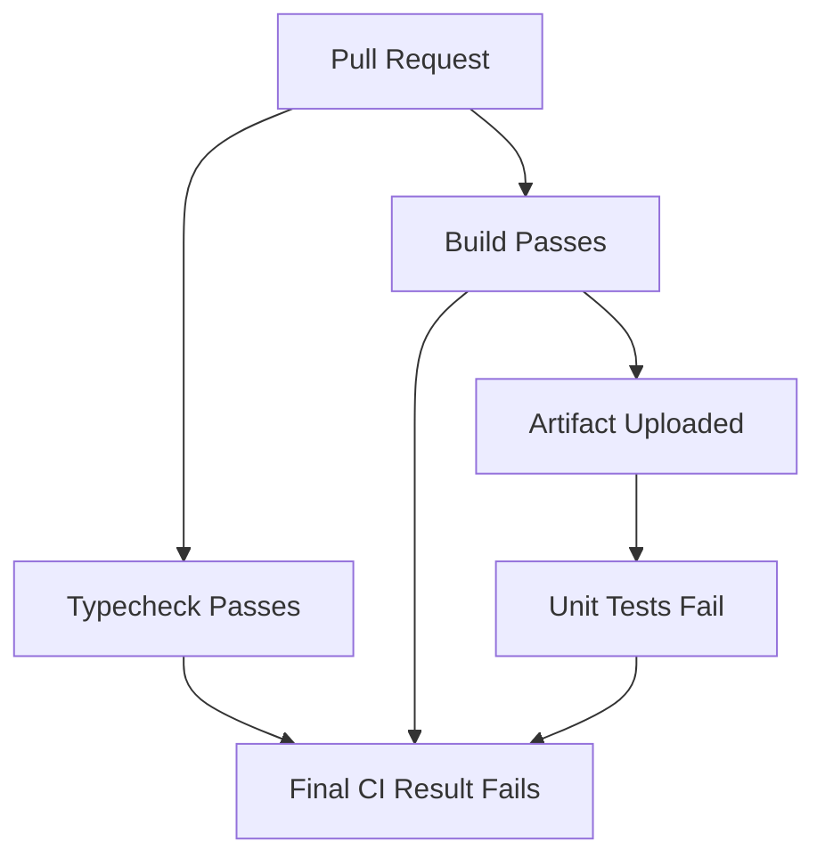
````

### What have we demonstrated?

That build success and test success are separate forms of evidence.

The source can compile correctly while violating a test expectation.

This is why pipeline stages must be interpreted according to what they actually validate.

---

# 33. Experiment 3 — Understand Artifact Dependencies

Now restore the correct test:

```
assert.equal(calculateTotal(100, 0.18), 118);
```

Commit the correction.

Next, temporarily remove this step from the build job:

```
- name: Upload compiled artifact
  uses: actions/upload-artifact@v4
  with:
    name: compiled-application
    path: dist/
    if-no-files-found: error
```

Keep the test job's artifact download step.

What should happen?

### Expected behavior

The build job compiles successfully.

But no workflow artifact named `compiled-application` is uploaded.

The unit-test job begins after the build succeeds.

It attempts to download the artifact.

The download step fails because the required artifact is unavailable.

### What does this prove?

**Job ordering does not imply filesystem sharing.**

```
needs: build
```

Means:

```
Wait for the required build job outcome.
```

It does not mean:

```
Automatically copy every file produced by build.
```

That distinction is fundamental to distributed execution.

After the experiment, restore the upload step.

---

# 34. Experiment 4 — Optimize the Architecture

Now consider these two designs.

## Design A: Sequential

````
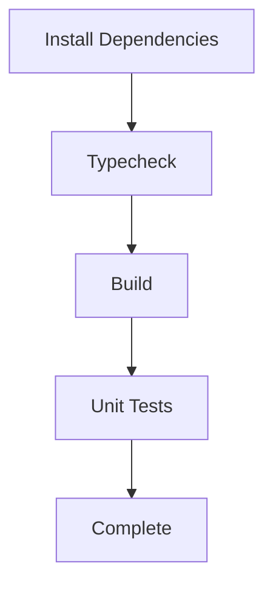
````

## Design B: Parallel with dependencies

#chatgpt-mermaid-_r_aec_{font-family:-apple-system-body,ui-sans-serif,-apple-system,system-ui,"Segoe UI","Helvetica","Apple Color Emoji","Arial",sans-serif,"Segoe UI Emoji","Segoe UI Symbol";font-size:16px;fill:rgb(237, 237, 237);}@keyframes edge-animation-frame{from{stroke-dashoffset:0;}}@keyframes dash{to{stroke-dashoffset:0;}}#chatgpt-mermaid-_r_aec_ .edge-animation-slow{stroke-dasharray:9,5!important;stroke-dashoffset:900;animation:dash 50s linear infinite;stroke-linecap:round;}#chatgpt-mermaid-_r_aec_ .edge-animation-fast{stroke-dasharray:9,5!important;stroke-dashoffset:900;animation:dash 20s linear infinite;stroke-linecap:round;}#chatgpt-mermaid-_r_aec_ .error-icon{fill:rgb(48, 48, 48);}#chatgpt-mermaid-_r_aec_ .error-text{fill:rgb(237, 237, 237);stroke:rgb(237, 237, 237);}#chatgpt-mermaid-_r_aec_ .edge-thickness-normal{stroke-width:1px;}#chatgpt-mermaid-_r_aec_ .edge-thickness-thick{stroke-width:3.5px;}#chatgpt-mermaid-_r_aec_ .edge-pattern-solid{stroke-dasharray:0;}#chatgpt-mermaid-_r_aec_ .edge-thickness-invisible{stroke-width:0;fill:none;}#chatgpt-mermaid-_r_aec_ .edge-pattern-dashed{stroke-dasharray:3;}#chatgpt-mermaid-_r_aec_ .edge-pattern-dotted{stroke-dasharray:2;}#chatgpt-mermaid-_r_aec_ .marker{fill:rgb(175, 175, 175);stroke:rgb(175, 175, 175);}#chatgpt-mermaid-_r_aec_ .marker.cross{stroke:rgb(175, 175, 175);}#chatgpt-mermaid-_r_aec_ svg{font-family:-apple-system-body,ui-sans-serif,-apple-system,system-ui,"Segoe UI","Helvetica","Apple Color Emoji","Arial",sans-serif,"Segoe UI Emoji","Segoe UI Symbol";font-size:16px;}#chatgpt-mermaid-_r_aec_ p{margin:0;}#chatgpt-mermaid-_r_aec_ .label{font-family:-apple-system-body,ui-sans-serif,-apple-system,system-ui,"Segoe UI","Helvetica","Apple Color Emoji","Arial",sans-serif,"Segoe UI Emoji","Segoe UI Symbol";color:rgb(237, 237, 237);}#chatgpt-mermaid-_r_aec_ .cluster-label text{fill:rgb(237, 237, 237);}#chatgpt-mermaid-_r_aec_ .cluster-label span{color:rgb(237, 237, 237);}#chatgpt-mermaid-_r_aec_ .cluster-label span p{background-color:transparent;}#chatgpt-mermaid-_r_aec_ .label text,#chatgpt-mermaid-_r_aec_ span{fill:rgb(237, 237, 237);color:rgb(237, 237, 237);}#chatgpt-mermaid-_r_aec_ .node rect,#chatgpt-mermaid-_r_aec_ .node circle,#chatgpt-mermaid-_r_aec_ .node ellipse,#chatgpt-mermaid-_r_aec_ .node polygon,#chatgpt-mermaid-_r_aec_ .node path{fill:rgb(9, 23, 44);stroke:rgb(31, 78, 148);stroke-width:1px;}#chatgpt-mermaid-_r_aec_ .rough-node .label text,#chatgpt-mermaid-_r_aec_ .node .label text,#chatgpt-mermaid-_r_aec_ .image-shape .label,#chatgpt-mermaid-_r_aec_ .icon-shape .label{text-anchor:middle;}#chatgpt-mermaid-_r_aec_ .node .katex path{fill:#000;stroke:#000;stroke-width:1px;}#chatgpt-mermaid-_r_aec_ .rough-node .label,#chatgpt-mermaid-_r_aec_ .node .label,#chatgpt-mermaid-_r_aec_ .image-shape .label,#chatgpt-mermaid-_r_aec_ .icon-shape .label{text-align:center;}#chatgpt-mermaid-_r_aec_ .node.clickable{cursor:pointer;}#chatgpt-mermaid-_r_aec_ .root .anchor path{fill:rgb(175, 175, 175)!important;stroke-width:0;stroke:rgb(175, 175, 175);}#chatgpt-mermaid-_r_aec_ .arrowheadPath{fill:rgb(175, 175, 175);}#chatgpt-mermaid-_r_aec_ .edgePath .path{stroke:rgb(175, 175, 175);stroke-width:1px;}#chatgpt-mermaid-_r_aec_ .flowchart-link{stroke:rgb(175, 175, 175);fill:none;}#chatgpt-mermaid-_r_aec_ .edgeLabel{background-color:rgb(0, 0, 0);text-align:center;}#chatgpt-mermaid-_r_aec_ .edgeLabel p{background-color:rgb(0, 0, 0);}#chatgpt-mermaid-_r_aec_ .edgeLabel rect{opacity:0.5;background-color:rgb(0, 0, 0);fill:rgb(0, 0, 0);}#chatgpt-mermaid-_r_aec_ .labelBkg{background-color:rgba(0, 0, 0, 0.5);}#chatgpt-mermaid-_r_aec_ .cluster rect{fill:rgb(48, 48, 48);stroke:rgba(255, 255, 255, 0.15);stroke-width:1px;}#chatgpt-mermaid-_r_aec_ .cluster text{fill:rgb(237, 237, 237);}#chatgpt-mermaid-_r_aec_ .cluster span{color:rgb(237, 237, 237);}#chatgpt-mermaid-_r_aec_ div.mermaidTooltip{position:absolute;text-align:center;max-width:200px;padding:2px;font-family:-apple-system-body,ui-sans-serif,-apple-system,system-ui,"Segoe UI","Helvetica","Apple Color Emoji","Arial",sans-serif,"Segoe UI Emoji","Segoe UI Symbol";font-size:12px;background:rgb(48, 48, 48);border:1px solid rgba(255, 255, 255, 0.15);border-radius:2px;pointer-events:none;z-index:100;}#chatgpt-mermaid-_r_aec_ .flowchartTitleText{text-anchor:middle;font-size:18px;fill:rgb(237, 237, 237);}#chatgpt-mermaid-_r_aec_ rect.text{fill:none;stroke-width:0;}#chatgpt-mermaid-_r_aec_ .icon-shape,#chatgpt-mermaid-_r_aec_ .image-shape{background-color:rgb(0, 0, 0);text-align:center;}#chatgpt-mermaid-_r_aec_ .icon-shape p,#chatgpt-mermaid-_r_aec_ .image-shape p{background-color:rgb(0, 0, 0);padding:2px;}#chatgpt-mermaid-_r_aec_ .icon-shape .label rect,#chatgpt-mermaid-_r_aec_ .image-shape .label rect{opacity:0.5;background-color:rgb(0, 0, 0);fill:rgb(0, 0, 0);}#chatgpt-mermaid-_r_aec_ .label-icon{display:inline-block;height:1em;overflow:visible;vertical-align:-0.125em;}#chatgpt-mermaid-_r_aec_ .node .label-icon path{fill:currentColor;stroke:revert;stroke-width:revert;}#chatgpt-mermaid-_r_aec_ .node .neo-node{stroke:rgb(31, 78, 148);}#chatgpt-mermaid-_r_aec_ [data-look="neo"].node rect,#chatgpt-mermaid-_r_aec_ [data-look="neo"].cluster rect,#chatgpt-mermaid-_r_aec_ [data-look="neo"].node polygon{stroke:url(#chatgpt-mermaid-_r_aec_-gradient);filter:drop-shadow( 1px 2px 2px rgba(185,185,185,1));}#chatgpt-mermaid-_r_aec_ [data-look="neo"].swimlane.cluster rect{filter:none;}#chatgpt-mermaid-_r_aec_ [data-look="neo"].node path{stroke:url(#chatgpt-mermaid-_r_aec_-gradient);stroke-width:1px;}#chatgpt-mermaid-_r_aec_ [data-look="neo"].node .outer-path{filter:drop-shadow( 1px 2px 2px rgba(185,185,185,1));}#chatgpt-mermaid-_r_aec_ [data-look="neo"].node .neo-line path{stroke:rgb(31, 78, 148);filter:none;}#chatgpt-mermaid-_r_aec_ [data-look="neo"].node circle{stroke:url(#chatgpt-mermaid-_r_aec_-gradient);filter:drop-shadow( 1px 2px 2px rgba(185,185,185,1));}#chatgpt-mermaid-_r_aec_ [data-look="neo"].node circle .state-start{fill:#000000;}#chatgpt-mermaid-_r_aec_ [data-look="neo"].icon-shape .icon{fill:url(#chatgpt-mermaid-_r_aec_-gradient);filter:drop-shadow( 1px 2px 2px rgba(185,185,185,1));}#chatgpt-mermaid-_r_aec_ [data-look="neo"].icon-shape .icon-neo path{stroke:url(#chatgpt-mermaid-_r_aec_-gradient);filter:drop-shadow( 1px 2px 2px rgba(185,185,185,1));}#chatgpt-mermaid-_r_aec_ .node text{font-size:14px;font-weight:600;letter-spacing:normal;fill:rgb(232, 232, 232);}#chatgpt-mermaid-_r_aec_ .edgeLabels text{font-size:13px;font-weight:600;letter-spacing:-0.08px;fill:rgb(232, 232, 232);}#chatgpt-mermaid-_r_aec_ .node tspan[font-weight="normal"],#chatgpt-mermaid-_r_aec_ .edgeLabels tspan[font-weight="normal"]{font-weight:600;}#chatgpt-mermaid-_r_aec_ .edgeLabel .label rect{opacity:1;rx:13px;ry:13px;fill:rgb(19, 19, 19);stroke:rgb(47, 47, 47);stroke-width:1px;}#chatgpt-mermaid-_r_aec_ .node rect,#chatgpt-mermaid-_r_aec_ .node circle,#chatgpt-mermaid-_r_aec_ .node ellipse,#chatgpt-mermaid-_r_aec_ .node polygon,#chatgpt-mermaid-_r_aec_ .node path{fill:rgb(24, 24, 24);stroke:rgba(255, 255, 255, 0.1);stroke-width:1px;}#chatgpt-mermaid-_r_aec_ .node rect{rx:16px;ry:16px;}#chatgpt-mermaid-_r_aec_ .node.mermaid-decision .label-container{fill:rgb(19, 19, 19);stroke:rgb(47, 47, 47);stroke-dasharray:2px,2px;}#chatgpt-mermaid-_r_aec_ .edgePaths .flowchart-link{stroke:rgb(175, 175, 175);stroke-width:1px;stroke-linecap:round;stroke-linejoin:round;}#chatgpt-mermaid-_r_aec_ .marker{fill:rgb(175, 175, 175);stroke:rgb(175, 175, 175);}#chatgpt-mermaid-_r_aec_ :root{--mermaid-font-family:-apple-system-body,ui-sans-serif,-apple-system,system-ui,"Segoe UI","Helvetica","Apple Color Emoji","Arial",sans-serif,"Segoe UI Emoji","Segoe UI Symbol";}StartTypecheckBuildUnit TestsComplete

### Your task

Inspect the actual execution times in GitHub Actions.

Record:

|Metric|Sequential|Parallel|
|---|---|---|
|Total workflow time|Measure|Measure|
|Type-check time|Measure|Measure|
|Build time|Measure|Measure|
|Test time|Measure|Measure|
|Runner jobs|Count|Count|
|Dependency installations|Count|Count|

For a fair experiment, use the same source revision and comparable runner conditions.

### Think carefully

Did parallel execution reduce total elapsed time?

Did it increase the number of runner environments used?

Did repeated dependency installation add overhead?

Was the speed improvement worth the additional complexity?

Do not assume parallel execution is always better.

**Measure the actual system behavior.**

---

# 35. Measuring CI System Quality

We have designed and implemented a CI system.

But how do we know whether the design is good?

A workflow that produces green checks is not automatically a well-engineered CI system.

We need to evaluate its actual properties.

## 35.1 Feedback latency

**Question:** How long does a developer wait to receive useful validation results?

Possible measurements:

- Time from push to workflow start.
- Time spent waiting for a runner.
- Time until the first useful failure is reported.
- Time until all required checks finish.

A pipeline taking 30 minutes to report a simple formatting error may create unnecessary developer delays.

A well-designed pipeline attempts to identify inexpensive, high-value failures early.

---

## 35.2 Execution reliability

**Question:** Does CI consistently execute the intended validation?

Potential problems include:

- Runner failures.
- Network instability.
- Missing dependencies.
- Unavailable test services.
- Flaky tests.
- Incorrect workflow triggers.
- Misconfigured conditional execution.

A reliable CI system should make these problems visible.

---

## 35.3 Validation effectiveness

**Question:** Do the configured checks detect the kinds of problems that matter?

For example:

```
CI Passed

Production Failed
```

This does not automatically mean CI was incorrectly implemented.

The failure may concern a property CI did not evaluate.

However, repeated escaped defects may indicate that the validation strategy needs improvement.

### Important principle

> CI success is evidence about executed checks, not a universal guarantee of software correctness.

---

## 35.4 Resource efficiency

**Question:** How much compute capacity does CI consume?

Consider:

- Number of jobs.
- Runner startup overhead.
- Repeated dependency installation.
- Cache effectiveness.
- Parallel execution.
- Job duration.
- Unnecessary reruns.

A pipeline with more jobs is not inherently better.

We should justify the complexity using measured benefits.

---

## 35.5 Useful CI metrics

|Metric|What it tells us|
|---|---|
|Workflow duration|Time required to finish a workflow|
|Queue time|Delay before execution begins|
|Time to first useful feedback|How quickly developers learn about a problem|
|p95 workflow duration|Approximate upper-tail execution latency|
|Job failure rate|Frequency of unsuccessful job execution|
|Flaky-test rate|Frequency of inconsistent test outcomes|
|Cache hit rate|How often reusable cached data is available|
|Runner utilization|How effectively execution capacity is used|
|Infrastructure-related failure rate|How often validation is disrupted by execution infrastructure|
|Time to restore green CI|Time needed to restore acceptable integration status|

### Why consider p95?

Suppose most workflows finish quickly, but a significant minority experience long delays.

The average may hide those slow executions.

A percentile such as p95 helps characterize the slower end of the distribution.

You do not need an elaborate observability platform to begin.

For a small project, GitHub Actions execution history and job timings can provide useful initial evidence.

---

# 36. Real-World System-Design Scenario

Imagine your team reports:

> CI takes 25 minutes, and developers are frustrated.

A beginner might immediately suggest:

- Use bigger runners.
- Add more parallel jobs.
- Add caching.
- Buy more compute.

But an engineer should first investigate.

## Step 1: Identify the source of delay

Break down the workflow.

For example:

|Stage|Measured duration|
|---|---|
|Runner scheduling|2 min|
|Dependency installation|5 min|
|Type checking|2 min|
|Unit tests|4 min|
|Integration tests|9 min|
|Build|3 min|

Assume these stages currently execute sequentially.

## Step 2: Identify dependencies

Ask:

- Can type checking run independently?
- Do unit tests need compiled output?
- Do integration tests require a database?
- Can independent checks run concurrently?
- Does the build depend on all tests?
- Do repeated installations consume unnecessary time?

## Step 3: Design a dependency graph

````
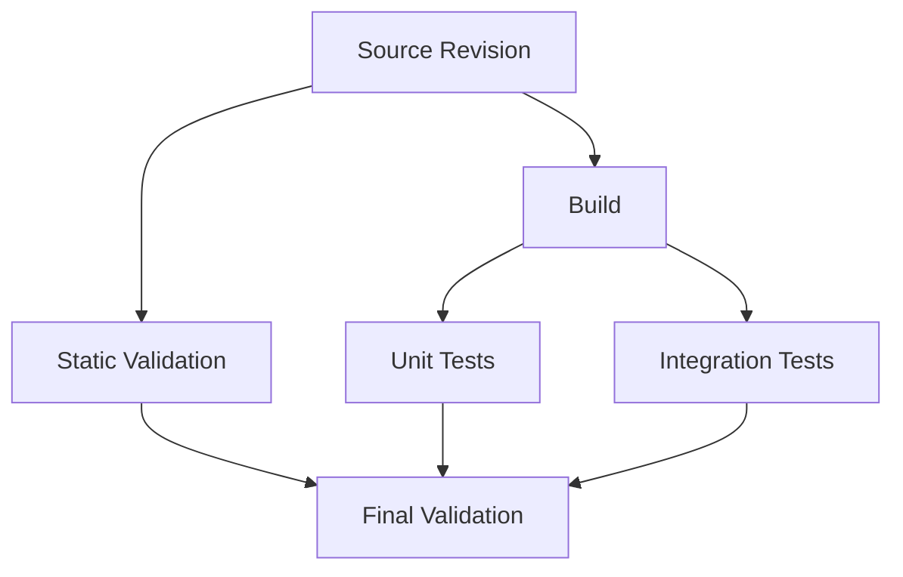
````

Here, the unit and integration tests are assumed to need the build output.

They are independent of each other after that prerequisite is satisfied.

This is a proposed architecture, not an assumption that all real applications have these dependencies.

## Step 4: Evaluate alternative designs

### Option A: Keep one sequential job

Advantages:

- Simplicity.
- Shared workspace.
- Less orchestration overhead.

Disadvantage:

- Longer feedback latency.

### Option B: Divide validation into parallel jobs

Advantages:

- Independent checks can complete concurrently.
- Results are separated.
- Runner resources can be tailored to tasks.

Disadvantages:

- More runner startups.
- Possible duplicated setup work.
- More complex artifact coordination.

### Option C: Optimize existing stages first

Possible improvements:

- Improve dependency caching.
- Remove unnecessary repeated work.
- Optimize slow test setup.
- Reduce unnecessary external dependencies.
- Improve test data initialization.

### How should we decide?

Measure the critical path and identify the largest sources of delay.

Then test the proposed improvement.

Do not optimize based solely on intuition.

---

# 37. A Repeatable Method for Designing Any CI Pipeline

We now need a reusable design framework.

Whenever someone asks you to create CI for an application, follow this process.

## Step 1 — Understand the application

Ask:

- Which programming language is used?
- What runtime does it require?
- How are dependencies installed?
- How is it compiled or packaged?
- What tests exist?
- What external services do tests require?
- What artifact should the build produce?

Do not begin with GitHub Actions syntax.

---

## Step 2 — Define validation requirements

For example:

```
Requirement:
TypeScript code must compile.

Requirement:
Unit tests must pass.

Requirement:
Integration tests must pass.

Requirement:
Build artifact must be produced successfully.
```

Each requirement should correspond to meaningful evidence.

---

## Step 3 — Identify task dependencies

Determine which operations depend on others.

For example:

```
Dependency Installation
          |
          v
Build
          |
          v
Unit Tests Against Compiled Output
```

Identify independent tasks separately.

---

## Step 4 — Draw the dependency graph

Use Mermaid before writing YAML.

#chatgpt-mermaid-_r_af7_{font-family:-apple-system-body,ui-sans-serif,-apple-system,system-ui,"Segoe UI","Helvetica","Apple Color Emoji","Arial",sans-serif,"Segoe UI Emoji","Segoe UI Symbol";font-size:16px;fill:rgb(237, 237, 237);}@keyframes edge-animation-frame{from{stroke-dashoffset:0;}}@keyframes dash{to{stroke-dashoffset:0;}}#chatgpt-mermaid-_r_af7_ .edge-animation-slow{stroke-dasharray:9,5!important;stroke-dashoffset:900;animation:dash 50s linear infinite;stroke-linecap:round;}#chatgpt-mermaid-_r_af7_ .edge-animation-fast{stroke-dasharray:9,5!important;stroke-dashoffset:900;animation:dash 20s linear infinite;stroke-linecap:round;}#chatgpt-mermaid-_r_af7_ .error-icon{fill:rgb(48, 48, 48);}#chatgpt-mermaid-_r_af7_ .error-text{fill:rgb(237, 237, 237);stroke:rgb(237, 237, 237);}#chatgpt-mermaid-_r_af7_ .edge-thickness-normal{stroke-width:1px;}#chatgpt-mermaid-_r_af7_ .edge-thickness-thick{stroke-width:3.5px;}#chatgpt-mermaid-_r_af7_ .edge-pattern-solid{stroke-dasharray:0;}#chatgpt-mermaid-_r_af7_ .edge-thickness-invisible{stroke-width:0;fill:none;}#chatgpt-mermaid-_r_af7_ .edge-pattern-dashed{stroke-dasharray:3;}#chatgpt-mermaid-_r_af7_ .edge-pattern-dotted{stroke-dasharray:2;}#chatgpt-mermaid-_r_af7_ .marker{fill:rgb(175, 175, 175);stroke:rgb(175, 175, 175);}#chatgpt-mermaid-_r_af7_ .marker.cross{stroke:rgb(175, 175, 175);}#chatgpt-mermaid-_r_af7_ svg{font-family:-apple-system-body,ui-sans-serif,-apple-system,system-ui,"Segoe UI","Helvetica","Apple Color Emoji","Arial",sans-serif,"Segoe UI Emoji","Segoe UI Symbol";font-size:16px;}#chatgpt-mermaid-_r_af7_ p{margin:0;}#chatgpt-mermaid-_r_af7_ .label{font-family:-apple-system-body,ui-sans-serif,-apple-system,system-ui,"Segoe UI","Helvetica","Apple Color Emoji","Arial",sans-serif,"Segoe UI Emoji","Segoe UI Symbol";color:rgb(237, 237, 237);}#chatgpt-mermaid-_r_af7_ .cluster-label text{fill:rgb(237, 237, 237);}#chatgpt-mermaid-_r_af7_ .cluster-label span{color:rgb(237, 237, 237);}#chatgpt-mermaid-_r_af7_ .cluster-label span p{background-color:transparent;}#chatgpt-mermaid-_r_af7_ .label text,#chatgpt-mermaid-_r_af7_ span{fill:rgb(237, 237, 237);color:rgb(237, 237, 237);}#chatgpt-mermaid-_r_af7_ .node rect,#chatgpt-mermaid-_r_af7_ .node circle,#chatgpt-mermaid-_r_af7_ .node ellipse,#chatgpt-mermaid-_r_af7_ .node polygon,#chatgpt-mermaid-_r_af7_ .node path{fill:rgb(9, 23, 44);stroke:rgb(31, 78, 148);stroke-width:1px;}#chatgpt-mermaid-_r_af7_ .rough-node .label text,#chatgpt-mermaid-_r_af7_ .node .label text,#chatgpt-mermaid-_r_af7_ .image-shape .label,#chatgpt-mermaid-_r_af7_ .icon-shape .label{text-anchor:middle;}#chatgpt-mermaid-_r_af7_ .node .katex path{fill:#000;stroke:#000;stroke-width:1px;}#chatgpt-mermaid-_r_af7_ .rough-node .label,#chatgpt-mermaid-_r_af7_ .node .label,#chatgpt-mermaid-_r_af7_ .image-shape .label,#chatgpt-mermaid-_r_af7_ .icon-shape .label{text-align:center;}#chatgpt-mermaid-_r_af7_ .node.clickable{cursor:pointer;}#chatgpt-mermaid-_r_af7_ .root .anchor path{fill:rgb(175, 175, 175)!important;stroke-width:0;stroke:rgb(175, 175, 175);}#chatgpt-mermaid-_r_af7_ .arrowheadPath{fill:rgb(175, 175, 175);}#chatgpt-mermaid-_r_af7_ .edgePath .path{stroke:rgb(175, 175, 175);stroke-width:1px;}#chatgpt-mermaid-_r_af7_ .flowchart-link{stroke:rgb(175, 175, 175);fill:none;}#chatgpt-mermaid-_r_af7_ .edgeLabel{background-color:rgb(0, 0, 0);text-align:center;}#chatgpt-mermaid-_r_af7_ .edgeLabel p{background-color:rgb(0, 0, 0);}#chatgpt-mermaid-_r_af7_ .edgeLabel rect{opacity:0.5;background-color:rgb(0, 0, 0);fill:rgb(0, 0, 0);}#chatgpt-mermaid-_r_af7_ .labelBkg{background-color:rgba(0, 0, 0, 0.5);}#chatgpt-mermaid-_r_af7_ .cluster rect{fill:rgb(48, 48, 48);stroke:rgba(255, 255, 255, 0.15);stroke-width:1px;}#chatgpt-mermaid-_r_af7_ .cluster text{fill:rgb(237, 237, 237);}#chatgpt-mermaid-_r_af7_ .cluster span{color:rgb(237, 237, 237);}#chatgpt-mermaid-_r_af7_ div.mermaidTooltip{position:absolute;text-align:center;max-width:200px;padding:2px;font-family:-apple-system-body,ui-sans-serif,-apple-system,system-ui,"Segoe UI","Helvetica","Apple Color Emoji","Arial",sans-serif,"Segoe UI Emoji","Segoe UI Symbol";font-size:12px;background:rgb(48, 48, 48);border:1px solid rgba(255, 255, 255, 0.15);border-radius:2px;pointer-events:none;z-index:100;}#chatgpt-mermaid-_r_af7_ .flowchartTitleText{text-anchor:middle;font-size:18px;fill:rgb(237, 237, 237);}#chatgpt-mermaid-_r_af7_ rect.text{fill:none;stroke-width:0;}#chatgpt-mermaid-_r_af7_ .icon-shape,#chatgpt-mermaid-_r_af7_ .image-shape{background-color:rgb(0, 0, 0);text-align:center;}#chatgpt-mermaid-_r_af7_ .icon-shape p,#chatgpt-mermaid-_r_af7_ .image-shape p{background-color:rgb(0, 0, 0);padding:2px;}#chatgpt-mermaid-_r_af7_ .icon-shape .label rect,#chatgpt-mermaid-_r_af7_ .image-shape .label rect{opacity:0.5;background-color:rgb(0, 0, 0);fill:rgb(0, 0, 0);}#chatgpt-mermaid-_r_af7_ .label-icon{display:inline-block;height:1em;overflow:visible;vertical-align:-0.125em;}#chatgpt-mermaid-_r_af7_ .node .label-icon path{fill:currentColor;stroke:revert;stroke-width:revert;}#chatgpt-mermaid-_r_af7_ .node .neo-node{stroke:rgb(31, 78, 148);}#chatgpt-mermaid-_r_af7_ [data-look="neo"].node rect,#chatgpt-mermaid-_r_af7_ [data-look="neo"].cluster rect,#chatgpt-mermaid-_r_af7_ [data-look="neo"].node polygon{stroke:url(#chatgpt-mermaid-_r_af7_-gradient);filter:drop-shadow( 1px 2px 2px rgba(185,185,185,1));}#chatgpt-mermaid-_r_af7_ [data-look="neo"].swimlane.cluster rect{filter:none;}#chatgpt-mermaid-_r_af7_ [data-look="neo"].node path{stroke:url(#chatgpt-mermaid-_r_af7_-gradient);stroke-width:1px;}#chatgpt-mermaid-_r_af7_ [data-look="neo"].node .outer-path{filter:drop-shadow( 1px 2px 2px rgba(185,185,185,1));}#chatgpt-mermaid-_r_af7_ [data-look="neo"].node .neo-line path{stroke:rgb(31, 78, 148);filter:none;}#chatgpt-mermaid-_r_af7_ [data-look="neo"].node circle{stroke:url(#chatgpt-mermaid-_r_af7_-gradient);filter:drop-shadow( 1px 2px 2px rgba(185,185,185,1));}#chatgpt-mermaid-_r_af7_ [data-look="neo"].node circle .state-start{fill:#000000;}#chatgpt-mermaid-_r_af7_ [data-look="neo"].icon-shape .icon{fill:url(#chatgpt-mermaid-_r_af7_-gradient);filter:drop-shadow( 1px 2px 2px rgba(185,185,185,1));}#chatgpt-mermaid-_r_af7_ [data-look="neo"].icon-shape .icon-neo path{stroke:url(#chatgpt-mermaid-_r_af7_-gradient);filter:drop-shadow( 1px 2px 2px rgba(185,185,185,1));}#chatgpt-mermaid-_r_af7_ .node text{font-size:14px;font-weight:600;letter-spacing:normal;fill:rgb(232, 232, 232);}#chatgpt-mermaid-_r_af7_ .edgeLabels text{font-size:13px;font-weight:600;letter-spacing:-0.08px;fill:rgb(232, 232, 232);}#chatgpt-mermaid-_r_af7_ .node tspan[font-weight="normal"],#chatgpt-mermaid-_r_af7_ .edgeLabels tspan[font-weight="normal"]{font-weight:600;}#chatgpt-mermaid-_r_af7_ .edgeLabel .label rect{opacity:1;rx:13px;ry:13px;fill:rgb(19, 19, 19);stroke:rgb(47, 47, 47);stroke-width:1px;}#chatgpt-mermaid-_r_af7_ .node rect,#chatgpt-mermaid-_r_af7_ .node circle,#chatgpt-mermaid-_r_af7_ .node ellipse,#chatgpt-mermaid-_r_af7_ .node polygon,#chatgpt-mermaid-_r_af7_ .node path{fill:rgb(24, 24, 24);stroke:rgba(255, 255, 255, 0.1);stroke-width:1px;}#chatgpt-mermaid-_r_af7_ .node rect{rx:16px;ry:16px;}#chatgpt-mermaid-_r_af7_ .node.mermaid-decision .label-container{fill:rgb(19, 19, 19);stroke:rgb(47, 47, 47);stroke-dasharray:2px,2px;}#chatgpt-mermaid-_r_af7_ .edgePaths .flowchart-link{stroke:rgb(175, 175, 175);stroke-width:1px;stroke-linecap:round;stroke-linejoin:round;}#chatgpt-mermaid-_r_af7_ .marker{fill:rgb(175, 175, 175);stroke:rgb(175, 175, 175);}#chatgpt-mermaid-_r_af7_ :root{--mermaid-font-family:-apple-system-body,ui-sans-serif,-apple-system,system-ui,"Segoe UI","Helvetica","Apple Color Emoji","Arial",sans-serif,"Segoe UI Emoji","Segoe UI Symbol";}Source RevisionStatic ChecksBuildUnit TestsIntegration TestsRequired Validation Result

Every dependency edge should have a reason.

---

## Step 5 — Choose execution boundaries

Ask:

- Which tasks should share one job?
- Which tasks benefit from independent runners?
- Which tasks should execute in parallel?
- Which tasks require specialized environments?
- Which outputs must be transferred between jobs?

This determines the job structure.

---

## Step 6 — Design the data contracts

For each job, define:

```
Inputs:

Execution environment:

Required dependencies:

Operations:

Outputs:

Failure conditions:
```

Example:

**Build job**

```
Inputs:
Source revision and dependency lockfile

Execution environment:
Node.js 22 on Linux

Required dependencies:
None from other CI jobs

Operations:
Install dependencies and compile application

Output:
Compiled JavaScript artifact

Failure conditions:
Dependency installation or compilation fails
```

This is a clear engineering contract.

---

## Step 7 — Define failure policies

Ask:

- Which checks are mandatory?
- Which checks are informational?
- What happens when a required job fails?
- Should independent jobs continue?
- What should happen when a runner fails?
- Should retries be permitted?
- How will the developer receive feedback?

Do not hide failures with unconditional success behavior.

---

## Step 8 — Define permissions

Ask:

- Does the workflow need source read access?
- Does it need repository write access?
- Does it need to publish artifacts?
- Does it need cloud credentials?
- Will it execute untrusted contributions?

Grant only the permissions required by the job's responsibility.

---

## Step 9 — Implement using official documentation

Now translate the design into GitHub Actions.

Find the relevant configuration options:

```
Event          -> on

Jobs           -> jobs

Runner         -> runs-on

Dependencies   -> needs

Steps          -> steps

Reusable Task  -> uses

Shell Command  -> run

Conditions     -> if

Matrix         -> strategy.matrix

Permissions    -> permissions

Concurrency    -> concurrency
```

You now understand _why_ each configuration element exists.

That makes learning the syntax much easier.

---

## Step 10 — Validate with experiments

Intentionally introduce controlled failures.

Test:

- Type-checking failure.
- Unit-test failure.
- Build failure.
- Missing artifact.
- Missing lockfile.
- Runner or service unavailability.
- Incorrect job dependency.

Observe how the pipeline behaves.

Finally, measure its execution performance.

### The complete engineering process

#chatgpt-mermaid-_r_ag2_{font-family:-apple-system-body,ui-sans-serif,-apple-system,system-ui,"Segoe UI","Helvetica","Apple Color Emoji","Arial",sans-serif,"Segoe UI Emoji","Segoe UI Symbol";font-size:16px;fill:rgb(237, 237, 237);}@keyframes edge-animation-frame{from{stroke-dashoffset:0;}}@keyframes dash{to{stroke-dashoffset:0;}}#chatgpt-mermaid-_r_ag2_ .edge-animation-slow{stroke-dasharray:9,5!important;stroke-dashoffset:900;animation:dash 50s linear infinite;stroke-linecap:round;}#chatgpt-mermaid-_r_ag2_ .edge-animation-fast{stroke-dasharray:9,5!important;stroke-dashoffset:900;animation:dash 20s linear infinite;stroke-linecap:round;}#chatgpt-mermaid-_r_ag2_ .error-icon{fill:rgb(48, 48, 48);}#chatgpt-mermaid-_r_ag2_ .error-text{fill:rgb(237, 237, 237);stroke:rgb(237, 237, 237);}#chatgpt-mermaid-_r_ag2_ .edge-thickness-normal{stroke-width:1px;}#chatgpt-mermaid-_r_ag2_ .edge-thickness-thick{stroke-width:3.5px;}#chatgpt-mermaid-_r_ag2_ .edge-pattern-solid{stroke-dasharray:0;}#chatgpt-mermaid-_r_ag2_ .edge-thickness-invisible{stroke-width:0;fill:none;}#chatgpt-mermaid-_r_ag2_ .edge-pattern-dashed{stroke-dasharray:3;}#chatgpt-mermaid-_r_ag2_ .edge-pattern-dotted{stroke-dasharray:2;}#chatgpt-mermaid-_r_ag2_ .marker{fill:rgb(175, 175, 175);stroke:rgb(175, 175, 175);}#chatgpt-mermaid-_r_ag2_ .marker.cross{stroke:rgb(175, 175, 175);}#chatgpt-mermaid-_r_ag2_ svg{font-family:-apple-system-body,ui-sans-serif,-apple-system,system-ui,"Segoe UI","Helvetica","Apple Color Emoji","Arial",sans-serif,"Segoe UI Emoji","Segoe UI Symbol";font-size:16px;}#chatgpt-mermaid-_r_ag2_ p{margin:0;}#chatgpt-mermaid-_r_ag2_ .label{font-family:-apple-system-body,ui-sans-serif,-apple-system,system-ui,"Segoe UI","Helvetica","Apple Color Emoji","Arial",sans-serif,"Segoe UI Emoji","Segoe UI Symbol";color:rgb(237, 237, 237);}#chatgpt-mermaid-_r_ag2_ .cluster-label text{fill:rgb(237, 237, 237);}#chatgpt-mermaid-_r_ag2_ .cluster-label span{color:rgb(237, 237, 237);}#chatgpt-mermaid-_r_ag2_ .cluster-label span p{background-color:transparent;}#chatgpt-mermaid-_r_ag2_ .label text,#chatgpt-mermaid-_r_ag2_ span{fill:rgb(237, 237, 237);color:rgb(237, 237, 237);}#chatgpt-mermaid-_r_ag2_ .node rect,#chatgpt-mermaid-_r_ag2_ .node circle,#chatgpt-mermaid-_r_ag2_ .node ellipse,#chatgpt-mermaid-_r_ag2_ .node polygon,#chatgpt-mermaid-_r_ag2_ .node path{fill:rgb(9, 23, 44);stroke:rgb(31, 78, 148);stroke-width:1px;}#chatgpt-mermaid-_r_ag2_ .rough-node .label text,#chatgpt-mermaid-_r_ag2_ .node .label text,#chatgpt-mermaid-_r_ag2_ .image-shape .label,#chatgpt-mermaid-_r_ag2_ .icon-shape .label{text-anchor:middle;}#chatgpt-mermaid-_r_ag2_ .node .katex path{fill:#000;stroke:#000;stroke-width:1px;}#chatgpt-mermaid-_r_ag2_ .rough-node .label,#chatgpt-mermaid-_r_ag2_ .node .label,#chatgpt-mermaid-_r_ag2_ .image-shape .label,#chatgpt-mermaid-_r_ag2_ .icon-shape .label{text-align:center;}#chatgpt-mermaid-_r_ag2_ .node.clickable{cursor:pointer;}#chatgpt-mermaid-_r_ag2_ .root .anchor path{fill:rgb(175, 175, 175)!important;stroke-width:0;stroke:rgb(175, 175, 175);}#chatgpt-mermaid-_r_ag2_ .arrowheadPath{fill:rgb(175, 175, 175);}#chatgpt-mermaid-_r_ag2_ .edgePath .path{stroke:rgb(175, 175, 175);stroke-width:1px;}#chatgpt-mermaid-_r_ag2_ .flowchart-link{stroke:rgb(175, 175, 175);fill:none;}#chatgpt-mermaid-_r_ag2_ .edgeLabel{background-color:rgb(0, 0, 0);text-align:center;}#chatgpt-mermaid-_r_ag2_ .edgeLabel p{background-color:rgb(0, 0, 0);}#chatgpt-mermaid-_r_ag2_ .edgeLabel rect{opacity:0.5;background-color:rgb(0, 0, 0);fill:rgb(0, 0, 0);}#chatgpt-mermaid-_r_ag2_ .labelBkg{background-color:rgba(0, 0, 0, 0.5);}#chatgpt-mermaid-_r_ag2_ .cluster rect{fill:rgb(48, 48, 48);stroke:rgba(255, 255, 255, 0.15);stroke-width:1px;}#chatgpt-mermaid-_r_ag2_ .cluster text{fill:rgb(237, 237, 237);}#chatgpt-mermaid-_r_ag2_ .cluster span{color:rgb(237, 237, 237);}#chatgpt-mermaid-_r_ag2_ div.mermaidTooltip{position:absolute;text-align:center;max-width:200px;padding:2px;font-family:-apple-system-body,ui-sans-serif,-apple-system,system-ui,"Segoe UI","Helvetica","Apple Color Emoji","Arial",sans-serif,"Segoe UI Emoji","Segoe UI Symbol";font-size:12px;background:rgb(48, 48, 48);border:1px solid rgba(255, 255, 255, 0.15);border-radius:2px;pointer-events:none;z-index:100;}#chatgpt-mermaid-_r_ag2_ .flowchartTitleText{text-anchor:middle;font-size:18px;fill:rgb(237, 237, 237);}#chatgpt-mermaid-_r_ag2_ rect.text{fill:none;stroke-width:0;}#chatgpt-mermaid-_r_ag2_ .icon-shape,#chatgpt-mermaid-_r_ag2_ .image-shape{background-color:rgb(0, 0, 0);text-align:center;}#chatgpt-mermaid-_r_ag2_ .icon-shape p,#chatgpt-mermaid-_r_ag2_ .image-shape p{background-color:rgb(0, 0, 0);padding:2px;}#chatgpt-mermaid-_r_ag2_ .icon-shape .label rect,#chatgpt-mermaid-_r_ag2_ .image-shape .label rect{opacity:0.5;background-color:rgb(0, 0, 0);fill:rgb(0, 0, 0);}#chatgpt-mermaid-_r_ag2_ .label-icon{display:inline-block;height:1em;overflow:visible;vertical-align:-0.125em;}#chatgpt-mermaid-_r_ag2_ .node .label-icon path{fill:currentColor;stroke:revert;stroke-width:revert;}#chatgpt-mermaid-_r_ag2_ .node .neo-node{stroke:rgb(31, 78, 148);}#chatgpt-mermaid-_r_ag2_ [data-look="neo"].node rect,#chatgpt-mermaid-_r_ag2_ [data-look="neo"].cluster rect,#chatgpt-mermaid-_r_ag2_ [data-look="neo"].node polygon{stroke:url(#chatgpt-mermaid-_r_ag2_-gradient);filter:drop-shadow( 1px 2px 2px rgba(185,185,185,1));}#chatgpt-mermaid-_r_ag2_ [data-look="neo"].swimlane.cluster rect{filter:none;}#chatgpt-mermaid-_r_ag2_ [data-look="neo"].node path{stroke:url(#chatgpt-mermaid-_r_ag2_-gradient);stroke-width:1px;}#chatgpt-mermaid-_r_ag2_ [data-look="neo"].node .outer-path{filter:drop-shadow( 1px 2px 2px rgba(185,185,185,1));}#chatgpt-mermaid-_r_ag2_ [data-look="neo"].node .neo-line path{stroke:rgb(31, 78, 148);filter:none;}#chatgpt-mermaid-_r_ag2_ [data-look="neo"].node circle{stroke:url(#chatgpt-mermaid-_r_ag2_-gradient);filter:drop-shadow( 1px 2px 2px rgba(185,185,185,1));}#chatgpt-mermaid-_r_ag2_ [data-look="neo"].node circle .state-start{fill:#000000;}#chatgpt-mermaid-_r_ag2_ [data-look="neo"].icon-shape .icon{fill:url(#chatgpt-mermaid-_r_ag2_-gradient);filter:drop-shadow( 1px 2px 2px rgba(185,185,185,1));}#chatgpt-mermaid-_r_ag2_ [data-look="neo"].icon-shape .icon-neo path{stroke:url(#chatgpt-mermaid-_r_ag2_-gradient);filter:drop-shadow( 1px 2px 2px rgba(185,185,185,1));}#chatgpt-mermaid-_r_ag2_ .node text{font-size:14px;font-weight:600;letter-spacing:normal;fill:rgb(232, 232, 232);}#chatgpt-mermaid-_r_ag2_ .edgeLabels text{font-size:13px;font-weight:600;letter-spacing:-0.08px;fill:rgb(232, 232, 232);}#chatgpt-mermaid-_r_ag2_ .node tspan[font-weight="normal"],#chatgpt-mermaid-_r_ag2_ .edgeLabels tspan[font-weight="normal"]{font-weight:600;}#chatgpt-mermaid-_r_ag2_ .edgeLabel .label rect{opacity:1;rx:13px;ry:13px;fill:rgb(19, 19, 19);stroke:rgb(47, 47, 47);stroke-width:1px;}#chatgpt-mermaid-_r_ag2_ .node rect,#chatgpt-mermaid-_r_ag2_ .node circle,#chatgpt-mermaid-_r_ag2_ .node ellipse,#chatgpt-mermaid-_r_ag2_ .node polygon,#chatgpt-mermaid-_r_ag2_ .node path{fill:rgb(24, 24, 24);stroke:rgba(255, 255, 255, 0.1);stroke-width:1px;}#chatgpt-mermaid-_r_ag2_ .node rect{rx:16px;ry:16px;}#chatgpt-mermaid-_r_ag2_ .node.mermaid-decision .label-container{fill:rgb(19, 19, 19);stroke:rgb(47, 47, 47);stroke-dasharray:2px,2px;}#chatgpt-mermaid-_r_ag2_ .edgePaths .flowchart-link{stroke:rgb(175, 175, 175);stroke-width:1px;stroke-linecap:round;stroke-linejoin:round;}#chatgpt-mermaid-_r_ag2_ .marker{fill:rgb(175, 175, 175);stroke:rgb(175, 175, 175);}#chatgpt-mermaid-_r_ag2_ :root{--mermaid-font-family:-apple-system-body,ui-sans-serif,-apple-system,system-ui,"Segoe UI","Helvetica","Apple Color Emoji","Arial",sans-serif,"Segoe UI Emoji","Segoe UI Symbol";}Understand ApplicationIdentify ValidationRequirementsDefine Required EvidenceIdentify Task DependenciesDesign Job ArchitectureChoose Runner EnvironmentsDefine Data TransferDefine Failure PoliciesDefine PermissionsImplement WorkflowExecute Failure ExperimentsMeasure CI PerformanceImprove Architecture

This is the method you should apply to real CI/CD projects.

---

# 38. Architecture Exercise — Design CI for a Production-Style Application

Now apply the concepts independently.

## Scenario

Your company maintains:

```
Backend:
Node.js + TypeScript

Database:
PostgreSQL

Containerization:
Docker

Repository:
GitHub

CI Platform:
GitHub Actions

Deployment:
Argo CD + Kubernetes
```

The application has:

- Unit tests.
- Integration tests requiring PostgreSQL.
- TypeScript validation.
- A production Dockerfile.
- Multiple developers contributing daily.

### Business requirements

1. Developers should receive fast feedback.
2. All required tests must pass before integration.
3. A failing integration test must prevent release eligibility.
4. The pipeline should preserve useful test reports.
5. Independent tasks should execute concurrently where beneficial.
6. The system should not require production Kubernetes credentials during pull-request validation.
7. The source revision being tested must be identifiable.
8. The CI system should be reliable and reasonably efficient.

## Your assignment

Design the CI architecture.

### Task A: Identify components

Determine which jobs you need.

Explain the responsibility of each.

### Task B: Draw the dependency graph

Your diagram must include:

```
Source Revision

Type Checking

Build

Unit Tests

PostgreSQL Integration Tests

Validation Results
```

Decide which jobs depend on others.

Do not create dependencies without justification.

### Task C: Design the execution environment

Answer:

1. Which jobs require Node.js?
2. Which jobs require PostgreSQL?
3. Should PostgreSQL run as a service container?
4. Should integration tests share a runner with unit tests?
5. What are the trade-offs?
6. Would self-hosted runners provide a meaningful advantage?

### Task D: Design artifact transfer

Suppose unit tests require compiled JavaScript output.

How will the build job provide that output?

Would you use:

- Cache?
- Job output?
- Workflow artifact?

Explain the choice.

### Task E: Define failure behavior

Assume:

```
Typecheck: Passed

Build: Passed

Unit Tests: Passed

Integration Tests: Failed
```

Should the change be eligible for release?

Which mechanism enforces that decision?

### Task F: Optimize execution

Suppose integration tests take significantly longer than all other checks.

How would you investigate the bottleneck?

Would you:

- Parallelize the tests?
- Change runner capacity?
- Improve database initialization?
- Reduce unnecessary dependencies?
- Modify the pipeline DAG?

Explain what evidence you would collect before choosing.

---

# 39. Memorization — Seven CI Mental Models

Instead of memorizing every YAML key, remember seven relationships.

## Mental Model 1: CI validates source changes

```
Source Revision
      |
      v
Automated Validation
      |
      v
Recorded Evidence
      |
      v
Integration Decision
```

**Remember:** CI produces feedback about a particular revision.

---

## Mental Model 2: GitHub Actions has an execution hierarchy

```
Event
  |
  v
Workflow Run
  |
  v
Job
  |
  v
Runner
  |
  v
Steps
```

Actions provide reusable functionality within steps.

---

## Mental Model 3: Jobs form a dependency graph

```
Independent Tasks
      |
      v
Can Execute Concurrently
```

```
Dependent Tasks
      |
      v
Must Wait for Prerequisites
```

**Remember:** Dependencies should represent real engineering requirements.

---

## Mental Model 4: Jobs are isolated execution boundaries

```
Job A
  |
  v
Runner A

Job B
  |
  v
Runner B
```

**Remember:** A dependency does not automatically transfer files.

---

## Mental Model 5: Cache is not an artifact

```
Cache
  =
Reuse Data for Performance
```

```
Artifact
  =
Preserve or Transfer Job Output
```

```
Job Output
  =
Pass Small Structured Values
```

---

## Mental Model 6: A failed workflow can be a successful detection

```
Application Defect
        |
        v
Required Check Fails
        |
        v
CI Reports Failure
        |
        v
Unsafe Integration Prevented
```

**Remember:** Green is not the objective. Reliable evidence is the objective.

---

## Mental Model 7: CI design is an optimization problem

```
Validation Confidence
        +
Feedback Speed
        +
Execution Reliability
        +
Resource Efficiency
        +
Operational Simplicity
```

These objectives can conflict.

Good engineering involves choosing appropriate trade-offs.

---

# 40. Active Recall Questions

Close your notes and answer these questions without looking.

### Fundamentals

**Q1.** Why can CI be described as an evidence-producing system?

**Q2.** What are the major architectural responsibilities of a CI platform?

**Q3.** Why does the source revision matter when interpreting CI results?

**Q4.** Why does a successful CI run not guarantee production correctness?

### GitHub Actions execution

**Q5.** What is the difference between an event, workflow, job, step, action, and runner?

**Q6.** What does `runs-on` determine?

**Q7.** What does `needs` determine?

**Q8.** Why do separate GitHub-hosted jobs not automatically share generated files?

**Q9.** What is the difference between a GitHub-hosted runner and a self-hosted runner?

### Architecture

**Q10.** What is a CI dependency graph?

**Q11.** When should two jobs execute concurrently?

**Q12.** What is the critical path of a pipeline?

**Q13.** Why doesn't parallelizing every task always improve execution efficiency?

**Q14.** When should a failed job cause dependent jobs to be skipped?

### Artifacts and caching

**Q15.** What is the difference between a cache and a workflow artifact?

**Q16.** Why should CI correctness not depend on cache availability?

**Q17.** When would you use a job output instead of an artifact?

**Q18.** Why does `npm ci` require a lockfile?

### Reliability and security

**Q19.** Why are flaky tests dangerous?

**Q20.** What is the difference between an application failure and a CI infrastructure failure?

**Q21.** Why should pull-request validation use limited permissions?

**Q22.** Why can workflow cancellation be appropriate for pull-request validation but risky for release operations?

**Q23.** How would you measure whether your CI system is improving?

---

# 41. Interview and System-Design Questions

These questions evaluate your ability to reason about real CI systems.

### Question 1

Your GitHub Actions workflow contains five jobs.

One job creates a compiled application.

A dependent job attempts to test the application but cannot find the compiled files.

Why might this happen?

How would you fix it?

### Question 2

A CI workflow takes 20 minutes.

The team wants to reduce it to 10 minutes.

How would you investigate and redesign the pipeline before purchasing larger runners?

### Question 3

What are the trade-offs between:

- One large job.
- Several independent jobs.
- A dependency-based job graph?

### Question 4

What is the difference between `needs` and `strategy.matrix`?

What engineering problems does each solve?

### Question 5

A pull-request workflow passes consistently on one runner but fails intermittently on another.

What possible causes would you investigate?

### Question 6

A team caches its entire `node_modules` directory and assumes that cache restoration guarantees correct dependencies.

What concerns would you raise?

### Question 7

A CI system executes tests but does not prevent pull requests from merging when tests fail.

What architectural responsibility is missing?

### Question 8

You are designing CI for a Node.js application that requires PostgreSQL integration tests.

Would you run PostgreSQL inside the CI execution environment, in a service container, or as an external shared database?

What trade-offs influence the decision?

### Question 9

What happens to downstream jobs when a required dependency fails?

How would you implement a final summary job that still reports the failed dependency?

### Question 10

How would you design CI so that validation workflows cannot directly modify production Kubernetes resources?

### Question 11

A company wants to optimize CI cost.

Would you recommend fewer jobs, more caching, greater parallelism, or self-hosted runners?

What measurements would you require before deciding?

### Question 12

Explain the difference between:

**A successful CI workflow** and **a trustworthy software build**.

Why might artifact provenance, dependency integrity, build reproducibility, and validation coverage matter beyond a green workflow status?

---

# 42. Official Documentation — Learn the Implementation From the Design

We have already used GitHub Actions to implement a small CI system.

Now reinforce the concepts using official documentation.

## 42.1 GitHub Actions workflows

**Documentation:**

[https://docs.github.com/en/actions](https://docs.github.com/en/actions)

Focus on:

- Workflow triggers.
- Workflow runs.
- Jobs.
- Steps.
- Runners.
- Workflow status.

**Your engineering question:**

How does GitHub Actions transform a repository event into scheduled execution?

---

## 42.2 Workflow syntax

**Documentation:**

[https://docs.github.com/en/actions/reference/workflows-and-actions/workflow-syntax](https://docs.github.com/en/actions/reference/workflows-and-actions/workflow-syntax?utm_source=chatgpt.com)

Focus on:

```
on
jobs
runs-on
steps
needs
if
strategy
permissions
concurrency
```

For each field, ask:

**Which architectural responsibility does this configuration implement?**

Do not memorize all the syntax options.

Learn to find the configuration required by your design.

---

## 42.3 Runners

**Documentation:**

[https://docs.github.com/en/actions/concepts/runners](https://docs.github.com/en/actions/concepts/runners?utm_source=chatgpt.com)

Focus on:

- GitHub-hosted runners.
- Self-hosted runners.
- Runner groups.
- Execution environments.
- Runner management responsibilities.

**Your engineering question:**

What execution environment does each CI task actually require?

---

## 42.4 Workflow artifacts

**Documentation:**

[https://docs.github.com/en/actions/concepts/workflows-and-actions/workflow-artifacts](https://docs.github.com/en/actions/concepts/workflows-and-actions/workflow-artifacts)

Focus on:

- Uploading artifacts.
- Downloading artifacts.
- Sharing files between jobs.
- Preserving test output.

**Your engineering question:**

How should a downstream job consume a file created by another job?

---

## 42.5 Dependency caching

**Documentation:**

[https://docs.github.com/en/actions/concepts/workflows-and-actions/dependency-caching](https://docs.github.com/en/actions/concepts/workflows-and-actions/dependency-caching?utm_source=chatgpt.com)

Focus on:

- Cache purpose.
- Cache keys.
- Cache availability.
- Cache security.
- Artifacts versus caching.

**Your engineering question:**

Which intermediate data can be safely reused without making validation correctness depend on cache availability?

---

## 42.6 Matrix jobs

**Documentation:**

[https://docs.github.com/en/actions/how-tos/write-workflows/choose-what-workflows-do/run-job-variations](https://docs.github.com/en/actions/how-tos/write-workflows/choose-what-workflows-do/run-job-variations?utm_source=chatgpt.com)

Focus on:

- Matrix strategies.
- Supported execution variations.
- `fail-fast`.
- `max-parallel`.

**Your engineering question:**

When does executing the same validation under several conditions provide useful additional confidence?

---

## 42.7 Workflow concurrency

**Documentation:**

[https://docs.github.com/en/actions/how-tos/write-workflows/choose-when-workflows-run/control-workflow-concurrency](https://docs.github.com/en/actions/how-tos/write-workflows/choose-when-workflows-run/control-workflow-concurrency)

Focus on:

- Concurrency groups.
- Cancellation.
- Pending jobs.
- Workflow-level versus job-level concurrency.

**Your engineering question:**

Which workflow executions can safely replace older executions, and which must complete independently?

---

# 43. Phase 05 — Engineering Takeaways

|Principle|Engineering meaning|
|---|---|
|**CI is an evidence-producing system**|It evaluates defined properties of specific source revisions.|
|**Validation requirements determine architecture**|Jobs should exist to satisfy concrete engineering needs.|
|**Workflows orchestrate execution**|A workflow defines when and how jobs execute.|
|**Runners provide compute capacity**|They are the environments where validation actually runs.|
|**Jobs form dependency graphs**|Ordering should reflect real prerequisites.|
|**Parallelism is conditional**|Independent tasks can run concurrently when resources permit.|
|**The critical path limits completion time**|Optimize dependencies that determine overall latency.|
|**Job isolation must be respected**|Separate jobs do not automatically share files.|
|**Artifacts transfer outputs**|They preserve generated files needed by downstream jobs.|
|**Caches improve efficiency**|They should not become correctness dependencies.|
|**Job outputs communicate values**|They are useful for passing small pieces of information.|
|**Failure propagation should be intentional**|Dependent work should not run when required prerequisites are unavailable.|
|**Required checks define policy**|Execution results must influence integration decisions.|
|**Reproducibility improves confidence**|Control source, dependencies, runtime, and relevant environment inputs.|
|**Flaky tests weaken feedback**|Inconsistent results reduce trust in CI.|
|**Runner permissions matter**|CI executes code and must operate within appropriate trust boundaries.|
|**CI optimization requires measurement**|Balance latency, resource use, and complexity.|
|**Green workflows are not proof of correctness**|Results only support claims about executed validations.|

---

# 44. Final Understanding

Let's return to our central question.

**How do we design a CI system that produces reliable validation evidence while balancing execution time, cost, and operational complexity?**

We begin with the source revision.

We identify the engineering properties that must be validated.

We translate those properties into executable tasks.

We determine which tasks are independent and which have prerequisites.

We construct a dependency graph.

We choose appropriate execution environments.

We define how jobs communicate their outputs.

We establish failure and completion policies.

We restrict permissions according to job responsibilities.

Then we implement the architecture using GitHub Actions.

Finally, we introduce controlled failures and measure actual performance.

## 44.1 Complete CI engineering model

#chatgpt-mermaid-_r_aij_{font-family:-apple-system-body,ui-sans-serif,-apple-system,system-ui,"Segoe UI","Helvetica","Apple Color Emoji","Arial",sans-serif,"Segoe UI Emoji","Segoe UI Symbol";font-size:16px;fill:rgb(237, 237, 237);}@keyframes edge-animation-frame{from{stroke-dashoffset:0;}}@keyframes dash{to{stroke-dashoffset:0;}}#chatgpt-mermaid-_r_aij_ .edge-animation-slow{stroke-dasharray:9,5!important;stroke-dashoffset:900;animation:dash 50s linear infinite;stroke-linecap:round;}#chatgpt-mermaid-_r_aij_ .edge-animation-fast{stroke-dasharray:9,5!important;stroke-dashoffset:900;animation:dash 20s linear infinite;stroke-linecap:round;}#chatgpt-mermaid-_r_aij_ .error-icon{fill:rgb(48, 48, 48);}#chatgpt-mermaid-_r_aij_ .error-text{fill:rgb(237, 237, 237);stroke:rgb(237, 237, 237);}#chatgpt-mermaid-_r_aij_ .edge-thickness-normal{stroke-width:1px;}#chatgpt-mermaid-_r_aij_ .edge-thickness-thick{stroke-width:3.5px;}#chatgpt-mermaid-_r_aij_ .edge-pattern-solid{stroke-dasharray:0;}#chatgpt-mermaid-_r_aij_ .edge-thickness-invisible{stroke-width:0;fill:none;}#chatgpt-mermaid-_r_aij_ .edge-pattern-dashed{stroke-dasharray:3;}#chatgpt-mermaid-_r_aij_ .edge-pattern-dotted{stroke-dasharray:2;}#chatgpt-mermaid-_r_aij_ .marker{fill:rgb(175, 175, 175);stroke:rgb(175, 175, 175);}#chatgpt-mermaid-_r_aij_ .marker.cross{stroke:rgb(175, 175, 175);}#chatgpt-mermaid-_r_aij_ svg{font-family:-apple-system-body,ui-sans-serif,-apple-system,system-ui,"Segoe UI","Helvetica","Apple Color Emoji","Arial",sans-serif,"Segoe UI Emoji","Segoe UI Symbol";font-size:16px;}#chatgpt-mermaid-_r_aij_ p{margin:0;}#chatgpt-mermaid-_r_aij_ .label{font-family:-apple-system-body,ui-sans-serif,-apple-system,system-ui,"Segoe UI","Helvetica","Apple Color Emoji","Arial",sans-serif,"Segoe UI Emoji","Segoe UI Symbol";color:rgb(237, 237, 237);}#chatgpt-mermaid-_r_aij_ .cluster-label text{fill:rgb(237, 237, 237);}#chatgpt-mermaid-_r_aij_ .cluster-label span{color:rgb(237, 237, 237);}#chatgpt-mermaid-_r_aij_ .cluster-label span p{background-color:transparent;}#chatgpt-mermaid-_r_aij_ .label text,#chatgpt-mermaid-_r_aij_ span{fill:rgb(237, 237, 237);color:rgb(237, 237, 237);}#chatgpt-mermaid-_r_aij_ .node rect,#chatgpt-mermaid-_r_aij_ .node circle,#chatgpt-mermaid-_r_aij_ .node ellipse,#chatgpt-mermaid-_r_aij_ .node polygon,#chatgpt-mermaid-_r_aij_ .node path{fill:rgb(9, 23, 44);stroke:rgb(31, 78, 148);stroke-width:1px;}#chatgpt-mermaid-_r_aij_ .rough-node .label text,#chatgpt-mermaid-_r_aij_ .node .label text,#chatgpt-mermaid-_r_aij_ .image-shape .label,#chatgpt-mermaid-_r_aij_ .icon-shape .label{text-anchor:middle;}#chatgpt-mermaid-_r_aij_ .node .katex path{fill:#000;stroke:#000;stroke-width:1px;}#chatgpt-mermaid-_r_aij_ .rough-node .label,#chatgpt-mermaid-_r_aij_ .node .label,#chatgpt-mermaid-_r_aij_ .image-shape .label,#chatgpt-mermaid-_r_aij_ .icon-shape .label{text-align:center;}#chatgpt-mermaid-_r_aij_ .node.clickable{cursor:pointer;}#chatgpt-mermaid-_r_aij_ .root .anchor path{fill:rgb(175, 175, 175)!important;stroke-width:0;stroke:rgb(175, 175, 175);}#chatgpt-mermaid-_r_aij_ .arrowheadPath{fill:rgb(175, 175, 175);}#chatgpt-mermaid-_r_aij_ .edgePath .path{stroke:rgb(175, 175, 175);stroke-width:1px;}#chatgpt-mermaid-_r_aij_ .flowchart-link{stroke:rgb(175, 175, 175);fill:none;}#chatgpt-mermaid-_r_aij_ .edgeLabel{background-color:rgb(0, 0, 0);text-align:center;}#chatgpt-mermaid-_r_aij_ .edgeLabel p{background-color:rgb(0, 0, 0);}#chatgpt-mermaid-_r_aij_ .edgeLabel rect{opacity:0.5;background-color:rgb(0, 0, 0);fill:rgb(0, 0, 0);}#chatgpt-mermaid-_r_aij_ .labelBkg{background-color:rgba(0, 0, 0, 0.5);}#chatgpt-mermaid-_r_aij_ .cluster rect{fill:rgb(48, 48, 48);stroke:rgba(255, 255, 255, 0.15);stroke-width:1px;}#chatgpt-mermaid-_r_aij_ .cluster text{fill:rgb(237, 237, 237);}#chatgpt-mermaid-_r_aij_ .cluster span{color:rgb(237, 237, 237);}#chatgpt-mermaid-_r_aij_ div.mermaidTooltip{position:absolute;text-align:center;max-width:200px;padding:2px;font-family:-apple-system-body,ui-sans-serif,-apple-system,system-ui,"Segoe UI","Helvetica","Apple Color Emoji","Arial",sans-serif,"Segoe UI Emoji","Segoe UI Symbol";font-size:12px;background:rgb(48, 48, 48);border:1px solid rgba(255, 255, 255, 0.15);border-radius:2px;pointer-events:none;z-index:100;}#chatgpt-mermaid-_r_aij_ .flowchartTitleText{text-anchor:middle;font-size:18px;fill:rgb(237, 237, 237);}#chatgpt-mermaid-_r_aij_ rect.text{fill:none;stroke-width:0;}#chatgpt-mermaid-_r_aij_ .icon-shape,#chatgpt-mermaid-_r_aij_ .image-shape{background-color:rgb(0, 0, 0);text-align:center;}#chatgpt-mermaid-_r_aij_ .icon-shape p,#chatgpt-mermaid-_r_aij_ .image-shape p{background-color:rgb(0, 0, 0);padding:2px;}#chatgpt-mermaid-_r_aij_ .icon-shape .label rect,#chatgpt-mermaid-_r_aij_ .image-shape .label rect{opacity:0.5;background-color:rgb(0, 0, 0);fill:rgb(0, 0, 0);}#chatgpt-mermaid-_r_aij_ .label-icon{display:inline-block;height:1em;overflow:visible;vertical-align:-0.125em;}#chatgpt-mermaid-_r_aij_ .node .label-icon path{fill:currentColor;stroke:revert;stroke-width:revert;}#chatgpt-mermaid-_r_aij_ .node .neo-node{stroke:rgb(31, 78, 148);}#chatgpt-mermaid-_r_aij_ [data-look="neo"].node rect,#chatgpt-mermaid-_r_aij_ [data-look="neo"].cluster rect,#chatgpt-mermaid-_r_aij_ [data-look="neo"].node polygon{stroke:url(#chatgpt-mermaid-_r_aij_-gradient);filter:drop-shadow( 1px 2px 2px rgba(185,185,185,1));}#chatgpt-mermaid-_r_aij_ [data-look="neo"].swimlane.cluster rect{filter:none;}#chatgpt-mermaid-_r_aij_ [data-look="neo"].node path{stroke:url(#chatgpt-mermaid-_r_aij_-gradient);stroke-width:1px;}#chatgpt-mermaid-_r_aij_ [data-look="neo"].node .outer-path{filter:drop-shadow( 1px 2px 2px rgba(185,185,185,1));}#chatgpt-mermaid-_r_aij_ [data-look="neo"].node .neo-line path{stroke:rgb(31, 78, 148);filter:none;}#chatgpt-mermaid-_r_aij_ [data-look="neo"].node circle{stroke:url(#chatgpt-mermaid-_r_aij_-gradient);filter:drop-shadow( 1px 2px 2px rgba(185,185,185,1));}#chatgpt-mermaid-_r_aij_ [data-look="neo"].node circle .state-start{fill:#000000;}#chatgpt-mermaid-_r_aij_ [data-look="neo"].icon-shape .icon{fill:url(#chatgpt-mermaid-_r_aij_-gradient);filter:drop-shadow( 1px 2px 2px rgba(185,185,185,1));}#chatgpt-mermaid-_r_aij_ [data-look="neo"].icon-shape .icon-neo path{stroke:url(#chatgpt-mermaid-_r_aij_-gradient);filter:drop-shadow( 1px 2px 2px rgba(185,185,185,1));}#chatgpt-mermaid-_r_aij_ .node text{font-size:14px;font-weight:600;letter-spacing:normal;fill:rgb(232, 232, 232);}#chatgpt-mermaid-_r_aij_ .edgeLabels text{font-size:13px;font-weight:600;letter-spacing:-0.08px;fill:rgb(232, 232, 232);}#chatgpt-mermaid-_r_aij_ .node tspan[font-weight="normal"],#chatgpt-mermaid-_r_aij_ .edgeLabels tspan[font-weight="normal"]{font-weight:600;}#chatgpt-mermaid-_r_aij_ .edgeLabel .label rect{opacity:1;rx:13px;ry:13px;fill:rgb(19, 19, 19);stroke:rgb(47, 47, 47);stroke-width:1px;}#chatgpt-mermaid-_r_aij_ .node rect,#chatgpt-mermaid-_r_aij_ .node circle,#chatgpt-mermaid-_r_aij_ .node ellipse,#chatgpt-mermaid-_r_aij_ .node polygon,#chatgpt-mermaid-_r_aij_ .node path{fill:rgb(24, 24, 24);stroke:rgba(255, 255, 255, 0.1);stroke-width:1px;}#chatgpt-mermaid-_r_aij_ .node rect{rx:16px;ry:16px;}#chatgpt-mermaid-_r_aij_ .node.mermaid-decision .label-container{fill:rgb(19, 19, 19);stroke:rgb(47, 47, 47);stroke-dasharray:2px,2px;}#chatgpt-mermaid-_r_aij_ .edgePaths .flowchart-link{stroke:rgb(175, 175, 175);stroke-width:1px;stroke-linecap:round;stroke-linejoin:round;}#chatgpt-mermaid-_r_aij_ .marker{fill:rgb(175, 175, 175);stroke:rgb(175, 175, 175);}#chatgpt-mermaid-_r_aij_ :root{--mermaid-font-family:-apple-system-body,ui-sans-serif,-apple-system,system-ui,"Segoe UI","Helvetica","Apple Color Emoji","Arial",sans-serif,"Segoe UI Emoji","Segoe UI Symbol";}Source RevisionValidation RequirementsCI Workflow DesignDependency GraphRunner AllocationJob ExecutionValidation EvidenceRequired Check EvaluationRequirements Satisfied?Change Eligible for IntegrationFailure FeedbackDeveloper CorrectionYesNo

This is the complete conceptual model of Continuous Integration execution.

### Notice the relationships

A Git commit identifies the source revision.

A repository event can trigger a workflow.

The workflow defines jobs.

The dependency graph controls execution order.

Runners execute the jobs.

Artifacts transfer generated files where necessary.

Caches optimize repeated work.

Validation results provide evidence.

Repository policies can use that evidence to control integration.

Developers use failure feedback to correct problems.

Every component solves a specific part of the engineering problem.

---

## 44.2 Connect Phase 05 to the whole DevOps architecture

Remember our complete delivery system from Phase 03.

#chatgpt-mermaid-_r_ais_{font-family:-apple-system-body,ui-sans-serif,-apple-system,system-ui,"Segoe UI","Helvetica","Apple Color Emoji","Arial",sans-serif,"Segoe UI Emoji","Segoe UI Symbol";font-size:16px;fill:rgb(237, 237, 237);}@keyframes edge-animation-frame{from{stroke-dashoffset:0;}}@keyframes dash{to{stroke-dashoffset:0;}}#chatgpt-mermaid-_r_ais_ .edge-animation-slow{stroke-dasharray:9,5!important;stroke-dashoffset:900;animation:dash 50s linear infinite;stroke-linecap:round;}#chatgpt-mermaid-_r_ais_ .edge-animation-fast{stroke-dasharray:9,5!important;stroke-dashoffset:900;animation:dash 20s linear infinite;stroke-linecap:round;}#chatgpt-mermaid-_r_ais_ .error-icon{fill:rgb(48, 48, 48);}#chatgpt-mermaid-_r_ais_ .error-text{fill:rgb(237, 237, 237);stroke:rgb(237, 237, 237);}#chatgpt-mermaid-_r_ais_ .edge-thickness-normal{stroke-width:1px;}#chatgpt-mermaid-_r_ais_ .edge-thickness-thick{stroke-width:3.5px;}#chatgpt-mermaid-_r_ais_ .edge-pattern-solid{stroke-dasharray:0;}#chatgpt-mermaid-_r_ais_ .edge-thickness-invisible{stroke-width:0;fill:none;}#chatgpt-mermaid-_r_ais_ .edge-pattern-dashed{stroke-dasharray:3;}#chatgpt-mermaid-_r_ais_ .edge-pattern-dotted{stroke-dasharray:2;}#chatgpt-mermaid-_r_ais_ .marker{fill:rgb(175, 175, 175);stroke:rgb(175, 175, 175);}#chatgpt-mermaid-_r_ais_ .marker.cross{stroke:rgb(175, 175, 175);}#chatgpt-mermaid-_r_ais_ svg{font-family:-apple-system-body,ui-sans-serif,-apple-system,system-ui,"Segoe UI","Helvetica","Apple Color Emoji","Arial",sans-serif,"Segoe UI Emoji","Segoe UI Symbol";font-size:16px;}#chatgpt-mermaid-_r_ais_ p{margin:0;}#chatgpt-mermaid-_r_ais_ .label{font-family:-apple-system-body,ui-sans-serif,-apple-system,system-ui,"Segoe UI","Helvetica","Apple Color Emoji","Arial",sans-serif,"Segoe UI Emoji","Segoe UI Symbol";color:rgb(237, 237, 237);}#chatgpt-mermaid-_r_ais_ .cluster-label text{fill:rgb(237, 237, 237);}#chatgpt-mermaid-_r_ais_ .cluster-label span{color:rgb(237, 237, 237);}#chatgpt-mermaid-_r_ais_ .cluster-label span p{background-color:transparent;}#chatgpt-mermaid-_r_ais_ .label text,#chatgpt-mermaid-_r_ais_ span{fill:rgb(237, 237, 237);color:rgb(237, 237, 237);}#chatgpt-mermaid-_r_ais_ .node rect,#chatgpt-mermaid-_r_ais_ .node circle,#chatgpt-mermaid-_r_ais_ .node ellipse,#chatgpt-mermaid-_r_ais_ .node polygon,#chatgpt-mermaid-_r_ais_ .node path{fill:rgb(9, 23, 44);stroke:rgb(31, 78, 148);stroke-width:1px;}#chatgpt-mermaid-_r_ais_ .rough-node .label text,#chatgpt-mermaid-_r_ais_ .node .label text,#chatgpt-mermaid-_r_ais_ .image-shape .label,#chatgpt-mermaid-_r_ais_ .icon-shape .label{text-anchor:middle;}#chatgpt-mermaid-_r_ais_ .node .katex path{fill:#000;stroke:#000;stroke-width:1px;}#chatgpt-mermaid-_r_ais_ .rough-node .label,#chatgpt-mermaid-_r_ais_ .node .label,#chatgpt-mermaid-_r_ais_ .image-shape .label,#chatgpt-mermaid-_r_ais_ .icon-shape .label{text-align:center;}#chatgpt-mermaid-_r_ais_ .node.clickable{cursor:pointer;}#chatgpt-mermaid-_r_ais_ .root .anchor path{fill:rgb(175, 175, 175)!important;stroke-width:0;stroke:rgb(175, 175, 175);}#chatgpt-mermaid-_r_ais_ .arrowheadPath{fill:rgb(175, 175, 175);}#chatgpt-mermaid-_r_ais_ .edgePath .path{stroke:rgb(175, 175, 175);stroke-width:1px;}#chatgpt-mermaid-_r_ais_ .flowchart-link{stroke:rgb(175, 175, 175);fill:none;}#chatgpt-mermaid-_r_ais_ .edgeLabel{background-color:rgb(0, 0, 0);text-align:center;}#chatgpt-mermaid-_r_ais_ .edgeLabel p{background-color:rgb(0, 0, 0);}#chatgpt-mermaid-_r_ais_ .edgeLabel rect{opacity:0.5;background-color:rgb(0, 0, 0);fill:rgb(0, 0, 0);}#chatgpt-mermaid-_r_ais_ .labelBkg{background-color:rgba(0, 0, 0, 0.5);}#chatgpt-mermaid-_r_ais_ .cluster rect{fill:rgb(48, 48, 48);stroke:rgba(255, 255, 255, 0.15);stroke-width:1px;}#chatgpt-mermaid-_r_ais_ .cluster text{fill:rgb(237, 237, 237);}#chatgpt-mermaid-_r_ais_ .cluster span{color:rgb(237, 237, 237);}#chatgpt-mermaid-_r_ais_ div.mermaidTooltip{position:absolute;text-align:center;max-width:200px;padding:2px;font-family:-apple-system-body,ui-sans-serif,-apple-system,system-ui,"Segoe UI","Helvetica","Apple Color Emoji","Arial",sans-serif,"Segoe UI Emoji","Segoe UI Symbol";font-size:12px;background:rgb(48, 48, 48);border:1px solid rgba(255, 255, 255, 0.15);border-radius:2px;pointer-events:none;z-index:100;}#chatgpt-mermaid-_r_ais_ .flowchartTitleText{text-anchor:middle;font-size:18px;fill:rgb(237, 237, 237);}#chatgpt-mermaid-_r_ais_ rect.text{fill:none;stroke-width:0;}#chatgpt-mermaid-_r_ais_ .icon-shape,#chatgpt-mermaid-_r_ais_ .image-shape{background-color:rgb(0, 0, 0);text-align:center;}#chatgpt-mermaid-_r_ais_ .icon-shape p,#chatgpt-mermaid-_r_ais_ .image-shape p{background-color:rgb(0, 0, 0);padding:2px;}#chatgpt-mermaid-_r_ais_ .icon-shape .label rect,#chatgpt-mermaid-_r_ais_ .image-shape .label rect{opacity:0.5;background-color:rgb(0, 0, 0);fill:rgb(0, 0, 0);}#chatgpt-mermaid-_r_ais_ .label-icon{display:inline-block;height:1em;overflow:visible;vertical-align:-0.125em;}#chatgpt-mermaid-_r_ais_ .node .label-icon path{fill:currentColor;stroke:revert;stroke-width:revert;}#chatgpt-mermaid-_r_ais_ .node .neo-node{stroke:rgb(31, 78, 148);}#chatgpt-mermaid-_r_ais_ [data-look="neo"].node rect,#chatgpt-mermaid-_r_ais_ [data-look="neo"].cluster rect,#chatgpt-mermaid-_r_ais_ [data-look="neo"].node polygon{stroke:url(#chatgpt-mermaid-_r_ais_-gradient);filter:drop-shadow( 1px 2px 2px rgba(185,185,185,1));}#chatgpt-mermaid-_r_ais_ [data-look="neo"].swimlane.cluster rect{filter:none;}#chatgpt-mermaid-_r_ais_ [data-look="neo"].node path{stroke:url(#chatgpt-mermaid-_r_ais_-gradient);stroke-width:1px;}#chatgpt-mermaid-_r_ais_ [data-look="neo"].node .outer-path{filter:drop-shadow( 1px 2px 2px rgba(185,185,185,1));}#chatgpt-mermaid-_r_ais_ [data-look="neo"].node .neo-line path{stroke:rgb(31, 78, 148);filter:none;}#chatgpt-mermaid-_r_ais_ [data-look="neo"].node circle{stroke:url(#chatgpt-mermaid-_r_ais_-gradient);filter:drop-shadow( 1px 2px 2px rgba(185,185,185,1));}#chatgpt-mermaid-_r_ais_ [data-look="neo"].node circle .state-start{fill:#000000;}#chatgpt-mermaid-_r_ais_ [data-look="neo"].icon-shape .icon{fill:url(#chatgpt-mermaid-_r_ais_-gradient);filter:drop-shadow( 1px 2px 2px rgba(185,185,185,1));}#chatgpt-mermaid-_r_ais_ [data-look="neo"].icon-shape .icon-neo path{stroke:url(#chatgpt-mermaid-_r_ais_-gradient);filter:drop-shadow( 1px 2px 2px rgba(185,185,185,1));}#chatgpt-mermaid-_r_ais_ .node text{font-size:14px;font-weight:600;letter-spacing:normal;fill:rgb(232, 232, 232);}#chatgpt-mermaid-_r_ais_ .edgeLabels text{font-size:13px;font-weight:600;letter-spacing:-0.08px;fill:rgb(232, 232, 232);}#chatgpt-mermaid-_r_ais_ .node tspan[font-weight="normal"],#chatgpt-mermaid-_r_ais_ .edgeLabels tspan[font-weight="normal"]{font-weight:600;}#chatgpt-mermaid-_r_ais_ .edgeLabel .label rect{opacity:1;rx:13px;ry:13px;fill:rgb(19, 19, 19);stroke:rgb(47, 47, 47);stroke-width:1px;}#chatgpt-mermaid-_r_ais_ .node rect,#chatgpt-mermaid-_r_ais_ .node circle,#chatgpt-mermaid-_r_ais_ .node ellipse,#chatgpt-mermaid-_r_ais_ .node polygon,#chatgpt-mermaid-_r_ais_ .node path{fill:rgb(24, 24, 24);stroke:rgba(255, 255, 255, 0.1);stroke-width:1px;}#chatgpt-mermaid-_r_ais_ .node rect{rx:16px;ry:16px;}#chatgpt-mermaid-_r_ais_ .node.mermaid-decision .label-container{fill:rgb(19, 19, 19);stroke:rgb(47, 47, 47);stroke-dasharray:2px,2px;}#chatgpt-mermaid-_r_ais_ .edgePaths .flowchart-link{stroke:rgb(175, 175, 175);stroke-width:1px;stroke-linecap:round;stroke-linejoin:round;}#chatgpt-mermaid-_r_ais_ .marker{fill:rgb(175, 175, 175);stroke:rgb(175, 175, 175);}#chatgpt-mermaid-_r_ais_ :root{--mermaid-font-family:-apple-system-body,ui-sans-serif,-apple-system,system-ui,"Segoe UI","Helvetica","Apple Color Emoji","Arial",sans-serif,"Segoe UI Emoji","Segoe UI Symbol";}DeveloperApplication Git RepositoryCI TriggerGitHub Actions WorkflowRunner ExecutionValidation ResultsApproved Source RevisionRelease EngineeringImmutable Container ArtifactContainer RegistryGitOps RepositoryArgo CDKubernetesRunning ApplicationOperational Feedback

This is a logical architecture, not a claim that a registry directly edits GitOps configuration. Authorized release automation proposes the GitOps update, and Kubernetes retrieves the referenced image when required.

**Phase 05 concentrated on the internal architecture of the CI portion:**

```
CI Trigger
    |
    v
Workflow Orchestration
    |
    v
Runner Execution
    |
    v
Validation Results
```

Everything downstream depends on receiving appropriate validation evidence from this system.

### The most important principle of Phase 05

> **A well-designed CI pipeline is not merely a sequence of commands. It is a dependency-aware execution system that validates identifiable source revisions, coordinates isolated workloads, preserves evidence, handles failures deliberately, and provides feedback that supports reliable integration decisions.**

That is the mental model you should carry into the next phase.

---

# Phase 05 Complete

**Completed:** Level 2 — Phase 05: CI Architecture

## Course Progress

|Level|Phase|Topic|Status|
|---|---|---|---|
|1|01|Why CI/CD Exists|Completed|
|1|02|Feedback and Control Systems|Completed|
|1|03|Delivery Architecture|Completed|
|1|04|Git Lifecycle|Completed|
|2|05|CI Architecture|Completed|
|2|06|Testing and Quality Gates|Next|
|2|07|Build Artifacts|Upcoming|
|2|08|GitHub Actions|Upcoming|
|3|09–12|Continuous Delivery|Upcoming|
|4|13–15|Production Engineering|Upcoming|
|5|16|Complete CI/CD Project|Upcoming|

---

## Next: Phase 06 — Testing and Quality Gates

**File:** `Level-2-Continuous-Integration/Phase-06-Testing-Quality-Gates.md`

We now understand how a CI system executes work.

But we haven't answered a deeper engineering question:

**How do we decide which validation checks are necessary, what each check actually proves, and when a software change has enough evidence to proceed?**

In Phase 06, we will explore:

- Testing from first principles.
- What software correctness actually means.
- Why testing cannot prove the absence of every defect.
- Unit, integration, contract, end-to-end, and smoke testing.
- The testing pyramid and its trade-offs.
- How to select tests based on system risks.
- Why test isolation matters.
- How to test applications that depend on databases and external services.
- Quality gates and release policies.
- Static analysis versus runtime testing.
- Code coverage and its limitations.
- Flaky tests and test reliability.
- Fast feedback versus deeper validation.
- How to organize a production-style testing strategy in GitHub Actions.
- How validation evidence becomes a meaningful integration decision.

### Central engineering question

> **Given a software change and limited validation resources, how do we design a testing and quality-gate system that provides sufficient confidence to integrate and release that change without creating unnecessary delay?**

**Send `next` to begin Phase 06 — Testing and Quality Gates.**