# Phase 07 — Build Artifacts: From Source Code to Trustworthy Software Releases

**Level 2: Continuous Integration | CI/CD From First Principles**

**File:** `Level-2-Continuous-Integration/Phase-07-Build-Artifacts.md`

**Previous:** Phase 06 — Testing and Quality Gates  
**Next:** Phase 08 — GitHub Actions

---

# 1. What Will You Learn?

In Phase 05, we designed the architecture of Continuous Integration.

In Phase 06, we explored how testing and quality gates produce evidence about software correctness.

Now we need to answer another fundamental question:

**After source code passes validation, what exactly should we deliver?**

Imagine a developer merges a change into `main`.

GitHub Actions reports:

```text
Type Checking: Passed
Unit Tests: Passed
Integration Tests: Passed
Build: Passed
```

The team wants to deploy that change to Kubernetes.

But Kubernetes needs an executable workload, not merely a Git commit containing TypeScript files.

Something must transform the source code into a form suitable for execution.

That process is called a **build**.

The result is called a **build artifact**.

But building software introduces several important engineering problems:

- How do we know what source produced an artifact?
- Can the same source revision produce different artifacts?
- How should artifacts be identified?
- Where should they be stored?
- Can artifact contents change after validation?
- How do we know the deployed artifact is the one we intended?
- Should we rebuild software separately for development, staging, and production?
- How do we establish trust in the artifact?
- What happens if the container registry becomes unavailable?
- How do GitHub Actions, container registries, GitOps, and Argo CD exchange artifact information?

These are software delivery architecture problems, not Docker syntax questions.

## Learning objectives

By the end of this phase, you should understand:

1. Why build artifacts exist.
2. The fundamental difference between source code, a build, and a release.
3. Build inputs, build processes, and build outputs.
4. Why identical source commits can produce different artifacts.
5. Reproducible and deterministic builds.
6. How Docker images are constructed.
7. Docker image layers, manifests, indexes, tags, and digests.
8. Why image identity matters more than human-readable version labels.
9. How container registries fit into CI/CD architecture.
10. The principle of building once and promoting the same artifact.
11. How application artifacts differ from environment configuration.
12. How build provenance and artifact integrity influence trust.
13. How to trace an artifact to its source and build execution.
14. How to design a release artifact pipeline using GitHub Actions.
15. How to connect the resulting artifact to GitOps and Argo CD.
16. How to reason about artifact storage, failure, recovery, and retention.

We will also build a practical project using:

- Node.js and TypeScript.
- Docker multi-stage builds.
- GitHub Actions.
- GitHub Container Registry (GHCR).
- Immutable image digests.
- Container smoke tests.

**We will not deploy Kubernetes resources yet.** That belongs to the delivery and GitOps phases.

Our central engineering question is:

> **How do we transform a validated source revision into an identifiable, verifiable, and trustworthy software artifact that can be deployed consistently across environments?**

---

# 2. First Principle: Source Code Is Not the Running Application

Imagine you write a TypeScript application.

Your source file contains:

```typescript
export function calculateTotal(
  price: number,
  quantity: number
): number {
  return price * quantity;
}
```

You can understand this code by reading it.

But what actually runs in production?

In a typical Node.js application using TypeScript compilation, you might execute:

```bash
npm ci
npm run build
node dist/server.js
```

The build process transforms TypeScript source into JavaScript.

It may also prepare dependencies and other required files.

Now the application has a form that the target runtime can execute.

## 2.1 Derive the transformation problem

We begin with:

```text
Human-Written Source Code
```

But the runtime requires:

```text
Executable Application
```

Therefore, a transformation is necessary.

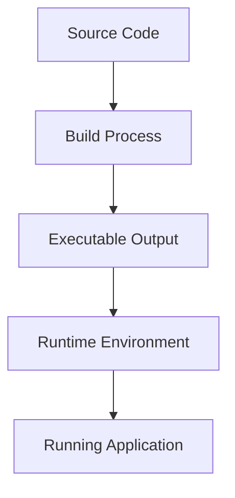

The build process bridges the gap between source representation and runtime representation.

### Examples across programming languages

| Language or platform | Source | Typical build output |
|---|---|---|
| TypeScript | `.ts` files | JavaScript files |
| Java | `.java` files | JAR or compiled classes |
| Go | `.go` files | Executable binary |
| C++ | `.cpp` files | Machine-code executable |
| React application | Source components | Bundled web assets |
| .NET | C# source | Assemblies and application outputs |
| Containerized application | Application files and build configuration | Container image |

Not every application requires compilation.

For example, a plain JavaScript program may run directly in Node.js.

But a delivery process may still package the application and its dependencies into a container image.

### First principle

> **A build is a controlled transformation of software inputs into outputs suitable for testing, packaging, distribution, or execution.**

The build artifact is the output we intend to preserve or distribute.

---

# 3. What Exactly Is a Build Artifact?

A build artifact is a product generated by a build process.

Examples include:

```text
Compiled JavaScript

Executable Binary

JAR File

Static Website Bundle

Python Wheel

Container Image

Release Archive
```

For our CI/CD reference architecture, the main deployable artifact will be a **container image**.

But before focusing on Docker, understand that container images are only one type of artifact.

## 3.1 Different artifacts serve different purposes

Suppose CI executes:

```bash
npm run build
```

And produces:

```text
dist/
├── server.js
├── services/
└── repositories/
```

This is a build output.

Now imagine Docker packages those files, Node.js, and the required runtime dependencies into an image.

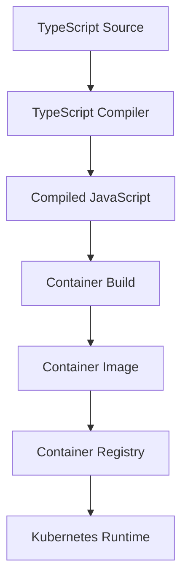

There are two transformations:

**Transformation 1:** TypeScript source becomes compiled JavaScript.

**Transformation 2:** Application files and dependencies become a container image.

Both have outputs.

But the container image becomes our primary deployment artifact.

---

# 4. Why Not Build Directly on the Production Server?

Imagine a simple deployment approach.

The production server executes:

```bash
git pull
npm install
npm run build
npm start
```

Technically, this can work.

But let's investigate its consequences.

## 4.1 Problem: Production now performs development-time work

The production environment must have:

- Git access.
- Source repository access.
- Build tooling.
- Development dependencies.
- Package registry access.
- Compilation resources.

Is all of this necessary for a runtime that only needs to execute the application?

Often, no.

### Consequence

The production environment becomes responsible for both:

1. Constructing the software.
2. Running the software.

These are different responsibilities.

---

## 4.2 Problem: The build may not be the one that passed CI

Suppose CI validates Commit A.

Then production runs:

```bash
git pull
npm install
npm run build
```

Even if production checks out Commit A, its build environment may differ.

It might use:

- A different Node.js version.
- A different base operating system.
- A different compiler.
- Different dependency resolution.
- Different environment variables.

The resulting output may not match the artifact used during earlier validation.

### Fundamental problem

**We have introduced an uncontrolled transformation after validation.**

That weakens the relationship between tested software and deployed software.

---

## 4.3 A stronger architecture

Instead of building on the production server:

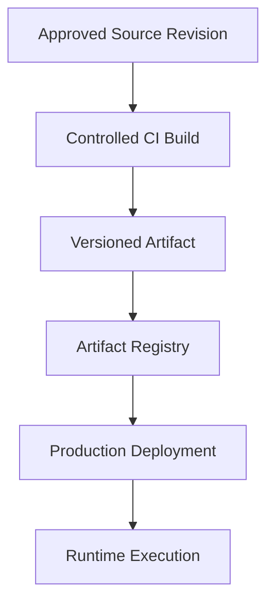

Now the build occurs in a controlled environment.

The output is stored.

The production environment retrieves and executes the selected artifact.

### Engineering principle

> **Separate software construction from software execution whenever doing so provides better repeatability, traceability, and operational control.**

This principle is central to container-based delivery.

---

# 5. A Build Is a Transformation With Multiple Inputs

A common beginner misconception is:

> If the Git commit is the same, the build output must be the same.

That is not necessarily true.

Let's derive why.

Imagine the build command:

```bash
docker build -t ecommerce-api:v1 .
```

What determines the resulting image?

Certainly the source code.

But also:

- Dockerfile.
- Base image.
- Package dependencies.
- Lockfiles.
- Build arguments.
- Compiler version.
- Runtime version.
- Build tools.
- Files included in the build context.
- Network-fetched inputs.
- Build timestamps or other nondeterministic data.

Therefore, the artifact is a function of many inputs.

## 5.1 Build model

```text
Artifact
    =
Build(
    Source,
    Dependencies,
    Build Instructions,
    Base Images,
    Toolchain,
    Build Configuration,
    Environment,
    External Inputs
)
```

This is a conceptual model.

The important realization is that **source code is only one build input**.

## 5.2 Visualize the build system

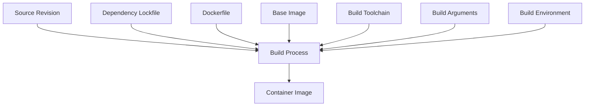

Now consider two builds.

### Build A

```text
Source Commit: abc123

Node.js: 22

Base Image: Image X

Dependencies: Set A
```

### Build B

```text
Source Commit: abc123

Node.js: 22

Base Image: Image Y

Dependencies: Set A
```

Both builds use the same Git commit.

But the base image has changed.

The resulting container images may differ.

### First-principles insight

> **Identical source revisions do not guarantee identical artifacts unless all relevant build inputs and behavior are sufficiently controlled.**

This is why build reproducibility matters.

---

# 6. Deterministic Builds vs Reproducible Builds

These terms are related but worth distinguishing.

## 6.1 Deterministic build

A deterministic build produces the same output when executed with the same effective inputs and conditions.

Conceptually:

```text
Build(Input A) = Artifact X

Build(Input A) = Artifact X
```

The output does not change unpredictably between equivalent executions.

Sources of nondeterminism may include:

- Current timestamps embedded in outputs.
- Random identifiers.
- Nondeterministic file ordering.
- Uncontrolled external downloads.
- Tool behavior.
- Differences in build environments.

---

## 6.2 Reproducible build

A reproducible build can be independently repeated under a defined set of conditions to obtain equivalent output, often byte-identical output when that is the specified goal.

To support reproducibility, we need to define and control build inputs.

For example:

```text
Source Commit SHA

Dependency Lockfile

Compiler Version

Base Image Digest

Build Arguments

Toolchain Configuration
```

### Important distinction

**Repeatable build execution is not automatically a reproducible build.**

Running:

```bash
docker build .
```

repeatedly does not guarantee byte-identical output.

Even when the build succeeds each time.

---

## 6.3 Why this matters to CI/CD

Suppose an incident occurs.

You want to investigate the production artifact.

If the artifact has been deleted, can you rebuild exactly the same software from source?

Maybe.

But only if the required inputs remain available and the build process is sufficiently reproducible.

This is one reason preserving published artifacts is valuable.

A reproducible build helps with independent verification and recovery.

But in our delivery architecture, **we should not rely on rebuilding as the normal method of promoting an existing release**.

Instead, we promote the previously published artifact.

---

# 7. Docker Images: Packaging the Application for Execution

Now let's examine our primary artifact.

A Docker image packages the filesystem content and metadata required to create a container.

It can include:

- Application files.
- Runtime dependencies.
- Required operating-system libraries.
- Entrypoint or command metadata.
- Environment defaults.
- Filesystem layers.

A Docker image is not the same thing as a running container.

## 7.1 Image vs container

### Image

A packaged, immutable filesystem and configuration representation used to create containers.

### Container

A runtime instance created from an image, with its own execution state.

Conceptually:

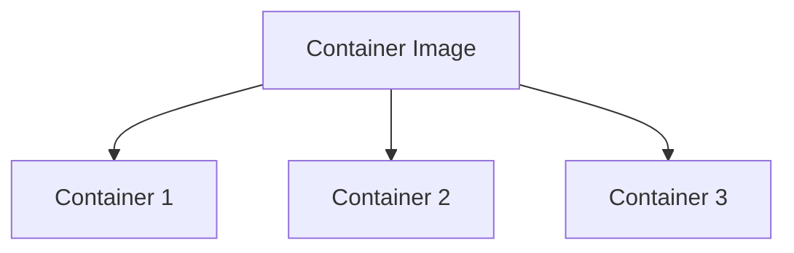

One image can be used to create multiple containers.

For example, Kubernetes may run three replicas from the same image.

---

# 8. Understanding Docker Image Layers

Docker images commonly use layers to represent filesystem changes.

Imagine a Dockerfile:

```dockerfile
FROM node:22-bookworm-slim

WORKDIR /app

COPY package.json package-lock.json ./

RUN npm ci --omit=dev

COPY dist/ ./dist/

CMD ["node", "dist/server.js"]
```

This builds an image from a base image and additional filesystem changes.

Conceptually:

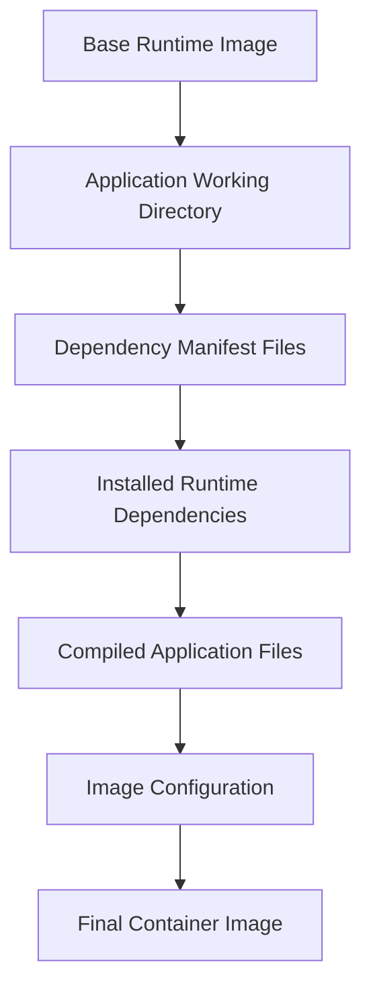

Not every Dockerfile instruction creates a filesystem layer.

For example, metadata instructions such as `CMD` affect image configuration rather than creating a normal filesystem layer.

## 8.1 Why layers matter

Layers help with:

- Build caching.
- Reusing unchanged content.
- Efficient image distribution.
- Sharing common content between images.

Imagine only application source code changes.

If dependency manifests remain unchanged, Docker may be able to reuse the cached dependency installation layer.

That can make subsequent builds faster.

### First-principles lesson

**Build layers separate different transformation steps so unchanged work can potentially be reused.**

However, cache reuse depends on build inputs and cache validity.

A cached layer is not automatically trustworthy merely because it is available.

---

# 9. Why Dockerfile Instruction Order Matters

Consider this Dockerfile:

```dockerfile
FROM node:22-bookworm-slim

WORKDIR /app

COPY . .

RUN npm ci

RUN npm run build
```

This copies the entire build context before dependency installation.

Suppose you modify one application source file.

The `COPY . .` input changes.

That may invalidate the cache for later build instructions.

Dependency installation may need to run again.

Now consider:

```dockerfile
FROM node:22-bookworm-slim

WORKDIR /app

COPY package.json package-lock.json ./

RUN npm ci

COPY src/ ./src/

COPY tsconfig.json ./

RUN npm run build
```

Here, dependency installation depends primarily on the package files and earlier build state.

Changes to `src/` do not necessarily invalidate the dependency installation cache.

### The thinking process

```text
Identify Expensive Operation
          |
          v
Identify Its Real Inputs
          |
          v
Separate Those Inputs
          |
          v
Place Stable Inputs Earlier
          |
          v
Improve Potential Cache Reuse
```

### Engineering principle

> **Organize build instructions according to dependency relationships and expected change frequency, without compromising correctness.**

This is build-system design, not merely Dockerfile formatting.

---

# 10. Why Multi-Stage Docker Builds Exist

Now let's derive multi-stage builds.

Suppose you have a TypeScript application.

The build process requires:

```text
TypeScript Compiler

Type Definitions

Development Dependencies

Build Tools
```

But the running application may only need:

```text
Node.js Runtime

Compiled JavaScript

Production Dependencies
```

Do these two environments require exactly the same tools?

No.

The build environment and runtime environment have different responsibilities.

## 10.1 The single-stage problem

Imagine a container image containing:

- Source files.
- TypeScript compiler.
- Development dependencies.
- Build tools.
- Compiled output.
- Runtime dependencies.

The runtime image carries tools that may not be required during execution.

This can increase:

- Image size.
- Dependency footprint.
- Maintenance burden.
- Potential attack surface.

It can also blur the distinction between build and runtime responsibilities.

---

## 10.2 Multi-stage architecture

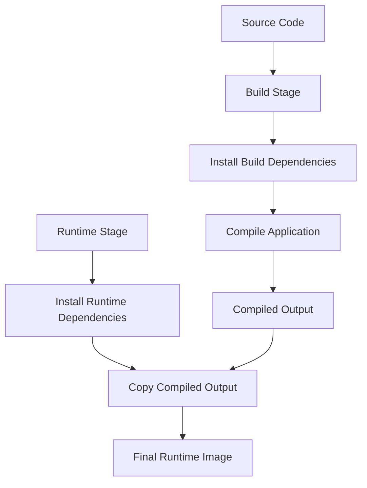

The build stage contains the tooling required to construct the application.

The runtime stage contains the files and dependencies required to execute it.

The compiled output moves from the build stage into the runtime stage.

### Important principle

> **The runtime artifact should contain what the application needs to run, not everything that was required to build it.**

This is useful for image size, dependency management, and security.

It does not automatically make the image secure; the runtime and included dependencies still need appropriate maintenance.

---

# 11. The Container Image Is More Than a Filesystem

We have discussed image layers.

But an image also needs metadata describing how those layers should be used.

A container image can include:

- Filesystem layers.
- Image configuration.
- Entrypoint and command settings.
- Default environment variables.
- Platform information.
- Manifest metadata.

To understand image identity, we need three additional concepts:

1. Image configuration.
2. Image manifest.
3. Image index.

## 11.1 Image configuration

The image configuration describes properties such as:

```text
Environment Variables

Working Directory

Entrypoint

Command

Filesystem Layer Information
```

For example:

```dockerfile
WORKDIR /app

ENV NODE_ENV=production

CMD ["node", "dist/server.js"]
```

These instructions contribute to the image's runtime configuration.

---

## 11.2 Image manifest

An image manifest describes an image using references to its configuration and filesystem layers.

Conceptually:

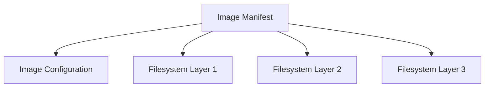

The manifest references content using digests.

This is part of the content-addressed container image model.

---

## 11.3 Image index

Now imagine you want to support:

```text
linux/amd64

linux/arm64
```

The image content for these architectures may differ.

A multi-platform image index can reference separate manifests for different platforms.

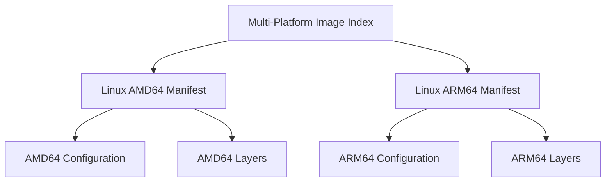

When a compatible runtime pulls a multi-platform image, it can select the appropriate platform-specific image.

### Why is this important?

Because an image reference may identify either:

- A platform-specific image manifest.
- An image index containing multiple platform manifests.

Modern image publishing workflows may also attach provenance and SBOM attestations through OCI image structures.

Docker documents these concepts in its image and attestation documentation. [Docker Documentation](https://docs.docker.com/reference/cli/docker/manifest/?utm_source=chatgpt.com)

### Engineering lesson

**When you record an image digest, know which registry object that digest identifies.**

For a multi-platform release, the top-level index digest is often the appropriate release identity.

---

# 12. The Most Important Concept: Image Tags vs Image Digests

Now we reach one of the central topics of this phase.

Imagine your application image is named:

```text
ghcr.io/example/ecommerce-api:latest
```

What does `latest` mean?

It is a tag.

A tag provides a human-readable reference to an image.

But tags can be moved to identify different image content.

## 12.1 The mutable-tag problem

On Monday:

```text
latest -> Image A
```

On Tuesday:

```text
latest -> Image B
```

On Wednesday:

```text
latest -> Image C
```

The tag remains the same.

The content it identifies can change.

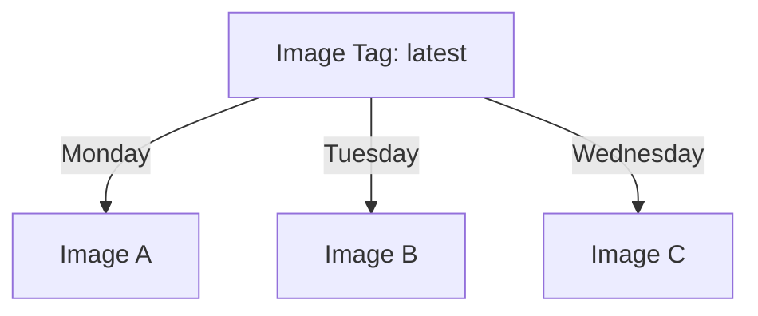

The diagram represents the tag's reference changing over time, not all three images being selected simultaneously.

### Why is this dangerous?

Imagine your Kubernetes Deployment uses:

```yaml
containers:
  - name: api
    image: ghcr.io/example/ecommerce-api:latest
```

Now you have ambiguity.

Which artifact was intended?

Which content does the tag currently identify?

Which image was actually pulled by each node?

Did different Pods start at different times?

### Important qualification

Kubernetes image pulling also depends on image pull policies and local image availability.

Using `latest` does not guarantee that every running container instantly updates when the registry tag changes.

Nor does a mutable tag automatically mean Kubernetes will redeploy an existing workload.

The point is that a mutable tag is a weak way to express immutable release identity.

---

# 13. Image Digests: Content-Based Identity

Container registries use digests to identify image-related content.

A digest generally looks like:

```text
sha256:4c7e...
```

A full SHA-256 digest contains 64 hexadecimal characters after `sha256:`.

A registry image can be referenced by digest:

```text
ghcr.io/example/ecommerce-api@sha256:<64-character-digest>
```

This gives us a stronger artifact identity.

## 13.1 Conceptual model

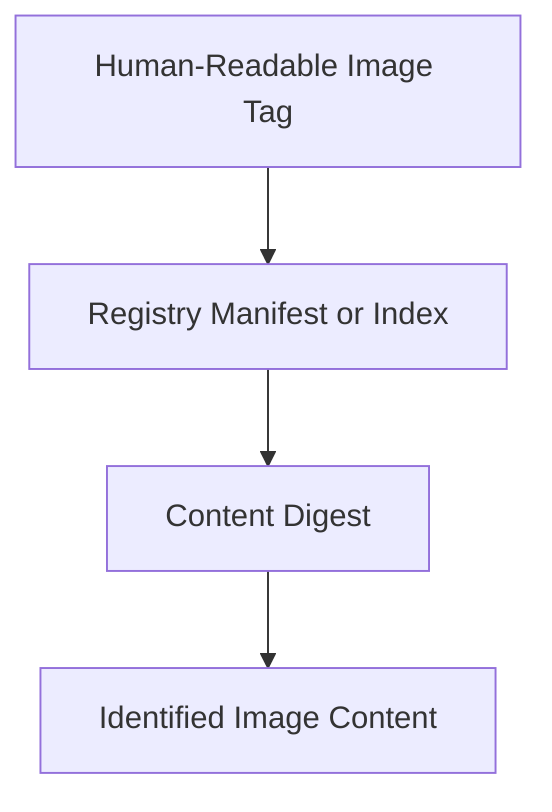

An image tag can be updated to point elsewhere.

A digest identifies specific content.

If the referenced content changes, its digest changes.

Docker and GitHub Container Registry both document pulling container images by digest. [Docker Documentation](https://docs.docker.com/reference/cli/docker/image/pull/?utm_source=chatgpt.com)

---

## 13.2 Why tags are still useful

Tags are not inherently bad.

They provide convenient names.

For example:

```text
v1.4.0

sha-abc123

release-2026-10-08
```

These help humans locate releases.

But for critical deployment identity, a digest is stronger.

### Recommended mental model

```text
Tag
    =
Convenient Name
```

```text
Digest
    =
Specific Content Identity
```

### A useful strategy

Publish an image with a source-related tag.

For example:

```text
ghcr.io/example/ecommerce-api:sha-abc123
```

Then record the digest returned by the registry publishing process.

Deploy using:

```text
ghcr.io/example/ecommerce-api@sha256:<digest>
```

Now we have both:

- Human-readable traceability.
- Content-based deployment identity.

---

# 14. Image Identity Is Not the Same as Trust

This distinction is very important.

Suppose an image has a digest.

Does that prove it is safe?

No.

A malicious image also has a digest.

A vulnerable image also has a digest.

An incorrectly built image also has a digest.

A digest establishes content identity.

It does not automatically establish:

- Who built the image.
- Whether the source was approved.
- Whether tests passed.
- Whether dependencies were trusted.
- Whether the image contains vulnerabilities.
- Whether production deployment was authorized.

### First-principles insight

> **Identity tells us what content we are referring to. Trust requires evidence about how that content was produced and authorized.**

This leads us toward build provenance and software supply-chain security.

---

# 15. Understanding Build Provenance

Imagine two container images.

Both have the same application name.

Both claim to be version `v1.4.0`.

How can we determine where they came from?

We need information about the build process.

This is the purpose of **build provenance**.

Build provenance records information about how an artifact was produced.

Depending on the system and attestation format, it may include:

- Source repository.
- Source revision.
- Build process.
- Build system identity.
- Build parameters.
- Build environment information.
- Referenced build materials.
- Produced artifact identity.

Docker BuildKit supports provenance attestations associated with container images. [Docker Documentation](https://docs.docker.com/build/metadata/attestations/slsa-provenance?utm_source=chatgpt.com)

## 15.1 Provenance architecture

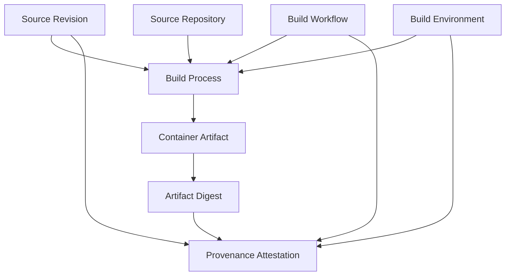

Conceptually, provenance connects the artifact to evidence about its creation.

### What question does provenance help answer?

**Where did this artifact come from, and under what declared build process was it produced?**

---

# 16. A Provenance Record Is Not Automatically Trustworthy

Suppose someone creates a JSON file containing:

```json
{
  "source": "https://github.com/example/ecommerce-api",
  "commit": "abc123",
  "tests": "passed"
}
```

Is that enough to establish trust?

No.

Anyone capable of editing the file could potentially write those claims.

We also need to consider:

- Who created the statement?
- Is it associated with the correct artifact?
- Can it be authenticated?
- Does the build system have an appropriate trust boundary?
- Were the claimed controls actually enforced?
- Can an authorized verifier check the information?

This is why modern supply-chain systems use attestations and verification mechanisms.

### Important distinction

```text
Artifact Digest
    -> Identifies Content
```

```text
Provenance
    -> Describes Build Origin and Process
```

```text
Authentication and Verification
    -> Help Establish Whether Claims Can Be Trusted
```

```text
Release Policy
    -> Determines Whether the Artifact May Be Used
```

These are different responsibilities.

In Phase 14, we will study the security implications in greater depth.

For now, focus on understanding their relationships.

---

# 17. Software Bill of Materials — What Is Inside the Artifact?

Build provenance helps describe how an artifact was produced.

But we may also want to know what the artifact contains.

For example:

```text
Node.js Application

Express

Transitive npm Dependencies

Operating-System Packages

Runtime Libraries
```

This leads us to the concept of a **Software Bill of Materials**, or SBOM.

An SBOM is an inventory of software components associated with an application or artifact.

It may include:

- Package names.
- Versions.
- Package identifiers.
- Relationships between components.
- Dependency information.

## 17.1 SBOM vs provenance

| Concept | Main question |
|---|---|
| Artifact digest | Which exact content? |
| SBOM | Which software components are included or associated? |
| Provenance | How was the artifact built? |
| Signature or authenticated attestation | Who authenticated the statement, and can it be verified? |
| Release policy | Is this artifact permitted for deployment? |

### Important qualification

An SBOM does not automatically prove that an image contains no vulnerabilities.

It provides useful inventory information that can support analysis.

Similarly, provenance records do not guarantee that the application is functionally correct.

These are complementary forms of evidence.

Docker BuildKit supports generating SBOM and provenance attestations during container builds. [Docker Documentation](https://docs.docker.com/build/metadata/attestations/?utm_source=chatgpt.com)

---

# 18. Where Should Build Artifacts Be Stored?

We now have a container image.

Where should it go?

One option would be to keep the image only on the machine that built it.

But that creates several problems.

### Problem 1

What happens when the CI runner is deleted?

### Problem 2

How does the production Kubernetes cluster obtain the image?

### Problem 3

How do staging and production access the same artifact?

### Problem 4

How do we retain previous releases?

We need a durable distribution mechanism.

This leads us to an **artifact registry**.

---

# 19. Container Registries as Artifact Distribution Systems

A container registry stores and distributes container images.

Examples include:

- GitHub Container Registry.
- Azure Container Registry.
- Google Artifact Registry.
- Amazon Elastic Container Registry.
- Docker Hub.

For this course, we will use **GitHub Container Registry (GHCR)**.

It integrates with GitHub repositories and GitHub Actions.

GHCR supports Docker and OCI images and allows workflows to publish associated packages using `GITHUB_TOKEN` when the appropriate permissions are available. [GitHub Docs](https://docs.github.com/en/packages/working-with-a-github-packages-registry/working-with-the-container-registry?utm_source=chatgpt.com)

## 19.1 Registry architecture

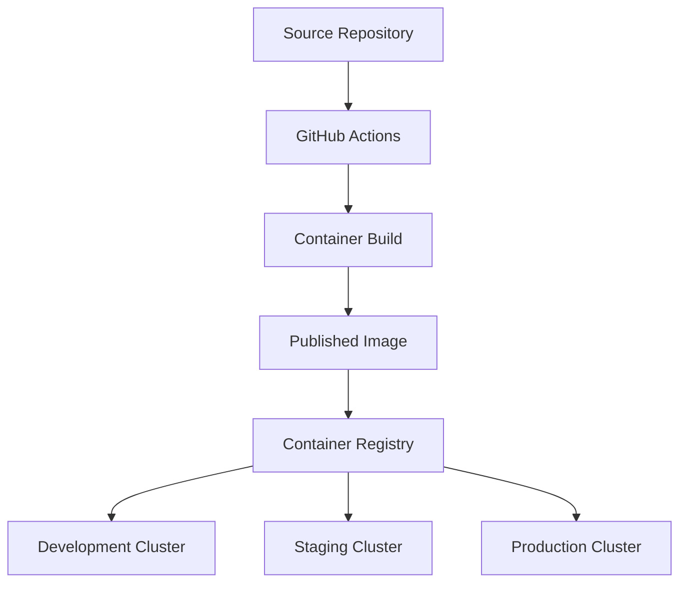

The registry stores the published artifact.

Different runtime environments can retrieve that artifact according to their permissions and network availability.

### Important architectural distinction

**The registry stores artifacts. It does not normally decide which artifact should run in production.**

That decision belongs to release management.

In our architecture, the approved GitOps configuration communicates deployment intent.

---

# 20. A Registry Is Not a CI Artifact Store

Remember Phase 05.

We studied GitHub Actions workflow artifacts.

For example:

```text
Compiled JavaScript

Test Reports

Coverage Reports
```

Now we are discussing container registry artifacts.

They are related but have different purposes.

| Property | Workflow artifact | Container registry image |
|---|---|---|
| Typical content | Files from a CI job | Packaged container image |
| Main purpose | Preserve workflow outputs | Store and distribute container images |
| Typical consumer | Developers or downstream jobs | Container runtimes and deployment systems |
| Access mechanism | CI platform artifact APIs/actions | Container registry protocols |
| Identity | Artifact metadata and identifiers | Image manifest/index digest |
| Deployment suitability | Depends on artifact type | Designed for container execution |
| Retention | Workflow artifact retention policy | Registry retention policy |

### Example

The TypeScript build produces:

```text
dist/
```

That directory could be uploaded as a GitHub Actions workflow artifact.

But if our production platform uses containers, the deployable artifact is the container image.

The image belongs in a container registry.

### Mental model

```text
Workflow Artifact
    =
Output Preserved for Workflow Use
```

```text
Container Image
    =
Packaged Application for Container Execution
```

```text
Container Registry
    =
Storage and Distribution of Container Images
```

---

# 21. Build Once, Promote the Same Artifact

Now we arrive at one of the most important delivery principles.

Imagine three environments:

```text
Development

Staging

Production
```

Should we build the application three times?

Not unless a particular requirement justifies that approach.

## 21.1 The weak approach

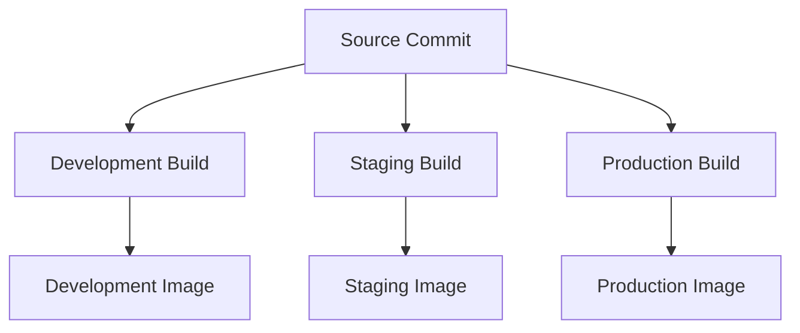

The same source revision passes through three independent builds.

Even if the builds use the same code, their outputs may differ because build conditions can differ.

This introduces avoidable uncertainty.

---

## 21.2 The stronger approach

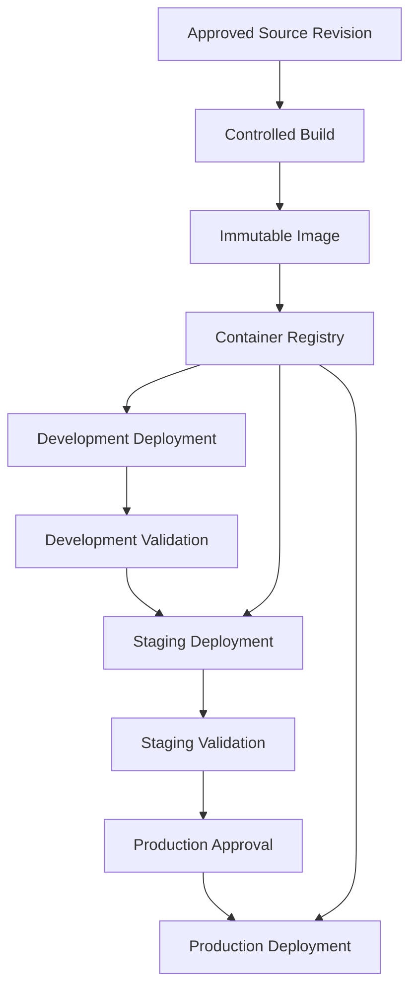

The artifact is built once.

Its identity is recorded.

The same digest is selected for each environment.

### What changes during promotion?

Not the application artifact.

What changes is the approved deployment configuration.

For example:

```text
Development:
Image Digest ABC

Staging:
Image Digest ABC

Production:
Image Digest ABC
```

The runtime configuration may differ:

```text
Replica Count

Database Endpoint

Resource Limits

External Service Configuration

Feature Flags
```

But the application image digest remains the same.

---

# 22. Separate Application Artifacts From Environment Configuration

Suppose your application contains this:

```typescript
const databaseUrl = process.env.DATABASE_URL;
```

This is useful because the database connection is supplied at runtime.

The image does not need to contain the production database hostname.

Now consider an alternative:

```typescript
const databaseUrl =
  "postgresql://production-db:5432/orders";
```

If the database hostname is hardcoded into the compiled application, deployment to different environments becomes less flexible.

You may feel forced to rebuild the image for each environment.

That creates unnecessary coupling.

### Better architecture

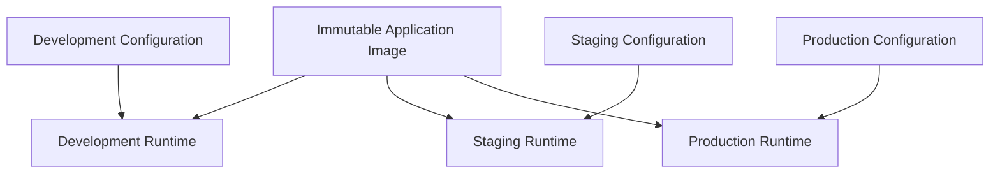

The image contains the software.

The environment supplies the configuration.

### First-principles insight

> **An application artifact should describe what software runs. Environment configuration should describe how and where that software runs.**

This separation makes artifact promotion more reliable.

---

# 23. What Does GitOps Actually Promote?

Now connect artifact management to Argo CD.

Imagine the container registry contains:

```text
ecommerce-api@sha256:AAA

ecommerce-api@sha256:BBB

ecommerce-api@sha256:CCC
```

Which one should production run?

The registry does not decide.

GitHub Actions does not necessarily decide.

The approved deployment configuration determines the intended artifact.

## 23.1 GitOps desired state

For example, a Kubernetes Deployment manifest might contain:

```yaml
apiVersion: apps/v1
kind: Deployment
metadata:
  name: ecommerce-api
spec:
  replicas: 3
  selector:
    matchLabels:
      app: ecommerce-api
  template:
    metadata:
      labels:
        app: ecommerce-api
    spec:
      containers:
        - name: api
          image: ghcr.io/example/ecommerce-api@sha256:aaaaaaaaaaaaaaaaaaaaaaaaaaaaaaaaaaaaaaaaaaaaaaaaaaaaaaaaaaaaaaaa
          ports:
            - containerPort: 3000
```

The digest is illustrative.

Now imagine an approved release updates the image reference to a new digest.

Argo CD observes the changed desired configuration.

It can synchronize the Kubernetes Deployment.

Kubernetes then manages the rollout, and the relevant nodes retrieve the selected image when required.

## 23.2 Complete relationship

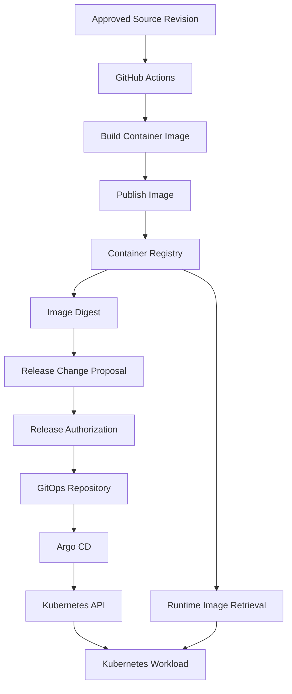

### What is actually being promoted?

**The approval to run a specific artifact in a specific environment.**

The artifact itself does not need to be rebuilt.

This becomes the foundation of release engineering and GitOps.

---

# 24. Artifact Identity, Traceability, and Release Records

Imagine production is failing.

A developer asks:

> Which application version is currently running?

An answer like:

```text
Version 2.0
```

may not be enough.

We should be able to identify:

1. The source revision.
2. The build execution.
3. The produced artifact.
4. The artifact's digest.
5. The approved deployment configuration.
6. The actual runtime image.

## 24.1 Traceability chain

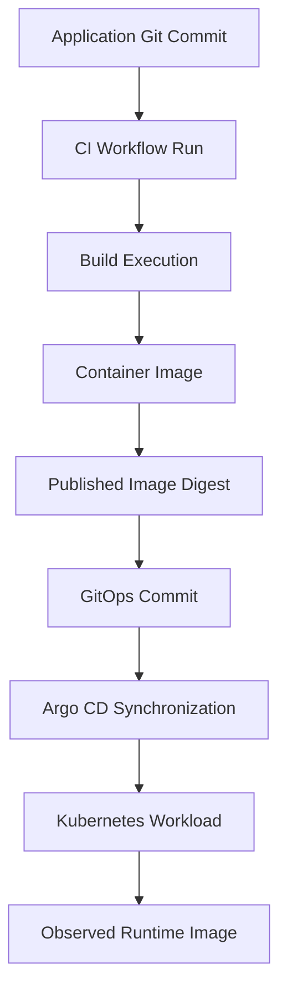

Each identifier has a different responsibility.

| Identifier | What it identifies |
|---|---|
| Git commit SHA | Application source revision |
| Workflow run ID | Particular CI execution |
| Container image digest | Specific registry image content |
| GitOps commit SHA | Version of desired deployment configuration |
| Kubernetes runtime image identity | Image actually used by the workload |

### Why is this important?

Because production may fail even when the application source is unchanged.

For example:

```text
Same Source Revision

Same Container Image

Different Runtime Configuration
```

The failure may result from configuration rather than source code.

Preserving the relationships between these identities makes investigation easier.

---

# 25. Artifact Promotion vs Artifact Rebuilding

Let's clarify a subtle but important distinction.

Imagine CI builds:

```text
Image Digest: AAA
```

Development runs:

```text
Digest AAA
```

Staging runs:

```text
Digest AAA
```

Production runs:

```text
Digest AAA
```

This is artifact promotion.

Now imagine the source commit remains the same, but someone rebuilds the image before production.

The new output is:

```text
Digest BBB
```

Even though the source revision is unchanged, this is a new artifact.

It may be functionally equivalent to the first artifact, but its identity is different.

### What must happen now?

If our release policy requires artifact validation, we must account for this new artifact.

We cannot simply assume that validation of Digest AAA proves everything about Digest BBB.

### First-principles insight

> **Artifact promotion reuses the identity of previously produced software. Rebuilding creates a new artifact whose identity and validation evidence must be evaluated.**

This becomes particularly important when creating release automation.

---

# 26. Artifact Lifecycle Management

An artifact does not exist only at build time.

It passes through a lifecycle.

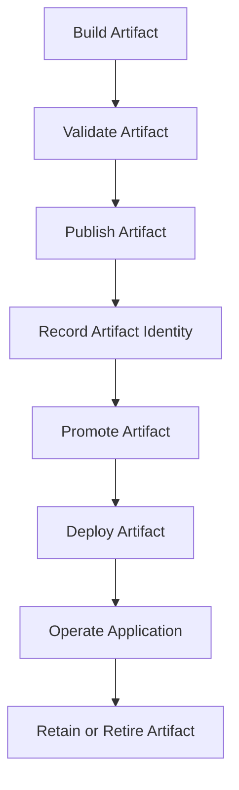

Let's understand the lifecycle.

## 26.1 Creation

The build system produces the artifact.

## 26.2 Validation

The team gathers evidence that the artifact satisfies its defined requirements.

This may include:

- Successful build.
- Unit and integration validation.
- Container startup checks.
- Image inspection.
- Relevant security checks.

Not every validation necessarily happens before publication.

For example, a release workflow may publish an artifact to a restricted registry and then perform additional validation against its immutable digest before promoting it.

## 26.3 Publication

The artifact is stored in a registry.

## 26.4 Promotion

A release policy authorizes a specific artifact for an environment.

## 26.5 Deployment

The runtime retrieves and executes the selected artifact.

## 26.6 Retention

The organization decides how long to retain the artifact.

### Important question

Should we delete every old image immediately after deploying a new version?

Usually not without considering recovery requirements.

Previous artifacts may be needed for:

- Rollback.
- Incident investigation.
- Audit records.
- Reproducibility studies.
- Supported older releases.

### Engineering principle

**Artifact retention should be aligned with release history, recovery requirements, security policies, and storage constraints.**

---

# 27. Artifact Failure Scenarios

A good artifact architecture must account for failure.

## Scenario A: The build succeeds, but registry publication fails

```text
Source Validation: Passed

Image Build: Passed

Registry Push: Failed
```

Can we declare the artifact published?

No.

### Correct behavior

The release process must not promote an artifact whose required registry reference is unavailable.

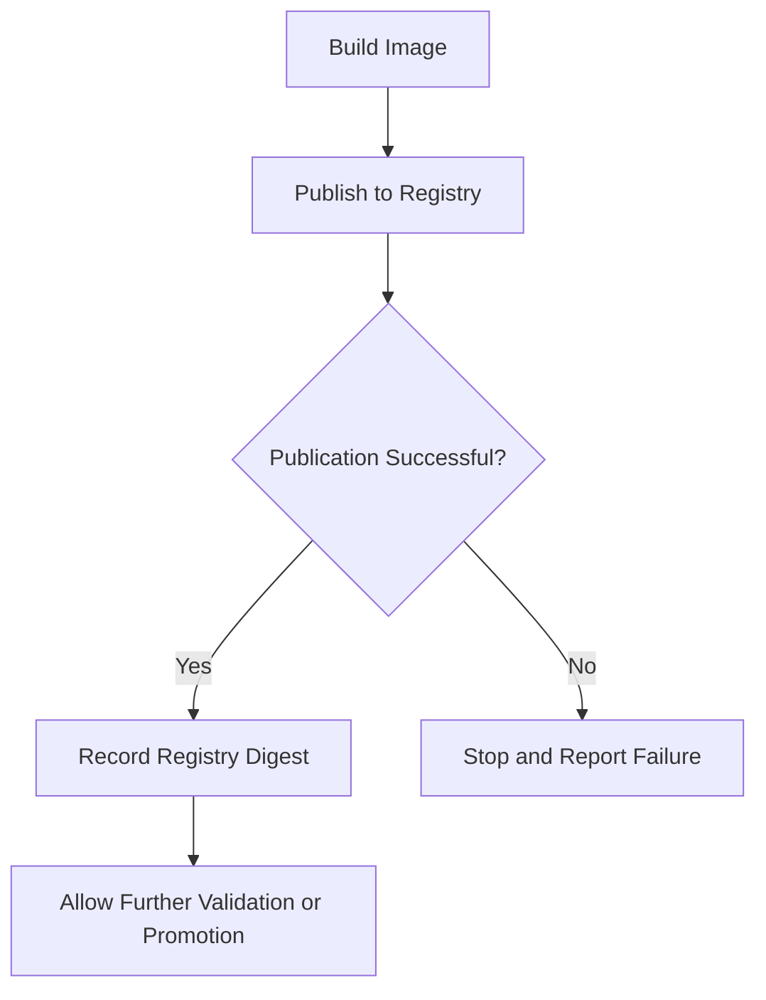

---

## Scenario B: The registry tag changes unexpectedly

GitOps references:

```text
ecommerce-api:v2
```

Someone changes the tag to point to different content.

The desired configuration appears unchanged.

But the registry reference may now resolve differently.

### Architectural response

Use immutable digest references for critical deployment identity.

Where supported, enforce tag immutability policies as an additional control.

---

## Scenario C: The registry becomes unavailable

Suppose the application is already running.

The registry becomes unavailable.

Existing running containers do not normally require a continuous registry connection.

But a newly scheduled Pod may need to pull an image.

If the image is not already available locally and the registry cannot be reached, startup may fail.

### Architectural consequence

The registry is a dependency of artifact distribution.

It may become a dependency of workload recovery or scaling when new containers require image retrieval.

---

## Scenario D: An artifact is deleted

Production is running Digest AAA.

The team deletes Digest AAA from the registry.

Later, Kubernetes needs to start a replacement Pod.

The image is no longer available from the registry.

### Possible consequence

A replacement workload may fail to start if the required image is not available locally.

### Architectural response

Protect artifacts referenced by active deployments and retained recovery releases.

Coordinate registry cleanup with deployment and rollback requirements.

---

## Scenario E: An image digest is correct but the release is defective

Suppose the application has a logic bug.

The image digest correctly identifies the artifact.

Provenance correctly identifies its source.

The build completed successfully.

But users experience failures.

### What does this prove?

Artifact integrity does not guarantee application correctness.

We still need:

- Testing.
- Deployment verification.
- Monitoring.
- Recovery.

### The complete principle

> **A reliable release requires artifact identity, build evidence, release authorization, and runtime verification. No single mechanism replaces the others.**

---

# 28. Practical Lab 07 — Build, Validate, and Publish an Immutable Container Artifact

We will now implement the complete artifact workflow.

**Project:** CI Artifact Engineering Lab  
**Application:** Node.js + TypeScript  
**Container platform:** Docker  
**CI platform:** GitHub Actions  
**Artifact registry:** GitHub Container Registry  
**Cloud infrastructure:** Not required

This lab is designed to be inexpensive and does not require an Azure or GCP deployment.

## 28.1 Lab objectives

By the end, we will have:

1. A working Node.js application.
2. A reproducible dependency installation process.
3. A multi-stage Dockerfile.
4. A smaller runtime image that excludes build tooling.
5. A local container smoke test.
6. A GitHub Actions validation workflow.
7. A release job that publishes an image to GHCR.
8. A published image digest.
9. An image smoke test using the published digest.
10. A release record connecting the Git commit to the image.
11. A design ready for later GitOps integration.

We will build the image for `linux/amd64`.

Multi-platform builds are possible, but they are not required to understand artifact engineering.

---

# 29. Lab Architecture — Design Before Implementation

Start with the system requirements.

## 29.1 Functional requirements

Our application must:

- Start an HTTP server.
- Provide a health endpoint.
- Provide a version endpoint.
- Calculate a sample order total.
- Accept runtime configuration through environment variables.

## 29.2 Build requirements

The build must:

- Use a defined Node.js runtime family.
- Use a committed dependency lockfile.
- Compile TypeScript.
- Install only runtime dependencies in the final image.
- Produce a container image.
- Record the source revision in image metadata.

## 29.3 CI requirements

The pipeline must:

- Validate proposed changes.
- Build the application.
- Run unit tests.
- Build a container image.
- Verify the image starts correctly.
- Avoid publishing images from ordinary pull-request validation.
- Publish images from approved source revisions on `main`.
- Record the registry-generated digest.
- Verify the published artifact.
- Avoid granting production Kubernetes access to the build workflow.

## 29.4 Architecture

```mermaid
flowchart TD
    A["Developer"]
    B["Git Repository"]
    C["GitHub Actions Validation"]
    D["Type Checking and Tests"]
    E["Docker Image Build"]
    F["Local Container Smoke Test"]
    G{"Validation Successful?"}
    H["Developer Failure Feedback"]

    I["Approved Main Revision"]
    J["Release Image Build"]
    K["GitHub Container Registry"]
    L["Published Image Digest"]
    M["Digest-Based Smoke Test"]
    N["Release Record"]
    O["GitOps Promotion Candidate"]

    A --> B
    B --> C
    C --> D
    D --> E
    E --> F
    F --> G

    G -->|No| H
    G -->|Yes| I

    I --> J
    J --> K
    K --> L
    L --> M
    M --> N
    N --> O
```

The transition from successful validation to `main` is governed by the repository's merge policy.

The workflow itself does not guarantee that a pull request has been reviewed or that branch protection is enabled.

We will address that in the release policy.

---

# 30. Lab Part A — Create the Project

Create the directory:

```bash
mkdir ci-artifact-lab
cd ci-artifact-lab
```

Create the required folders:

```bash
mkdir -p src tests scripts .github/workflows
```

Our project structure will be:

```text
ci-artifact-lab/
│
├── src/
│   ├── server.ts
│   └── pricing.ts
│
├── tests/
│   └── pricing.test.mjs
│
├── scripts/
│   └── smoke.sh
│
├── .github/
│   └── workflows/
│       └── artifact.yaml
│
├── Dockerfile
├── .dockerignore
├── .gitignore
│
├── package.json
├── package-lock.json
├── tsconfig.json
│
└── README.md
```

The lockfile will be generated during installation.

---

# 31. Lab Part B — Configure the Application

Create `package.json`:

```json
{
  "name": "ci-artifact-lab",
  "version": "1.0.0",
  "private": true,
  "type": "module",
  "scripts": {
    "typecheck": "tsc --noEmit -p tsconfig.json",
    "build": "tsc -p tsconfig.json",
    "test": "node --test tests/*.test.mjs",
    "start": "node dist/server.js"
  },
  "dependencies": {
    "express": "^5.1.0"
  },
  "devDependencies": {
    "@types/express": "^5.0.0",
    "@types/node": "^22.0.0",
    "typescript": "5.9.3"
  }
}
```

We use Express as the runtime dependency.

TypeScript and the type definitions are development-time dependencies.

### Why is this distinction useful?

Because the runtime container should not need the TypeScript compiler to execute compiled JavaScript.

Now install dependencies:

```bash
npm install
```

This generates:

```text
package-lock.json
```

Commit this file.

### Why?

The lockfile records resolved dependency information used by `npm ci`.

Without an appropriate lockfile, `npm ci` cannot perform the clean installation we want.

---

# 32. Lab Part C — Configure TypeScript

Create `tsconfig.json`:

```json
{
  "compilerOptions": {
    "target": "ES2022",
    "module": "NodeNext",
    "moduleResolution": "NodeNext",
    "rootDir": "src",
    "outDir": "dist",
    "strict": true,
    "esModuleInterop": true,
    "skipLibCheck": true
  },
  "include": [
    "src/**/*.ts"
  ]
}
```

### What does this file control?

It tells the TypeScript compiler:

- Which source files to compile.
- Which module system to use.
- Which JavaScript target to produce.
- Where compiled files should be written.
- Which compiler checks should apply.

This configuration is part of our build definition.

It should be version-controlled.

---

# 33. Lab Part D — Write the Pricing Logic

Create `src/pricing.ts`:

```typescript
export function calculateTotalCents(
  subtotalCents: number,
  taxBasisPoints: number
): number {
  if (
    !Number.isSafeInteger(subtotalCents) ||
    !Number.isSafeInteger(taxBasisPoints) ||
    subtotalCents < 0 ||
    taxBasisPoints < 0
  ) {
    throw new RangeError("Invalid monetary input");
  }

  const taxCents = Math.round(
    (subtotalCents * taxBasisPoints) / 10000
  );

  const totalCents = subtotalCents + taxCents;

  if (!Number.isSafeInteger(totalCents)) {
    throw new RangeError("Calculated total is too large");
  }

  return totalCents;
}
```

This is deliberately simple business logic.

For example:

```text
Subtotal:
10000 cents

Tax:
1800 basis points

Total:
11800 cents
```

The function is not a complete financial calculation library.

Its purpose is to provide behavior that we can test both outside and inside the container.

---

# 34. Lab Part E — Write the HTTP Application

Create `src/server.ts`:

```typescript
import express from "express";

import {
  calculateTotalCents
} from "./pricing.js";

const app = express();

const port = Number(process.env.PORT ?? 3000);

app.get("/health", (_req, res) => {
  res.status(200).json({
    status: "ok"
  });
});

app.get("/version", (_req, res) => {
  res.status(200).json({
    version: process.env.RELEASE_VERSION ?? "unreleased"
  });
});

app.get("/total", (req, res) => {
  try {
    const subtotalCents = Number(
      req.query.subtotalCents
    );

    const taxBasisPoints = Number(
      req.query.taxBasisPoints
    );

    const totalCents = calculateTotalCents(
      subtotalCents,
      taxBasisPoints
    );

    res.status(200).json({
      totalCents
    });
  } catch (error) {
    if (error instanceof RangeError) {
      res.status(400).json({
        error: error.message
      });

      return;
    }

    res.status(500).json({
      error: "Internal server error"
    });
  }
});

app.listen(port, "0.0.0.0", () => {
  console.log(`Application listening on ${port}`);
});
```

### Why use environment variables?

Notice:

```typescript
process.env.PORT
```

And:

```typescript
process.env.RELEASE_VERSION
```

These allow runtime configuration without rebuilding the image.

For example:

```text
Development:
RELEASE_VERSION=development
```

```text
Staging:
RELEASE_VERSION=staging-validation
```

```text
Production:
RELEASE_VERSION=production
```

The image itself can remain unchanged.

### Important distinction

The `/version` endpoint displays the supplied runtime value.

That value is not a cryptographically trustworthy artifact identifier.

The image digest remains our authoritative content identity.

---

# 35. Lab Part F — Write Unit Tests

Create `tests/pricing.test.mjs`:

```javascript
import test from "node:test";
import assert from "node:assert/strict";

import {
  calculateTotalCents
} from "../dist/pricing.js";

test("calculates 18 percent tax", () => {
  assert.equal(
    calculateTotalCents(10000, 1800),
    11800
  );
});

test("handles zero tax", () => {
  assert.equal(
    calculateTotalCents(10000, 0),
    10000
  );
});

test("rejects negative amounts", () => {
  assert.throws(
    () => calculateTotalCents(-100, 1800),
    RangeError
  );
});

test("rejects non-integer amounts", () => {
  assert.throws(
    () => calculateTotalCents(100.5, 1800),
    RangeError
  );
});
```

Run:

```bash
npm run typecheck
npm run build
npm test
```

Expected:

```text
4 tests passed
0 tests failed
```

The exact test runner output may differ.

### What have we validated?

The TypeScript source passes type checking.

The application compiles.

The selected pricing behaviors pass their tests.

### What haven't we validated?

We haven't yet established that the packaged container starts successfully.

That requires an artifact-level check.

---

# 36. Lab Part G — Design the Dockerfile

Now identify the build requirements.

### Build stage requires

```text
Node.js

TypeScript Compiler

Development Dependencies

Application Source
```

### Runtime stage requires

```text
Node.js

Production Dependencies

Compiled JavaScript
```

Therefore, we will use a multi-stage Dockerfile.

Create `Dockerfile`:

```dockerfile
# syntax=docker/dockerfile:1

FROM node:22-bookworm-slim AS build

WORKDIR /app

COPY package.json package-lock.json ./

RUN npm ci

COPY tsconfig.json ./

COPY src/ ./src/

RUN npm run build


FROM node:22-bookworm-slim AS runtime

WORKDIR /app

ENV NODE_ENV=production
ENV PORT=3000

COPY package.json package-lock.json ./

RUN npm ci --omit=dev \
    && npm cache clean --force

COPY --from=build /app/dist/ ./dist/

ARG VCS_REF=unknown
ARG SOURCE_URL=unknown

LABEL org.opencontainers.image.revision=$VCS_REF
LABEL org.opencontainers.image.source=$SOURCE_URL

USER node

EXPOSE 3000

CMD ["node", "dist/server.js"]
```

Now let's analyze this Dockerfile from first principles.

---

# 37. Understanding the Dockerfile Architecture

## 37.1 Why use two stages?

```dockerfile
FROM node:22-bookworm-slim AS build
```

This stage contains the environment required to compile the application.

```dockerfile
FROM node:22-bookworm-slim AS runtime
```

This stage packages the application for execution.

The final image is built from the runtime stage.

The build stage's development dependencies are not copied directly into the runtime stage.

---

## 37.2 Why copy dependency files first?

```dockerfile
COPY package.json package-lock.json ./

RUN npm ci
```

Dependency installation depends on the package manifests.

By copying them before application source files, we improve the opportunity for Docker to reuse the dependency installation cache when source changes do not affect dependencies.

---

## 37.3 Why compile in the build stage?

```dockerfile
RUN npm run build
```

Because production needs compiled JavaScript, not the TypeScript compiler itself.

The compiled output is:

```text
dist/
```

---

## 37.4 Why use `npm ci --omit=dev` in the runtime stage?

```dockerfile
RUN npm ci --omit=dev
```

Because the runtime image only needs production dependencies.

For our application, Express is a production dependency.

TypeScript and the type definitions are not required to execute the compiled application.

### Important note

`--omit=dev` determines which dependencies are installed on disk.

The dependency lockfile still provides the resolved dependency information.

---

## 37.5 Why copy only compiled output?

```dockerfile
COPY --from=build /app/dist/ ./dist/
```

Because the runtime stage does not need our original TypeScript source for normal execution.

This makes the division between build and runtime responsibilities explicit.

---

## 37.6 Why include source metadata?

```dockerfile
ARG VCS_REF=unknown

LABEL org.opencontainers.image.revision=$VCS_REF
```

The build can record the source revision in image metadata.

Later, we can inspect the label.

This is useful for traceability.

However, a label is a claim included during image construction.

It is not a substitute for verified provenance.

---

## 37.7 Why run as a non-root user?

```dockerfile
USER node
```

The official Node.js image provides a `node` user.

Our application listens on an unprivileged port and does not require filesystem writes during normal execution.

Therefore, it can run without root privileges.

This is a useful runtime hardening measure.

It does not make the application immune to security vulnerabilities.

---

# 38. Lab Part H — Control the Docker Build Context

Create `.dockerignore`:

```gitignore
.git
.github
node_modules
dist
coverage
tests
scripts
.env
.env.*
README.md
npm-debug.log*
```

### Why does this matter?

Docker builds receive a build context.

Without appropriate exclusions, the context may contain unnecessary files.

Examples:

```text
Local node_modules

Git history

Test reports

Temporary files

Local environment files
```

These can:

- Increase context size.
- Slow builds.
- Affect cache behavior.
- Accidentally expose sensitive files.
- Introduce uncontrolled build inputs.

### Important principle

> **The build context is an input boundary. Include only the files required by the build.**

Notice that we do not exclude:

```text
package-lock.json
```

Our build needs it.

---

# 39. Lab Part I — Build the Container Locally

First create `.gitignore`:

```gitignore
node_modules/
dist/
coverage/
.env
.env.*
```

Now run:

```bash
docker build \
  --build-arg VCS_REF=local-test \
  -t ci-artifact-lab:local \
  .
```

### What should happen?

Docker should:

1. Resolve the base images.
2. Copy dependency manifests.
3. Install build dependencies.
4. Compile TypeScript.
5. Create the runtime stage.
6. Install production dependencies.
7. Copy the compiled output.
8. Produce the final image.

## 39.1 Inspect the image

Run:

```bash
docker image ls ci-artifact-lab
```

Then:

```bash
docker image inspect ci-artifact-lab:local
```

You can inspect the source label:

```bash
docker image inspect \
  --format '{{ index .Config.Labels "org.opencontainers.image.revision" }}' \
  ci-artifact-lab:local
```

Expected:

```text
local-test
```

### What does this prove?

The build argument was used to populate the image label.

It does not establish that `local-test` is a real Git commit.

In GitHub Actions, we will pass the actual source SHA.

---

# 40. Lab Part J — Run the Container

Start the application:

```bash
docker run -d \
  --name ci-artifact-app \
  -p 127.0.0.1:3000:3000 \
  -e RELEASE_VERSION=local-validation \
  ci-artifact-lab:local
```

Verify health:

```bash
curl -fsS http://127.0.0.1:3000/health
```

Expected:

```json
{
  "status": "ok"
}
```

Verify runtime configuration:

```bash
curl -fsS http://127.0.0.1:3000/version
```

Expected:

```json
{
  "version": "local-validation"
}
```

Verify business behavior:

```bash
curl -fsS \
  "http://127.0.0.1:3000/total?subtotalCents=10000&taxBasisPoints=1800"
```

Expected:

```json
{
  "totalCents": 11800
}
```

### What have we established?

The packaged image can start an HTTP server.

The running container can accept runtime configuration.

The selected endpoints behave as expected.

This gives us additional evidence about the artifact.

It still does not prove that the application will run successfully under every possible Kubernetes or production condition.

---

# 41. Lab Part K — Verify Runtime Configuration Without Rebuilding

Stop the first container:

```bash
docker rm -f ci-artifact-app
```

Now run the same image with a different environment variable:

```bash
docker run -d \
  --name ci-artifact-app \
  -p 127.0.0.1:3000:3000 \
  -e RELEASE_VERSION=staging-validation \
  ci-artifact-lab:local
```

Run:

```bash
curl -fsS http://127.0.0.1:3000/version
```

Expected:

```json
{
  "version": "staging-validation"
}
```

### What changed?

Runtime configuration.

### What didn't change?

The container image reference.

We did not rebuild the software.

### What is the engineering lesson?

**Runtime environment configuration can change independently from the application artifact.**

This is essential for artifact promotion across environments.

Clean up:

```bash
docker rm -f ci-artifact-app
```

---

# 42. Automating Artifact Smoke Tests

We have manually tested our image.

Now we want a repeatable mechanism that verifies container startup.

This is important because a successful `docker build` does not guarantee that the packaged application starts correctly.

For example, the image could have:

- An incorrect startup command.
- Missing runtime dependencies.
- Incorrect file paths.
- Missing compiled output.
- Unexpected runtime errors.

We should detect these problems before promoting the release.

## 42.1 Create the smoke-test script

Create `scripts/smoke.sh`:

```bash
#!/usr/bin/env bash

set -euo pipefail

IMAGE="${1:?Provide an image reference}"

CONTAINER_NAME="artifact-smoke-$$"
PORT=18080

cleanup() {
  docker rm -f "$CONTAINER_NAME" >/dev/null 2>&1 || true
}

trap cleanup EXIT

echo "Testing image: $IMAGE"

docker run -d \
  --name "$CONTAINER_NAME" \
  -p "127.0.0.1:${PORT}:3000" \
  "$IMAGE"

echo "Checking application readiness..."

for attempt in $(seq 1 30); do

  if curl --fail --silent \
    "http://127.0.0.1:${PORT}/health" \
    >/dev/null; then

    echo "Health endpoint passed"

    echo "Checking business behavior..."

    RESPONSE=$(curl -fsS \
      "http://127.0.0.1:${PORT}/total?subtotalCents=10000&taxBasisPoints=1800")

    echo "$RESPONSE" | grep -q '"totalCents":11800'

    echo "Business smoke test passed"

    exit 0
  fi

  sleep 1
done

echo "Application failed to become ready"

docker logs "$CONTAINER_NAME"

exit 1
```

Run locally:

```bash
bash scripts/smoke.sh ci-artifact-lab:local
```

### What does this script validate?

It checks:

1. The image can create a container.
2. The application starts.
3. The health endpoint responds successfully.
4. A selected business endpoint returns the expected result.

### Why not simply sleep for ten seconds?

Because application startup time may vary.

An arbitrary sleep does not establish readiness.

Instead, we repeatedly check a defined endpoint.

### Why use a cleanup trap?

Because the test should not leave unnecessary containers running after completion or ordinary failure.

### Important limitation

This script validates selected application behavior on a local Docker runtime.

It does not establish Kubernetes deployment correctness, network policy behavior, or production database availability.

Those require additional validation at later stages.

---

# 43. Designing the GitHub Actions Artifact Pipeline

Now we need to automate the complete process.

Before writing YAML, define our requirements.

## 43.1 Pull-request responsibilities

When a developer opens a pull request, the pipeline should:

1. Check out the relevant source revision.
2. Install dependencies.
3. Perform type checking.
4. Compile the application.
5. Run unit tests.
6. Build a container image.
7. Execute the container smoke test.
8. Report the results.

It should **not** publish an ordinary pull-request build as a production release.

Why?

Because proposed code has not necessarily passed the required authorization process.

---

## 43.2 Main-branch release responsibilities

Once an approved source revision enters `main`, the release workflow should:

1. Validate that source revision.
2. Build a container image.
3. Publish it to the registry.
4. Capture the published digest.
5. Execute a smoke test using that exact digest.
6. Record the source and artifact identities.
7. Make the successfully validated artifact eligible for future promotion.

### Important distinction

In our reference workflow, publishing an image to GHCR does not mean deploying it to production.

**Publication and production promotion are separate operations.**

---

# 44. CI and Artifact Publication Architecture

```mermaid
flowchart TD
    A["Pull Request or Main Push"]
    B["GitHub Actions Validation"]
    C["Type Checking"]
    D["Application Compilation"]
    E["Unit Tests"]
    F["Local Image Build"]
    G["Container Smoke Test"]
    H{"Validation Passed?"}

    I["Report Failure"]
    J{"Approved Main Branch Push?"}
    K["Stop After Validation"]

    L["Build Release Image"]
    M["Publish to GHCR"]
    N["Capture Registry Digest"]
    O["Smoke Test Published Digest"]
    P{"Published Artifact Validated?"}
    Q["Record Release Artifact"]
    R["Release Pipeline Fails"]
    S["Artifact Eligible for Promotion"]

    A --> B
    B --> C
    C --> D
    D --> E
    E --> F
    F --> G
    G --> H

    H -->|No| I
    H -->|Yes| J

    J -->|No| K
    J -->|Yes| L

    L --> M
    M --> N
    N --> O
    O --> P

    P -->|Yes| Q
    P -->|No| R

    Q --> S
```

### Why do we build during pull-request validation?

Because we want early evidence that the Dockerfile can package the application.

### Why is there another build after merging?

Because the actual main-branch revision is the source selected for release.

That revision may differ from the earlier pull-request revision.

Also, our simple workflow uses separate jobs and runner environments.

### Doesn't this contradict build once, deploy many?

No.

**Build once, deploy many refers to reusing the same published release artifact across target environments.**

It does not mean that CI can never build candidate images during development.

In this lab:

- Pull-request builds are validation artifacts.
- The release build produces the published artifact.
- The published digest is what future environments should promote.

The release artifact is not rebuilt for staging or production.

---

# 45. Complete GitHub Actions Workflow

Create:

```text
.github/workflows/artifact.yaml
```

Add:

```yaml
name: Build and Publish Artifact

on:
  pull_request:
    branches:
      - main

  push:
    branches:
      - main

permissions:
  contents: read

concurrency:
  group: artifact-${{ github.workflow }}-${{ github.event.pull_request.number || github.ref }}
  cancel-in-progress: ${{ github.event_name == 'pull_request' }}

jobs:
  validate:
    name: Validate Source and Container

    runs-on: ubuntu-latest

    timeout-minutes: 20

    steps:
      - name: Checkout source
        uses: actions/checkout@v7

      - name: Configure Node.js
        uses: actions/setup-node@v7
        with:
          node-version: "22"
          cache: npm

      - name: Install dependencies
        run: npm ci

      - name: Type checking
        run: npm run typecheck

      - name: Build application
        run: npm run build

      - name: Run unit tests
        run: npm test

      - name: Build validation image
        run: |
          docker build \
            --build-arg VCS_REF="$GITHUB_SHA" \
            -t ci-artifact-lab:ci \
            .

      - name: Smoke test validation image
        run: |
          bash scripts/smoke.sh ci-artifact-lab:ci

  publish:
    name: Publish Immutable Image

    needs: validate

    if: >-
      ${{
        github.event_name == 'push' &&
        github.ref == 'refs/heads/main'
      }}

    runs-on: ubuntu-latest

    timeout-minutes: 30

    permissions:
      contents: read
      packages: write

    steps:
      - name: Checkout approved source
        uses: actions/checkout@v7

      - name: Determine image name
        id: image
        run: |
          IMAGE_REF="ghcr.io/${GITHUB_REPOSITORY,,}"

          echo "name=$IMAGE_REF" >> "$GITHUB_OUTPUT"

          echo "Image: $IMAGE_REF"

      - name: Set up Docker Buildx
        uses: docker/setup-buildx-action@v4

      - name: Log in to GHCR
        uses: docker/login-action@v4
        with:
          registry: ghcr.io
          username: ${{ github.repository_owner }}
          password: ${{ secrets.GITHUB_TOKEN }}

      - name: Build and publish release image
        id: publish
        uses: docker/build-push-action@v7
        with:
          context: .
          file: ./Dockerfile
          platforms: linux/amd64
          push: true
          tags: |
            ${{ steps.image.outputs.name }}:sha-${{ github.sha }}
          build-args: |
            VCS_REF=${{ github.sha }}
            SOURCE_URL=${{ github.server_url }}/${{ github.repository }}
          provenance: mode=min
          sbom: true

      - name: Verify published image
        env:
          PUBLISHED_IMAGE: ${{ steps.image.outputs.name }}@${{ steps.publish.outputs.digest }}
        run: |
          echo "Published artifact: $PUBLISHED_IMAGE"

          bash scripts/smoke.sh "$PUBLISHED_IMAGE"

      - name: Record release artifact
        env:
          IMAGE_NAME: ${{ steps.image.outputs.name }}
          IMAGE_DIGEST: ${{ steps.publish.outputs.digest }}
        run: |
          IMAGE_REFERENCE="${IMAGE_NAME}@${IMAGE_DIGEST}"

          {
            echo "## Published Release Artifact"
            echo ""
            echo "Source SHA: \`$GITHUB_SHA\`"
            echo ""
            echo "Image: \`$IMAGE_REFERENCE\`"
            echo ""
            echo "Workflow Run: \`$GITHUB_RUN_ID\`"
            echo ""
            echo "Platform: \`linux/amd64\`"
            echo ""
            echo "Smoke Test: Passed"
          } >> "$GITHUB_STEP_SUMMARY"

          echo "Artifact ready for release consideration:"
          echo "$IMAGE_REFERENCE"
```

This workflow uses current major versions of the official GitHub and Docker actions checked for this lesson.

Docker's official GitHub Actions documentation describes Buildx, registry login, image publishing, provenance, and SBOM generation. [Docker Documentation](https://docs.docker.com/build/ci/github-actions/?utm_source=chatgpt.com)

**Production note:** Major-version action references are convenient for learning, but privileged production workflows should consider pinning reviewed action commits to immutable full SHAs and updating them through a controlled process.

---

# 46. Understand Every Architectural Decision

Let's analyze the workflow.

## 46.1 Why are pull requests allowed to validate but not publish?

Our workflow has two jobs:

```text
validate

publish
```

The validation job executes for matching pull requests and pushes.

The publishing job has an additional condition:

```yaml
if: >-
  ${{
    github.event_name == 'push' &&
    github.ref == 'refs/heads/main'
  }}
```

Therefore, it runs only for the matching main-branch push event after validation succeeds.

### Important caveat

A push to `main` does not automatically prove that the change was reviewed.

That depends on repository policy.

For this design to implement our intended authorization boundary, configure appropriate branch protection or rulesets.

---

## 46.2 Why is publication permission restricted?

The default workflow permission is:

```yaml
permissions:
  contents: read
```

The publishing job receives:

```yaml
permissions:
  contents: read
  packages: write
```

The validation job does not receive registry publishing authority.

### Why does this matter?

Pull-request validation executes code supplied by developers.

It should not automatically receive privileges reserved for publishing approved releases.

The publishing job needs the authority to write the resulting image to GHCR.

It does not need Kubernetes cluster-admin credentials.

### First-principles lesson

> **Grant permissions according to the responsibility of the job, not the maximum authority available to the CI platform.**

---

## 46.3 Why use `GITHUB_TOKEN`?

The workflow publishes to GHCR using:

```yaml
password: ${{ secrets.GITHUB_TOKEN }}
```

This is a token provided for the GitHub Actions workflow.

For appropriately linked packages and repository permissions, it can publish images without creating a separate long-lived personal access token.

GHCR documents this workflow authentication approach. [GitHub Docs](https://docs.github.com/en/packages/working-with-a-github-packages-registry/working-with-the-container-registry?utm_source=chatgpt.com)

### Important limitation

Registry package permissions and repository linkage still matter.

For example, a package previously created under the same name but not connected to the repository can cause publishing authorization problems.

---

## 46.4 Why convert the image name to lowercase?

We use:

```bash
IMAGE_REF="ghcr.io/${GITHUB_REPOSITORY,,}"
```

Container repository names must follow registry naming rules, including lowercase requirements for repository path components.

GitHub repository names can contain uppercase characters.

Normalizing the name avoids an unnecessary publishing failure.

---

## 46.5 Why tag the image with the Git SHA?

We publish:

```text
ghcr.io/owner/repository:sha-<commit-sha>
```

This gives the published image a useful relationship to the source revision.

But remember:

A tag containing a commit SHA is still a tag.

It is not automatically immutable.

Therefore, we also capture the registry digest.

---

## 46.6 Why does the build action have an output digest?

The publishing step uses:

```yaml
id: publish
```

Later:

```yaml
${{ steps.publish.outputs.digest }}
```

The Docker build-and-push action exposes the digest of the published result.

We use it to construct an immutable image reference.

Conceptually:

```text
Image Name
    +
Registry Digest
    =
Specific Published Artifact Reference
```

This is stronger than relying only on the source-related tag.

---

## 46.7 Why explicitly enable provenance and SBOM?

We use:

```yaml
provenance: mode=min
sbom: true
```

This requests build provenance and an SBOM attestation.

These provide useful artifact information.

They do not automatically establish that the image is safe or approved.

A production verification policy would need to define which attestation identities and claims are trusted.

The resulting attestations may be associated with an OCI image index.

Therefore, the published digest may identify a top-level image index rather than only a platform-specific manifest.

---

## 46.8 Why smoke test the published digest?

Notice:

```yaml
PUBLISHED_IMAGE: ${{ steps.image.outputs.name }}@${{ steps.publish.outputs.digest }}
```

The smoke test runs:

```bash
bash scripts/smoke.sh "$PUBLISHED_IMAGE"
```

This is important.

We are not simply testing a locally rebuilt image and assuming the registry contains the same artifact.

We are requesting the published artifact by its registry digest.

### What does this establish?

The workflow verifies that the specific published artifact can be pulled and run in the test environment.

The smoke test checks selected application behavior.

### Why publish before this test?

Because this lab intentionally validates the registry-published artifact.

Publication is not treated as authorization for production deployment.

If the smoke test fails, the workflow fails and does not record a successfully verified release candidate.

The published image may still exist in GHCR, so registry cleanup or quarantine would be a separate policy decision.

---

# 47. Understanding the Release Pipeline's Trust Boundary

Let's return to Phase 03.

A reliable CI/CD architecture separates:

```text
Who Can Propose a Change?

Who Can Validate It?

Who Can Publish an Artifact?

Who Can Authorize Deployment?

Who Can Modify Production?
```

Our workflow separates these responsibilities.

```mermaid
flowchart TD
    A["Developer"]
    B["Application Pull Request"]
    C["Read-Only CI Validation"]
    D["Required Merge Policy"]
    E["Approved Main Revision"]
    F["Package Publishing Job"]
    G["Container Registry"]
    H["Published Artifact Digest"]
    I["Release Promotion Policy"]
    J["GitOps Deployment Configuration"]

    A --> B
    B --> C
    C --> D
    D --> E
    E --> F
    F --> G
    G --> H
    H --> I
    I --> J
```

### Important distinction

The GitHub Actions workflow does not directly modify production Kubernetes.

It builds and publishes an artifact.

Later, release automation may propose a GitOps change that references the artifact digest.

That change should pass the appropriate release authorization process.

This is the architecture we will implement in Level 3.

---

# 48. Execute the GitHub Actions Lab

Now publish the project to GitHub.

## Step 1 — Initialize Git

```bash
git init -b main
```

Add your files:

```bash
git add .
```

Commit:

```bash
git commit -m "feat: implement immutable artifact pipeline"
```

Verify the lockfile is included:

```bash
git ls-files package-lock.json
```

Expected:

```text
package-lock.json
```

---

## Step 2 — Create the GitHub repository

If GitHub CLI is installed and authenticated:

```bash
gh repo create ci-artifact-lab \
  --public \
  --source=. \
  --remote=origin \
  --push
```

Alternatively, create the repository through GitHub and configure the remote manually.

The initial push to `main` should trigger the workflow.

---

## Step 3 — Inspect the validation job

Navigate to:

**GitHub Repository → Actions → Build and Publish Artifact**

Inspect:

```text
Validate Source and Container
```

You should find steps for:

- Source checkout.
- Node.js configuration.
- Dependency installation.
- Type checking.
- Build.
- Unit tests.
- Docker image build.
- Container smoke test.

### Questions to answer

1. Which commit did the runner check out?
2. Which command compiled TypeScript?
3. What was the Docker build context?
4. Which image tag was used for local validation?
5. What did the smoke test verify?

---

## Step 4 — Inspect the publishing job

After validation succeeds on the main-branch push, inspect:

```text
Publish Immutable Image
```

Look for:

```text
GHCR Login

Buildx Setup

Build and Publish

Published Digest

Smoke Verification

Release Summary
```

### Important observation

The output digest should look like:

```text
sha256:<64-character-value>
```

This is the identity we want to preserve.

---

## Step 5 — Find the published image

Open the package associated with your GitHub account or repository.

The image will generally be named according to:

```text
ghcr.io/<owner>/<repository>
```

GitHub Container Registry normally creates new packages with private visibility unless configured otherwise.

A public repository does not automatically guarantee that a published package is publicly pullable.

If necessary, configure package visibility and repository access through GitHub's package settings.

For this lab, publishing through the workflow and smoke testing with the authenticated runner does not require making the package public.

---

# 49. Inspect the Published Artifact

Now examine the image from outside the workflow.

Suppose the workflow reports:

```text
Image:
ghcr.io/example/ci-artifact-lab@sha256:<digest>
```

Set the real reference:

```bash
export IMAGE_REF="ghcr.io/YOUR-OWNER/ci-artifact-lab"
```

Set the actual published digest:

```bash
export IMAGE_DIGEST="sha256:YOUR_ACTUAL_DIGEST"
```

Now inspect:

```bash
docker buildx imagetools inspect \
  "${IMAGE_REF}@${IMAGE_DIGEST}"
```

This retrieves information about the registry image.

Depending on the image structure, the output may include a top-level index and platform-specific manifests.

If the package is private, you must authenticate with a credential authorized to read it.

## 49.1 Pull by digest

```bash
docker pull \
  "${IMAGE_REF}@${IMAGE_DIGEST}"
```

This requests the identified artifact.

## 49.2 Run by digest

```bash
docker run -d \
  --name published-artifact-test \
  -p 127.0.0.1:3000:3000 \
  "${IMAGE_REF}@${IMAGE_DIGEST}"
```

Verify:

```bash
curl -fsS http://127.0.0.1:3000/health
```

Then:

```bash
curl -fsS \
  "http://127.0.0.1:3000/total?subtotalCents=10000&taxBasisPoints=1800"
```

Clean up:

```bash
docker rm -f published-artifact-test
```

### What have we demonstrated?

We have retrieved and executed a specific published artifact using its digest.

This is the same identity mechanism our GitOps configuration will use later.

---

# 50. Failure Experiment 1 — An Image Can Build Successfully but Fail at Runtime

This experiment is extremely important.

Modify the last line of your Dockerfile.

Change:

```dockerfile
CMD ["node", "dist/server.js"]
```

To:

```dockerfile
CMD ["node", "dist/missing.js"]
```

Now build:

```bash
docker build \
  -t ci-artifact-lab:broken \
  .
```

The build may succeed.

Why?

Because the Dockerfile can create an image whose configured startup command references a nonexistent file.

The build process does not necessarily execute that command.

Now test:

```bash
bash scripts/smoke.sh ci-artifact-lab:broken
```

The container should fail to start the application successfully.

The smoke test should fail.

## 50.1 What does this demonstrate?

```mermaid
flowchart TD
    A["Valid Source Code"]
    B["Successful Compilation"]
    C["Successful Image Build"]
    D["Container Startup"]
    E["Missing Runtime File"]
    F["Smoke Test Failure"]

    A --> B
    B --> C
    C --> D
    D --> E
    E --> F
```

**Build success does not guarantee runtime success.**

A build validates construction.

A smoke test validates selected behavior of the constructed artifact.

These are distinct forms of evidence.

Restore the correct Dockerfile command after the experiment.

---

# 51. Failure Experiment 2 — Break the Build Contract

Now let's explore dependency management.

Our Dockerfile contains:

```dockerfile
COPY package.json package-lock.json ./

RUN npm ci
```

Temporarily add this to `.dockerignore`:

```gitignore
package-lock.json
```

Try rebuilding:

```bash
docker build \
  -t ci-artifact-lab:missing-lock \
  .
```

The build should fail because the Dockerfile requires a file excluded from the build context.

### What is the underlying problem?

The build instructions require an input that is unavailable.

### First-principles interpretation

```text
Build Requirement
      |
      v
Required Input
      |
      v
Input Missing
      |
      v
Build Cannot Proceed
```

This is a build-contract failure.

It is not a TypeScript logic error.

It is not a Kubernetes problem.

It is a failure in the relationship between build instructions and available build inputs.

Remove the temporary `.dockerignore` entry afterward.

---

# 52. Failure Experiment 3 — Same Source, Different Build Inputs

Now investigate reproducibility.

Consider:

```dockerfile
FROM node:22-bookworm-slim
```

This references a base image using a tag.

The tag may identify a different base image in the future.

Suppose the base image is updated.

The application source commit remains unchanged.

But a new build may use different operating-system packages or runtime content.

Therefore, the resulting digest may change.

## 52.1 What should we do?

For stronger reproducibility, consider pinning important base images by digest.

Conceptually:

```dockerfile
FROM node:22-bookworm-slim@sha256:<verified-digest>
```

The placeholder must be replaced with a real compatible digest.

### What does this achieve?

The build now references a specific base image identity.

But it also introduces a maintenance responsibility.

If the base image has a security update, the pinned digest does not automatically move to the updated version.

The team must intentionally update the dependency.

### Engineering trade-off

| Floating base-image tag | Pinned base-image digest |
|---|---|
| Can resolve to newer content | Identifies specific content |
| Simpler automatic refresh behavior | Stronger input identity |
| May introduce unexpected changes | Requires intentional updates |
| Weaker reproducibility | Better controlled reproducibility |

### Important lesson

> **Reproducibility and dependency freshness must be managed together.**

Pinning everything indefinitely is not a complete security strategy.

Controlled updates and validation are still necessary.

---

# 53. Failure Experiment 4 — A Tag Can Change Without Changing Its Name

We can demonstrate the difference between tags and image content locally.

Build the normal image:

```bash
docker build \
  -t ci-artifact-lab:version-a \
  .
```

Inspect its image ID:

```bash
docker image inspect \
  --format '{{.Id}}' \
  ci-artifact-lab:version-a
```

Now change an application file.

For example, modify the message returned by `/health`.

Rebuild using a new tag:

```bash
docker build \
  -t ci-artifact-lab:version-b \
  .
```

Inspect:

```bash
docker image inspect \
  --format '{{.Id}}' \
  ci-artifact-lab:version-b
```

The content change should result in a different image identity.

Now move a local tag:

```bash
docker tag \
  ci-artifact-lab:version-b \
  ci-artifact-lab:version-a
```

Inspect `version-a` again.

It now identifies the same local image as `version-b`.

### What have we demonstrated?

A tag is a reference.

The content identity belongs to the underlying image.

### Important distinction

The image ID shown by local Docker inspection is not always the same as the registry manifest or index digest.

For GitOps deployment, use the digest of the published registry artifact.

---

# 54. Failure Experiment 5 — Correct Artifact, Incorrect Configuration

Suppose we publish:

```text
Image Digest:
AAA
```

The image works locally.

Development deploys the image successfully.

Staging also deploys the image successfully.

But production has a missing environment variable.

The application fails.

Does this mean the artifact identity was wrong?

Not necessarily.

The same artifact can behave differently under different runtime conditions.

### Architecture

```mermaid
flowchart TD
    A["Same Immutable Artifact"]

    B["Development Configuration"]
    C["Staging Configuration"]
    D["Production Configuration"]

    E["Development Works"]
    F["Staging Works"]
    G["Production Fails"]

    A --> B
    A --> C
    A --> D

    B --> E
    C --> F
    D --> G
```

### What did we learn?

**Artifact consistency reduces one source of uncertainty. It does not eliminate environment-related failures.**

This is why GitOps configuration validation, readiness checks, smoke tests, and observability remain important.

---

# 55. Real-World Case Study — A Production Release Has the Wrong Image

Imagine an incident.

The engineering team approved application version `v2`.

The release workflow produced:

```text
Source Commit:
abc123

Published Digest:
AAA
```

But production runs:

```text
Digest:
BBB
```

What happened?

We need to investigate the delivery chain.

## 55.1 Investigation process

### Step 1: Check the source revision

Which Git commit was selected for release?

### Step 2: Check the build execution

Which GitHub Actions run created the artifact?

### Step 3: Check the published digest

What digest did the registry return?

### Step 4: Check the GitOps configuration

Which digest does the approved production configuration reference?

### Step 5: Check the actual Kubernetes workload

Which image was configured?

Which image identity did the runtime report?

### Step 6: Compare identities

```mermaid
flowchart TD
    A["Approved Source Commit"]
    B["Build Workflow"]
    C["Published Digest"]
    D["GitOps Desired Digest"]
    E["Kubernetes Configured Image"]
    F["Runtime Image Identity"]

    A --> B
    B --> C
    C --> D
    D --> E
    E --> F
```

Now identify where the mismatch occurred.

### Possible causes

| Observation | Possible explanation |
|---|---|
| Registry digest differs from expected release record | Incorrect artifact selected or recorded |
| GitOps references an older digest | Release promotion did not update desired state |
| GitOps is correct but Kubernetes configuration differs | Synchronization or drift problem |
| Kubernetes spec is correct but Pod image differs | Rollout incomplete, old Pods, or runtime state issue |
| Tag matches but digest differs | Mutable tag reference changed |
| Source commit matches but image differs | Build inputs or build execution differed |

### Important principle

> **Artifact traceability lets engineers investigate delivery failures as relationships between identifiable states, rather than guessing which version is running.**

---

# 56. How Artifact Engineering Fits Into the Complete DevOps System

Now connect everything we have studied.

## 56.1 Development responsibility

Developers create source revisions.

Git records their history.

## 56.2 CI responsibility

GitHub Actions evaluates configured checks.

It produces validation evidence.

## 56.3 Build responsibility

The build system transforms a source revision and its dependencies into a container image.

## 56.4 Artifact registry responsibility

The registry stores and distributes the published image.

## 56.5 Release engineering responsibility

The team determines which validated artifact is authorized for a particular environment.

## 56.6 GitOps responsibility

Git stores the approved desired deployment configuration.

## 56.7 Argo CD responsibility

Argo CD compares and reconciles managed Kubernetes resources against their declared configuration.

## 56.8 Kubernetes responsibility

Kubernetes manages the running workloads.

## 56.9 Observability responsibility

Monitoring and application checks provide evidence about actual runtime behavior.

### Complete architecture

```mermaid
flowchart TD
    A["Developer"]
    B["Application Git Repository"]
    C["GitHub Actions CI"]
    D["Validation Results"]
    E["Controlled Build"]
    F["Container Artifact"]
    G["Container Registry"]
    H["Published Image Digest"]

    I["Release Authorization"]
    J["GitOps Repository"]
    K["Argo CD"]
    L["Kubernetes API"]
    M["Kubernetes Workloads"]
    N["Running Application"]

    O["Operational Monitoring"]
    P["Engineering Feedback"]

    A --> B
    B --> C
    C --> D
    D --> E
    E --> F
    F --> G
    G --> H

    H --> I
    I --> J

    J --> K
    K --> L
    L --> M
    M --> N

    G --> M

    N --> O
    O --> P

    P -.-> A
```

The registry-to-Kubernetes relationship represents artifact retrieval, not deployment authorization.

The workflow that proposes a GitOps update is intentionally represented within release engineering, rather than assuming the registry automatically edits deployment configuration.

### Fundamental insight

**The artifact is the bridge between Continuous Integration and Continuous Delivery.**

CI validates and produces software.

CD determines how that software is authorized, deployed, and verified.

---

# 57. Practical Architecture Exercise — Design an Artifact Pipeline Independently

Now imagine you are given this requirement.

> We have a Node.js backend deployed to AKS. Developers use GitHub Actions. We need reproducible builds, immutable artifacts, traceable releases, and GitOps-based environment promotion.

You must design the solution from first principles.

Do not immediately copy the workflow from this lesson.

## Task A — Identify build inputs

Create a table.

| Build input | Why required? | How will it be controlled? |
|---|---|---|
| Application source | ? | ? |
| Dependency lockfile | ? | ? |
| Node.js version | ? | ? |
| Base image | ? | ? |
| Dockerfile | ? | ? |
| Build arguments | ? | ? |
| External downloads | ? | ? |

Explain which inputs could change without modifying application source code.

---

## Task B — Design artifact identity

Answer:

1. How will you identify the source revision?
2. How will you identify the CI execution?
3. How will you name the published image?
4. How will you obtain the registry digest?
5. Which identity will GitOps reference?
6. What happens if the human-readable tag changes?

---

## Task C — Design the build architecture

Your design must include:

```text
Source Code

Build Dependencies

Compilation

Runtime Dependencies

Final Container Image
```

Decide whether a multi-stage build is justified.

Explain why.

---

## Task D — Design validation

You must verify:

1. Application compilation succeeds.
2. Unit tests pass.
3. Container image builds.
4. Container starts.
5. Health endpoint works.
6. Selected business endpoint returns the expected result.

Decide which checks execute before image publication and which verify the published digest.

Explain what each check establishes.

---

## Task E — Design environment promotion

You have:

```text
Development

Staging

Production
```

Explain how the same artifact will move through these environments.

Answer:

- Will the image be rebuilt?
- What configuration changes?
- Where is approval recorded?
- Which system performs deployment?
- Which system retrieves the container image?
- How will you verify production behavior?

---

## Task F — Design security boundaries

Answer:

1. Does pull-request validation need package publishing access?
2. Does image publishing require Kubernetes credentials?
3. Who should be able to modify production GitOps configuration?
4. Should the build system contain production secrets?
5. How can build provenance improve traceability?
6. What information would you verify before approving an artifact?
7. How would you handle a compromised release workflow?

---

## Task G — Design artifact retention

Imagine your team releases:

```text
v1

v2

v3

v4
```

Production runs `v4`.

But `v3` is the last known stable release.

Which artifacts should be retained?

What happens if cleanup removes an image still referenced by Kubernetes?

How should retention interact with rollback policy?

Explain your reasoning.

---

# 58. System-Design Trade-offs

Let's compare important architectural choices.

| Decision | Option A | Option B | Main trade-off |
|---|---|---|---|
| Build location | Production server | Controlled CI environment | Simplicity vs build/deploy separation |
| Artifact identity | Mutable tag | Registry digest | Convenience vs content identity |
| Build strategy | Single stage | Multi-stage | Simplicity vs runtime footprint |
| Environment promotion | Rebuild per environment | Promote same digest | Independent builds vs consistency |
| Runtime configuration | Baked into image | Supplied at runtime | Coupling vs environment flexibility |
| Base-image reference | Floating tag | Pinned digest | Automatic movement vs controlled updates |
| Build evidence | Logs only | Logs plus provenance | Simplicity vs traceability |
| Artifact contents | Untracked dependencies | SBOM inventory | Lower overhead vs visibility |
| Release authorization | Automatic after publication | Separate release policy | Speed vs controlled promotion |
| Artifact retention | Aggressive deletion | Recovery-aware retention | Storage cost vs rollback availability |

### How should you choose?

Always return to:

```text
Requirement
    |
    v
Failure Risk
    |
    v
Architectural Options
    |
    v
Trade-off Analysis
    |
    v
Implementation Decision
```

No technology choice is automatically correct in every environment.

---

# 59. Memorization — Eight Artifact Engineering Mental Models

Let's reduce the phase to eight concepts.

## Mental Model 1 — Source is not an artifact

```text
Source Code
     |
     v
Build Transformation
     |
     v
Deployable Artifact
```

**Remember:** Building transforms inputs into a distribution-ready output.

---

## Mental Model 2 — A build has multiple inputs

```text
Source
   +
Dependencies
   +
Base Image
   +
Toolchain
   +
Build Configuration
   |
   v
Artifact
```

**Remember:** The same Git commit does not automatically guarantee identical builds.

---

## Mental Model 3 — Image vs container

```text
Image
    =
Packaged Software
```

```text
Container
    =
Running Instance Created From Image
```

---

## Mental Model 4 — Tag vs digest

```text
Tag
    =
Movable Human-Readable Reference
```

```text
Digest
    =
Content-Based Identity
```

---

## Mental Model 5 — Identity is not trust

```text
Artifact Digest
      |
      v
Which Content?
```

```text
Build Provenance
      |
      v
How Was It Built?
```

```text
Release Policy
      |
      v
May It Be Deployed?
```

---

## Mental Model 6 — Build once, deploy many

```text
Validated Release Build
          |
          v
Immutable Artifact
          |
          v
Container Registry
          |
          v
Development
          |
          v
Staging
          |
          v
Production
```

**Remember:** Promote the published artifact rather than rebuilding it for every environment.

---

## Mental Model 7 — Artifact vs configuration

```text
Application Image
       =
What Software Runs
```

```text
Deployment Configuration
       =
How and Where It Runs
```

---

## Mental Model 8 — Artifact engineering connects CI and CD

```text
Continuous Integration
         |
         v
Validated Artifact
         |
         v
Release Authorization
         |
         v
Continuous Delivery
```

This is the most important relationship of Phase 07.

---

# 60. Active Recall Questions

Close your notes and answer without looking.

**Q1.** Why is source code different from a build artifact?

**Q2.** What are the major inputs to a build process?

**Q3.** Why can two builds from the same Git commit produce different output?

**Q4.** What is the difference between deterministic and reproducible builds?

**Q5.** Why might building directly on a production server weaken release consistency?

**Q6.** What is a Docker image?

**Q7.** How does a Docker image differ from a running container?

**Q8.** What are image layers?

**Q9.** Why does Dockerfile instruction order influence caching?

**Q10.** What problem do multi-stage builds solve?

**Q11.** What is an image manifest?

**Q12.** What is an image index?

**Q13.** Why can `latest` be an unreliable release identifier?

**Q14.** What does an image digest identify?

**Q15.** Why is a digest not proof that an image is secure?

**Q16.** What is build provenance?

**Q17.** What is an SBOM?

**Q18.** What is the role of a container registry?

**Q19.** Why should development, staging, and production ideally use the same release artifact?

**Q20.** Why should application configuration be separated from image content?

**Q21.** How does GitOps reference a particular artifact?

**Q22.** Why does Argo CD not need to build the application image?

**Q23.** What happens if the registry is unavailable when Kubernetes needs to pull an image?

**Q24.** Why should an old image sometimes be retained after deployment?

**Q25.** How do you connect a Git commit, CI run, image digest, GitOps commit, and actual production workload?

---

# 61. Interview and System-Design Questions

These questions test whether you understand artifact engineering beyond Docker commands.

### Question 1

Your team rebuilds the same application separately for development, staging, and production.

All builds use the same Git commit.

Why might the resulting artifacts differ?

How would you redesign the delivery process?

### Question 2

A Docker image is published as:

```text
ecommerce-api:latest
```

Production uses the same tag.

What are the risks?

How would you improve release identity?

### Question 3

Explain the differences between:

- Git commit SHA.
- Docker image ID.
- Container registry manifest digest.
- Image index digest.
- Kubernetes runtime image identity.

Why should these concepts not be confused?

### Question 4

Your Dockerfile successfully builds.

But the container crashes immediately after startup.

What does this reveal about the difference between build validation and artifact validation?

### Question 5

A CI pipeline passes all tests.

The Docker image is published.

The team later discovers that the image includes unnecessary development tooling.

How would multi-stage builds help?

What limitations remain?

### Question 6

Your production image is pinned by digest.

A critical vulnerability is discovered in its base image.

What should the team do?

Explain why immutable identity and dependency updates must be managed together.

### Question 7

Your team wants to know which Git commit produced a production image.

What metadata and release records would you preserve?

How would you distinguish an unverified image label from authenticated provenance evidence?

### Question 8

The container registry becomes unavailable.

Existing Kubernetes Pods continue running.

But new Pods fail to start.

Explain the failure using the artifact distribution architecture.

### Question 9

A build publishes an image digest successfully.

The smoke test of that digest fails.

Should the image automatically become eligible for production promotion?

What policy would you design?

### Question 10

Explain how GitHub Actions, GHCR, a GitOps repository, Argo CD, and Kubernetes work together to deploy an immutable artifact without rebuilding it.

### Question 11

Why should package publishing permission be separate from production deployment authorization?

### Question 12

How would you design an artifact retention policy that supports rollback while controlling registry storage costs?

---

# 62. Official Documentation — Learn the Implementation From the Architecture

Use official documentation to discover implementation details rather than memorizing entire Dockerfiles or workflows.

## 62.1 Docker multi-stage builds

**Official documentation:**

https://docs.docker.com/build/building/multi-stage/

Study:

- Multiple `FROM` instructions.
- Named build stages.
- `COPY --from`.
- Build-stage separation.
- Runtime-stage optimization.

**Engineering question:**

Why do the build environment and runtime environment require different dependencies?

---

## 62.2 Docker image publishing

**Official documentation:**

https://docs.docker.com/reference/cli/docker/image/push/

Study:

- Image tagging.
- Registry publishing.
- Push behavior.
- Published digests.

**Engineering question:**

How does a locally built image become available to another runtime environment?

---

## 62.3 Docker image pulling

**Official documentation:**

https://docs.docker.com/reference/cli/docker/image/pull/

Study:

- Tags.
- Digests.
- Image layers.
- Pull behavior.

**Engineering question:**

How can a runtime request a specific artifact rather than whatever content a mutable tag currently identifies?

---

## 62.4 GitHub Container Registry

**Official documentation:**

https://docs.github.com/en/packages/working-with-a-github-packages-registry/working-with-the-container-registry

Study:

- Container package names.
- Authentication.
- Publishing.
- Pulling.
- Repository linkage.
- Package permissions.

**Engineering question:**

What permissions and information does GitHub Actions require to publish a container image?

---

## 62.5 Docker Build with GitHub Actions

**Official documentation:**

https://docs.docker.com/build/ci/github-actions/

Study:

- Buildx.
- Login action.
- Build-and-push action.
- Build metadata.
- GitHub Actions integration.

**Engineering question:**

How does the CI platform execute an artifact build and publish its output?

---

## 62.6 Provenance attestations

**Official documentation:**

https://docs.docker.com/build/metadata/attestations/slsa-provenance/

Study:

- Source metadata.
- Build parameters.
- Build materials.
- Attestation modes.
- Provenance inspection.

**Engineering question:**

How can a delivery system preserve evidence about the origins and construction of an artifact?

---

## 62.7 SBOM and provenance with GitHub Actions

**Official documentation:**

https://docs.docker.com/build/ci/github-actions/attestations/

Study:

- Provenance configuration.
- SBOM generation.
- Image-associated attestations.
- Buildx behavior.

**Engineering question:**

What is the difference between knowing an artifact's identity, knowing its components, and knowing how it was built?

---

# 63. Phase 07 — Engineering Takeaways

| Principle | Engineering meaning |
|---|---|
| **Source is not the deployment artifact** | Source often requires transformation and packaging. |
| **Builds have multiple inputs** | Source revisions alone do not guarantee artifact identity. |
| **Build reproducibility matters** | Controlled inputs improve confidence and repeatability. |
| **Docker images package software** | Images provide a reusable execution representation. |
| **Image layers support reuse** | Build caching can reduce repeated work. |
| **Dockerfile ordering matters** | Cache efficiency depends on instruction inputs and dependencies. |
| **Multi-stage builds separate responsibilities** | Build tools need not become runtime dependencies. |
| **Tags are references** | They are convenient but can be mutable. |
| **Digests identify content** | They provide stronger deployment identity. |
| **Identity is not trust** | A digest does not establish security or correctness. |
| **Provenance records build information** | It supports artifact traceability and verification. |
| **SBOMs describe software components** | They improve dependency visibility. |
| **Registries distribute artifacts** | They are distinct from CI workflow artifact storage. |
| **Build once, deploy many** | Promote the same published artifact across environments. |
| **Runtime configuration should be separate** | Environment differences should not require unnecessary rebuilds. |
| **Artifact publication is not production authorization** | Release policy determines promotion. |
| **Artifact smoke tests add evidence** | Successful construction does not guarantee successful startup. |
| **Artifact retention supports recovery** | Deleting required images can affect rollback and replacement workloads. |
| **Traceability crosses systems** | Source, build, artifact, configuration, and runtime identities should be connected. |
| **Artifacts connect CI and CD** | CI creates validated software outputs; CD authorizes and delivers them. |

---

# 64. Final Understanding

Return to our original engineering question:

**How do we transform a validated source revision into a trustworthy artifact that can be promoted across environments?**

The answer begins by recognizing that source code is not the same thing as a deployable artifact.

A build transforms software inputs into an executable or distributable output.

The output depends on more than the source revision.

Therefore, we should control dependencies, toolchains, build instructions, base images, and other relevant inputs.

We should produce an identifiable artifact.

For containerized applications, that means recording a registry image digest.

We should validate the artifact's important behavior.

We should preserve appropriate information about how it was built.

We should publish it to a registry.

Then release engineering should determine which environments are authorized to run it.

GitOps records that deployment intent.

Argo CD reconciles the approved configuration.

Kubernetes manages the resulting workloads.

And operational monitoring provides feedback about actual runtime behavior.

## 64.1 Complete artifact engineering model

```mermaid
flowchart TD
    A["Approved Source Revision"]
    B["Controlled Build Inputs"]
    C["Build Environment"]
    D["Application Compilation"]
    E["Container Packaging"]
    F["Container Artifact"]
    G["Artifact Validation"]
    H["Artifact Registry"]
    I["Published Digest"]
    J["Build Provenance and Metadata"]
    K["Release Authorization"]
    L["GitOps Desired State"]
    M["Argo CD"]
    N["Kubernetes"]
    O["Running Application"]
    P["Runtime Verification"]

    A --> C
    B --> C

    C --> D
    D --> E
    E --> F

    F --> G
    G --> H

    H --> I

    C --> J
    I --> J

    I --> K
    J --> K

    K --> L
    L --> M
    M --> N

    H --> N

    N --> O
    O --> P
```

The registry-to-Kubernetes arrow represents image distribution. The image digest and build metadata provide release evidence, but the release policy must still determine whether the artifact is authorized for a target environment.

### The most important principle of Phase 07

> **A reliable software delivery system should build an identifiable artifact under controlled conditions, validate that artifact, preserve its identity and relevant build evidence, and promote the same published artifact across environments rather than introducing unnecessary rebuilds.**

Remember these relationships:

**Git identifies the source revision.**

**The build system transforms source and dependencies into an artifact.**

**The registry stores and distributes that artifact.**

**The digest identifies its content.**

**Provenance describes how it was built.**

**Release engineering determines whether it may be deployed.**

**GitOps records which artifact an environment should run.**

**Argo CD reconciles the corresponding Kubernetes configuration.**

**Kubernetes executes the workload.**

**Observability provides evidence about the running application's behavior.**

Understanding these distinctions is essential for CI/CD system design.

---

# Phase 07 Complete

**Completed:** Level 2 — Phase 07: Build Artifacts

## Course Progress

| Level | Phase | Topic | Status |
|---|---|---|---|
| 1 | 01 | Why CI/CD Exists | Completed |
| 1 | 02 | Feedback and Control Systems | Completed |
| 1 | 03 | Delivery Architecture | Completed |
| 1 | 04 | Git Lifecycle | Completed |
| 2 | 05 | CI Architecture | Completed |
| 2 | 06 | Testing and Quality Gates | Completed |
| 2 | 07 | Build Artifacts | Completed |
| 2 | 08 | GitHub Actions | Next |
| 3 | 09 | Release Engineering | Upcoming |
| 3 | 10 | GitOps | Upcoming |
| 3 | 11 | Argo CD | Upcoming |
| 3 | 12 | End-to-End Integration | Upcoming |
| 4 | 13–15 | Production Engineering | Upcoming |
| 5 | 16 | Complete CI/CD Project | Upcoming |

---

## Next: Phase 08 — GitHub Actions

**File:** `Level-2-Continuous-Integration/Phase-08-GitHub-Actions.md`

We now understand:

- Why CI exists.
- How CI architectures work.
- How tests produce validation evidence.
- How quality gates control integration.
- How builds produce artifacts.
- How images are identified and published.

In Phase 08, we will bring these concepts together and study GitHub Actions in greater depth.

We will focus on how to translate system requirements into real workflows.

Topics will include:

- GitHub Actions internal architecture.
- Workflow triggers and event contexts.
- Job scheduling and dependency graphs.
- Expressions and conditional execution.
- Environment variables, secrets, and variables.
- Job outputs and reusable workflows.
- Composite actions.
- Matrix strategies.
- Concurrency controls.
- Caching and artifact transfer.
- Container-based jobs and service containers.
- GitHub-hosted and self-hosted runners.
- OIDC authentication.
- Workflow permissions.
- CI failure handling.
- Workflow debugging.
- Release workflow design.
- Practical workflow architecture patterns.
- Designing and auditing a complete CI pipeline.

### Central engineering question

> **Given an application, its validation requirements, and its artifact publishing requirements, how do we translate the complete CI architecture into a maintainable, secure, observable, and efficient GitHub Actions workflow system?**

Phase 08 will be the final phase of **Level 2 — Continuous Integration**.

After that, we will move into **Level 3 — Continuous Delivery**, where GitOps and Argo CD become central to the architecture.

**Send `next` to begin Phase 08 — GitHub Actions.**