# Phase 09 — Release Engineering: Designing Controlled Software Delivery From First Principles

**Level 3: Continuous Delivery | CI/CD From First Principles**

**File:** `Level-3-Continuous-Delivery/Phase-09-Release-Engineering.md`

**Previous:** Phase 08 — GitHub Actions  
**Next:** Phase 10 — GitOps

---

# 1. What Will You Learn?

Welcome to **Level 3 — Continuous Delivery**.

We have completed the foundations of Continuous Integration.

Our system can now:

1. Receive source changes through Git.
2. Validate proposed changes using GitHub Actions.
3. Execute automated tests.
4. Enforce integration quality gates.
5. Build Docker images.
6. Publish images to a container registry.
7. Record immutable image digests.
8. Preserve source-to-artifact traceability.

Imagine our GitHub Actions workflow produces:

```text
Application: ecommerce-api

Source Commit: abc123

CI Status: Passed

Image Build: Successful

Registry:
ghcr.io/example/ecommerce-api

Image Digest:
sha256:<64-character-digest>

Container Smoke Test: Passed
```

Everything looks good.

But now someone asks:

> Can we deploy this image to production?

**We cannot answer that question using the build result alone.**

We need additional information.

For example:

- Has the image been tested in staging?
- Is this release intended for production today?
- Are database changes compatible?
- Does the deployment require downtime?
- Have the required approvals been obtained?
- What version is currently running?
- Can we recover if the new version fails?
- What operational evidence will determine success?
- What happens if another release starts simultaneously?

These questions belong to **Release Engineering**.

## Learning objectives

By the end of Phase 09, you should understand:

1. Why software release engineering exists.
2. The difference between a build, an artifact, a release, and a deployment.
3. How to derive release requirements from business and operational risks.
4. How release state machines work.
5. Release versioning and immutable artifact identity.
6. How to separate technical validation from release authorization.
7. How development, staging, and production promotion should work.
8. Why a release must carry evidence and configuration information.
9. How approvals fit into release architecture.
10. How GitHub Actions can support release authorization.
11. Why release pipelines need concurrency and idempotency controls.
12. How database migrations complicate application releases.
13. Rollback, roll-forward, and recovery trade-offs.
14. How to handle partial and failed releases.
15. How release histories improve incident investigation.
16. How to design a GitOps-oriented release process without granting CI direct Kubernetes access.
17. How to build and validate a release-promotion workflow without deploying cloud infrastructure.

Our central engineering question is:

> **Once CI produces a validated artifact, how do we decide when, where, and under what conditions that exact artifact is allowed to become a running release?**

---

# 2. First Principle: A Valid Artifact Is Not Necessarily an Authorized Release

Let's start with a simple scenario.

Your company operates an e-commerce application.

A developer implements a new checkout flow.

The code passes every required CI check.

A container image is published.

Does this mean the new checkout flow should immediately become available to customers?

Not necessarily.

The business might require:

- Release during a scheduled maintenance window.
- Compatibility verification with an existing database.
- Approval from the engineering team.
- Confirmation that a payment provider supports the change.
- Successful staging validation.
- A recovery plan.

The artifact might be technically valid but operationally inappropriate to deploy.

## 2.1 Derive the problem

Continuous Integration answers:

**Does this source revision satisfy our configured validation requirements?**

Release Engineering answers:

**Is this artifact eligible and authorized to move into a particular environment under the current conditions?**

Deployment Engineering answers:

**How do we apply the authorized change to the target system?**

Runtime Verification answers:

**Did the deployed system achieve the required operational behavior?**

These are four different questions.

## 2.2 The architectural separation

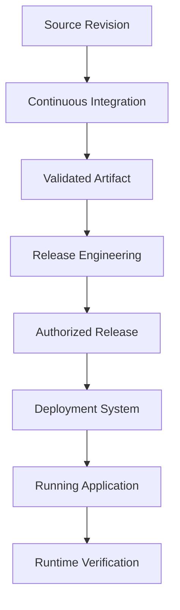

### The first major principle

> **Building software creates an artifact. Releasing software authorizes the use of that artifact under defined conditions. Deploying software changes the running environment.**

Keep these concepts separate.

They are the foundation of everything we will study in Level 3.

---

# 3. Build vs Artifact vs Release vs Deployment

These four concepts are frequently confused.

Let's define them precisely.

## 3.1 Build

A **build** is an execution that transforms software inputs into outputs.

Example:

```bash
docker build -t ecommerce-api:v1.4.0 .
```

The build process consumes:

```text
Source Code

Dependencies

Dockerfile

Build Arguments

Base Image

Toolchain
```

And produces:

```text
Container Image
```

A build is an operation.

---

## 3.2 Artifact

An **artifact** is an output produced by the build process.

For our application:

```text
ghcr.io/example/ecommerce-api@sha256:<digest>
```

The artifact is something we can store, identify, retrieve, and execute.

It exists independently of whether production is authorized to run it.

---

## 3.3 Release

A **release** is a selected software version or artifact accompanied by the information, validation status, and authorization needed to make it available to an intended audience or environment.

For our system, a release record may contain:

```text
Release: 1.4.0

Source Commit: abc123

Artifact Digest: sha256:<digest>

Validation Status: Passed

Target Environment: production

Authorization Status: Approved

Previous Release: 1.3.2

Recovery Plan: Revert approved image selection
```

A release is not merely a Docker image.

It connects an artifact to a delivery decision.

An artifact may be eligible for release without being approved for every environment.

---

## 3.4 Deployment

A **deployment** is the operation of introducing or updating software in an environment.

For example, Kubernetes may update a Deployment resource to reference a new container image.

This changes the desired workload configuration.

The Kubernetes controllers then work toward the requested runtime state.

A deployment can succeed or fail independently of whether the artifact was built correctly.

---

## 3.5 Compare the four concepts

| Concept | Engineering question | Example |
|---|---|---|
| Build | Can we construct the software? | Docker build |
| Artifact | What software output was created? | Image digest |
| Release | Is this artifact selected and authorized for use? | Approved release record |
| Deployment | Has the environment been instructed to run it? | Kubernetes rollout |
| Runtime verification | Is the resulting system operating acceptably? | Smoke tests and production metrics |

### Mental model

```text
Build
  |
  v
Artifact
  |
  v
Release Decision
  |
  v
Deployment
  |
  v
Runtime Verification
```

A successful build does not automatically authorize a release.

An authorized release does not automatically guarantee deployment success.

A successful deployment does not automatically guarantee acceptable user-facing behavior.

---

# 4. Deriving the Requirements of a Release System

Let's imagine that our company has no formal release process.

Developers build images and deploy whichever version they believe is ready.

What can go wrong?

## 4.1 Problem: The wrong version is deployed

Someone accidentally selects an older image.

### Required capability

**Artifact identity and release selection.**

The system must identify the exact artifact that is authorized.

---

## 4.2 Problem: Production receives an unapproved change

Someone publishes an image and immediately deploys it.

### Required capability

**Release authorization.**

The ability to produce software should not automatically imply permission to change production.

---

## 4.3 Problem: Staging and production run different builds

The application is rebuilt for each environment.

### Required capability

**Artifact promotion.**

The same artifact identity should move through the required environments.

---

## 4.4 Problem: Two releases overlap

Release A begins deploying.

Before it finishes, Release B starts.

Now the system may experience competing updates.

### Required capability

**Release coordination and concurrency control.**

---

## 4.5 Problem: The database is incompatible

A new application expects a column that does not exist.

### Required capability

**Compatibility planning and release ordering.**

---

## 4.6 Problem: A release fails without a recovery plan

The new application starts returning HTTP 500 errors.

The team doesn't know which version was previously stable.

### Required capability

**Release history, verification, and recovery planning.**

---

## 4.7 Derived requirements

| Problem | Release engineering requirement |
|---|---|
| Wrong artifact selected | Immutable identity |
| Unapproved deployment | Authorization |
| Different builds across environments | Artifact promotion |
| Overlapping releases | Concurrency management |
| Incompatible application and database | Compatibility validation |
| Missing deployment evidence | Release records |
| Production failure | Recovery strategy |
| Release status unclear | Observable state transitions |
| Human mistakes | Repeatable procedures |
| Difficult incident investigation | End-to-end traceability |

Now we understand why Release Engineering exists.

It is not simply a button labeled **Deploy**.

### Fundamental principle

> **Release Engineering coordinates the transition of validated software into operational environments while managing authorization, consistency, compatibility, risk, and recovery.**

---

# 5. Release Engineering as a State-Transition System

In Phase 02, we studied state and feedback systems.

That thinking applies directly to releases.

A release moves through different states.

For example:

```text
Candidate

Validated

Eligible

Approved

Deployment Requested

Deployed

Verified
```

But releases can also enter failure states.

A well-designed process must represent both success and failure.

## 5.1 Release state machine

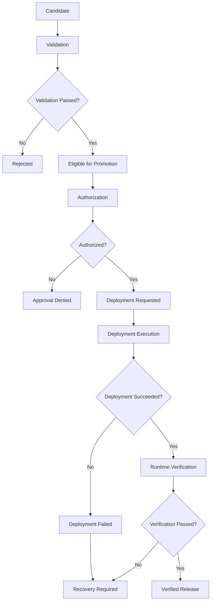

The diagram is a simplified release lifecycle.

Real systems may also have states such as:

```text
Pending

Paused

Cancelled

Superseded

Rolled Back

Rolled Forward
```

## 5.2 Why model releases as states?

Because a release should not move from any state to any other state without satisfying the relevant conditions.

For example:

```text
Candidate
    ->
Production Deployment
```

Should this be allowed?

Not if the policy requires validation and approval first.

We need transition rules.

### Example

| Current state | Requested transition | Required condition |
|---|---|---|
| Candidate | Validated | Required validation passes |
| Validated | Eligible | Artifact identity and evidence recorded |
| Eligible | Approved | Target-environment policy satisfied |
| Approved | Deployment requested | Correct artifact and environment selected |
| Deployment requested | Deployed | Deployment operation completes |
| Deployed | Verified | Required operational checks succeed |
| Deployed | Recovery required | Required checks fail |
| Verified | Superseded | A newer approved release becomes active |

### Important distinction

**A workflow completing is an execution event. A release state describes the business and operational meaning of that event.**

A GitHub Actions job might finish successfully without the release having reached a verified state.

This is why release records must distinguish requested, completed, and verified operations.

---

# 6. Release Invariants: Rules That Must Always Hold

A powerful system-design technique is to define **invariants**.

An invariant is a property that must remain true throughout the relevant system operations.

For our release process, we might define these invariants.

### Invariant 1: Every release references a specific artifact

```text
Release
    ->
Immutable Image Digest
```

Never authorize production using only an ambiguous mutable tag.

### Invariant 2: Every production release has traceable source

```text
Artifact Digest
    ->
Build Run
    ->
Source Commit
```

### Invariant 3: No production promotion without required authorization

```text
Production Promotion
    REQUIRES
Approved Release Decision
```

### Invariant 4: Environment promotion does not rebuild the artifact

```text
Development Digest
    =
Staging Digest
    =
Production Digest
```

This equality applies when those environments are promoting the **same release**.

Different environments can legitimately be on different releases at a given moment.

### Invariant 5: Failed validation must not become a successful release gate

```text
Required Validation Failed
    ->
Promotion Not Authorized
```

### Invariant 6: A release needs a recovery strategy

Before production promotion, the team should understand how to restore acceptable behavior if the release fails.

### Invariant 7: Only one authorized update should control the same release target at a time

Overlapping operations must not produce uncontrolled or ambiguous changes.

These invariants give us design constraints.

### First-principles insight

> **A reliable release pipeline is one that preserves important engineering invariants, not merely one that completes its YAML steps.**

---

# 7. Release Identity: Why Version Numbers Are Not Enough

Let's examine how we identify releases.

Suppose a product team says:

> We are deploying version 1.4.0.

What does that tell us?

It provides a useful human-readable version.

But it may not uniquely identify the exact container image.

Imagine the registry contains:

```text
ecommerce-api:v1.4.0
```

A tag can potentially be reassigned.

Therefore, a version number and an immutable artifact identity solve different problems.

## 7.1 Three types of identity

**Product version**

```text
1.4.0
```

Communicates the application's release version.

**Source revision**

```text
Git commit abc123
```

Identifies the source revision.

**Artifact identity**

```text
ghcr.io/example/ecommerce-api@sha256:<digest>
```

Identifies the published container image content.

These should be connected in the release record.

## 7.2 Release identity model

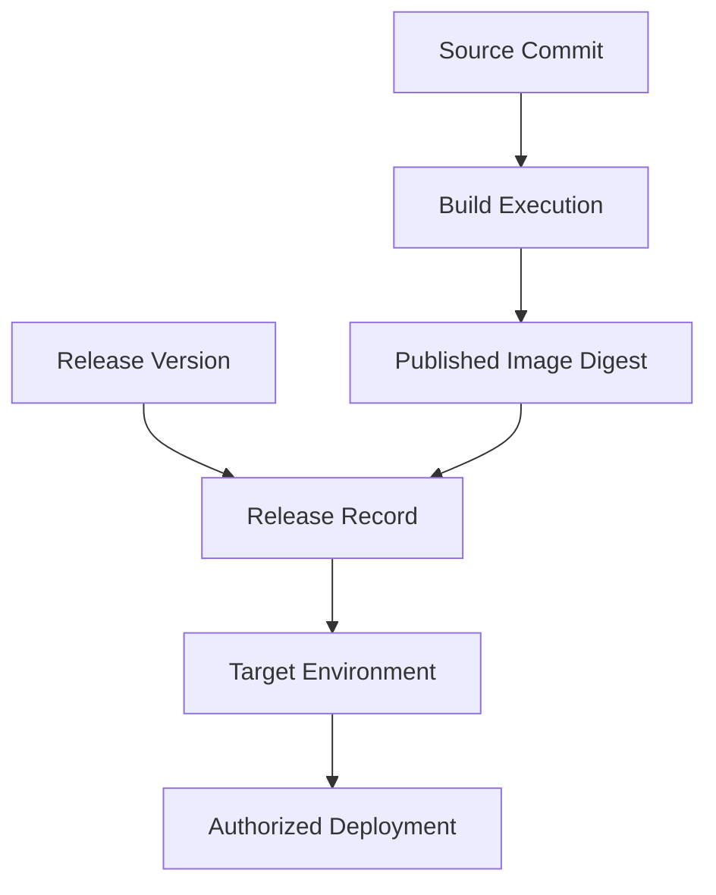

### Important principle

> **Use human-readable versions for communication, source SHAs for source traceability, and artifact digests for deployment identity.**

---

# 8. Semantic Versioning: What Does a Version Communicate?

One popular versioning scheme is Semantic Versioning.

The format is:

```text
MAJOR.MINOR.PATCH
```

For example:

```text
2.5.3
```

Semantic Versioning associates changes to major, minor, and patch numbers with compatibility expectations for a defined public API.

Conceptually:

| Version component | Intended meaning |
|---|---|
| MAJOR | Incompatible public API change |
| MINOR | Backward-compatible functionality |
| PATCH | Backward-compatible bug fix |

For example:

```text
1.4.0
    ->
1.4.1
```

May represent a bug-fix release.

```text
1.4.1
    ->
1.5.0
```

May represent new backward-compatible functionality.

```text
1.5.0
    ->
2.0.0
```

May represent an incompatible public API change.

However, this interpretation is useful only when the organization has defined the public interface and follows the versioning policy.

### Important distinction

Semantic Versioning communicates compatibility intent.

It does not:

- Identify the exact image content.
- Prove that tests passed.
- Guarantee compatibility.
- Authorize production deployment.

We still need release evidence.

The [Semantic Versioning specification](https://semver.org/) explains these version-number semantics.

---

# 9. Git Tags, GitHub Releases, and Container Images

These are three different objects.

## 9.1 Git tag

A Git tag identifies a Git object, commonly a source commit.

Example:

```bash
git tag -a v1.4.0 -m "Release 1.4.0"
```

## 9.2 GitHub Release

A GitHub Release is a repository-level release record associated with a Git tag.

It can include:

- Release notes.
- Downloadable assets.
- Release metadata.
- A human-readable release description.

GitHub documents that its Releases feature is based on Git tags. [GitHub Docs](https://docs.github.com/en/repositories/releasing-projects-on-github/about-releases?ref=maina-wycliffe-software-engineer\&utm_source=chatgpt.com)

## 9.3 Container image

A container image is the executable artifact that the runtime retrieves.

Example:

```text
ghcr.io/example/ecommerce-api@sha256:<digest>
```

## 9.4 Relationship

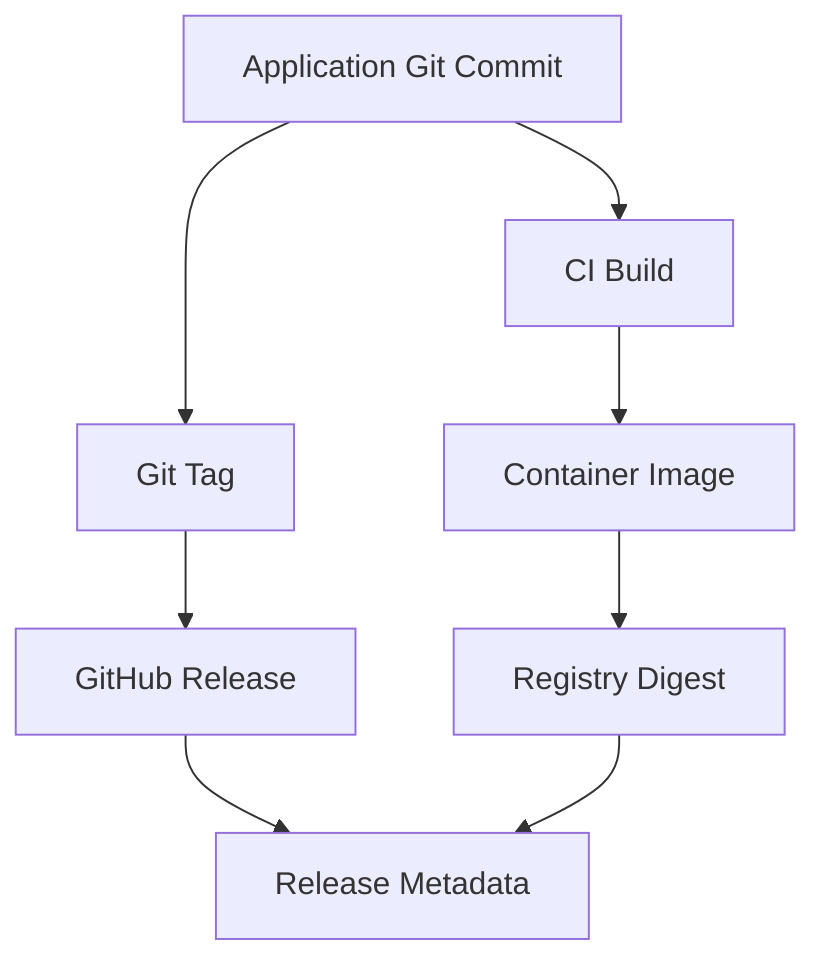

A GitHub Release does not automatically mean its corresponding container image has been deployed.

Similarly, a Docker image being published does not automatically mean a GitHub Release exists.

### Design decision for our course

We will treat the **published image digest as the deployment artifact identity**.

Git tags and GitHub Releases can provide useful versioning and human-readable release history.

The GitOps repository will determine which digest each environment should run.

---

# 10. Release Promotion: Moving an Artifact Between Environments

Now imagine CI has published:

```text
Application:
ecommerce-api

Release:
1.4.0

Image:
ghcr.io/example/ecommerce-api@sha256:<digest>
```

We have three environments:

```text
Development

Staging

Production
```

How should we introduce this artifact into those environments?

## 10.1 The incorrect mental model

A beginner may think:

```text
Build for Development
        |
        v
Build for Staging
        |
        v
Build for Production
```

But rebuilding creates a new artifact each time.

We studied this problem in Phase 07.

The stronger model is:

```text
Build Artifact Once
        |
        v
Validate in Development
        |
        v
Authorize for Staging
        |
        v
Validate in Staging
        |
        v
Authorize for Production
```

**The artifact identity remains constant during promotion.**

---

# 11. Promotion Is a Decision, Not a Rebuild

Consider this diagram.

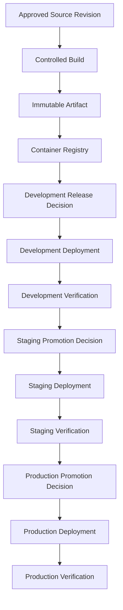

Notice something subtle.

There is only one build.

But there are multiple release decisions.

## 11.1 What changes at each environment?

The deployment intent changes.

For example:

| Environment | Selected artifact | State |
|---|---|---|
| Development | Digest AAA | Verified |
| Staging | Digest AAA | Verified |
| Production | Digest BBB | Running previous release |

This can be a perfectly valid intermediate state.

We are preparing to promote Digest AAA into production.

After production authorization and successful deployment:

| Environment | Selected artifact | State |
|---|---|---|
| Development | Digest AAA | Verified |
| Staging | Digest AAA | Verified |
| Production | Digest AAA | Verified |

### Important distinction

The environments do not always have to run the same version.

But **when promoting the same release, we should preserve the artifact identity**.

---

# 12. Promotion Requires Evidence

Suppose development successfully deployed Digest AAA.

Should staging automatically accept it?

That depends on our policy.

Suppose staging requires:

```text
Development Validation: Passed

Artifact Available: Yes

Required Test Results: Passed

Configuration Compatible: Yes
```

The release system should evaluate those conditions.

Now suppose production requires:

```text
Staging Verification: Passed

Artifact Digest: Unchanged

Database Compatibility: Confirmed

Production Approval: Granted

Recovery Plan: Available
```

We now have a more substantial authorization contract.

## 12.1 Promotion evidence

A release candidate may carry:

| Evidence | Purpose |
|---|---|
| Source SHA | Identify source |
| CI run ID | Identify validation execution |
| Image digest | Identify the artifact |
| Test results | Show configured checks completed |
| Staging validation | Show relevant deployed-environment behavior |
| Compatibility assessment | Identify dangerous version interactions |
| Release approval | Establish authorization |
| Previous stable release | Support recovery planning |

Not all evidence needs to be duplicated in a single file.

A release record can reference existing evidence using stable identifiers or links.

### Fundamental principle

> **Promotion should preserve the artifact and accumulate evidence or authorization appropriate to the next environment.**

We are not repeatedly proving that the source exists.

We are making progressively higher-impact delivery decisions.

---

# 13. Continuous Delivery vs Continuous Deployment

We introduced this distinction in Phase 01.

Now it becomes more meaningful.

## 13.1 Continuous Delivery

The team maintains software in a releasable condition.

Required validation and release preparation are automated.

Production deployment can remain an explicit authorized decision.

Example:

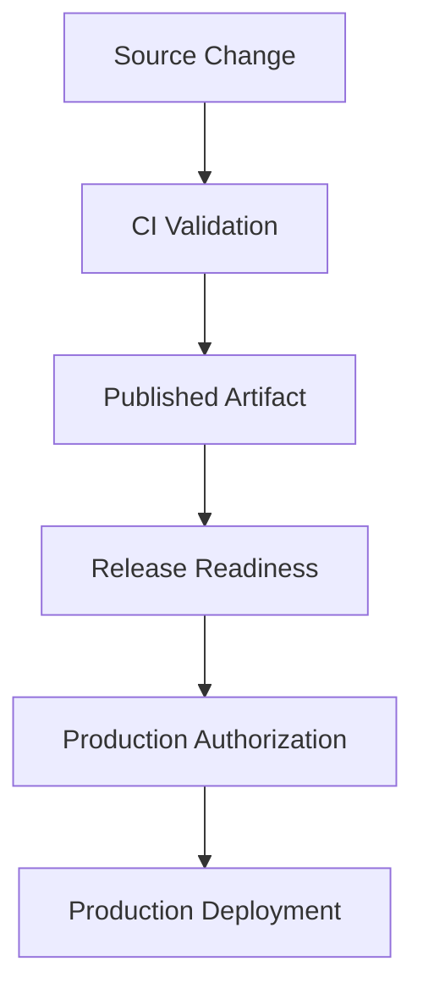

The authorization step can be manual or policy-controlled.

---

## 13.2 Continuous Deployment

Every change satisfying the required policies progresses automatically into production.

Example:

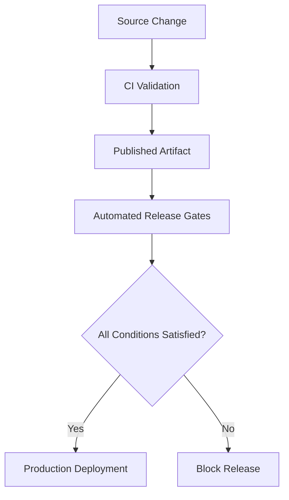

Continuous Deployment does not mean there are no gates.

The gates are automatically evaluated.

### Comparison

| Property | Continuous Delivery | Continuous Deployment |
|---|---|---|
| Software kept releasable | Yes | Yes |
| Automated validation | Yes | Yes |
| Release preparation | Automated | Automated |
| Production authorization | Can be an explicit decision | Normally automatic after policy satisfaction |
| Production deployment | On authorization | Automatically after required conditions |
| Suitable for | Teams needing controlled timing or approval | Teams with appropriate automation, confidence, and operational capabilities |

### First-principles insight

**Continuous Delivery is about maintaining release readiness. Continuous Deployment adds automatic production release under defined policies.**

---

# 14. Release Approvals Are Authorization Controls

Let's examine approvals.

Suppose the workflow has a job:

```yaml
jobs:
  production-approval:
    runs-on: ubuntu-latest
    environment: production

    steps:
      - name: Show approved artifact
        run: echo "Production promotion authorized"
```

Does this automatically require another engineer to approve the operation?

**No.**

The environment must be configured with the applicable protection rules.

## 14.1 How GitHub environments work

GitHub Actions environments can apply controls such as:

- Required reviewers.
- Deployment branch restrictions.
- Wait timers.
- Environment-specific secrets.
- Custom protection rules where available.

When a job references a protected environment, the relevant protection requirements must be satisfied before execution. [GitHub Docs](https://docs.github.com/en/actions/how-tos/deploy/configure-and-manage-deployments/control-deployments?utm_source=chatgpt.com)

### Important availability consideration

GitHub environment protection features vary by repository visibility and plan.

For example, required reviewers are available for public repositories on supported current plans, while private-repository availability is more restricted. Verify the controls available to your repository before making them a security dependency. [GitHub Docs](https://docs.github.com/en/actions/reference/workflows-and-actions/deployments-and-environments?utm_source=chatgpt.com)

Our practical lab will use Git pull requests for release approval, so it can teach the authorization process without depending entirely on environment-review features.

---

# 15. Approval Does Not Mean Testing

Imagine production approval is granted.

Does that mean the artifact is correct?

No.

Approval is an authorization decision.

Testing is a validation operation.

These responsibilities are related but different.

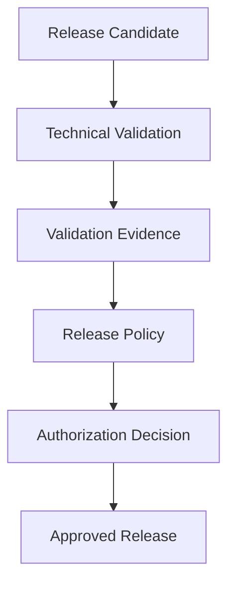

An approver should have access to the relevant evidence.

They might evaluate:

- Test results.
- Release changes.
- Database compatibility.
- Known risks.
- Proposed deployment timing.
- Recovery readiness.

### Separation of duties

A team may decide that:

```text
Developer
    ->
Creates Software
```

```text
CI System
    ->
Validates Software
```

```text
Release Approver
    ->
Authorizes Production Promotion
```

```text
Argo CD
    ->
Executes Approved Deployment Intent
```

This is not mandatory for every small project.

But for higher-risk systems, separating responsibilities can limit the impact of individual mistakes or compromised identities.

### Security insight

> **Permission to publish a container image must not automatically become permission to deploy that image to production.**

---

# 16. Release Timing: Why Not Every Change Should Deploy Immediately

Imagine your application processes financial transactions.

A new release includes a major database migration.

Even if testing passes, the organization might prefer a specific deployment window.

Why?

Because release timing affects operational risk.

Possible considerations include:

- Expected user traffic.
- Support-team availability.
- Maintenance restrictions.
- External provider schedules.
- Business events.
- Database migration duration.
- Recovery staffing.

A technically valid release may still require operational coordination.

## 16.1 Release strategies

**Continuous release:** Eligible changes can be promoted frequently.

**Scheduled release:** Eligible changes are deployed during selected windows.

**Release train:** Changes ready by a planned cutoff are included in a scheduled release; others wait for the next train.

**Emergency release:** A critical issue follows an expedited, separately defined procedure.

### Trade-offs

| Strategy | Advantage | Potential disadvantage |
|---|---|---|
| Continuous release | Shorter waiting time | Requires mature validation and operations |
| Scheduled release | Predictable coordination | Adds waiting time |
| Release train | Easier cross-team coordination | Can accumulate release scope |
| Emergency release | Faster critical recovery | Increased pressure and change risk |

### Engineering principle

**Release frequency is an organizational and architectural choice, not something the CI tool should determine accidentally.**

---

# 17. Release Concurrency: Two Versions Competing for Production

Now consider a real production scenario.

Release A is approved.

It begins deploying.

Before verification finishes, Release B is also approved.

What happens if both operations modify the same Kubernetes workload?

Potential problems include:

- Conflicting desired configurations.
- Ambiguous deployment status.
- Verification evaluating the wrong release.
- A newer release replacing an older one before its rollout completes.
- Recovery operations racing with promotion.

We need release coordination.

## 17.1 The underlying invariant

For a particular production application:

> Only one controlled release transition should be active at a time, unless the delivery architecture explicitly supports overlapping rollouts.

## 17.2 Release serialization

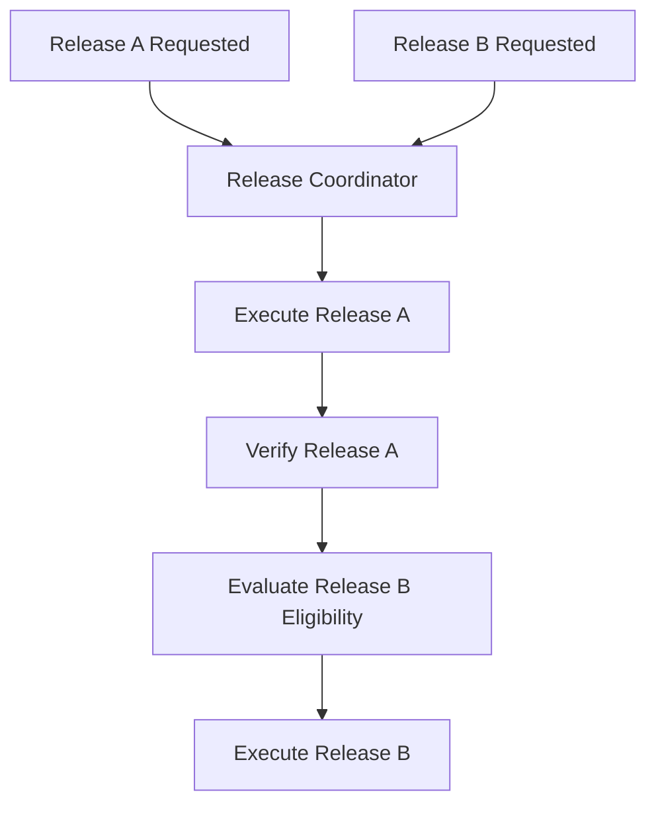

### GitHub Actions concurrency

GitHub Actions supports concurrency groups.

For example:

```yaml
concurrency:
  group: production-ecommerce-api
  cancel-in-progress: false
  queue: max
```

This illustrates how to serialize workflow executions.

Current GitHub Actions documentation describes `queue: max` as allowing multiple pending executions, subject to a queue limit, rather than replacing earlier pending runs by default. It also explains that ordering is based on when executions enter the queue, not necessarily when they were originally dispatched. [GitHub Docs](https://docs.github.com/en/actions/how-tos/write-workflows/choose-when-workflows-run/control-workflow-concurrency?trk=article-ssr-frontend-pulse_little-text-block\&utm_source=chatgpt.com)

### Important caveat

A GitHub Actions concurrency group only coordinates applicable workflow runs or jobs.

It does not independently coordinate every external system.

If another actor modifies the GitOps repository or directly changes Kubernetes, the workflow's concurrency group does not prevent that change.

A production-grade release system must define which component is authoritative for release coordination.

---

# 18. Idempotency: What Happens When a Release Is Retried?

This is one of the most important system-design concepts.

Imagine an authorized workflow executes:

```text
Promote Digest AAA to Staging
```

The workflow sends the request.

Then the network connection fails.

Did the operation succeed?

We don't know.

What happens if we retry?

A poorly designed release system may create duplicate or conflicting operations.

## 18.1 Define idempotency

An operation is idempotent when applying it multiple times has the same intended effect as applying it once.

Conceptually:

```text
Set Desired Image = Digest AAA
```

Repeated execution should leave the desired image as Digest AAA.

Compare that with:

```text
Increment Release Number
```

Repeated execution could produce different values.

The first is naturally easier to make idempotent.

---

## 18.2 Declarative desired-state changes

Imagine our GitOps manifest contains:

```yaml
containers:
  - name: api
    image: ghcr.io/example/ecommerce-api@sha256:aaaaaaaaaaaaaaaaaaaaaaaaaaaaaaaaaaaaaaaaaaaaaaaaaaaaaaaaaaaaaaaa
```

An authorized process requests the same digest again.

If the desired configuration already contains that digest, the operation can report:

```text
Already at Requested Artifact
```

There is no need to create a new release solely because the request was repeated.

### Why is this valuable?

Distributed workflows experience:

- Timeouts.
- Lost acknowledgments.
- Runner interruptions.
- API failures.
- Duplicate events.
- Human retries.

Idempotent operations make retries safer.

### Important qualification

Even when the desired-state update is idempotent, the complete deployment may have non-idempotent side effects.

For example:

- Database migrations.
- External notifications.
- Payment transactions.
- Background jobs.

Therefore, release idempotency must include the behavior of relevant side effects.

### First-principles insight

> **Design release operations so that repeating a request cannot silently create a different or more dangerous outcome.**

---

# 19. The Difficult Problem: Database Migrations

Now we reach one of the most important real-world release engineering challenges.

Suppose version `v1` expects this database schema:

```sql
CREATE TABLE orders (
  id INTEGER PRIMARY KEY,
  total_cents INTEGER NOT NULL
);
```

Version `v2` changes the application to use:

```text
amount_cents
```

The team plans to rename the database column.

A beginner might create a migration:

```sql
ALTER TABLE orders
RENAME COLUMN total_cents TO amount_cents;
```

Then deploy the new application.

But what happens during a rolling deployment?

For some period, both application versions may exist.

```text
Old Pods:
Expect total_cents

New Pods:
Expect amount_cents
```

A direct column rename can break the old application before all old Pods have stopped.

### Fundamental problem

**Application releases and database schema changes are not necessarily atomic.**

They may complete at different times.

This is a compatibility problem.

---

# 20. Expand–Migrate–Contract: A Safer Evolution Strategy

One common approach to schema evolution is to separate breaking changes into compatible stages.

## 20.1 Expand

Introduce the new schema without immediately removing the old one.

For example:

```sql
ALTER TABLE orders
ADD COLUMN amount_cents INTEGER;
```

At this stage, both columns exist.

But merely adding the column is not sufficient.

We need to plan how new and old application versions read and write data.

---

## 20.2 Migrate

Introduce application behavior that can operate safely during the transition.

Depending on the design, this may involve:

- Writing both representations temporarily.
- Reading the new representation with a fallback.
- Backfilling existing data.
- Validating consistency.
- Making operations safe under concurrent requests.

The implementation must account for the application's transaction and data-consistency requirements.

---

## 20.3 Contract

Only after the old application version no longer depends on the old schema should the team remove it.

For example:

```sql
ALTER TABLE orders
DROP COLUMN total_cents;
```

This should happen only after confirming that the column is no longer required by any supported application version, background worker, reporting process, or recovery scenario.

### Architecture

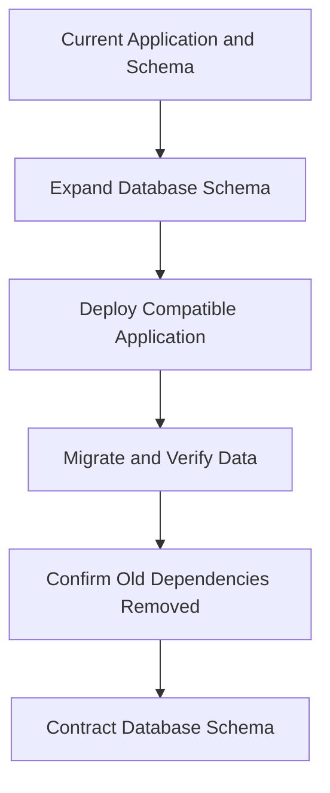

### Why does this matter?

Because rolling deployments and database migrations can overlap.

A release must consider the compatibility of:

```text
Old Application + New Schema

New Application + New Schema

Old Application + Partially Migrated Data

New Application + Partially Migrated Data
```

Not every combination will be relevant, but the team should identify which combinations can actually occur.

### Most important principle

> **A reliable release plan must account for the coexistence of software versions and data states during the transition.**

---

# 21. Rollback Is Not Always Safe

Imagine we deploy application `v2`.

Production fails.

The team decides to return to `v1`.

If the release changed only the application image, a previous image digest may be sufficient to restore the old application.

But what if `v2` also changed the database schema?

The old application may no longer understand the current database.

Now rollback can fail.

## 21.1 Application rollback vs system rollback

**Application rollback:**

Restore a previous executable artifact.

**System recovery:**

Restore acceptable behavior across all affected components and data.

These are not always equivalent.

For example:

```text
Application v2
    +
Database Schema v2
```

Returning to:

```text
Application v1
    +
Database Schema v2
```

may be incompatible.

### Recovery options

Depending on the failure, engineers may choose:

- Revert the application image.
- Roll forward with a corrective release.
- Apply a compatible configuration change.
- Disable a feature.
- Repair or migrate data.
- Restore data from backups under a defined recovery procedure.

### Why not automatically reverse every database migration?

Because down migrations can be destructive or fail to reconstruct lost information.

Dropping or renaming columns can also affect data written while the new version was active.

### Engineering principle

**Do not promise automatic rollback without analyzing application, configuration, database, and external side effects.**

---

# 22. Rollback vs Roll-Forward

These strategies solve different problems.

## Rollback

Restore a previously approved release or configuration.

Example:

```text
Production Digest:
BBB
```

A failure occurs.

Restore:

```text
Production Digest:
AAA
```

Advantages:

- May provide quick recovery.
- Reuses a previously known artifact.
- Can reduce investigation pressure.

Risks:

- Data may have changed.
- Database schema may be incompatible.
- Old dependencies may no longer be available.
- External side effects cannot always be reversed.

---

## Roll-forward

Create or select a corrected release.

Example:

```text
Version 2.0:
Defective
```

Fix the issue:

```text
Version 2.0.1:
Corrected
```

Advantages:

- Can preserve necessary forward-only schema changes.
- May be safer when rollback is incompatible.
- Avoids returning to software that cannot interpret current data.

Risks:

- Requires new validation.
- The fix may introduce additional defects.
- Development and delivery may take longer than restoring a known artifact.

---

## 22.1 Decision process

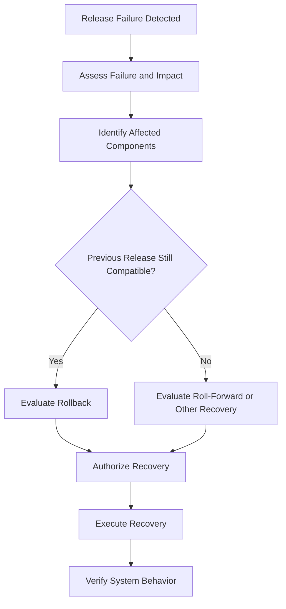

In urgent incidents, engineers may need to take protective action before completing the full diagnosis.

The release system should support safe, authorized recovery rather than assuming every failure follows the same path.

---

# 23. GitOps Recovery Has an Important Special Rule

In our reference architecture:

```text
GitOps Repository
       |
       v
Argo CD
       |
       v
Kubernetes
```

Git records the approved desired state.

Suppose production currently references Digest BBB.

We want to return to Digest AAA.

A GitOps-oriented recovery method is to create an authorized change restoring the previous image reference.

```text
GitOps Desired State:
Digest BBB
```

Becomes:

```text
GitOps Desired State:
Digest AAA
```

Argo CD can then reconcile the approved state according to its synchronization policy.

### Important nuance

Argo CD documentation states that its built-in application rollback operation is not available while automated synchronization is enabled.

In an automated GitOps workflow, updating or reverting the authoritative Git configuration is the usual way to express the intended recovery state. [Argo CD](https://argo-cd.readthedocs.io/en/stable/user-guide/auto_sync/?utm_source=chatgpt.com)

### Why is this important?

Because directly changing the live cluster while Git still specifies Digest BBB can create a conflict.

Argo CD may later reconcile the cluster back toward the Git-defined state.

### First-principles insight

> **Recovery must update the authoritative desired state, not merely create a temporary live-state change that the reconciliation system may undo.**

We will explore the precise behavior of Argo CD in Phase 11.

---

# 24. Complete Release Engineering Architecture

We now have the concepts necessary to design our release system.

Let's identify the components.

## 24.1 Components and responsibilities

| Component | Responsibility |
|---|---|
| Application Git repository | Stores source history |
| GitHub Actions CI | Produces validation evidence |
| Build system | Produces container artifact |
| GHCR | Stores and distributes images |
| Release record | Connects artifact, evidence, and decisions |
| Release policy | Determines promotion eligibility |
| GitOps repository | Stores approved deployment intent |
| Git review process | Authorizes deployment configuration changes |
| Argo CD | Reconciles approved desired configuration |
| Kubernetes | Maintains runtime workloads |
| Monitoring | Provides operational feedback |

## 24.2 The complete architecture

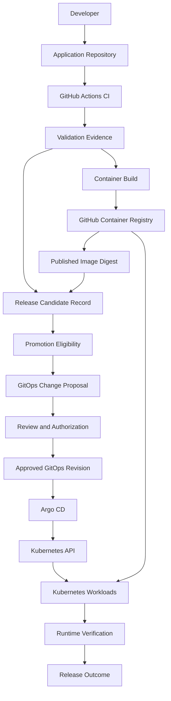

There are three important paths.

### Artifact path

```text
Source
    ->
Build
    ->
Registry
    ->
Runtime
```

### Authorization path

```text
Validation Evidence
    ->
Release Eligibility
    ->
Review
    ->
Approved GitOps Configuration
```

### Control path

```text
GitOps Repository
    ->
Argo CD
    ->
Kubernetes
```

These paths serve different purposes.

**Artifact distribution is not authorization.**

**Authorization is not deployment execution.**

**Deployment execution is not runtime verification.**

---

# 25. Release Records: The Missing Link in Many CI/CD Projects

Imagine production has a failure.

The incident responder asks:

> What exactly changed in the last release?

A deployment timestamp alone is insufficient.

We need a release record.

## 25.1 Example release record

```json
{
  "release": "1.4.0",
  "application": "ecommerce-api",
  "sourceRevision": "abc123",
  "buildRunId": "10542",
  "artifact": {
    "registry": "ghcr.io/example/ecommerce-api",
    "digest": "sha256:aaaaaaaaaaaaaaaaaaaaaaaaaaaaaaaaaaaaaaaaaaaaaaaaaaaaaaaaaaaaaaaa"
  },
  "targetEnvironment": "production",
  "previousRelease": "1.3.2",
  "validation": {
    "ci": "passed",
    "staging": "passed"
  },
  "authorization": {
    "status": "approved",
    "reference": "GitOps pull request 42"
  }
}
```

This is illustrative data, not a real release record.

### What does it communicate?

- Which application is being released?
- Which artifact was selected?
- Which source revision produced it?
- Which validation evidence exists?
- Which environment is targeted?
- Which approval authorized promotion?
- Which previous release might be useful during recovery?

## 25.2 Why not just use Git history?

Git history provides source history.

But release history must also connect:

```text
Source
    +
Artifact
    +
Environment
    +
Authorization
    +
Observed Outcome
```

A Git commit cannot tell us all of those things by itself.

### Fundamental principle

> **A release record provides traceability across the boundary between software construction and operational deployment.**

---

# 26. What Makes a Release Record Trustworthy?

Suppose someone manually writes:

```json
{
  "ci": "passed",
  "staging": "passed",
  "approved": true
}
```

Is this proof that staging validation actually passed?

No.

The JSON contains claims.

But those claims need supporting evidence.

For a stronger production system, release metadata should link to:

- Actual CI workflow runs.
- Published registry digests.
- Actual test results.
- GitOps review history.
- Deployment status.
- Runtime verification records.

Some evidence may be authenticated, signed, or produced by a trusted automation system.

### Important distinction

**A release record organizes evidence. It does not magically make its contents trustworthy.**

A reviewable release document is useful.

But a production release policy should not treat arbitrary self-reported fields as independent proof.

---

# 27. Practical Lab 09 — Design and Execute a Release-Promotion Process

We will now build a release engineering lab.

This lab is intentionally different from the previous two.

In Phases 07 and 08, we built and published container images.

In Phase 09, we will **reuse already-published images**.

That is the entire point.

We will not build another image while promoting an existing release.

### Platforms

- GitHub.
- GitHub Container Registry.
- Git.
- Python.
- Kustomize through `kubectl`.
- GitHub pull requests.

### Infrastructure cost

No Kubernetes cluster or paid cloud infrastructure is required for the release-design portion.

The lab works locally for configuration preparation and validation.

GitHub is optional for the first part but is needed to practice a real pull-request authorization flow.

## 27.1 What will we build?

Two repositories:

```text
ci-artifact-lab/
```

This is our application repository from Phase 07.

And:

```text
release-gitops-lab/
```

This will store intended deployment configuration for:

```text
Development

Staging

Production
```

We will use an existing GHCR image digest from Phase 07 or 08.

For the full promotion and recovery exercise, ideally have **two real published image digests**:

```text
Digest A:
Previously published version

Digest B:
Newly published version
```

If you have only one image digest, you can complete the configuration and validation sections first. The later promotion-difference and rollback experiments require a second previously published artifact.

---

# 28. Lab Requirements — Think Before Implementation

## 28.1 Functional requirements

**REL-01:** Every environment must identify a specific container image digest.

**REL-02:** Development, staging, and production must use the same application image repository.

**REL-03:** Staging promotion must select an artifact already selected for development.

**REL-04:** Production promotion must select an artifact already selected for staging.

**REL-05:** Promotion must not rebuild the application.

**REL-06:** Production promotion must require an explicit authorization process.

**REL-07:** Every promotion must produce an inspectable Git change.

**REL-08:** Recovery must be expressible as a change to the authoritative configuration.

**REL-09:** Configuration must be renderable without deploying it.

**REL-10:** CI must not require direct Kubernetes credentials.

### Important scope limitation

The lab will demonstrate the release-decision and configuration side.

It will not prove that an AKS deployment or staging runtime verification succeeded.

Those require an actual runtime environment and operational evidence, which we will cover in subsequent phases.

---

# 29. Lab Architecture

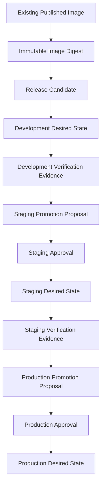

In this lab, evidence collection and approvals can initially be represented by manual verification and review records.

In a production system, those would be backed by actual environment checks and enforced automation or policies.

---

# 30. Lab Part A — Create the GitOps Repository

Create a directory:

```bash
mkdir release-gitops-lab

cd release-gitops-lab
```

Create the structure:

```bash
mkdir -p \
  applications/ecommerce-api/base \
  applications/ecommerce-api/overlays/dev \
  applications/ecommerce-api/overlays/staging \
  applications/ecommerce-api/overlays/production \
  scripts \
  releases
```

The resulting repository will look like:

```text
release-gitops-lab/
│
├── applications/
│   └── ecommerce-api/
│       │
│       ├── base/
│       │   ├── deployment.yaml
│       │   ├── service.yaml
│       │   └── kustomization.yaml
│       │
│       └── overlays/
│           ├── dev/
│           │   └── kustomization.yaml
│           │
│           ├── staging/
│           │   └── kustomization.yaml
│           │
│           └── production/
│               └── kustomization.yaml
│
├── scripts/
│   └── promote.py
│
└── releases/
```

### Why this structure?

The base directory describes common application resources.

Each environment overlay describes its intended variations.

The promotion script modifies environment-specific image selection.

The releases directory can preserve release notes and supporting references.

This structure separates:

```text
Common Application Deployment Structure
```

From:

```text
Environment-Specific Release Decisions
```

---

# 31. Lab Part B — Create the Base Deployment

Create:

```text
applications/ecommerce-api/base/deployment.yaml
```

Add:

```yaml
apiVersion: apps/v1
kind: Deployment
metadata:
  name: ecommerce-api
spec:
  replicas: 1
  selector:
    matchLabels:
      app: ecommerce-api
  template:
    metadata:
      labels:
        app: ecommerce-api
    spec:
      containers:
        - name: api
          image: app-image-placeholder
          ports:
            - name: http
              containerPort: 3000
          readinessProbe:
            httpGet:
              path: /health
              port: http
            initialDelaySeconds: 2
            periodSeconds: 5
          resources:
            requests:
              cpu: 50m
              memory: 64Mi
            limits:
              cpu: 500m
              memory: 256Mi
```

### Why use an image placeholder?

Because the base describes the application workload independently from the exact release artifact.

Each overlay will replace the placeholder with an actual image digest.

The base is not intended to be deployed directly without an environment overlay.

### Why include a readiness probe?

Because starting a container is not the same as establishing that it can accept traffic.

The readiness probe evaluates the application's `/health` endpoint.

This endpoint is simple, and it does not verify every business dependency.

More comprehensive readiness design depends on the application.

---

# 32. Lab Part C — Create the Service

Create:

```text
applications/ecommerce-api/base/service.yaml
```

Add:

```yaml
apiVersion: v1
kind: Service
metadata:
  name: ecommerce-api
spec:
  selector:
    app: ecommerce-api
  ports:
    - name: http
      port: 80
      targetPort: 3000
  type: ClusterIP
```

This Service describes internal Kubernetes access to the application.

We are not deploying it during this phase.

It exists so the GitOps repository contains a realistic application deployment structure.

---

# 33. Lab Part D — Create the Base Kustomization

Create:

```text
applications/ecommerce-api/base/kustomization.yaml
```

Add:

```yaml
apiVersion: kustomize.config.k8s.io/v1beta1
kind: Kustomization

resources:
  - deployment.yaml
  - service.yaml
```

This tells Kustomize which resources belong to the application base.

Kustomize can compose and modify Kubernetes resources without requiring us to duplicate every manifest for every environment. [Kubernetes](https://kubernetes.io/docs/tasks/manage-kubernetes-objects/kustomization/?utm_source=chatgpt.com)

### Important concept

**Kustomize is a configuration composition mechanism.**

It is not itself a production release approval system.

It does not automatically decide which application version is permitted for production.

That remains a release policy decision.

---

# 34. Lab Part E — Configure the Environment Overlays

We now need image references for each environment.

Use the image produced in Phase 07 or 08.

For example:

```text
ghcr.io/YOUR-OWNER/ci-artifact-lab@sha256:<digest>
```

Replace `YOUR-OWNER` and the digest with your actual values.

For this exercise, we'll use environment variables.

```bash
export IMAGE_NAME="ghcr.io/YOUR-OWNER/ci-artifact-lab"
```

Set a real published digest:

```bash
export DIGEST_A="sha256:YOUR_64_CHARACTER_DIGEST"
```

Verify its format:

```bash
[[ "$DIGEST_A" =~ ^sha256:[0-9a-f]{64}$ ]] \
  && echo "Digest format valid"
```

This checks syntax only.

It does not prove the registry contains that artifact.

To verify registry availability, use an authenticated registry inspection when necessary:

```bash
docker buildx imagetools inspect \
  "${IMAGE_NAME}@${DIGEST_A}"
```

If the image is private, configure appropriate registry authentication before running this command.

---

## 34.1 Create the overlays

Run:

```bash
for ENV in dev staging production; do

  cat > "applications/ecommerce-api/overlays/${ENV}/kustomization.yaml" <<EOF
apiVersion: kustomize.config.k8s.io/v1beta1
kind: Kustomization

namespace: ecommerce-${ENV}

resources:
  - ../../base

images:
  - name: app-image-placeholder
    newName: ${IMAGE_NAME}
    digest: ${DIGEST_A}
EOF

done
```

All three environments initially reference the same known artifact.

This is an initial configuration baseline, not proof that those environments have been deployed or verified.

### Why use `digest`?

Because the environment should identify specific image content rather than depend on a mutable tag.

### Why use `namespace`?

Because the target Kubernetes namespaces are different.

For example:

```text
ecommerce-dev

ecommerce-staging

ecommerce-production
```

These namespaces must exist or be managed separately before a real deployment can succeed.

---

# 35. Lab Part F — Render the Desired Deployment Configurations

Now verify the configuration.

You need `kubectl` with Kustomize support.

Run:

```bash
kubectl kustomize \
  applications/ecommerce-api/overlays/dev
```

Then:

```bash
kubectl kustomize \
  applications/ecommerce-api/overlays/staging
```

And:

```bash
kubectl kustomize \
  applications/ecommerce-api/overlays/production
```

These commands render manifests locally.

They do not apply Kubernetes resources.

### What should you observe?

The rendered Deployment should contain the selected image digest.

For example:

```yaml
containers:
  - name: api
    image: ghcr.io/YOUR-OWNER/ci-artifact-lab@sha256:YOUR_ACTUAL_DIGEST
```

And the target namespace should correspond to the selected overlay.

### Engineering questions

1. Did the application image rebuild?
2. Did the registry receive a new artifact?
3. Did you need cluster-admin credentials?
4. Can the same artifact be represented in three environment configurations?

The important answer:

**We are managing release configuration, not rebuilding software.**

---

# 36. Lab Part G — Create a Controlled Promotion Script

Now let's introduce a second release.

Suppose:

```text
Digest A:
Previously approved application

Digest B:
Newly published application
```

Our objective is to promote Digest B progressively.

We want the script to preserve these rules:

```text
Staging may select Digest B
only after Development selects Digest B.
```

```text
Production may select Digest B
only after Staging selects Digest B.
```

This is a simplified eligibility condition.

It is not sufficient to prove runtime verification. In production, actual development and staging evidence must also be required.

## 36.1 Create the promotion script

Create:

```text
scripts/promote.py
```

Add:

```python
#!/usr/bin/env python3

import argparse
import re
from pathlib import Path

ROOT = Path(__file__).resolve().parents[1]

OVERLAYS = (
    ROOT
    / "applications"
    / "ecommerce-api"
    / "overlays"
)

PREVIOUS_ENVIRONMENT = {
    "dev": None,
    "staging": "dev",
    "production": "staging",
}

DIGEST_PATTERN = re.compile(
    r"^sha256:[0-9a-f]{64}$"
)

YAML_DIGEST_PATTERN = re.compile(
    r"(?m)^(\s*digest:\s*)"
    r"(sha256:[0-9a-f]{64})\s*$"
)


def overlay_path(environment: str) -> Path:
    return OVERLAYS / environment / "kustomization.yaml"


def read_digest(environment: str) -> str:
    content = overlay_path(environment).read_text()

    matches = YAML_DIGEST_PATTERN.findall(content)

    if len(matches) != 1:
        raise ValueError(
            f"{environment}: expected exactly one image digest"
        )

    return matches[0][1]


def update_digest(environment: str, digest: str) -> None:
    path = overlay_path(environment)

    content = path.read_text()

    updated, count = YAML_DIGEST_PATTERN.subn(
        lambda match: match.group(1) + digest,
        content,
    )

    if count != 1:
        raise ValueError(
            f"{environment}: cannot uniquely update image digest"
        )

    if updated == content:
        print(f"{environment}: already references {digest}")
        return

    path.write_text(updated)

    print(f"{environment}: selected {digest}")


def main() -> None:
    parser = argparse.ArgumentParser(
        description="Prepare a release promotion change"
    )

    parser.add_argument(
        "environment",
        choices=PREVIOUS_ENVIRONMENT.keys(),
    )

    parser.add_argument(
        "digest",
        help="Published image digest",
    )

    args = parser.parse_args()

    if not DIGEST_PATTERN.fullmatch(args.digest):
        parser.error(
            "Digest must be sha256 followed by 64 lowercase hex characters"
        )

    previous_environment = PREVIOUS_ENVIRONMENT[
        args.environment
    ]

    if previous_environment is not None:
        previous_digest = read_digest(
            previous_environment
        )

        if previous_digest != args.digest:
            raise SystemExit(
                "Promotion rejected: "
                f"{previous_environment} does not select "
                "the requested digest"
            )

    update_digest(
        args.environment,
        args.digest,
    )

    print(
        "Configuration prepared. "
        "Review and authorization are still required."
    )


if __name__ == "__main__":
    main()
```

### What does this script do?

It:

1. Accepts a target environment.
2. Accepts an immutable image digest.
3. Validates the digest format.
4. Checks the previous environment's selected digest where required.
5. Updates the requested environment overlay.
6. Avoids modifying the file when the selected digest is already present.

### What does it deliberately not do?

It does not:

- Build a Docker image.
- Publish an image.
- Authenticate to Kubernetes.
- Modify a cluster.
- Approve a production release.
- Verify a running staging deployment.
- Prove that the artifact exists in the registry.

These responsibilities belong to other components.

### Important limitation

The script uses a targeted text replacement appropriate to this intentionally small, fixed-format lab.

For a larger GitOps repository, use a proper YAML-aware configuration tool and validation process.

---

# 37. Lab Part H — Prepare Development Promotion

Now obtain the second published digest.

```bash
export DIGEST_B="sha256:YOUR_SECOND_64_CHARACTER_DIGEST"
```

Ensure it represents an actual image published through your CI release pipeline.

First verify that it exists:

```bash
docker buildx imagetools inspect \
  "${IMAGE_NAME}@${DIGEST_B}"
```

Now prepare development promotion:

```bash
python3 scripts/promote.py dev "$DIGEST_B"
```

Expected conceptual output:

```text
dev: selected sha256:<digest-B>

Configuration prepared.
Review and authorization are still required.
```

Check the change:

```bash
git diff
```

The image digest in the development overlay should change from Digest A to Digest B.

No other environment has changed.

### What does this mean?

Development's desired configuration now selects the new artifact.

It does not mean the artifact has already been deployed.

Without a connected GitOps controller and cluster, this is a configuration change only.

---

# 38. Lab Part I — Attempt Production Promotion Too Early

Now run:

```bash
python3 scripts/promote.py production "$DIGEST_B"
```

What should happen?

The script checks the staging overlay.

Staging still references Digest A.

Therefore, the promotion is rejected.

Conceptually:

```text
Production Promotion Requested
              |
              v
Check Staging Artifact
              |
              v
Staging Does Not Select Digest B
              |
              v
Reject Promotion Preparation
```

### Why is this useful?

Because we have converted a release-ordering assumption into an explicit rule.

The script prevents an accidental direct change from Digest A to Digest B through this particular command.

### Important security limitation

A person who can directly edit and merge the production manifest may bypass the script.

Therefore, the true authorization boundary is not the script alone.

Repository permissions, required checks, and review policies must enforce the release process.

---

# 39. Lab Part J — Promote to Staging

After development validation has been performed and recorded under the intended policy, prepare staging promotion.

Run:

```bash
python3 scripts/promote.py staging "$DIGEST_B"
```

The script should now accept the requested digest because development selects Digest B.

Inspect:

```bash
git diff
```

Then render staging configuration:

```bash
kubectl kustomize \
  applications/ecommerce-api/overlays/staging
```

Confirm the image reference.

### What have we accomplished?

We have selected the same artifact for staging.

We have not rebuilt the application.

We have not changed its image digest.

We have only changed staging's desired deployment configuration.

### What still needs to happen in a real system?

The staging configuration must be authorized and deployed.

Staging validation must produce actual evidence.

That evidence might include:

```text
Argo CD Synchronization Status

Kubernetes Deployment Readiness

Application Smoke Tests

Critical API Tests

Database Compatibility Results
```

These cannot be inferred from a successful YAML render.

---

# 40. Lab Part K — Prepare a Production Release Record

Before preparing production promotion, create a release note.

File:

```text
releases/release-1.4.0.md
```

Example:

```markdown
# Release 1.4.0

## Release Identity

Application: ecommerce-api

Source Revision: <actual-source-sha>

Image Repository: ghcr.io/YOUR-OWNER/ci-artifact-lab

Image Digest: sha256:<actual-digest>

CI Workflow Run: <actual-run-url>

## Validation Evidence

- Source validation: <link>
- Image publication: <link>
- Published artifact smoke test: <link>
- Development verification: <link or pending>
- Staging verification: <link or pending>

## Release Impact

Describe the application changes and expected behavior.

## Database Compatibility

Describe whether database schema changes are required.

## Recovery Plan

Previous approved digest: sha256:<previous-digest>

State whether the previous application remains compatible
with the current database and environment configuration.

## Production Authorization

Review reference: <GitOps pull request>

Approver: <record after approval>

## Deployment Outcome

Not deployed.

## Runtime Verification

Pending actual production deployment.
```

### Why create this record?

Because we want production reviewers to understand:

- What will change.
- Which artifact is selected.
- Which validation results support it.
- Whether database compatibility has been considered.
- What recovery options exist.

### Important distinction

This is a **proposed release record**.

It must not claim that production is deployed or verified before those operations happen.

In a real system, the final outcome would be recorded using deployment and monitoring evidence.

---

# 41. Lab Part L — Prepare Production Promotion

Once the staging verification requirements have actually been satisfied, prepare the production change.

Run:

```bash
python3 scripts/promote.py production "$DIGEST_B"
```

The script checks whether staging selects the same digest.

If it does, production's desired image reference is updated.

Now inspect:

```bash
git diff
```

Render production:

```bash
kubectl kustomize \
  applications/ecommerce-api/overlays/production
```

The output should reference Digest B.

### Important distinction

**The promotion script checks image consistency, not staging verification.**

The release record and approval process must supply and evaluate the required staging evidence.

For a stronger implementation, a policy engine could verify authenticated staging test records before permitting the production change.

We will not invent that evidence in this lab.

---

# 42. Record Promotion Decisions in Git

Before using `git diff` in the earlier lab steps, initialize and commit the repository baseline.

This setup belongs immediately after Part E, once the initial environment overlays have been created, and **before** running the first promotion command in Part H.

## 42.1 Initialize the repository

```bash
git init -b main

git add .

git commit -m "chore: establish initial release configuration"
```

Now Git can compare promotion changes against a recorded baseline.

If you already executed the promotion script before initializing Git, you can still initialize the repository, but the initial commit will contain the current file contents. For the full experiment, restore Digest A in the overlays before recording the baseline.

## 42.2 Record development promotion

After selecting Digest B in development:

```bash
git diff
```

Then:

```bash
git add applications/ecommerce-api/overlays/dev/

git commit -m "release(dev): select new image digest"
```

## 42.3 Record staging promotion

After the required development validation has actually been completed:

```bash
git add applications/ecommerce-api/overlays/staging/

git commit -m "release(staging): promote validated digest"
```

## 42.4 Record production promotion

After the required staging validation has actually been completed:

```bash
git add \
  applications/ecommerce-api/overlays/production/ \
  releases/release-1.4.0.md

git commit -m "release(production): propose approved digest"
```

These are examples of logical Git changes.

### Important distinction

A local Git commit records a proposed state change.

It is not a substitute for production authorization.

In a real GitOps repository, environment promotions should follow the relevant repository policies before becoming part of the authoritative deployment branch.

### Architecture

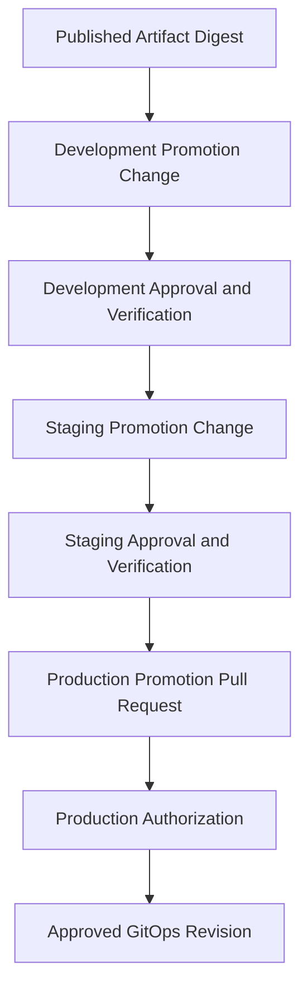

For this offline lab, Git history can record the configuration changes, but it must not be presented as evidence that live environments have been successfully deployed.

---

# 43. GitHub Pull Requests as Release Authorization

Now let's connect the lab to an actual repository review workflow.

For this part, use the GitOps repository you created.

You can create an empty GitHub repository and push the initial configuration.

For example:

```bash
gh repo create release-gitops-lab \
  --public \
  --source=. \
  --remote=origin
```

Then push the initial branch:

```bash
git push -u origin main
```

If the GitHub repository already exists, configure the appropriate remote instead.

## 43.1 The recommended release process

For a production-style process, treat each environment promotion as a separate change.

```text
Development Promotion PR
          |
          v
Approval and Merge
          |
          v
Development Deployment and Verification
          |
          v
Staging Promotion PR
          |
          v
Approval and Merge
          |
          v
Staging Deployment and Verification
          |
          v
Production Promotion PR
          |
          v
Production Authorization
          |
          v
Approved Production Configuration
```

We will implement the complete automation of this model in later phases.

For now, the goal is to understand where authorization belongs.

---

## 43.2 Create a production promotion pull request

In a real sequence, start from the latest authorized `main` containing the verified development and staging promotions.

Create a feature branch:

```bash
git switch main

git pull --ff-only origin main

git switch -c release/production-1.4.0
```

Prepare the production image change:

```bash
python3 scripts/promote.py production "$DIGEST_B"
```

Update:

```text
releases/release-1.4.0.md
```

Commit:

```bash
git add .

git commit -m "release: propose version 1.4.0 for production"
```

Push:

```bash
git push -u origin release/production-1.4.0
```

Create a pull request:

```bash
gh pr create \
  --base main \
  --head release/production-1.4.0 \
  --title "Release 1.4.0 to production" \
  --body "Propose production promotion of the previously validated image digest. Review the release record, staging evidence, and recovery plan."
```

### What does the pull request represent?

It represents a proposed change to production's desired state.

It is not yet an approved or deployed release.

### What should reviewers examine?

- The exact image digest.
- Whether the digest matches the staged artifact.
- Relevant staging validation evidence.
- Source and build identity.
- Application change summary.
- Database compatibility.
- Recovery plan.
- Expected deployment impact.

### Important practical note

If you are the only contributor to the lab repository, you can demonstrate the pull-request workflow without claiming independent approval.

For an actual separation-of-duties control, use authorized reviewers and enforce the required policy.

---

# 44. Protect the Authoritative GitOps Branch

Now think about a security problem.

Suppose the GitOps repository contains:

```text
Production:
Digest AAA
```

An attacker can push directly to the repository's `main` branch.

They change it to:

```text
Production:
Digest MALICIOUS
```

If Argo CD trusts that branch and automatically synchronizes it, the unauthorized configuration can become deployment intent.

Therefore, protecting GitOps source history is a production security concern.

## 44.1 Required policies

Depending on your organization's requirements, use:

- Protected branches or rulesets.
- Required pull requests.
- Required reviewers.
- Required validation checks.
- Restricted bypass permissions.
- Appropriate repository write permissions.

### The real authority boundary

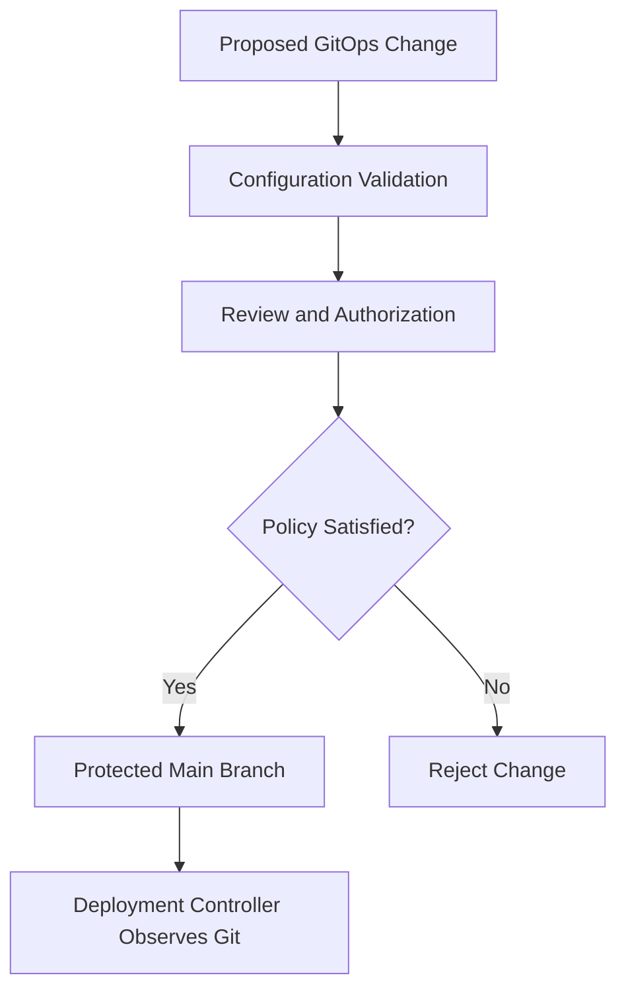

### Fundamental principle

> **In GitOps, the ability to modify the authoritative desired state can become effective deployment authority.**

Protecting the GitOps repository is as important as protecting direct Kubernetes access.

---

# 45. Validating Release Configuration Before Approval

Now we need a validation policy for GitOps changes.

Suppose a release pull request changes the production image digest.

What should automated checks verify?

At minimum:

1. The manifests are syntactically valid.
2. Kustomize can render the target overlay.
3. The intended image reference is present.
4. The image digest is correctly formed.
5. The artifact exists in the registry.
6. The release change does not unexpectedly modify unrelated resources.

More advanced checks can evaluate:

- Kubernetes schemas.
- Policy constraints.
- Required annotations.
- Resource limits.
- Allowed registries.
- Artifact provenance.
- Environment promotion evidence.

Not every check requires a live Kubernetes cluster.

## 45.1 Local validation

Run:

```bash
kubectl kustomize \
  applications/ecommerce-api/overlays/production
```

Inspect the rendered image.

You can save the output:

```bash
kubectl kustomize \
  applications/ecommerce-api/overlays/production \
  > /tmp/production-rendered.yaml
```

Then inspect:

```bash
grep "image:" /tmp/production-rendered.yaml
```

### Important limitation

Successful rendering proves that Kustomize could compose the configuration.

It does not prove:

- Kubernetes will accept every resource.
- The cluster has sufficient resources.
- The image is pullable by the cluster.
- The application will start.
- The database is compatible.
- The release is authorized.

Those require other checks.

### Engineering principle

**Configuration validation provides evidence about intended deployment configuration, not complete evidence about the resulting runtime.**

---

# 46. GitOps Promotion vs Direct Deployment

Let's compare two release architectures.

## Architecture A: GitHub Actions directly deploys

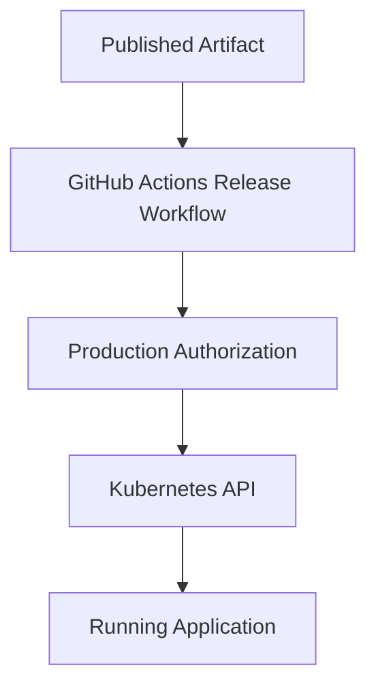

### Advantages

- Fewer components.
- Direct workflow-to-cluster integration.
- Straightforward for some small systems.

### Trade-offs

- GitHub Actions requires deployment authority.
- The authoritative desired state may be less clearly separated.
- Continuous drift reconciliation requires additional mechanisms.
- CI and production deployment responsibilities can become tightly coupled.

---

## Architecture B: GitOps-oriented release

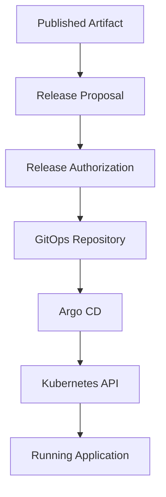

### Advantages

- Git records desired deployment configuration.
- Release authorization can use repository review controls.
- Argo CD manages Kubernetes reconciliation.
- CI does not need direct Kubernetes deployment credentials.
- Configuration drift can be observed through the controller.

### Trade-offs

- Requires managing GitOps repositories and controller configuration.
- Introduces another source of deployment failure.
- Requires careful permission management.
- Requires coordination between artifact publication and GitOps promotion.

### Our architectural choice

For this course:

**GitHub Actions builds and publishes.**

**Release Engineering selects and authorizes.**

**GitOps records desired state.**

**Argo CD reconciles Kubernetes.**

This is not a universal requirement for every project.

It is our deliberate reference architecture.

---

# 47. Failure Experiment 1 — Attempt to Promote an Unknown Artifact

Suppose someone requests:

```text
Production Digest:
sha256:ffffffffffffffffffffffffffffffffffffffffffffffffffffffffffffffff
```

The digest has the correct syntax.

Does it necessarily identify an existing image?

No.

A valid-looking digest may not exist in the registry.

### Test

Try inspecting the selected image:

```bash
docker buildx imagetools inspect \
  "${IMAGE_NAME}@sha256:ffffffffffffffffffffffffffffffffffffffffffffffffffffffffffffffff"
```

The request should fail unless that exact registry object happens to exist and is accessible.

### What did we learn?

**Digest syntax validation and artifact availability validation are different controls.**

A release system should not confuse them.

---

# 48. Failure Experiment 2 — Staging and Production Reference Different Artifacts

Suppose:

```text
Staging:
Digest AAA
```

But the production release proposal references:

```text
Digest BBB
```

The promotion script should reject the transition when the source environment does not select Digest BBB.

### What does this protect?

The intended artifact-promotion sequence.

### What does it not protect?

It does not prove that:

- Staging actually deployed the artifact.
- Staging tests passed.
- The image is secure.
- Production approval exists.

Those controls require independent evidence.

### Important insight

**Release engineering is a composition of controls. A single successful check rarely establishes every required property.**

---

# 49. Failure Experiment 3 — Staging Passes but Production Fails

Now imagine:

```text
Artifact: Digest BBB

Staging Deployment: Successful

Staging Verification: Passed

Production Deployment: Successful

Production Business Transactions: Failing
```

How could this happen?

Possible causes:

- Different production data.
- Higher traffic.
- Different database permissions.
- External service configuration.
- Different network policies.
- Missing production-only feature configuration.
- A failure scenario not covered in staging.

### What should the release system do?

1. Detect the failure through configured operational verification.
2. Stop further promotion if relevant.
3. Preserve the release identity and incident evidence.
4. Evaluate recovery options.
5. Authorize a compatible corrective action.
6. Verify restored behavior.

### What should it not do?

Automatically assume the previous application image can be restored safely without considering database and external state.

---

# 50. Failure Experiment 4 — Restore a Previous Image Digest

Suppose:

```text
Previous Approved Release:
Digest AAA
```

And:

```text
Current Production Release:
Digest BBB
```

A serious failure occurs.

The team determines that the previous application remains compatible with the current database and configuration.

An authorized GitOps change can restore:

```text
Digest AAA
```

### Procedure

Create a recovery branch.

Update the production overlay to Digest AAA.

Validate the rendered configuration.

Reference the incident and release evidence.

Submit the change through the defined emergency or standard authorization process.

After approval, the deployment controller can reconcile the desired state.

### What did we learn?

A recovery action should be:

- Explicit.
- Traceable.
- Authorized.
- Compatible with current system state.
- Verified after execution.

### Important limitation

The promotion script from the lab intentionally enforces forward promotion through environments.

It is not a recovery workflow.

A rollback may legitimately select a previously approved production artifact that is no longer selected in staging.

Therefore, **recovery requires a separate policy and mechanism**.

Do not weaken the normal promotion gate to make rollback convenient.

That would confuse two different responsibilities.

---

# 51. Release Engineering Metrics

A release system should be evaluated using operational evidence.

A workflow that produces green checks does not automatically represent successful release engineering.

We need to understand how safely and efficiently the organization delivers changes.

## 51.1 Useful metrics

| Metric | Engineering question |
|---|---|
| Release frequency | How often are releases delivered? |
| Change lead time | How long does a change take to reach production? |
| Promotion lead time | How long does an eligible artifact wait before promotion? |
| Change failure rate | What proportion of deployments require remediation? |
| Failed deployment recovery time | How quickly is service restored after a deployment failure? |
| Approval waiting time | Is authorization creating unnecessary delays? |
| Release verification time | How long does operational validation take? |
| Deployment success rate | How often do deployment operations complete successfully? |
| Rollback or recovery frequency | How frequently is recovery required? |
| Release traceability coverage | Can deployed artifacts be linked to source, build, and authorization evidence? |

These measurements help identify different problems.

### Example A: CI is fast, but releases are slow

```text
CI Duration:
5 minutes

Waiting for Production Approval:
3 days
```

The bottleneck is probably not the CI build.

It may involve release scheduling, approval processes, or missing readiness evidence.

### Example B: Releases are frequent, but failures are common

```text
Deployment Frequency:
High

Change Failure Rate:
High
```

The organization may need stronger risk-based validation, safer rollout strategies, or improved operational verification.

### Example C: Failures are rare, but recovery is extremely slow

```text
Change Failure Rate:
Low

Recovery Duration:
Several hours
```

The release system may need better:

- Release history.
- Artifact retention.
- Rollback compatibility.
- Incident procedures.
- Runtime observability.

### Fundamental principle

> **A good release process should optimize both delivery capability and operational reliability.**

Deployment frequency alone is not sufficient evidence of engineering maturity.

---

# 52. Release Engineering Design Exercise

Now imagine you receive this assignment.

## Scenario

Your company operates a SaaS application.

Technology stack:

```text
Frontend:
React

Backend:
Node.js + TypeScript

Database:
PostgreSQL

Runtime:
Azure Kubernetes Service

CI:
GitHub Actions

Artifact Registry:
GitHub Container Registry

Deployment:
Argo CD
```

The company has:

```text
12 Developers

Development Environment

Staging Environment

Production Environment
```

The current process automatically deploys every image published to the registry.

Recently, a database migration caused an outage.

The engineering manager asks you to redesign release management.

## Task A — Identify the fundamental problems

Identify at least eight risks in the current delivery process.

For each, write:

```text
Problem:

Why it exists:

Possible consequences:

Required release control:

How to validate the control:
```

Do not select tools first.

---

## Task B — Define release states

Design a state machine that includes:

```text
Candidate

Validated

Eligible

Approved

Deploying

Deployed

Verified

Failed

Recovery Required
```

For every transition, identify:

- Responsible component.
- Required evidence.
- Authorization.
- Failure behavior.

---

## Task C — Design environment promotion

Create a diagram showing:

```text
Immutable Artifact

Development

Staging

Production
```

Explain:

1. When the artifact is built.
2. When it is published.
3. What gets promoted.
4. What changes between environments.
5. What evidence production requires.
6. Why the artifact should not be rebuilt.

---

## Task D — Design release authorization

Determine:

- Who can publish an image?
- Who can propose staging promotion?
- Who can approve production promotion?
- Who can modify the authoritative GitOps branch?
- Which checks should be required?
- How should emergency releases work?
- What prevents bypass of the release policy?

---

## Task E — Design database compatibility

Suppose version `v2` renames a PostgreSQL column.

Explain how you would prevent disruption while old and new Pods coexist.

Your answer should include:

```text
Expand

Migrate

Verify

Contract
```

Also explain:

**Why might rolling back the application image be unsafe after the database changes?**

---

## Task F — Design recovery

Suppose:

```text
Production v1:
Healthy

Production v2:
Deployed

Error Rate:
25%
```

Answer:

1. What evidence confirms the failure?
2. What was the previous approved artifact?
3. Can the old application run against the current database?
4. Would you roll back or roll forward?
5. Who authorizes recovery?
6. How should the desired GitOps configuration change?
7. What evidence establishes that service has recovered?

---

## Task G — Design release concurrency

Two releases are approved simultaneously.

Both target production.

How will you prevent competing changes?

Explain the difference between:

- Cancelling an outdated CI run.
- Serializing release operations.
- Queueing releases.
- Superseding an obsolete release.
- Preventing direct modifications outside the release process.

---

# 53. Memorization — Eight Release Engineering Mental Models

These are the concepts you should remember without opening your notes.

## Mental Model 1 — Build, release, and deploy are different

```text
Build
    =
Create Software
```

```text
Release
    =
Authorize Software for Use
```

```text
Deploy
    =
Change the Running Environment
```

---

## Mental Model 2 — Artifact publication is not production authorization

```text
Published Image
       !=
Approved Production Release
```

---

## Mental Model 3 — Promotion preserves artifact identity

```text
Build Once
     |
     v
Immutable Artifact
     |
     v
Development
     |
     v
Staging
     |
     v
Production
```

The same artifact digest is selected as that release progresses.

---

## Mental Model 4 — A release is a controlled state transition

```text
Candidate
    |
    v
Validated
    |
    v
Authorized
    |
    v
Deployed
    |
    v
Verified
```

Each transition has defined conditions.

---

## Mental Model 5 — Approval and validation are different

```text
Validation
    =
Does the Artifact Satisfy Required Checks?
```

```text
Authorization
    =
May This Artifact Be Released Here?
```

---

## Mental Model 6 — Application and database compatibility matter

```text
New Application
       +
Existing Database
       |
       v
Must Remain Compatible
```

Especially during rolling deployments and recovery.

---

## Mental Model 7 — Rollback is not always system recovery

```text
Previous Application Image
       !=
Previous Complete System State
```

Database and external side effects may have changed.

---

## Mental Model 8 — GitOps records authorized deployment intent

```text
Published Digest
       |
       v
Release Approval
       |
       v
GitOps Desired State
       |
       v
Argo CD
       |
       v
Kubernetes
```

This is the central architecture connecting Phase 09 to Phases 10 and 11.

---

# 54. Active Recall Questions

Close your notes and answer from memory.

### First principles

**Q1.** Why does Release Engineering exist if CI already validates the application?

**Q2.** What is the difference between a build, artifact, release, and deployment?

**Q3.** Why is a valid artifact not necessarily an authorized production release?

**Q4.** What is a release state machine?

**Q5.** What is a release invariant?

### Artifact promotion

**Q6.** Why should staging and production promote the same published image digest?

**Q7.** What is the difference between an image tag and image digest?

**Q8.** How do Semantic Versioning, Git tags, and container digests differ?

**Q9.** What information should a release record contain?

**Q10.** Why is a manually written validation-status field insufficient proof?

### Authorization

**Q11.** What is the difference between validation evidence and release approval?

**Q12.** How can GitHub pull requests enforce production release authorization?

**Q13.** Why must the authoritative GitOps branch be protected?

**Q14.** Why does a GitHub Actions environment name alone not guarantee approval?

### Reliability

**Q15.** Why can two overlapping releases create problems?

**Q16.** What does idempotency mean in release engineering?

**Q17.** Why are declarative state-setting operations useful for retries?

**Q18.** What is the expand–migrate–contract approach?

**Q19.** Why can database changes prevent safe application rollback?

**Q20.** When might rolling forward be safer than rolling back?

### GitOps integration

**Q21.** What does the GitOps repository represent?

**Q22.** Which component performs Kubernetes reconciliation?

**Q23.** Why should recovery update the authoritative desired state?

**Q24.** Why is a successful Kustomize render not proof of a successful deployment?

**Q25.** What information would you inspect to investigate a failed production release?

---

# 55. Interview and System-Design Questions

### Question 1

CI passes and publishes an image.

The team immediately deploys it to production.

What release engineering responsibilities are missing?

### Question 2

How would you implement development, staging, and production promotion without rebuilding the application?

### Question 3

What is the difference between Continuous Delivery and Continuous Deployment?

Can Continuous Deployment still contain quality gates?

### Question 4

How would you use GitHub Actions, GHCR, GitOps, and Argo CD to separate artifact production from production authorization?

### Question 5

Two production release workflows start simultaneously.

How would you design concurrency and release-ordering controls?

### Question 6

Explain idempotency in the context of repeated release requests.

Why is it important in distributed automation?

### Question 7

An application release includes a breaking PostgreSQL schema change.

Why might rolling deployment and automatic rollback be unsafe?

### Question 8

How would you design a release record that supports auditability, debugging, and recovery?

### Question 9

Your GitOps repository is protected, but the application CI workflow has unrestricted permission to modify its production branch.

What security problem remains?

### Question 10

Staging successfully deployed an image.

Production then fails despite using the same digest.

What differences would you investigate?

### Question 11

A production incident requires restoring an older application image.

How would you decide whether rollback is compatible with current database state?

### Question 12

Design a complete release state machine for a Kubernetes application, including authorization, deployment, verification, failure, and recovery.

---

# 56. Official Documentation — Learn the Implementation From the Design

The purpose of these references is to connect our release architecture to real configuration mechanisms.

## 56.1 GitHub deployment environments

**Official documentation:**

https://docs.github.com/en/actions/how-tos/deploy/configure-and-manage-deployments/manage-environments

Study:

- Environment protection.
- Required reviewers.
- Branch restrictions.
- Environment permissions.
- Secret access.

**Engineering question:**

How can a workflow require authorization before executing an environment-specific release operation?

---

## 56.2 GitHub Actions deployment controls

**Official documentation:**

https://docs.github.com/en/actions/how-tos/deploy/configure-and-manage-deployments/control-deployments

Study:

- Deployment workflows.
- Environment gates.
- Concurrency.
- Deployment history.

**Engineering question:**

How should authorization and execution constraints be represented in workflow configuration?

---

## 56.3 GitHub concurrency

**Official documentation:**

https://docs.github.com/en/actions/how-tos/write-workflows/choose-when-workflows-run/control-workflow-concurrency

Study:

- Concurrency groups.
- Cancellation.
- Pending execution.
- Queuing.

**Engineering question:**

How can multiple release requests targeting the same environment be coordinated safely?

---

## 56.4 GitHub Releases

**Official documentation:**

https://docs.github.com/en/repositories/releasing-projects-on-github/about-releases

Study:

- Git tags.
- GitHub Releases.
- Release notes.
- Release history.

**Engineering question:**

How should human-readable release versions connect to source revisions and deployable artifacts?

---

## 56.5 Kubernetes Kustomize

**Official documentation:**

https://kubernetes.io/docs/tasks/manage-kubernetes-objects/kustomization/

Study:

- Bases.
- Overlays.
- Image transformations.
- Configuration rendering.

**Engineering question:**

How can multiple environments select different approved artifacts while sharing the same common Kubernetes application definition?

---

## 56.6 Kubernetes Deployments

**Official documentation:**

https://kubernetes.io/docs/concepts/workloads/controllers/deployment/

Study:

- Deployment revisions.
- Rollout status.
- Readiness.
- Rollout failures.
- Deployment recovery.

**Engineering question:**

How does Kubernetes work toward the requested application state, and what information is available when a rollout fails?

---

## 56.7 Argo CD automated synchronization

**Official documentation:**

https://argo-cd.readthedocs.io/en/stable/user-guide/auto_sync/

Study:

- Automated synchronization.
- Drift detection.
- Self-healing.
- Sync retries.
- Rollback behavior.

**Engineering question:**

How does a deployment controller interpret GitOps desired-state changes, and how should recovery interact with that authority?

---

# 57. Phase 09 — Engineering Takeaways

| Principle | Engineering meaning |
|---|---|
| **A build is not a release** | Artifact construction and release authorization are separate responsibilities. |
| **A release is not a deployment** | Selecting software does not guarantee the environment has changed. |
| **Release Engineering controls transitions** | Promotion should follow explicit states and conditions. |
| **Release invariants matter** | Important safety and traceability properties should remain true. |
| **Artifact identity must be immutable** | Digests provide stronger release identity than mutable tags. |
| **Promotion should reuse artifacts** | Avoid rebuilding already validated releases for each environment. |
| **Approval is distinct from validation** | Technical checks and authorization answer different questions. |
| **Release records preserve evidence** | Source, artifact, environment, authorization, and outcome should be connected. |
| **Evidence claims require verification** | A manually written status is not automatically trustworthy. |
| **Concurrency must be controlled** | Overlapping releases can create ambiguous runtime state. |
| **Retries should be safe** | Idempotent operations reduce duplicate effects and uncertainty. |
| **Database compatibility is critical** | Application and schema changes may overlap during deployment. |
| **Rollback has limitations** | Previous application versions may be incompatible with current data. |
| **Recovery must be verified** | Restoring an image reference does not prove service recovery. |
| **GitOps stores deployment intent** | Approved Git configuration represents the desired release state. |
| **Argo CD reconciles desired state** | It does not determine business release authorization on its own. |
| **Operational feedback closes the loop** | The release outcome must be evaluated against actual behavior. |

---

# 58. Final Understanding

Let's return to the central question of this phase.

**Once CI produces a validated artifact, how do we decide when, where, and under what conditions that artifact may be deployed?**

We begin by identifying the release requirements.

We define an immutable artifact identity.

We establish a release record connecting the artifact to its source and validation evidence.

We identify the environments through which the release must progress.

We define the conditions required for each promotion.

We separate validation from authorization.

We coordinate release operations to prevent conflicting transitions.

We evaluate compatibility with databases and external dependencies.

We define recovery options before production deployment.

Then we express the authorized deployment intent through GitOps configuration.

Argo CD can reconcile that configuration with Kubernetes.

Finally, we verify the resulting application's behavior.

## 58.1 Complete release engineering model

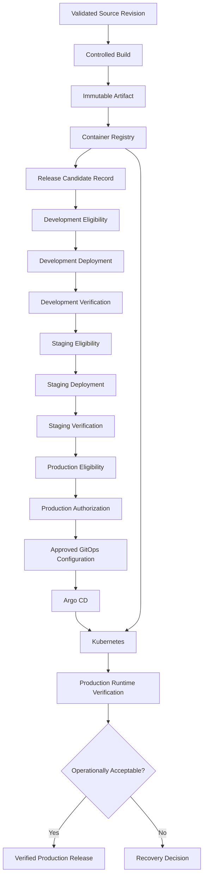

The diagram is a logical architecture.

Development and staging deployments would each have their own approved desired configuration and deployment-controller operation. The single Argo CD path shown near production emphasizes where the production deployment authority resides.

### The most important principle of Phase 09

> **Release Engineering is the discipline of turning a validated software artifact into a controlled operational change by managing identity, evidence, compatibility, authorization, promotion, and recovery.**

Remember the complete relationship:

```text
Git
    ->
Identifies Source

GitHub Actions
    ->
Validates Source

Build System
    ->
Produces Artifact

Container Registry
    ->
Stores Artifact

Release Engineering
    ->
Authorizes Artifact Promotion

GitOps
    ->
Records Desired Deployment State

Argo CD
    ->
Reconciles Kubernetes Configuration

Kubernetes
    ->
Maintains Running Workloads

Observability
    ->
Evaluates Runtime Behavior
```

This is how the individual tools fit together into a complete software delivery system.

---

# Phase 09 Complete

**Completed:** Level 3 — Phase 09: Release Engineering

## Course Progress — 5 Levels, 16 Phases

| Level | Phase | Topic | Status |
|---|---|---|---|
| **1 — Fundamentals** | 01 | Why CI/CD Exists | Completed |
| | 02 | Feedback and Control Systems | Completed |
| | 03 | Delivery Architecture | Completed |
| | 04 | Git Lifecycle | Completed |
| **2 — Continuous Integration** | 05 | CI Architecture | Completed |
| | 06 | Testing and Quality Gates | Completed |
| | 07 | Build Artifacts | Completed |
| | 08 | GitHub Actions | Completed |
| **3 — Continuous Delivery** | 09 | Release Engineering | Completed |
| | 10 | GitOps | **Next** |
| | 11 | Argo CD | Upcoming |
| | 12 | End-to-End Integration | Upcoming |
| **4 — Production Engineering** | 13 | Deployment Strategies | Upcoming |
| | 14 | CI/CD Security | Upcoming |
| | 15 | Reliability and Observability | Upcoming |
| **5 — System Design** | 16 | Complete CI/CD Project | Upcoming |

---

# Next: Phase 10 — GitOps

**File:** `Level-3-Continuous-Delivery/Phase-10-GitOps.md`

We have now established how release decisions should work.

The next question is:

**How do we reliably communicate approved deployment decisions to a continuously operating Kubernetes environment?**

This leads us to GitOps.

In Phase 10, we will study:

- Why GitOps exists.
- Declarative vs imperative infrastructure management.
- Desired state and actual state.
- Reconciliation controllers.
- Git as an authoritative source of configuration.
- Pull-based vs push-based deployment models.
- GitOps repository architecture.
- Application repositories vs environment repositories.
- Single-repository vs multi-repository design.
- GitOps environment overlays.
- Release promotion through Git commits.
- GitOps change review and authorization.
- Configuration drift.
- Why changing Git does not itself guarantee a healthy deployment.
- GitOps security and trust boundaries.
- Recovery through authoritative state changes.
- How GitHub Actions and GitOps fit together.
- Practical GitOps repository design and validation.

We will derive the architecture from first principles before examining Argo CD's detailed implementation in Phase 11.

### Central engineering question for Phase 10

> **How can Git, declarative configuration, and continuous reconciliation create a reliable deployment system in which approved desired state is clearly separated from the mechanisms that apply it?**

**Send `next` to begin Phase 10 — GitOps.**