# Phase 10 — GitOps: Designing Declarative Delivery and Reconciliation From First Principles

**Level 3: Continuous Delivery | CI/CD From First Principles**

**File:** `Level-3-Continuous-Delivery/Phase-10-GitOps.md`

**Previous:** Phase 09 — Release Engineering  
**Next:** Phase 11 — Argo CD

---

# 1. What Will You Learn?

Welcome to **Phase 10 — GitOps**.

We have reached an important point in our CI/CD journey.

In the previous phases, we built a system capable of:

1. Accepting changes through Git.
2. Validating software using GitHub Actions.
3. Enforcing integration quality gates.
4. Building container images.
5. Publishing images to GHCR.
6. Recording immutable image digests.
7. Selecting release candidates.
8. Authorizing artifact promotion between environments.

But there is still a missing piece.

**How does the approved release become the actual state of a Kubernetes cluster?**

Imagine the following:

```text
Application: ecommerce-api

CI Status: Passed

Published Image: sha256:BBB

Production Approval: Granted

Previous Production Image: sha256:AAA
```

We have decided that production should run Digest BBB.

But production is still running Digest AAA.

Something must communicate our decision to Kubernetes and ensure that the requested state is maintained.

A traditional CI/CD approach might execute:

```bash
kubectl set image deployment/ecommerce-api \
  api=ghcr.io/example/ecommerce-api@sha256:...
```

This can update the workload.

But consider these questions:

- What if someone manually changes the image afterward?
- What if the deployment command succeeds but the application fails?
- What if the CI runner disappears during deployment?
- What if someone modifies the cluster without updating Git?
- What is the authoritative production configuration?
- How do we know whether Kubernetes matches the approved configuration?
- How do we recover the previously approved state?
- Should GitHub Actions need privileged access to Kubernetes?
- How do we prevent two systems from fighting over the same resources?

These questions reveal why GitOps exists.

## Our central engineering question

> **How can we build a deployment system where approved desired state is version-controlled, continuously compared with actual state, and reconciled by a controller with clearly defined authority?**

We will answer this without starting with Argo CD YAML.

First, we will understand the problem.

Then derive the architecture.

Finally, we will implement a GitOps repository and its validation policies.

## Learning objectives

By the end of this phase, you should understand:

1. What fundamental delivery problems GitOps solves.
2. The four OpenGitOps principles.
3. Imperative versus declarative system management.
4. Desired state versus actual state.
5. Git as an authoritative record of deployment intent.
6. The reconciliation control loop.
7. Push-based versus pull-based deployment models.
8. Why GitOps is more than storing YAML in Git.
9. Application repositories versus GitOps repositories.
10. Single-repository versus multi-repository architecture.
11. Environment overlays and immutable image promotion.
12. How GitHub Actions and GitOps exchange release information.
13. Synchronization, drift, self-healing, and pruning.
14. Why synchronization and application health are different.
15. Controller ownership and conflicting reconciliation loops.
16. GitOps approval and security boundaries.
17. Secrets and runtime configuration in GitOps systems.
18. GitOps recovery and database compatibility.
19. Failure modes and troubleshooting.
20. How to design and validate a GitOps repository before introducing Argo CD.

### Important scope boundary

In **Phase 10**, we will build the desired-state architecture and validate its configuration.

In **Phase 11**, we will install, configure, and operate the Argo CD reconciliation controller.

That distinction matters:

**Storing Kubernetes manifests in Git does not automatically create a working GitOps system.**

---

# 2. First Principle: Deployment Is a State-Management Problem

Suppose production currently runs:

```text
Application: ecommerce-api

Image: Digest AAA

Replicas: 3
```

The release team approves:

```text
Application: ecommerce-api

Image: Digest BBB

Replicas: 3
```

What is the real engineering objective?

Is it to run a particular command?

No.

Our objective is to move the system from one state to another.

```text
Current State
      |
      v
Requested Change
      |
      v
Desired State
      |
      v
State Transition
      |
      v
Observed Result
```

This is the same kind of problem we studied in Phase 02.

## 2.1 Command success does not equal state correctness

Imagine GitHub Actions executes:

```bash
kubectl apply -f deployment.yaml
```

The command succeeds.

What does that prove?

It indicates that the Kubernetes API accepted the requested operation.

It does not automatically establish that:

- The image was pulled successfully.
- The application started.
- All replicas became ready.
- The application can reach PostgreSQL.
- The new release satisfies business requirements.
- The desired state will remain unchanged afterward.

### The deeper problem

**We need ongoing state management, not merely one successful deployment command.**

---

# 3. The Weak Model: One-Time Imperative Deployment

Let's first design a traditional deployment system.

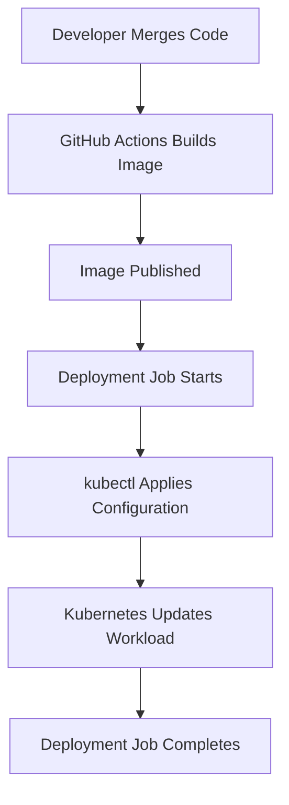
```mermaid
flowchart TD
    A["Developer Merges Code"]
    B["GitHub Actions Builds Image"]
    C["Image Published"]
    D["Deployment Job Starts"]
    E["kubectl Applies Configuration"]
    F["Kubernetes Updates Workload"]
    G["Deployment Job Completes"]

    A --> B
    B --> C
    C --> D
    D --> E
    E --> F
    F --> G
```

This model can work.

But let's examine what happens afterward.

Suppose the intended configuration is:

```yaml
spec:
  replicas: 3
```

An administrator manually changes it:

```bash
kubectl scale deployment ecommerce-api \
  --replicas=1
```

Now the live Deployment configuration specifies one replica.

What does our original deployment job do?

Nothing.

It has already finished.

Unless we add another mechanism, the deployment pipeline is not continuously comparing the live configuration against the approved configuration.

## 3.1 The problem is not `kubectl`

The problem is the **control model**.

Our deployment process performs a one-time operation.

It does not continuously enforce the externally approved desired configuration.

That reveals the missing capability:

> **We need a system that repeatedly observes actual state, compares it with desired state, and determines whether corrective action is required.**

This leads to reconciliation.

---

# 4. Deriving the GitOps Control Loop

Let's begin with two variables.

```text
D = Desired State

A = Actual State
```

The desired state describes what the system should look like.

The actual state describes what currently exists.

Conceptually:

```text
Difference = Compare(D, A)
```

If an unacceptable difference exists, a controller attempts to reconcile it.

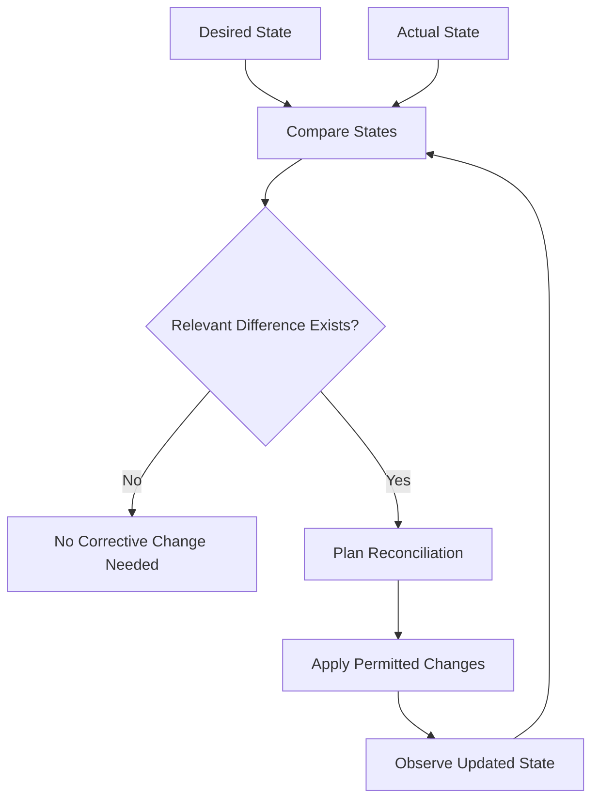
```mermaid
flowchart TD
    A["Desired State"]
    B["Actual State"]
    C["Compare States"]
    D{"Relevant Difference Exists?"}
    E["No Corrective Change Needed"]
    F["Plan Reconciliation"]
    G["Apply Permitted Changes"]
    H["Observe Updated State"]

    A --> C
    B --> C

    C --> D

    D -->|No| E
    D -->|Yes| F

    F --> G
    G --> H
    H --> C
```

This is a control loop.

Notice that the controller must continue observing the system.

It cannot assume that a single successful operation permanently guarantees the desired result.

## 4.1 Identify the fundamental components

| Component | Responsibility |
|---|---|
| Desired state | Defines what should exist |
| Actual state | Represents what currently exists |
| Observer | Collects actual-state information |
| Comparator | Identifies relevant differences |
| Reconciliation logic | Determines corrective operations |
| Actuator | Executes permitted changes |
| Feedback | Reports whether convergence is occurring |

This is not specific to Argo CD.

It is a general control-systems architecture.

### Connection to Phase 02

Remember the thermostat?

```text
Desired Temperature
        |
        v
Compare With Actual Temperature
        |
        v
Turn Heating On or Off
        |
        v
Observe Temperature Again
```

GitOps uses a related model for managing software-system configuration.

Instead of temperature, we compare deployment state.

---

# 5. What Makes the Desired State Authoritative?

We now have a controller.

But where should it obtain the desired state?

Possible choices include:

- A deployment command.
- A database.
- An API request.
- A configuration service.
- A Git repository.

For our delivery architecture, we want the desired state to have several properties.

It should be:

- Reviewable.
- Versioned.
- Traceable.
- Recoverable.
- Accessible to the reconciliation controller.
- Governed by authorization policies.

Git provides useful mechanisms for these requirements.

A commit identifies a version of configuration.

A pull request proposes a change.

Repository rules can require validation and review.

Git history preserves the evolution of approved configuration.

This is why Git becomes central to GitOps.

## 5.1 Git as an authoritative record of intent

Imagine:

```text
Production GitOps Configuration

Image: Digest BBB

Replicas: 3
```

The controller obtains this configuration.

It compares it with Kubernetes.

If Kubernetes instead specifies Digest AAA, the controller can identify the difference.

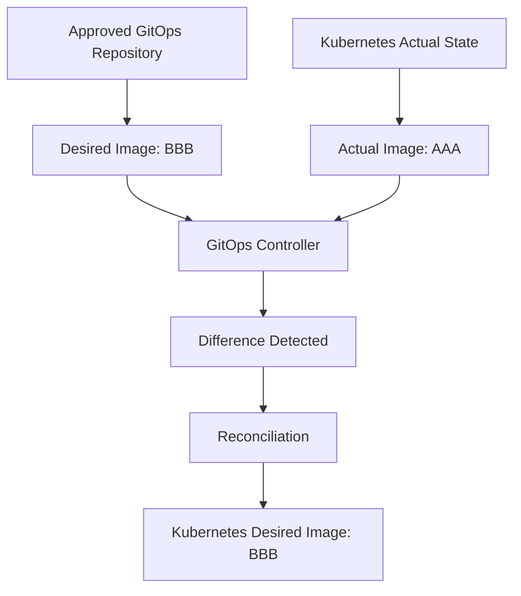
```mermaid
flowchart TD
    A["Approved GitOps Repository"]
    B["Desired Image: BBB"]
    C["GitOps Controller"]
    D["Kubernetes Actual State"]
    E["Actual Image: AAA"]
    F["Difference Detected"]
    G["Reconciliation"]
    H["Kubernetes Desired Image: BBB"]

    A --> B
    B --> C

    D --> E
    E --> C

    C --> F
    F --> G
    G --> H
```

### A critical distinction

Git is authoritative for the **configuration fields and resources assigned to the GitOps controller**.

It is not necessarily authoritative for every field of every Kubernetes object.

For example, the Kubernetes scheduler chooses Pod placement.

An autoscaler may manage replica counts.

Kubernetes controllers manage observed status fields.

A good GitOps system defines ownership boundaries rather than trying to force every part of the live cluster to match a static Git file.

---

# 6. The Four OpenGitOps Principles

We now have the underlying problem and a possible architecture.

Let's connect it to the formal GitOps principles.

The OpenGitOps project identifies four foundational principles:

1. Declarative.
2. Versioned and immutable.
3. Pulled automatically.
4. Continuously reconciled.

These are documented by the OpenGitOps community. [GitHub](https://github.com/open-gitops/documents/blob/main/PRINCIPLES.md?utm_source=chatgpt.com)

Let's derive each principle.

---

# 7. Principle One — Declarative Desired State

What does declarative mean?

Suppose we want three application replicas.

An imperative instruction might be:

```bash
kubectl scale deployment ecommerce-api \
  --replicas=3
```

This tells the system to perform an operation.

A declarative configuration describes the desired outcome:

```yaml
apiVersion: apps/v1
kind: Deployment
metadata:
  name: ecommerce-api
spec:
  replicas: 3
```

This is only a fragment, not a complete Deployment manifest.

The difference is conceptual.

## 7.1 Imperative thinking

```text
What command should I execute?
```

## 7.2 Declarative thinking

```text
What state should the system maintain?
```

### Compare the models

| Imperative approach | Declarative approach |
|---|---|
| Describes an operation | Describes a desired condition |
| Execution is the primary focus | State is the primary focus |
| May depend on command history | Can be compared against current state |
| Repeated execution needs careful design | State-setting operations are often easier to make idempotent |
| Drift handling requires additional mechanisms | Supports reconciliation against declared intent |

### Important qualification

Kubernetes YAML is not automatically GitOps.

You can execute:

```bash
kubectl apply -f deployment.yaml
```

without using any continuous GitOps reconciliation system.

That is declarative configuration applied through a one-time operation.

**Declarative management is necessary for GitOps, but it is not sufficient by itself.**

---

# 8. Principle Two — Versioned and Immutable

We want to know:

- Who proposed a configuration change?
- What changed?
- When did it change?
- Which version is approved?
- Which previous state should be restored during recovery?

Git provides a versioned history.

Imagine these commits:

```text
Commit A
Production Image: Digest 111

Commit B
Production Image: Digest 222

Commit C
Production Image: Digest 333
```

Each commit identifies a recorded configuration snapshot.

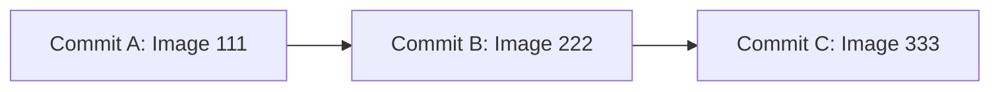
```mermaid
flowchart LR
    A["Commit A: Image 111"]
    B["Commit B: Image 222"]
    C["Commit C: Image 333"]

    A --> B
    B --> C
```

If Commit C introduces a problem, the team can create a new authorized commit that restores the previously approved image selection.

### Important distinction

**Git commits are immutable objects, but branch references can move.**

Protecting the authoritative branch is therefore part of operating a reliable GitOps system.

Git history alone does not prevent someone with sufficient permissions from force-pushing, deleting references, or bypassing review.

### Two kinds of immutability

We should distinguish:

**Configuration identity**

```text
Git Commit SHA
```

Identifies a version of desired deployment configuration.

**Artifact identity**

```text
Container Image Digest
```

Identifies the published container content.

Both matter.

A configuration commit referencing a mutable `latest` tag may be versioned, but the actual image content selected later can still be ambiguous.

### Engineering principle

> **Version the deployment decision and identify the deployed artifact independently.**

---

# 9. Principle Three — Pulled Automatically

Now consider the deployment authority.

In a traditional push model, GitHub Actions may need credentials to connect to the production Kubernetes API.

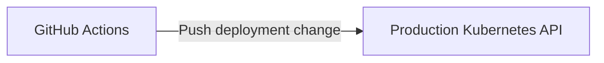
```mermaid
flowchart LR
    A["GitHub Actions"]
    B["Production Kubernetes API"]

    A -->|"Push deployment change"| B
```

This can be appropriate for some architectures.

But in our GitOps reference architecture, we want a different trust boundary.

Instead:

1. An authorized process changes the GitOps repository.
2. A controller obtains the declared desired state.
3. The controller uses its own appropriately scoped Kubernetes access.
4. The controller attempts reconciliation.

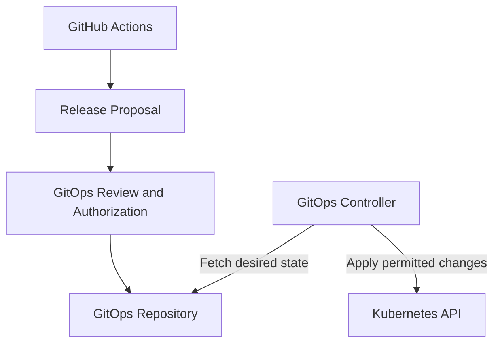
```mermaid
flowchart TD
    A["GitHub Actions"]
    B["Release Proposal"]
    C["GitOps Review and Authorization"]
    D["GitOps Repository"]
    E["GitOps Controller"]
    F["Kubernetes API"]

    A --> B
    B --> C
    C --> D

    E -->|"Fetch desired state"| D
    E -->|"Apply permitted changes"| F
```

Notice that GitHub Actions does not require production cluster credentials merely to publish an artifact or propose a release.

### Why is this useful?

It separates:

```text
Software Producer
```

from:

```text
Deployment Authority
```

The GitOps controller holds the Kubernetes authority necessary for its managed resources.

The source repository and CI system need not possess that same authority.

### Important security qualification

This does not mean GitOps automatically eliminates all security risks.

Someone who can modify the trusted GitOps configuration may have indirect deployment authority.

The controller can also be compromised.

Registry access, Git repository access, Kubernetes permissions, and controller configuration still require protection.

### First-principles insight

> **Pull-based GitOps moves cluster-changing authority into a dedicated reconciliation system rather than requiring each build pipeline to directly control production.**

---

# 10. Principle Four — Continuously Reconciled

Let's imagine the GitOps repository says:

```text
Image: BBB

Replicas: 3
```

Kubernetes currently has:

```text
Image: AAA

Replicas: 3
```

The controller detects a difference.

It may attempt to update the Deployment's image reference.

Afterward, it observes the state again.

But what happens if someone later changes the live image back to AAA?

The GitOps controller needs to notice that difference too.

This is continuous reconciliation.

## 10.1 The complete loop

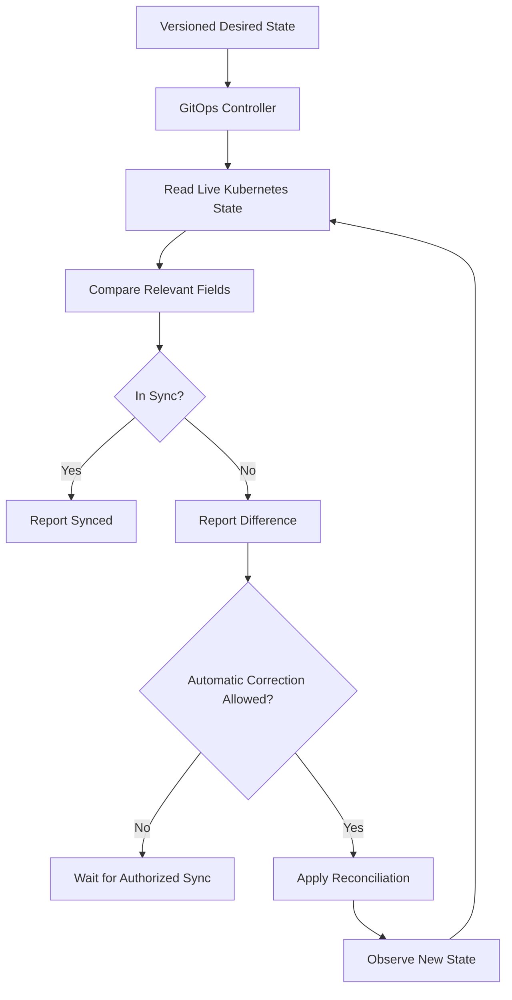
```mermaid
flowchart TD
    A["Versioned Desired State"]
    B["GitOps Controller"]
    C["Read Live Kubernetes State"]
    D["Compare Relevant Fields"]
    E{"In Sync?"}
    F["Report Synced"]
    G["Report Difference"]
    H{"Automatic Correction Allowed?"}
    I["Wait for Authorized Sync"]
    J["Apply Reconciliation"]
    K["Observe New State"]

    A --> B
    B --> C
    C --> D
    D --> E

    E -->|Yes| F
    E -->|No| G

    G --> H

    H -->|No| I
    H -->|Yes| J

    J --> K
    K --> C
```

### Important nuance

**Detection and automatic correction are not identical.**

A controller can continuously compare desired and actual state while requiring explicit authorization before changing certain resources.

For example, Argo CD can detect an `OutOfSync` application without automatically applying changes when automated synchronization is not enabled.

We will study its exact options in Phase 11.

### The fourth principle

> **A GitOps system continually observes actual state and attempts to bring managed resources toward the approved desired state according to its reconciliation policy.**

---

# 11. What GitOps Is — and What It Is Not

We can now define GitOps more precisely.

GitOps is a set of principles for managing software systems using:

- Declaratively expressed desired state.
- Versioned, immutable configuration history.
- Automatic retrieval by software agents.
- Continuous reconciliation with actual state.

It is not merely a particular tool.

Argo CD and Flux are implementations of GitOps concepts.

GitOps itself is the operating model.

## 11.1 Common misunderstandings

| Statement | Correct? | Explanation |
|---|---|---|
| GitOps means storing YAML in Git | Incomplete | Automatic pull and reconciliation are also fundamental |
| GitOps requires GitHub Actions | No | CI implementation is separate |
| GitOps requires Argo CD | No | Other controllers can implement the principles |
| GitOps means every Git commit immediately deploys | No | Synchronization policy controls application |
| GitOps automatically tests the application | No | Testing requires separate mechanisms |
| GitOps automatically rolls back unhealthy releases | No | Recovery behavior must be designed |
| GitOps eliminates Kubernetes RBAC | No | Controllers still need authorized access |
| GitOps removes the need for monitoring | No | Runtime behavior requires observation |
| GitOps makes Git a deployment control boundary | Yes | Trusted configuration can influence production |
| GitOps helps detect configuration drift | Yes | Reconciliation depends on comparing desired and actual state |

### The most important distinction

> **GitOps is not a YAML storage convention. It is a version-controlled, pull-oriented, continuously reconciled operating model.**

---

# 12. Push-Based Delivery vs Pull-Based GitOps

Let's compare the complete architectures.

## 12.1 Push-based deployment

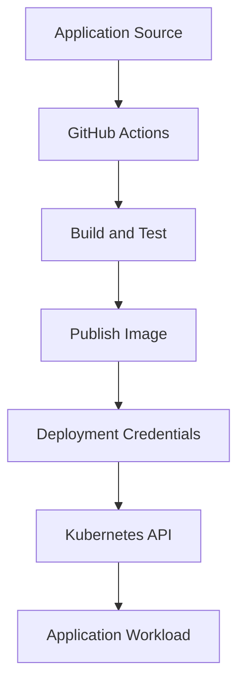
```mermaid
flowchart TD
    A["Application Source"]
    B["GitHub Actions"]
    C["Build and Test"]
    D["Publish Image"]
    E["Deployment Credentials"]
    F["Kubernetes API"]
    G["Application Workload"]

    A --> B
    B --> C
    C --> D
    D --> E
    E --> F
    F --> G
```

In this design, the pipeline initiates deployment through the Kubernetes API.

It must have an appropriate way to authenticate and authorization to modify the target resources.

### Advantages

- Relatively direct execution flow.
- Simple for small deployment systems.
- One platform can coordinate building and deployment.
- Fewer moving parts.

### Limitations

- The pipeline needs deployment access.
- Separate runs may compete to update the same target.
- Continuous drift management requires another mechanism.
- Deployment automation and artifact construction can become tightly coupled.

This architecture is not inherently wrong.

It simply has different responsibilities and trust boundaries.

---

## 12.2 Pull-based GitOps

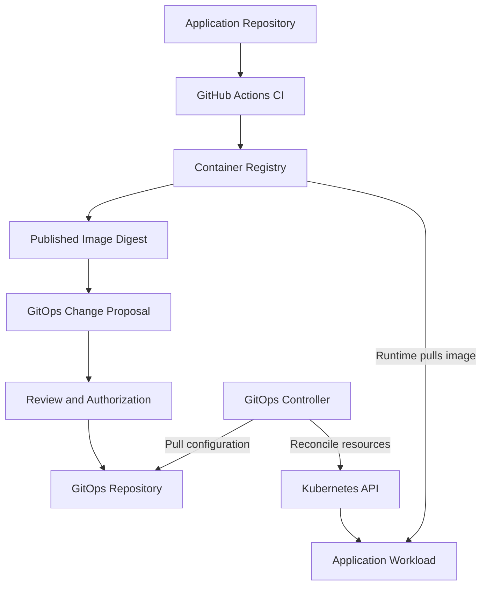
```mermaid
flowchart TD
    A["Application Repository"]
    B["GitHub Actions CI"]
    C["Container Registry"]
    D["Published Image Digest"]

    E["GitOps Change Proposal"]
    F["Review and Authorization"]
    G["GitOps Repository"]

    H["GitOps Controller"]
    I["Kubernetes API"]
    J["Application Workload"]

    A --> B
    B --> C
    C --> D

    D --> E
    E --> F
    F --> G

    H -->|"Pull configuration"| G
    H -->|"Reconcile resources"| I
    I --> J

    C -->|"Runtime pulls image"| J
```

In this design:

- CI creates the artifact.
- The registry stores the artifact.
- Release engineering proposes the desired image.
- Git review authorizes the configuration change.
- The controller retrieves the approved configuration.
- The controller reconciles Kubernetes.
- Kubernetes starts workloads using the referenced images.

### Important architectural benefit

GitHub Actions does not need direct production Kubernetes credentials simply to build and publish software.

### Important limitation

The controller must still be:

- Available.
- Correctly configured.
- Authorized.
- Able to read the repository.
- Able to reach Kubernetes.
- Able to interpret the configuration.

GitOps changes the deployment architecture.

It does not remove operational dependencies.

---

# 13. Desired State vs Actual State vs Observed Health

These three concepts must remain separate.

Consider a Kubernetes Deployment.

### Desired state in Git

```text
Image: BBB

Replicas: 3
```

### Actual Deployment specification

```text
Image: BBB

Replicas: 3
```

### Runtime state

```text
Ready Pods: 0

Desired Pods: 3

Reason: ImagePullBackOff
```

Is the configuration synchronized?

It may be.

Is the application healthy?

No.

This distinction is essential.

## 13.1 Three questions

**Desired state:** What should the system be configured to do?

**Synchronization:** Does the relevant live configuration match the declared state?

**Health:** Is the resulting workload actually operating acceptably?

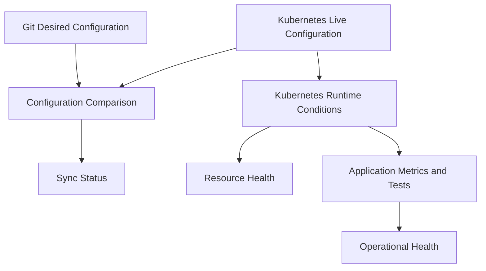
```mermaid
flowchart TD
    A["Git Desired Configuration"]
    B["Kubernetes Live Configuration"]
    C["Configuration Comparison"]
    D["Sync Status"]

    E["Kubernetes Runtime Conditions"]
    F["Resource Health"]

    G["Application Metrics and Tests"]
    H["Operational Health"]

    A --> C
    B --> C
    C --> D

    B --> E
    E --> F

    E --> G
    G --> H
```

### A critical example

```text
GitOps Sync Status:
Synced

Kubernetes Deployment:
Progressing

Application Error Rate:
25%
```

These observations are not contradictory.

They evaluate different properties.

Argo CD explicitly distinguishes target state, live state, sync status, sync operations, and health. [Argo CD](https://argo-cd.readthedocs.io/en/release-2.5/core_concepts/?utm_source=chatgpt.com)

### Engineering principle

> **Desired-state convergence is not equivalent to application correctness or acceptable production behavior.**

GitOps must fit into a larger delivery system containing testing, rollout verification, and monitoring.

---

# 14. Configuration Drift: The Core Operational Problem

Suppose Git declares:

```text
Replicas: 3
```

An administrator changes the live Deployment:

```text
Replicas: 1
```

We now have drift.

## 14.1 What is configuration drift?

Configuration drift occurs when the relevant actual configuration differs from its intended authoritative configuration.

It can arise from:

- Manual changes.
- Emergency modifications.
- Other automation.
- Incorrect deployment tooling.
- Competing controllers.
- Configuration mistakes.
- Unintended resource changes.

### Drift is not always malicious

Imagine an administrator manually increases replicas during an incident.

Their intention may be reasonable.

But if Git continues to specify a different value, the system now has conflicting sources of operational intent.

The key question is:

**Who is authorized to own this setting?**

---

# 15. Detecting Drift vs Correcting Drift

This distinction is particularly important for Argo CD.

A controller may:

1. Detect a difference.
2. Report the difference.
3. Wait for a sync operation.

Alternatively, policy may allow it to automatically apply corrective changes.

These are different operating modes.

## 15.1 Drift detection

```text
Git Desired State:
Replicas = 3
```

```text
Live Configuration:
Replicas = 1
```

Result:

```text
Configuration Difference Detected
```

This is observation.

## 15.2 Drift correction

The controller attempts to restore:

```text
Replicas = 3
```

This is actuation.

### Important Argo CD nuance

Argo CD can detect differences without automatically synchronizing them.

Automated synchronization must be configured for automatic application of desired Git changes.

Automatic self-healing for live-only changes is a separate option.

Automatic pruning of resources removed from Git is also a separate option. [GitHub](https://github.com/argoproj/argo-cd/blob/master/docs/user-guide/auto_sync.md?utm_source=chatgpt.com)

### What does that mean?

Do not assume:

```text
Argo CD Installed
       =
All Drift Automatically Corrected
```

Or:

```text
Application OutOfSync
       =
Immediate Kubernetes Modification
```

The synchronization policy determines which corrective actions are permitted.

We will implement these controls in Phase 11.

---

# 16. Self-Healing: Powerful but Not Universally Safe

Imagine Git declares:

```text
Replicas = 3
```

Someone changes the live state:

```text
Replicas = 1
```

With appropriate self-healing behavior enabled, the controller may restore the desired replica count.

This is useful when the live modification is unauthorized or accidental.

But now imagine an autoscaler is responsible for replica counts.

It changes:

```text
Replicas = 3
```

To:

```text
Replicas = 8
```

Because traffic has increased.

If GitOps continuously forces the value back to three, we have conflicting control loops.

## 16.1 Conflicting controllers

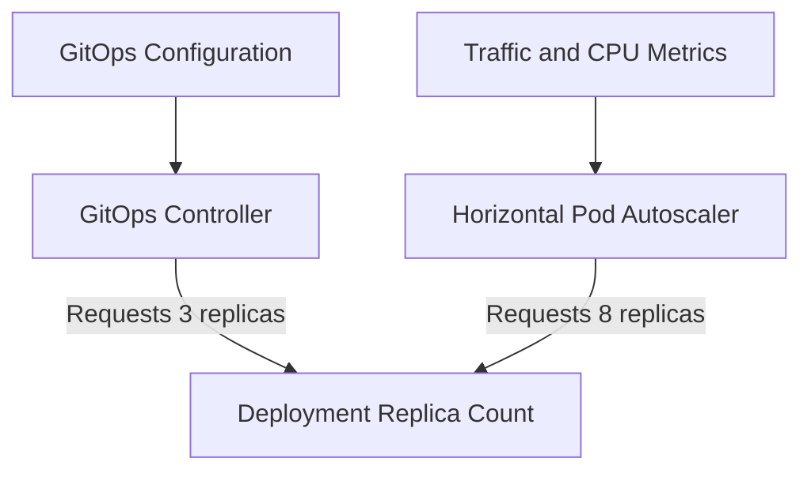
```mermaid
flowchart TD
    A["GitOps Configuration"]
    B["GitOps Controller"]
    C["Deployment Replica Count"]

    D["Traffic and CPU Metrics"]
    E["Horizontal Pod Autoscaler"]

    A --> B
    B -->|"Requests 3 replicas"| C

    D --> E
    E -->|"Requests 8 replicas"| C
```

Two controllers are trying to manage the same effective setting.

### What is the solution?

Define ownership.

For example:

- GitOps manages application images and stable configuration.
- The autoscaler manages the Deployment's effective replica count.
- GitOps comparison and synchronization rules account for the autoscaler-owned field.

Argo CD supports configuring ignored differences for selected fields or field managers. It also distinguishes ignoring fields during comparison from respecting those differences during synchronization. [GitHub](https://github.com/argoproj/argo-cd/blob/master/docs/user-guide/sync-options.md?utm_source=chatgpt.com)

### The deeper lesson

> **Reliable reconciliation requires clear ownership of managed state. More controllers do not automatically produce a better-controlled system.**

---

# 17. Pruning: What Happens When a Resource Disappears From Git?

Suppose Git previously defined:

```text
Deployment

Service

ConfigMap
```

Now a developer removes the Service manifest.

Should the GitOps controller delete the live Kubernetes Service?

There is no universal answer.

It depends on the intended policy.

## 17.1 Possible meanings of deletion

The Service may have been removed because:

- It is obsolete.
- A migration is replacing it.
- It was accidentally deleted from the repository.
- A refactoring moved it to another application.
- Its ownership is being transferred.

Automatically deleting it may be correct.

Or it may cause an outage.

## 17.2 Pruning control

Pruning is the operation of removing previously managed live resources that are no longer part of desired state.

Argo CD does not enable automatic pruning simply because an Application uses automated synchronization.

It has explicit pruning and empty-resource safeguards. [GitHub](https://github.com/argoproj/argo-cd/blob/master/docs/user-guide/auto_sync.md?utm_source=chatgpt.com)

### Example decision table

| Resource | Possible pruning policy | Reason |
|---|---|---|
| Temporary development ConfigMap | Automatic | Low recovery impact |
| Replaced application Service | Controlled | Traffic disruption risk |
| Stateful database resource | Highly restricted | Data retention concerns |
| Production namespace | Explicit review | Broad deletion impact |
| Generated ephemeral resource | Automatic where appropriate | Lifecycle is disposable |

### Fundamental principle

**A resource disappearing from Git is a proposed desired-state deletion, and deletion risk must be included in the reconciliation policy.**

---

# 18. Repository Architecture: Where Should GitOps State Live?

Now we reach a design decision.

We have two kinds of information.

### Application source

```text
TypeScript Code

Unit Tests

Integration Tests

Dockerfile

GitHub Actions CI
```

### Deployment intent

```text
Container Image Digest

Replica Configuration

Resource Requests

Namespace

Service Configuration

Environment Overrides
```

Should we store both kinds of information in the same repository?

There are several valid approaches.

Let's examine them.

---

# 19. Architecture A — Application Code and Deployment Configuration in One Repository

Example:

```text
ecommerce-api/
│
├── src/
├── tests/
├── Dockerfile
│
├── .github/
│   └── workflows/
│
└── deploy/
    ├── base/
    └── overlays/
        ├── dev/
        ├── staging/
        └── production/
```

### Advantages

- Simple repository management.
- Application and deployment configuration are visible together.
- Convenient for small teams.
- Fewer repositories and automation boundaries.

### Trade-offs

- Source changes and deployment changes share repository governance.
- CI automation may require write access to the same repository.
- Application developers may have more direct influence over release configuration.
- Independently promoting an older artifact can become less convenient.
- Branching and release ownership can become complicated.

### When might this be reasonable?

For a small application with a simple release process and a sufficiently controlled repository.

---

# 20. Architecture B — Separate Application and GitOps Repositories

This is the model we will use.

## 20.1 Application repository

```text
ecommerce-api/
│
├── src/
├── tests/
├── Dockerfile
└── .github/
    └── workflows/
        ├── ci.yml
        └── release.yml
```

Responsibilities:

- Source development.
- Testing.
- Build.
- Artifact publication.
- Build evidence.

## 20.2 GitOps repository

```text
platform-gitops/
│
├── applications/
│   └── ecommerce-api/
│       ├── base/
│       └── overlays/
│           ├── dev/
│           ├── staging/
│           └── production/
│
├── policies/
├── scripts/
└── .github/
    └── workflows/
        └── validate-gitops.yml
```

Responsibilities:

- Desired deployment state.
- Environment differences.
- Release promotion changes.
- Configuration validation.
- Authorization history.

## 20.3 Architecture

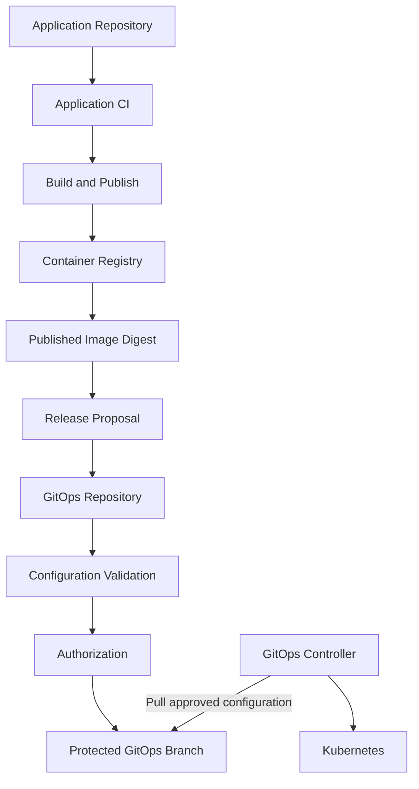
```mermaid
flowchart TD
    A["Application Repository"]
    B["Application CI"]
    C["Build and Publish"]
    D["Container Registry"]
    E["Published Image Digest"]

    F["Release Proposal"]
    G["GitOps Repository"]
    H["Configuration Validation"]
    I["Authorization"]
    J["Protected GitOps Branch"]

    K["GitOps Controller"]
    L["Kubernetes"]

    A --> B
    B --> C
    C --> D
    D --> E

    E --> F
    F --> G
    G --> H
    H --> I
    I --> J

    K -->|"Pull approved configuration"| J
    K --> L
```

### Why choose this design?

Because it makes the boundary between **software production** and **deployment authorization** more explicit.

Our application CI can publish an image without having permission to modify the production GitOps branch directly.

### Important nuance

Repository separation alone does not guarantee secure separation of duties.

If one automation identity has unrestricted write access to both repositories, the practical authority boundary may still be weak.

Permissions and approval policies determine whether the separation is meaningful.

---

# 21. Single GitOps Repository vs Multiple GitOps Repositories

We have decided to separate application source from deployment configuration.

But another question remains:

**Should development, staging, and production use one GitOps repository or separate repositories?**

## Option A: One GitOps repository

```text
platform-gitops/
└── applications/
    └── ecommerce-api/
        └── overlays/
            ├── dev/
            ├── staging/
            └── production/
```

### Advantages

- Central visibility.
- Shared base configuration.
- Easy comparison across environments.
- Convenient for a small number of services.

### Risks

- Broad repository write access can affect several environments.
- Shared configuration changes can have wide impact.
- Review policies must distinguish low-risk and high-risk changes.

---

## Option B: Separate environment repositories

```text
gitops-dev/

gitops-staging/

gitops-production/
```

### Advantages

- Stronger potential repository-level permission separation.
- Independent environment histories.
- Distinct teams can control production.
- Different authorization mechanisms can be used.

### Trade-offs

- More repositories to maintain.
- Shared configuration can be duplicated.
- Promotions may require cross-repository automation.
- Cross-environment comparisons can become harder.

### Design decision

For our learning project, use:

**One GitOps repository with clearly separated environment overlays and protected production changes.**

This gives us enough structure to understand the architecture without introducing unnecessary repository-management complexity.

In a large organization, separate environment repositories may be justified.

---

# 22. Repository Layout Is an Ownership Decision

Do not treat GitOps directory structure as cosmetic.

Directory structure influences:

- Who can propose changes.
- Which resources are grouped together.
- Which environments share configuration.
- How changes are reviewed.
- Which controller Application consumes a path.
- How validation is scoped.
- How deployment blast radius is controlled.

### Example

```text
applications/ecommerce-api/overlays/production/
```

This path represents production configuration for one application.

If an Argo CD Application tracks this directory, changes to the rendered resources can affect the application's production desired state.

### Important distinction

A folder does not automatically establish a security boundary.

For example:

```text
overlays/production/
```

Does not automatically prevent every repository collaborator from editing production configuration.

The corresponding repository rules, review requirements, and controller access must enforce the intended boundary.

### Engineering principle

> **Design GitOps repository structure around deployment ownership, environment boundaries, and change authorization—not merely YAML organization.**

---

# 23. Kustomize and Helm: Why Configuration Composition Exists

Now consider three environments.

They all run the same application.

But they need different settings.

For example:

| Setting | Development | Staging | Production |
|---|---:|---:|---:|
| Image digest | AAA | AAA | BBB |
| Replica count | 1 | 2 | 3 |
| CPU request | 50m | 100m | 250m |
| Memory request | 64Mi | 128Mi | 256Mi |
| Database endpoint | Dev database | Staging database | Production database |

Should we duplicate the complete Kubernetes Deployment manifest three times?

We could.

But duplicated configuration creates maintenance problems.

Suppose a common label changes.

The developer must update all three manifests.

One environment may accidentally be missed.

We want a composition mechanism.

---

# 24. Kustomize: Common Base Plus Environment Overlays

Kustomize provides a way to construct environment-specific Kubernetes manifests using a common base and transformations.

## 24.1 Common base

```text
Common Deployment

Common Service

Common Labels

Common Container Port
```

## 24.2 Environment overlays

```text
Development:
1 Replica
Digest AAA
```

```text
Staging:
2 Replicas
Digest AAA
```

```text
Production:
3 Replicas
Digest BBB
```

## 24.3 Architecture

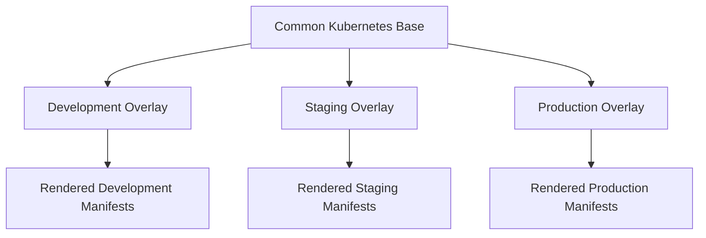
```mermaid
flowchart TD
    A["Common Kubernetes Base"]

    B["Development Overlay"]
    C["Staging Overlay"]
    D["Production Overlay"]

    E["Rendered Development Manifests"]
    F["Rendered Staging Manifests"]
    G["Rendered Production Manifests"]

    A --> B
    A --> C
    A --> D

    B --> E
    C --> F
    D --> G
```

Kustomize supports image changes by name, tag, or digest without requiring the underlying Deployment manifest to be edited for every release. [GitHub](https://github.com/kubernetes-sigs/kustomize/blob/master/site/content/en/docs/Reference/API/Kustomization%20File/images.md?utm_source=chatgpt.com)

### Why is this useful for release engineering?

Because a release promotion can be represented as a small configuration change:

```text
Old Image Digest
        |
        v
New Image Digest
```

Instead of replacing an entire set of Kubernetes manifests.

---

# 25. Helm vs Kustomize

Both can be used in a GitOps delivery system.

But they solve configuration composition differently.

### Kustomize

Works by transforming Kubernetes resource declarations.

Useful concepts:

- Bases.
- Overlays.
- Patches.
- Image transformations.
- Namespace transformations.

### Helm

Works through charts, templates, and values.

Useful concepts:

- Chart.
- Template.
- Values.
- Chart version.
- Release-specific rendering.

### Comparison

| Property | Kustomize | Helm |
|---|---|---|
| Main model | Transform YAML resources | Render templates |
| Reusable application configuration | Base and overlays | Chart |
| Environment differences | Patches and transformations | Values files |
| Packaging | Directory-based configuration | Versionable charts |
| Learning complexity | Often lower for straightforward overlays | Useful abstraction for reusable applications |
| GitOps suitability | Yes | Yes |

### Our choice

Use **Kustomize** for Phase 10.

Why?

Because we want to focus on:

```text
Base Configuration
        +
Environment Intent
        =
Rendered Desired State
```

Helm would also be valid, but it introduces additional templating concepts that are unnecessary for this particular lesson.

---

# 26. Promotion Through Git: What Actually Changes?

Let's return to our ecommerce application.

Suppose the registry contains:

```text
Digest AAA

Digest BBB
```

Development has verified Digest BBB.

Staging still runs Digest AAA.

We want to promote BBB into staging.

What should happen?

### Step 1: Identify the artifact

```text
ghcr.io/example/ecommerce-api@sha256:BBB
```

### Step 2: Propose a GitOps change

Update staging's desired image reference.

### Step 3: Validate the configuration

Check that the rendered manifests are structurally correct and satisfy defined repository policies.

### Step 4: Authorize the change

Review the selected artifact, validation evidence, and release implications.

### Step 5: Merge into the authoritative branch

Now staging's desired state references BBB.

### Step 6: Reconcile

The GitOps controller observes the approved desired state and attempts to apply it.

### Step 7: Verify

Check that the actual deployment and application behavior satisfy the relevant requirements.

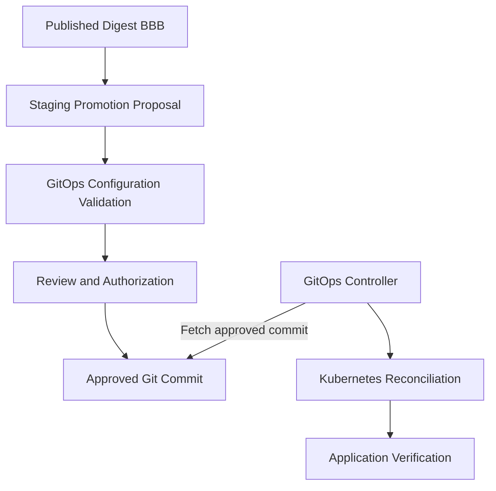
```mermaid
flowchart TD
    A["Published Digest BBB"]
    B["Staging Promotion Proposal"]
    C["GitOps Configuration Validation"]
    D["Review and Authorization"]
    E["Approved Git Commit"]
    F["GitOps Controller"]
    G["Kubernetes Reconciliation"]
    H["Application Verification"]

    A --> B
    B --> C
    C --> D
    D --> E

    F -->|"Fetch approved commit"| E
    F --> G
    G --> H
```

### Most important realization

**GitOps promotion changes the authorized deployment intent.**

It does not rebuild the software.

That is exactly what we designed in Phase 09.

---

# 27. GitOps Security: Who Really Controls Production?

Let's consider a security question.

In our architecture, GitHub Actions does not have production Kubernetes credentials.

Does that mean the CI system can no longer influence production?

Not entirely.

Suppose the application CI workflow has unrestricted write access to the production GitOps branch.

It can change:

```text
Production Image:
Digest AAA
```

To:

```text
Production Image:
Digest MALICIOUS
```

Argo CD may then reconcile the malicious configuration.

Therefore, CI could still exercise indirect deployment authority.

### The deeper security problem

Production authority is not defined only by possession of Kubernetes credentials.

It is also defined by the ability to modify inputs trusted by a privileged controller.

## 27.1 GitOps trust boundaries

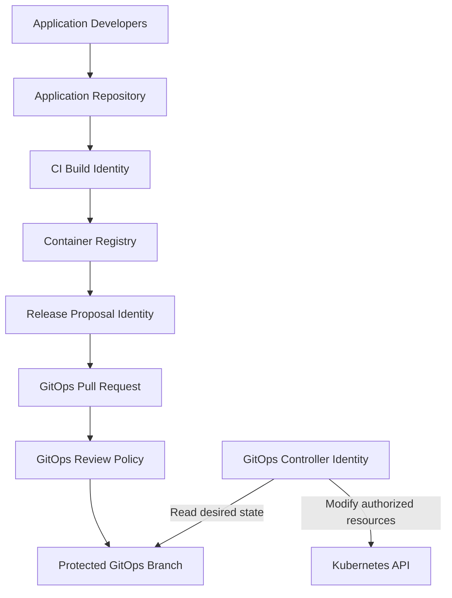
```mermaid
flowchart TD
    A["Application Developers"]
    B["Application Repository"]
    C["CI Build Identity"]
    D["Container Registry"]

    E["Release Proposal Identity"]
    F["GitOps Pull Request"]
    G["GitOps Review Policy"]
    H["Protected GitOps Branch"]

    I["GitOps Controller Identity"]
    J["Kubernetes API"]

    A --> B
    B --> C
    C --> D

    D --> E
    E --> F
    F --> G
    G --> H

    I -->|"Read desired state"| H
    I -->|"Modify authorized resources"| J
```

Each boundary requires its own controls.

### Questions to ask

1. Who can publish images?
2. Who can propose GitOps changes?
3. Who can approve production changes?
4. Who can bypass required reviews?
5. What repository path does the controller trust?
6. Which Kubernetes resources can the controller modify?
7. Who can change the controller's configuration?
8. Can the controller read unexpected repositories or branches?

### Engineering principle

> **In GitOps, configuration write authority and controller permissions together determine the effective deployment trust boundary.**

---

# 28. The Principle of Least Privilege in GitOps

Imagine Argo CD manages only the ecommerce application.

Does it need permission to administer every Kubernetes resource in the cluster?

Not necessarily.

Its required permissions depend on:

- Which resources it manages.
- Which namespaces it targets.
- Whether it creates cluster-scoped resources.
- Whether it manages namespaces.
- Whether it manages application-specific RBAC.

A narrow application deployment might primarily require operations on:

```text
Deployments

Services

ConfigMaps

Selected Secrets

Other Required Application Resources
```

But a platform-level GitOps controller might legitimately manage broader resources.

### Two kinds of authorization

**Git authorization**

Controls who may modify desired state.

**Kubernetes authorization**

Controls what the controller may actually change.

Both are necessary.

```text
Authorized GitOps Change
        +
Controller Kubernetes Permissions
        |
        v
Possible Kubernetes Modification
```

### Important limitation

Repository protection is not a substitute for Kubernetes RBAC.

Likewise, restrictive Kubernetes RBAC is not a substitute for protecting trusted Git configuration.

A well-designed system uses both.

---

# 29. Secrets Management: Should Kubernetes Secrets Be Stored in Git?

This is a common GitOps design question.

Suppose our application needs:

```text
DATABASE_PASSWORD

PAYMENT_API_KEY

JWT_SIGNING_KEY
```

Can we write them directly into the GitOps repository?

Technically, Kubernetes supports Secret manifests.

But storing plaintext credentials in Git is generally inappropriate.

## 29.1 Why plaintext secrets are dangerous

Git preserves history.

Even if someone deletes a secret from the latest version, it may remain accessible through previous commits or copies of the repository.

The exposure surface can include:

- Developers with repository access.
- CI runners.
- Pull-request logs.
- Cloned repositories.
- Backups.
- Automation identities.

### Important distinction

Kubernetes Secret objects contain base64-encoded values in many YAML representations.

**Base64 encoding is not encryption.**

For example:

```yaml
apiVersion: v1
kind: Secret
metadata:
  name: app-secret
type: Opaque
data:
  password: cGFzc3dvcmQ=
```

The encoded value can be decoded.

This example illustrates syntax, not a secure secret-management design.

---

# 30. GitOps-Compatible Secret Management

There are several approaches.

### Option A: External secret store

Store sensitive values in a dedicated secret-management system.

For example:

```text
Azure Key Vault
```

A Kubernetes integration retrieves or synchronizes the secrets according to its authentication and authorization design.

### Option B: Encrypted secrets in Git

Store encrypted representations that can be decrypted only by appropriately authorized components.

Examples include systems built around SOPS or Sealed Secrets.

### Option C: Workload identity

Where supported, avoid static application credentials by allowing workloads to authenticate to external services using short-lived identity credentials.

These approaches solve different problems.

## 30.1 Example architecture

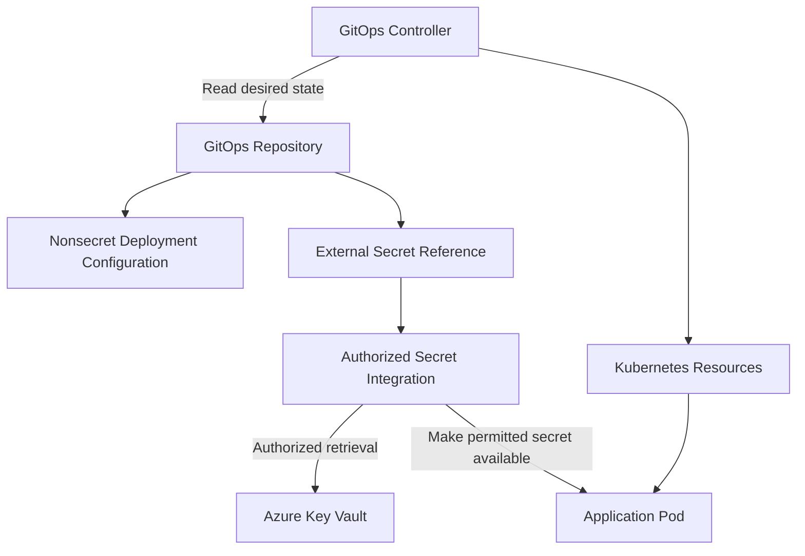
```mermaid
flowchart TD
    A["GitOps Repository"]
    B["Nonsecret Deployment Configuration"]
    C["External Secret Reference"]

    D["GitOps Controller"]
    E["Kubernetes Resources"]

    F["Authorized Secret Integration"]
    G["Azure Key Vault"]

    H["Application Pod"]

    A --> B
    A --> C

    D -->|"Read desired state"| A
    D --> E

    C --> F
    F -->|"Authorized retrieval"| G

    E --> H
    F -->|"Make permitted secret available"| H
```

This is a conceptual architecture.

The precise components depend on the selected secret-management integration.

### Our design choice

For the current course:

- Keep ordinary configuration in Git.
- Keep production credentials out of plaintext Git.
- Use workload identity or a suitable secret-management integration when we build the production system.

### Engineering principle

**GitOps makes configuration declarative and versioned. It does not require plaintext secrets to become part of Git history.**

---

# 31. GitOps Failure Scenario 1 — The Controller Cannot Reach Git

Imagine the GitOps controller cannot access the repository.

Possible causes:

- Network outage.
- Git hosting outage.
- Repository credential failure.
- Invalid repository URL.
- TLS or certificate problems.
- Repository permission changes.

### What happens?

The controller may be unable to obtain the latest desired configuration.

It therefore cannot reliably process new Git changes.

Existing Kubernetes workloads may continue running.

But the GitOps system's ability to synchronize new changes is impaired.

### Important distinction

```text
Git Repository Unavailable
       !=
All Running Application Pods Immediately Fail
```

However, the operational impact depends on whether other application dependencies are affected.

---

# 32. GitOps Failure Scenario 2 — Kubernetes Is Unavailable

Now suppose Git is reachable.

The release team merges a desired-state change.

But the Kubernetes API is unavailable.

### What can the controller do?

It may be able to read the desired configuration.

But it cannot successfully query or update the target Kubernetes resources while the API is unreachable.

The requested state transition cannot complete.

### Fundamental principle

**GitOps reconciliation depends on both desired-state access and actual-state management capability.**

A valid Git commit is not proof of a completed deployment.

---

# 33. GitOps Failure Scenario 3 — The Image Cannot Be Pulled

Suppose Git specifies:

```text
ghcr.io/example/ecommerce-api@sha256:BBB
```

The controller successfully updates the Kubernetes Deployment configuration.

But the Kubernetes nodes cannot retrieve the image.

Possible reasons:

- Registry unavailable.
- Missing registry credentials.
- Image digest does not exist.
- Network restrictions.
- Architecture incompatibility.

The deployment may report an image-pull error.

### What should the system report?

We need to distinguish:

```text
Desired Configuration Applied
```

from:

```text
Application Ready
```

And:

```text
Application Operationally Healthy
```

### Correct debugging sequence

1. Verify the expected GitOps commit.
2. Verify the rendered image reference.
3. Check the controller's synchronization result.
4. Inspect Kubernetes Deployment and Pod conditions.
5. Check image-pull events.
6. Verify registry access and artifact availability.
7. Confirm runtime health after the image starts.

Do not immediately assume the GitOps controller itself is broken.

---

# 34. GitOps Failure Scenario 4 — Multiple Controllers Own the Same Resource

Imagine two Argo CD Applications both manage the same Deployment.

Application A requests:

```text
Image AAA
```

Application B requests:

```text
Image BBB
```

What is the correct desired state?

The system has conflicting instructions.

Repeated reconciliation may cause instability or conflicting updates.

### Architectural response

Define clear resource ownership.

A Kubernetes resource should not normally be independently controlled by two GitOps Applications with conflicting desired configuration.

Argo CD supports an option to detect resources already managed by another Application and fail synchronization rather than silently sharing ownership. [GitHub](https://github.com/argoproj/argo-cd/blob/master/docs/user-guide/sync-options.md?utm_source=chatgpt.com)

### General principle

> **A reconciler must know which resources and fields it owns.**

This is a broader systems principle, not something unique to GitOps.

---

# 35. GitOps Failure Scenario 5 — A Production Change Bypasses Git

Imagine an engineer runs:

```bash
kubectl set image deployment/ecommerce-api \
  api=ghcr.io/example/ecommerce-api:emergency
```

The live cluster changes.

But Git still references the previous approved digest.

Now there are two possible sources of deployment intent:

```text
GitOps:
Digest AAA
```

```text
Live Kubernetes:
Emergency Image
```

### What happens next?

It depends on reconciliation and self-healing policies.

The controller may report drift.

With suitable automation, it may restore the Git-defined image.

### What should an engineer do?

For ordinary changes, update the authoritative GitOps state.

For emergency interventions, follow a documented procedure that accounts for the controller's authority.

If emergency live changes are permitted, their relationship to Git reconciliation must be managed explicitly.

### Important principle

**Direct Kubernetes changes are not a durable replacement for the authoritative desired state in a continuously reconciled GitOps system.**

---

# 36. GitOps Recovery: Restore Desired State, Not Just a Command History

Now imagine production runs Digest BBB.

The application begins failing.

The previous approved release used Digest AAA.

A recovery decision is made.

In our reference architecture, the authorized change should restore the desired image reference in Git.

```text
Before:

Production -> Digest BBB
```

```text
After:

Production -> Digest AAA
```

This change creates a new Git commit.

The new commit is not the same as the historical commit that originally introduced Digest AAA.

It is a new recorded decision to restore that artifact.

## 36.1 Recovery architecture

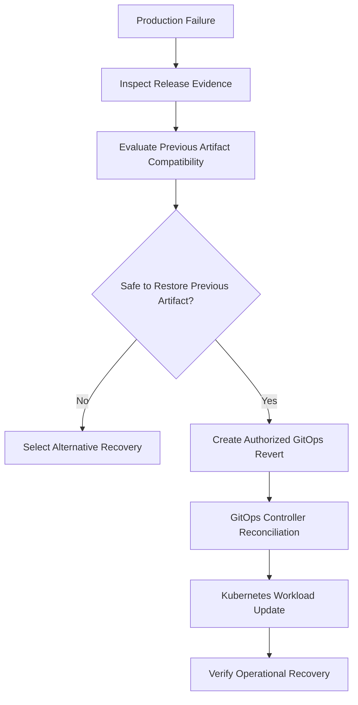
```mermaid
flowchart TD
    A["Production Failure"]
    B["Inspect Release Evidence"]
    C["Evaluate Previous Artifact Compatibility"]
    D{"Safe to Restore Previous Artifact?"}
    E["Select Alternative Recovery"]
    F["Create Authorized GitOps Revert"]
    G["GitOps Controller Reconciliation"]
    H["Kubernetes Workload Update"]
    I["Verify Operational Recovery"]

    A --> B
    B --> C
    C --> D

    D -->|No| E
    D -->|Yes| F

    F --> G
    G --> H
    H --> I
```

### Important caveat

Application rollback does not reverse database or external side effects automatically.

Remember the expand–migrate–contract strategy from Phase 09.

Before restoring an older application, verify compatibility with the current data and schema.

### Argo CD-specific consideration

When automated synchronization is enabled, Argo CD's built-in application rollback command is not the usual recovery mechanism. Its documentation describes restrictions on rollback while auto-sync is active.

Restoring the previous artifact through an approved desired-state change aligns with the GitOps model. [GitHub](https://github.com/argoproj/argo-cd/blob/master/docs/user-guide/auto_sync.md?utm_source=chatgpt.com)

---

# 37. What Does GitOps Improve — and What Does It Not Solve?

Let's evaluate GitOps as an engineering choice.

## 37.1 Problems GitOps can help with

| Problem | GitOps contribution |
|---|---|
| Deployment configuration lacks history | Versioned desired state |
| Manual configuration drift | Continuous comparison |
| CI has broad production cluster access | Pull-oriented controller architecture |
| Release decisions are difficult to review | Pull requests and Git history |
| Environment changes lack traceability | Git commits and review records |
| Recovery state is unclear | Previous configuration history |
| Many environments have repeated manifests | Composition with Kustomize or Helm |
| Actual state differs from approved state | Drift visibility and optional correction |

## 37.2 Problems GitOps does not automatically solve

| Problem | Why GitOps alone is insufficient |
|---|---|
| Application contains a business logic bug | Requires tests and runtime verification |
| Container image contains vulnerabilities | Requires software supply-chain controls |
| Database migration is incompatible | Requires migration planning |
| Production traffic overloads the application | Requires capacity management |
| Application secrets are exposed | Requires secret-management controls |
| Registry is unavailable | Requires distribution resilience |
| A release causes HTTP 500 errors | Requires operational detection and recovery |
| Unauthorized GitOps changes are approved | Requires stronger authorization governance |
| Controller permissions are excessive | Requires Kubernetes RBAC design |
| Multiple controllers conflict | Requires resource and field ownership |

### Key insight

> **GitOps solves a specific class of deployment-state management problems. It must be integrated with CI, release engineering, security, reliability, and observability to produce a complete delivery system.**

---

# 38. Practical Lab 10 — Design a GitOps Repository and Validate Desired State

Now we will implement the concepts.

**Project:** GitOps Desired-State Engineering Lab  
**Configuration:** Kubernetes + Kustomize  
**CI:** GitHub Actions  
**Artifact Registry:** GHCR  
**Application:** Node.js API from Phase 07  
**Cloud infrastructure:** Not required  
**Argo CD:** Not required for the offline portion

We will extend the `release-gitops-lab` repository from Phase 09.

### What will we demonstrate?

1. Git as a versioned record of deployment intent.
2. Common application configuration.
3. Environment-specific overlays.
4. Immutable artifact references.
5. Declarative environment differences.
6. Automated configuration validation.
7. Pull-request quality gates.
8. Release promotion through Git.
9. Configuration-drift reasoning.
10. Recovery through an authorized Git change.

### What will we not claim?

We will not claim that an application was deployed or that Argo CD reconciled a cluster unless we actually run and observe those operations.

That is the distinction between **preparing GitOps desired state** and **operating a complete GitOps system**.

---

# 39. Lab Architecture

Our repository will contain:

```text
release-gitops-lab/
│
├── applications/
│   └── ecommerce-api/
│       │
│       ├── base/
│       │   ├── deployment.yaml
│       │   ├── service.yaml
│       │   └── kustomization.yaml
│       │
│       └── overlays/
│           │
│           ├── dev/
│           │   └── kustomization.yaml
│           │
│           ├── staging/
│           │   └── kustomization.yaml
│           │
│           └── production/
│               └── kustomization.yaml
│
├── scripts/
│   ├── promote.py
│   ├── validate_gitops.py
│   └── reconciliation_demo.py
│
├── .github/
│   └── workflows/
│       └── validate-gitops.yml
│
├── releases/
│
├── requirements-gitops.txt
└── README.md
```

The `base`, `overlays`, and `promote.py` files were introduced in Phase 09.

We will now add:

- Explicit environment configuration.
- Automated policy validation.
- A small reconciliation experiment.
- A GitHub Actions validation workflow.

## 39.1 Logical architecture

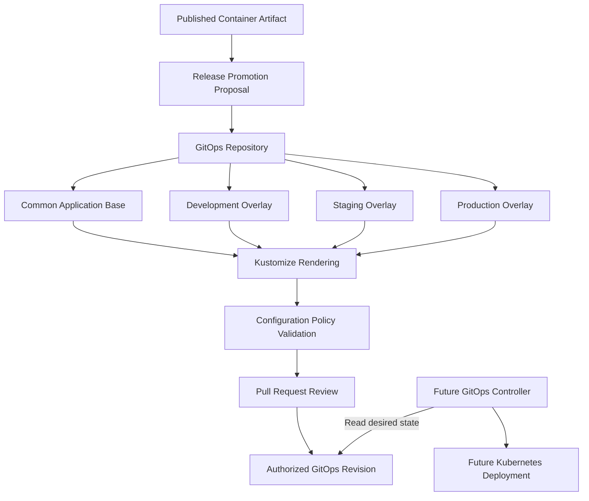
```mermaid
flowchart TD
    A["Published Container Artifact"]
    B["Release Promotion Proposal"]
    C["GitOps Repository"]

    D["Common Application Base"]
    E["Development Overlay"]
    F["Staging Overlay"]
    G["Production Overlay"]

    H["Kustomize Rendering"]
    I["Configuration Policy Validation"]
    J["Pull Request Review"]
    K["Authorized GitOps Revision"]

    L["Future GitOps Controller"]
    M["Future Kubernetes Deployment"]

    A --> B
    B --> C

    C --> D
    C --> E
    C --> F
    C --> G

    D --> H
    E --> H
    F --> H
    G --> H

    H --> I
    I --> J
    J --> K

    L -->|"Read desired state"| K
    L --> M
```

The controller and deployment appear as future integration points.

They are not required for the offline exercises.

---

# 40. Lab Part A — Verify Your Existing Repository

Open your repository:

```bash
cd release-gitops-lab
```

Verify:

```bash
find applications -type f
```

You should have the files created in Phase 09.

If you're starting directly from this phase, create the same directory structure and use the base resources and overlays from Phase 09.

## 40.1 Base Deployment

The base Deployment should contain an image placeholder:

```yaml
apiVersion: apps/v1
kind: Deployment
metadata:
  name: ecommerce-api
spec:
  replicas: 1
  selector:
    matchLabels:
      app: ecommerce-api
  template:
    metadata:
      labels:
        app: ecommerce-api
    spec:
      containers:
        - name: api
          image: app-image-placeholder
          ports:
            - name: http
              containerPort: 3000
          readinessProbe:
            httpGet:
              path: /health
              port: http
            initialDelaySeconds: 2
            periodSeconds: 5
          resources:
            requests:
              cpu: 50m
              memory: 64Mi
            limits:
              cpu: 500m
              memory: 256Mi
```

## 40.2 Base Service

```yaml
apiVersion: v1
kind: Service
metadata:
  name: ecommerce-api
spec:
  selector:
    app: ecommerce-api
  ports:
    - name: http
      port: 80
      targetPort: 3000
  type: ClusterIP
```

## 40.3 Base Kustomization

```yaml
apiVersion: kustomize.config.k8s.io/v1beta1
kind: Kustomization

resources:
  - deployment.yaml
  - service.yaml
```

These files describe the common application resources.

They do not select a particular production release.

That responsibility belongs to the overlays.

---

# 41. Lab Part B — Understand an Environment Overlay

Let's examine:

```text
applications/ecommerce-api/overlays/dev/kustomization.yaml
```

It should have this structure:

```yaml
apiVersion: kustomize.config.k8s.io/v1beta1
kind: Kustomization

namespace: ecommerce-dev

resources:
  - ../../base

images:
  - name: app-image-placeholder
    newName: ghcr.io/YOUR-OWNER/ci-artifact-lab
    digest: sha256:aaaaaaaaaaaaaaaaaaaaaaaaaaaaaaaaaaaaaaaaaaaaaaaaaaaaaaaaaaaaaaaa
```

**Replace the example repository name and digest with the real image published in Phase 07 or 08.**

Do the same for staging and production, using their corresponding namespaces.

### What does `resources` mean?

```yaml
resources:
  - ../../base
```

The environment inherits the common base resources.

### What does `namespace` mean?

```yaml
namespace: ecommerce-dev
```

Kustomize renders the namespace into applicable resources.

It does not automatically create a Namespace object unless one is included separately or the deployment process is explicitly configured to create it.

### What does `images` mean?

```yaml
images:
  - name: app-image-placeholder
    newName: ghcr.io/YOUR-OWNER/ci-artifact-lab
    digest: sha256:...
```

Kustomize replaces the matching image reference.

The resulting Deployment should reference the exact published image digest.

### The important relationship

```text
Base:
Describes Common Workload
```

```text
Overlay:
Describes Environment-Specific Intent
```

```text
Rendered Manifest:
Describes Desired Kubernetes Resources
```

---

# 42. Lab Part C — Introduce Environment-Specific Replica Counts

Now let's demonstrate configuration differences without duplicating the base Deployment.

Use these desired replica counts:

| Environment | Replicas |
|---|---:|
| Development | 1 |
| Staging | 2 |
| Production | 3 |

For each environment overlay, add a Kustomize patch.

For development:

```yaml
patches:
  - target:
      kind: Deployment
      name: ecommerce-api
    patch: |-
      - op: replace
        path: /spec/replicas
        value: 1
```

For staging:

```yaml
patches:
  - target:
      kind: Deployment
      name: ecommerce-api
    patch: |-
      - op: replace
        path: /spec/replicas
        value: 2
```

For production:

```yaml
patches:
  - target:
      kind: Deployment
      name: ecommerce-api
    patch: |-
      - op: replace
        path: /spec/replicas
        value: 3
```

Add each patch to the corresponding existing `kustomization.yaml`.

Do not remove its `resources`, `namespace`, or `images` configuration.

## 42.1 Example complete production overlay

```yaml
apiVersion: kustomize.config.k8s.io/v1beta1
kind: Kustomization

namespace: ecommerce-production

resources:
  - ../../base

images:
  - name: app-image-placeholder
    newName: ghcr.io/YOUR-OWNER/ci-artifact-lab
    digest: sha256:aaaaaaaaaaaaaaaaaaaaaaaaaaaaaaaaaaaaaaaaaaaaaaaaaaaaaaaaaaaaaaaa

patches:
  - target:
      kind: Deployment
      name: ecommerce-api
    patch: |-
      - op: replace
        path: /spec/replicas
        value: 3
```

### Why is this better than three complete Deployments?

Because the application structure remains centralized.

The production overlay expresses only the differences we intend.

### Important architectural qualification

If the application later uses a Horizontal Pod Autoscaler, we must revisit ownership of `spec.replicas`.

We should not blindly force a static replica count while an autoscaler is authorized to manage it.

That would recreate the conflicting-controller problem.

---

# 43. Lab Part D — Render Every Environment

Run:

```bash
kubectl kustomize \
  applications/ecommerce-api/overlays/dev
```

Then:

```bash
kubectl kustomize \
  applications/ecommerce-api/overlays/staging
```

And:

```bash
kubectl kustomize \
  applications/ecommerce-api/overlays/production
```

You do not need a running Kubernetes cluster for these commands.

## 43.1 Inspect the rendered output

For development:

```bash
kubectl kustomize \
  applications/ecommerce-api/overlays/dev \
  > /tmp/ecommerce-dev.yaml
```

For production:

```bash
kubectl kustomize \
  applications/ecommerce-api/overlays/production \
  > /tmp/ecommerce-production.yaml
```

Inspect image references:

```bash
grep "image:" /tmp/ecommerce-dev.yaml
```

```bash
grep "image:" /tmp/ecommerce-production.yaml
```

Inspect replica counts:

```bash
grep "replicas:" /tmp/ecommerce-dev.yaml
```

```bash
grep "replicas:" /tmp/ecommerce-production.yaml
```

### Expected conceptual result

Development:

```text
Namespace:
ecommerce-dev

Replicas:
1
```

Production:

```text
Namespace:
ecommerce-production

Replicas:
3
```

Both should reference valid image digest forms.

They may reference the same image digest or different approved releases.

### What have we proved?

We have demonstrated that Kustomize can render environment-specific configurations from a common base.

### What have we not proved?

We have not proved that:

- A Kubernetes API accepts the resources.
- The namespaces exist.
- The registry image is accessible.
- The application starts.
- The application is healthy.
- A GitOps controller is running.

**Rendering desired state is a preparation step, not deployment evidence.**

---

# 44. Lab Part E — Define GitOps Validation Requirements

We now want GitHub Actions to validate proposed GitOps changes.

Before writing the workflow, define our requirements.

### POL-01: All environments must render successfully

If Kustomize cannot render an overlay, reject the change.

### POL-02: Every environment must reference an immutable image digest

Reject references such as:

```text
ghcr.io/example/ecommerce-api:latest
```

Our policy requires:

```text
ghcr.io/example/ecommerce-api@sha256:<digest>
```

### POL-03: Every environment must use the correct namespace

Development:

```text
ecommerce-dev
```

Staging:

```text
ecommerce-staging
```

Production:

```text
ecommerce-production
```

### POL-04: The Deployment must define an expected readiness endpoint

Our application exposes:

```text
/health
```

The Deployment should configure an appropriate readiness probe.

### POL-05: The Deployment must define resource requests and limits

We want basic CPU and memory configuration to be explicit.

### POL-06: The Service and Deployment must use compatible selectors

The Service should select the intended Pods.

### POL-07: Every environment must have an expected replica policy

For this lab:

```text
dev = 1

staging = 2

production = 3
```

This is a lab policy, not a universal production recommendation.

### POL-08: A successful check must not claim runtime verification

Our GitOps validation workflow should validate configuration.

It should not claim to have deployed the application.

---

# 45. Lab Part F — Implement a GitOps Policy Validator

Create:

```text
requirements-gitops.txt
```

Add:

```text
PyYAML==6.0.2
```

This dependency allows our Python script to inspect rendered Kubernetes YAML.

Now create:

```text
scripts/validate_gitops.py
```

Add:

```python
#!/usr/bin/env python3

import re
import subprocess
import sys
from pathlib import Path

import yaml


ROOT = Path(__file__).resolve().parents[1]

APPLICATION = (
    ROOT
    / "applications"
    / "ecommerce-api"
)

EXPECTED_REPLICAS = {
    "dev": 1,
    "staging": 2,
    "production": 3,
}

IMAGE_PATTERN = re.compile(
    r"^ghcr\.io/[a-z0-9._/-]+@sha256:[0-9a-f]{64}$"
)


def require(condition, message):
    if not condition:
        raise ValueError(message)


def render_environment(environment):
    overlay = (
        APPLICATION
        / "overlays"
        / environment
    )

    process = subprocess.run(
        ["kubectl", "kustomize", str(overlay)],
        check=True,
        capture_output=True,
        text=True,
    )

    return list(
        yaml.safe_load_all(process.stdout)
    )


def find_resource(resources, kind, name):
    matches = [
        resource
        for resource in resources
        if isinstance(resource, dict)
        and resource.get("kind") == kind
        and resource.get("metadata", {}).get("name") == name
    ]

    require(
        len(matches) == 1,
        f"Expected exactly one {kind}/{name}",
    )

    return matches[0]


def validate_environment(environment):
    print(f"Validating: {environment}")

    resources = render_environment(environment)

    deployment = find_resource(
        resources,
        "Deployment",
        "ecommerce-api",
    )

    service = find_resource(
        resources,
        "Service",
        "ecommerce-api",
    )

    expected_namespace = (
        f"ecommerce-{environment}"
    )

    for resource in (deployment, service):
        require(
            resource["metadata"].get("namespace")
            == expected_namespace,
            "Incorrect resource namespace",
        )

    spec = deployment["spec"]

    require(
        spec.get("replicas")
        == EXPECTED_REPLICAS[environment],
        "Incorrect replica policy",
    )

    containers = (
        spec["template"]["spec"]["containers"]
    )

    require(
        len(containers) == 1,
        "Expected one application container",
    )

    container = containers[0]

    image = container["image"]

    require(
        IMAGE_PATTERN.fullmatch(image) is not None,
        f"Invalid immutable image reference: {image}",
    )

    readiness = container.get(
        "readinessProbe", {}
    )

    require(
        readiness.get("httpGet", {}).get("path")
        == "/health",
        "Missing expected readiness path",
    )

    resources_config = container.get(
        "resources", {}
    )

    for category in ("requests", "limits"):
        values = resources_config.get(
            category, {}
        )

        for key in ("cpu", "memory"):
            require(
                key in values,
                f"Missing resource {category}.{key}",
            )

    labels = (
        spec["template"]["metadata"]["labels"]
    )

    deployment_selector = (
        spec["selector"]["matchLabels"]
    )

    service_selector = (
        service["spec"]["selector"]
    )

    for key, value in deployment_selector.items():
        require(
            labels.get(key) == value,
            "Deployment selector does not match Pod labels",
        )

    for key, value in service_selector.items():
        require(
            labels.get(key) == value,
            "Service selector does not match Pod labels",
        )

    print(f"  Namespace: {expected_namespace}")
    print(f"  Replicas: {spec['replicas']}")
    print(f"  Image: {image}")
    print("  Result: PASS")


def main():
    try:
        for environment in EXPECTED_REPLICAS:
            validate_environment(environment)

    except (
        ValueError,
        KeyError,
        IndexError,
        subprocess.CalledProcessError,
        yaml.YAMLError,
    ) as error:
        print(
            f"GitOps validation failed: {error}",
            file=sys.stderr,
        )

        raise SystemExit(1)

    print("All GitOps configuration checks passed")


if __name__ == "__main__":
    main()
```

---

# 46. Understand the Validator From First Principles

We did not start by choosing a policy engine.

We started by defining properties that our desired state must satisfy.

Then we implemented a small validator.

## 46.1 What are its inputs?

```text
GitOps Repository Files
```

## 46.2 What transformations occur?

```text
Kustomize Rendering
        |
        v
Structured YAML Parsing
        |
        v
Policy Evaluation
```

## 46.3 What does it produce?

```text
Validation Result:
Pass or Fail
```

## 46.4 What does it verify?

- Rendering succeeds.
- Expected resources exist.
- Namespaces are correct.
- Replica counts match the lab policy.
- Image references use SHA-256 digest syntax.
- Readiness configuration exists.
- CPU and memory requirements are defined.
- Resource selectors are compatible.

### What does it not verify?

It does not verify:

- Artifact provenance.
- The image's existence in the registry.
- Live Kubernetes schema admission.
- Cluster resource capacity.
- Argo CD configuration.
- Deployment success.
- Actual application health.

That is intentional.

### Engineering principle

> **A configuration quality gate must be understood in terms of the specific properties it actually evaluates.**

---

# 47. Lab Part G — Execute the Validator Locally

Create a Python virtual environment:

```bash
python3 -m venv .venv
```

Activate it:

```bash
source .venv/bin/activate
```

Install the dependency:

```bash
python -m pip install \
  -r requirements-gitops.txt
```

Ensure your `.gitignore` includes:

```gitignore
.venv/
__pycache__/
```

Now run:

```bash
python scripts/validate_gitops.py
```

Expected conceptual output:

```text
Validating: dev
  Namespace: ecommerce-dev
  Replicas: 1
  Image: ghcr.io/...@sha256:...
  Result: PASS

Validating: staging
  Namespace: ecommerce-staging
  Replicas: 2
  Image: ghcr.io/...@sha256:...
  Result: PASS

Validating: production
  Namespace: ecommerce-production
  Replicas: 3
  Image: ghcr.io/...@sha256:...
  Result: PASS

All GitOps configuration checks passed
```

The exact image references depend on your repository.

### What should you think about?

Why is this useful before a production promotion?

Because it detects certain configuration mistakes before the change becomes authoritative.

But remember:

**This is configuration validation, not deployment verification.**

---

# 48. Lab Part H — Enforce Configuration Validation in GitHub Actions

Now create:

```text
.github/workflows/validate-gitops.yml
```

Add:

```yaml
name: Validate GitOps Configuration

on:
  pull_request:
    branches:
      - main

  merge_group:
    types:
      - checks_requested

  push:
    branches:
      - main

permissions:
  contents: read

jobs:
  validate:
    name: Required GitOps Validation
    runs-on: ubuntu-latest
    timeout-minutes: 10

    steps:
      - name: Checkout GitOps repository
        uses: actions/checkout@v7
        with:
          persist-credentials: false

      - name: Configure Python
        uses: actions/setup-python@v6
        with:
          python-version: "3.12"

      - name: Install kubectl
        uses: azure/setup-kubectl@v4

      - name: Install validation dependencies
        run: |
          python -m pip install \
            -r requirements-gitops.txt

      - name: Validate GitOps desired state
        run: |
          python scripts/validate_gitops.py

      - name: Check patch formatting
        run: git diff --check

      - name: Record validation summary
        if: ${{ always() }}
        run: |
          {
            echo "## GitOps Configuration Validation"
            echo ""
            echo "Source revision: \`$GITHUB_SHA\`"
            echo ""
            echo "This workflow validates configuration."
            echo ""
            echo "It does not deploy Kubernetes resources."
          } >> "$GITHUB_STEP_SUMMARY"
```

The `azure/setup-kubectl` action is maintained to install a selected kubectl version on GitHub Actions runners. In production, choose a tested version and consider immutable action references. [GitHub](https://github.com/Azure/setup-kubectl?utm_source=chatgpt.com)

## 48.1 What does this workflow do?

It:

1. Checks out the proposed GitOps configuration.
2. Provides Python.
3. Installs kubectl for Kustomize rendering.
4. Installs the YAML parser.
5. Validates each environment's desired state.
6. Produces a result that repository rules can require.

## 48.2 What permissions does it need?

```yaml
permissions:
  contents: read
```

It does not need:

```text
Production Kubernetes Credentials

Cloud Administrator Credentials

Container Registry Write Access
```

Because it is not deploying anything.

### Important security point

The validation script itself is code stored in the repository.

A contributor may propose changes to both manifests and validation logic.

For a stronger security boundary, protect policy code through appropriate review ownership, or use centrally controlled reusable validation whose modifications require separate authorization.

Do not assume that a green check is independent evidence if the same untrusted change can weaken the checker without review.

---

# 49. Lab Part I — Configure the GitOps Quality Gate

After publishing the repository to GitHub, configure the intended branch policy.

For `main`, require:

```text
Pull Request Review

Required GitOps Validation

Restricted Bypass

Appropriate Merge Rules
```

Use GitHub repository rulesets or branch protection according to the repository's available features.

If you use a merge queue, ensure the workflow responds to `merge_group` events.

### What is the result?

A proposed change containing an invalid image reference should fail the required GitOps configuration check.

If the check is enforced, the change cannot ordinarily enter the protected branch without satisfying the configured policy.

### Important distinction

GitHub Actions performs validation.

Repository rules enforce the merge requirement.

The GitOps controller later consumes the authoritative approved branch.

These responsibilities should remain separate.

---

# 50. Failure Experiment 1 — Replace the Digest With `latest`

Open:

```text
applications/ecommerce-api/overlays/production/kustomization.yaml
```

Replace the `images` entry with:

```yaml
images:
  - name: app-image-placeholder
    newName: ghcr.io/example/ecommerce-api
    newTag: latest
```

Now run:

```bash
python scripts/validate_gitops.py
```

### Expected result

The policy should reject the production image reference.

Why?

Because the rendered image no longer matches the required digest format.

### What did we demonstrate?

We converted an architectural requirement:

> Production must select immutable image content.

Into an executable policy.

Restore the real `digest` entry afterward.

---

# 51. Failure Experiment 2 — Break a Service Selector

Open:

```text
applications/ecommerce-api/base/service.yaml
```

Change:

```yaml
selector:
  app: ecommerce-api
```

To:

```yaml
selector:
  app: another-application
```

Now run:

```bash
python scripts/validate_gitops.py
```

### Expected result

The validation should fail.

Why?

Because the Service selector no longer matches the intended application's Pod labels.

### What does this teach us?

A manifest can be valid YAML while expressing an incorrect system relationship.

The issue is not syntax.

The issue is architecture.

```text
Service
    |
    v
Selector
    |
    v
Wrong Pods
```

### Important distinction

A YAML parser may accept the file.

Kustomize may render it.

Kubernetes may even accept the Service resource.

But the intended traffic routing relationship is wrong.

This is why configuration validation should include semantic expectations, not only syntax checks.

Restore the selector afterward.

---

# 52. Failure Experiment 3 — Remove the Readiness Probe

Temporarily remove:

```yaml
readinessProbe:
  httpGet:
    path: /health
    port: http
  initialDelaySeconds: 2
  periodSeconds: 5
```

From the base Deployment.

Run:

```bash
python scripts/validate_gitops.py
```

### Expected result

Our policy should fail because the required readiness check is missing.

### What does this prove?

We have encoded a delivery requirement into configuration validation.

But let's think more deeply.

Does the presence of a readiness probe guarantee application health?

No.

It only ensures that the configuration contains a particular readiness mechanism.

Whether `/health` accurately represents the application's ability to serve traffic is a separate application-design concern.

### Engineering lesson

**Static configuration checks verify configured mechanisms. Runtime checks verify their actual behavior.**

---

# 53. Failure Experiment 4 — Change Production Replica Count

Suppose a contributor changes production replicas from three to one.

The YAML is valid.

Kustomize renders successfully.

But the change violates our lab policy.

Run the validator.

It should reject the new configuration.

### Think about the real-world trade-off

Would every production system require a fixed replica count?

No.

Some applications use autoscaling.

For those systems, a static replica-count requirement might be inappropriate.

A better policy might instead require:

- A valid Horizontal Pod Autoscaler.
- Defined minimum and maximum replicas.
- Appropriate resource requests.
- Clear ownership of the replica field.

### Important principle

> **A policy is useful only when it accurately represents the system requirement it is intended to enforce.**

Don't copy security or reliability policies without understanding the underlying architecture.

---

# 54. A Small Reconciliation Experiment — Simulate Desired vs Actual State

We have validated the GitOps configuration.

But we haven't yet run a reconciliation controller.

Before introducing Argo CD in Phase 11, let's implement a tiny local demonstration.

This experiment is intentionally simplified.

It will show:

```text
Desired State
        |
        v
Compare With Actual State
        |
        v
Detect Differences
        |
        v
Update Simulated State
```

**It will not modify Kubernetes.**

The purpose is to understand the algorithm behind a reconciliation loop.

## 54.1 Create the simulation script

Create:

```text
scripts/reconciliation_demo.py
```

Add:

```python
#!/usr/bin/env python3

import argparse
import json
import subprocess
from pathlib import Path

import yaml


ROOT = Path(__file__).resolve().parents[1]

APPLICATION = (
    ROOT
    / "applications"
    / "ecommerce-api"
)

STATE_DIRECTORY = ROOT / "mock-state"


def desired_state(environment):
    overlay = (
        APPLICATION
        / "overlays"
        / environment
    )

    process = subprocess.run(
        ["kubectl", "kustomize", str(overlay)],
        check=True,
        capture_output=True,
        text=True,
    )

    resources = list(
        yaml.safe_load_all(process.stdout)
    )

    deployment = next(
        resource
        for resource in resources
        if resource.get("kind") == "Deployment"
    )

    spec = deployment["spec"]

    return {
        "image": (
            spec["template"]["spec"]
            ["containers"][0]["image"]
        ),
        "replicas": spec["replicas"],
    }


def main():
    parser = argparse.ArgumentParser()

    parser.add_argument(
        "environment",
        choices=("dev", "staging", "production"),
    )

    parser.add_argument(
        "--apply",
        action="store_true",
        help="Update only the local mock-state file",
    )

    args = parser.parse_args()

    desired = desired_state(args.environment)

    STATE_DIRECTORY.mkdir(
        parents=True,
        exist_ok=True,
    )

    state_file = (
        STATE_DIRECTORY
        / f"{args.environment}.json"
    )

    if state_file.exists():
        actual = json.loads(
            state_file.read_text()
        )
    else:
        actual = {}

    print("Desired state:")
    print(json.dumps(desired, indent=2))

    print("Simulated actual state:")
    print(json.dumps(actual, indent=2))

    differences = {
        key: {
            "desired": value,
            "actual": actual.get(key),
        }
        for key, value in desired.items()
        if actual.get(key) != value
    }

    if not differences:
        print("Status: IN SYNC")
        return

    print("Status: DRIFT DETECTED")

    print(json.dumps(
        differences,
        indent=2,
    ))

    if args.apply:
        state_file.write_text(
            json.dumps(desired, indent=2) + "\n"
        )

        print(
            "Mock reconciliation completed. "
            "No Kubernetes resources were modified."
        )


if __name__ == "__main__":
    main()
```

Add the simulation output directory to `.gitignore`:

```gitignore
mock-state/
```

This prevents temporary simulated state from becoming part of the authoritative configuration.

---

# 55. Execute the Reconciliation Experiment

## Step 1 — Observe the initial difference

Run:

```bash
python scripts/reconciliation_demo.py dev
```

The mock actual-state file does not yet exist.

The script should report differences.

Conceptually:

```text
Desired State:
Image AAA
Replicas 1

Actual State:
Empty

Result:
DRIFT DETECTED
```

The script does not automatically change anything.

---

## Step 2 — Apply one simulated reconciliation

Run:

```bash
python scripts/reconciliation_demo.py dev --apply
```

The script writes the desired image and replica count into:

```text
mock-state/dev.json
```

This represents one simplified reconciliation operation.

It does not create any Kubernetes resources.

---

## Step 3 — Observe convergence

Run:

```bash
python scripts/reconciliation_demo.py dev
```

Expected:

```text
Status: IN SYNC
```

The simulated actual state now matches the relevant desired fields.

---

## Step 4 — Introduce simulated drift

Open:

```text
mock-state/dev.json
```

Change:

```json
{
  "image": "ghcr.io/example/ecommerce-api@sha256:aaaaaaaaaaaaaaaaaaaaaaaaaaaaaaaaaaaaaaaaaaaaaaaaaaaaaaaaaaaaaaaa",
  "replicas": 1
}
```

To a file that preserves your real image reference but changes:

```json
"replicas": 5
```

Save the file.

Now run:

```bash
python scripts/reconciliation_demo.py dev
```

The script should report a replica-count difference.

---

## Step 5 — Reconcile again

Run:

```bash
python scripts/reconciliation_demo.py dev --apply
```

Inspect:

```bash
cat mock-state/dev.json
```

The replica count should match the desired state again.

### What did we demonstrate?

The basic relationship:

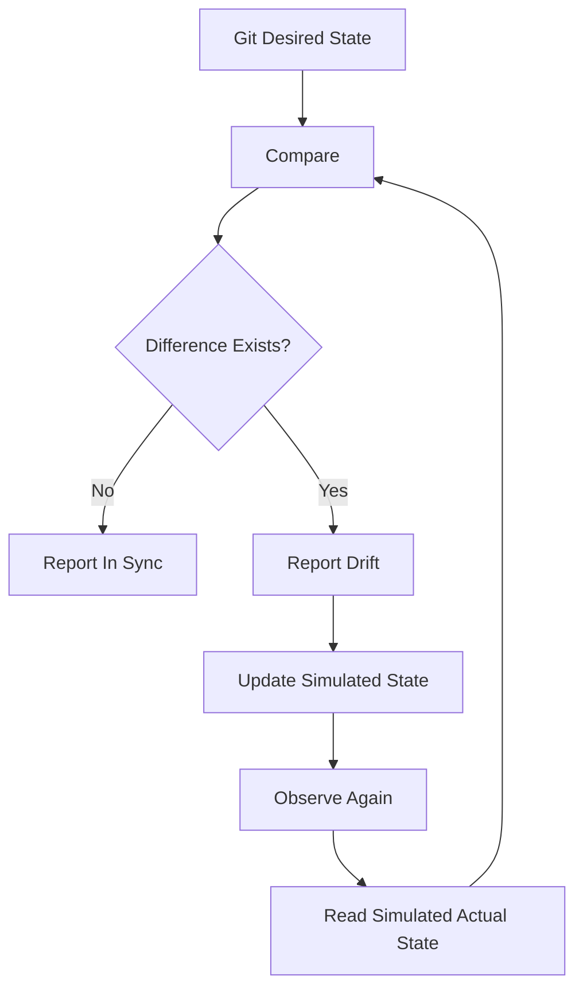
```mermaid
flowchart TD
    A["Git Desired State"]
    B["Read Simulated Actual State"]
    C["Compare"]
    D{"Difference Exists?"}
    E["Report In Sync"]
    F["Report Drift"]
    G["Update Simulated State"]
    H["Observe Again"]

    A --> C
    B --> C

    C --> D

    D -->|No| E
    D -->|Yes| F

    F --> G
    G --> H
    H --> B
```

### What is missing from this simple model?

Many important capabilities:

- Continuous observation.
- Real Kubernetes API interaction.
- Authentication.
- Authorization.
- Resource ownership.
- Failure retries.
- Backoff.
- Health assessment.
- Pruning.
- Resource dependencies.
- Concurrent updates.
- Controller availability.
- Audit and operational metrics.

Also, our script only performs one comparison per invocation. It does not run continuously.

**This is a learning model of reconciliation, not a production GitOps controller.**

In Phase 11, Argo CD will provide the actual Kubernetes-oriented reconciliation system.

---

# 56. Failure Experiment 5 — Simulate a GitOps Release Change

Now let's connect Git history with our reconciliation model.

Suppose development currently references Digest AAA.

A new release selects Digest BBB.

Using the promotion script from Phase 09:

```bash
python scripts/promote.py dev "$DIGEST_B"
```

Assume `DIGEST_B` is a real published digest.

Now inspect the Git change:

```bash
git diff
```

The desired image reference has changed.

But our simulated actual state still contains Digest AAA.

Run:

```bash
python scripts/reconciliation_demo.py dev
```

The script should report an image difference.

Now run:

```bash
python scripts/reconciliation_demo.py dev --apply
```

The simulated actual state changes to BBB.

### Understand the sequence

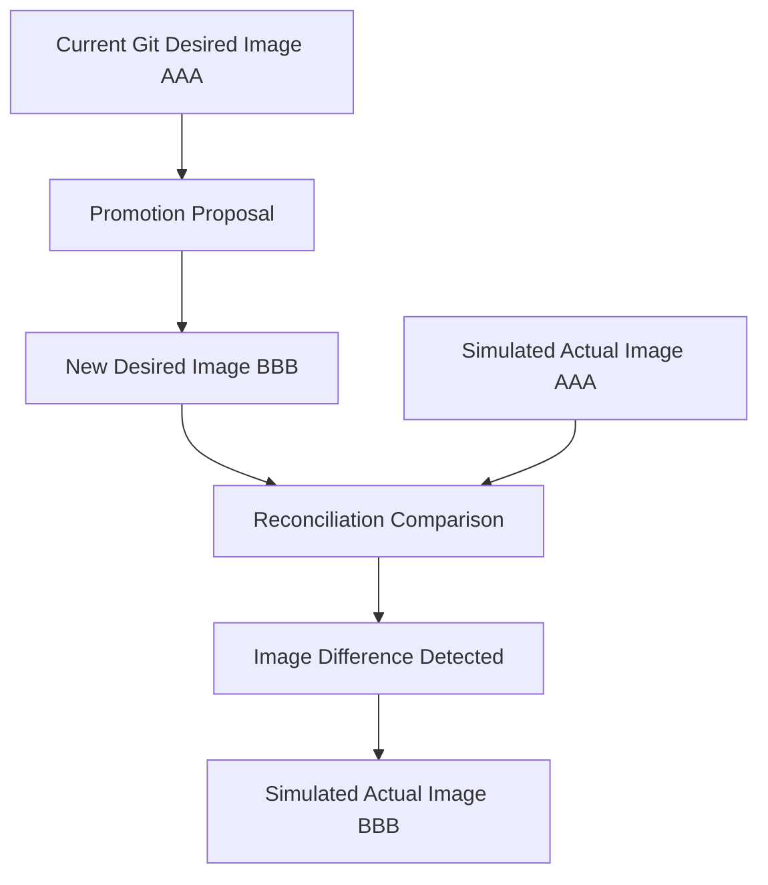
```mermaid
flowchart TD
    A["Current Git Desired Image AAA"]
    B["Promotion Proposal"]
    C["New Desired Image BBB"]
    D["Simulated Actual Image AAA"]
    E["Reconciliation Comparison"]
    F["Image Difference Detected"]
    G["Simulated Actual Image BBB"]

    A --> B
    B --> C

    C --> E
    D --> E

    E --> F
    F --> G
```

### What is the first state transition?

A change to version-controlled deployment intent.

### What is the second state transition?

A reconciliation action attempting to make actual state match the new intent.

This is a critical separation.

**Git changes what should happen. The controller attempts to make it happen.**

---

# 57. Failure Experiment 6 — Why Git History Matters for Recovery

Now suppose the newly selected Digest BBB is defective.

We need to restore Digest AAA.

The correct recovery decision must be based on:

- Previous approved artifact identity.
- Current database compatibility.
- Current runtime configuration.
- Incident impact.
- Authorization policy.

If those conditions support restoring AAA, the team can propose a Git change selecting it.

### Example

```text
Git Commit A:
Production Digest AAA

Git Commit B:
Production Digest BBB

Git Commit C:
Production Digest AAA
```

Commit C represents the authorized recovery decision.

```mermaid
flowchart LR
    A["Commit A: Previous Release AAA"]
    B["Commit B: New Release BBB"]
    C["Commit C: Restore AAA"]

    A --> B
    B --> C
```

### Why create Commit C instead of erasing Commit B?

Because we want to preserve what happened.

The historical record shows:

1. Which artifact was previously approved.
2. Which artifact was promoted.
3. Which recovery decision was made.

This helps with:

- Incident analysis.
- Auditing.
- Release traceability.
- Understanding deployment history.

### Important lesson

> **Recovery should restore approved desired state while preserving the history of the incident and corrective action.**

---

# 58. GitOps Observability: What Should We Monitor?

We have discussed observability in earlier phases.

Now let's apply it to GitOps.

A GitOps controller is part of the delivery system.

It can fail.

It can become disconnected from Git.

It can lose access to Kubernetes.

It can encounter invalid configuration.

Therefore, it requires its own operational visibility.

## 58.1 Useful GitOps signals

| Signal | Engineering question |
|---|---|
| Desired Git revision | Which configuration version is selected? |
| Observed Git revision | Which repository state has the controller processed? |
| Sync status | Does managed live state match desired state? |
| Sync operation result | Did the attempted reconciliation succeed? |
| Resource health | Are managed Kubernetes resources healthy? |
| Reconciliation duration | How long are state transitions taking? |
| Persistent drift | Which differences remain unresolved? |
| Repository connectivity | Can the controller fetch desired state? |
| Kubernetes API connectivity | Can the controller observe and modify resources? |
| Image-pull failures | Can workloads retrieve selected artifacts? |
| Application error rate | Is the deployed application behaving acceptably? |

### Important distinction

Some of these signals come from the GitOps controller.

Others come from Kubernetes.

Others come from application monitoring.

A complete delivery system needs all three categories.

---

# 59. Three Feedback Loops Working Together

We have now accumulated several control loops.

Let's connect them.

## Loop 1: Development feedback

```text
Source Change
      |
      v
CI Validation
      |
      v
Developer Feedback
```

## Loop 2: Deployment-state reconciliation

```text
Approved Desired State
        |
        v
GitOps Controller
        |
        v
Kubernetes Configuration
        |
        v
Observed Difference
```

## Loop 3: Operational feedback

```text
Running Application
        |
        v
Metrics and Logs
        |
        v
Operational Assessment
        |
        v
Recovery or Improvement Decision
```

## 59.1 Complete system

```mermaid
flowchart TD
    A["Developer"]
    B["Application Git Repository"]
    C["GitHub Actions CI"]
    D["Validation Evidence"]
    E["Published Container Artifact"]
    F["Container Registry"]

    G["Release Proposal"]
    H["GitOps Repository"]
    I["GitOps Controller"]
    J["Kubernetes"]
    K["Running Application"]
    L["Operational Monitoring"]

    M["Engineering Decision"]

    A --> B
    B --> C
    C --> D
    D --> E
    E --> F

    E --> G
    G --> H

    I -->|"Pull desired state"| H
    I -->|"Reconcile"| J

    F -->|"Image retrieval"| J

    J --> K
    K --> L
    L --> M

    M -.-> A
    M -.-> G
```

### What does this tell us?

GitHub Actions evaluates software changes.

GitOps reconciles deployment configuration.

Monitoring evaluates runtime behavior.

These are interconnected but different feedback systems.

### The critical principle

> **CI validates changes, GitOps maintains declared deployment state, and observability evaluates whether the resulting application fulfills its operational requirements.**

None of these systems fully replaces the others.

---

# 60. Refinement — Make the GitHub Actions Diff Check Meaningful

There is one useful improvement to the validation workflow from Part H.

The command:

```bash
git diff --check
```

without revision arguments checks the relevant working-tree differences.

On a clean GitHub Actions checkout, it may have nothing to examine.

That is not the same as checking the changes proposed by a pull request.

If you want to validate committed pull-request changes, configure checkout to retrieve the relevant history:

```yaml
- name: Checkout GitOps repository
  uses: actions/checkout@v7
  with:
    fetch-depth: 0
    persist-credentials: false
```

Then replace the earlier patch-formatting step with:

```yaml
- name: Check pull request patch formatting
  if: ${{ github.event_name == 'pull_request' }}
  env:
    BASE_SHA: ${{ github.event.pull_request.base.sha }}
  run: |
    git diff --check "$BASE_SHA" "$GITHUB_SHA"
```

This checks differences between the pull request's recorded base commit and the revision associated with the workflow event.

### Why does this matter?

Because CI commands must validate the intended inputs.

A check that executes successfully but examines no relevant changes can produce misleading confidence.

This is the same principle we established in Phase 06:

> **The existence of a validation step is not evidence that it evaluated the intended property.**

---

# 61. A Repeatable Method for Designing GitOps Systems

Let's consolidate this phase into a reusable engineering process.

Whenever someone asks:

> Design GitOps for our Kubernetes applications.

Don't begin by installing Argo CD.

Begin with the system's requirements.

## Step 1 — Identify the managed system

Ask:

- Which applications are deployed?
- Which Kubernetes resources belong to each application?
- Which clusters and namespaces exist?
- Which environments are required?
- Which components are stateful?
- Which resources are shared?
- Which controllers already manage these resources?

### Why?

Because you cannot design correct reconciliation without knowing what will be managed.

---

## Step 2 — Identify authoritative desired state

Ask:

**Which configuration should the deployment controller trust?**

Specify:

```text
Git Repository

Branch or Revision

Application Path

Environment Overlay
```

Example:

```text
Repository:
platform-gitops

Branch:
main

Path:
applications/ecommerce-api/overlays/production
```

### Why?

A controller needs an unambiguous source of intended configuration.

---

## Step 3 — Define ownership

For each resource or important field, identify its owner.

Example:

| Resource or field | Owner |
|---|---|
| Deployment image | GitOps |
| Service definition | GitOps |
| Application ConfigMap | GitOps |
| Pod placement | Kubernetes scheduler |
| Deployment status | Kubernetes controllers |
| Replica count when HPA is active | Autoscaling system |
| Runtime application logs | Logging system |

Avoid multiple independent controllers issuing conflicting instructions for the same field.

---

## Step 4 — Choose repository architecture

Decide:

- Application source and deployment configuration together or separate?
- One GitOps repository or several?
- How are environments represented?
- Which configuration is shared?
- Which paths require additional authorization?

For our architecture:

```text
Application Repository
        +
Separate GitOps Repository
```

And:

```text
Common Base
        +
Environment Overlays
```

---

## Step 5 — Define artifact identity

Require a specific published artifact identity.

For containerized workloads:

```text
Image Repository
       +
Image Digest
```

Avoid relying exclusively on mutable tags for production deployment identity.

---

## Step 6 — Define release authorization

Decide:

- Who can propose deployment changes?
- Who can approve them?
- What evidence must exist?
- Which checks are required?
- Who may bypass the normal process?
- How are emergency changes handled?

This is a repository and release-governance problem.

It cannot be solved merely by choosing a YAML layout.

---

## Step 7 — Define synchronization policy

Ask:

- Should changes be applied automatically?
- Should production require manual synchronization?
- Should live configuration drift be automatically corrected?
- Which resource deletions are permitted?
- How will controller failures be reported?
- What happens when Git or Kubernetes is unavailable?

**Automatic sync, self-healing, and pruning are separate policy decisions.**

---

## Step 8 — Define secret management

Ask:

- Which configuration values are sensitive?
- Where are secrets stored?
- How are applications authorized to access them?
- Can secrets be rotated?
- Does Git history contain plaintext credentials?
- Which identities can decrypt or retrieve secrets?

Do not assume GitOps requires storing every configuration value directly in Git.

---

## Step 9 — Define validation

Separate:

```text
Configuration Rendering

Static Policy Validation

Registry Artifact Verification

Deployment Synchronization

Kubernetes Resource Health

Application Smoke Testing

Operational Verification
```

Each check should have a clearly defined responsibility.

---

## Step 10 — Define recovery

Determine:

- Which previous artifacts must be retained?
- How will previous approved configuration be identified?
- How can desired state be restored?
- How will database compatibility be evaluated?
- Who authorizes emergency recovery?
- How will restored service health be verified?

Do not assume restoring a previous image digest reverses all consequences of a release.

---

## Step 11 — Implement the reconciliation controller

Only after these design decisions should you configure Argo CD.

At that point, you should know:

- Which Git paths it reads.
- Which clusters it manages.
- Which resources it owns.
- Which synchronization behaviors are permitted.
- Which Git changes represent authorized releases.
- Which runtime signals matter.

This is what we will do in Phase 11.

### Complete design process

```mermaid
flowchart TD
    A["Understand Managed Applications"]
    B["Identify Authoritative Desired State"]
    C["Define Resource Ownership"]
    D["Choose Repository Architecture"]
    E["Define Artifact Identity"]
    F["Define Release Authorization"]
    G["Define Reconciliation Policy"]
    H["Design Secret Management"]
    I["Define Validation"]
    J["Define Recovery"]
    K["Configure GitOps Controller"]
    L["Observe and Improve"]

    A --> B
    B --> C
    C --> D
    D --> E
    E --> F
    F --> G
    G --> H
    H --> I
    I --> J
    J --> K
    K --> L
```

### Important principle

> **Design the control system first. Configure the GitOps tool second.**

---

# 62. System-Design Exercise — GitOps for a Production AKS Platform

Now apply what we have learned.

Imagine your company operates three applications.

```text
Frontend

Backend API

Background Worker
```

The system uses:

```text
Azure Kubernetes Service

Azure Container Registry

PostgreSQL

GitHub Actions

Argo CD

Kustomize
```

There are three environments:

```text
Development

Staging

Production
```

## Business requirements

1. Developers should deploy frequently to development.
2. Staging must use already-built application artifacts.
3. Production releases require approval.
4. Production configuration must be traceable.
5. CI should not need direct production Kubernetes credentials.
6. Manual configuration drift should be detectable.
7. Resource deletion must be controlled.
8. Application secrets must not be committed in plaintext.
9. The system must support recovery to previously approved artifacts.
10. The team must be able to distinguish sync status from application health.

## Exercise A — Identify ownership

Design the ownership model for:

- Application image references.
- Replica counts.
- Autoscaling.
- Services.
- Ingress configuration.
- Kubernetes Secrets.
- PostgreSQL resources.
- Cluster-scoped resources.
- Deployment authorization.

Explain which resources Argo CD should own.

---

## Exercise B — Design the repositories

Decide whether to use:

```text
One Application Repository Per Service
```

And:

```text
One Shared GitOps Repository
```

Or another model.

Explain:

- Why you chose the repository boundaries.
- Which teams have write access.
- Which paths require additional review.
- How common configuration is reused.
- How production promotion is protected.

---

## Exercise C — Design the artifact flow

Your architecture must include:

```text
Developer Commit

GitHub Actions

Immutable Container Artifact

Container Registry

GitOps Release Proposal

Approval

Argo CD

AKS
```

Draw the complete diagram.

Label:

**Who produces the artifact?**

**Who authorizes production?**

**Who changes Kubernetes?**

**Who retrieves the image?**

---

## Exercise D — Design drift handling

Suppose Git declares:

```text
Production Replicas: 3
```

But Kubernetes reports:

```text
Production Replicas: 1
```

Answer:

1. Is this configuration drift?
2. Which component should detect it?
3. Should the difference be corrected automatically?
4. What if the change was an emergency intervention?
5. What if an HPA owns the replica count?
6. Which ownership policy prevents conflicting controllers?

---

## Exercise E — Design production deletion controls

Suppose a pull request removes:

```text
Production Service
```

What should happen?

Consider:

- Git review.
- Configuration validation.
- Pruning policy.
- Traffic impact.
- Recovery.

Would you allow automatic pruning?

Explain the decision.

---

## Exercise F — Design a GitOps incident response

Suppose:

```text
Git Desired Image:
BBB

Kubernetes Deployment Image:
BBB

Ready Pods:
0

Application Status:
Unavailable
```

Answer:

1. Is the configuration synchronized?
2. Is the application healthy?
3. What additional evidence do you need?
4. How would you inspect image-pull failures?
5. How would you determine whether recovery requires a GitOps change?
6. When would restoring Digest AAA be unsafe?
7. How would you verify recovery?

---

# 63. Memorization — Eight GitOps Mental Models

You mentioned earlier that memorization is difficult.

Use these eight relationships for active recall.

## Mental Model 1 — GitOps is a control system

```text
Desired State
      |
      v
Reconciliation Controller
      |
      v
Actual State
      |
      v
Continuous Observation
```

**Remember:** GitOps continuously manages state rather than relying only on one-time commands.

---

## Mental Model 2 — The four principles

```text
Declarative

Versioned and Immutable

Pulled Automatically

Continuously Reconciled
```

Try to reproduce these four principles without looking.

---

## Mental Model 3 — Git records intent

```text
GitOps Repository
       =
Versioned Desired Deployment State
```

Git records the approved configuration.

The controller attempts to realize it.

---

## Mental Model 4 — Detection is not correction

```text
Drift Detected
       !=
Drift Automatically Corrected
```

Automatic synchronization and self-healing depend on policy.

---

## Mental Model 5 — Synced is not healthy

```text
Git Configuration Matches Kubernetes
                  !=
Application Is Operationally Healthy
```

A Deployment can reference the correct image while its Pods fail.

---

## Mental Model 6 — Pull-based deployment separates authority

```text
GitHub Actions
       |
       v
Build and Publish
```

```text
GitOps Repository
       |
       v
Record Authorized Desired State
```

```text
GitOps Controller
       |
       v
Reconcile Kubernetes
```

---

## Mental Model 7 — Ownership prevents control-loop conflicts

```text
One Managed Field
        |
        v
Clear Authoritative Owner
```

Avoid conflicting controllers attempting to enforce incompatible values.

---

## Mental Model 8 — Recovery restores approved desired state

```text
Production Failure
        |
        v
Recovery Decision
        |
        v
Authorized GitOps Change
        |
        v
Reconciliation
        |
        v
Runtime Verification
```

**Remember:** A Git revert can restore deployment intent, but system recovery still requires compatibility and operational verification.

---

# 64. Active Recall Questions

Close your notes and answer from memory.

### First principles

**Q1.** What fundamental problem does GitOps solve?

**Q2.** What is the difference between imperative deployment and declarative desired state?

**Q3.** Why is executing `kubectl apply` once not equivalent to continuous GitOps reconciliation?

**Q4.** What are the four OpenGitOps principles?

**Q5.** Why is version history important for deployment configuration?

### Reconciliation

**Q6.** What is desired state?

**Q7.** What is actual state?

**Q8.** What does a reconciliation controller do?

**Q9.** What is configuration drift?

**Q10.** Why is drift detection different from automatic self-healing?

**Q11.** What does pruning mean?

**Q12.** Why can automatic pruning be dangerous?

### Architecture

**Q13.** What is the difference between push-based deployment and pull-based GitOps?

**Q14.** Why can GitHub Actions avoid direct production cluster access in our architecture?

**Q15.** Why can GitOps repository write permissions represent deployment authority?

**Q16.** What are the trade-offs between one repository and separate application/GitOps repositories?

**Q17.** Why should environment configuration be separated from application artifacts?

**Q18.** What do Kustomize bases and overlays solve?

### Reliability

**Q19.** Why is `Synced` not equivalent to `Healthy`?

**Q20.** What happens when the GitOps controller cannot reach Git?

**Q21.** What happens when Kubernetes cannot pull the selected image?

**Q22.** Why might an HPA conflict with GitOps management of replica counts?

**Q23.** Why should managed resources have clear ownership?

### Security and recovery

**Q24.** Why should plaintext production secrets not be committed to Git?

**Q25.** How can GitOps work with an external secret store?

**Q26.** Why must production GitOps branches be protected?

**Q27.** How does GitOps-oriented recovery work?

**Q28.** Why might reverting an image digest fail to restore system health?

**Q29.** What does the GitOps controller need permission to do?

**Q30.** Which runtime signals would you monitor in addition to GitOps synchronization status?

---

# 65. Interview and System-Design Questions

### Question 1

Explain GitOps from first principles without mentioning Argo CD or Flux.

### Question 2

How does GitOps differ from a GitHub Actions workflow that executes `kubectl apply`?

### Question 3

Your GitOps controller reports `Synced`, but the application is unavailable.

How would you investigate?

### Question 4

A production administrator manually modifies a Deployment.

The GitOps controller reports drift.

How do you decide whether automatic correction is appropriate?

### Question 5

Your application uses a Horizontal Pod Autoscaler.

Argo CD repeatedly attempts to restore the replica count defined in Git.

What is the underlying architectural problem?

### Question 6

Would you store application code and production GitOps configuration in the same repository?

Explain when that architecture is appropriate and when you would separate them.

### Question 7

How can GitHub Actions publish an artifact without receiving production Kubernetes credentials?

Explain the complete artifact and authorization flow.

### Question 8

A contributor changes the production GitOps image reference to an untrusted image.

What controls should prevent the change from becoming effective deployment intent?

### Question 9

What is the difference between GitOps automatic synchronization, self-healing, and pruning?

### Question 10

How would you structure a GitOps repository managing twenty services across development, staging, and production?

### Question 11

A GitOps repository removes a database resource.

What risks would you evaluate before enabling automatic pruning?

### Question 12

During an incident, an engineer directly changes Kubernetes to restore the previous image.

Argo CD later restores the newer image.

Why could that happen?

How would you redesign the recovery procedure?

---

# 66. Official Documentation — Connect the Concepts to Real Systems

Use these references to deepen your understanding.

## 66.1 OpenGitOps principles

**Official project:**

https://opengitops.dev/

**Principles document:**

https://github.com/open-gitops/documents/blob/main/PRINCIPLES.md

Study:

- Declarative desired state.
- Versioning and immutability.
- Automatic pulling.
- Continuous reconciliation.

**Engineering question:**

What properties distinguish a GitOps system from ordinary Git-based deployment automation?

---

## 66.2 Kubernetes controllers

**Official documentation:**

https://kubernetes.io/docs/concepts/architecture/controller/

Study:

- Control loops.
- Desired state.
- Actual state.
- Reconciliation.

**Engineering question:**

How does a controller continually move an observed system toward a desired condition?

---

## 66.3 Kubernetes Deployments

**Official documentation:**

https://kubernetes.io/docs/concepts/workloads/controllers/deployment/

Study:

- Desired replicas.
- Deployment controllers.
- Rollouts.
- Readiness.
- Deployment status.

**Engineering question:**

How does Kubernetes maintain workloads after the deployment configuration has been accepted?

---

## 66.4 Kustomize

**Official documentation:**

https://kubernetes.io/docs/tasks/manage-kubernetes-objects/kustomization/

**Image transformations:**

https://kubectl.docs.kubernetes.io/references/kustomize/kustomization/images/

Study:

- Bases.
- Overlays.
- Patches.
- Image digests.
- Configuration rendering.

**Engineering question:**

How can multiple environments share common resource definitions while selecting different approved releases?

---

## 66.5 Argo CD core concepts

**Official documentation:**

https://argo-cd.readthedocs.io/en/stable/core_concepts/

Study:

- Application.
- Target state.
- Live state.
- Sync status.
- Health.
- Refresh.
- Synchronization.

**Engineering question:**

How does Argo CD map the general GitOps reconciliation model onto Kubernetes?

---

## 66.6 Argo CD automated synchronization

**Official documentation:**

https://argo-cd.readthedocs.io/en/stable/user-guide/auto_sync/

Study:

- Automated sync.
- Self-healing.
- Pruning.
- Empty-resource safeguards.
- Synchronization behavior.

**Engineering question:**

Which observed differences should cause automatic changes, and which should require explicit authorization?

---

## 66.7 Argo CD synchronization options

**Official documentation:**

https://argo-cd.readthedocs.io/en/stable/user-guide/sync-options/

Study:

- Pruning controls.
- Resource ownership.
- Shared-resource detection.
- Difference handling.
- Synchronization options.

**Engineering question:**

How should the reconciliation controller manage potentially dangerous operations or overlapping resource ownership?

---

# 67. Phase 10 — Engineering Takeaways

| Principle | Engineering meaning |
|---|---|
| **Deployment is state management** | The objective is the intended environment state, not merely command execution. |
| **GitOps is more than YAML in Git** | Declarative, versioned, pull-based, continuous reconciliation is required. |
| **Git records deployment intent** | Approved configuration has traceable history. |
| **Controllers reconcile actual state** | Desired state is continuously compared with managed live state. |
| **Drift detection is distinct from correction** | Reconciliation behavior depends on policy. |
| **Synchronization is not application health** | Matching configuration does not guarantee working software. |
| **GitOps changes deployment authority** | CI does not necessarily need production cluster credentials. |
| **GitOps repository permissions are security-critical** | Configuration write access may become indirect deployment authority. |
| **Resource ownership matters** | Conflicting controllers can destabilize management. |
| **Pruning requires policy** | Desired-state deletion can remove important runtime resources. |
| **Repository boundaries are architectural** | Structure should reflect ownership and authorization. |
| **Kustomize separates common and environment configuration** | Reuse reduces unnecessary duplication. |
| **Artifact promotion preserves identity** | GitOps selects previously published image digests. |
| **Secrets require separate protection** | Plaintext credentials should not be casually committed to Git. |
| **GitOps controllers can fail** | Git, Kubernetes, permissions, and networking remain dependencies. |
| **Recovery must respect authoritative state** | Temporary live changes may be reversed by reconciliation. |
| **Rollback requires compatibility** | Restoring an image does not reverse database changes. |
| **Configuration validation is not deployment verification** | Rendering YAML proves only selected preparation properties. |
| **GitOps needs observability** | Controller status, Kubernetes conditions, and application metrics are complementary. |

---

# 68. Final Understanding

Let's return to the central engineering question.

**How can we design a software delivery system in which approved deployment state is version-controlled and continuously maintained?**

We begin by recognizing that deployment is a state-management problem.

A one-time command can request a change.

But it does not continuously enforce the approved configuration.

We therefore define desired state declaratively.

We store it in a versioned, protected source.

We authorize changes through repository and release policies.

A reconciliation controller obtains the desired state automatically.

It observes the corresponding actual state.

It identifies relevant differences.

According to its configured policy, it attempts corrective operations.

Kubernetes then manages the requested workloads.

Finally, monitoring and verification establish whether the running application behaves acceptably.

## 68.1 Complete GitOps control-system architecture

```mermaid
flowchart TD
    A["Developer"]
    B["Application Repository"]
    C["GitHub Actions CI"]
    D["Validated Container Artifact"]
    E["Container Registry"]
    F["Image Digest"]

    G["Release Proposal"]
    H["Configuration Validation"]
    I["Release Authorization"]
    J["Protected GitOps Repository"]

    K["GitOps Reconciliation Controller"]
    L["Read Desired State"]
    M["Observe Kubernetes Actual State"]
    N["Compare Relevant Configuration"]
    O{"Difference Exists?"}
    P["Report Synced"]
    Q["Evaluate Reconciliation Policy"]
    R{"Correction Authorized?"}
    S["Report Drift and Wait"]
    T["Apply Permitted Changes"]

    U["Kubernetes Workloads"]
    V["Runtime Verification"]
    W["Operational Feedback"]

    A --> B
    B --> C
    C --> D
    D --> E
    E --> F

    F --> G
    G --> H
    H --> I
    I --> J

    K --> L
    L --> J

    K --> M
    M --> N
    L --> N

    N --> O

    O -->|No| P
    O -->|Yes| Q

    Q --> R

    R -->|No| S
    R -->|Yes| T

    T --> U
    U --> M

    E --> U

    U --> V
    V --> W

    W -.-> A
    W -.-> G
```

This diagram represents the logical responsibilities.

The controller's actual implementation, synchronization policy, and health assessment mechanisms depend on the chosen GitOps platform.

### The most important principle of Phase 10

> **GitOps is a declarative control-system architecture in which approved, versioned desired state is automatically retrieved and continuously reconciled with the actual state of managed infrastructure and applications.**

Remember the complete system:

**GitHub Actions validates and builds the software.**

**The container registry stores the published artifact.**

**Release Engineering authorizes artifact promotion.**

**The GitOps repository records desired deployment configuration.**

**The GitOps controller reconciles that configuration with Kubernetes.**

**Kubernetes maintains the running workloads.**

**Observability evaluates the resulting application behavior.**

You should now be able to explain not only **what GitOps is**, but also **why it exists, which problems it solves, what it cannot guarantee, and how it fits into the complete CI/CD architecture**.

---

# Phase 10 Complete

**Completed:** Level 3 — Phase 10: GitOps

## Course Progress — 5 Levels, 16 Phases

| Level | Phase | Topic | Status |
|---|---|---|---|
| **1 — Fundamentals** | 01 | Why CI/CD Exists | Completed |
| | 02 | Feedback and Control Systems | Completed |
| | 03 | Delivery Architecture | Completed |
| | 04 | Git Lifecycle | Completed |
| **2 — Continuous Integration** | 05 | CI Architecture | Completed |
| | 06 | Testing and Quality Gates | Completed |
| | 07 | Build Artifacts | Completed |
| | 08 | GitHub Actions | Completed |
| **3 — Continuous Delivery** | 09 | Release Engineering | Completed |
| | 10 | GitOps | Completed |
| | 11 | Argo CD | **Next** |
| | 12 | End-to-End Integration | Upcoming |
| **4 — Production Engineering** | 13 | Deployment Strategies | Upcoming |
| | 14 | CI/CD Security | Upcoming |
| | 15 | Reliability and Observability | Upcoming |
| **5 — System Design** | 16 | Complete CI/CD Project | Upcoming |

---

# Next: Phase 11 — Argo CD

**File:** `Level-3-Continuous-Delivery/Phase-11-ArgoCD.md`

We now understand GitOps from first principles.

We know:

- Why declarative desired state matters.
- Why Git provides an authoritative configuration history.
- Why the deployment controller retrieves approved configuration.
- Why continuous reconciliation is necessary.
- How configuration drift occurs.
- Why automatic synchronization and self-healing require deliberate policies.
- How GitOps repository architecture influences security.
- How release promotion works through Git changes.

The next step is to implement the reconciliation controller.

## In Phase 11, we will study:

- Argo CD architecture from first principles.
- API server, repository server, application controller, and supporting components.
- How Argo CD represents Applications.
- The Application custom resource.
- Repository and destination configuration.
- How Argo CD renders Kustomize and Helm sources.
- Target state versus live state.
- Refresh, comparison, and synchronization.
- Manual synchronization versus automated synchronization.
- Self-healing and pruning.
- Application health and synchronization status.
- Sync options and resource ownership.
- Argo CD Projects and authorization boundaries.
- How Argo CD works with GitHub Actions and GHCR.
- How to deploy the GitOps application from this phase.
- How to introduce and observe real drift.
- How to recover through Git.
- How to investigate `OutOfSync`, `Degraded`, and failed synchronization.
- How to validate the complete deployment control loop.

We will use **Argo CD**, not Flux, as our reference GitOps implementation.

### Central engineering question for Phase 11

> **How does Argo CD turn version-controlled Kubernetes configuration into a continuously reconciled runtime system, and how do we operate that controller safely when deployments, drift, or infrastructure dependencies fail?**

**Send `next` to begin Phase 11 — Argo CD.**