# Phase 11 — Argo CD: Engineering a Real GitOps Reconciliation System

**Level 3: Continuous Delivery | CI/CD From First Principles**

**File:** `Level-3-Continuous-Delivery/Phase-11-ArgoCD.md`

**Previous:** Phase 10 — GitOps  
**Next:** Phase 12 — End-to-End Integration

---

# 1. Learning Objectives

Welcome to **Phase 11 — Argo CD**.

In Phase 10, we designed GitOps from first principles.

We established that a reliable GitOps system needs four properties:

1. Desired state is declarative.
2. Desired state is versioned and immutable.
3. Software agents automatically retrieve desired state.
4. Agents continuously reconcile actual state against desired state.

But until now, most of our practical work has involved preparing configuration.

We created a GitOps repository.

We added development, staging, and production overlays.

We implemented configuration validation.

We simulated the reconciliation process using Python.

However, **a simulation is not a running GitOps deployment controller**.

Now we will implement the real system using Argo CD.

## What you will learn

By the end of this phase, you should understand:

1. Why a dedicated GitOps controller is necessary.
2. Argo CD architecture and its internal components.
3. How the API server, repository server, and application controller work together.
4. How Argo CD integrates with Kubernetes.
5. The `Application` custom resource.
6. The `AppProject` authorization boundary.
7. Source repositories, revisions, paths, and destinations.
8. How Argo CD renders Kustomize and Helm.
9. Desired state, live state, and synchronization status.
10. Synchronization versus resource health.
11. Manual synchronization versus automated synchronization.
12. Self-healing and configuration drift.
13. Pruning and resource deletion.
14. Resource ownership and conflicting controllers.
15. How GitHub Actions and GHCR integrate with Argo CD.
16. How image promotion becomes a deployment.
17. How to observe synchronization and rollout failures.
18. How to diagnose unhealthy applications.
19. How to recover using GitOps.
20. How to operate Argo CD without weakening deployment security.

We will also perform a real hands-on lab.

### Our practical architecture

We will use:

- **GitHub Actions** for CI and artifact publication.
- **GitHub Container Registry** for Docker images.
- **Git** for approved deployment configuration.
- **Kustomize** for environment configuration.
- **Argo CD** for GitOps reconciliation.
- **Kubernetes in Docker (kind)** for a local cluster.
- **Node.js + TypeScript** for the application.

We will reuse the project created in previous phases.

No Azure or GCP resources are required for the lab.

> **Central engineering question:** How does Argo CD turn an approved Git commit into actual Kubernetes state, and how can we verify, diagnose, and control that process?

---

# 2. First Principle: Git Cannot Deploy Software by Itself

Imagine your GitOps repository contains:

```yaml
apiVersion: apps/v1
kind: Deployment
metadata:
  name: ecommerce-api
spec:
  replicas: 3
```

This expresses an intention:

```text
We want three replicas.
```

But Git is a version-control system.

Git does not:

- Authenticate to Kubernetes.
- Create Deployments.
- Watch running Pods.
- Compare Kubernetes resources.
- Investigate image-pull failures.
- Update unhealthy workloads.

Something must interpret the configuration and interact with Kubernetes.

## 2.1 Derive the missing component

We have three existing systems.

**System A: Git**

Stores desired configuration.

**System B: Kubernetes**

Maintains running workloads.

**System C: Container registry**

Stores executable artifacts.

What is missing?

A component that connects approved configuration to the Kubernetes API.

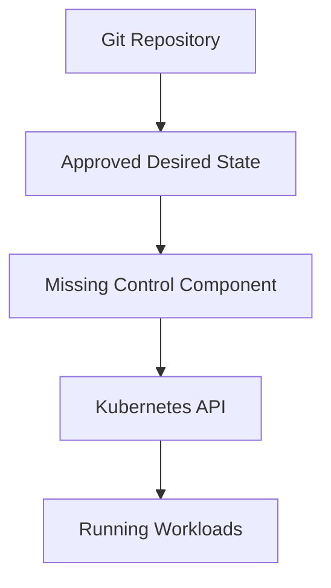
```mermaid
flowchart TD
    A["Git Repository"]
    B["Approved Desired State"]
    C["Missing Control Component"]
    D["Kubernetes API"]
    E["Running Workloads"]

    A --> B
    B --> C
    C --> D
    D --> E
```

That component must be able to:

1. Read the desired configuration.
2. Interpret the configuration.
3. Observe actual Kubernetes state.
4. Identify relevant differences.
5. Perform authorized changes.
6. Recheck the results.
7. Report status.

This is the responsibility of a reconciliation controller.

**Argo CD provides this control system for Kubernetes applications.**

---

# 3. Argo CD Is Not Just a Deployment Tool

Suppose we compare two systems.

### System A: One-time deployment automation

```text
GitHub Actions
      |
      v
kubectl apply
      |
      v
Kubernetes
```

The pipeline executes and finishes.

### System B: Argo CD reconciliation

```text
Approved Git Configuration
          |
          v
Argo CD
          |
          v
Kubernetes
          |
          v
Observe Actual State
          |
          v
Compare With Git
          |
          v
Repeat
```

The difference is not merely which tool applies YAML.

The difference is the operating model.

## 3.1 Argo CD's fundamental responsibility

> **Argo CD continuously compares Kubernetes resources with declared desired configuration and supports reconciliation according to configured policies.**

Argo CD does not normally compile TypeScript, run application unit tests, or build Docker images.

Those are responsibilities of the CI system.

It does not automatically decide which release is authorized for production.

That is a release engineering decision.

It does not guarantee application business correctness.

That requires runtime verification.

### Engineering principle

**Argo CD manages deployment-state convergence, not the entire software lifecycle.**

---

# 4. Deriving Argo CD's Internal Architecture

We know the controller must:

- Read Git.
- Generate Kubernetes manifests.
- Compare them with live resources.
- Update Kubernetes.
- Provide an interface for humans.
- Authenticate and authorize users.
- Record reconciliation status.

Should one large process perform every responsibility?

It could, but separating responsibilities makes the architecture easier to scale and operate.

Argo CD uses several cooperating components.

Its official architecture documentation identifies the API server, repository server, and application controller as central components. [Argo CD](https://argo-cd.readthedocs.io/en/stable/operator-manual/architecture/?utm_source=chatgpt.com)

## 4.1 High-level architecture

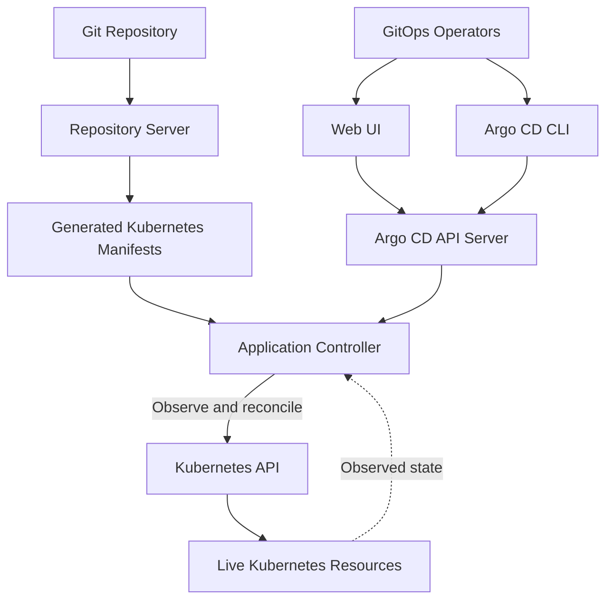
```mermaid
flowchart TD
    A["Git Repository"]
    B["Repository Server"]
    C["Generated Kubernetes Manifests"]
    D["Application Controller"]
    E["Kubernetes API"]
    F["Live Kubernetes Resources"]

    G["Argo CD API Server"]
    H["Web UI"]
    I["Argo CD CLI"]
    J["GitOps Operators"]

    A --> B
    B --> C
    C --> D

    D -->|"Observe and reconcile"| E
    E --> F
    F -.->|"Observed state"| D

    H --> G
    I --> G
    J --> H
    J --> I

    G --> D
```

This diagram shows logical responsibilities rather than every internal network connection.

Let's understand the main components individually.

---

# 5. Component One — Repository Server

Imagine the GitOps repository contains:

```text
applications/
└── ecommerce-api/
    ├── base/
    └── overlays/
        ├── dev/
        ├── staging/
        └── production/
```

An Argo CD Application points to:

```text
Repository:
https://github.com/example/release-gitops-lab.git

Revision:
main

Path:
applications/ecommerce-api/overlays/dev
```

How does that become a Kubernetes Deployment and Service?

The repository server is responsible for generating the target manifests from the configured application source.

## 5.1 Its inputs

```text
Repository URL

Git Revision

Application Path

Kustomize or Helm Configuration
```

## 5.2 Its output

```text
Rendered Kubernetes Resource Definitions
```

For example:

```text
Deployment

Service
```

## 5.3 Processing model

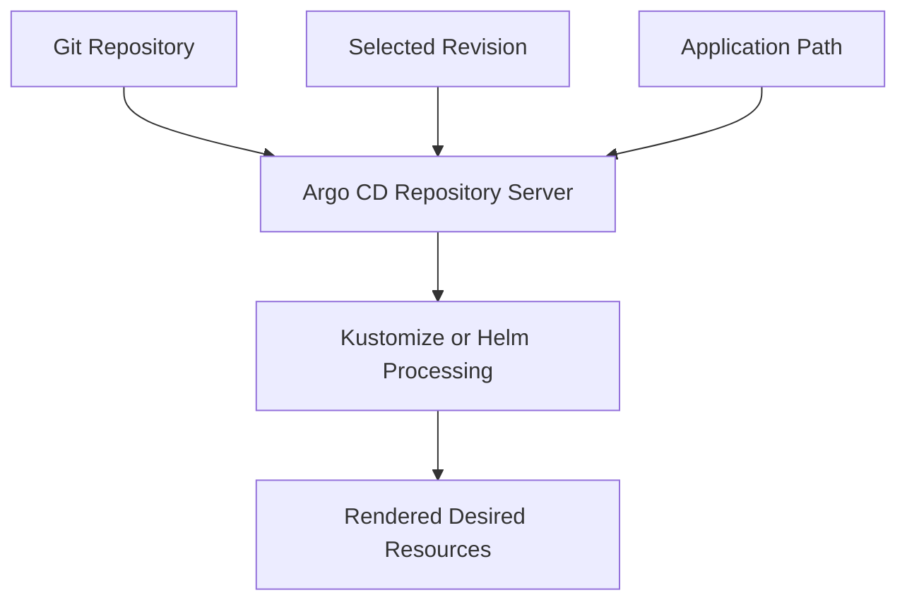
```mermaid
flowchart TD
    A["Git Repository"]
    B["Selected Revision"]
    C["Application Path"]
    D["Argo CD Repository Server"]
    E["Kustomize or Helm Processing"]
    F["Rendered Desired Resources"]

    A --> D
    B --> D
    C --> D

    D --> E
    E --> F
```

### Why separate this responsibility?

Because manifest generation is different from modifying Kubernetes.

A repository-server problem may prevent Argo CD from calculating desired state without necessarily affecting an already-running application.

### Example failure

Suppose an overlay contains invalid Kustomize configuration.

The repository server cannot generate the expected manifests.

That is a **manifest-generation failure**.

It is not the same as:

```text
ImagePullBackOff
```

Which happens during runtime image retrieval.

### Engineering lesson

> **Always identify whether a failure occurred before manifest generation, during synchronization, or after Kubernetes accepted the configuration.**

---

# 6. Component Two — Application Controller

Now suppose the repository server generates:

```text
Deployment:
Image BBB
Replicas 3
```

But Kubernetes currently reports:

```text
Deployment:
Image AAA
Replicas 3
```

What component detects this difference?

The application controller.

## 6.1 Responsibilities

The application controller is responsible for the central reconciliation loop.

It:

- Processes Argo CD Application resources.
- Obtains desired manifests.
- Observes managed Kubernetes resources.
- Compares desired and live state.
- Reports synchronization status.
- Coordinates synchronization operations.
- Evaluates configured health information.
- Processes applicable synchronization hooks and lifecycle operations.

## 6.2 Reconciliation model

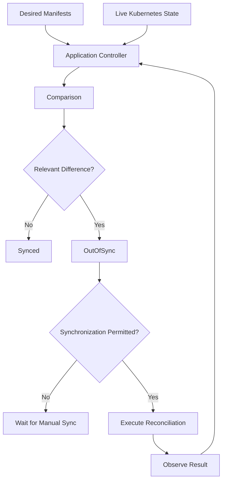
```mermaid
flowchart TD
    A["Desired Manifests"]
    B["Live Kubernetes State"]

    C["Application Controller"]
    D["Comparison"]
    E{"Relevant Difference?"}

    F["Synced"]
    G["OutOfSync"]

    H{"Synchronization Permitted?"}
    I["Wait for Manual Sync"]
    J["Execute Reconciliation"]
    K["Observe Result"]

    A --> C
    B --> C

    C --> D
    D --> E

    E -->|No| F
    E -->|Yes| G

    G --> H

    H -->|No| I
    H -->|Yes| J

    J --> K
    K --> C
```

### Important distinction

The application controller works at the deployment-configuration layer.

Kubernetes has its own controllers.

For example:

```text
Argo CD Application Controller
          |
          v
Kubernetes Deployment Resource
          |
          v
Kubernetes Deployment Controller
          |
          v
ReplicaSets and Pods
```

Argo CD does not replace the Kubernetes Deployment controller.

It works with Kubernetes' existing control mechanisms.

---

# 7. Component Three — API Server

Engineers need to interact with Argo CD.

They need to:

- List applications.
- Inspect status.
- View differences.
- Request synchronization.
- Review history.
- Manage application settings.
- Authenticate users.
- Apply authorization rules.

The Argo CD API server provides the interface for these operations.

## 7.1 Architecture

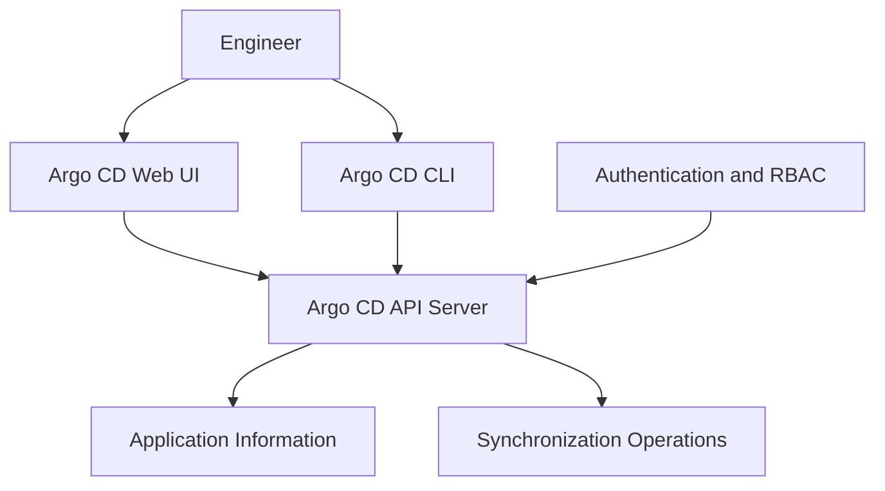
```mermaid
flowchart TD
    A["Engineer"]
    B["Argo CD Web UI"]
    C["Argo CD CLI"]
    D["Argo CD API Server"]
    E["Application Information"]
    F["Synchronization Operations"]
    G["Authentication and RBAC"]

    A --> B
    A --> C

    B --> D
    C --> D

    D --> E
    D --> F
    G --> D
```

### What does the API server not do?

It is not the primary component responsible for continuously comparing every Application's target and live resources.

That responsibility belongs to the application controller.

### Important security principle

A human's ability to request a synchronization operation should be controlled by Argo CD authorization policies.

Having access to the UI should not automatically imply unrestricted production deployment authority.

---

# 8. Other Argo CD Components

Depending on the installation and configuration, you will encounter additional components.

| Component | Purpose |
|---|---|
| Redis | Caching and supporting internal operations |
| ApplicationSet controller | Generates and manages Applications from templates and generators |
| Dex | Supports external authentication integration in applicable configurations |
| Notifications controller | Sends configured application-related notifications |
| Kubernetes CRDs | Extend Kubernetes with Argo CD resources such as `Application` and `AppProject` |

## 8.1 Why use a cache?

Argo CD repeatedly processes Git and Kubernetes information.

Caching can reduce unnecessary repeated work.

But it introduces another operational component.

A cache is not the authoritative source of GitOps desired state.

The selected Git source remains the configuration reference.

## 8.2 Why does ApplicationSet exist?

Imagine an organization has:

```text
20 Applications

3 Environments

Multiple Clusters
```

Manually writing every Argo CD Application object becomes repetitive.

ApplicationSet can generate Applications using predefined inputs and templates.

For example:

```text
Application Template
        +
Cluster or Environment List
        |
        v
Generated Argo CD Applications
```

We will not use ApplicationSet in the initial lab because one Application is enough to understand reconciliation.

### Engineering principle

**Do not introduce additional orchestration abstractions until you understand the object they manage.**

First understand `Application`.

Then understand why `ApplicationSet` exists.

---

# 9. The Most Important Argo CD Object: Application

What is an Argo CD Application?

It is a Kubernetes custom resource that describes a set of resources Argo CD should manage.

At its core, it connects:

```text
Source
   +
Destination
   +
Project
   +
Synchronization Policy
```

Let's derive each part.

## 9.1 Source

Answers:

**Where is the desired state defined?**

Example:

```text
Repository:
release-gitops-lab

Revision:
main

Path:
applications/ecommerce-api/overlays/dev
```

## 9.2 Destination

Answers:

**Where should those resources exist?**

Example:

```text
Kubernetes Cluster:
In-cluster

Namespace:
ecommerce-dev
```

## 9.3 Project

Answers:

**Which sources, destinations, and resource types are permitted for this Application?**

Example:

```text
Allowed Repository:
release-gitops-lab

Allowed Namespace:
ecommerce-dev
```

## 9.4 Synchronization policy

Answers:

**When and how may Argo CD apply changes?**

Examples:

```text
Manual Synchronization

Automated Synchronization

Self-Healing Enabled

Pruning Disabled
```

## 9.5 Application contract

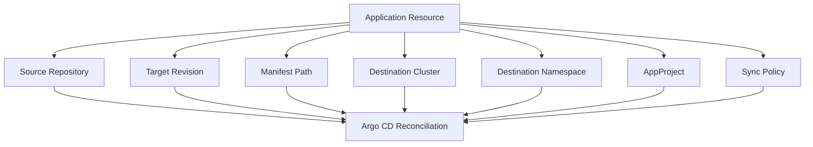
```mermaid
flowchart TD
    A["Application Resource"]

    B["Source Repository"]
    C["Target Revision"]
    D["Manifest Path"]

    E["Destination Cluster"]
    F["Destination Namespace"]

    G["AppProject"]
    H["Sync Policy"]

    I["Argo CD Reconciliation"]

    A --> B
    A --> C
    A --> D

    A --> E
    A --> F

    A --> G
    A --> H

    B --> I
    C --> I
    D --> I
    E --> I
    F --> I
    G --> I
    H --> I
```

This is the object that connects our earlier GitOps repository design to the running controller.

---

# 10. Understand the Application Manifest

Here is a minimal example.

```yaml
apiVersion: argoproj.io/v1alpha1
kind: Application
metadata:
  name: ecommerce-dev
  namespace: argocd
spec:
  project: default

  source:
    repoURL: https://github.com/example/release-gitops-lab.git
    targetRevision: main
    path: applications/ecommerce-api/overlays/dev

  destination:
    server: https://kubernetes.default.svc
    namespace: ecommerce-dev
```

Let's examine every field.

### `apiVersion`

```yaml
apiVersion: argoproj.io/v1alpha1
```

This identifies the API group and version of the custom resource.

The Argo CD installation adds the relevant CRDs to Kubernetes.

### `kind`

```yaml
kind: Application
```

This identifies the Argo CD resource type.

### `metadata.namespace`

```yaml
namespace: argocd
```

This is the namespace containing the Application custom resource.

It is not necessarily the namespace where the workload is deployed.

### `spec.project`

```yaml
project: default
```

This selects the Argo CD project that governs the Application.

### `spec.source`

Defines where Argo CD obtains desired manifests.

### `spec.destination`

Defines where Argo CD should apply the rendered resources.

### Why use this server address?

```text
https://kubernetes.default.svc
```

This is the internal Kubernetes API service address used when Argo CD manages its own cluster.

An external cluster requires separate registration and appropriate credentials.

The official getting-started guide distinguishes in-cluster deployment from registering external clusters. [GitHub](https://github.com/argoproj/argo-cd/blob/master/docs/getting_started.md?utm_source=chatgpt.com)

---

# 11. Application Is Not the Same as Deployment

This distinction is essential.

An Argo CD Application might manage:

```text
Deployment

Service

ConfigMap

Ingress

HorizontalPodAutoscaler
```

It is not synonymous with one Kubernetes Deployment.

## 11.1 Example

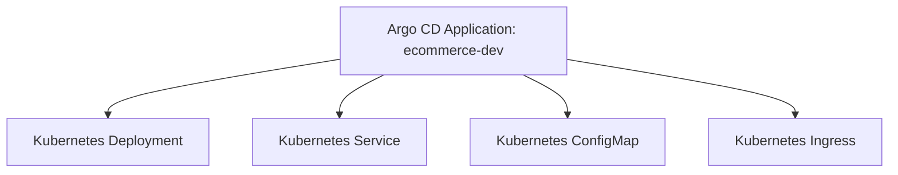
```mermaid
flowchart TD
    A["Argo CD Application: ecommerce-dev"]

    B["Kubernetes Deployment"]
    C["Kubernetes Service"]
    D["Kubernetes ConfigMap"]
    E["Kubernetes Ingress"]

    A --> B
    A --> C
    A --> D
    A --> E
```

The Application describes the boundary of GitOps management.

Its source path determines which resource definitions belong to that boundary.

### Why does this matter?

Because application ownership affects:

- Reconciliation.
- Status reporting.
- Synchronization.
- Resource deletion.
- Authorization.
- Troubleshooting.

### Key principle

> **An Argo CD Application is a managed group of desired Kubernetes resources, not simply a wrapper around one container or Pod.**

---

# 12. The AppProject: Authorization Before Reconciliation

Now consider an important security problem.

Suppose any Application can:

- Read any repository.
- Target any cluster.
- Deploy into any namespace.
- Create any Kubernetes resource.

Would that be a good default for a shared production platform?

No.

We need an authorization boundary.

Argo CD provides `AppProject`.

Projects can restrict source repositories, deployment destinations, and permitted or prohibited resources. The built-in `default` project is convenient for testing but is typically too permissive for serious multi-tenant use. [Argo CD](https://argo-cd.readthedocs.io/en/stable/user-guide/projects/?utm_source=chatgpt.com)

## 12.1 Example project

```yaml
apiVersion: argoproj.io/v1alpha1
kind: AppProject
metadata:
  name: ecommerce-dev
  namespace: argocd
spec:
  description: Development application boundary

  sourceRepos:
    - https://github.com/example/release-gitops-lab.git

  destinations:
    - server: https://kubernetes.default.svc
      namespace: ecommerce-dev
```

This establishes permitted source and destination relationships.

### Important limitation

An AppProject is not a replacement for Kubernetes RBAC.

It constrains what Argo CD Applications in the project are permitted to manage.

The Argo CD controller also needs suitable Kubernetes permissions to perform the authorized operations.

A complete security model requires both controls.

## 12.2 Three authorization layers

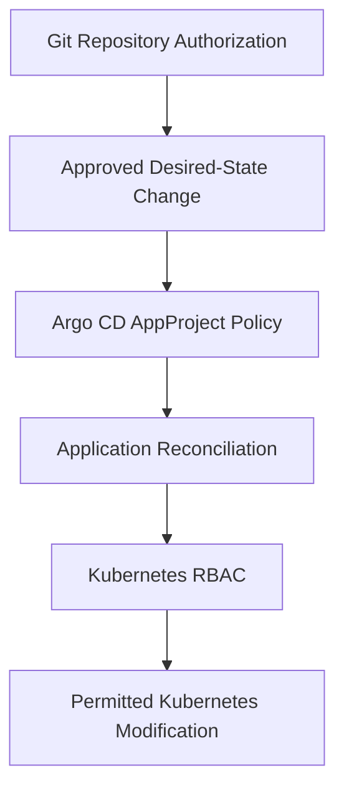
```mermaid
flowchart TD
    A["Git Repository Authorization"]
    B["Approved Desired-State Change"]
    C["Argo CD AppProject Policy"]
    D["Application Reconciliation"]
    E["Kubernetes RBAC"]
    F["Permitted Kubernetes Modification"]

    A --> B
    B --> C
    C --> D
    D --> E
    E --> F
```

Each layer answers a different question.

**Git:** Who can change approved deployment intent?

**AppProject:** Which sources and destinations may this Argo CD Application use?

**Kubernetes RBAC:** Which operations can the controller identity perform?

### Engineering principle

**Trust requires controlling both the input to the controller and the authority held by the controller.**

---

# 13. Argo CD Synchronization vs Health

This was one of the most important concepts in Phase 10.

Now let's understand how Argo CD represents it.

Suppose Git declares:

```text
Image: Digest BBB
Replicas: 3
```

Kubernetes contains:

```text
Image: Digest BBB
Replicas: 3
```

But the image cannot be pulled.

Is the application synchronized?

The desired and live configuration may match.

Is it healthy?

No.

Argo CD separately evaluates synchronization and resource health. Its health model supports statuses such as `Healthy`, `Progressing`, `Degraded`, `Suspended`, `Missing`, and `Unknown`. [Argo CD](https://argo-cd.readthedocs.io/en/stable/operator-manual/health/?utm_source=chatgpt.com)

## 13.1 Synchronization status

Typical states include:

| Status | Meaning |
|---|---|
| `Synced` | Managed live configuration matches the desired configuration under comparison rules |
| `OutOfSync` | Relevant live configuration differs from desired state |
| `Unknown` | Comparison cannot establish a normal result |

## 13.2 Health status

Typical states include:

| Status | Meaning |
|---|---|
| `Healthy` | Resource health rules consider the state acceptable |
| `Progressing` | The resource is still moving toward an expected condition |
| `Degraded` | A problem is detected |
| `Suspended` | The resource is intentionally suspended |
| `Missing` | An expected resource is missing |
| `Unknown` | Health cannot be determined |

Not every resource uses every health status.

Custom resources may need custom health rules.

## 13.3 Combined interpretation

| Sync | Health | Possible interpretation |
|---|---|---|
| Synced | Healthy | Desired configuration matches and resource checks are satisfied |
| Synced | Progressing | Configuration matches, rollout is still progressing |
| Synced | Degraded | Configuration matches, but workload reports a problem |
| OutOfSync | Healthy | Existing workload may be healthy, but configuration differs from Git |
| OutOfSync | Progressing | Reconciliation or rollout may still be underway |
| Unknown | Unknown | Repository, comparison, or observation problems may exist |

### Most important principle

> **Argo CD synchronization status describes configuration convergence. It is not a universal measurement of application correctness.**

Even `Synced` and `Healthy` together do not guarantee that all customer transactions succeed.

That is why we also need application-level monitoring.

---

# 14. Manual Sync, Auto-Sync, Self-Heal, and Prune

These are four related but different ideas.

## 14.1 Manual synchronization

Argo CD detects differences.

An authorized operator explicitly requests synchronization.

Useful when:

- Deployment timing matters.
- The environment requires operator control.
- Automatic production updates are not appropriate.

## 14.2 Automated synchronization

Argo CD automatically attempts synchronization when eligible differences are detected.

Useful when:

- Approved Git changes should progress without another deployment command.
- The repository's authorization process is sufficiently controlled.

## 14.3 Self-healing

Argo CD can attempt to restore desired state when a live-only change causes drift.

Example:

```text
Git:
Replicas = 1

Live:
Replicas = 2
```

With suitable self-healing configuration, the controller may restore one replica.

## 14.4 Pruning

Argo CD can delete previously managed resources that no longer appear in desired state.

This can be useful for removing obsolete resources.

But deletion can also be destructive.

### Configuration examples

Manual synchronization:

```yaml
syncPolicy:
  syncOptions:
    - FailOnSharedResource=true
```

Automated synchronization without self-healing or automatic pruning:

```yaml
syncPolicy:
  automated:
    enabled: true
    prune: false
    selfHeal: false
```

Automated synchronization with self-healing:

```yaml
syncPolicy:
  automated:
    enabled: true
    prune: false
    selfHeal: true
```

Automated pruning:

```yaml
syncPolicy:
  automated:
    enabled: true
    prune: true
    selfHeal: true
```

For our first lab, **we will begin with manual synchronization**.

Then we will enable automation and deliberately introduce drift.

Argo CD documents these controls separately, including the safeguards around pruning and the fact that self-healing is not enabled automatically merely by enabling auto-sync. [Argo CD](https://argo-cd.readthedocs.io/en/stable/user-guide/auto_sync/?utm_source=chatgpt.com)

---

# 15. Designing the Hands-On Lab Before Installing Anything

We will now implement a real Argo CD system.

First, define the problem and architecture.

## 15.1 Lab requirements

Our system must satisfy the following requirements.

| ID | Requirement | Evidence |
|---|---|---|
| ARGO-01 | Run Argo CD in a local Kubernetes cluster | Controller components are running |
| ARGO-02 | Read desired configuration from Git | Application resolves the configured repository |
| ARGO-03 | Render Kustomize overlays | Desired Deployment and Service are generated |
| ARGO-04 | Restrict the Application's source and destination | Dedicated AppProject exists |
| ARGO-05 | Deploy an immutable image digest | Kubernetes Deployment references the selected digest |
| ARGO-06 | Support manual synchronization | Operator can request a sync |
| ARGO-07 | Distinguish sync status from health | Both conditions can be inspected |
| ARGO-08 | Detect live configuration drift | Argo CD reports a difference |
| ARGO-09 | Support controlled self-healing | Argo CD restores a deliberately changed field |
| ARGO-10 | Promote through approved Git changes | Repository history records deployment intent |
| ARGO-11 | Avoid CI-to-Kubernetes deployment credentials | CI only builds, publishes, and proposes releases |
| ARGO-12 | Permit complete cleanup | Local kind cluster can be deleted |

## 15.2 Important assumptions

We will use the `release-gitops-lab` repository from Phases 09 and 10.

The repository should contain:

```text
release-gitops-lab/
│
├── applications/
│   └── ecommerce-api/
│       ├── base/
│       │   ├── deployment.yaml
│       │   ├── service.yaml
│       │   └── kustomization.yaml
│       │
│       └── overlays/
│           ├── dev/
│           │   └── kustomization.yaml
│           ├── staging/
│           │   └── kustomization.yaml
│           └── production/
│               └── kustomization.yaml
│
├── scripts/
│   ├── promote.py
│   └── validate_gitops.py
│
└── .github/
    └── workflows/
        └── validate-gitops.yml
```

We will deploy **development only** in this phase.

Staging and production remain as declarative configuration ready for later exercises.

### Why only development?

Because we want to learn the actual Argo CD control loop before introducing multiple environments or cluster-level complexity.

We will not accidentally modify production infrastructure.

---

# 16. Architecture of Our Local GitOps System

We need four systems.

**Application repository:** Contains source code and the CI workflows.

**Container registry:** Contains the published application image.

**GitOps repository:** Contains the desired Kubernetes configuration.

**Local Kubernetes cluster:** Runs Argo CD and the application.

## 16.1 Complete lab architecture

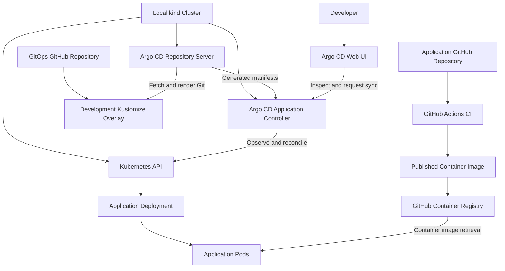
```mermaid
flowchart TD
    A["Application GitHub Repository"]
    B["GitHub Actions CI"]
    C["Published Container Image"]
    D["GitHub Container Registry"]

    E["GitOps GitHub Repository"]
    F["Development Kustomize Overlay"]

    G["Local kind Cluster"]

    H["Argo CD Repository Server"]
    I["Argo CD Application Controller"]
    J["Kubernetes API"]

    K["Application Deployment"]
    L["Application Pods"]

    M["Developer"]
    N["Argo CD Web UI"]

    A --> B
    B --> C
    C --> D

    E --> F

    G --> H
    G --> I
    G --> J

    H -->|"Fetch and render Git"| F
    H -->|"Generated manifests"| I

    I -->|"Observe and reconcile"| J
    J --> K
    K --> L

    D -->|"Container image retrieval"| L

    M --> N
    N -->|"Inspect and request sync"| I
```

Argo CD's UI accesses its API server; the UI-to-controller relationship above represents the logical operation, not a direct UI connection to the controller process.

## 16.2 The release path

```text
Application Source
        |
        v
GitHub Actions
        |
        v
Container Image
        |
        v
GHCR
        |
        v
Published Image Digest
        |
        v
GitOps Release Change
        |
        v
Approved Git Commit
        |
        v
Argo CD
        |
        v
Kubernetes
        |
        v
Running Application
```

### What should never happen automatically in this design?

An arbitrary pull request should not receive production Kubernetes administrator credentials.

An image being published should not, by itself, authorize a production deployment.

An unauthorized GitOps change should not be able to bypass the required review process.

These controls belong to different system boundaries.

---

# 17. Lab Part A — Prepare the Local Environment

We will use **kind**.

Kind runs Kubernetes nodes as containers, so it is well suited to local experiments.

The official kind documentation supports creating and deleting named clusters. [Kind](https://kind.sigs.k8s.io/docs/user/quick-start?utm_source=chatgpt.com)

## 17.1 Requirements

You need:

- Docker.
- `kubectl`.
- `kind`.
- Git.
- Access to GitHub.
- A published application image.
- Enough local memory to run Kubernetes, Argo CD, and the test application.

For a smoother experience, having several gigabytes of free RAM available is useful.

Your exact memory requirements depend on the cluster and running workloads.

## 17.2 Verify the tools

Run:

```bash
docker version
```

```bash
kubectl version --client
```

```bash
kind version
```

```bash
git --version
```

If kind is not installed, use the official installation instructions:

https://kind.sigs.k8s.io/docs/user/quick-start/

For this lab, do not use an existing AKS cluster or a Kubernetes context containing important resources.

We will create a dedicated disposable local cluster.

---

# 18. Lab Part B — Create a Dedicated Kubernetes Cluster

Create the cluster:

```bash
kind create cluster \
  --name argocd-lab \
  --wait 120s
```

Kind should create a kubeconfig context named:

```text
kind-argocd-lab
```

Select it explicitly:

```bash
kubectl config use-context kind-argocd-lab
```

Verify:

```bash
kubectl config current-context
```

Expected:

```text
kind-argocd-lab
```

List nodes:

```bash
kubectl get nodes
```

Inspect the cluster:

```bash
kubectl cluster-info
```

## 18.1 Add a safety check

Before the remaining installation commands, run:

```bash
test "$(kubectl config current-context)" = "kind-argocd-lab" \
  || {
    echo "ERROR: Refusing to modify an unexpected cluster"
    exit 1
  }
```

### Why does this matter?

Because `kubectl` commands operate against whichever cluster the current context selects.

A Kubernetes administrator can accidentally modify the wrong environment if the context is not verified.

This is a trust and operational-safety boundary.

**Always establish the deployment destination before performing privileged cluster operations.**

---

# 19. Lab Part C — Install Argo CD

We now have a running Kubernetes cluster.

We need to install the GitOps controller.

## 19.1 Which version should we use?

As of **October 9, 2026**, the current GitHub release listing identifies **Argo CD v3.5.4**, published October 6, 2026.

For this lab, we will use that specific release rather than a moving `stable` branch.

The official release provides a pinned installation manifest. [GitHub](https://github.com/argoproj/argo-cd/releases/latest?utm_source=chatgpt.com)

### Why pin the version?

Because we want:

- A known installation artifact.
- Repeatable lab instructions.
- Easier troubleshooting.
- Controlled upgrades.

A moving installation reference can change independently of our lab.

## 19.2 Create the Argo CD namespace

Run:

```bash
kubectl create namespace argocd
```

## 19.3 Install the controller

Run:

```bash
kubectl apply \
  -n argocd \
  --server-side \
  --force-conflicts \
  -f https://raw.githubusercontent.com/argoproj/argo-cd/v3.5.4/manifests/install.yaml
```

The official installation uses server-side apply because some Argo CD CRDs are too large for ordinary client-side apply annotations.

The `--force-conflicts` option is appropriate here for a fresh installation. Do not apply it casually to an existing installation that may be managed by another tool; review ownership and upgrade procedures first. [GitHub](https://github.com/argoproj/argo-cd/blob/master/docs/getting_started.md?utm_source=chatgpt.com)

## 19.4 Inspect the installed resources

Run:

```bash
kubectl get pods -n argocd
```

Then:

```bash
kubectl get deployments -n argocd
```

And:

```bash
kubectl get statefulsets -n argocd
```

You should see Argo CD components such as:

```text
argocd-server

argocd-repo-server

argocd-application-controller

argocd-applicationset-controller
```

The exact Pod names and additional components depend on the selected installation.

## 19.5 Wait for the main components

Run:

```bash
kubectl rollout status \
  deployment/argocd-server \
  -n argocd \
  --timeout=300s
```

Then:

```bash
kubectl rollout status \
  deployment/argocd-repo-server \
  -n argocd \
  --timeout=300s
```

And:

```bash
kubectl rollout status \
  statefulset/argocd-application-controller \
  -n argocd \
  --timeout=300s
```

### What do these commands establish?

They show that Kubernetes has completed the relevant workload rollouts according to its resource conditions.

They do not prove that Argo CD can access our GitOps repository or deploy our application.

That is the next boundary to test.

---

# 20. Lab Part D — Observe the Internal Components

Before creating an Application, investigate the installation.

This is an important system-thinking exercise.

## 20.1 Inspect component Pods

```bash
kubectl get pods \
  -n argocd \
  -o wide
```

Ask:

- Which Pods are running?
- Which components are Deployments?
- Which component is a StatefulSet?
- Are there restarts?
- Which nodes host the Pods?

## 20.2 Inspect available services

```bash
kubectl get services -n argocd
```

Look for the Argo CD API server and internal supporting services.

## 20.3 Inspect custom resource definitions

```bash
kubectl get crd | grep argoproj.io
```

You should find Argo CD API extensions.

For example:

```text
applications.argoproj.io

appprojects.argoproj.io

applicationsets.argoproj.io
```

### Why are CRDs important?

Because Argo CD extends the Kubernetes API.

Without those CRDs, Kubernetes would not understand objects such as:

```yaml
kind: Application
```

or:

```yaml
kind: AppProject
```

### The architectural relationship

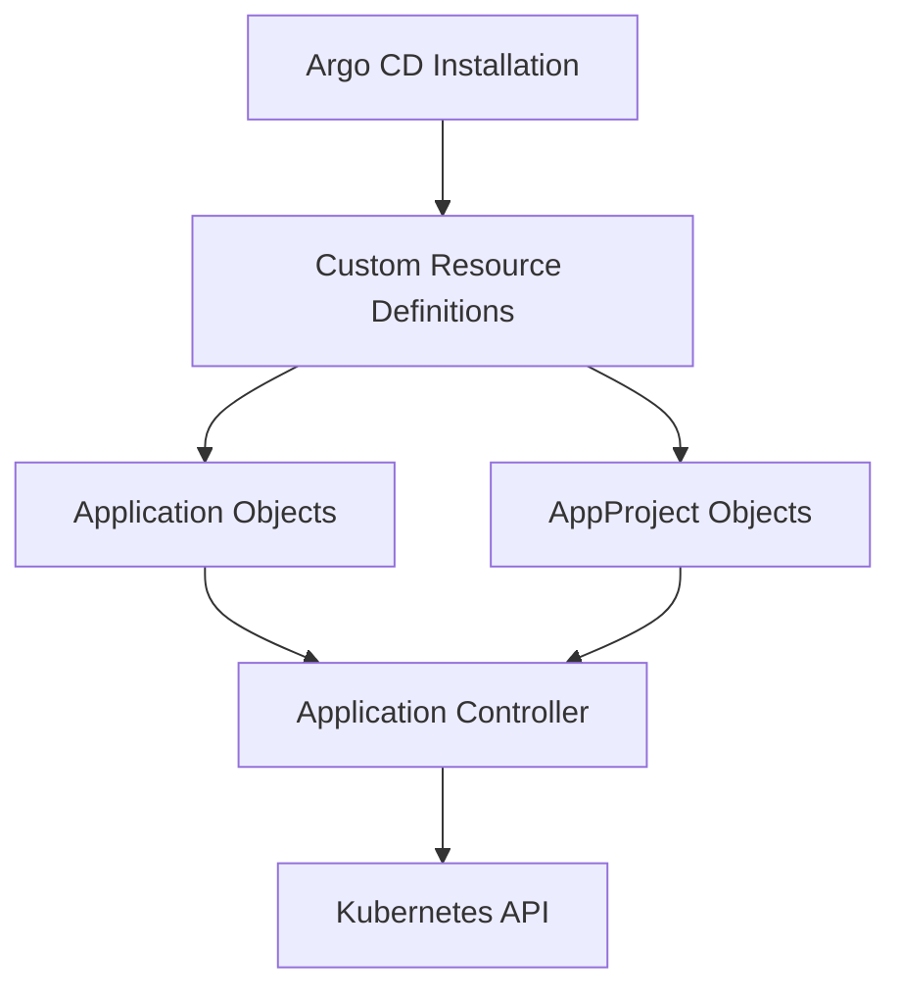
```mermaid
flowchart TD
    A["Argo CD Installation"]
    B["Custom Resource Definitions"]
    C["Application Objects"]
    D["AppProject Objects"]
    E["Application Controller"]
    F["Kubernetes API"]

    A --> B

    B --> C
    B --> D

    C --> E
    D --> E

    E --> F
```

This reveals something important.

**Argo CD itself is implemented using Kubernetes mechanisms.**

Its Applications and Projects are Kubernetes resources, and its controller observes them through the Kubernetes API.

---

# 21. Lab Part E — Access the Argo CD UI

Now we will connect to Argo CD.

We do not need to expose the service publicly.

Use local port forwarding.

Run:

```bash
kubectl port-forward \
  svc/argocd-server \
  -n argocd \
  8080:443
```

Keep this command running in its terminal.

Open another terminal for subsequent commands.

Now navigate to:

**https://localhost:8080**

The default installation uses a self-signed certificate, so your browser may display a certificate warning.

For this disposable local lab, you can access the service with the expected local certificate warning. Do not treat bypassing certificate verification as a production deployment practice.

This port-forwarding method is part of Argo CD's official getting-started procedure. [GitHub](https://github.com/argoproj/argo-cd/blob/master/docs/getting_started.md?utm_source=chatgpt.com)

## 21.1 Obtain the initial password

In another terminal, run:

```bash
kubectl -n argocd \
  get secret argocd-initial-admin-secret \
  -o jsonpath='{.data.password}' \
  | base64 -d
```

The username is:

```text
admin
```

Use the displayed password to log in.

Do not commit this password to Git or paste it into documentation screenshots.

### Important distinction

The initial administrator account is convenient for a lab.

A production Argo CD installation should use an appropriate identity and authorization design rather than relying indefinitely on the initial administrator workflow.

---

# 22. Lab Part F — Prepare the GitOps Repository for Argo CD

We will use the repository created in Phase 10.

The repository must be accessible to Argo CD.

For this initial lab, the simplest arrangement is:

- A public demonstration GitOps repository.
- A publicly pullable demonstration container image.
- No production secrets in Git.

Do not make a sensitive production repository public merely to simplify this exercise.

Private repositories and private GHCR images are supported, but they require appropriate credentials and permission management.

## 22.1 Verify the remote repository

From `release-gitops-lab`, run:

```bash
git remote -v
```

You should have a GitHub remote.

For example:

```text
https://github.com/YOUR_OWNER/release-gitops-lab.git
```

## 22.2 Verify the development overlay

Run:

```bash
kubectl kustomize \
  applications/ecommerce-api/overlays/dev
```

Inspect the rendered image.

It should resemble:

```text
ghcr.io/YOUR_OWNER/ci-artifact-lab@sha256:<actual-digest>
```

The digest must be real.

A placeholder digest will not produce a working application.

## 22.3 Verify the image is accessible

Run:

```bash
docker buildx imagetools inspect \
  ghcr.io/YOUR_OWNER/ci-artifact-lab@sha256:YOUR_ACTUAL_DIGEST
```

Replace the placeholders.

For the simplest local cluster setup, configure the demonstration GHCR package as public and verify that anonymous pulling works.

A public GitHub source repository and a public container package are separate visibility settings.

### Why is this necessary?

Because the controller and the Kubernetes nodes need access to different systems.

```text
Argo CD
    ->
Git Repository
```

```text
Kubernetes Node
    ->
Container Registry
```

Successful access to Git does not guarantee successful access to the container registry.

---

# 23. Lab Part G — Bootstrap the Target Namespace

Our development overlay uses:

```text
ecommerce-dev
```

We must ensure that the namespace exists.

For this first lab, we will create the namespace explicitly.

Run:

```bash
kubectl create namespace ecommerce-dev
```

Verify:

```bash
kubectl get namespace ecommerce-dev
```

### Why bootstrap it manually?

Because we want to keep the first Argo CD Application simple and give its AppProject a narrow destination boundary.

Argo CD also supports:

```yaml
syncOptions:
  - CreateNamespace=true
```

When correctly configured, this can create the Application's destination namespace.

However, namespace creation is a cluster-scoped operation and must fit the controller's Kubernetes permissions and the application's project policy.

The official documentation explains this feature and its destination-namespace requirements. [argo-cd.readthedocs.io](https://argo-cd.readthedocs.io/en/latest/user-guide/sync-options/?utm_source=chatgpt.com)

### Our design decision

For Phase 11:

**Bootstrap the development namespace explicitly.**

Later, we can decide whether namespace lifecycle belongs to a dedicated platform GitOps Application.

This avoids confusing application deployment with platform namespace ownership.

---

# 24. Lab Part H — Create a Dedicated AppProject

We now need to define where the application is allowed to deploy.

Inside your GitOps repository, create:

```text
argocd/bootstrap/dev-project.yaml
```

Use:

```yaml
apiVersion: argoproj.io/v1alpha1
kind: AppProject
metadata:
  name: ecommerce-dev
  namespace: argocd
spec:
  description: Development application deployment boundary

  sourceRepos:
    - https://github.com/YOUR_OWNER/release-gitops-lab.git

  destinations:
    - server: https://kubernetes.default.svc
      namespace: ecommerce-dev
```

Replace `YOUR_OWNER` with the real GitHub account or organization.

## 24.1 What does this project permit?

It permits Applications associated with the project to use the configured source repository and destination namespace.

## 24.2 What does it not automatically permit?

It does not grant arbitrary external cluster access.

It does not automatically authorize publication of images.

It does not approve changes to production GitOps configuration.

It does not bypass Kubernetes RBAC.

## 24.3 Apply the project

Run:

```bash
kubectl apply -f argocd/bootstrap/dev-project.yaml
```

Verify:

```bash
kubectl get appprojects -n argocd
```

Inspect:

```bash
kubectl get appproject ecommerce-dev \
  -n argocd \
  -o yaml
```

### What have we implemented?

We have introduced a dedicated Argo CD authorization boundary.

Next, we will create an Application governed by that boundary.

---

# 25. Lab Part I — Create the Argo CD Application

Create:

```text
argocd/bootstrap/dev-app.yaml
```

Add:

```yaml
apiVersion: argoproj.io/v1alpha1
kind: Application
metadata:
  name: ecommerce-dev
  namespace: argocd
spec:
  project: ecommerce-dev

  source:
    repoURL: https://github.com/YOUR_OWNER/release-gitops-lab.git
    targetRevision: main
    path: applications/ecommerce-api/overlays/dev

  destination:
    server: https://kubernetes.default.svc
    namespace: ecommerce-dev

  syncPolicy:
    syncOptions:
      - FailOnSharedResource=true
```

Replace `YOUR_OWNER`.

## 25.1 Why `targetRevision: main`?

Because the controller should follow the authoritative branch containing approved development configuration.

When `main` changes, Argo CD can observe the new revision.

### Important distinction

`main` is a moving Git reference.

The individual commits it identifies are separate, immutable Git objects.

For a controlled production release, the GitOps repository's approval rules determine which commit may become authoritative.

## 25.2 Why start without automated synchronization?

Because we want to observe the state comparison before allowing Argo CD to modify our application resources.

This makes the control-loop stages visible.

## 25.3 Why use `FailOnSharedResource=true`?

Because our lab should not silently let an Application take over a resource already managed by another Argo CD Application.

This is a resource-ownership safeguard.

Argo CD documents this synchronization option. [Argo CD](https://argo-cd.readthedocs.io/en/latest/user-guide/sync-options/?utm_source=chatgpt.com)

### Important limitation

This does not guarantee protection against every possible controller conflict.

For example, an unrelated Kubernetes operator may manage fields within the same object.

Field ownership still requires separate design.

---

# 26. Lab Part J — Commit and Apply the Bootstrap Configuration

We now have:

```text
argocd/bootstrap/dev-project.yaml

argocd/bootstrap/dev-app.yaml
```

Commit them to the GitOps repository:

```bash
git add argocd/bootstrap/

git commit -m "gitops: define Argo CD development application"
```

Push to the appropriate Git branch and merge through the repository's configured process.

For an initial lab repository without protected branches, you may push to `main`:

```bash
git push origin main
```

The Application will read its workload manifests from the remote Git repository.

Make sure the desired development overlay is committed and available there.

## 26.1 Apply the Application

Run:

```bash
kubectl apply -f argocd/bootstrap/dev-app.yaml
```

Verify:

```bash
kubectl get applications -n argocd
```

Expected Application name:

```text
ecommerce-dev
```

## 26.2 What did we just do?

We performed a one-time bootstrap operation.

This created the Argo CD Application object.

But **the application's workload resources are still defined in Git**.

Argo CD will use the configured repository, revision, and path to calculate desired state.

### Important architectural limitation

The bootstrap Application itself is not automatically managed by Git merely because its YAML file is committed.

In this lab, we created it through `kubectl apply`.

For a production GitOps system, the Application resource can itself be managed through an authorized root Application or ApplicationSet architecture.

That is a separate layer of controller bootstrap design.

---

# 27. Lab Part K — Observe the Initial Application State

Open the Argo CD UI.

Find:

```text
ecommerce-dev
```

Inspect the Application.

Before synchronization, you may see:

```text
Sync Status:
OutOfSync
```

And a health status reflecting missing or progressing managed resources.

The precise status depends on what the controller has already observed.

## 27.1 Observe through kubectl

Run:

```bash
kubectl get application ecommerce-dev \
  -n argocd \
  -o yaml
```

You should find:

```yaml
spec:
```

Containing the desired source and destination configuration.

You may also find:

```yaml
status:
```

Containing controller-observed information.

## 27.2 Print synchronization and health

Run:

```bash
kubectl get application ecommerce-dev \
  -n argocd \
  -o jsonpath='{.status.sync.status}{"\n"}{.status.health.status}{"\n"}'
```

Possible output:

```text
OutOfSync

Missing
```

The exact output depends on timing and current cluster conditions.

### Why are `spec` and `status` separate?

Because Kubernetes-style resources distinguish:

**Spec:** Desired configuration.

**Status:** Observed state reported by controllers.

This is a fundamental Kubernetes API design principle.

### Connection to Phase 02

```text
Spec
    =
Desired State
```

```text
Status
    =
Observed State
```

Argo CD follows this model for its own Application resources.

---

# 28. Lab Part L — Perform Your First Real Synchronization

We now have:

```text
GitOps Repository:
Desired Deployment and Service
```

And:

```text
Kubernetes:
Application resources not yet created
```

Argo CD recognizes that the desired and actual states differ.

Now we will request synchronization.

## 28.1 Use the Argo CD UI

Open the `ecommerce-dev` Application.

Inspect the resource tree.

Select **Sync**.

Review the resources that Argo CD intends to create or update.

For this first synchronization:

- Do not enable pruning.
- Do not enable unnecessary force or replace operations.
- Use the normal synchronization operation.

Confirm the operation.

## 28.2 What should happen internally?

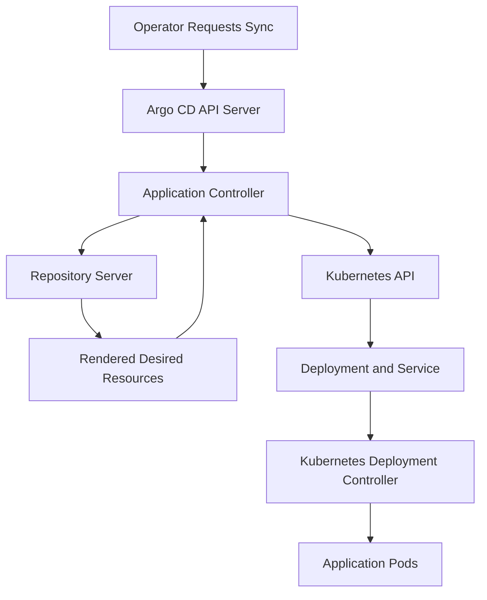
```mermaid
flowchart TD
    A["Operator Requests Sync"]
    B["Argo CD API Server"]
    C["Application Controller"]
    D["Repository Server"]
    E["Rendered Desired Resources"]
    F["Kubernetes API"]
    G["Deployment and Service"]
    H["Kubernetes Deployment Controller"]
    I["Application Pods"]

    A --> B
    B --> C

    C --> D
    D --> E
    E --> C

    C --> F
    F --> G
    G --> H
    H --> I
```

This is the real control flow.

### Step 1: Read desired state

Argo CD retrieves and processes the configured Git revision.

### Step 2: Render configuration

The repository server generates Kubernetes resources from the Kustomize overlay.

### Step 3: Compare

The application controller compares desired resources with observed live resources.

### Step 4: Synchronize

The controller requests Kubernetes API changes.

### Step 5: Reconcile workloads

Kubernetes controllers create or update the necessary workload resources.

### Step 6: Retrieve the image

The Kubernetes node's container runtime retrieves the selected image if required.

### Step 7: Report results

Argo CD observes synchronization and resource-health information.

### Important distinction

Argo CD does not pull the container image into the application Pod itself.

That operation belongs to Kubernetes and its container runtime.

---

# 29. Lab Part M — Verify the Actual Kubernetes Resources

This step is important.

Do not rely only on the green indicators in a graphical interface.

We should investigate the Kubernetes state directly.

## 29.1 Inspect the Deployment

```bash
kubectl get deployment \
  -n ecommerce-dev
```

Expected resource:

```text
ecommerce-api
```

## 29.2 Inspect Pods

```bash
kubectl get pods \
  -n ecommerce-dev \
  -o wide
```

## 29.3 Inspect the Service

```bash
kubectl get service \
  -n ecommerce-dev
```

## 29.4 Inspect the configured image

```bash
kubectl get deployment ecommerce-api \
  -n ecommerce-dev \
  -o jsonpath='{.spec.template.spec.containers[0].image}{"\n"}'
```

The result should match the image reference rendered from your development overlay.

## 29.5 Verify the rollout

```bash
kubectl rollout status \
  deployment/ecommerce-api \
  -n ecommerce-dev \
  --timeout=180s
```

### If the rollout fails

Do not assume Argo CD is broken.

Inspect the Pods:

```bash
kubectl describe pods \
  -n ecommerce-dev
```

And relevant events:

```bash
kubectl get events \
  -n ecommerce-dev \
  --sort-by=.lastTimestamp
```

Possible causes include:

- Incorrect image digest.
- Private image without pull authorization.
- Missing runtime dependencies.
- Container startup failure.
- Insufficient local cluster resources.

### What have we now established?

If the rollout succeeds, we have evidence that Kubernetes created the requested workload and satisfied its rollout conditions.

We still need to test application behavior.

---

# 30. Lab Part N — Verify the Running Application

We now want to access the deployed Node.js application.

Open another terminal.

Run:

```bash
kubectl port-forward \
  -n ecommerce-dev \
  service/ecommerce-api \
  18080:80
```

Keep the port-forward running.

Open another terminal.

Test the health endpoint:

```bash
curl -fsS \
  http://127.0.0.1:18080/health
```

Expected:

```json
{
  "status": "ok"
}
```

Now test the business endpoint:

```bash
curl -fsS \
  "http://127.0.0.1:18080/total?subtotalCents=10000&taxBasisPoints=1800"
```

Expected:

```json
{
  "totalCents": 11800
}
```

## 30.1 What did each validation establish?

| Check | Evidence |
|---|---|
| Argo CD Application exists | Controller has a configured management object |
| Application source resolves | Desired manifests can be obtained |
| Synchronization completes | Requested Kubernetes configuration was applied |
| Deployment rollout succeeds | Workload satisfies Kubernetes rollout conditions |
| Health endpoint works | Selected HTTP behavior is available |
| Pricing endpoint works | Selected business behavior is correct |

These are not interchangeable.

### Critical engineering principle

> **A complete deployment verification process gathers evidence from configuration, orchestration, and application behavior.**

---

# 31. Exercise — Trace the Entire Deployment

Now close the UI for a moment.

Try to explain the complete system from memory.

Start with:

```text
Approved GitOps Commit
```

Then identify every component involved until the application becomes available.

The expected architecture is:

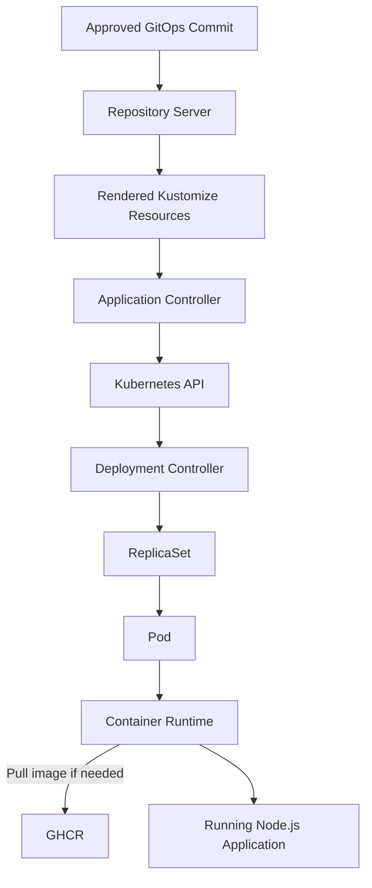
```mermaid
flowchart TD
    A["Approved GitOps Commit"]
    B["Repository Server"]
    C["Rendered Kustomize Resources"]
    D["Application Controller"]
    E["Kubernetes API"]
    F["Deployment Controller"]
    G["ReplicaSet"]
    H["Pod"]
    I["Container Runtime"]
    J["GHCR"]
    K["Running Node.js Application"]

    A --> B
    B --> C
    C --> D

    D --> E
    E --> F
    F --> G
    G --> H
    H --> I

    I -->|"Pull image if needed"| J
    I --> K
```

### Questions

**Q1.** Which component reads Git?

**Q2.** Which component generates Kubernetes manifests?

**Q3.** Which component decides whether synchronization is needed?

**Q4.** Which component accepts the Deployment configuration?

**Q5.** Which component manages the ReplicaSet?

**Q6.** Which component retrieves the container image?

**Q7.** Which component evaluates the HTTP application's business behavior?

If you can explain these responsibilities without confusing them, you are beginning to think like a delivery-system engineer rather than a tool operator.

---

# 32. Lab Part O — Observe Configuration Drift

We have deployed our application using Argo CD.

Now we will deliberately create drift.

Our development overlay declares:

```text
Replicas: 1
```

But what happens if we change the live Deployment to two replicas?

## 32.1 Confirm the desired value

Run:

```bash
kubectl kustomize \
  applications/ecommerce-api/overlays/dev \
  | grep replicas
```

Expected:

```text
replicas: 1
```

## 32.2 Modify live state

Run:

```bash
kubectl scale deployment/ecommerce-api \
  -n ecommerce-dev \
  --replicas=2
```

Inspect:

```bash
kubectl get deployment ecommerce-api \
  -n ecommerce-dev
```

The Deployment should now request two replicas.

## 32.3 Compare desired and live state

Desired configuration:

```text
Replicas: 1
```

Actual configuration:

```text
Replicas: 2
```

We have introduced drift.

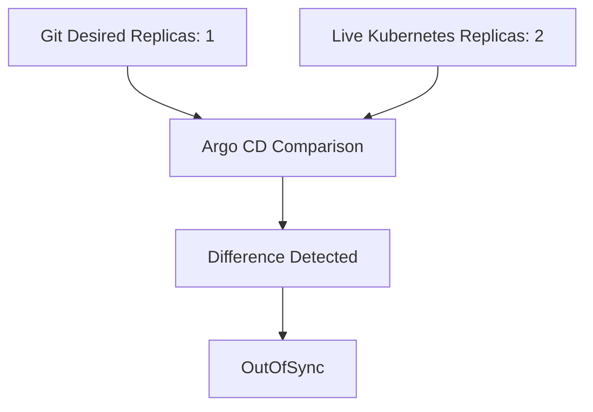
```mermaid
flowchart TD
    A["Git Desired Replicas: 1"]
    B["Live Kubernetes Replicas: 2"]
    C["Argo CD Comparison"]
    D["Difference Detected"]
    E["OutOfSync"]

    A --> C
    B --> C

    C --> D
    D --> E
```

## 32.4 Inspect Argo CD

Open the UI.

Refresh the Application if necessary.

Argo CD should detect the difference and report an `OutOfSync` state once the comparison is refreshed.

### What happens next?

Remember: our Application does not yet have automated synchronization enabled.

Therefore, it can report drift without automatically correcting it.

### Key lesson

**Drift detection and drift correction are separate responsibilities.**

---

# 33. Lab Part P — Manually Correct Drift

Now request synchronization from the Argo CD UI.

Inspect the planned change.

The controller should attempt to restore:

```text
Replicas: 1
```

Verify:

```bash
kubectl get deployment ecommerce-api \
  -n ecommerce-dev \
  -o jsonpath='{.spec.replicas}{"\n"}'
```

Expected:

```text
1
```

Then inspect:

```bash
kubectl get application ecommerce-dev \
  -n argocd \
  -o jsonpath='{.status.sync.status}{"\n"}'
```

Once reconciliation and comparison complete, the Application should return to `Synced`, assuming no other differences remain.

### What have we demonstrated?

```text
Approved Desired State
          |
          v
Manual Live Modification
          |
          v
Drift Detected
          |
          v
Authorized Manual Sync
          |
          v
Desired State Restored
```

This is a complete reconciliation experiment.

However, correction still required an explicit operator request.

Next, we will automate that behavior.

---

# 34. Lab Part Q — Enable Automated Synchronization

We now understand manual synchronization.

Let's change the policy.

For this isolated development Application, we want:

```text
Automatic Sync:
Enabled

Self-Healing:
Enabled

Automatic Pruning:
Disabled
```

Why this combination?

Because we want to explore automatic correction without enabling automatic deletion of resources.

## 34.1 Modify the Application policy

For this disposable lab, run:

```bash
kubectl patch application ecommerce-dev \
  -n argocd \
  --type merge \
  -p '{"spec":{"syncPolicy":{"automated":{"enabled":true,"prune":false,"selfHeal":true}}}}'
```

Inspect:

```bash
kubectl get application ecommerce-dev \
  -n argocd \
  -o yaml
```

You should find:

```yaml
syncPolicy:
  automated:
    enabled: true
    prune: false
    selfHeal: true
```

The existing synchronization options should remain present.

### Important design note

We are modifying the Application resource directly for a controlled learning experiment.

In a fully declarative production setup, this policy should be managed through an authorized configuration source.

Our bootstrap Application is not yet self-managed by GitOps, so this local experiment does not violate an existing Argo CD management relationship.

---

# 35. Lab Part R — Test Automatic Self-Healing

Now repeat the earlier drift experiment.

## 35.1 Introduce drift

```bash
kubectl scale deployment/ecommerce-api \
  -n ecommerce-dev \
  --replicas=2
```

Observe:

```bash
kubectl get deployment ecommerce-api \
  -n ecommerce-dev \
  --watch
```

The live Deployment requests two replicas.

Because self-healing is enabled, Argo CD should subsequently attempt to restore the Git-defined replica count.

The reconciliation may not happen instantaneously.

## 35.2 Verify convergence

After the controller has processed the change, inspect:

```bash
kubectl get deployment ecommerce-api \
  -n ecommerce-dev \
  -o jsonpath='{.spec.replicas}{"\n"}'
```

Expected after successful self-healing:

```text
1
```

### Complete control loop

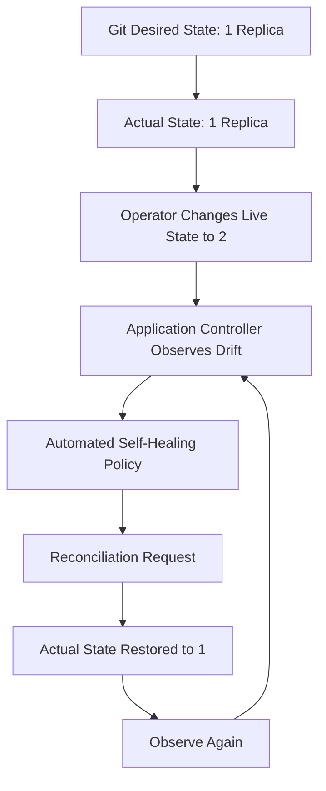
```mermaid
flowchart TD
    A["Git Desired State: 1 Replica"]
    B["Actual State: 1 Replica"]
    C["Operator Changes Live State to 2"]
    D["Application Controller Observes Drift"]
    E["Automated Self-Healing Policy"]
    F["Reconciliation Request"]
    G["Actual State Restored to 1"]
    H["Observe Again"]

    A --> B
    B --> C
    C --> D
    D --> E
    E --> F
    F --> G
    G --> H

    H --> D
```

### What changed between the two experiments?

Not the GitOps repository.

Not the application source.

Not the image.

Only the reconciliation policy.

### Engineering insight

> **Reconciliation behavior is determined by both the desired configuration and the controller's authority and synchronization policy.**

---

# 36. The Important HPA Ownership Problem

Before moving forward, consider a production system.

Suppose an HPA is responsible for scaling the application.

The HPA requests:

```text
Replicas: 5
```

But Git defines:

```text
Replicas: 1
```

And Argo CD has self-healing enabled.

We may create competing control loops.

## 36.1 Conflict

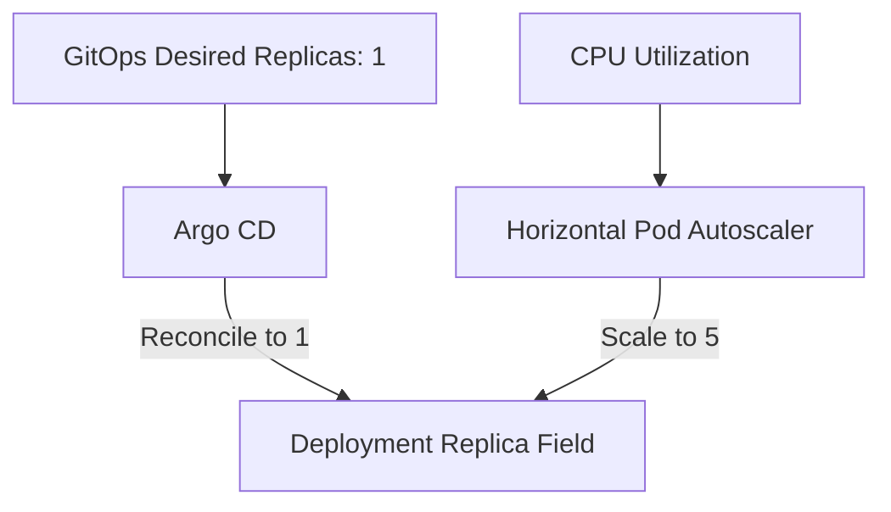
```mermaid
flowchart TD
    A["GitOps Desired Replicas: 1"]
    B["Argo CD"]

    C["CPU Utilization"]
    D["Horizontal Pod Autoscaler"]

    E["Deployment Replica Field"]

    A --> B
    B -->|"Reconcile to 1"| E

    C --> D
    D -->|"Scale to 5"| E
```

### What is the underlying problem?

Two controllers are trying to own the same effective field.

### How should we solve it?

Define field ownership.

For example, if the autoscaler legitimately owns the replica count, Argo CD should be configured to account for that ownership.

Argo CD supports `ignoreDifferences` and related synchronization settings.

For example:

```yaml
spec:
  ignoreDifferences:
    - group: apps
      kind: Deployment
      name: ecommerce-api
      jsonPointers:
        - /spec/replicas

  syncPolicy:
    syncOptions:
      - RespectIgnoreDifferences=true
```

**Do not apply this change to our current lab.** We intentionally want Git to own the replica count for the drift experiment.

Also, ignoring a difference in comparisons is not identical to ignoring it during synchronization; `RespectIgnoreDifferences=true` affects how ignored differences are handled during sync. Argo CD documents this distinction. [Argo CD](https://argo-cd.readthedocs.io/en/stable/user-guide/diffing/?utm_source=chatgpt.com)

### Fundamental principle

**Every reconciled resource field should have a clear authoritative owner.**

---

# 37. Lab Part S — Trigger a Deployment Through a Git Change

We have demonstrated live-state drift.

Now let's test the Git-driven deployment path.

We want to prove:

```text
Git Change
      |
      v
Argo CD Detects New Desired State
      |
      v
Argo CD Synchronizes
      |
      v
Kubernetes Configuration Changes
```

We must not manually deploy the workload using `kubectl apply`.

The change should originate from Git.

## 37.1 Choose a safe configuration change

For this first experiment, modify only the development overlay.

Open:

```text
applications/ecommerce-api/overlays/dev/kustomization.yaml
```

Add:

```yaml
commonAnnotations:
  gitops.example.com/demo-revision: "phase-11"
```

Keep the existing:

```yaml
resources:
```

```yaml
images:
```

```yaml
namespace:
```

And any existing patches.

### Why use an annotation?

Because it changes Kubernetes resource metadata without requiring another application image build.

It also does not require a second GHCR image.

This is a useful low-impact way to demonstrate the reconciliation path.

---

## 37.2 Validate locally

Run:

```bash
kubectl kustomize \
  applications/ecommerce-api/overlays/dev
```

If you completed Phase 10, also run:

```bash
python scripts/validate_gitops.py
```

Both should succeed.

Inspect the rendered annotation.

It should appear in the relevant resource metadata.

### Important note

An annotation on the Deployment's own metadata is not the same as an annotation on the Pod template.

Changing only the Deployment object's metadata does not necessarily create a new ReplicaSet.

That is acceptable.

Our purpose here is to demonstrate GitOps configuration reconciliation, not an application image rollout.

---

# 38. Lab Part T — Commit and Merge the Desired-State Change

Create a feature branch:

```bash
git switch -c experiment/argocd-git-sync
```

Commit the change:

```bash
git add applications/ecommerce-api/overlays/dev/

git commit -m "gitops: demonstrate development reconciliation"
```

Push:

```bash
git push -u origin experiment/argocd-git-sync
```

Open a pull request targeting `main`.

Have the required configuration validation run.

Review and merge the change according to the repository's configured policy.

### What happens after merging?

The authoritative GitOps branch now contains the new annotation.

Argo CD tracks:

```text
targetRevision: main
```

It should discover the updated desired state through its normal refresh behavior.

With automated synchronization enabled, it can apply the change.

Git webhooks can make change detection faster, but the basic periodic reconciliation mechanism does not require a GitHub Actions deployment command.

Argo CD documents its automatic synchronization semantics and periodic reconciliation behavior. [Argo CD](https://argo-cd.readthedocs.io/en/stable/user-guide/auto_sync/?utm_source=chatgpt.com)

---

# 39. Lab Part U — Verify the Git-Driven Reconciliation

Inspect the Application in Argo CD.

Observe:

- Target Git revision.
- Sync status.
- Last synchronization.
- Managed resources.

Then inspect the live Deployment:

```bash
kubectl get deployment ecommerce-api \
  -n ecommerce-dev \
  -o yaml
```

Look for:

```yaml
metadata:
  annotations:
    gitops.example.com/demo-revision: phase-11
```

The actual YAML will contain additional Kubernetes-managed metadata.

## 39.1 What should you verify?

| Question | Evidence |
|---|---|
| Did the Git change reach `main`? | Git commit history |
| Did Argo CD observe the revision? | Application source and sync status |
| Did Argo CD apply the change? | Sync operation and live resource |
| Does the live Deployment contain the annotation? | Kubernetes API output |
| Did CI directly deploy the workload? | No deployment job required |
| Was a new container image built? | No |

### Why is this experiment important?

Because it demonstrates the defining GitOps relationship:

**Git records the desired change; Argo CD performs reconciliation.**

Our application pipeline did not need Kubernetes deployment credentials.

---

# 40. Experiment — Promote a New Image Digest

Now extend the previous experiment.

Suppose Phase 07 or Phase 08 produced a second image:

```text
Digest A:
Currently deployed

Digest B:
New release candidate
```

For development, select Digest B using the promotion script from Phase 09.

For example:

```bash
python scripts/promote.py dev "$DIGEST_B"
```

Here, `DIGEST_B` must contain the actual SHA-256 digest of a published GHCR image.

## 40.1 Inspect the intended change

Run:

```bash
git diff
```

The development overlay should change from:

```text
Image Digest A
```

To:

```text
Image Digest B
```

Do not modify staging or production for this experiment.

## 40.2 Validate

```bash
python scripts/validate_gitops.py
```

Then:

```bash
kubectl kustomize \
  applications/ecommerce-api/overlays/dev
```

## 40.3 Authorize and merge

Create a pull request.

Review the selected digest and its validation evidence.

Merge the change.

## 40.4 Observe Argo CD

The Application should detect the updated desired image reference.

With automated synchronization enabled, Argo CD should request the corresponding Deployment update.

Kubernetes then performs the rollout.

## 40.5 Verify

```bash
kubectl get deployment ecommerce-api \
  -n ecommerce-dev \
  -o jsonpath='{.spec.template.spec.containers[0].image}{"\n"}'
```

Then:

```bash
kubectl rollout status \
  deployment/ecommerce-api \
  -n ecommerce-dev \
  --timeout=180s
```

Finally, rerun the application's HTTP smoke tests.

### What have we demonstrated?

The new application version was deployed through an approved GitOps change.

**Argo CD did not rebuild the image.**

It reconciled Kubernetes to reference the previously published artifact.

This is the connection between Release Engineering and GitOps.

---

# 41. Failure Scenario 1 — Git Repository Access Fails

Imagine the Application reports an error while generating manifests.

What should we investigate?

Start at the earliest relevant boundary.

```text
Argo CD
    |
    v
Git Repository Access
    |
    v
Manifest Generation
```

Potential causes:

- Incorrect repository URL.
- Private repository without configured credentials.
- Expired or revoked repository credentials.
- Git hosting outage.
- Network problems.
- Incorrect branch name.
- Incorrect manifest path.

## 41.1 Diagnostic process

Inspect the Application:

```bash
kubectl describe application ecommerce-dev \
  -n argocd
```

Inspect repository-server logs:

```bash
kubectl logs \
  deployment/argocd-repo-server \
  -n argocd \
  --tail=100
```

Inspect the configured source:

```bash
kubectl get application ecommerce-dev \
  -n argocd \
  -o jsonpath='{.spec.source.repoURL}{"\n"}{.spec.source.targetRevision}{"\n"}{.spec.source.path}{"\n"}'
```

### Questions to answer

1. Is the repository URL correct?
2. Can Argo CD authenticate?
3. Does the selected branch exist?
4. Does the configured path exist in that revision?
5. Can Kustomize render the directory?

### Important lesson

**A repository-access or manifest-generation failure occurs before Kubernetes workload creation.**

Do not begin troubleshooting application Pods if Argo CD has not successfully generated the desired manifests.

---

# 42. Failure Scenario 2 — The Manifest Is Invalid

Suppose someone commits:

```yaml
apiVersion: apps/v1
kind: Deployment
metadata:
  name: ecommerce-api
spec:
  replicas: invalid-value
```

The Deployment schema expects a valid integer replica count.

The resource cannot be accepted as written.

### What might happen?

The repository server may still be able to render the YAML.

But Kubernetes API validation or admission can reject the resource.

### Why is this distinction important?

Because these are separate stages.

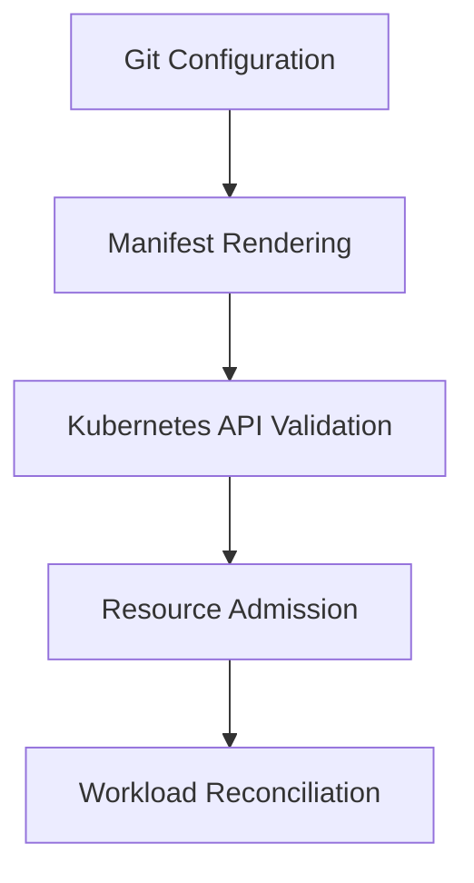
```mermaid
flowchart TD
    A["Git Configuration"]
    B["Manifest Rendering"]
    C["Kubernetes API Validation"]
    D["Resource Admission"]
    E["Workload Reconciliation"]

    A --> B
    B --> C
    C --> D
    D --> E
```

A problem can occur at any stage.

### Diagnostic commands

Render locally:

```bash
kubectl kustomize \
  applications/ecommerce-api/overlays/dev
```

Check your repository's static validation:

```bash
python scripts/validate_gitops.py
```

Inspect the Argo CD synchronization operation and resource error messages.

### Engineering principle

**Successful YAML rendering does not guarantee successful Kubernetes admission.**

Likewise, successful admission does not guarantee that the workload starts correctly.

---

# 43. Failure Scenario 3 — The Image Cannot Be Pulled

Imagine Git selects:

```text
ghcr.io/example/ecommerce-api@sha256:BBB
```

Argo CD applies the Deployment.

The Kubernetes node attempts to retrieve the image.

But the registry rejects the request.

Possible reasons:

- Image is private.
- Pull credentials are missing.
- Image digest does not exist.
- Registry network access is unavailable.
- Image platform is incompatible.

## 43.1 Observe the failure

Run:

```bash
kubectl get pods -n ecommerce-dev
```

You may see:

```text
ImagePullBackOff
```

or:

```text
ErrImagePull
```

Inspect:

```bash
kubectl describe pod \
  -n ecommerce-dev \
  POD_NAME
```

Replace `POD_NAME` with the actual Pod.

Focus on the Events section.

### Which component failed?

Not necessarily the Argo CD repository server.

The problem is at the artifact retrieval boundary.

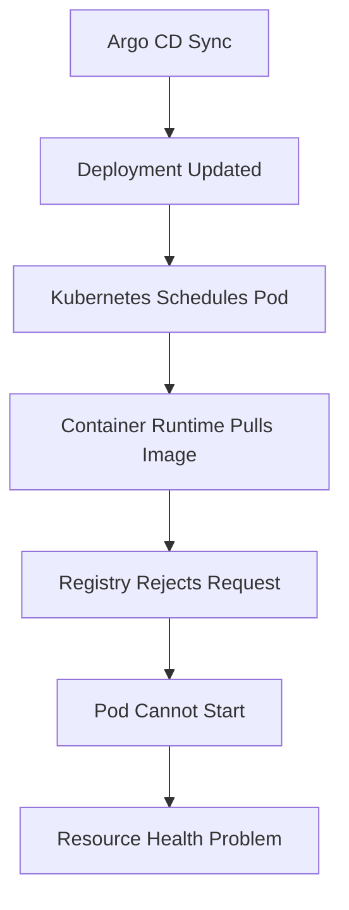
```mermaid
flowchart TD
    A["Argo CD Sync"]
    B["Deployment Updated"]
    C["Kubernetes Schedules Pod"]
    D["Container Runtime Pulls Image"]
    E["Registry Rejects Request"]
    F["Pod Cannot Start"]
    G["Resource Health Problem"]

    A --> B
    B --> C
    C --> D
    D --> E
    E --> F
    F --> G
```

### Why can synchronization still appear successful?

Because the requested configuration may have been applied successfully even though the corresponding container cannot start.

Resource health may remain `Progressing` or become `Degraded`, depending on observed conditions and health evaluation.

### Key lesson

**Deployment configuration success and image distribution success are different properties.**

---

# 44. Failure Scenario 4 — Container Starts but Application Crashes

Now imagine the image pulls successfully.

Kubernetes starts the container.

But the Node.js process immediately crashes.

Possible reasons:

- Missing environment variable.
- Incorrect runtime command.
- Missing dependency.
- Application startup exception.
- Unavailable external service.
- Incorrect application configuration.

## 44.1 Investigation

Inspect Pods:

```bash
kubectl get pods -n ecommerce-dev
```

Inspect container logs:

```bash
kubectl logs \
  deployment/ecommerce-api \
  -n ecommerce-dev \
  --tail=100
```

Inspect the Deployment:

```bash
kubectl describe deployment ecommerce-api \
  -n ecommerce-dev
```

### What is the likely failure boundary?

```text
Container Image Available
        |
        v
Container Starts
        |
        v
Application Process Fails
```

This is an application runtime failure.

It is different from:

```text
Repository Authentication Failure
```

or:

```text
Kubernetes API Admission Failure
```

### Engineering principle

> **Troubleshoot the first failed system boundary instead of treating every unsuccessful deployment as an Argo CD problem.**

---

# 45. Failure Scenario 5 — Argo CD Cannot Reach Kubernetes

Suppose Git is available and the manifests are valid.

But Argo CD cannot communicate with the Kubernetes API.

The controller cannot reliably observe or apply resources.

Possible causes:

- Kubernetes API unavailable.
- Incorrect cluster credentials.
- Insufficient controller permissions.
- Network restrictions.
- Incorrect cluster registration.

### What evidence matters?

- Application controller logs.
- Cluster connectivity.
- Kubernetes authorization errors.
- Argo CD cluster registration state.
- Application synchronization conditions.

Inspect controller logs:

```bash
kubectl logs \
  statefulset/argocd-application-controller \
  -n argocd \
  --tail=100
```

For our local lab, the Kubernetes API is the same cluster hosting Argo CD.

For external clusters, Argo CD must have a correctly configured cluster connection.

### Important lesson

**Being able to render desired state does not imply having permission or connectivity to reconcile it.**

---

# 46. Controlled Controller-Failure Experiment

This experiment is optional but useful.

**Perform it only in the disposable `kind-argocd-lab` cluster.**

We will temporarily make Argo CD's repository server unavailable.

Do not perform this experiment in a shared or production cluster.

## 46.1 Verify the cluster context

```bash
kubectl config current-context
```

It must be:

```text
kind-argocd-lab
```

## 46.2 Temporarily stop the repository server

Run:

```bash
kubectl scale deployment/argocd-repo-server \
  -n argocd \
  --replicas=0
```

Inspect:

```bash
kubectl get deployment argocd-repo-server \
  -n argocd
```

### What should happen conceptually?

Existing application Pods can continue running.

But Argo CD's ability to generate desired manifests through the repository server is impaired.

A new refresh or synchronization operation may report an error.

### Important insight

```text
GitOps Controller Dependency Failure
             !=
Immediate Application Process Failure
```

The delivery control plane and application runtime have different responsibilities.

---

## 46.3 Restore the repository server

Run:

```bash
kubectl scale deployment/argocd-repo-server \
  -n argocd \
  --replicas=1
```

Wait for recovery:

```bash
kubectl rollout status \
  deployment/argocd-repo-server \
  -n argocd \
  --timeout=300s
```

Inspect the Application afterward.

### What did we demonstrate?

Argo CD contains operational dependencies.

Those components need monitoring and recovery procedures.

A deployment system's control plane can fail without all previously running applications immediately disappearing.

However, an unavailable control plane can prevent new releases and reconciliation.

---

# 47. Pruning: Why We Are Not Enabling It Yet

Consider this scenario.

Our GitOps repository contains:

```text
Deployment

Service
```

Now a pull request removes the Service.

If automatic pruning is enabled, Argo CD may delete the previously managed Service during synchronization.

This may interrupt traffic.

## 47.1 Our current policy

```yaml
automated:
  enabled: true
  prune: false
  selfHeal: true
```

We deliberately disabled automatic pruning.

### Why?

Because we want to distinguish:

**Correcting existing resources**

from:

**Deleting resources that disappeared from Git**

These have different risk profiles.

## 47.2 Pruning decision model

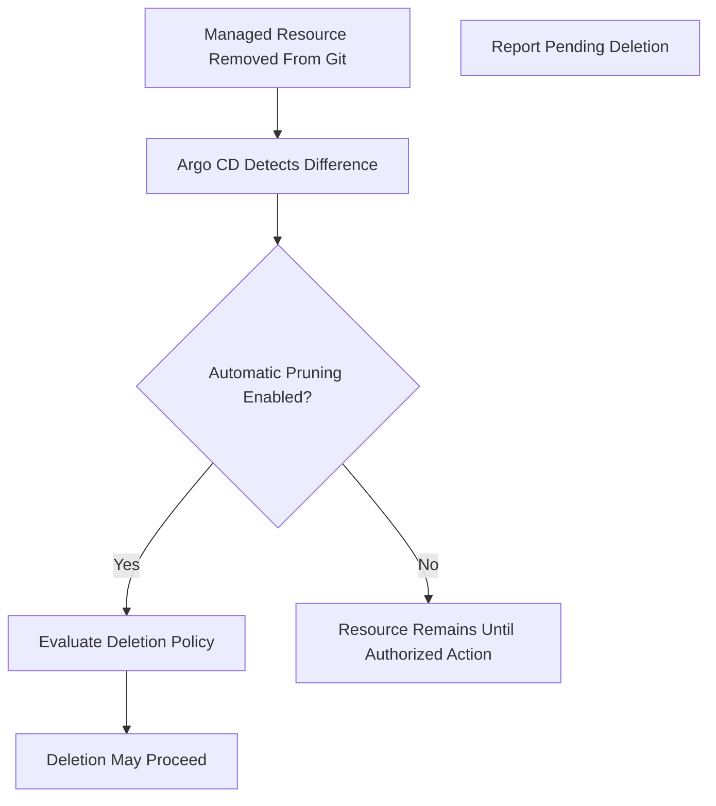
```mermaid
flowchart TD
    A["Managed Resource Removed From Git"]
    B["Argo CD Detects Difference"]
    C{"Automatic Pruning Enabled?"}
    D["Report Pending Deletion"]
    E["Evaluate Deletion Policy"]
    F["Deletion May Proceed"]
    G["Resource Remains Until Authorized Action"]

    A --> B
    B --> C

    C -->|No| G
    C -->|Yes| E

    E --> F
```

### Important distinction

Automatic pruning being disabled does not make deletion impossible.

An authorized manual synchronization with pruning may still remove resources.

The exact operation requires appropriate permissions and policy.

### Production considerations

Resources such as:

- PersistentVolumeClaims.
- Database operators and database clusters.
- Critical Services.
- Production namespaces.
- Shared infrastructure resources.

May require additional protection.

### Engineering principle

**A Git deletion is a proposed change to desired state. It should not be treated as risk-free simply because it is declarative.**

---

# 48. Argo CD Application Lifecycle and Deletion

Now consider a more subtle question.

What happens when an Argo CD Application itself is deleted?

There are two different objects to think about:

1. The Argo CD Application custom resource.
2. The Kubernetes resources managed by that Application.

Deleting the Application object may or may not delete its managed resources, depending on deletion mode, finalizers, and applicable ownership behavior.

This distinction matters for GitOps bootstrap and decommissioning.

## 48.1 Conceptual lifecycle

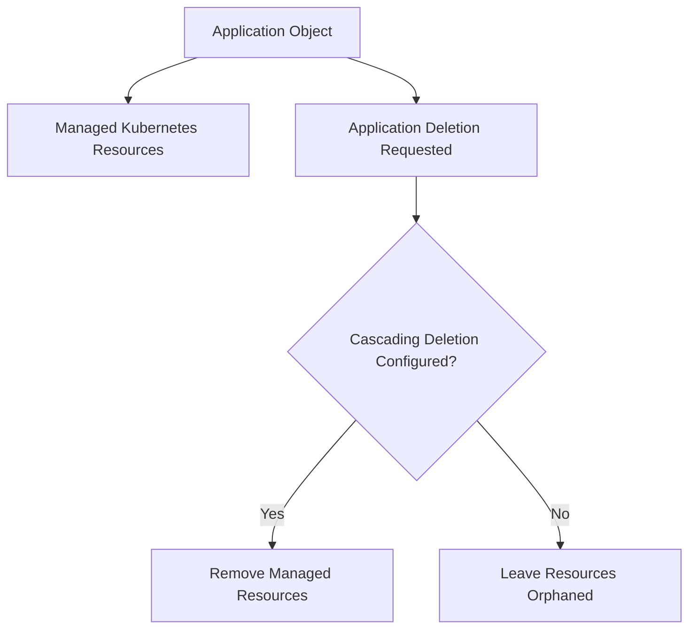
```mermaid
flowchart TD
    A["Application Object"]
    B["Managed Kubernetes Resources"]
    C["Application Deletion Requested"]
    D{"Cascading Deletion Configured?"}
    E["Remove Managed Resources"]
    F["Leave Resources Orphaned"]

    A --> B
    A --> C

    C --> D

    D -->|Yes| E
    D -->|No| F
```

### What is the operational concern?

An engineer might intend to stop Argo CD from managing an application.

But deleting the Application with cascading deletion can also remove the workloads.

Those are materially different intentions.

### First-principles lesson

> **Changing controller ownership and deleting runtime resources should be modeled as separate lifecycle decisions.**

Do not experiment with deleting the Application until you understand the expected cleanup behavior.

---

# 49. Argo CD Projects, RBAC, and Production Security

Our lab uses a dedicated development AppProject.

Now imagine deploying a real production application.

The production boundary should consider:

- Trusted source repositories.
- Authorized destination clusters.
- Authorized namespaces.
- Permitted resource kinds.
- User and group permissions.
- Synchronization authority.
- Repository write policies.

## 49.1 Example production boundary

```text
Application:
ecommerce-production
```

```text
Source Repository:
platform-gitops
```

```text
Target Path:
applications/ecommerce-api/overlays/production
```

```text
Destination:
Production Cluster
```

```text
Namespace:
ecommerce-production
```

A dedicated AppProject can help restrict source and destination relationships.

Argo CD RBAC can further control which users or roles are permitted to view, modify, or synchronize applications.

### Why are both necessary?

An AppProject constrains where the Application may deploy.

Argo CD RBAC constrains what users can do through Argo CD.

Kubernetes RBAC constrains the controller's actual Kubernetes API authority.

GitHub repository rules constrain who can change the approved desired state.

### Four control layers

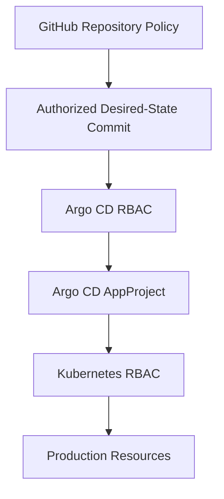
```mermaid
flowchart TD
    A["GitHub Repository Policy"]
    B["Authorized Desired-State Commit"]
    C["Argo CD RBAC"]
    D["Argo CD AppProject"]
    E["Kubernetes RBAC"]
    F["Production Resources"]

    A --> B
    B --> C
    C --> D
    D --> E
    E --> F
```

This is a logical defense-in-depth model.

The permissions are not enforced through one linear network request. Different systems enforce different parts of the authority boundary.

### Key security principle

**Protect both the authority to change desired state and the authority to apply that desired state.**

---

# 50. The GitOps Bootstrap Problem

We have now installed Argo CD and created an Application.

But think about how we did it.

We used:

```bash
kubectl apply -f argocd/bootstrap/dev-app.yaml
```

Is that GitOps?

The application's deployment resources are managed through GitOps.

But the bootstrap Application resource was installed manually.

This leads to an interesting question:

**Who manages the GitOps controller and its own configuration?**

## 50.1 Possible designs

### Design A: Manual initial bootstrap

An operator installs Argo CD and creates the first Application.

After that, Argo CD manages application resources.

This is what our lab does.

### Design B: Root Application

A root Argo CD Application tracks Git configuration that defines other Argo CD Applications.

Conceptually:

```mermaid
flowchart TD
    A["Bootstrap Root Application"]
    B["GitOps Repository"]
    C["Application Definitions"]

    D["Development Application"]
    E["Staging Application"]
    F["Production Application"]

    A --> B
    B --> C

    C --> D
    C --> E
    C --> F
```

This is often called an **App-of-Apps** pattern.

It introduces its own trust and ownership considerations.

### Design C: ApplicationSet

An ApplicationSet resource generates and manages Applications using templates and generators.

This is useful for repeated patterns across applications, environments, or clusters.

## 50.2 Which design should we use?

For the current learning project:

**Manual bootstrap followed by GitOps-managed application configuration is sufficient.**

For a larger platform, Root Application or ApplicationSet may reduce repeated setup and improve consistency.

### Important warning

A root Application that can generate or manage many child Applications has significant authority.

Treat its repository and configuration as privileged infrastructure.

---

# 51. How Argo CD Integrates With GitHub Actions

Now connect Phases 05–11.

We need to distinguish the work of CI from the work of Argo CD.

## 51.1 GitHub Actions pipeline

```text
Developer Commit
       |
       v
Type Checking
       |
       v
Unit and Integration Tests
       |
       v
Container Build
       |
       v
Container Registry
       |
       v
Image Digest
```

GitHub Actions produces the artifact and supporting validation evidence.

## 51.2 Release engineering

```text
Published Digest
       |
       v
Promotion Proposal
       |
       v
Review and Authorization
       |
       v
Approved GitOps Commit
```

Release engineering determines which artifact is authorized.

## 51.3 Argo CD

```text
Approved GitOps Commit
       |
       v
Argo CD
       |
       v
Kubernetes Desired Configuration
       |
       v
Runtime Workloads
```

Argo CD reconciles the approved desired state.

### Complete architecture

```mermaid
flowchart TD
    A["Developer"]
    B["Application Git Repository"]
    C["GitHub Actions"]
    D["Validation Results"]
    E["Container Image"]
    F["GHCR"]
    G["Published Digest"]

    H["Release Proposal"]
    I["GitOps Review"]
    J["Protected GitOps Repository"]

    K["Argo CD Repository Server"]
    L["Argo CD Application Controller"]
    M["Kubernetes API"]

    N["Kubernetes Deployment"]
    O["Application Pods"]
    P["Runtime Verification"]

    A --> B
    B --> C
    C --> D
    D --> E
    E --> F
    F --> G

    G --> H
    H --> I
    I --> J

    K -->|"Fetch desired state"| J
    K --> L

    L -->|"Compare and reconcile"| M
    M --> N
    N --> O

    F -->|"Image retrieval"| O

    O --> P
```

This is the architecture we have been building across the course.

### Important insight

**The container registry and GitOps repository hold different kinds of information.**

The registry stores the software artifact.

The GitOps repository identifies which artifact should run.

Argo CD reconciles that decision.

---

# 52. Diagnosing Argo CD With a Failure-Boundary Matrix

A production engineer should avoid debugging by randomly changing configuration.

Use a systematic model.

| Symptom | Likely boundary | First investigation |
|---|---|---|
| Application does not appear | Application creation | Check Application CR and namespace |
| Invalid repository error | Git authentication or URL | Check `repoURL`, credentials, repository-server logs |
| Manifest generation error | Kustomize or Helm | Render configuration locally and inspect repo-server logs |
| AppProject permission error | Argo CD project policy | Inspect allowed sources and destinations |
| Synchronization fails | Kubernetes API or resource admission | Inspect sync operation and resource messages |
| `OutOfSync` persists | Configuration difference or reconciliation policy | Inspect live-versus-desired diff |
| `Synced` but Pod cannot start | Image/runtime boundary | Inspect Pod events and image pulls |
| Pod crashes | Application runtime | Inspect container logs |
| Pods ready but API fails | Application behavior | Run API checks and inspect dependencies |
| Manual changes repeatedly revert | Self-healing or another controller | Identify field ownership and reconciliation policy |
| Resources unexpectedly deleted | Pruning or deletion lifecycle | Inspect sync history, Git changes, and finalizers |
| Controller cannot process changes | Argo CD infrastructure | Inspect controller health, logs, and connectivity |

## 52.1 A repeatable debugging process

```mermaid
flowchart TD
    A["Deployment Problem"]
    B["Identify Expected Git Revision"]
    C["Check Application Source"]
    D["Verify Manifest Generation"]
    E["Inspect Sync Result"]
    F["Inspect Kubernetes Resources"]
    G["Inspect Container Runtime"]
    H["Run Application Verification"]
    I["Identify First Failed Boundary"]

    A --> B
    B --> C
    C --> D
    D --> E
    E --> F
    F --> G
    G --> H
    H --> I
```

Do not assume every investigation must traverse every step.

Once the first failed boundary is identified, focus on the evidence relevant to that failure.

### Example

If Argo CD cannot authenticate to Git, debugging container startup logs is probably premature.

If Git rendering and synchronization succeed, but the Pod is in `ImagePullBackOff`, investigate registry access rather than rewriting Kustomize.

### Engineering principle

> **Debug GitOps as a chain of contracts: source retrieval, manifest generation, authorization, synchronization, Kubernetes reconciliation, artifact retrieval, and application behavior.**

---

# 53. Argo CD CLI — Useful Operational Commands

So far, we have used the Argo CD UI and `kubectl`.

Argo CD also provides a dedicated CLI.

It is useful for:

- Inspecting Applications.
- Viewing differences.
- Requesting synchronization.
- Examining deployment history.
- Waiting for selected application conditions.
- Automating diagnostic operations.

You can install the CLI using the official guide:

https://argo-cd.readthedocs.io/en/stable/cli_installation/

For this lab, use a CLI compatible with the installed Argo CD v3.5.4 server.

## 53.1 Authenticate

With the local port-forward still running:

```bash
argocd login localhost:8080 \
  --username admin \
  --insecure
```

Enter the administrator password when prompted.

The `--insecure` option is used here only for the disposable lab's self-signed certificate.

Do not disable certificate verification as a routine production practice.

## 53.2 List Applications

```bash
argocd app list
```

## 53.3 Inspect an Application

```bash
argocd app get ecommerce-dev
```

## 53.4 Compare desired and live state

```bash
argocd app diff ecommerce-dev
```

A successful command with no differences indicates that no relevant difference was found under the current comparison rules.

## 53.5 Request synchronization

```bash
argocd app sync ecommerce-dev
```

This explicitly requests a synchronization operation.

Use it when an operator is authorized to perform the action.

## 53.6 Wait for synchronization and health

```bash
argocd app wait ecommerce-dev \
  --sync \
  --health \
  --timeout 180
```

This waits for the specified Application conditions.

### Important qualification

Passing both conditions does not prove every business transaction works.

Application-level smoke tests and runtime monitoring remain separate requirements.

---

# 54. Production Engineering — How Should Argo CD Be Operated?

Our local installation is suitable for learning.

Production introduces additional requirements.

## 54.1 Availability

Ask:

- What happens if the application controller becomes unavailable?
- What happens if Redis fails?
- What happens if the repository server cannot reach Git?
- What happens during a Kubernetes API outage?
- How will critical controller components be monitored?

For an environment with higher availability requirements, evaluate Argo CD's supported high-availability architecture.

## 54.2 Authentication and authorization

Ask:

- Who can log in?
- Which teams may view applications?
- Which teams may synchronize production?
- Who can modify Projects?
- Who can register clusters?
- Who can change repository credentials?
- Can users bypass release review through the UI?

## 54.3 Resource ownership

Ask:

- Which Applications own which Kubernetes resources?
- Are resources shared between applications?
- Does another operator manage the same fields?
- Are deletion and pruning behaviors understood?
- Are autoscaling controllers compatible with the chosen diff rules?

## 54.4 Security

Ask:

- Are trusted Git repositories restricted?
- Are controller permissions appropriately scoped?
- Are repository and registry credentials protected?
- Is Argo CD publicly exposed?
- Are TLS and identity integrations configured?
- Are Argo CD upgrades and security patches maintained?
- Is production desired state protected by review policies?

## 54.5 Observability

Ask:

- Can we detect persistent `OutOfSync` states?
- Can we detect failed synchronization?
- Can we distinguish source-access problems from Kubernetes errors?
- Are controller logs available?
- Are reconciliation delays observable?
- Are application health and business metrics monitored separately?

### Engineering principle

**Argo CD is part of the production delivery control plane. It requires reliability and security engineering just like the systems it manages.**

---

# 55. Metrics for Evaluating GitOps Quality

How do we know whether the GitOps architecture is working well?

A useful system should provide evidence about delivery-state convergence.

| Metric | What it helps evaluate |
|---|---|
| Time from approved Git commit to detection | Source-refresh latency |
| Time from detection to successful synchronization | Reconciliation latency |
| Time from synchronization to workload readiness | Runtime convergence |
| Failed synchronization frequency | Deployment-control reliability |
| Persistent `OutOfSync` duration | Unresolved configuration differences |
| Controller availability | GitOps control-plane reliability |
| Repository access failures | Desired-state retrieval problems |
| Unauthorized drift incidents | Configuration governance |
| Time to restore approved desired state | Recovery efficiency |
| Application error rate after releases | Operational release quality |

### Important distinction

A fast Argo CD synchronization does not automatically imply fast application readiness.

For example:

```text
Argo CD Sync:
Successful
```

But:

```text
Container Startup:
3 minutes
```

And:

```text
Database Migration:
10 minutes
```

These are different parts of the delivery process.

### First-principles lesson

> **Measure the complete state transition from approved intent to acceptable runtime behavior, not just the time taken by the synchronization command.**

---

# 56. System-Design Exercise — Production Argo CD on AKS

Now apply the concepts independently.

## Scenario

Your company operates a SaaS platform on Azure.

Technology stack:

```text
Azure Kubernetes Service

Azure Container Registry

GitHub Actions

Terraform

Kustomize

Argo CD

PostgreSQL

Prometheus and Grafana
```

The platform contains three services:

```text
Frontend

Backend API

Background Worker
```

Environments:

```text
Development

Staging

Production
```

### Requirements

1. Application CI must not have unrestricted production Kubernetes access.
2. Production deployment configuration must be reviewable.
3. Releases must use immutable image digests.
4. Staging and production must have separate authorization boundaries.
5. Argo CD must detect configuration drift.
6. Production pruning must be carefully controlled.
7. Application health must be distinguishable from synchronization status.
8. Recovery must preserve release history.
9. Secrets must not be committed to Git in plaintext.
10. The platform must support application autoscaling.

---

## Exercise A — Design the Argo CD architecture

Identify:

```text
API Server

Repository Server

Application Controller

ApplicationSet Controller

GitOps Repository

Kubernetes API

Runtime Workloads
```

Explain why each component exists.

Draw the control flow.

---

## Exercise B — Define Applications

Decide whether you need:

```text
frontend-dev

backend-dev

worker-dev

frontend-staging

backend-staging

worker-staging

frontend-production

backend-production

worker-production
```

Or another structure.

For every proposed Application, define:

```text
Source Repository:

Target Revision:

Manifest Path:

AppProject:

Destination Cluster:

Destination Namespace:

Synchronization Policy:
```

Do not create Applications merely because a service exists.

Explain the ownership boundary.

---

## Exercise C — Design AppProjects

How will you restrict:

- Development source repositories.
- Staging source repositories.
- Production source repositories.
- Target namespaces.
- Cluster-scoped resources.
- Application synchronization permissions.

Explain why GitHub review policies, AppProjects, Argo CD RBAC, and Kubernetes RBAC all remain necessary.

---

## Exercise D — Design automatic synchronization

For development:

Would you enable:

```text
Auto-Sync?

Self-Healing?

Pruning?
```

For production:

Would your decisions differ?

Explain why.

Remember that the correct answer depends on the organization's release requirements.

---

## Exercise E — Design autoscaling ownership

Suppose the production backend uses HPA.

Argo CD also manages the Deployment.

Which system should control:

```text
spec.replicas
```

How will you prevent reconciliation conflicts?

---

## Exercise F — Investigate a production incident

Suppose Argo CD reports:

```text
Application: backend-production

Sync Status: Synced

Health Status: Degraded

Desired Image: Digest BBB
```

Kubernetes reports:

```text
Ready Replicas: 0

Desired Replicas: 3
```

Answer:

1. Why might `Synced` and `Degraded` appear together?
2. What evidence would you collect first?
3. How would you distinguish image-pull errors from application crashes?
4. Which component actually retrieves the image?
5. Can Argo CD automatically guarantee recovery?
6. How would you evaluate restoring Digest AAA?
7. What GitOps change would express the recovery decision?
8. How would you verify that the incident is resolved?

---

# 57. Memorization — Eight Argo CD Mental Models

Instead of memorizing every CLI command, remember these eight relationships.

## Mental Model 1 — Argo CD is a reconciliation controller

```text
Git Desired State
       |
       v
Argo CD
       |
       v
Kubernetes Actual State
       |
       v
Continuous Comparison
```

---

## Mental Model 2 — The three central components

```text
Repository Server
       =
Generate Desired Manifests
```

```text
Application Controller
       =
Compare and Reconcile
```

```text
API Server
       =
Expose Management Interface
```

---

## Mental Model 3 — Application defines management scope

```text
Application
    =
Source
    +
Destination
    +
Project
    +
Sync Policy
```

---

## Mental Model 4 — Project defines an authorization boundary

```text
AppProject
    =
Allowed Sources
    +
Allowed Destinations
    +
Resource Permissions
```

---

## Mental Model 5 — Synced is not healthy

```text
Synced
    =
Relevant Configuration Matches
```

```text
Healthy
    =
Resource Health Rules Are Satisfied
```

Application business correctness requires additional verification.

---

## Mental Model 6 — Auto-sync is not self-healing

```text
Auto-Sync
    =
Automatically Apply Eligible Desired-State Changes
```

```text
Self-Healing
    =
Attempt Correction of Live-State Drift
```

```text
Pruning
    =
Delete Resources Removed From Desired State
```

These are distinct policies.

---

## Mental Model 7 — Argo CD does not build images

```text
GitHub Actions
       |
       v
Build and Publish Artifact
```

```text
Release Engineering
       |
       v
Authorize Artifact
```

```text
Argo CD
       |
       v
Reconcile Deployment Configuration
```

---

## Mental Model 8 — GitOps recovery changes authority, not just runtime

```text
Production Failure
       |
       v
Recovery Decision
       |
       v
Approved GitOps Change
       |
       v
Argo CD Reconciliation
       |
       v
Runtime Verification
```

This is the model you should remember during incident response.

---

# 58. Active Recall Questions

Close your notes and answer without looking.

### Fundamentals

**Q1.** Why does GitOps need a reconciliation controller?

**Q2.** What is the difference between Git storing desired state and Kubernetes maintaining runtime state?

**Q3.** Why is Argo CD not simply another CI tool?

**Q4.** How does Argo CD differ from running `kubectl apply` in GitHub Actions?

### Architecture

**Q5.** What does the repository server do?

**Q6.** What does the application controller do?

**Q7.** What does the API server do?

**Q8.** Why does Argo CD use Kubernetes CRDs?

**Q9.** What is an Application?

**Q10.** What is an AppProject?

**Q11.** Why is an Application not the same thing as a Kubernetes Deployment?

### Reconciliation

**Q12.** What is the difference between `Synced` and `Healthy`?

**Q13.** What does `OutOfSync` mean?

**Q14.** What is the difference between manual sync and automated sync?

**Q15.** What is self-healing?

**Q16.** What is pruning?

**Q17.** Why might self-healing conflict with an HPA?

**Q18.** What does `FailOnSharedResource=true` protect against?

### Security and reliability

**Q19.** Why should a production Application use an appropriately restricted AppProject?

**Q20.** Why is protecting the GitOps repository important?

**Q21.** Why does Argo CD still need Kubernetes permissions?

**Q22.** What happens if Argo CD cannot reach Git?

**Q23.** What happens if Kubernetes cannot pull an image?

**Q24.** What happens if the repository server is unavailable?

**Q25.** Why might a GitOps Application be synchronized while its Pods are unavailable?

### Integration

**Q26.** Which component builds the container image?

**Q27.** Which component stores the published image?

**Q28.** Which component authorizes the production image selection?

**Q29.** Which component changes Kubernetes desired configuration?

**Q30.** Which component retrieves the image into a running node?

---

# 59. Interview and System-Design Questions

### Question 1

Explain Argo CD's internal architecture.

Your answer must distinguish repository-server, application-controller, API-server, and Kubernetes-controller responsibilities.

### Question 2

An Application reports `OutOfSync`, but the current application is healthy.

Should Argo CD automatically synchronize?

Explain how you would decide.

### Question 3

A team enables automated synchronization and assumes that live-state drift will always be corrected.

Is that assumption valid?

Explain the role of self-healing.

### Question 4

Argo CD reports `Synced`, but all application Pods are in `ImagePullBackOff`.

Is Argo CD functioning correctly?

Explain the system boundaries involved.

### Question 5

Two Argo CD Applications attempt to manage the same Service.

What problems can occur?

How would you prevent conflicting ownership?

### Question 6

Your company wants developers to deploy to development automatically but requires production approval.

How would you design the GitOps repository, AppProjects, and synchronization policies?

### Question 7

GitHub Actions publishes an image to GHCR.

How does that exact artifact reach AKS without GitHub Actions receiving direct Kubernetes deployment credentials?

### Question 8

A production administrator manually changes a Deployment replica count.

Argo CD restores the original value.

What happened?

How should you handle the situation if an HPA owns the field?

### Question 9

A release fails after a destructive PostgreSQL migration.

Can Argo CD automatically restore the entire system to its previous state?

Why or why not?

### Question 10

How would you design Argo CD to manage twenty microservices across three environments while preserving resource ownership and authorization boundaries?

---

# 60. Official Documentation

Use these references to connect the architecture with exact configuration options.

### Argo CD architecture

https://argo-cd.readthedocs.io/en/stable/operator-manual/architecture/

Study the responsibilities of the API server, repository server, and application controller.

### Getting started

https://argo-cd.readthedocs.io/en/stable/getting_started/

Study installation, API access, Application creation, and cluster registration.

### Application specification

https://argo-cd.readthedocs.io/en/stable/user-guide/application-specification/

Focus on `source`, `destination`, `project`, `syncPolicy`, and resource-health settings.

### Projects

https://argo-cd.readthedocs.io/en/stable/user-guide/projects/

Study source restrictions, destination restrictions, and AppProject authorization.

### Automated synchronization

https://argo-cd.readthedocs.io/en/stable/user-guide/auto_sync/

Understand auto-sync, self-healing, pruning, and the limitations of built-in rollback when automation is enabled.

### Synchronization options

https://argo-cd.readthedocs.io/en/stable/user-guide/sync-options/

Study `FailOnSharedResource`, `CreateNamespace`, pruning controls, and `RespectIgnoreDifferences`.

### Resource health

https://argo-cd.readthedocs.io/en/stable/operator-manual/health/

Study how Argo CD evaluates resource health and why status is different from application-level business correctness.

### ApplicationSet

https://argo-cd.readthedocs.io/en/stable/user-guide/application-set/

Study why application generation becomes useful in multi-application and multi-cluster systems.

### Kind

https://kind.sigs.k8s.io/docs/user/quick-start/

Study local cluster creation, contexts, and cleanup.

---

# 61. Lab Cleanup

We created a dedicated disposable Kubernetes cluster.

When you have finished your experiments, stop the active port-forward terminals.

Then verify the current cluster context:

```bash
kubectl config current-context
```

If you created the cluster using:

```text
argocd-lab
```

Delete it using:

```bash
kind delete cluster --name argocd-lab
```

This removes the local kind cluster.

It does not delete:

- Your GitHub repositories.
- Your GHCR images.
- Your Git commits.
- Your local project files.

### Why clean up?

Because responsible infrastructure engineering includes understanding resource lifecycle and cleanup.

Even free local environments consume disk space, memory, and computing resources while running.

---

# 62. Phase 11 — Engineering Takeaways

| Principle | Engineering meaning |
|---|---|
| **Argo CD is a GitOps reconciliation controller** | It manages declared Kubernetes application state |
| **Git alone cannot deploy** | A controller must interpret configuration and interact with Kubernetes |
| **Repository server generates desired manifests** | Git, Kustomize, and Helm configuration become Kubernetes resource definitions |
| **Application controller reconciles** | It compares desired and actual state |
| **API server provides management access** | UI, CLI, authentication, and authorized operations |
| **Application defines management scope** | Source, destination, project, and policy |
| **AppProject restricts authority** | Applications should have controlled sources and destinations |
| **Synced does not mean healthy** | Configuration convergence and workload health are separate |
| **Manual sync differs from auto-sync** | Detection does not automatically authorize correction |
| **Self-healing corrects eligible drift** | It needs explicit policy |
| **Pruning can delete resources** | Deletion must reflect risk and authorization |
| **Controller ownership matters** | Conflicting controllers can destabilize resources |
| **Git changes drive releases** | Approved desired-state updates initiate reconciliation |
| **Argo CD does not build images** | CI and artifact creation remain separate |
| **Kubernetes retrieves images** | Argo CD reconciles references, not image execution |
| **Controllers need operational monitoring** | The GitOps control plane can fail |
| **Recovery requires authoritative changes** | Temporary live modifications may be reversed |
| **Application rollback may be insufficient** | Database and external state require separate recovery planning |
| **Security exists at multiple boundaries** | Git, Argo CD RBAC, AppProjects, and Kubernetes RBAC all matter |

---

# 63. Final Understanding — The Complete Argo CD System

Let's return to the central question:

**How does Argo CD transform an approved Git commit into an actual Kubernetes application?**

The process begins with a GitOps Application.

The Application identifies:

- Which repository Argo CD should read.
- Which revision it should track.
- Which path contains the desired resources.
- Which cluster and namespace should receive them.
- Which AppProject governs the Application.
- Which synchronization policies are enabled.

The repository server generates the desired Kubernetes manifests.

The application controller compares them against Kubernetes live resources.

It reports the relevant differences.

If synchronization is authorized, Argo CD requests the necessary Kubernetes changes.

Kubernetes controllers then work toward the requested workload state.

The container runtime obtains the selected image.

The application starts.

Argo CD evaluates synchronization and supported resource-health information.

Application-level verification determines whether the running software behaves acceptably.

This is the complete control loop.

## 63.1 Final architecture

```mermaid
flowchart TD
    A["Developer"]
    B["Application Git Repository"]
    C["GitHub Actions CI"]
    D["Validation Evidence"]
    E["Container Build"]
    F["Container Registry"]
    G["Immutable Image Digest"]

    H["Release Proposal"]
    I["Release Authorization"]
    J["Protected GitOps Repository"]

    K["Argo CD Application"]
    L["Argo CD AppProject"]

    M["Argo CD Repository Server"]
    N["Generated Desired Manifests"]

    O["Argo CD Application Controller"]
    P["Observe Kubernetes State"]
    Q["Compare Desired and Actual"]
    R{"Reconciliation Needed?"}

    S["Report Synced"]
    T["Evaluate Sync Policy"]
    U["Apply Authorized Change"]

    V["Kubernetes API"]
    W["Deployment Controller"]
    X["Application Pods"]
    Y["Application Verification"]
    Z["Operational Feedback"]

    A --> B
    B --> C
    C --> D
    D --> E
    E --> F
    F --> G

    G --> H
    H --> I
    I --> J

    K --> M
    L --> K

    M -->|"Read Git source"| J
    M --> N

    N --> O
    O --> P
    P --> Q
    N --> Q

    Q --> R

    R -->|No| S
    R -->|Yes| T

    T --> U
    U --> V
    V --> W
    W --> X

    X --> P

    F -->|"Image retrieval"| X

    X --> Y
    Y --> Z

    Z -.-> A
    Z -.-> H
```

### Notice the boundaries

**GitHub Actions** creates evidence and artifacts.

**Release Engineering** authorizes changes.

**Git** records deployment intent.

**AppProject** constrains Argo CD Application permissions.

**Repository Server** generates desired manifests.

**Application Controller** compares and reconciles configuration.

**Kubernetes** maintains the workload.

**Container Registry** distributes images.

**Application Verification** evaluates actual behavior.

### The most important principle of Phase 11

> **Argo CD is not simply a tool that applies Kubernetes YAML. It is a continuously operating reconciliation system that translates version-controlled deployment intent into Kubernetes resource changes while enforcing defined synchronization and authorization policies.**

If you understand that statement, you understand the architectural role of Argo CD.

You should now be able to explain:

- Why Argo CD exists.
- How it works internally.
- What each component does.
- How it interacts with Git.
- How it interacts with Kubernetes.
- Why `Synced` and `Healthy` are different.
- Why resource ownership matters.
- How drift is detected and corrected.
- How release approval connects to reconciliation.
- How GitOps-based recovery works.
- Why Argo CD does not replace CI or observability.

---

# Phase 11 Complete

**Completed:** Level 3 — Phase 11: Argo CD

## Course Progress — 5 Levels, 16 Phases

| Level | Phase | Topic | Status |
|---|---|---|---|
| **1 — Fundamentals** | 01 | Why CI/CD Exists | Completed |
| | 02 | Feedback and Control Systems | Completed |
| | 03 | Delivery Architecture | Completed |
| | 04 | Git Lifecycle | Completed |
| **2 — Continuous Integration** | 05 | CI Architecture | Completed |
| | 06 | Testing and Quality Gates | Completed |
| | 07 | Build Artifacts | Completed |
| | 08 | GitHub Actions | Completed |
| **3 — Continuous Delivery** | 09 | Release Engineering | Completed |
| | 10 | GitOps | Completed |
| | 11 | Argo CD | Completed |
| | **12** | **End-to-End Integration** | **Next** |
| **4 — Production Engineering** | 13 | Deployment Strategies | Upcoming |
| | 14 | CI/CD Security | Upcoming |
| | 15 | Reliability and Observability | Upcoming |
| **5 — System Design** | 16 | Complete CI/CD Project | Upcoming |

---

# Next: Phase 12 — End-to-End CI/CD Integration

**File:** `Level-3-Continuous-Delivery/Phase-12-End-to-End-Integration.md`

We have now studied the individual systems.

In Phase 12, we will connect them into one complete delivery architecture.

The main topics will be:

- Designing the full software delivery lifecycle.
- Source commit to GitHub Actions.
- CI validation to container build.
- Container build to immutable GHCR artifact.
- Artifact digest to GitOps promotion proposal.
- GitOps approval to Argo CD synchronization.
- Argo CD reconciliation to Kubernetes rollout.
- Kubernetes rollout to application verification.
- Tracking identities across repositories and systems.
- End-to-end release evidence.
- Handling partial failures.
- Preventing unapproved promotion.
- Validating the complete delivery chain.
- Diagnosing failures across multiple systems.
- Designing safe recovery.
- Measuring delivery lead time and reliability.
- Building a complete working pipeline using GitHub Actions, GitOps, Argo CD, and Kubernetes.

### Central engineering question for Phase 12

> **How do we design, implement, and validate the complete software delivery system so that every step—from source change to running application—is traceable, authorized, reliable, and recoverable?**

Phase 12 will complete **Level 3 — Continuous Delivery**.

After that, we will begin **Level 4 — Production Engineering**, where deployment strategies, CI/CD security, reliability, and observability become our main focus.

**Send `next` to begin Phase 12 — End-to-End Integration.**