# Phase 12 — End-to-End CI/CD Integration: Designing the Complete Software Delivery System

**Level 3: Continuous Delivery | CI/CD From First Principles**

**File:** `Level-3-Continuous-Delivery/Phase-12-End-to-End-Integration.md`

**Previous:** Phase 11 — Argo CD  
**Next:** Phase 13 — Deployment Strategies

---

# 1. Introduction — We Know the Components. Now We Must Engineer the System.

Welcome to **Phase 12**, the final phase of Level 3.

During the previous eleven phases, we studied different parts of software delivery.

We learned why CI/CD exists, how Git manages source revisions, how tests produce evidence, how GitHub Actions executes validation, how Docker builds artifacts, and how Argo CD reconciles Kubernetes configuration.

But understanding each component independently is not enough.

Consider this system:

```text
GitHub Repository

GitHub Actions

Docker

Container Registry

GitOps Repository

Argo CD

Kubernetes
```

Every component might work correctly on its own.

Yet the complete software delivery system can still fail.

For example:

- CI validates one commit but publishes an image from another.
- An image is published without passing the required tests.
- The release automation updates the wrong environment.
- GitOps references a nonexistent image digest.
- Argo CD synchronizes the configuration, but Kubernetes cannot start the container.
- The application starts but cannot connect to PostgreSQL.
- A new GitOps release replaces a previous release before its verification completes.
- A rollback restores an older image that is incompatible with the current database.

These are **integration failures**.

They occur at the boundaries between otherwise functioning systems.

This leads us to the central question of Phase 12:

> **How do we design, implement, and verify one complete delivery system in which every transition—from developer commit to running application—is traceable, authorized, and recoverable?**

We will derive the answer from first principles before implementing the complete workflow.

---

# 2. What You Will Learn

By the end of this phase, you should understand:

1. How to integrate Git, CI, artifact management, release engineering, GitOps, Argo CD, and Kubernetes.
2. Why a collection of tools is not automatically a reliable delivery system.
3. How to define contracts between delivery components.
4. How to track the source revision, build execution, artifact digest, GitOps revision, and runtime image.
5. How to design the complete delivery state machine.
6. How validation and authorization differ across system boundaries.
7. How GitHub Actions should transfer artifact information into release engineering.
8. Why cross-repository authentication needs its own security design.
9. How to promote an artifact without rebuilding it.
10. How an approved GitOps change becomes a Kubernetes rollout.
11. Why deployment success and operational success must be verified separately.
12. How to handle partial failures and retries.
13. How to investigate a failed end-to-end release.
14. How to design recovery without bypassing GitOps authority.
15. How to collect evidence that proves what actually happened.
16. How to evaluate delivery reliability and lead time.

### Our practical project

We will extend the projects from Phases 07–11:

**Application repository:** `ci-artifact-lab`

**GitOps repository:** `release-gitops-lab`

**CI:** GitHub Actions

**Artifact registry:** GitHub Container Registry (GHCR)

**GitOps controller:** Argo CD

**Kubernetes:** Local kind cluster

**Application:** Node.js + TypeScript HTTP API

The main lab will deploy a new application version to **development** through an approved GitOps change.

Staging and production will remain prepared for later promotion.

We will not pretend that local rendering is equivalent to deployment, or that a local development smoke test is production verification.

---

# 3. First Principle: A System Is More Than Its Components

Imagine we have seven services.

```text
Service A

Service B

Service C

Service D

Service E

Service F

Service G
```

Each service passes its own tests.

Does that prove the entire system works?

No.

Why?

Because the services exchange information.

And every exchange introduces assumptions.

For example:

```text
Service A produces an identifier.

Service B expects that identifier.

Service C uses it to select an object.
```

If one service produces an identifier with a different meaning than the next service expects, the overall system fails.

CI/CD has exactly this problem.

## 3.1 Delivery systems exchange identities and decisions

Consider this flow:

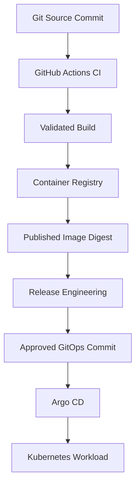

Every arrow represents an integration boundary.

For example:

```text
CI -> Container Registry
```

Requires an agreement about:

- Which image is being published.
- Which registry repository receives it.
- Which permissions are required.
- How publication failure is reported.
- How the published digest is obtained.

Similarly:

```text
GitOps Repository -> Argo CD
```

Requires an agreement about:

- Which repository is authoritative.
- Which branch is trusted.
- Which path defines the application.
- Which cluster is targeted.
- Which reconciliation policy is enabled.

The components must agree about these contracts.

### First-principles insight

> **A reliable delivery system requires correct component behavior and correct contracts between those components.**

In this phase, we will design both.

---

# 4. Define the Complete Delivery Contract

Start with a business requirement:

> Every approved application change should be buildable, testable, releasable, deployable, traceable, and recoverable.

Break it into smaller contracts.

| Boundary | Input | Required output | Failure behavior |
|---|---|---|---|
| Git → CI | Identifiable source revision | Validation result for that revision | Report failure; do not approve integration |
| CI → Build | Approved source and controlled inputs | Deployable artifact | Stop if build fails |
| Build → Registry | Container image | Published digest | Do not report successful publication |
| Registry → Release | Existing image digest | Release candidate with evidence | Reject unknown or invalid artifact |
| Release → GitOps | Authorized artifact selection | Reviewable configuration change | Do not modify authoritative state without approval |
| GitOps → Argo CD | Approved repository revision | Rendered desired resources | Report source or rendering errors |
| Argo CD → Kubernetes | Desired resources | Reconciliation operation | Report sync/admission errors |
| Kubernetes → Runtime | Image reference and configuration | Started workload | Report scheduling, pull, or startup failures |
| Runtime → Verification | Running application | Health and functional evidence | Mark release unverified; evaluate recovery |

This table is one of the most important artifacts in the entire course.

It describes the architecture **without depending on a particular YAML implementation**.

### Remember

GitHub Actions is replaceable.

GHCR is replaceable.

Argo CD is replaceable.

But these responsibilities and contracts still exist in some form.

That is system thinking.

---

# 5. Requirements Before Architecture

Let's design a complete delivery system for our Node.js application.

## 5.1 Functional requirements

**REQ-01:** Developers propose application changes through Git.

**REQ-02:** Proposed changes must pass CI validation.

**REQ-03:** Approved source revisions must produce a deployable container image.

**REQ-04:** The published image must have an immutable digest.

**REQ-05:** Release engineering must record the relationship between source and artifact.

**REQ-06:** Development deployment must be initiated through GitOps.

**REQ-07:** The GitOps configuration must pass automated validation.

**REQ-08:** Changes to the authoritative GitOps branch must follow the configured review policy.

**REQ-09:** Argo CD must reconcile the approved development configuration.

**REQ-10:** Kubernetes must successfully start the selected application image.

**REQ-11:** The deployed application must pass a smoke test.

**REQ-12:** The delivery evidence must identify what was actually deployed.

## 5.2 Nonfunctional requirements

**NFR-01 — Traceability:** Every released artifact can be traced to source and build execution.

**NFR-02 — Least privilege:** Validation jobs do not receive production deployment credentials.

**NFR-03 — Artifact consistency:** Promotion uses an already-published digest.

**NFR-04 — Recoverability:** Previous approved artifacts and configuration references remain identifiable.

**NFR-05 — Observability:** Failure can be localized to a system boundary.

**NFR-06 — Idempotency:** Retrying a promotion request should not silently select a different artifact.

**NFR-07 — Cost:** The main integration lab should run without paid cloud infrastructure.

**NFR-08 — Reproducibility:** Important inputs and versions should be controlled.

### Why define requirements explicitly?

Because every architectural component should exist to satisfy some requirement.

If we cannot explain which requirement a workflow, controller, or script implements, we should question whether it is necessary.

---

# 6. Complete Reference Architecture

Now combine the requirements.

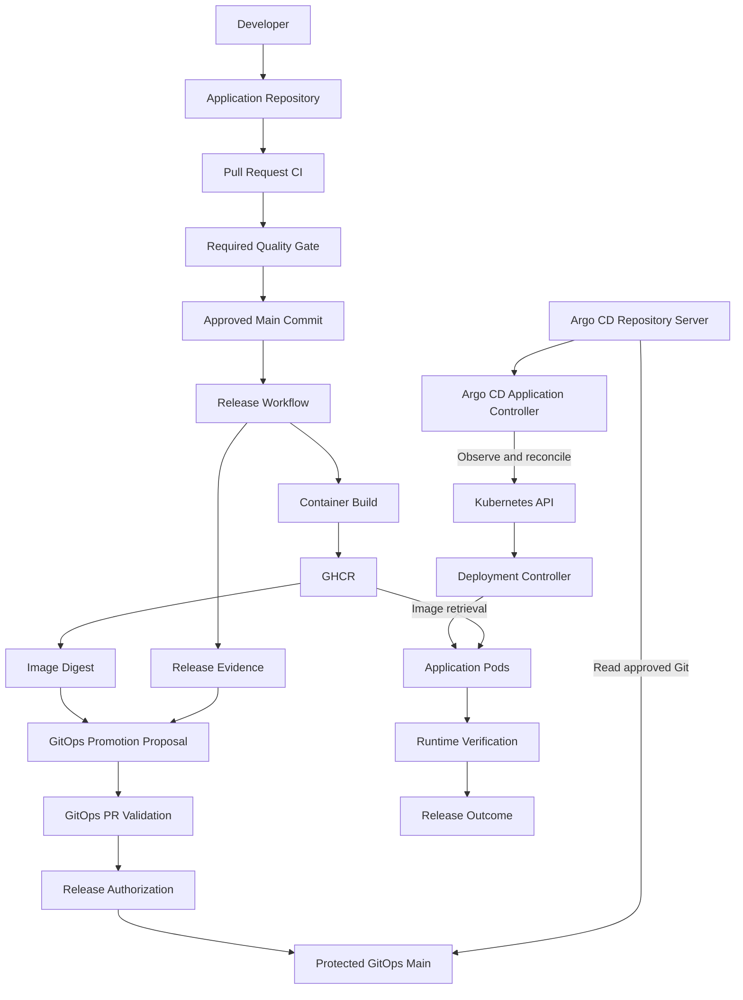

This is our complete system.

But notice that the diagram contains three different flows.

## 6.1 Artifact flow

```text
Source
   |
   v
Build
   |
   v
Container Registry
   |
   v
Kubernetes Runtime
```

This is how software content moves.

## 6.2 Authorization flow

```text
CI Validation
      |
      v
Approved Source
      |
      v
Release Candidate
      |
      v
GitOps Review
      |
      v
Approved Deployment Intent
```

This is how permission to deploy is established.

## 6.3 Reconciliation flow

```text
Git Desired State
        |
        v
Argo CD
        |
        v
Kubernetes
        |
        v
Observed State
```

This is how intended configuration becomes actual configuration.

### The fundamental lesson

> **Artifact distribution, release authorization, and deployment reconciliation are three different control flows.**

A mature delivery system coordinates them without confusing their responsibilities.

---

# 7. The Five Identities of a Software Release

We discussed these identities in earlier phases.

Now we will connect them into one complete chain.

Imagine production is running an application.

An incident occurs.

An engineer asks:

> What exactly is running, and how did it get here?

We need five identifiers.

## Identity 1 — Application source SHA

Example:

```text
APP_SHA=abc123...
```

Answers:

**Which source revision was selected?**

## Identity 2 — CI workflow run

Example:

```text
CI_RUN_ID=123456...
```

Answers:

**Which execution produced the artifact and its validation evidence?**

## Identity 3 — Container image digest

Example:

```text
IMAGE_DIGEST=sha256:<64-character-digest>
```

Answers:

**Which published container artifact was selected?**

## Identity 4 — GitOps commit SHA

Example:

```text
GITOPS_SHA=def456...
```

Answers:

**Which approved deployment configuration was selected?**

## Identity 5 — Observed runtime image identity

The Kubernetes workload exposes:

- The configured container image reference.
- Pod-level image references.
- Runtime-reported image IDs.

Answers:

**Which image reference was configured, and what did the runtime report using?**

### Identity relationship

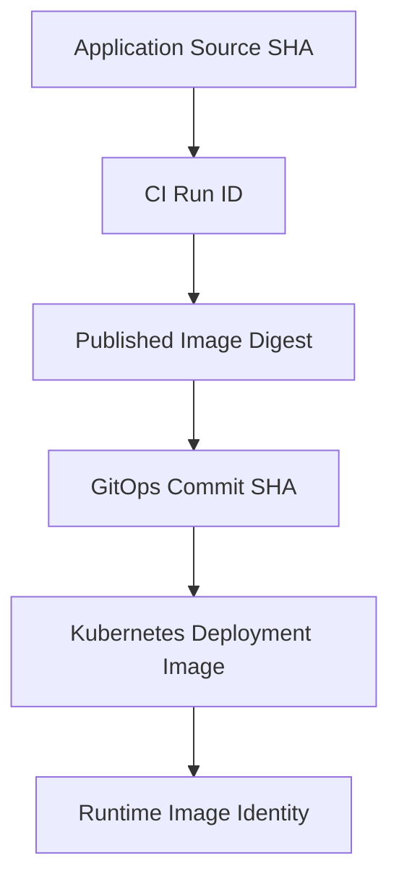

## 7.1 Important container image nuance

A registry image reference might identify a multi-platform image index.

For example:

```text
ghcr.io/example/api@sha256:INDEX_DIGEST
```

After Kubernetes selects an image for `linux/amd64`, the runtime may report a platform-specific image manifest digest.

Therefore, **do not assume that every runtime `imageID` string must equal the top-level published index digest**.

For this lab, we will:

1. Verify the approved digest in GitOps.
2. Verify the same image reference in the Kubernetes Deployment.
3. Inspect the Pod's actual image reference and runtime-reported identity.
4. Verify the application is running and behaving correctly.

This avoids confusing two legitimate container-image identities.

---

# 8. Design a Delivery State Machine

A complete software delivery system does not move directly from source code to production.

It passes through stages.

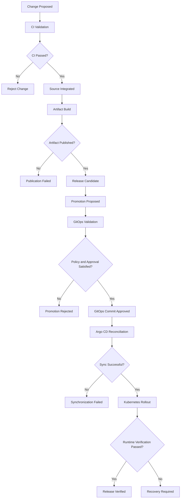

This is a simplified logical model, not a claim that one central service literally owns every transition.

Different systems observe and enforce different parts of it.

### Why model the lifecycle explicitly?

Because it lets us define what **must not happen**.

For example:

```text
CI Failed
    ->
Release Published as Approved
```

should be prohibited.

Similarly:

```text
GitOps PR Opened
    ->
Production Automatically Deployed
```

should not occur unless the applicable authorization policy has been satisfied.

---

# 9. The Key Architecture Decision: How Does the Image Digest Reach GitOps?

We have reached the most important integration boundary of Phase 12.

GitHub Actions publishes a container image.

It obtains:

```text
ghcr.io/example/ci-artifact-lab@sha256:<digest>
```

The GitOps repository needs that digest.

How should we transfer it?

We have several options.

## Option A — Manual release proposal

The publishing workflow records the digest.

An authorized engineer creates a GitOps pull request selecting that digest.

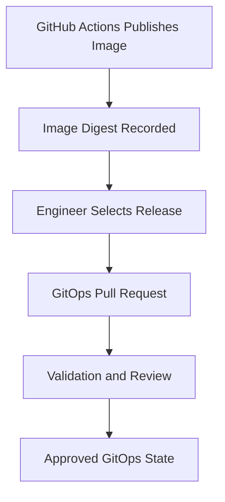

Advantages:

- Simple to understand.
- No cross-repository automation credential.
- Clear approval boundary.
- Easy to audit.

Trade-off:

- Requires an operator to initiate the promotion.

**We will use this as the main learning lab.**

---

## Option B — Automated GitOps pull-request creation

The application release workflow:

1. Publishes an image.
2. Captures the digest.
3. Authenticates to the GitOps repository.
4. Creates a release branch.
5. Updates the relevant overlay.
6. Opens a pull request.

The pull request still requires validation and authorization.

This reduces manual release preparation without eliminating review.

### Security consideration

A workflow's `GITHUB_TOKEN` is normally limited to its own repository.

It should not be assumed to have permission to write another repository.

GitHub recommends using a suitably permissioned GitHub App installation token when a workflow must access another repository. ([GitHub documentation](https://docs.github.com/en/actions/concepts/security/github_token), [GitHub App authentication](https://docs.github.com/en/apps/creating-github-apps/authenticating-with-a-github-app))

We will discuss this design later in the phase.

---

## Option C — Automatic image-update controller

Another approach is to use an image-update mechanism that observes published image versions and proposes or updates deployment configuration.

For example, Argo CD Image Updater supports automated image-selection workflows.

However, selecting the newest available image is not necessarily the same as selecting the newest **authorized release**.

An image-update controller must still fit the release policy.

### Our decision

For Phase 12:

**Use explicit digest-based promotion through a reviewed GitOps pull request.**

Why?

Because it makes the artifact handoff and release authorization boundary visible.

After understanding this design, automating PR creation is straightforward.

---

# 10. Practical Lab 12 — From Application Commit to Running Kubernetes Workload

Now we will implement the complete flow.

Unlike the earlier labs, this exercise crosses multiple systems.

We will observe each boundary and preserve evidence.

## 10.1 Prerequisites from previous phases

You should have:

| Component | Created in | Expected state |
|---|---|---|
| Node.js application | Phase 07 | Runs locally |
| Application CI | Phase 08 | Validates pull requests |
| Image publishing workflow | Phase 08 | Publishes an image on main-branch push |
| GitOps repository | Phase 09 | Contains environment overlays |
| GitOps validation workflow | Phase 10 | Validates proposed configuration |
| kind cluster | Phase 11 | Available locally |
| Argo CD | Phase 11 | Installed and operating |
| Argo CD Application | Phase 11 | Tracks the development overlay |

Our lab will deploy **development only**.

Use this architecture:

```text
Application Repository:
ci-artifact-lab

GitOps Repository:
release-gitops-lab

Argo CD Application:
ecommerce-dev

Kubernetes Cluster:
kind-argocd-lab

Kubernetes Namespace:
ecommerce-dev
```

## 10.2 Final project structure

```text
Desktop/
│
├── ci-artifact-lab/
│   ├── src/
│   ├── tests/
│   ├── Dockerfile
│   ├── package.json
│   ├── package-lock.json
│   ├── scripts/
│   │   └── smoke.sh
│   │
│   └── .github/workflows/
│       ├── reusable-validate.yml
│       ├── ci.yml
│       └── release.yml
│
└── release-gitops-lab/
    ├── applications/
    │   └── ecommerce-api/
    │       ├── base/
    │       └── overlays/
    │           ├── dev/
    │           ├── staging/
    │           └── production/
    │
    ├── argocd/bootstrap/
    │   ├── dev-project.yaml
    │   └── dev-app.yaml
    │
    ├── scripts/
    │   ├── promote.py
    │   ├── validate_gitops.py
    │   └── verify_delivery.sh
    │
    ├── releases/candidates/
    │
    └── .github/workflows/
        └── validate-gitops.yml
```

There is one important architectural separation:

**The application repository builds images.**

**The GitOps repository determines which image the cluster should run.**

---

# 11. Lab Part A — Verify the Existing System Before Making Changes

A systems engineer should verify the current state before attempting a transition.

We will perform a preflight check.

## 11.1 Application repository

Open the application repository:

```bash
cd ~/Desktop/ci-artifact-lab
```

Adjust the path if your repositories are elsewhere.

Check:

```bash
git status --short
```

Then:

```bash
git remote -v
```

And:

```bash
ls .github/workflows/
```

You should see the expected CI and publishing workflows.

## 11.2 GitOps repository

Open the GitOps repository:

```bash
cd ~/Desktop/release-gitops-lab
```

Check:

```bash
git status --short
```

Then:

```bash
git remote -v
```

Render development configuration:

```bash
kubectl kustomize \
  applications/ecommerce-api/overlays/dev
```

If you completed the Phase 10 validator:

```bash
python scripts/validate_gitops.py
```

## 11.3 Local Kubernetes cluster

Verify:

```bash
kubectl config current-context
```

Expected:

```text
kind-argocd-lab
```

Check the nodes:

```bash
kubectl get nodes
```

Check Argo CD:

```bash
kubectl get pods -n argocd
```

Check the Application:

```bash
kubectl get application ecommerce-dev \
  -n argocd
```

Check the existing workload:

```bash
kubectl get deployment ecommerce-api \
  -n ecommerce-dev
```

### If you previously deleted the kind cluster

Recreate it and repeat the Phase 11 bootstrap before continuing.

Do not substitute an existing production or AKS context.

### Engineering principle

> **Before changing desired state, establish the identity and health of the system you intend to change.**

This helps distinguish pre-existing failures from failures introduced by the release.

---

# 12. Lab Part B — Establish the Current Deployment Baseline

Before deploying a new image, record the existing one.

Run:

```bash
kubectl get deployment ecommerce-api \
  -n ecommerce-dev \
  -o jsonpath='{.spec.template.spec.containers[0].image}{"\n"}'
```

The output should resemble:

```text
ghcr.io/OWNER/ci-artifact-lab@sha256:<old-digest>
```

Save the reference:

```bash
export PREVIOUS_IMAGE="$(
  kubectl get deployment ecommerce-api \
    -n ecommerce-dev \
    -o jsonpath='{.spec.template.spec.containers[0].image}'
)"
```

Display it:

```bash
echo "$PREVIOUS_IMAGE"
```

Now inspect the Argo CD Application:

```bash
kubectl get application ecommerce-dev \
  -n argocd \
  -o jsonpath='{.status.sync.revision}{"\n"}'
```

Record that GitOps revision as well.

## 12.1 Why establish a baseline?

Because if the new release fails, we need to know:

- Which artifact was previously selected.
- Which configuration revision selected it.
- Whether the previous system was healthy.
- Whether the previous version remains compatible with the current environment.

This is the beginning of a recovery plan.

### Important limitation

A recorded image reference alone does not prove that the previous release can be restored safely.

Database and external-state compatibility still matter.

---

# 13. Lab Part C — Introduce a Real Application Change

Now we need a new application version.

We want a small, observable change that:

1. Does not break existing tests.
2. Does not require a database migration.
3. Produces a new container image.
4. Can be verified after deployment.

Open:

```text
ci-artifact-lab/src/server.ts
```

Add an endpoint:

```typescript
app.get("/delivery", (_req, res) => {
  res.status(200).json({
    service: "ecommerce-api",
    delivery: "gitops",
    phase: 12
  });
});
```

Add it before:

```typescript
app.listen(...)
```

## 13.1 Why choose this change?

Because it gives us a clear runtime test.

Before deployment:

```text
GET /delivery
```

The old image may not have this endpoint.

After deployment:

```json
{
  "service": "ecommerce-api",
  "delivery": "gitops",
  "phase": 12
}
```

This creates an observable difference between the old and new application versions.

We are not merely changing an image label.

We are changing application behavior.

---

# 14. Lab Part D — Validate the Change Locally

Run:

```bash
npm ci
```

Then:

```bash
npm run typecheck
```

Then:

```bash
npm run build
```

And:

```bash
npm test
```

Now build the container:

```bash
docker build \
  -t ci-artifact-lab:phase12 \
  .
```

Run the existing container smoke test:

```bash
bash scripts/smoke.sh \
  ci-artifact-lab:phase12
```

All checks should pass.

## 14.1 Add a test for the new endpoint

The existing smoke test validates `/health` and `/total`.

It does not validate `/delivery`.

We will extend the script so the new release has explicit acceptance criteria.

In `scripts/smoke.sh`, after the existing business endpoint verification succeeds and before its successful `exit 0`, add:

```bash
echo "Checking delivery endpoint..."

DELIVERY_RESPONSE="$(
  curl -fsS \
    "http://127.0.0.1:${PORT}/delivery"
)"

printf '%s\n' "$DELIVERY_RESPONSE" \
  | python3 -c '
import json
import sys

data = json.load(sys.stdin)

assert data["service"] == "ecommerce-api"
assert data["delivery"] == "gitops"
assert data["phase"] == 12
'
```

### Why use structured JSON validation?

Because merely checking whether an endpoint responds with HTTP 200 may not establish the expected response.

We want to verify a specific property.

The test now requires:

```text
HTTP Endpoint Available
         +
Expected Response Structure
         +
Expected Values
```

### What did we improve?

We transformed a feature requirement into a repeatable validation check.

That check will run against the container image during CI and after publication.

---

# 15. Lab Part E — Submit the Change Through CI

Create a branch:

```bash
git switch -c feature/delivery-endpoint
```

Stage the files:

```bash
git add src/server.ts scripts/smoke.sh
```

Commit:

```bash
git commit -m "feat: add delivery verification endpoint"
```

Push:

```bash
git push -u origin feature/delivery-endpoint
```

Open a pull request targeting `main`.

If GitHub CLI is configured:

```bash
gh pr create \
  --base main \
  --head feature/delivery-endpoint \
  --title "Add delivery verification endpoint" \
  --body "Adds a release-verification endpoint and extends container smoke testing."
```

## 15.1 Expected CI execution

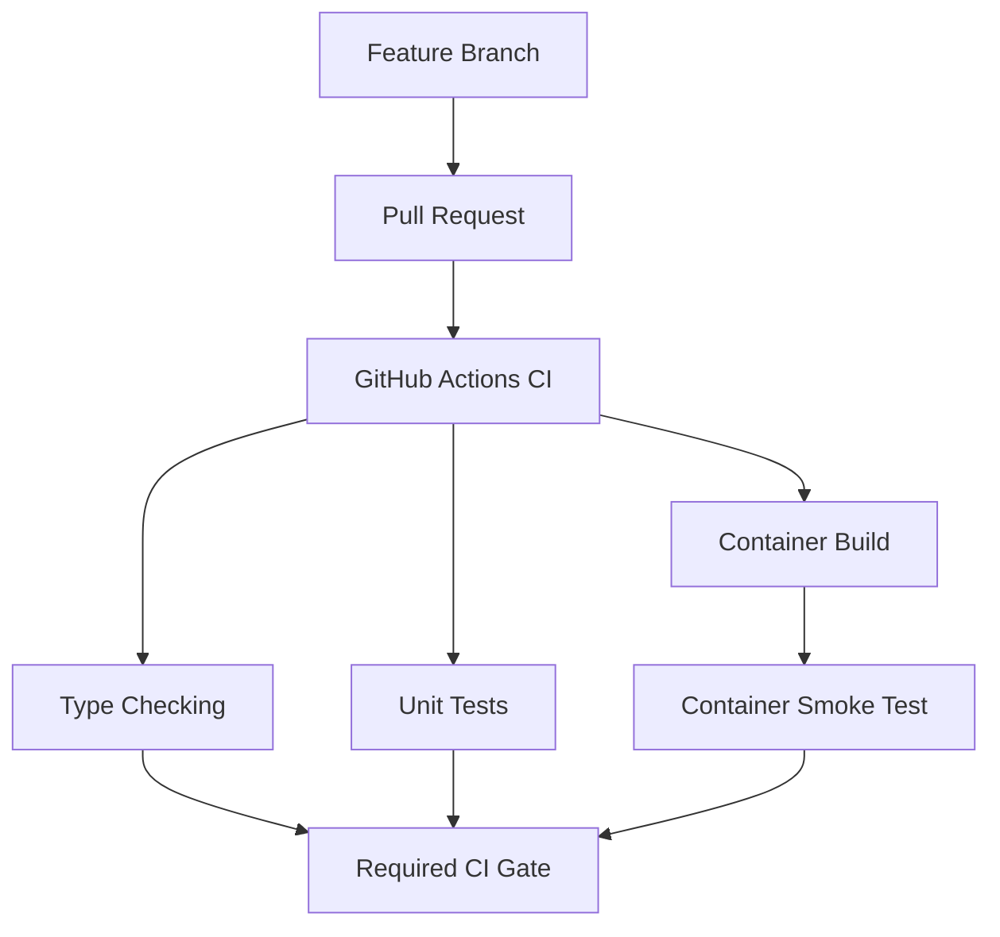

### What should you inspect?

Open the pull request's Checks section.

Verify:

- The expected workflow executed.
- The correct source revision was checked out.
- Type checking passed.
- Unit tests passed.
- The container built successfully.
- The new `/delivery` smoke test passed.
- The required final CI gate passed.

### What has not happened yet?

We have not published the release from `main`.

We have not selected the new image in GitOps.

We have not deployed the new version.

We have only validated a proposed source change.

---

# 16. Lab Part F — Merge and Publish the Release Artifact

Once the pull request satisfies your repository's rules, merge it.

The `main` push should trigger the release workflow from Phase 08.

Its logical behavior should be:

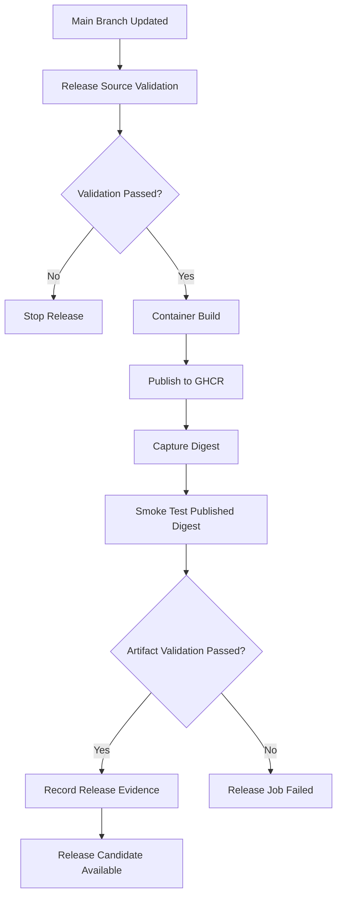

### Why validate the published digest?

Because a successful build is not enough.

We want evidence that the artifact actually published to the registry can be retrieved and executed.

### Important observation

The image is still only a **release candidate**.

Publication does not automatically authorize deployment.

---

# 17. Lab Part G — Improve the Release Workflow With Machine-Readable Evidence

In Phase 08, our release workflow recorded the image digest in a job summary.

That was useful for humans.

But now another part of our system needs that information.

We want an explicit data contract.

## 17.1 Define the release evidence format

Example:

```json
{
  "schema_version": 1,
  "application": "ci-artifact-lab",
  "source_sha": "abc123",
  "workflow_run_id": "123456",
  "workflow_run_attempt": "1",
  "workflow_url": "https://github.com/OWNER/ci-artifact-lab/actions/runs/123456",
  "image": "ghcr.io/OWNER/ci-artifact-lab@sha256:<digest>",
  "platform": "linux/amd64",
  "published_image_smoke_test": "passed"
}
```

The values above are illustrative.

The real workflow should populate them using the actual execution and publishing results.

### Why create a structured record?

Because the next system should not have to scrape arbitrary text from a CI log.

It should receive defined fields.

This is an integration contract.

---

# 18. Implement the Release Evidence Contract

Open:

```text
ci-artifact-lab/.github/workflows/release.yml
```

In the existing `publish` job, find the successful published-image smoke-test step.

In Phase 08, we used these step IDs:

```text
image

image-build
```

They expose:

```text
steps.image.outputs.name

steps.image-build.outputs.digest
```

**After the published-image smoke test**, add:

```yaml
      - name: Generate release evidence
        env:
          IMAGE_NAME: ${{ steps.image.outputs.name }}
          IMAGE_DIGEST: ${{ steps.image-build.outputs.digest }}
        run: |
          jq -n \
            --arg application "ci-artifact-lab" \
            --arg source_sha "$GITHUB_SHA" \
            --arg run_id "$GITHUB_RUN_ID" \
            --arg run_attempt "$GITHUB_RUN_ATTEMPT" \
            --arg workflow_url "$GITHUB_SERVER_URL/$GITHUB_REPOSITORY/actions/runs/$GITHUB_RUN_ID" \
            --arg image "$IMAGE_NAME@$IMAGE_DIGEST" \
            '{
              schema_version: 1,
              application: $application,
              source_sha: $source_sha,
              workflow_run_id: $run_id,
              workflow_run_attempt: $run_attempt,
              workflow_url: $workflow_url,
              image: $image,
              platform: "linux/amd64",
              published_image_smoke_test: "passed"
            }' > release-evidence.json

          jq -e '
            .schema_version == 1 and
            .application == "ci-artifact-lab" and
            (.image | test("@sha256:[0-9a-f]{64}$")) and
            .published_image_smoke_test == "passed"
          ' release-evidence.json

      - name: Preserve release evidence
        uses: actions/upload-artifact@v7
        with:
          name: release-evidence
          path: release-evidence.json
          if-no-files-found: error
          retention-days: 30
```

GitHub Actions supports uploading workflow artifacts to preserve files after the runner has finished. The official upload-artifact action has a v7 release. ([actions/upload-artifact](https://github.com/actions/upload-artifact/releases))

## 18.1 Understand the design

The publishing job already knows:

```text
Source SHA

Workflow Run ID

Published Image Digest
```

We transform those values into:

```text
release-evidence.json
```

Then preserve the file as a workflow artifact.

### Important distinction

The record is generated only after the published-image smoke test succeeds.

Therefore, a record reporting:

```text
published_image_smoke_test: passed
```

is associated with a successful execution of that step.

However, the JSON is still a claim generated by the workflow.

A production release policy should authenticate the source of evidence and verify relevant claims, rather than trusting any arbitrary JSON file submitted in a pull request.

### Build-once principle

This new step does not rebuild the image.

It records information about the image already published.

---

# 19. Make the Evidence Change Part of the Release

One important workflow detail:

**The workflow file containing the new evidence step must be present in the source revision that triggers the release.**

If the application pull request was already merged before you added the evidence step, that earlier workflow run will not retroactively gain the new behavior.

You have two reasonable options:

1. Include the evidence step in the same application pull request before merging.
2. Merge the evidence step as a separate change, then use the successful release workflow run created from the updated `main` revision.

For the cleanest Phase 12 lab, include this step before the application change is merged.

This ensures one successful release run produces the container image and its machine-readable evidence.

---

# 20. Lab Part H — Retrieve the Release Evidence

Now switch to your local terminal.

We will retrieve the output of the successful release workflow.

Set your application repository:

```bash
export APP_REPO="YOUR_OWNER/ci-artifact-lab"
```

List the recent release runs:

```bash
gh run list \
  --repo "$APP_REPO" \
  --workflow release.yml \
  --branch main \
  --limit 5
```

Identify the successful workflow run corresponding to the merged application change.

Set:

```bash
export RUN_ID="YOUR_SUCCESSFUL_RUN_ID"
```

Inspect the run:

```bash
gh run view "$RUN_ID" \
  --repo "$APP_REPO"
```

Check the machine-readable run status:

```bash
gh run view "$RUN_ID" \
  --repo "$APP_REPO" \
  --json conclusion,headSha,url
```

## 20.1 Download the artifact

Create a local evidence directory:

```bash
mkdir -p /tmp/phase12-release-evidence
```

Download:

```bash
gh run download "$RUN_ID" \
  --repo "$APP_REPO" \
  --name release-evidence \
  --dir /tmp/phase12-release-evidence
```

Inspect:

```bash
cat /tmp/phase12-release-evidence/release-evidence.json
```

If `jq` is installed:

```bash
jq . /tmp/phase12-release-evidence/release-evidence.json
```

### What have we done?

We have transferred the build system's recorded release information into the release-preparation process.

No Kubernetes resource has been changed.

---

# 21. Verify the Release Evidence Before Using It

This is a critical step.

We should not blindly trust a filename such as:

```text
release-evidence.json
```

First verify that the workflow actually succeeded.

```bash
gh run view "$RUN_ID" \
  --repo "$APP_REPO" \
  --json conclusion \
  --jq '.conclusion'
```

Expected:

```text
success
```

Then extract the source revision recorded in the artifact:

```bash
export APP_SHA="$(
  jq -r '.source_sha' \
    /tmp/phase12-release-evidence/release-evidence.json
)"
```

Get the workflow's actual source revision:

```bash
export RUN_SHA="$(
  gh run view "$RUN_ID" \
    --repo "$APP_REPO" \
    --json headSha \
    --jq '.headSha'
)"
```

Compare them:

```bash
test "$APP_SHA" = "$RUN_SHA" \
  && echo "Source revision matches workflow"
```

Now extract the image reference:

```bash
export IMAGE_REF="$(
  jq -r '.image' \
    /tmp/phase12-release-evidence/release-evidence.json
)"
```

Display:

```bash
echo "$IMAGE_REF"
```

Verify that it has an immutable digest:

```bash
[[ "$IMAGE_REF" =~ @sha256:[0-9a-f]{64}$ ]] \
  && echo "Image digest format valid"
```

Finally, inspect the published artifact:

```bash
docker buildx imagetools inspect "$IMAGE_REF"
```

This verifies that the registry can return the selected object using your current registry access.

For private GHCR images, appropriate authentication is required.

## 21.1 What have we established?

We have evidence that:

- A particular GitHub Actions run succeeded.
- The release record identifies the same source revision as that run.
- The record contains a digest-based image reference.
- The registry exposes the selected image to our current client.

### What haven't we established?

We have not yet verified that:

- The GitOps repository selected the artifact.
- Argo CD observed the new configuration.
- Kubernetes retrieved the image.
- The running application serves the new endpoint.

Those are later contracts.

---

# 22. Lab Part I — Prepare the GitOps Promotion

Now we have the release artifact.

We need to select it for development.

This must be a **GitOps configuration change**, not a direct Kubernetes update.

Open the GitOps repository:

```bash
cd ~/Desktop/release-gitops-lab
```

Fetch the latest authoritative configuration:

```bash
git switch main

git pull --ff-only origin main
```

Create a release branch:

```bash
git switch -c "release/dev-${RUN_ID}"
```

## 22.1 Extract the digest

The promotion script from Phase 09 expects the digest without the image repository name.

Extract it:

```bash
export IMAGE_DIGEST="${IMAGE_REF##*@}"
```

Inspect:

```bash
echo "$IMAGE_DIGEST"
```

Expected:

```text
sha256:<64-character-digest>
```

## 22.2 Verify the image repository

The Phase 09 promotion script changes the digest in the existing environment overlay.

It does not change the image repository.

Before promotion, inspect:

```bash
cat applications/ecommerce-api/overlays/dev/kustomization.yaml
```

The `newName` value must identify the repository that contains the published application image.

For example:

```yaml
images:
  - name: app-image-placeholder
    newName: ghcr.io/YOUR_OWNER/ci-artifact-lab
    digest: sha256:<previous-digest>
```

The newly selected artifact should come from that intended repository.

Don't accept an unexpected image repository simply because it contains a syntactically valid digest.

---

# 23. Lab Part J — Update Development's Desired State

Now run the promotion script:

```bash
python3 scripts/promote.py \
  dev \
  "$IMAGE_DIGEST"
```

Expected conceptual output:

```text
dev: selected sha256:<new-digest>

Configuration prepared.
Review and authorization are still required.
```

Inspect the change:

```bash
git diff
```

Ideally, the change should be small.

For example:

```diff
 images:
   - name: app-image-placeholder
     newName: ghcr.io/owner/ci-artifact-lab
-    digest: sha256:OLD_DIGEST
+    digest: sha256:NEW_DIGEST
```

The source image has not been rebuilt.

The registry has not received another image.

Only the selected development artifact has changed.

### What does this represent?

A release decision:

> Development should run the previously published image identified by this digest.

It does **not** represent a direct deployment command.

---

# 24. Lab Part K — Attach Release Evidence to the Promotion

We want the GitOps pull request to contain useful release information.

Create the directory:

```bash
mkdir -p releases/candidates
```

Copy the evidence:

```bash
cp \
  /tmp/phase12-release-evidence/release-evidence.json \
  "releases/candidates/${RUN_ID}.json"
```

Inspect:

```bash
jq . "releases/candidates/${RUN_ID}.json"
```

### Why store this information?

It provides convenient context for reviewers.

The pull request can show:

```text
Selected Source SHA

CI Workflow Run

Published Image Digest

Artifact Smoke-Test Result
```

But remember an important security principle:

**A copied release record is not an independently authenticated attestation.**

A contributor with permission to edit the pull request could alter its contents.

Therefore, the reviewer or an independent policy checker should verify the source workflow run and registry identity rather than trusting the JSON merely because it exists.

For our learning project, we performed those checks manually.

In a higher-assurance production system, automated verification would be appropriate.

---

# 25. Lab Part L — Validate the Promotion

Now run the Phase 10 GitOps validator:

```bash
python scripts/validate_gitops.py
```

Expected:

```text
All GitOps configuration checks passed
```

Render the development overlay:

```bash
kubectl kustomize \
  applications/ecommerce-api/overlays/dev
```

Check the selected image:

```bash
kubectl kustomize \
  applications/ecommerce-api/overlays/dev \
  | grep 'image:'
```

Expected:

```text
image: ghcr.io/YOUR_OWNER/ci-artifact-lab@sha256:<new-digest>
```

## 25.1 Why validate again?

Because this is a new system boundary.

CI validated the application.

Now GitOps validation checks deployment configuration.

The two forms of validation are not interchangeable.

### Application CI asks:

```text
Can we build and validate this application?
```

### GitOps validation asks:

```text
Does the proposed deployment configuration satisfy our configuration policy?
```

### Kubernetes verification will later ask:

```text
Did the requested workload actually become available?
```

---

# 26. Lab Part M — Submit the GitOps Pull Request

Commit the proposed configuration change:

```bash
git add \
  applications/ecommerce-api/overlays/dev/ \
  releases/candidates/
```

Commit:

```bash
git commit -m "release(dev): promote validated application artifact"
```

Push:

```bash
git push -u origin "release/dev-${RUN_ID}"
```

Create the pull request:

```bash
gh pr create \
  --base main \
  --head "release/dev-${RUN_ID}" \
  --title "Promote application artifact to development" \
  --body "Promotes the published image digest from a successful application release workflow. Review the release evidence, GitOps validation, and exact image reference before approval."
```

## 26.1 Expected GitOps validation

The GitOps repository should run:

```text
Validate GitOps Configuration
```

The job should render and validate the environment overlays.

If you configured required checks in Phase 10, the pull request must satisfy those checks before it can merge.

### Important limitation

The Phase 10 validator does not independently authenticate the CI evidence or query the registry.

It checks the configured image syntax and selected Kubernetes resource properties.

Our manual evidence verification is an additional release-preparation step.

A production system should make the required evidence checks enforceable rather than rely solely on the operator remembering them.

---

# 27. Lab Part N — Authorize the GitOps Change

We now reach the most important authorization boundary.

The application image exists.

The GitOps configuration is valid.

But neither fact alone grants deployment authority.

The pull request must follow the configured repository policy.

For example:

```text
GitOps Pull Request
        |
        v
Configuration Validation
        |
        v
Required Review
        |
        v
Approved Merge Into main
```

### What should a reviewer inspect?

| Question | Evidence |
|---|---|
| Is the artifact immutable? | Digest-based image reference |
| Does the artifact exist? | GHCR inspection |
| Was the source validated? | Successful CI run |
| Was the published image smoke-tested? | Release workflow result |
| Is the selected repository correct? | GitOps overlay |
| Does the configuration render? | GitOps validation |
| Is the target development? | Changed overlay path |
| Are unrelated resources changing? | Pull-request diff |

GitHub supports required pull requests and required status checks through branch protections and rulesets. Those controls must be configured; merely opening a pull request does not enforce approval. ([GitHub rulesets documentation](https://docs.github.com/en/repositories/configuring-branches-and-merges-in-your-repository/managing-rulesets/available-rules-for-rulesets))

Once the applicable policy is satisfied, merge the pull request.

---

# 28. Lab Part O — Record the Approved GitOps Revision

After merging, update your local GitOps repository:

```bash
git switch main

git pull --ff-only origin main
```

Now record the exact revision:

```bash
export GITOPS_SHA="$(git rev-parse HEAD)"
```

Print:

```bash
echo "$GITOPS_SHA"
```

You now have three important identities:

```text
Application Source SHA:
APP_SHA
```

```text
Published Artifact:
IMAGE_REF
```

```text
Approved GitOps Revision:
GITOPS_SHA
```

### The traceability chain

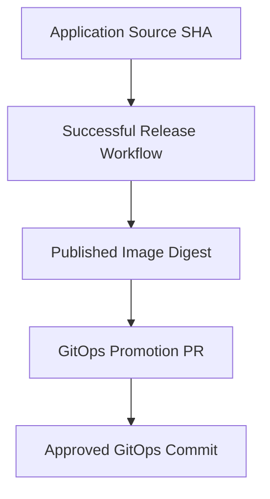

The next task is to prove that Argo CD observed the approved revision.

### Why is this necessary?

Because a merged GitOps pull request only establishes a change to Git.

It does not prove that the local cluster has processed the change.

---

# 29. Lab Part P — Observe Argo CD's Response

Remember our Argo CD Application from Phase 11:

```text
Application:
ecommerce-dev
```

It tracks:

```text
Repository:
release-gitops-lab

Revision:
main

Path:
applications/ecommerce-api/overlays/dev
```

We enabled:

```yaml
syncPolicy:
  automated:
    enabled: true
    prune: false
    selfHeal: true
```

Therefore, Argo CD should observe the updated `main` branch and attempt synchronization.

## 29.1 What happens internally?

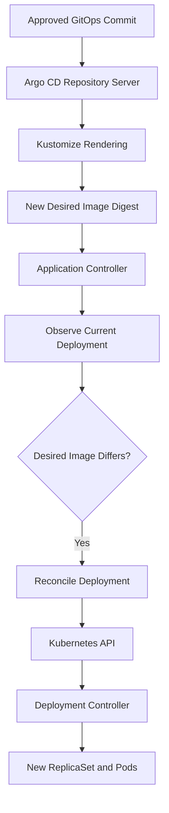

Argo CD can discover repository changes through periodic polling. A configured Git webhook can reduce the delay between a Git update and refresh, but is not required for the local lab. ([Argo CD webhook documentation](https://argo-cd.readthedocs.io/en/stable/operator-manual/webhook/))

### Important distinction

**Argo CD does not require the GitHub Actions runner to remain alive.**

The deployment controller independently reads Git.

That is one of the architectural benefits of pull-based GitOps.

---

# 30. Lab Part Q — Verify Argo CD Processed the Correct Git Revision

This is a subtle but critical verification step.

A common mistake is to check only:

```text
Argo CD:
Synced
```

Why is that insufficient?

Because the controller may still be reporting status for the previous configuration revision.

We must verify which Git revision it processed.

## 30.1 Inspect the observed revision

Run:

```bash
kubectl get application ecommerce-dev \
  -n argocd \
  -o jsonpath='{.status.sync.revision}{"\n"}'
```

Compare that value with:

```bash
echo "$GITOPS_SHA"
```

For our single-source Application tracking `main`, these should match after Argo CD has refreshed the new revision.

## 30.2 Inspect synchronization status

Run:

```bash
kubectl get application ecommerce-dev \
  -n argocd \
  -o jsonpath='{.status.sync.status}{"\n"}'
```

Expected after successful synchronization:

```text
Synced
```

## 30.3 Inspect health

Run:

```bash
kubectl get application ecommerce-dev \
  -n argocd \
  -o jsonpath='{.status.health.status}{"\n"}'
```

Expected after a successful rollout and health evaluation:

```text
Healthy
```

### Our acceptance condition

```text
Observed GitOps Revision
            =
Approved GitOps Revision
```

And:

```text
Sync Status = Synced
```

And:

```text
Resource Health = Healthy
```

These three conditions give us stronger evidence than a green UI indicator alone.

But we still need to inspect Kubernetes and application behavior.

---

# 31. Lab Part R — Verify Kubernetes Selected the Correct Image

First, inspect the Deployment's configured image:

```bash
kubectl get deployment ecommerce-api \
  -n ecommerce-dev \
  -o jsonpath='{.spec.template.spec.containers[0].image}{"\n"}'
```

Compare it with:

```bash
echo "$IMAGE_REF"
```

For our lab, the two strings should match.

Now inspect the rollout:

```bash
kubectl rollout status \
  deployment/ecommerce-api \
  -n ecommerce-dev \
  --timeout=180s
```

Inspect Pods:

```bash
kubectl get pods \
  -n ecommerce-dev \
  -o wide
```

Then inspect their image information:

```bash
kubectl get pods \
  -n ecommerce-dev \
  -o jsonpath='{range .items[*]}{.metadata.name}{" image="}{.spec.containers[0].image}{" imageID="}{.status.containerStatuses[0].imageID}{"\n"}{end}'
```

### What should you verify?

- The Deployment selects the intended digest-based reference.
- The active Pods are associated with the intended Deployment revision.
- The rollout completes.
- The Pods become ready.
- The runtime reports image identities.
- No unexpected previous-version Pods remain after the rollout completes.

### Important nuance

During a rolling update, old and new Pods may coexist temporarily.

Therefore, observing one Pod with the new image does not by itself prove rollout completion.

Use the Deployment rollout status and inspect the resulting workloads.

---

# 32. Lab Part S — Verify the New Application Behavior

Now test the new endpoint through Kubernetes.

Start port forwarding:

```bash
kubectl port-forward \
  -n ecommerce-dev \
  service/ecommerce-api \
  18081:80
```

Keep this running.

Open another terminal.

Run:

```bash
curl -fsS \
  http://127.0.0.1:18081/health
```

Expected:

```json
{
  "status": "ok"
}
```

Now run:

```bash
curl -fsS \
  http://127.0.0.1:18081/delivery
```

Expected:

```json
{
  "service": "ecommerce-api",
  "delivery": "gitops",
  "phase": 12
}
```

Test the existing business endpoint:

```bash
curl -fsS \
  "http://127.0.0.1:18081/total?subtotalCents=10000&taxBasisPoints=1800"
```

Expected:

```json
{
  "totalCents": 11800
}
```

## 32.1 What does this finally prove?

We have verified the complete path:

```text
Source Change
      |
      v
CI Validation
      |
      v
Published Image
      |
      v
GitOps Promotion
      |
      v
Argo CD Synchronization
      |
      v
Kubernetes Rollout
      |
      v
New Application Behavior
```

**This is our first complete integrated CI/CD lab.**

It is an end-to-end **development release**.

It is not proof of production readiness.

---

# 33. Lab Part T — Automate End-to-End Verification

So far, we have checked each component manually.

That is useful for learning.

But production engineers should also know how to turn verification requirements into a repeatable procedure.

Let's build a local verification script.

Its job will be to answer:

> Did Argo CD process the expected GitOps revision, did Kubernetes select the expected image, and does the application pass the required smoke tests?

## 33.1 Define the script contract

### Inputs

```text
Expected GitOps Commit SHA

Expected Container Image Reference
```

### Preconditions

```text
Correct Kubernetes Context

Argo CD Application Exists

Target Namespace Exists
```

### Required evidence

```text
Observed GitOps SHA = Expected SHA

Argo CD Sync = Synced

Argo CD Health = Healthy

Deployment Image = Expected Image

Kubernetes Rollout = Successful

Application Smoke Tests = Passed
```

### Failure behavior

Return a nonzero exit code when any required condition is not satisfied.

This is a real validation contract.

---

# 34. Implement the Verification Script

In the GitOps repository, create:

```text
scripts/verify_delivery.sh
```

Add:

```bash
#!/usr/bin/env bash

set -euo pipefail

EXPECTED_GITOPS_SHA="${1:?Expected GitOps commit SHA}"
EXPECTED_IMAGE="${2:?Expected container image reference}"

APPLICATION="ecommerce-dev"
NAMESPACE="ecommerce-dev"

echo "========================================"
echo " Phase 12 - Delivery Verification"
echo "========================================"

echo "Expected GitOps SHA: $EXPECTED_GITOPS_SHA"
echo "Expected image: $EXPECTED_IMAGE"

# -------------------------------------------------
# 1. Protect against the wrong Kubernetes context
# -------------------------------------------------

CURRENT_CONTEXT="$(kubectl config current-context)"

if [ "$CURRENT_CONTEXT" != "kind-argocd-lab" ]; then
  echo "ERROR: Unexpected Kubernetes context"
  echo "Current context: $CURRENT_CONTEXT"
  exit 1
fi

echo "Kubernetes context verified"

# -------------------------------------------------
# 2. Wait for the intended GitOps revision
# -------------------------------------------------

echo "Checking Argo CD reconciliation..."

DELIVERY_READY=false

for attempt in $(seq 1 60); do

  OBSERVED_SHA="$(
    kubectl get application "$APPLICATION" \
      -n argocd \
      -o jsonpath='{.status.sync.revision}' \
      2>/dev/null || true
  )"

  SYNC_STATUS="$(
    kubectl get application "$APPLICATION" \
      -n argocd \
      -o jsonpath='{.status.sync.status}' \
      2>/dev/null || true
  )"

  HEALTH_STATUS="$(
    kubectl get application "$APPLICATION" \
      -n argocd \
      -o jsonpath='{.status.health.status}' \
      2>/dev/null || true
  )"

  ACTUAL_IMAGE="$(
    kubectl get deployment ecommerce-api \
      -n "$NAMESPACE" \
      -o jsonpath='{.spec.template.spec.containers[0].image}' \
      2>/dev/null || true
  )"

  echo "Attempt: $attempt"
  echo "GitOps revision: $OBSERVED_SHA"
  echo "Sync: $SYNC_STATUS"
  echo "Health: $HEALTH_STATUS"
  echo "Deployment image: $ACTUAL_IMAGE"

  if \
    [ "$OBSERVED_SHA" = "$EXPECTED_GITOPS_SHA" ] &&
    [ "$SYNC_STATUS" = "Synced" ] &&
    [ "$HEALTH_STATUS" = "Healthy" ] &&
    [ "$ACTUAL_IMAGE" = "$EXPECTED_IMAGE" ]; then

    DELIVERY_READY=true
    break
  fi

  sleep 5
done

if [ "$DELIVERY_READY" != "true" ]; then
  echo "ERROR: Expected Argo CD state was not reached"
  exit 1
fi

echo "Argo CD revision and resource state verified"

# -------------------------------------------------
# 3. Verify Kubernetes rollout
# -------------------------------------------------

kubectl rollout status \
  deployment/ecommerce-api \
  -n "$NAMESPACE" \
  --timeout=180s

echo "Kubernetes rollout verified"

# -------------------------------------------------
# 4. Check the application over a local port-forward
# -------------------------------------------------

FORWARD_LOG="$(mktemp)"

kubectl port-forward \
  -n "$NAMESPACE" \
  service/ecommerce-api \
  18082:80 \
  >"$FORWARD_LOG" 2>&1 &

FORWARD_PID=$!

cleanup() {
  kill "$FORWARD_PID" 2>/dev/null || true
  wait "$FORWARD_PID" 2>/dev/null || true
  rm -f "$FORWARD_LOG"
}

trap cleanup EXIT

echo "Checking HTTP connectivity..."

HTTP_READY=false

for attempt in $(seq 1 20); do
  if curl \
    --fail \
    --silent \
    --max-time 2 \
    http://127.0.0.1:18082/health \
    >/dev/null; then

    HTTP_READY=true
    break
  fi

  sleep 1
done

if [ "$HTTP_READY" != "true" ]; then
  echo "ERROR: Health endpoint unavailable"
  cat "$FORWARD_LOG"
  exit 1
fi

# -------------------------------------------------
# 5. Validate the new release behavior
# -------------------------------------------------

curl -fsS \
  http://127.0.0.1:18082/delivery \
  | python3 -c '
import json
import sys

data = json.load(sys.stdin)

assert data["service"] == "ecommerce-api"
assert data["delivery"] == "gitops"
assert data["phase"] == 12
'

echo "Delivery endpoint verified"

# -------------------------------------------------
# 6. Verify existing business behavior
# -------------------------------------------------

curl -fsS \
  "http://127.0.0.1:18082/total?subtotalCents=10000&taxBasisPoints=1800" \
  | python3 -c '
import json
import sys

data = json.load(sys.stdin)

assert data["totalCents"] == 11800
'

echo "Business endpoint verified"

echo "========================================"
echo " PASS - End-to-end delivery verified"
echo "========================================"
```

## 34.1 Run the script

Make it executable:

```bash
chmod +x scripts/verify_delivery.sh
```

Run:

```bash
./scripts/verify_delivery.sh \
  "$GITOPS_SHA" \
  "$IMAGE_REF"
```

If all required conditions are satisfied, the script should print:

```text
PASS - End-to-end delivery verified
```

If a condition fails, it should exit unsuccessfully.

### Important operational note

The script uses a fixed local port, `18082`.

Ensure that port is available before running it.

The script is deliberately restricted to:

```text
kind-argocd-lab
```

It is not a generic production deployment script.

---

# 35. Why This Verification Is Stronger Than `argocd app wait`

You may ask:

> Why not just run `argocd app wait ecommerce-dev --sync --health`?

That command is useful.

But consider this sequence.

### Time A

Argo CD has processed:

```text
GitOps Commit AAA
```

The Application is:

```text
Synced

Healthy
```

### Time B

A new release is merged:

```text
GitOps Commit BBB
```

### Time C

Before the controller processes the new commit, someone runs:

```bash
argocd app wait ecommerce-dev \
  --sync \
  --health
```

If the Application still reports the old observed revision as synchronized and healthy, those statuses alone can provide misleading confidence.

The key missing question is:

**Which desired-state revision did the controller evaluate?**

## 35.1 Our stronger condition

We require:

```text
Observed GitOps Revision = Expected Revision
```

And:

```text
Sync = Synced
```

And:

```text
Health = Healthy
```

And:

```text
Deployment Image = Expected Image
```

And:

```text
Application Smoke Tests = Passed
```

### The fundamental principle

> **A verification result is meaningful only when it is tied to the specific state transition we intended to verify.**

This is one of the most important system-design lessons in the course.

---

# 36. Capture the Delivery Evidence

Now imagine you want to demonstrate this project in your portfolio.

You should not rely only on a README statement such as:

> Implemented complete CI/CD with GitOps.

A stronger project provides reproducible evidence.

## 36.1 Create an evidence directory

In the GitOps repository:

```bash
mkdir -p evidence/phase-12
```

Record the expected identities:

```bash
{
  echo "Application source: $APP_SHA"
  echo "CI run: $RUN_ID"
  echo "Image: $IMAGE_REF"
  echo "GitOps revision: $GITOPS_SHA"
} > evidence/phase-12/release-identities.txt
```

Preserve the release record:

```bash
cp \
  "/tmp/phase12-release-evidence/release-evidence.json" \
  evidence/phase-12/
```

## 36.2 Preserve Argo CD state

```bash
kubectl get application ecommerce-dev \
  -n argocd \
  -o yaml \
  > evidence/phase-12/argocd-application.yaml
```

## 36.3 Preserve Kubernetes configuration

```bash
kubectl get deployment ecommerce-api \
  -n ecommerce-dev \
  -o yaml \
  > evidence/phase-12/kubernetes-deployment.yaml
```

## 36.4 Preserve Pod state

```bash
kubectl get pods \
  -n ecommerce-dev \
  -o wide \
  > evidence/phase-12/pods.txt
```

## 36.5 Preserve the rendered desired state

```bash
kubectl kustomize \
  applications/ecommerce-api/overlays/dev \
  > evidence/phase-12/rendered-dev.yaml
```

### Important security warning

Review evidence files before committing or sharing them.

Kubernetes metadata, annotations, environment configuration, and logs may contain internal information.

Never publish secrets, credentials, authentication tokens, or sensitive production data as portfolio evidence.

For this public demonstration project, use only non-sensitive local-lab information.

---

# 37. Screenshot Evidence for a Resume-Ready Project

For this lab, useful screenshots include:

| Screenshot | What it demonstrates |
|---|---|
| Application pull request | Source-change review and CI results |
| Required CI gate | Enforcement of configured validation |
| Successful release workflow | Main-branch artifact publishing |
| GHCR image digest | Immutable artifact identity |
| Release evidence JSON | Source-to-artifact traceability |
| GitOps promotion PR | Controlled deployment-intent change |
| GitOps validation checks | Desired-state policy enforcement |
| Argo CD Application | Reconciliation and observed revision |
| Kubernetes Deployment and Pods | Actual workload state |
| `/delivery` endpoint response | Running application behavior |
| Recovery or drift experiment | Control-loop behavior under abnormal conditions |

### What makes these screenshots valuable?

Together, they show the boundaries of the complete system.

They are stronger evidence than a screenshot of a single green CI workflow.

### Recommended evidence structure

```text
docs/
└── evidence/
    └── phase-12/
        ├── 01-application-pr.png
        ├── 02-ci-gate.png
        ├── 03-release-workflow.png
        ├── 04-ghcr-digest.png
        ├── 05-gitops-promotion-pr.png
        ├── 06-gitops-validation.png
        ├── 07-argocd-application.png
        ├── 08-kubernetes-workloads.png
        ├── 09-application-smoke-test.png
        └── 10-reconciliation-experiment.png
```

These are recommended filenames, not evidence that has already been collected.

### Engineering lesson

**Good technical documentation demonstrates cause, transition, and observed effect—not just tool configuration.**

---

# 38. Optional Advanced Integration — Automatically Create GitOps Promotion PRs

Our base lab required an engineer to initiate the GitOps promotion.

That is intentional.

The release authorization boundary remains visible.

But suppose we want to automate the repetitive work.

The desired automation is:

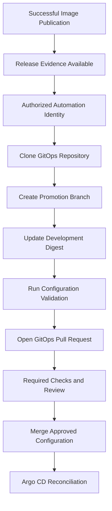

Notice that automation prepares the change.

It does not bypass review.

## 38.1 The cross-repository authentication problem

Our application workflow runs in:

```text
ci-artifact-lab
```

But the target repository is:

```text
release-gitops-lab
```

The built-in `GITHUB_TOKEN` is normally scoped to the workflow repository.

Therefore, this token should not be assumed to have Git write access to the separate GitOps repository.

GitHub supports creating short-lived GitHub App installation tokens for workflows that require access to another repository. ([GitHub App authentication guide](https://docs.github.com/en/apps/creating-github-apps/authenticating-with-a-github-app/making-authenticated-api-requests-with-a-github-app-in-a-github-actions-workflow))

## 38.2 Recommended design

Create a dedicated GitHub App whose installation is restricted to the GitOps repository.

Grant only the permissions it needs, such as:

```text
Repository Contents:
Read and write
```

```text
Pull Requests:
Read and write
```

Store its authentication material securely.

Use a short-lived installation token to:

1. Create a release branch.
2. Commit the image digest change.
3. Open a pull request.

The GitOps repository's branch protection should still require the configured validation and review.

### Why not give CI unrestricted GitOps write access?

Because the application build system and production deployment authority are separate trust domains.

The release automation should be able to **propose** changes without automatically authorizing arbitrary production modifications.

## 38.3 What automation should not do

Avoid a workflow that blindly executes:

```text
Image Published
      |
      v
Direct Push to Production GitOps Main
      |
      v
Automatic Deployment
```

Unless the organization has deliberately designed and authorized a Continuous Deployment policy with appropriate verification and controls.

For our course, the preferred pattern is:

**Automated proposal, enforced validation, controlled merge, automatic reconciliation.**

---

# 39. A Subtle Security Problem: The Release Evidence May Be Attacker-Controlled

Imagine the release workflow produces:

```json
{
  "image": "ghcr.io/example/api@sha256:...",
  "source_sha": "abc123",
  "status": "passed"
}
```

The promotion workflow reads the JSON.

Should it immediately deploy the image?

Not necessarily.

Ask:

1. Which workflow produced the record?
2. Was the producing source revision approved?
3. Did the workflow complete successfully?
4. Was the artifact published by the expected identity?
5. Does the digest identify the intended registry object?
6. Was the record altered during transfer?
7. Does the promotion policy trust the workflow that produced it?

### Why does this matter?

Because an attacker may attempt to cross a trust boundary by providing apparently valid data to a privileged workflow.

This is especially important when using events such as `workflow_run`, where a privileged workflow may consume artifacts created by a less-trusted workflow.

### Better principle

> **Promotion authorization should rely on authenticated execution identity and verified artifact information, not merely fields inside a file.**

For a production system, you can strengthen this with:

- GitHub Actions workflow identity.
- Trusted source revision verification.
- Container image provenance.
- Authenticated attestations.
- Registry verification.
- Explicit release policy.

We will explore these controls further in Phase 14 — CI/CD Security.

---

# 40. Failure Engineering — Test the Boundaries, Not Just the Happy Path

A delivery system is not reliable merely because one release succeeds.

We need to understand how it behaves when something fails.

We will now investigate failures at different stages.

The goal is to answer:

**Where should the failure be detected, and which downstream operations should be prevented?**

---

# 41. Failure Experiment 1 — Source Validation Fails

Modify the application calculation.

For example, intentionally change the pricing function so that an existing unit test fails.

Open a pull request.

### Expected results

| Stage | Expected outcome |
|---|---|
| Git push | Succeeds |
| Pull-request CI | Starts |
| Type checking | May pass |
| Unit tests | Fail |
| Required CI gate | Fails |
| Authorized merge | Blocked when enforcement is configured |
| Main-branch release publishing | Not triggered by the rejected PR |
| GitOps promotion | No new approved artifact to promote |

### What did this experiment test?

The boundary between:

```text
Proposed Source
      |
      v
Approved Source
```

### Important insight

**CI failure should prevent the invalid source change from entering the normal release path.**

The GitOps controller should not need to discover this application-level defect.

That was the responsibility of earlier validation.

---

# 42. Failure Experiment 2 — Image Publication Fails

Now imagine the source passes validation, but GHCR rejects the push.

Possible causes:

- Publishing permission denied.
- Registry unavailable.
- Incorrect repository or package settings.
- Authentication failure.

### Expected behavior

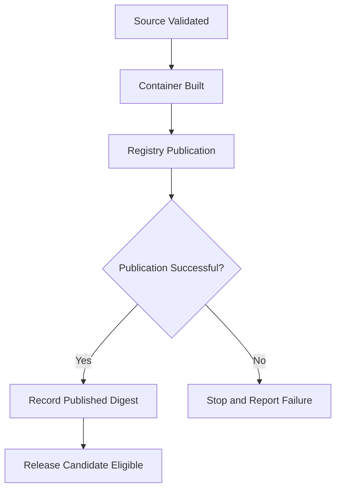

### What should not happen?

The workflow should not invent an image digest.

It should not record the release as successfully published.

It should not propose a deployment using an artifact that may not exist.

### Engineering lesson

**Every downstream consumer must require the outputs of successful upstream operations.**

---

# 43. Failure Experiment 3 — GitOps Selects a Nonexistent Digest

Now consider an important integration failure.

Suppose the image reference is:

```text
ghcr.io/example/ci-artifact-lab@sha256:ffffffffffffffffffffffffffffffffffffffffffffffffffffffffffffffff
```

The digest has the correct syntax.

But the corresponding object may not exist in the registry.

## 43.1 Detect it before deployment

Run:

```bash
docker buildx imagetools inspect \
  "ghcr.io/example/ci-artifact-lab@sha256:ffffffffffffffffffffffffffffffffffffffffffffffffffffffffffffffff"
```

Unless that exact object exists and is accessible, the lookup fails.

### What does this reveal?

Our GitOps static validator from Phase 10 checks digest syntax.

It does not prove artifact existence.

These are different validations.

```text
Valid Digest Format
        !=
Existing Registry Artifact
```

## 43.2 What if the bad reference reaches Kubernetes?

If the reference passes GitOps review and is synchronized, the Kubernetes node may fail to retrieve the image.

Possible Pod states include:

```text
ErrImagePull

ImagePullBackOff
```

Argo CD may report that the configuration is synchronized while resource health is still progressing or degraded.

### What should the release architecture do?

Ideally, a pre-promotion check verifies that the selected artifact exists and is available to the intended runtime identity.

This reduces the chance of reaching the Kubernetes image-pull boundary with an invalid release reference.

### Engineering lesson

> **An integration contract should be validated as early as practical by a component capable of checking the real dependency.**

---

# 44. Failure Experiment 4 — GitOps Validation Fails

Suppose a contributor changes the development overlay from:

```yaml
images:
  - name: app-image-placeholder
    newName: ghcr.io/example/ci-artifact-lab
    digest: sha256:aaaaaaaaaaaaaaaaaaaaaaaaaaaaaaaaaaaaaaaaaaaaaaaaaaaaaaaaaaaaaaaa
```

To:

```yaml
images:
  - name: app-image-placeholder
    newName: ghcr.io/example/ci-artifact-lab
    newTag: latest
```

Our Phase 10 policy requires immutable image references.

The GitOps validation should fail.

### Expected flow

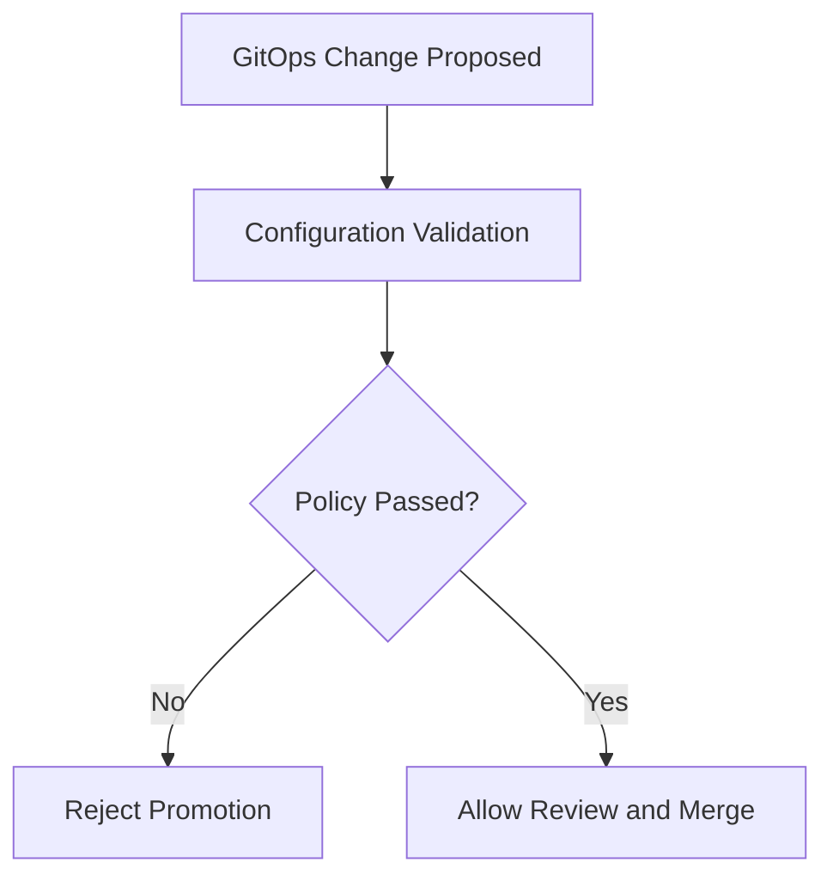

### What did we protect?

The boundary between:

```text
Proposed Deployment Intent
```

And:

```text
Approved Deployment Intent
```

### Important qualification

GitHub branch protection must actually require the relevant validation check.

A failing workflow does not necessarily block merging if repository policies do not enforce that result.

---

# 45. Failure Experiment 5 — A Required Check Is Skipped

Suppose a GitHub Actions workflow has:

```text
Typecheck:
Passed
```

```text
Integration Tests:
Skipped
```

```text
Final Quality Gate:
Passed
```

Would this be acceptable if integration testing is mandatory?

No.

A missing test result is not successful test evidence.

However, GitHub's required-status-check mechanisms may accept conclusions such as `skipped` or `neutral` in certain contexts. A final required gate should therefore explicitly evaluate the results of mandatory prerequisite jobs. ([GitHub status-check documentation](https://docs.github.com/en/pull-requests/reference/status-checks))

### Safer policy

```text
Required Test 1 = success

Required Test 2 = success

Required Test 3 = success
```

Only then should the final required gate pass.

### Important distinction

A job being marked successful is not the same as all intended validations having executed.

### Engineering principle

**Define the acceptance condition in terms of required evidence, not merely the absence of visible errors.**

---

# 46. Failure Experiment 6 — Argo CD Synchronizes, but the Application Fails

Imagine the GitOps pull request merges successfully.

Argo CD observes the new desired image.

Kubernetes accepts the Deployment update.

But the container crashes.

### Possible state

```text
GitOps Revision:
Correct
```

```text
Argo CD Sync:
Synced
```

```text
Kubernetes:
CrashLoopBackOff
```

```text
Application Smoke Test:
Failed
```

### What happened?

The deployment-intent transition completed.

The runtime transition did not achieve the required operational result.

### Debug the correct boundary

Inspect:

```bash
kubectl get pods -n ecommerce-dev
```

Then:

```bash
kubectl describe deployment ecommerce-api \
  -n ecommerce-dev
```

And:

```bash
kubectl logs \
  deployment/ecommerce-api \
  -n ecommerce-dev \
  --tail=100
```

If the Pod restarts repeatedly, inspect previous container logs when available:

```bash
kubectl logs \
  deployment/ecommerce-api \
  -n ecommerce-dev \
  --previous \
  --tail=100
```

### What should the release system report?

Not:

```text
Release Verified
```

It should report that the required runtime verification failed.

The next decision may be:

- Investigate and fix the current release.
- Restore the previous approved artifact.
- Roll forward with a correction.
- Apply a compatible configuration change.

### Important insight

**A successful GitOps synchronization is not the terminal success condition of an end-to-end release.**

---

# 47. Failure Experiment 7 — Introduce Live Drift

This experiment can be performed safely in our disposable local development cluster.

First verify:

```bash
kubectl config current-context
```

Expected:

```text
kind-argocd-lab
```

Now change the live replica count:

```bash
kubectl scale deployment ecommerce-api \
  -n ecommerce-dev \
  --replicas=2
```

Our development overlay declares:

```text
replicas: 1
```

Because Phase 11 enabled self-healing, Argo CD should eventually attempt to restore the Git-defined value.

### Observe

```bash
kubectl get deployment ecommerce-api \
  -n ecommerce-dev \
  --watch
```

After reconciliation, the desired replica count should return to one.

### What does this prove?

It demonstrates:

```text
Desired Configuration
       |
       v
Live Modification
       |
       v
Drift Detection
       |
       v
Self-Healing
```

### Important distinction

The application source did not change.

The container image did not change.

No new release was published.

This was a configuration-state correction, not an application release.

---

# 48. Failure Experiment 8 — GitOps Promotion Is Approved, but Argo CD Is Unavailable

Now imagine that the release was properly approved.

The GitOps repository contains the correct new digest.

But the Argo CD application controller is unavailable.

What happens?

### Expected system behavior

The approved desired configuration remains recorded in Git.

The running application may continue using its previous image.

But the controller cannot complete reconciliation while unavailable.

### Important distinction

```text
GitOps Approval:
Successful
```

Does not imply:

```text
Kubernetes Deployment:
Successful
```

### Recovery requirement

When the controller returns, the system should be able to process the current authoritative desired state according to its reconciliation policy.

The release verification should evaluate the observed revision and runtime state rather than merely assuming that the queued change was applied.

### Engineering lesson

**The GitOps controller is an operational dependency of deployment, even though it is not normally a continuous dependency of already-running application processes.**

---

# 49. Recovery Lab — Restore the Previous Approved Image

Now imagine the new development release fails.

Before attempting recovery, determine whether restoring the previous application remains compatible with the current system state.

For this lab, our feature only added a new HTTP endpoint.

It did not modify PostgreSQL or external state.

Therefore, restoring the previous application image is a reasonable recovery experiment.

## 49.1 Create a recovery branch

In the GitOps repository:

```bash
git switch main

git pull --ff-only origin main

git switch -c recovery/dev-previous-image
```

## 49.2 Identify the previous digest

We saved the previous image reference earlier:

```bash
echo "$PREVIOUS_IMAGE"
```

Extract its digest:

```bash
export PREVIOUS_DIGEST="${PREVIOUS_IMAGE##*@}"
```

Verify:

```bash
echo "$PREVIOUS_DIGEST"
```

## 49.3 Prepare the recovery configuration

Use the Phase 09 promotion script for the development environment:

```bash
python scripts/promote.py \
  dev \
  "$PREVIOUS_DIGEST"
```

The development mode of this script allows selecting the previous digest.

For staging or production recovery, a separate, authorized recovery policy may be necessary.

## 49.4 Inspect the change

```bash
git diff
```

The desired image should change from the new digest back to the previous digest.

### What does this represent?

A new release decision.

It does not erase the original Git history.

---

# 50. Approve and Verify Recovery

Commit:

```bash
git add applications/ecommerce-api/overlays/dev/

git commit -m "recovery(dev): restore previous approved image"
```

Push:

```bash
git push -u origin recovery/dev-previous-image
```

Create an appropriately reviewed recovery pull request.

After the required review and validation, merge it.

Argo CD should observe the new desired-state revision.

It should reconcile the Deployment to the previous image.

## 50.1 What should you verify?

- The approved GitOps revision is observed.
- The Deployment references the previous image.
- Kubernetes rollout completes.
- The application becomes ready.
- The previous version's expected behavior works.

### Important testing nuance

The previous version may not contain:

```text
GET /delivery
```

Therefore, the Phase 12 smoke test requiring the new endpoint is **not** the correct acceptance test for the restored older release.

Recovery verification should use an acceptance contract appropriate to the version being restored.

For our previous application, check:

```text
GET /health

GET /total
```

### Deeper lesson

> **Recovery verification must establish restored acceptable behavior, not blindly reuse checks that require features only present in the failed release.**

---

# 51. Recovery Is Not Always Rollback

Our lab uses an application with no database migration.

But imagine a production service.

The new release has already:

- Modified database schema.
- Written data in a new format.
- Triggered external payment operations.
- Published events consumed by other systems.

Returning to an older image might not restore the previous system state.

### Example

```text
Application v1
       +
Database Schema v1
```

Then:

```text
Application v2
       +
Database Schema v2
```

A rollback produces:

```text
Application v1
       +
Database Schema v2
```

That combination may not be compatible.

### Engineering principle

**Rollback of deployment configuration is not necessarily rollback of the complete distributed system.**

This is why Phase 09 emphasized:

- Expand–migrate–contract.
- Backward compatibility.
- Release history.
- Roll-forward options.
- Recovery verification.

---

# 52. Complete Failure-Boundary Diagnostic Table

This table is worth saving for interviews and real projects.

| Failure | First system to inspect | Evidence |
|---|---|---|
| PR validation did not start | GitHub event configuration | Workflow trigger and filters |
| Required test failed | CI validation job | Test logs and reports |
| CI passed but PR can merge incorrectly | Repository protection | Required-check and review policy |
| Image build failed | Docker build process | Build logs and input files |
| Registry push failed | GHCR/authentication | Permissions and publishing logs |
| Release evidence missing | GitHub Actions | Artifact upload and workflow result |
| Digest differs from expected | Release artifact contract | Build output and registry reference |
| GitOps PR invalid | GitOps validation | Rendered manifests and policy errors |
| GitOps PR merged without intended review | Repository authorization | Rulesets and merge history |
| Argo CD cannot read Git | Repository-server boundary | Source settings and repo-server logs |
| Argo CD cannot render manifests | Kustomize/Helm boundary | Render errors |
| Argo CD cannot apply resources | Kubernetes API boundary | Synchronization and admission errors |
| Image cannot be pulled | Kubernetes-to-registry boundary | Pod events and registry access |
| Container crashes | Application runtime | Container logs |
| App reports `Synced` but is unavailable | Runtime health boundary | Deployment, Pod, and API checks |
| Release points to old Git revision | Controller observation boundary | Application `status.sync.revision` |
| Two releases interfere | Release coordination | Git changes, workflow concurrency, controller state |
| Rollback fails | Compatibility/recovery boundary | Schema, configuration, and runtime evidence |

### The most important troubleshooting habit

Do not begin with:

> Which tool is broken?

Begin with:

**Which contract was expected to hold, and what evidence shows it was violated?**

Then investigate the component responsible for that contract.

---

# 53. Three Independent Feedback Loops

We have now integrated three feedback systems.

This is one of the most useful mental models in the entire course.

## Loop 1 — Development feedback

```text
Source Change
       |
       v
GitHub Actions
       |
       v
Validation Evidence
       |
       v
Developer Decision
```

Purpose:

Detect problems before integrating changes.

## Loop 2 — Deployment reconciliation

```text
Approved GitOps State
        |
        v
Argo CD
        |
        v
Kubernetes
        |
        v
Observed Configuration
        |
        v
Reconciliation
```

Purpose:

Bring managed Kubernetes configuration toward approved desired state.

## Loop 3 — Operational feedback

```text
Running Application
        |
        v
Metrics and Smoke Tests
        |
        v
Operational Assessment
        |
        v
Release or Recovery Decision
```

Purpose:

Determine whether the deployed system behaves acceptably.

### Complete system

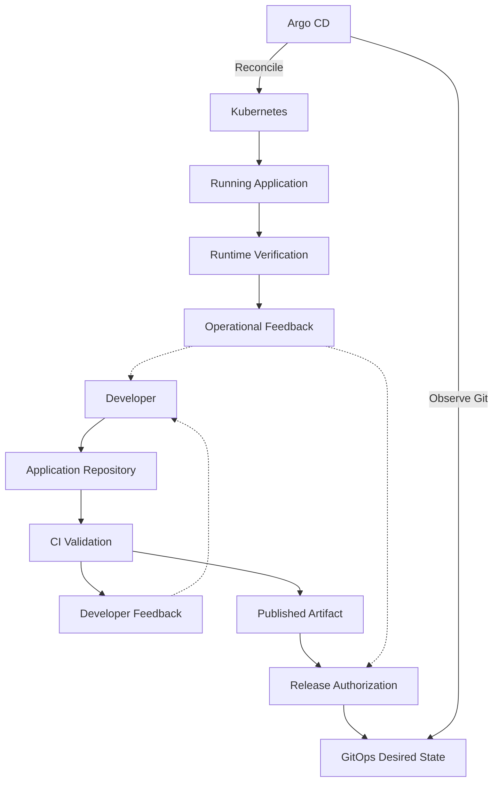

### The fundamental insight

**CI provides feedback about proposed software changes.**

**GitOps provides feedback about deployment-state convergence.**

**Observability provides feedback about running application behavior.**

All three are necessary for different reasons.

---

# 54. How to Measure the Complete Delivery System

We should not evaluate the system only by counting successful CI workflows.

We need to measure how effectively changes move from source to verified runtime.

## 54.1 Delivery timeline

Define these events:

| Event | Meaning |
|---|---|
| T1 | Application change submitted |
| T2 | CI validation completed |
| T3 | Source change merged |
| T4 | Image published |
| T5 | GitOps promotion proposed |
| T6 | GitOps change approved |
| T7 | Argo CD observed the approved revision |
| T8 | Kubernetes rollout completed |
| T9 | Application verification succeeded |

Now we can identify different sources of delay.

### CI latency

```text
T2 - T1
```

### Artifact publication latency

```text
T4 - T3
```

### Release preparation and authorization latency

```text
T6 - T4
```

### Deployment and verification latency

```text
T9 - T6
```

These are simplified measurements. In a real system, source integration and release eligibility may involve additional states.

### Why separate them?

Because each delay has a different cause.

If CI is fast but production approvals take days, optimizing npm dependency caching may not materially improve delivery lead time.

If GitOps approval is immediate but Kubernetes rollout is slow, investigate runtime convergence instead.

### Engineering principle

> **Measure the delivery lifecycle across system boundaries so improvements target actual bottlenecks.**

---

# 55. The Four Important Delivery Performance Dimensions

A useful high-level framework considers:

**Delivery throughput:** How frequently can the organization deliver useful changes?

**Delivery latency:** How long does a change take to reach its intended environment?

**Delivery reliability:** How often do changes cause failures requiring intervention?

**Recovery capability:** How quickly can the organization restore acceptable behavior after a failure?

These dimensions influence one another.

A team deploying frequently but causing severe outages does not have an effective overall delivery system.

Similarly, a team with few release failures but very slow, risky manual deployments may have significant opportunities for improvement.

### The objective

**Deliver useful changes with acceptable speed, risk, traceability, and recovery capability.**

---

# 56. System-Design Exercise — Build the Architecture Independently

Imagine you join a company as a Platform Engineer.

The organization operates a SaaS backend.

### Technology stack

```text
Backend:
Node.js + TypeScript

Database:
PostgreSQL

Cache:
Redis

CI:
GitHub Actions

Container Registry:
Azure Container Registry

Runtime:
Azure Kubernetes Service

Deployment:
Argo CD

Infrastructure:
Terraform
```

There are three environments:

```text
Development

Staging

Production
```

The company wants a complete CI/CD platform.

You must design it from first principles.

## Task A — Identify responsibilities

For each component, describe:

```text
Purpose:

Inputs:

Outputs:

Permissions:

Failure Modes:

Downstream Consumers:
```

Include:

- Git.
- GitHub Actions.
- Build system.
- Container registry.
- Release automation.
- GitOps repository.
- Argo CD.
- Kubernetes.
- Runtime verification.

## Task B — Define the identities

Design a traceability system connecting:

```text
Application Commit SHA

CI Run ID

Artifact Digest

GitOps Commit SHA

Observed Runtime Image
```

Explain how you would investigate a mismatch.

## Task C — Design the workflow graph

Your CI must include:

```text
Type Checking

Unit Tests

PostgreSQL Integration Tests

Redis Integration Tests

Container Build

Published Artifact Validation
```

Decide which operations may run concurrently.

Decide which are required to pass before publishing.

Explain how failure propagates.

## Task D — Design release authorization

Production requires approval.

Explain:

1. Who can publish images?
2. Who can propose GitOps promotions?
3. Who can approve production?
4. Which checks must pass?
5. Which credentials belong in CI?
6. Which credentials belong with Argo CD?
7. How is unauthorized direct modification prevented?

## Task E — Design environment promotion

The same image must progress through:

```text
Development

Staging

Production
```

Explain:

- Which artifact identity remains constant.
- Which GitOps configuration changes.
- What evidence is required at each stage.
- When approval is necessary.
- Why rebuilding the image during promotion would introduce uncertainty.

## Task F — Design deployment verification

Define checks for:

```text
GitOps Revision

Sync Status

Resource Health

Kubernetes Rollout

Image Reference

Database Compatibility

Application Smoke Tests

Operational Metrics
```

For each check, specify what it proves and what it cannot prove.

## Task G — Design recovery

A release causes production failures.

Explain:

- How the incident is detected.
- How the currently running artifact is identified.
- How the previous artifact is located.
- How database compatibility is evaluated.
- Who authorizes recovery.
- How GitOps expresses the recovery decision.
- How restored service behavior is verified.

### Final deliverable

Draw one architecture diagram.

Then write a short design document answering:

> Which system owns each decision, and how do we prove that every required transition was completed?

That question is the essence of end-to-end CI/CD system design.

---

# 57. Memorization — Nine End-to-End CI/CD Mental Models

These are the relationships worth memorizing.

## Mental Model 1 — Requirements define the architecture

```text
Requirements
      |
      v
Risks
      |
      v
Required Capabilities
      |
      v
System Boundaries
      |
      v
Tools and Implementation
```

**Remember:** Do not start with YAML.

---

## Mental Model 2 — Every boundary has a contract

```text
Producer
    |
    v
Defined Output
    |
    v
Consumer
```

The consumer should validate important assumptions about the received output.

---

## Mental Model 3 — Source and artifact are different identities

```text
Git Commit
      |
      v
Build Execution
      |
      v
Image Digest
```

The source SHA is not a substitute for the published image digest.

---

## Mental Model 4 — Publication and authorization are different

```text
Published Artifact
       !=
Approved Deployment
```

An image can exist in GHCR without being authorized for production.

---

## Mental Model 5 — GitOps expresses intent

```text
Approved Image Digest
          |
          v
GitOps Configuration
          |
          v
Versioned Deployment Intent
```

---

## Mental Model 6 — Argo CD reconciles configuration

```text
Git Desired State
       |
       v
Argo CD
       |
       v
Kubernetes Configuration
```

Argo CD does not build the application artifact.

---

## Mental Model 7 — Deployment success is not operational success

```text
Configuration Applied
        !=
Application Healthy
```

And:

```text
Application Healthy
        !=
Every Business Requirement Satisfied
```

Different checks produce different evidence.

---

## Mental Model 8 — Verification must reference the intended state

```text
Expected GitOps SHA
        +
Expected Image Digest
        +
Observed Kubernetes State
        +
Application Behavior
        |
        v
Release Verification
```

**Remember:** Don't trust a green status without checking which revision it describes.

---

## Mental Model 9 — Recovery must preserve authoritative state

```text
Failure
    |
    v
Recovery Decision
    |
    v
Approved GitOps Change
    |
    v
Reconciliation
    |
    v
Runtime Verification
```

The previous image is useful only when compatible with the current system state.

---

# 58. Active Recall Questions

Close your notes and answer without looking.

### System architecture

**Q1.** Why can every CI/CD component work individually while the complete delivery system still fails?

**Q2.** What is an integration contract?

**Q3.** What are the three major flows in our architecture?

**Q4.** Why must artifact distribution remain separate from deployment authorization?

**Q5.** Which component owns application compilation?

**Q6.** Which component owns Kubernetes reconciliation?

### Artifact traceability

**Q7.** Why do we need both a source SHA and an image digest?

**Q8.** What information does a CI run ID provide?

**Q9.** Why do we need the GitOps commit SHA?

**Q10.** Why might a runtime image ID differ from a published image index digest?

### Release authorization

**Q11.** Why is a successful publishing workflow not sufficient to authorize production deployment?

**Q12.** Why should a GitOps promotion use a pull request?

**Q13.** Why doesn't the application workflow's `GITHUB_TOKEN` automatically grant access to a separate GitOps repository?

**Q14.** What advantages does a dedicated GitHub App provide for cross-repository automation?

### Verification

**Q15.** Why can `Synced` and `Healthy` be misleading if the observed revision is outdated?

**Q16.** What should an end-to-end verification script check?

**Q17.** What does a successful Kubernetes rollout establish?

**Q18.** Why should application smoke tests execute after deployment?

**Q19.** What evidence would you preserve for a release audit?

### Failure handling

**Q20.** What happens if CI tests fail?

**Q21.** What happens if image publication fails?

**Q22.** What happens if GitOps references a nonexistent digest?

**Q23.** Why can Argo CD be `Synced` while an application is unavailable?

**Q24.** What should happen if a release is approved but Argo CD is unavailable?

**Q25.** Why might restoring a previous image fail to recover the system?

---

# 59. Interview and System-Design Questions

### Question 1

Explain the complete journey of a source commit through GitHub Actions, GHCR, GitOps, Argo CD, and Kubernetes.

Do not skip artifact identity or authorization boundaries.

### Question 2

Your GitHub Actions workflow reports success.

How do you prove that the image running in Kubernetes was produced by that particular workflow?

### Question 3

The GitOps repository references the correct image digest.

Argo CD reports `Synced`.

But the application is unavailable.

How would you investigate?

### Question 4

Why should artifact promotion modify the GitOps repository instead of rebuilding the Docker image?

### Question 5

How would you automate GitOps pull-request creation from an application repository without granting unnecessary cross-repository permissions?

### Question 6

A release is approved and the GitOps PR is merged, but Argo CD still reports the old revision as `Synced`.

What does this indicate?

Why shouldn't a release verification script immediately report success?

### Question 7

A new image starts successfully but fails to connect to PostgreSQL.

Which component is responsible for detecting the problem?

Which component should coordinate recovery?

### Question 8

How would you design traceability across five independent identifiers: source SHA, CI run ID, artifact digest, GitOps commit SHA, and runtime image identity?

### Question 9

Two releases are proposed for production at nearly the same time.

How would you prevent one release from invalidating the assumptions of the other?

### Question 10

Your organization has twenty microservices and three Kubernetes environments.

How would you structure the CI, registry, release, GitOps, and Argo CD boundaries to preserve independent deployment and authorization?

---

# 60. Official Documentation

Use these resources to verify the exact behavior of the systems we connected.

**GitHub Actions workflow syntax:**  
https://docs.github.com/en/actions/reference/workflows-and-actions/workflow-syntax

**GitHub Actions token permissions:**  
https://docs.github.com/en/actions/concepts/security/github_token

**GitHub App authentication for cross-repository workflows:**  
https://docs.github.com/en/apps/creating-github-apps/authenticating-with-a-github-app/making-authenticated-api-requests-with-a-github-app-in-a-github-actions-workflow

**GitHub repository rulesets:**  
https://docs.github.com/en/repositories/configuring-branches-and-merges-in-your-repository/managing-rulesets/available-rules-for-rulesets

**Docker builds with GitHub Actions:**  
https://docs.docker.com/build/ci/github-actions/

**Container image attestations:**  
https://docs.docker.com/build/ci/github-actions/attestations/

**Argo CD automated synchronization:**  
https://argo-cd.readthedocs.io/en/stable/user-guide/auto_sync/

**Argo CD Git webhooks:**  
https://argo-cd.readthedocs.io/en/stable/operator-manual/webhook/

**Argo CD Application specification:**  
https://argo-cd.readthedocs.io/en/stable/user-guide/application-specification/

**Kubernetes Deployments:**  
https://kubernetes.io/docs/concepts/workloads/controllers/deployment/

For every piece of configuration, return to one question:

**Which architecture requirement does this feature implement?**

---

# 61. Phase 12 — Final Engineering Takeaways

| Principle | Engineering meaning |
|---|---|
| **Components require contracts** | Correct behavior at each boundary matters |
| **Source identity is not artifact identity** | Preserve both SHA and digest |
| **Artifact publishing is not deployment approval** | Authorization must be explicit |
| **CI evidence needs a trusted origin** | Release records should link to verifiable workflow results |
| **GitOps records release intent** | Promotion changes selected deployment configuration |
| **Argo CD reconciles desired state** | It does not build or approve artifacts |
| **Kubernetes executes the workload** | Image pulls, scheduling, and runtime behavior are separate |
| **Release verification must be revision-aware** | Confirm the expected GitOps commit was processed |
| **Successful sync is not sufficient** | Check rollout and application behavior |
| **Failure handling belongs at every boundary** | Reject invalid transitions early |
| **Security follows authority** | Protect both artifact producers and deployment-intent writers |
| **Recovery requires compatibility** | Reverting an image may not reverse database effects |
| **Evidence should survive runner disposal** | Preserve useful release records and diagnostic information |
| **Measure the whole lifecycle** | Optimize actual delivery bottlenecks |

---

# 62. Final Understanding — The Complete CI/CD System

We started this course with a deceptively simple question:

**Why do we need CI/CD?**

We discovered that software delivery is a system of controlled transformations and state transitions.

A developer changes source code.

Git records the source revision.

GitHub Actions validates that revision.

The build system packages the application.

The container registry stores the resulting artifact.

The published digest identifies the software content.

Release engineering determines whether the artifact may be used in an environment.

GitOps records the approved deployment decision.

Argo CD obtains and reconciles the desired configuration.

Kubernetes manages the resulting workloads.

The container runtime retrieves the application image.

Application-level verification establishes whether the expected functionality is available.

Monitoring provides ongoing evidence about operational behavior.

And recovery mechanisms allow the team to respond when expectations are not satisfied.

## 62.1 The complete architecture

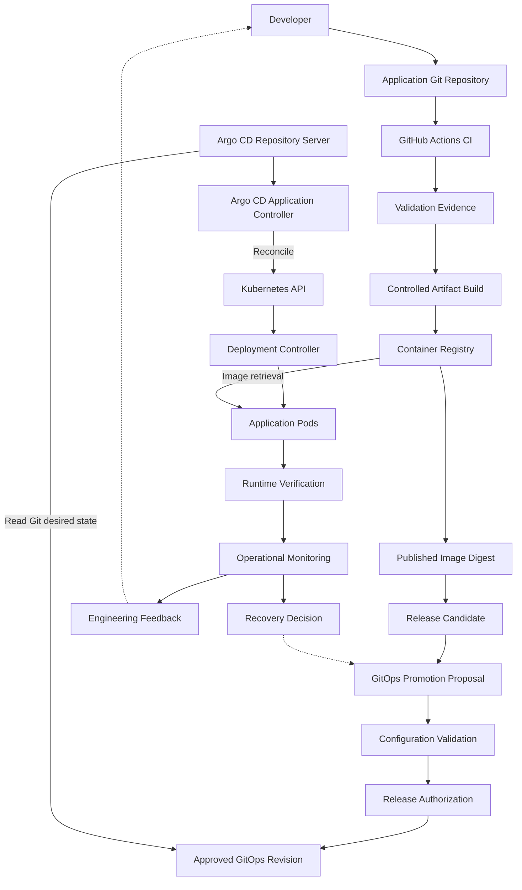

This diagram is the foundation for the remaining phases.

### The most important principle of Phase 12

> **A trustworthy CI/CD system is not defined by how many tools it uses. It is defined by how reliably it transforms identifiable software changes into authorized, verifiable, and recoverable runtime state.**

That is the difference between configuring pipelines and engineering a delivery platform.

---

# Phase 12 Complete

**Completed:** Level 3 — Phase 12: End-to-End Integration

## Level 3 — Continuous Delivery Is Complete

| Phase | Topic | Status |
|---|---|---|
| 09 | Release Engineering | Completed |
| 10 | GitOps | Completed |
| 11 | Argo CD | Completed |
| 12 | End-to-End Integration | Completed |

## Course Progress — 5 Levels, 16 Phases

| Level | Phase | Topic | Status |
|---|---|---|---|
| **1 — Fundamentals** | 01 | Why CI/CD Exists | Completed |
| | 02 | Feedback and Control Systems | Completed |
| | 03 | Delivery Architecture | Completed |
| | 04 | Git Lifecycle | Completed |
| **2 — Continuous Integration** | 05 | CI Architecture | Completed |
| | 06 | Testing and Quality Gates | Completed |
| | 07 | Build Artifacts | Completed |
| | 08 | GitHub Actions | Completed |
| **3 — Continuous Delivery** | 09 | Release Engineering | Completed |
| | 10 | GitOps | Completed |
| | 11 | Argo CD | Completed |
| | 12 | End-to-End Integration | Completed |
| **4 — Production Engineering** | **13** | **Deployment Strategies** | **Next** |
| | 14 | CI/CD Security | Upcoming |
| | 15 | Reliability and Observability | Upcoming |
| **5 — System Design** | 16 | Complete CI/CD Project | Upcoming |

---

# Next: Phase 13 — Deployment Strategies

**File:** `Level-4-Production-Engineering/Phase-13-Deployment-Strategies.md`

We have now designed a system that can take a validated artifact and deploy it through GitOps.

But we have not yet explored an important production question:

> **How do we replace a running application version without unnecessarily disrupting users, and how do we control risk while a new version is introduced?**

This leads us to deployment strategies.

In Phase 13, we will study:

- Why deployment strategy is a reliability decision.
- Rolling deployments.
- Recreate deployments.
- Blue-green deployment.
- Canary deployment.
- Progressive delivery.
- Traffic shifting.
- Kubernetes readiness and rollout behavior.
- Deployment versus feature release.
- Feature flags.
- Deployment failure detection.
- Rollback and roll-forward decisions.
- Database compatibility during mixed-version operation.
- Argo Rollouts and its relationship with Argo CD.
- How to choose a deployment strategy from risk and availability requirements.
- Practical deployment experiments and failure injection.

### Central engineering question

**How do we introduce a new application version into a running system while controlling user impact, validating the transition, and preserving a safe recovery path?**

**Send `next` to begin Phase 13 — Deployment Strategies.**