# Phase 13 — Deployment Strategies: Engineering Safe Changes in Running Systems

**Level 4 — Production Engineering | CI/CD From First Principles**

**File:** `Level-4-Production-Engineering/Phase-13-Deployment-Strategies.md`

**Previous:** Phase 12 — End-to-End Integration  
**Next:** Phase 14 — CI/CD Security

---

## 1. Why deployment strategies exist

Welcome to **Phase 13**, the first phase of Level 4 — Production Engineering.

In Phase 12, we built the complete delivery chain:

```text
Developer
   |
   v
Git
   |
   v
GitHub Actions
   |
   v
Validated Container Image
   |
   v
Container Registry
   |
   v
GitOps Release Approval
   |
   v
Argo CD
   |
   v
Kubernetes
   |
   v
Running Application
```

We now know how to deliver a specific, approved artifact to Kubernetes.

But a new problem appears.

**What happens to the users already using the application while Kubernetes replaces the old version with the new one?**

Suppose our e-commerce API currently serves 10,000 requests per minute.

Production runs:

```text
Application version: v1

Replicas: 4

Status: Healthy
```

CI builds and validates version `v2`.

Release Engineering authorizes the deployment.

Argo CD updates the desired image reference.

Now Kubernetes must replace the running instances.

We have several questions:

- Should all four old Pods stop simultaneously?
- Should new Pods become ready before old Pods terminate?
- Can old and new versions safely run together?
- How much additional capacity is available?
- How many users should encounter the new version initially?
- How do we determine whether the new version is healthy?
- What happens if the new version fails halfway through deployment?
- Can we restore the previous version?
- Can the database support both application versions during the transition?

These are not primarily GitHub Actions questions.

They are **deployment strategy questions**.

### Central engineering question

> **How do we move a running system from version A to version B while controlling availability, compatibility, user exposure, resource consumption, and recovery risk?**

This phase will teach you to choose and implement deployment strategies from requirements—not memorize strategy names.

---

## 2. Learning objectives

By the end of this phase, you should understand:

1. Why changing a running system introduces operational risk.
2. The difference between deployment, rollout, release, and feature exposure.
3. What zero-downtime deployment actually requires.
4. How Kubernetes replaces old Pods with new Pods.
5. Readiness, liveness, startup, and graceful termination.
6. Rolling deployments and their mathematical constraints.
7. Recreate deployments and their availability implications.
8. Blue-green deployments and Service-based traffic switching.
9. Canary deployments and controlled user exposure.
10. Why Pod percentages are not necessarily traffic percentages.
11. How Argo Rollouts extends Kubernetes Deployments.
12. How Argo CD and Argo Rollouts have different responsibilities.
13. Analysis-based progressive delivery using metrics.
14. Failure detection, promotion, abortion, rollback, and roll-forward.
15. Why database compatibility determines deployment safety.
16. How feature flags differ from deployment strategies.
17. How to choose the right strategy for an application.
18. How to run controlled deployment experiments on local Kubernetes.

Our hands-on lab will use **kind**, **Kubernetes**, **Argo Rollouts**, **GitHub**, and **Argo CD**.

No paid cloud infrastructure is needed.

---

# Part I — First-Principles Thinking

## 3. Deployment is a transition between two operating states

Imagine an application serving users.

At time T1:

```text
Desired Application: v1
Running Application: v1
```

After a release, we want:

```text
Desired Application: v2
Running Application: v2
```

But the system cannot necessarily transition instantaneously.

There may be an intermediate period:

```text
Running:
v1 and v2
```

Or:

```text
Running:
No application instances
```

The deployment strategy determines which intermediate states are permitted.

### A state-transition model

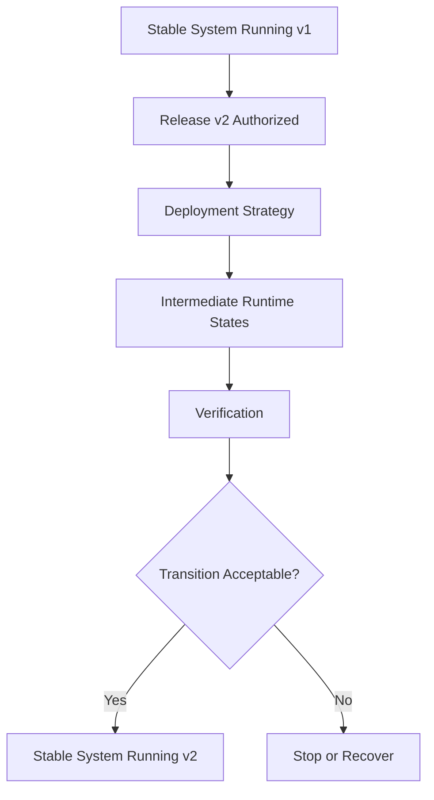
```mermaid
flowchart TD
    A["Stable System Running v1"]
    B["Release v2 Authorized"]
    C["Deployment Strategy"]
    D["Intermediate Runtime States"]
    E["Verification"]
    F{"Transition Acceptable?"}
    G["Stable System Running v2"]
    H["Stop or Recover"]

    A --> B
    B --> C
    C --> D
    D --> E
    E --> F

    F -->|Yes| G
    F -->|No| H
```

This is the first important realization:

**A deployment strategy is a policy for managing intermediate states.**

It controls how an old version is replaced, how users encounter the new version, and what happens when the transition is unsuccessful.

---

## 4. Derive the fundamental deployment requirements

Before choosing a strategy, identify the requirements.

Consider six dimensions.

| Dimension | Engineering question |
|---|---|
| Availability | How much service interruption is acceptable? |
| Compatibility | Can old and new versions coexist? |
| Capacity | How many additional Pods can the cluster run? |
| Exposure | How many users may encounter the new version initially? |
| Verification | What evidence determines whether the new version is acceptable? |
| Recovery | How can the system return to acceptable behavior? |

These dimensions determine our strategy.

### Example A — Internal development application

Requirements:

```text
Downtime: Acceptable

Additional capacity: Limited

Release frequency: Low

Mixed versions: Not required
```

A **Recreate** deployment might be reasonable.

### Example B — Customer-facing API

Requirements:

```text
Downtime: Unacceptable under normal conditions

Additional capacity: Available

Old/new coexistence: Supported

Release frequency: High
```

A **RollingUpdate** may be sufficient.

### Example C — High-risk payment service

Requirements:

```text
Downtime: Minimize

New-version exposure: Gradual

Operational verification: Required

Ability to stop promotion: Required
```

A **Canary** strategy with appropriate traffic routing and analysis may be preferable.

### Example D — Application requiring full preview testing

Requirements:

```text
Test complete new environment first

Keep current version serving users

Switch traffic after authorization
```

A **Blue-Green** strategy may fit.

### First-principles rule

> **Choose a deployment strategy according to failure tolerance and transition requirements, not because one strategy sounds more advanced.**

---

## 5. What does zero downtime really mean?

You will frequently hear:

> Kubernetes supports zero-downtime deployment.

That statement requires qualifications.

A Kubernetes strategy can help preserve available replicas during an update.

But zero user-visible downtime also depends on:

- Sufficient application capacity.
- Correct readiness probes.
- Reliable network routing.
- Graceful shutdown behavior.
- Compatible application versions.
- Compatible databases and APIs.
- Available cluster resources.
- No external dependency failures.

### Example

Suppose we run four Pods.

Each can handle 100 requests per second.

Our theoretical maximum capacity is:

```text
4 × 100 = 400 requests/second
```

Now traffic reaches 350 requests per second.

If we terminate one Pod without replacing its capacity, the remaining three Pods can theoretically handle:

```text
3 × 100 = 300 requests/second
```

The application may become overloaded.

Even though three Pods remain running.

The numbers are simplified; real throughput depends on workload, latency, resource allocation, and traffic distribution.

### Availability is not merely Pod count

```text
Running Pods
      !=
Available Application Capacity
```

Likewise:

```text
Ready Pods
      !=
Guaranteed Successful User Requests
```

### Important principle

**A safe deployment needs sufficient healthy serving capacity throughout the transition, not just a configuration that requests multiple replicas.**

---

## 6. The lifecycle of a Pod during deployment

We cannot design deployment strategies properly without understanding Pod lifecycle.

Consider a new container.

It moves through several stages:

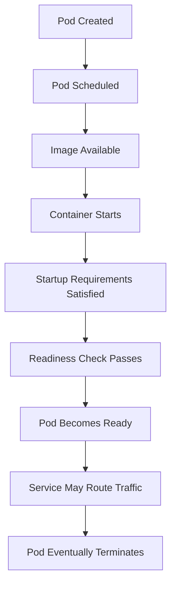
```mermaid
flowchart TD
    A["Pod Created"]
    B["Pod Scheduled"]
    C["Image Available"]
    D["Container Starts"]
    E["Startup Requirements Satisfied"]
    F["Readiness Check Passes"]
    G["Pod Becomes Ready"]
    H["Service May Route Traffic"]
    I["Pod Eventually Terminates"]

    A --> B
    B --> C
    C --> D
    D --> E
    E --> F
    F --> G
    G --> H
    H --> I
```

Not every application requires a startup probe.

The diagram shows the logical stages rather than claiming Kubernetes always configures all three probe types.

### Why does this matter?

A container can be running without being ready to receive traffic.

For example:

```text
Container process:
Running
```

But:

```text
Database connection:
Not initialized
```

A readiness probe should prevent that Pod from being considered a ready Service endpoint when the required serving conditions are not satisfied.

This is a critical component of safe deployments.

---

## 7. Liveness, readiness, and startup probes

These checks answer different questions.

### Liveness

**Should Kubernetes restart this container because its process is no longer operating acceptably?**

Example:

```yaml
livenessProbe:
  httpGet:
    path: /healthz
    port: 3000
```

A repeatedly failing liveness probe can cause the container to restart.

A liveness probe should not be made dependent on every external service in a way that creates cascading restarts during a dependency outage.

### Readiness

**Should this Pod currently receive normal Service traffic?**

Example:

```yaml
readinessProbe:
  httpGet:
    path: /readyz
    port: 3000
```

When readiness fails, the Pod is not considered ready for normal Service endpoint routing.

This is particularly important while introducing a new version.

### Startup

**Has the application completed its startup period?**

Example:

```yaml
startupProbe:
  httpGet:
    path: /healthz
    port: 3000
  periodSeconds: 2
  failureThreshold: 30
```

A startup probe gives applications time to initialize before normal liveness and readiness probing proceeds.

### Comparison

| Probe | Main purpose | Typical response to failure |
|---|---|---|
| Startup | Determine whether initialization completed | Eventually restart on repeated failure |
| Readiness | Determine whether Pod should receive traffic | Remove from ready endpoints |
| Liveness | Determine whether the container should be restarted | Restart on repeated failure |

Kubernetes documents these differences in its [probe configuration guide](https://kubernetes.io/docs/tasks/configure-pod-container/configure-liveness-readiness-startup-probes/).

### The deployment implication

> **A rolling or progressive deployment cannot protect user availability reliably if readiness does not represent the application's ability to serve the relevant requests.**

---

## 8. Graceful termination matters as much as startup

Suppose a Pod is serving a customer request.

Kubernetes decides to terminate the Pod.

If the application immediately exits, the request may fail.

A safer termination process is:

1. Stop advertising the terminating Pod for new traffic.
2. Allow routing changes to propagate.
3. Stop accepting new requests when appropriate.
4. Complete or safely terminate in-flight work.
5. Exit before the termination grace period expires.

### Termination sequence

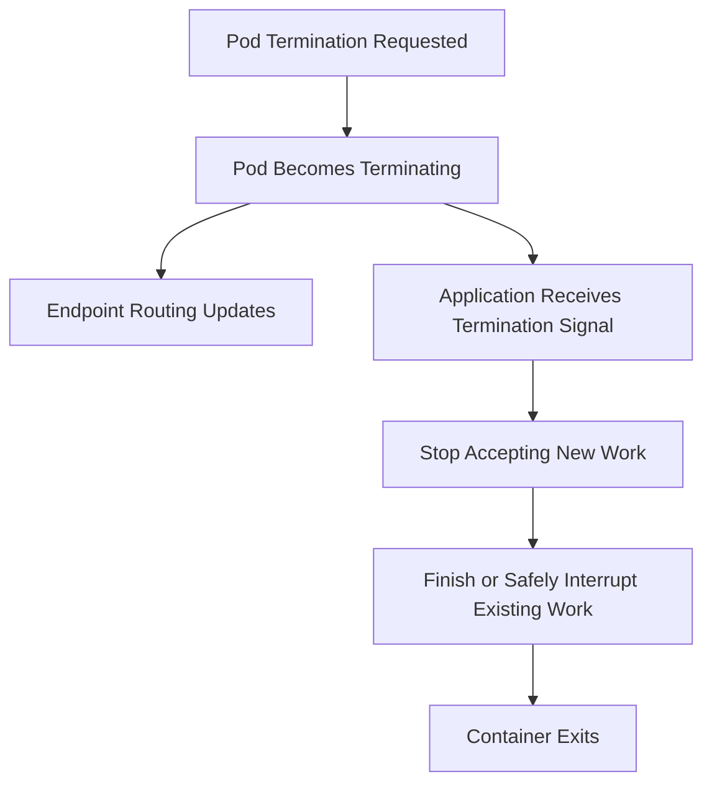
```mermaid
flowchart TD
    A["Pod Termination Requested"]
    B["Pod Becomes Terminating"]
    C["Endpoint Routing Updates"]
    D["Application Receives Termination Signal"]
    E["Stop Accepting New Work"]
    F["Finish or Safely Interrupt Existing Work"]
    G["Container Exits"]

    A --> B
    B --> C
    B --> D
    D --> E
    E --> F
    F --> G
```

The endpoint updates and termination signals do not necessarily happen in a perfectly serialized order. Routing changes and connection draining can take time.

This is why production applications often need explicit graceful-shutdown handling.

### Node.js example

```javascript
const server = app.listen(3000);

process.on("SIGTERM", () => {
  server.close((error) => {
    if (error) {
      process.exitCode = 1;
    }
  });
});
```

This is a simplified example.

Real applications may also need to stop accepting background jobs, manage long-lived connections, flush telemetry, and coordinate with database transactions.

### Core lesson

**Starting new Pods safely and terminating old Pods safely are equally important parts of deployment reliability.**

---

# Part II — Deployment Strategies From First Principles

## 9. Strategy 1 — Recreate

Begin with the simplest replacement strategy.

Suppose production runs:

```text
v1
v1
v1
```

We want:

```text
v2
v2
v2
```

One approach is:

1. Stop the old Pods.
2. Wait for them to terminate.
3. Start the new Pods.
4. Wait for readiness.

This is the **Recreate** strategy.

### Architecture

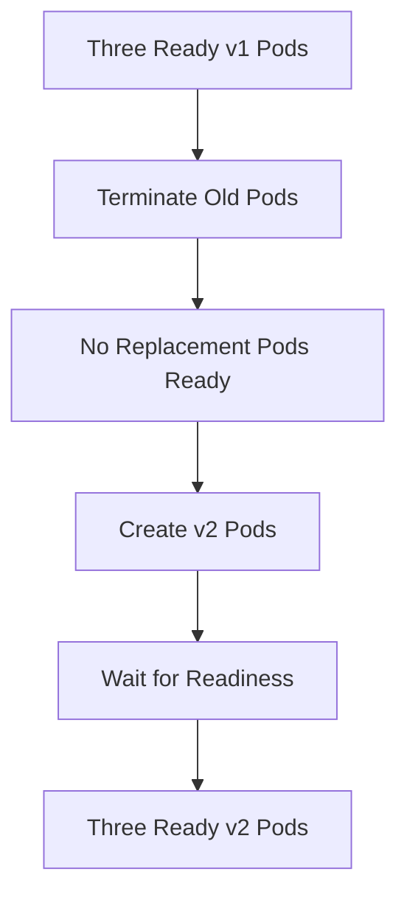
```mermaid
flowchart TD
    A["Three Ready v1 Pods"]
    B["Terminate Old Pods"]
    C["No Replacement Pods Ready"]
    D["Create v2 Pods"]
    E["Wait for Readiness"]
    F["Three Ready v2 Pods"]

    A --> B
    B --> C
    C --> D
    D --> E
    E --> F
```

Kubernetes defines Recreate as terminating the old Pods before creating the new Pods during a Deployment update. [Kubernetes](https://kubernetes.io/docs/concepts/workloads/controllers/deployment/?utm_source=chatgpt.com)

### Advantages

- Simple lifecycle.
- No planned overlap of old and new Pod versions during the replacement.
- Limited additional Pod capacity required.
- Useful when simultaneous application versions are unsafe.

### Disadvantages

- Creates an availability gap if the application has no alternate serving instances.
- Restart time becomes user-visible.
- A failed new version can extend the outage.
- May be unsuitable for customer-facing systems.

### Kubernetes configuration

```yaml
strategy:
  type: Recreate
```

### When would you select it?

Potentially for:

- Disposable development applications.
- Scheduled maintenance jobs.
- Certain non-HA applications.
- Systems where mixed-version operation is prohibited and interruption is acceptable.

### Important nuance

Recreate does not guarantee that there is only one executing process across every external system.

It governs the Deployment's Pod replacement behavior.

Distributed coordination may still be required for exclusive workers or stateful applications.

---

## 10. Strategy 2 — RollingUpdate

Now suppose downtime is unacceptable under normal operating conditions.

Instead of stopping all old Pods together, we gradually replace them.

Initial state:

```text
v1 v1 v1 v1
```

Intermediate state:

```text
v1 v1 v1 v1 + v2 starting
```

After readiness:

```text
v1 v1 v1 v2
```

Eventually:

```text
v2 v2 v2 v2
```

This is a **RollingUpdate**.

### Architecture

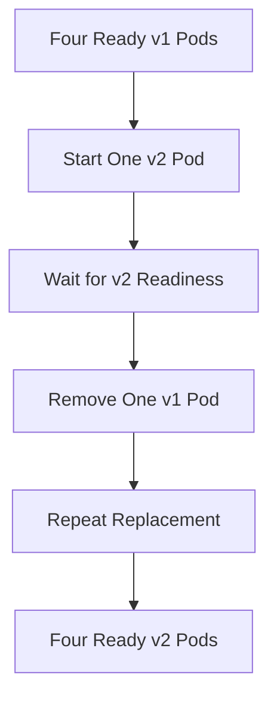
```mermaid
flowchart TD
    A["Four Ready v1 Pods"]
    B["Start One v2 Pod"]
    C["Wait for v2 Readiness"]
    D["Remove One v1 Pod"]
    E["Repeat Replacement"]
    F["Four Ready v2 Pods"]

    A --> B
    B --> C
    C --> D
    D --> E
    E --> F
```

### Why does this help?

Because available old instances can continue serving traffic while new instances start.

Kubernetes supports configurable limits on additional Pods and unavailable Pods during rolling updates. [Kubernetes](https://kubernetes.io/docs/concepts/workloads/controllers/deployment/?utm_source=chatgpt.com)

But we need to understand those limits mathematically.

---

## 11. Rolling deployments: `maxSurge`

Suppose:

```text
Desired replicas = 4
```

We configure:

```yaml
maxSurge: 1
```

This permits the controller to create up to one additional non-terminating Pod beyond the desired count during the rollout, subject to its rollout calculations.

Conceptually:

```text
Desired Replicas:
4
```

```text
Maximum Active Replica Budget:
4 + 1 = 5
```

The cluster therefore needs sufficient capacity for the additional Pod.

### Why is this important?

Imagine the cluster can run exactly four application Pods.

A rollout requesting a fifth Pod may be blocked by:

```text
Insufficient CPU
```

Or:

```text
Insufficient memory
```

The new Pod cannot start.

The rollout may stall.

### Engineering trade-off

Higher `maxSurge` can increase rollout speed, but requires additional temporary capacity.

---

## 12. Rolling deployments: `maxUnavailable`

Now consider:

```yaml
maxUnavailable: 0
```

For four desired replicas, the rolling-update controller attempts to preserve at least four available replicas throughout the rollout.

Conceptually:

```text
Desired Replicas:
4
```

```text
Minimum Available Replicas:
4 - 0 = 4
```

This is a useful setting for availability-sensitive services when sufficient capacity exists.

### Complete example

```yaml
strategy:
  type: RollingUpdate
  rollingUpdate:
    maxSurge: 1
    maxUnavailable: 0
```

### What does this protect against?

It prevents the Deployment controller from intentionally reducing available replica capacity below its configured threshold as part of the rolling-update algorithm.

### What does it not guarantee?

- New Pods can actually be scheduled.
- All four Pods will remain healthy despite unrelated failures.
- Traffic is evenly distributed.
- Every request succeeds.
- Application versions are database-compatible.
- The load balancer drains every connection perfectly.

### Important capacity nuance

Terminating Pods can temporarily remain in the cluster while replacements exist, so actual resource consumption can exceed the simple `replicas + maxSurge` calculation during termination. [Kubernetes](https://kubernetes.io/docs/concepts/workloads/controllers/deployment/?utm_source=chatgpt.com)

### Practical interpretation

`maxSurge` controls temporary replacement capacity.

`maxUnavailable` controls how much rollout-related availability reduction is permitted.

They solve different problems.

---

## 13. RollingUpdate numerical exercises

Let's reason about three configurations.

Assume four desired replicas.

| Configuration | Temporary surge budget | Minimum available replicas during update |
|---|---:|---:|
| `maxSurge: 1`, `maxUnavailable: 0` | 1 | 4 |
| `maxSurge: 0`, `maxUnavailable: 1` | 0 | 3 |
| `maxSurge: 2`, `maxUnavailable: 1` | 2 | 3 |

These describe the controller's configured rollout constraints, not guarantees against external failures.

### Scenario A — Prioritize availability

Choose:

```yaml
maxSurge: 1
maxUnavailable: 0
```

Why?

You want to avoid planned capacity reduction while replacing Pods.

### Scenario B — Strict resource budget

Choose:

```yaml
maxSurge: 0
maxUnavailable: 1
```

Why?

You cannot create additional Pods.

But you accept temporarily reduced available capacity.

### Scenario C — Prioritize rollout speed

Choose:

```yaml
maxSurge: 2
maxUnavailable: 1
```

Why?

You allow more simultaneous replacement activity.

### Engineering question

Which is best?

There is no universal answer.

You need to know:

- The application's spare capacity.
- Request rate.
- Startup duration.
- Resource quotas.
- Node capacity.
- Availability objective.
- Cost constraints.

This is why deployment configuration is a system-design decision.

---

## 14. What happens when a rolling update fails?

Imagine:

```text
v1 Pods:
Healthy
```

But the new `v2` Pods fail readiness.

With:

```yaml
maxSurge: 1
maxUnavailable: 0
```

The controller can create a new Pod without deliberately terminating available old capacity.

If the new Pod never becomes available, rollout progress may stop.

### Failure state

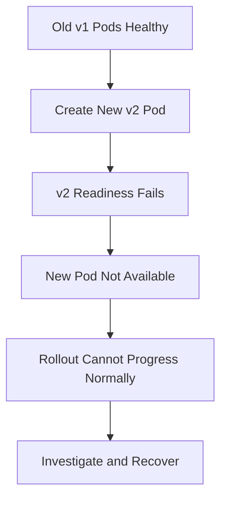
```mermaid
flowchart TD
    A["Old v1 Pods Healthy"]
    B["Create New v2 Pod"]
    C["v2 Readiness Fails"]
    D["New Pod Not Available"]
    E["Rollout Cannot Progress Normally"]
    F["Investigate and Recover"]

    A --> B
    B --> C
    C --> D
    D --> E
    E --> F
```

### Important Kubernetes behavior

A Deployment can report:

```text
ProgressDeadlineExceeded
```

when it does not make adequate progress before its configured deadline.

But **Kubernetes does not automatically roll the Deployment back merely because this condition appears**. The controller continues retrying, and a higher-level system or operator must decide what to do. [Kubernetes](https://kubernetes.io/docs/concepts/workloads/controllers/deployment/?utm_source=chatgpt.com)

This is a very important distinction.

**Failure detection is not automatically failure recovery.**

---

## 15. Strategy 3 — Blue-Green

Now consider a different requirement.

The team wants to validate a fully provisioned new version before sending normal user traffic to it.

Instead of gradually replacing old Pods, we maintain two environments or two sets of application instances.

**Blue:** Currently serving users.

**Green:** New version being prepared.

### Architecture

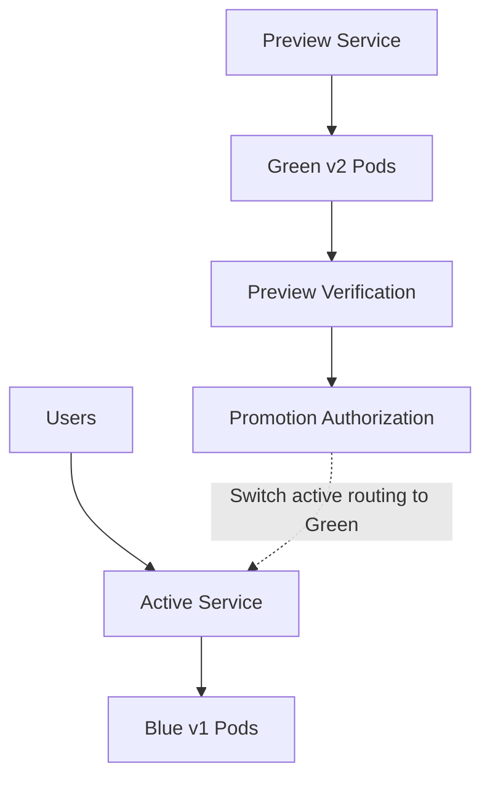
```mermaid
flowchart TD
    A["Users"]
    B["Active Service"]
    C["Blue v1 Pods"]

    D["Preview Service"]
    E["Green v2 Pods"]
    F["Preview Verification"]
    G["Promotion Authorization"]

    A --> B
    B --> C

    D --> E
    E --> F
    F --> G

    G -.->|"Switch active routing to Green"| B
```

### Phase 1 — Prepare

Blue serves users.

Green starts separately.

### Phase 2 — Verify

Tests run against Green through a preview endpoint.

Blue continues serving users.

### Phase 3 — Promote

The active routing target changes to Green.

### Phase 4 — Retain or remove old capacity

Blue may remain available temporarily for rapid recovery before being scaled down.

### Advantages

- New version can be tested before promotion.
- Clear separation of active and preview instances.
- Routing changes can move users to the new version.
- Previous serving capacity may be retained temporarily.

### Disadvantages

- Often requires roughly double application capacity during preview.
- The traffic switch does not make all existing connections disappear instantaneously.
- Database and shared-state compatibility remain necessary.
- A bad routing configuration can cause an outage.
- Running both versions may have meaningful cost.

### Important principle

> **Blue-green reduces the risk of replacing serving instances before verifying replacements, but it does not eliminate compatibility, routing, or data-state risks.**

Argo Rollouts implements blue-green behavior using an `activeService` and optionally a `previewService`. [Argo Project](https://argoproj.github.io/argo-rollouts/features/bluegreen/?utm_source=chatgpt.com)

---

## 16. Strategy 4 — Canary

Now consider this requirement:

> We want to expose a new version to a small portion of traffic, observe its behavior, and expand exposure only when the evidence is acceptable.

This is a **Canary** deployment.

Instead of switching all traffic immediately, we progressively introduce the new version.

Conceptually:

```text
Stage 1:
5% new version
95% old version
```

```text
Stage 2:
20% new version
80% old version
```

```text
Stage 3:
50% new version
50% old version
```

```text
Stage 4:
100% new version
```

These are conceptual traffic targets. Achieving precise weights requires appropriate traffic-routing capabilities.

### Architecture

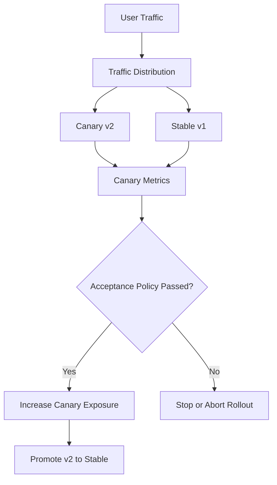
```mermaid
flowchart TD
    A["User Traffic"]
    B["Traffic Distribution"]
    C["Stable v1"]
    D["Canary v2"]

    E["Canary Metrics"]
    F{"Acceptance Policy Passed?"}
    G["Increase Canary Exposure"]
    H["Stop or Abort Rollout"]
    I["Promote v2 to Stable"]

    A --> B
    B --> C
    B --> D

    D --> E
    C --> E

    E --> F

    F -->|Yes| G
    F -->|No| H

    G --> I
```

### What does canary protect against?

It limits the initial number of users or requests exposed to an unproven release.

It gives the team an opportunity to evaluate real runtime behavior before full promotion.

### What does it not guarantee?

- The canary receives sufficient representative traffic.
- The metrics are statistically meaningful.
- A rare defect is detected.
- The rollout will stop without properly configured gates.
- The system can safely restore the previous version after a database change.

### The deeper principle

**Canary deployment trades rollout speed and operational complexity for controlled exposure and additional real-world evidence.**

---

## 17. A critical canary distinction: Pods are not traffic percentages

This is one of the easiest deployment concepts to misunderstand.

Suppose we have five replicas.

Our canary strategy requests:

```text
20% Canary
```

Without an external traffic router, Argo Rollouts can approximate the target by managing replica counts.

For five replicas:

```text
Stable Pods:
4
```

```text
Canary Pods:
1
```

The intended approximation is:

```text
1 / 5 = 20%
```

But does that guarantee exactly 20% of HTTP requests reach the canary?

**No.**

Traffic distribution can vary because of:

- Long-lived connections.
- Unequal request rates.
- Session affinity.
- Endpoint selection.
- Small sample sizes.
- Differences between connection distribution and request distribution.

Argo Rollouts explicitly describes its basic no-router canary mode as a best-effort approximation using ReplicaSet proportions. [Argo Project](https://argoproj.github.io/argo-rollouts/features/canary/?utm_source=chatgpt.com)

### Example

With five replicas, requesting:

```text
10% Canary
```

cannot be represented exactly by one new Pod.

One of five is already 20%.

### How do we gain finer control?

Use an appropriate traffic-routing integration, such as a supported ingress controller, gateway, or service mesh.

Then traffic weight and replica count can be controlled more independently.

### Important distinction

```text
20% New Pods
       !=
Guaranteed 20% of Requests
```

This distinction matters in production architecture interviews.

---

## 18. Canary is not just gradual deployment

A weak canary system does this:

```text
Deploy 10%
Wait 2 minutes
Deploy 50%
Wait 2 minutes
Deploy 100%
```

What is missing?

**Evidence.**

Time passing is not proof that the application is healthy.

A stronger system evaluates conditions such as:

- Error rate.
- Request latency.
- Timeout rate.
- Availability.
- Application-specific business errors.
- Dependency failure rates.
- Resource saturation.

### Progressive delivery

Progressive delivery combines controlled exposure with evidence-based progression.

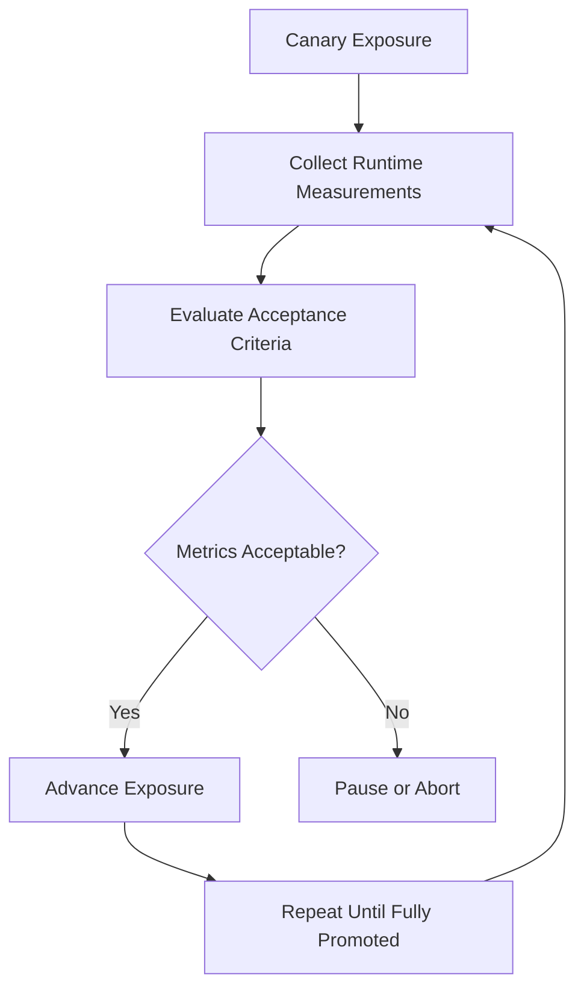
```mermaid
flowchart TD
    A["Canary Exposure"]
    B["Collect Runtime Measurements"]
    C["Evaluate Acceptance Criteria"]
    D{"Metrics Acceptable?"}
    E["Advance Exposure"]
    F["Pause or Abort"]
    G["Repeat Until Fully Promoted"]

    A --> B
    B --> C
    C --> D

    D -->|Yes| E
    D -->|No| F

    E --> G
    G --> B
```

This is why Argo Rollouts supports AnalysisTemplates and AnalysisRuns that can evaluate metrics while a rollout progresses. [Argo Project](https://argoproj.github.io/argo-rollouts/features/analysis/?utm_source=chatgpt.com)

---

## 19. Choosing the strategy: a decision table

| Requirement | Recreate | Rolling | Blue-Green | Canary |
|---|---|---|---|---|
| Minimize normal deployment downtime | Poor fit | Good fit | Good fit | Good fit |
| Avoid simultaneous old/new versions | Good fit | Poor fit | Poor fit | Poor fit |
| Minimize extra capacity | Good fit | Depends on surge | Usually expensive | Depends on mode |
| Preview complete new version | Limited | Limited | Strong | Possible |
| Limit initial user exposure | No | Limited | Usually all at switch | Strong |
| Gradually increase exposure | No | Pod replacement | Usually no | Yes |
| Requires advanced traffic routing | No | No | Not necessarily | For precise weighting |
| Operational complexity | Low | Moderate | Higher | Higher |
| Typical Kubernetes implementation | Deployment | Deployment | Argo Rollouts or equivalent | Argo Rollouts or equivalent |

### How to make a choice

Ask these questions in order:

1. Can old and new application versions coexist safely?
2. Is service interruption acceptable?
3. How much temporary capacity is available?
4. Is pre-promotion testing required?
5. Is limited user exposure required?
6. Can we collect reliable rollout metrics?
7. What recovery options are available?

Then choose the least complicated strategy satisfying the requirements.

---

# Part III — Argo CD and Argo Rollouts

## 20. Why Argo CD alone is not a complete progressive-delivery engine

We already use Argo CD.

Why introduce Argo Rollouts?

Because the two systems solve different problems.

### Argo CD

Answers:

> Does the Kubernetes configuration match the authorized desired state in Git?

For example, Git declares:

```yaml
image: ghcr.io/example/api@sha256:...
```

Argo CD identifies whether the corresponding Kubernetes resource configuration matches that declaration.

It can reconcile approved changes according to policy.

### Argo Rollouts

Answers:

> How should the running application transition from the old version to the new version?

For example:

```text
Start 20% Canary
       |
       v
Pause
       |
       v
Evaluate Runtime Behavior
       |
       v
Promote or Abort
```

### Relationship

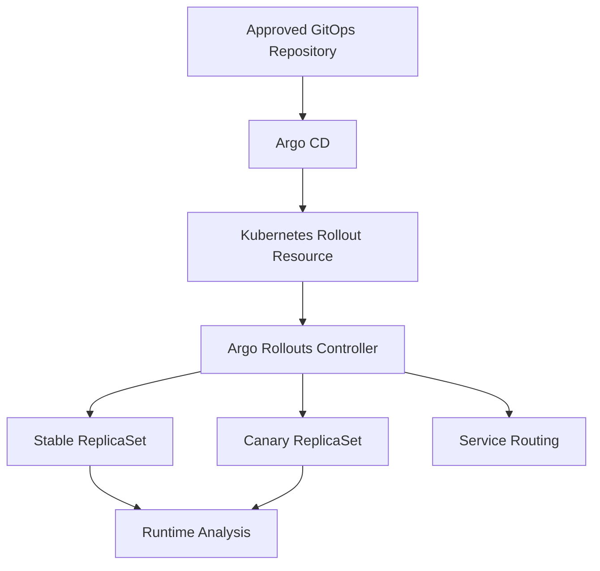
```mermaid
flowchart TD
    A["Approved GitOps Repository"]
    B["Argo CD"]
    C["Kubernetes Rollout Resource"]
    D["Argo Rollouts Controller"]

    E["Stable ReplicaSet"]
    F["Canary ReplicaSet"]
    G["Service Routing"]
    H["Runtime Analysis"]

    A --> B
    B --> C
    C --> D

    D --> E
    D --> F
    D --> G

    E --> H
    F --> H
```

This is the central distinction:

**Argo CD manages declarative desired state.**

**Argo Rollouts manages progressive transitions between application versions.**

They are complementary rather than interchangeable.

Argo Rollouts can also operate without Argo CD; it is a standalone Kubernetes controller. [Argo Project](https://argoproj.github.io/argo-rollouts/FAQ/?utm_source=chatgpt.com)

---

## 21. What is an Argo Rollouts `Rollout` resource?

A Kubernetes `Deployment` manages ReplicaSets and Pod replacement.

Argo Rollouts introduces another workload custom resource:

```yaml
apiVersion: argoproj.io/v1alpha1
kind: Rollout
```

This resource can define:

- Application replicas.
- Container image.
- Pod template.
- Canary steps.
- Blue-green services.
- Promotion pauses.
- Analysis requirements.
- Recovery-related behavior.

### Compare the resources

| Kubernetes Deployment | Argo Rollouts Rollout |
|---|---|
| Built-in Kubernetes resource | Custom resource supplied by Argo Rollouts |
| Managed by Deployment controller | Managed by Argo Rollouts controller |
| RollingUpdate and Recreate | Canary and blue-green strategies |
| Basic rollout controls | Progressive rollout steps and pauses |
| Kubernetes rollout status | Rollout status and optional analysis |
| No native metric-based canary progression | Analysis integration available |

### Important architectural boundary

For a particular workload, don't deploy an ordinary Deployment and an Argo Rollouts Rollout with overlapping selectors that independently manage the same Pods.

They would become competing workload controllers.

A strategy change from Deployment to Rollout is a **resource-ownership migration**, not merely an image change.

---

## 22. Three separate decisions in progressive delivery

We should distinguish:

### Decision A — Is this release authorized?

Owned by:

```text
Release Engineering
```

Evidence might include:

```text
Approved GitOps Pull Request
```

### Decision B — How should the release progress?

Owned by:

```text
Deployment Strategy Configuration
```

For example:

```text
20% Canary

Pause

40% Canary

Pause

100% Promotion
```

### Decision C — Should progression continue?

Owned by:

```text
Rollout Analysis or Authorized Operator
```

For example:

```text
Error rate below threshold?

Latency acceptable?

Business transactions functioning?
```

### Complete control structure

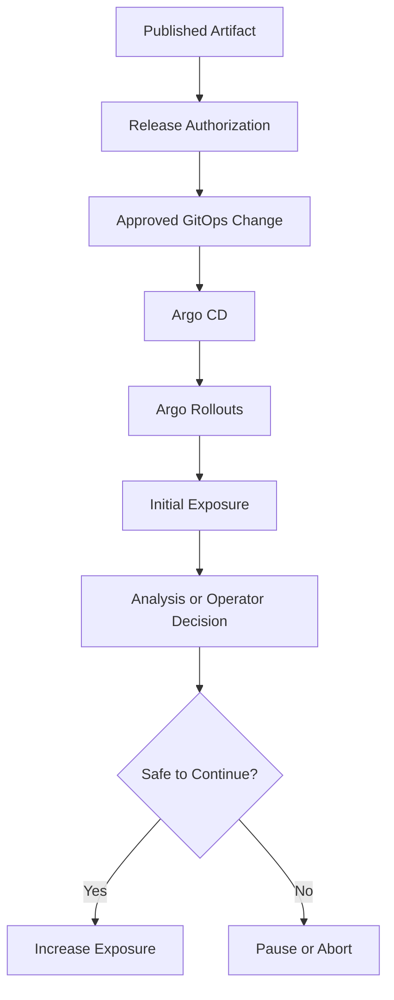
```mermaid
flowchart TD
    A["Published Artifact"]
    B["Release Authorization"]
    C["Approved GitOps Change"]
    D["Argo CD"]
    E["Argo Rollouts"]
    F["Initial Exposure"]
    G["Analysis or Operator Decision"]
    H{"Safe to Continue?"}
    I["Increase Exposure"]
    J["Pause or Abort"]

    A --> B
    B --> C
    C --> D
    D --> E
    E --> F
    F --> G
    G --> H

    H -->|Yes| I
    H -->|No| J
```

### Fundamental insight

> **Authorization controls which release may be introduced. Deployment strategy controls how it is introduced. Analysis controls whether introduction should continue.**

---

# Part IV — Practical Lab 13

## 23. Lab overview

We will conduct four experiments.

| Experiment | Mechanism | Learning objective |
|---|---|---|
| 1 | Kubernetes RollingUpdate | Gradual replacement and availability |
| 2 | Kubernetes Recreate | Replacement without version overlap |
| 3 | Argo Rollouts Blue-Green | Preview and active traffic switching |
| 4 | Argo Rollouts Canary | Partial exposure, pauses, and promotion |

Then we will integrate the canary configuration with our existing Argo CD installation.

### Why introduce `kubectl apply` experiments?

Because we want to observe Kubernetes deployment mechanics independently before adding the GitOps control loop.

The first experiments will use a **separate, unmanaged lab namespace**.

This avoids fighting with the Argo CD Application from Phase 11.

After understanding the mechanics, we will move the canary workload under Argo CD management.

### What we will not touch

Our existing application remains in:

```text
Namespace:
ecommerce-dev
```

Our experiments will use:

```text
Namespace:
delivery-strategies-lab
```

We will not modify the existing production or staging overlays.

---

## 24. Lab architecture

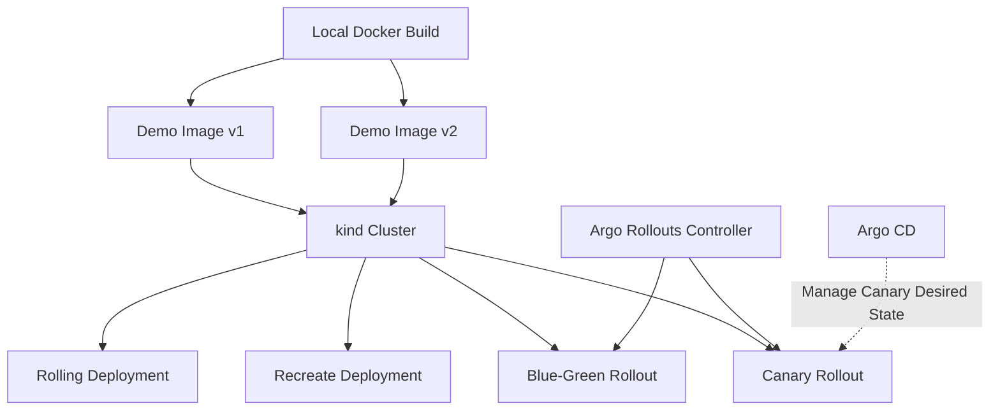
```mermaid
flowchart TD
    A["Local Docker Build"]
    B["Demo Image v1"]
    C["Demo Image v2"]

    D["kind Cluster"]

    E["Rolling Deployment"]
    F["Recreate Deployment"]
    G["Blue-Green Rollout"]
    H["Canary Rollout"]

    I["Argo Rollouts Controller"]
    J["Argo CD"]

    A --> B
    A --> C

    B --> D
    C --> D

    D --> E
    D --> F
    D --> G
    D --> H

    I --> G
    I --> H

    J -.->|"Manage Canary Desired State"| H
```

We will build two locally distinguishable versions of a simple Node.js API.

The images will not require registry publishing.

This keeps the experiment inexpensive and self-contained.

**Important:** For this isolated local lab, we will use local image tags. Our production delivery architecture from Phase 12 continues to require immutable, published image digests.

---

## 25. Prepare the project structure

Inside a new local working directory:

```bash
mkdir -p deployment-strategies-lab/demo
mkdir -p deployment-strategies-lab/rolling
mkdir -p deployment-strategies-lab/recreate
mkdir -p deployment-strategies-lab/bluegreen
mkdir -p deployment-strategies-lab/canary

cd deployment-strategies-lab
```

The structure will be:

```text
deployment-strategies-lab/
│
├── demo/
│   ├── server.js
│   └── Dockerfile
│
├── rolling/
│   └── deployment.yaml
│
├── recreate/
│   └── deployment.yaml
│
├── bluegreen/
│   └── rollout.yaml
│
└── canary/
    └── rollout.yaml
```

We will later copy the canary manifests into the GitOps repository.

---

## 26. Create the demonstration application

Create:

```text
demo/server.js
```

Add:

```javascript
const http = require("node:http");
const os = require("node:os");

const VERSION = process.env.APP_VERSION || "v1";

const FAIL_READINESS =
  process.env.FAIL_READINESS === "true";

const server = http.createServer((req, res) => {
  res.setHeader("Content-Type", "application/json");

  if (req.url === "/healthz") {
    res.writeHead(200);
    res.end(JSON.stringify({ status: "alive" }));
    return;
  }

  if (req.url === "/readyz") {
    const status = FAIL_READINESS ? 503 : 200;

    res.writeHead(status);

    res.end(
      JSON.stringify({
        ready: !FAIL_READINESS,
        version: VERSION
      })
    );

    return;
  }

  if (req.url === "/version") {
    res.writeHead(200);

    res.end(
      JSON.stringify({
        version: VERSION,
        pod: os.hostname()
      })
    );

    return;
  }

  res.writeHead(404);
  res.end(JSON.stringify({ error: "Not Found" }));
});

server.listen(3000, "0.0.0.0", () => {
  console.log(`Application ${VERSION} listening`);
});

process.on("SIGTERM", () => {
  console.log("SIGTERM received");

  server.close(() => {
    console.log("HTTP server closed");
  });
});
```

### Why this application?

Because it exposes three useful behaviors.

| Endpoint | Purpose |
|---|---|
| `/healthz` | Process liveness |
| `/readyz` | Serving readiness |
| `/version` | Identify which application version responded |

It also supports intentional readiness failures.

### Why include the hostname?

Because Kubernetes assigns different hostnames to different Pods.

The response helps us observe which Pod handled a request.

### Why include SIGTERM handling?

Because we want to demonstrate that old containers can close their HTTP server during termination.

This is not a complete production shutdown implementation, but it exposes the relevant lifecycle mechanism.

---

## 27. Create the Dockerfile

Create:

```text
demo/Dockerfile
```

Add:

```dockerfile
FROM node:22-alpine

ARG APP_VERSION=v1

ENV APP_VERSION=${APP_VERSION}

WORKDIR /app

COPY server.js .

USER node

EXPOSE 3000

CMD ["node", "server.js"]
```

### What does this image contain?

- Node.js runtime.
- A small HTTP application.
- A version identifier baked into the image.
- No npm dependencies.

### Why is this useful?

We can build two distinguishable images from the same source and different build arguments.

The application behavior will expose the selected version.

For this lab, the floating base-image tag simplifies setup. In a production build, control the base-image identity and update policy as discussed in Phase 07.

---

## 28. Build two application versions

Build v1:

```bash
docker build \
  -f demo/Dockerfile \
  --build-arg APP_VERSION=v1 \
  -t rollout-lab:v1 \
  demo/
```

Build v2:

```bash
docker build \
  -f demo/Dockerfile \
  --build-arg APP_VERSION=v2 \
  -t rollout-lab:v2 \
  demo/
```

Inspect:

```bash
docker images rollout-lab
```

Test one image locally:

```bash
docker run --rm \
  -p 3000:3000 \
  rollout-lab:v1
```

In another terminal:

```bash
curl -fsS http://localhost:3000/version
```

Expected:

```json
{
  "version": "v1",
  "pod": "..."
}
```

Stop the container after testing.

### What have we established?

We have two different application artifacts.

They respond to the same API contract but identify different versions.

This is sufficient for observing replacement behavior.

---

## 29. Load the images into kind

We will reuse the local cluster from Phase 11.

Verify the context:

```bash
kubectl config current-context
```

Expected:

```text
kind-argocd-lab
```

If the cluster was deleted, recreate it using the Phase 11 instructions.

Load the images:

```bash
kind load docker-image \
  rollout-lab:v1 \
  rollout-lab:v2 \
  --name argocd-lab
```

Create the lab namespace:

```bash
kubectl create namespace delivery-strategies-lab
```

Set a shell variable:

```bash
export NS=delivery-strategies-lab
```

### Why load the images?

Kind nodes have their own container runtime image storage.

A Docker image available on your workstation is not automatically available inside the kind node.

The `kind load docker-image` operation makes those images available to the selected kind cluster.

### Important detail

Our manifests will specify:

```yaml
imagePullPolicy: IfNotPresent
```

This allows Kubernetes to use the preloaded image if it is present on the node.

The local tags are appropriate for this experiment, but are not a substitute for digest-based release identity in a shared production environment.

---

# Part V — Experiment 1: RollingUpdate

## 30. Define the rolling deployment

Create:

```text
rolling/deployment.yaml
```

Add:

```yaml
apiVersion: apps/v1
kind: Deployment
metadata:
  name: rolling-demo
  namespace: delivery-strategies-lab
spec:
  replicas: 3

  revisionHistoryLimit: 5
  progressDeadlineSeconds: 60
  minReadySeconds: 3

  selector:
    matchLabels:
      app: rolling-demo

  strategy:
    type: RollingUpdate
    rollingUpdate:
      maxSurge: 1
      maxUnavailable: 0

  template:
    metadata:
      labels:
        app: rolling-demo

    spec:
      terminationGracePeriodSeconds: 30

      containers:
        - name: api
          image: rollout-lab:v1
          imagePullPolicy: IfNotPresent

          ports:
            - name: http
              containerPort: 3000

          readinessProbe:
            httpGet:
              path: /readyz
              port: http
            periodSeconds: 2
            failureThreshold: 2

          livenessProbe:
            httpGet:
              path: /healthz
              port: http
            periodSeconds: 5

          resources:
            requests:
              cpu: 25m
              memory: 32Mi
            limits:
              cpu: 250m
              memory: 128Mi

---
apiVersion: v1
kind: Service
metadata:
  name: rolling-demo
  namespace: delivery-strategies-lab
spec:
  selector:
    app: rolling-demo

  ports:
    - port: 80
      targetPort: 3000
```

### Understand the design

**Three replicas:** Enough to observe gradual replacement.

**`maxSurge: 1`:** Permit an additional Pod during the transition.

**`maxUnavailable: 0`:** Preserve the desired available replica count during normal rolling replacement.

**`minReadySeconds: 3`:** Require a Pod to remain ready for a short period before considering it available for rollout calculations.

**`progressDeadlineSeconds: 60`:** Define when the rollout should report inadequate progress.

**Readiness probe:** Prevent unhealthy new Pods from becoming ready Service endpoints.

**Liveness probe:** Detect an unresponsive application process.

---

## 31. Deploy v1 and observe the baseline

Apply the manifest:

```bash
kubectl apply -f rolling/deployment.yaml
```

Wait:

```bash
kubectl rollout status \
  deployment/rolling-demo \
  -n "$NS"
```

Inspect:

```bash
kubectl get pods \
  -n "$NS" \
  -l app=rolling-demo \
  -o wide
```

You should see three ready Pods.

### Verify service behavior

In one terminal:

```bash
kubectl port-forward \
  -n "$NS" \
  service/rolling-demo \
  18090:80
```

In another terminal:

```bash
curl -fsS http://localhost:18090/version
```

Expected version:

```text
v1
```

### Baseline evidence

Record:

```text
Replicas: 3

Application version: v1

Readiness: Passing

Service: Reachable
```

This is the known starting state.

---

## 32. Start the rolling update

Now update the Deployment's image:

```bash
kubectl set image \
  deployment/rolling-demo \
  api=rollout-lab:v2 \
  -n "$NS"
```

In another terminal, watch Pods:

```bash
kubectl get pods \
  -n "$NS" \
  -l app=rolling-demo \
  --watch
```

Also inspect ReplicaSets:

```bash
kubectl get replicasets \
  -n "$NS" \
  -l app=rolling-demo
```

### What should you observe?

The controller should gradually introduce v2 Pods.

It should wait for new capacity to become available before removing old available capacity.

Eventually:

```text
v2 v2 v2
```

### Verify the completed rollout

```bash
kubectl rollout status \
  deployment/rolling-demo \
  -n "$NS"
```

Then:

```bash
curl -fsS http://localhost:18090/version
```

If port forwarding was interrupted during Pod replacement, restart it before testing again.

### Important lesson

**RollingUpdate replaces instances incrementally instead of performing an all-at-once cutover.**

But its safety depends on readiness, capacity, compatibility, and termination behavior.

---

## 33. Failure experiment — New Pods never become ready

Now let's introduce a controlled failure.

First, our system is running healthy v2.

We will request a new Pod template that fails readiness.

Run:

```bash
kubectl set env \
  deployment/rolling-demo \
  FAIL_READINESS=true \
  -n "$NS"
```

This changes the Deployment's Pod template and triggers a new rollout.

### Predict the result

The new Pods return HTTP 503 from:

```text
/readyz
```

They should fail readiness checks.

With:

```yaml
maxUnavailable: 0
```

The controller should avoid deliberately removing the existing available Pods merely to progress the update.

### Observe

```bash
kubectl get pods \
  -n "$NS" \
  -l app=rolling-demo \
  --watch
```

In another terminal:

```bash
kubectl rollout status \
  deployment/rolling-demo \
  -n "$NS" \
  --timeout=75s
```

The rollout should fail to complete while the new Pods remain unready.

Inspect the Deployment's conditions:

```bash
kubectl describe deployment rolling-demo \
  -n "$NS"
```

Look for:

```text
ProgressDeadlineExceeded
```

after the configured deadline is exceeded.

### What did Kubernetes do correctly?

It refused to treat the new unready Pods as suitable replacements.

### What did Kubernetes not do automatically?

It did not necessarily restore the previous Deployment specification.

The failed desired Pod template remains configured until another action changes it.

### Recover

For this **unmanaged local experiment**, use:

```bash
kubectl rollout undo \
  deployment/rolling-demo \
  -n "$NS"
```

Then:

```bash
kubectl rollout status \
  deployment/rolling-demo \
  -n "$NS"
```

### GitOps qualification

This Deployment is intentionally not tracked by Argo CD.

In a GitOps-managed environment, directly undoing the live Deployment can conflict with the authoritative Git configuration.

The normal recovery decision should be expressed through the approved desired-state source.

---

# Part VI — Experiment 2: Recreate

## 34. Define the Recreate deployment

Create:

```text
recreate/deployment.yaml
```

Add:

```yaml
apiVersion: apps/v1
kind: Deployment
metadata:
  name: recreate-demo
  namespace: delivery-strategies-lab
spec:
  replicas: 2

  selector:
    matchLabels:
      app: recreate-demo

  strategy:
    type: Recreate

  template:
    metadata:
      labels:
        app: recreate-demo

    spec:
      containers:
        - name: api
          image: rollout-lab:v1
          imagePullPolicy: IfNotPresent

          ports:
            - containerPort: 3000

          readinessProbe:
            httpGet:
              path: /readyz
              port: 3000

          resources:
            requests:
              cpu: 25m
              memory: 32Mi

---
apiVersion: v1
kind: Service
metadata:
  name: recreate-demo
  namespace: delivery-strategies-lab
spec:
  selector:
    app: recreate-demo

  ports:
    - port: 80
      targetPort: 3000
```

Apply:

```bash
kubectl apply -f recreate/deployment.yaml
```

Wait:

```bash
kubectl rollout status \
  deployment/recreate-demo \
  -n "$NS"
```

### Baseline

```text
Two v1 Pods

Both Ready
```

---

## 35. Replace v1 with v2

Start watching Pods:

```bash
kubectl get pods \
  -n "$NS" \
  -l app=recreate-demo \
  --watch
```

In another terminal:

```bash
kubectl set image \
  deployment/recreate-demo \
  api=rollout-lab:v2 \
  -n "$NS"
```

### Expected transition

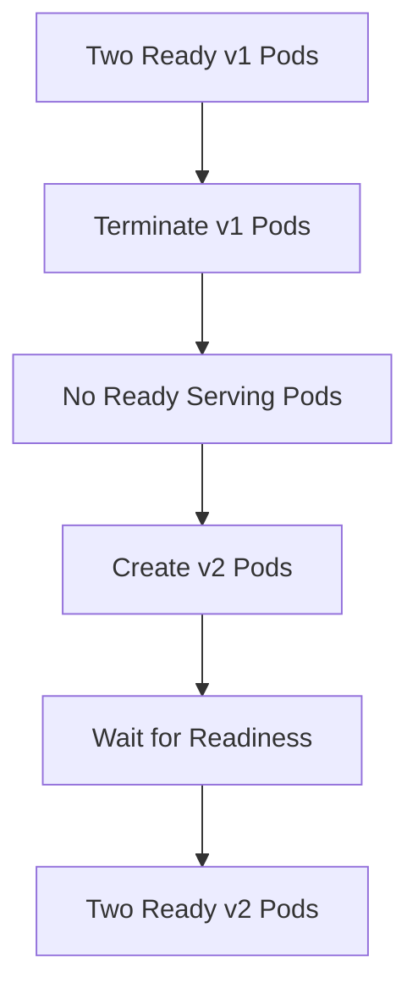
```mermaid
flowchart TD
    A["Two Ready v1 Pods"]
    B["Terminate v1 Pods"]
    C["No Ready Serving Pods"]
    D["Create v2 Pods"]
    E["Wait for Readiness"]
    F["Two Ready v2 Pods"]

    A --> B
    B --> C
    C --> D
    D --> E
    E --> F
```

### What should you observe?

Old Pods are terminated before the new revision's Pods are created as part of the Recreate update.

The Service may temporarily have no ready application endpoints.

### Important practical caveat

This demo application starts quickly.

The gap may be brief.

A single manually issued `curl` request may not happen during the gap.

To demonstrate it more clearly, you can repeatedly query the Service while the update runs, or introduce a controlled startup delay in a separate experiment.

### What does this prove?

Recreate can be simple, but it accepts an interruption window when no alternate serving capacity exists.

### When could it still be correct?

When:

- Downtime is acceptable.
- Version coexistence is unsafe.
- Additional capacity is unavailable.
- The release is scheduled during maintenance.

**Simple does not mean wrong. It means the trade-off must be acceptable.**

---

# Part VII — Experiment 3: Blue-Green With Argo Rollouts

## 36. Install Argo Rollouts

Kubernetes Deployments provide RollingUpdate and Recreate strategies.

For blue-green and progressive canary control, we will introduce Argo Rollouts.

As of October 9, 2026, the latest stable Argo Rollouts release listed on GitHub is **v1.10.0**. We'll pin that version for the lab rather than relying on a moving `latest` reference. [github.com](https://github.com/argoproj/argo-rollouts/releases?utm_source=chatgpt.com)

### Step 1 — Confirm the correct cluster

```bash
test "$(kubectl config current-context)" = "kind-argocd-lab" \
  || {
    echo "Wrong Kubernetes context"
    exit 1
  }
```

### Step 2 — Create the controller namespace

```bash
kubectl create namespace argo-rollouts
```

### Step 3 — Install the controller

```bash
kubectl apply \
  -n argo-rollouts \
  -f https://github.com/argoproj/argo-rollouts/releases/download/v1.10.0/install.yaml
```

This follows the official manifest installation method, using a pinned release instead of the `latest` download URL. [github.com](https://github.com/argoproj/argo-rollouts/blob/master/docs/installation.md?utm_source=chatgpt.com)

### Step 4 — Verify

```bash
kubectl get pods -n argo-rollouts
```

Check the CRDs:

```bash
kubectl get crd | grep argoproj.io
```

You should now have access to resources such as:

```text
Rollout

AnalysisTemplate

AnalysisRun

Experiment
```

### Important distinction

Argo CD and Argo Rollouts are different controllers.

```text
Argo CD:
Reads desired application configuration.
```

```text
Argo Rollouts:
Manages progressive replacement and traffic-selection behavior.
```

We now have both in the same local cluster.

---

## 37. Install the Argo Rollouts kubectl plugin

The Argo Rollouts plugin is useful for inspecting and controlling progressive rollouts.

For Linux x86-64:

```bash
curl -fL \
  -o kubectl-argo-rollouts \
  https://github.com/argoproj/argo-rollouts/releases/download/v1.10.0/kubectl-argo-rollouts-linux-amd64
```

Verify the downloaded artifact against the release's published checksum before installing it.

Make it executable:

```bash
chmod +x kubectl-argo-rollouts
```

Move it into your PATH:

```bash
sudo mv kubectl-argo-rollouts \
  /usr/local/bin/kubectl-argo-rollouts
```

Verify:

```bash
kubectl argo rollouts version
```

The plugin is optional, but it provides convenient status, promotion, and abortion commands.

If your machine is ARM64 or uses another operating system, select the appropriate release asset instead.

The official installation guide documents the available plugin installation methods. [Argo Project](https://argoproj.github.io/argo-rollouts/installation/?utm_source=chatgpt.com)

---

## 38. Create a blue-green Rollout

Create:

```text
bluegreen/rollout.yaml
```

Add:

```yaml
apiVersion: argoproj.io/v1alpha1
kind: Rollout
metadata:
  name: bluegreen-demo
  namespace: delivery-strategies-lab
spec:
  replicas: 2
  revisionHistoryLimit: 3

  selector:
    matchLabels:
      app: bluegreen-demo

  template:
    metadata:
      labels:
        app: bluegreen-demo

    spec:
      containers:
        - name: api
          image: rollout-lab:v1
          imagePullPolicy: IfNotPresent

          ports:
            - containerPort: 3000

          readinessProbe:
            httpGet:
              path: /readyz
              port: 3000
            periodSeconds: 2

          resources:
            requests:
              cpu: 25m
              memory: 32Mi

  strategy:
    blueGreen:
      activeService: bluegreen-active
      previewService: bluegreen-preview
      autoPromotionEnabled: false
      scaleDownDelaySeconds: 30

---
apiVersion: v1
kind: Service
metadata:
  name: bluegreen-active
  namespace: delivery-strategies-lab
spec:
  selector:
    app: bluegreen-demo

  ports:
    - port: 80
      targetPort: 3000

---
apiVersion: v1
kind: Service
metadata:
  name: bluegreen-preview
  namespace: delivery-strategies-lab
spec:
  selector:
    app: bluegreen-demo

  ports:
    - port: 80
      targetPort: 3000
```

### What is special about this manifest?

Notice:

```yaml
strategy:
  blueGreen:
    activeService: bluegreen-active
    previewService: bluegreen-preview
    autoPromotionEnabled: false
```

These are the important fields.

### `activeService`

Selects the currently active application revision.

### `previewService`

Provides an endpoint for the new revision before it is promoted.

### `autoPromotionEnabled: false`

Stops automatic promotion of an updated, ready preview revision.

An authorized operator or process must promote it.

### `scaleDownDelaySeconds`

Keeps the previous active ReplicaSet available temporarily after the traffic switch.

This can help accommodate routing propagation and recovery considerations.

Argo Rollouts documents this blue-green lifecycle and Service behavior. [Argo Project](https://argoproj.github.io/argo-rollouts/features/bluegreen/?utm_source=chatgpt.com)

---

## 39. Deploy the initial blue version

Apply:

```bash
kubectl apply -f bluegreen/rollout.yaml
```

Inspect:

```bash
kubectl argo rollouts get rollout \
  bluegreen-demo \
  -n "$NS"
```

Wait for the initial version to become healthy.

The initial creation is a baseline deployment, not an update from an existing stable version, so there is no previous blue-green revision requiring a cutover decision.

### Verify active service

Port-forward:

```bash
kubectl port-forward \
  -n "$NS" \
  service/bluegreen-active \
  18091:80
```

In another terminal:

```bash
curl -fsS http://localhost:18091/version
```

Expected:

```text
v1
```

### Current state

```text
Active Version:
v1
```

```text
Preview Version:
Initially v1
```

Now we are ready to introduce v2.

---

## 40. Prepare the green version

Run:

```bash
kubectl argo rollouts set image \
  bluegreen-demo \
  api=rollout-lab:v2 \
  -n "$NS"
```

Observe:

```bash
kubectl argo rollouts get rollout \
  bluegreen-demo \
  -n "$NS" \
  --watch
```

### Expected behavior

Argo Rollouts creates a new ReplicaSet for v2.

The preview Service selects the new revision.

The active Service continues selecting the old stable revision.

Once the new Pods become ready, the Rollout should pause before promotion.

### Architecture

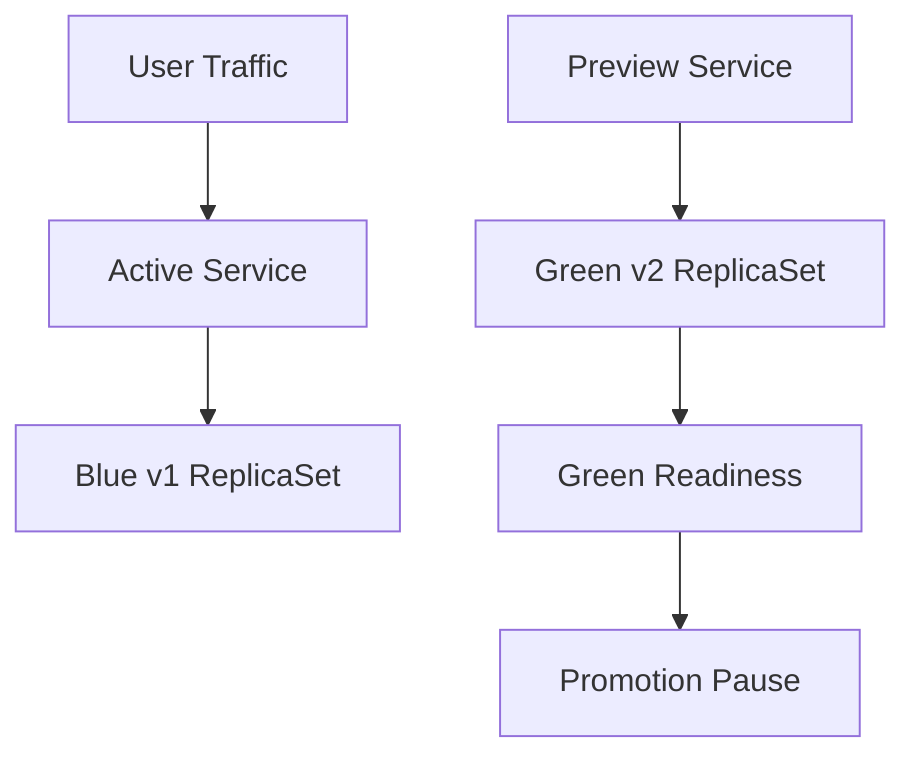
```mermaid
flowchart TD
    A["User Traffic"]
    B["Active Service"]
    C["Blue v1 ReplicaSet"]

    D["Preview Service"]
    E["Green v2 ReplicaSet"]
    F["Green Readiness"]
    G["Promotion Pause"]

    A --> B
    B --> C

    D --> E
    E --> F
    F --> G
```

### What have we gained?

We can test the new version without changing the version currently selected by the active Service.

---

## 41. Test the preview version

Open another terminal:

```bash
kubectl port-forward \
  -n "$NS" \
  service/bluegreen-preview \
  18092:80
```

Now verify both endpoints.

Active:

```bash
curl -fsS http://localhost:18091/version
```

Expected:

```text
v1
```

Preview:

```bash
curl -fsS http://localhost:18092/version
```

Expected:

```text
v2
```

### Why is this experiment important?

Because it demonstrates a separation between:

```text
New Version Is Running
```

And:

```text
New Version Is Serving Normal Users
```

Those are different states.

### What should production verification include?

For a real application:

- Startup and readiness.
- Database connectivity.
- Critical business endpoints.
- Configuration correctness.
- Compatibility.
- Relevant performance tests.

Our `/version` endpoint is only a demonstration.

It is not a complete production acceptance test.

---

## 42. Promote green to active

After verifying the preview:

```bash
kubectl argo rollouts promote \
  bluegreen-demo \
  -n "$NS"
```

Observe:

```bash
kubectl argo rollouts get rollout \
  bluegreen-demo \
  -n "$NS" \
  --watch
```

Argo Rollouts should update the active Service to select the v2 ReplicaSet.

### Verify

```bash
curl -fsS http://localhost:18091/version
```

Expected after promotion:

```text
v2
```

### What changed?

The active Service's selected backend revision changed.

The application image was not rebuilt.

The v2 ReplicaSet already existed before promotion.

### What should you inspect?

```bash
kubectl get services \
  bluegreen-active \
  bluegreen-preview \
  -n "$NS" \
  -o yaml
```

Look at the selectors.

Argo Rollouts manages the revision-specific routing selectors.

### Important principle

> **Blue-green promotion is fundamentally a routing and release-state transition, not necessarily a new container build.**

---

## 43. Blue-green failure experiment

Imagine Green fails readiness.

What should happen?

Before active promotion:

```text
Blue:
Healthy
```

```text
Green:
Not Ready
```

With appropriate blue-green configuration, the controller should not promote the unready new revision merely because it exists.

The active Service continues selecting the stable version.

### What does this protect?

It helps avoid replacing a healthy active backend with an unready candidate.

### What does it not protect?

A new version can pass readiness and still contain a serious business defect.

That is why pre-promotion and post-promotion verification remain important.

---

# Part VIII — Experiment 4: Canary With Argo Rollouts

## 44. Define the canary policy before writing YAML

Our requirements:

```text
Application:
Node.js Demo
```

```text
Desired replicas:
5
```

```text
Initial canary:
20%
```

```text
Promotion:
Manual
```

```text
Next stage:
40%
```

```text
Final promotion:
After another manual check
```

```text
External traffic router:
Not installed
```

### Why five replicas?

Because this permits an approximate 20% replica allocation:

```text
1 Canary Pod

4 Stable Pods
```

It will not guarantee that exactly 20% of HTTP requests reach the new version.

### What are we teaching?

- Stable and canary ReplicaSets.
- Progressive replacement.
- Manual pause gates.
- Version observation.
- Promotion and abortion.
- The difference between replica allocation and traffic routing.

---

## 45. Create the canary Rollout

Create:

```text
canary/rollout.yaml
```

Add:

```yaml
apiVersion: argoproj.io/v1alpha1
kind: Rollout
metadata:
  name: canary-demo
  namespace: delivery-strategies-lab
spec:
  replicas: 5
  revisionHistoryLimit: 3

  selector:
    matchLabels:
      app: canary-demo

  template:
    metadata:
      labels:
        app: canary-demo

    spec:
      containers:
        - name: api
          image: rollout-lab:v1
          imagePullPolicy: IfNotPresent

          ports:
            - containerPort: 3000

          readinessProbe:
            httpGet:
              path: /readyz
              port: 3000
            periodSeconds: 2

          resources:
            requests:
              cpu: 25m
              memory: 32Mi

  strategy:
    canary:
      maxSurge: 1
      maxUnavailable: 0

      steps:
        - setWeight: 20
        - pause: {}

        - setWeight: 40
        - pause: {}

        - setWeight: 100

---
apiVersion: v1
kind: Service
metadata:
  name: canary-demo
  namespace: delivery-strategies-lab
spec:
  selector:
    app: canary-demo

  ports:
    - port: 80
      targetPort: 3000
```

### What does `setWeight` do?

In this no-router setup, Argo Rollouts uses ReplicaSet scaling to approximate the requested exposure weight.

### What does `pause: {}` do?

It creates an indefinite pause.

The rollout requires a promotion action to continue.

### Why not automatically promote after a fixed duration?

Because we want to introduce an explicit verification decision.

### Important limitation

We have not configured automated metric analysis.

A human must evaluate the candidate during each pause.

The official Argo Rollouts getting-started guide uses the same basic canary step concepts. [Argo Project](https://argoproj.github.io/argo-rollouts/getting-started/?utm_source=chatgpt.com)

---

## 46. Initial canary deployment

For the moment, we will create the initial workload directly.

This first demonstration is not yet managed by Argo CD.

Apply:

```bash
kubectl apply -f canary/rollout.yaml
```

Inspect:

```bash
kubectl argo rollouts get rollout \
  canary-demo \
  -n "$NS"
```

Wait until the initial v1 ReplicaSet is ready.

### Important first-deployment behavior

Argo Rollouts does not normally run a canary progression between two versions when the Rollout is created for the first time.

There is no older stable revision to compare with.

The initial deployment establishes the stable baseline.

---

## 47. Introduce the v2 canary

Run:

```bash
kubectl argo rollouts set image \
  canary-demo \
  api=rollout-lab:v2 \
  -n "$NS"
```

Watch:

```bash
kubectl argo rollouts get rollout \
  canary-demo \
  -n "$NS" \
  --watch
```

### Expected progression

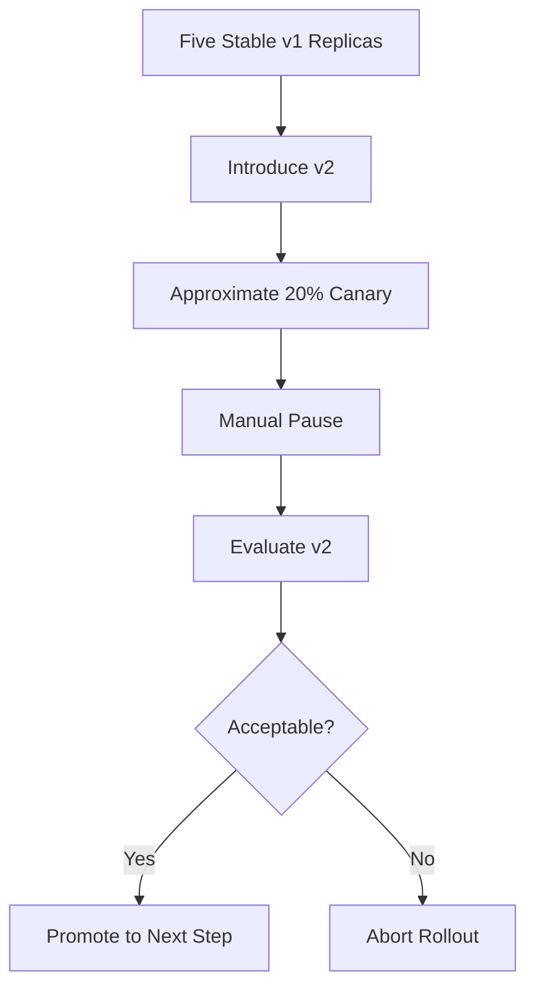
```mermaid
flowchart TD
    A["Five Stable v1 Replicas"]
    B["Introduce v2"]
    C["Approximate 20% Canary"]
    D["Manual Pause"]
    E["Evaluate v2"]
    F{"Acceptable?"}
    G["Promote to Next Step"]
    H["Abort Rollout"]

    A --> B
    B --> C
    C --> D
    D --> E
    E --> F

    F -->|Yes| G
    F -->|No| H
```

### What should you observe?

Argo Rollouts should introduce new-version Pods.

At the first stage, you should see a mixture of stable and canary versions.

The exact number of Pods at an instant may include surge or terminating Pods.

Don't infer the actual request distribution from a single `kubectl get pods` output.

---

## 48. Inspect stable and canary versions

Run:

```bash
kubectl get pods \
  -n "$NS" \
  -l app=canary-demo \
  -o wide
```

Inspect the corresponding ReplicaSets:

```bash
kubectl get replicasets \
  -n "$NS" \
  -l app=canary-demo
```

Now test through the Service.

Open another terminal:

```bash
kubectl port-forward \
  -n "$NS" \
  service/canary-demo \
  18093:80
```

Run:

```bash
curl -fsS http://localhost:18093/version
```

Repeat several times.

Depending on which backend is selected, you may observe:

```json
{
  "version": "v1",
  "pod": "..."
}
```

Or:

```json
{
  "version": "v2",
  "pod": "..."
}
```

### Important measurement caveat

Repeated requests through `kubectl port-forward` are useful for inspecting backend selection, but they are **not a reliable measurement of canary traffic percentage**.

Port forwarding can select a particular backend Pod, and connections can remain associated with that target.

For meaningful traffic-distribution testing, send independent requests through an appropriate Service or ingress data path from inside the cluster, or use a configured traffic router with relevant telemetry.

### Better evidence for this lab

Use:

```bash
kubectl argo rollouts get rollout \
  canary-demo \
  -n "$NS"
```

Combined with:

```bash
kubectl get replicasets \
  -n "$NS" \
  -l app=canary-demo
```

This shows the controller's progression and the ReplicaSet allocation directly.

---

## 49. Promote through the canary stages

The rollout is paused after the first `setWeight` step.

After inspecting the candidate, promote:

```bash
kubectl argo rollouts promote \
  canary-demo \
  -n "$NS"
```

The rollout should advance toward the next configured step.

Inspect:

```bash
kubectl argo rollouts get rollout \
  canary-demo \
  -n "$NS"
```

At the next indefinite pause, examine:

- Stable ReplicaSet.
- Canary ReplicaSet.
- Ready Pods.
- Container logs.
- Version responses.
- Any relevant failures.

Then promote again:

```bash
kubectl argo rollouts promote \
  canary-demo \
  -n "$NS"
```

Eventually, the rollout should complete with v2 as the stable version.

### What did we learn?

We controlled deployment exposure using declarative rollout steps and explicit promotion decisions.

But note:

**Our lab demonstrates manual gates, not automatic evidence-based progressive delivery.**

The next section explains how runtime analysis can automate those decisions.

---

# Part IX — Metrics-Driven Progressive Delivery

## 50. Why pauses alone are not enough

Suppose a canary has been running for five minutes.

No engineer has reported a problem.

Is it safe to promote?

Not necessarily.

The absence of a human complaint is weak evidence.

We need defined acceptance conditions.

### Example policy

```text
HTTP 5xx Error Rate:
Below 1%
```

```text
P95 Request Latency:
Below 300 ms
```

```text
Critical Business Operations:
Successful
```

```text
Minimum Observations:
Sufficient to support a meaningful decision
```

These are example thresholds. Appropriate values depend on the application's service objectives and workload.

### The deeper problem

A monitoring metric tells us what was measured.

A release policy tells us how to interpret it.

We need both.

---

## 51. Derive an analysis-based canary gate

A useful progressive-delivery gate has five parts.

**1. Measurement source**

Where does the data come from?

For example:

```text
Prometheus
```

**2. Target population**

Which requests are being evaluated?

For example:

```text
Canary API Requests
```

**3. Observation window**

Over what period?

For example:

```text
Last 5 Minutes
```

**4. Acceptance condition**

What result is acceptable?

For example:

```text
Success Rate >= 99%
```

**5. Failure policy**

What happens when the condition fails or measurements are unavailable?

For example:

```text
Pause or Abort
```

### Control architecture

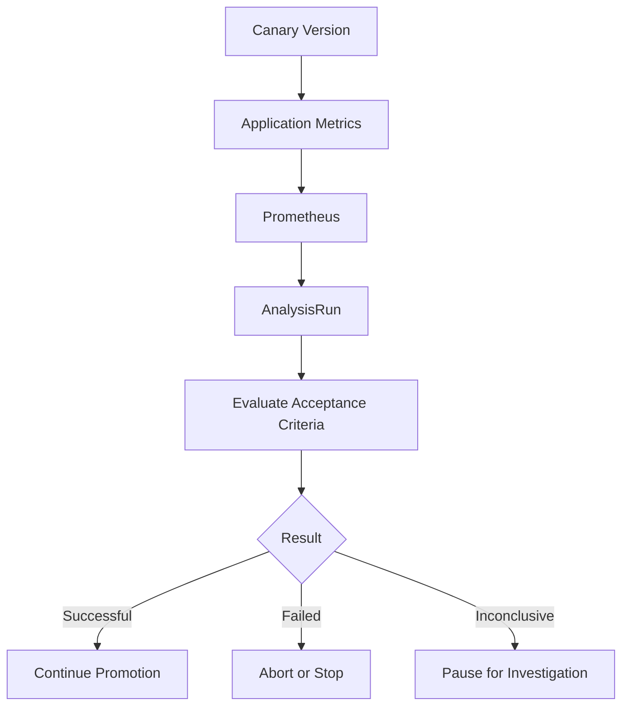
```mermaid
flowchart TD
    A["Canary Version"]
    B["Application Metrics"]
    C["Prometheus"]
    D["AnalysisRun"]
    E["Evaluate Acceptance Criteria"]
    F{"Result"}
    G["Continue Promotion"]
    H["Abort or Stop"]
    I["Pause for Investigation"]

    A --> B
    B --> C
    C --> D
    D --> E
    E --> F

    F -->|Successful| G
    F -->|Failed| H
    F -->|Inconclusive| I
```

Argo Rollouts supports `AnalysisTemplate`, `AnalysisRun`, and several metric providers for this purpose. [Argo Project](https://argoproj.github.io/argo-rollouts/features/analysis/?utm_source=chatgpt.com)

---

## 52. Example AnalysisTemplate

This is an architectural example, not part of the base executable lab.

It assumes:

- A working Prometheus server.
- Correctly instrumented application metrics.
- A query that returns the expected result.
- Appropriate label values.
- Sufficient traffic for analysis.

```yaml
apiVersion: argoproj.io/v1alpha1
kind: AnalysisTemplate
metadata:
  name: api-success-rate
spec:
  metrics:
    - name: success-rate
      interval: 1m
      count: 5
      failureLimit: 1

      successCondition: result[0] >= 0.99

      provider:
        prometheus:
          address: http://prometheus.monitoring.svc:9090

          query: |
            sum(
              rate(
                http_requests_total{
                  service="ecommerce-api",
                  version="v2",
                  status!~"5.."
                }[5m]
              )
            )
            /
            sum(
              rate(
                http_requests_total{
                  service="ecommerce-api",
                  version="v2"
                }[5m]
              )
            )
```

### Understand the design

The query estimates the fraction of observed requests that did not return HTTP 5xx responses.

The analysis condition requires:

```text
Success Rate >= 99%
```

### What could go wrong?

- The application does not expose this metric.
- Label names differ.
- There is insufficient traffic.
- The denominator is zero.
- Prometheus is unavailable.
- Measurements are delayed.
- HTTP success does not imply business success.

An undefined, empty, or inconclusive measurement must not silently become proof that the release is healthy.

### Statistical limitation

Even five successful observations do not establish universal correctness.

A rare defect may require substantial traffic or targeted synthetic testing to detect.

For a robust canary strategy, also consider:

- Baseline-versus-canary comparison.
- Confidence and sample size.
- Request mix.
- Geographic distribution.
- Business metrics.
- Dependency behavior.

### Important principle

> **Canary safety depends more on the quality of its evidence and decisions than on the number of rollout steps.**

---

# Part X — Connect Canary Deployment to Argo CD

## 53. The problem with our current canary experiment

So far, we changed the canary image using:

```bash
kubectl argo rollouts set image \
  canary-demo \
  api=rollout-lab:v2 \
  -n "$NS"
```

That was useful for learning the controller's behavior.

But it bypassed our normal GitOps release path.

Remember Phase 10:

**Approved desired state should be recorded in Git.**

We now want:

```text
Git Commit
      |
      v
Argo CD
      |
      v
Argo Rollouts
      |
      v
Progressive Kubernetes Deployment
```

This is where the complete system becomes interesting.

We need two reconciliation responsibilities:

1. Argo CD must ensure the Rollout specification matches approved Git configuration.
2. Argo Rollouts must manage the transition of ReplicaSets and their traffic exposure.

### Architecture

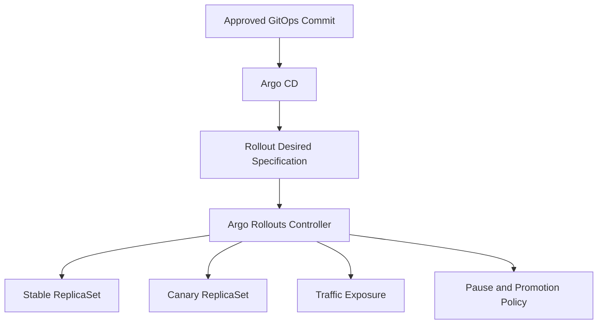
```mermaid
flowchart TD
    A["Approved GitOps Commit"]
    B["Argo CD"]
    C["Rollout Desired Specification"]
    D["Argo Rollouts Controller"]

    E["Stable ReplicaSet"]
    F["Canary ReplicaSet"]
    G["Traffic Exposure"]
    H["Pause and Promotion Policy"]

    A --> B
    B --> C
    C --> D

    D --> E
    D --> F
    D --> G
    D --> H
```

### Critical principle

**Argo CD owns the declared Rollout configuration.**

**Argo Rollouts owns the progression of the running workload toward that configuration.**

Do not confuse those responsibilities.

---

## 54. Move the canary configuration into GitOps

Open your existing GitOps repository:

```bash
cd ~/Desktop/release-gitops-lab
```

Adjust the path if needed.

Create:

```bash
mkdir -p strategy-lab/canary
mkdir -p argocd/bootstrap
```

Copy the canary manifest from your local deployment-strategies lab:

```bash
cp \
  ~/Desktop/deployment-strategies-lab/canary/rollout.yaml \
  strategy-lab/canary/rollout.yaml
```

Make sure the image reference in the copied manifest is:

```yaml
image: rollout-lab:v1
```

This establishes the initial stable release.

Create:

```text
strategy-lab/canary/kustomization.yaml
```

Add:

```yaml
apiVersion: kustomize.config.k8s.io/v1beta1
kind: Kustomization

resources:
  - rollout.yaml
```

Validate rendering:

```bash
kubectl kustomize strategy-lab/canary
```

### Important distinction

The image:

```text
rollout-lab:v1
```

is a locally preloaded kind image.

This is appropriate for our disposable local demonstration.

For a production GitOps repository, replace this with a published, immutable image digest.

---

## 55. Avoid competing ownership during migration

Our canary workload currently exists because we created it manually.

Before enabling Argo CD management, we should establish a clean ownership transition.

For this lab, the simplest approach is to delete only the existing demonstration canary workload and its Service, then allow Argo CD to create them from Git.

Verify the context:

```bash
kubectl config current-context
```

It must be:

```text
kind-argocd-lab
```

Delete the unmanaged canary:

```bash
kubectl delete rollout canary-demo \
  -n delivery-strategies-lab
```

Delete its Service:

```bash
kubectl delete service canary-demo \
  -n delivery-strategies-lab
```

Do not delete the namespace, Argo CD, or the existing `ecommerce-dev` Application.

### Why do this?

Because we want one clearly defined authority for the canary desired-state configuration.

After this point:

- GitOps records the Rollout specification.
- Argo CD reconciles that specification.
- Argo Rollouts manages its runtime progression.

### Production qualification

Deleting a workload is not a suitable general-purpose migration procedure for a live production application.

Production ownership migration requires an explicit plan to avoid deleting serving Pods or unintentionally changing traffic.

Our approach is safe here because the workload is an isolated demonstration.

---

## 56. Create a dedicated AppProject

Create:

```text
argocd/bootstrap/strategy-lab-project.yaml
```

Add:

```yaml
apiVersion: argoproj.io/v1alpha1
kind: AppProject
metadata:
  name: strategy-lab-dev
  namespace: argocd
spec:
  description: Local progressive-delivery laboratory

  sourceRepos:
    - https://github.com/YOUR_OWNER/release-gitops-lab.git

  destinations:
    - server: https://kubernetes.default.svc
      namespace: delivery-strategies-lab
```

Replace `YOUR_OWNER` with your actual GitHub owner.

### Why create another AppProject?

Because our existing Phase 11 project was restricted to:

```text
ecommerce-dev
```

This experiment targets:

```text
delivery-strategies-lab
```

Rather than weakening the existing project's destination rules, we define a separate intended boundary.

### Important security insight

**A deployment permission problem should not automatically be solved by broadening existing permissions.**

Instead, identify which authority the new workload actually needs.

---

## 57. Create the Argo CD Application

Create:

```text
argocd/bootstrap/strategy-lab-app.yaml
```

Add:

```yaml
apiVersion: argoproj.io/v1alpha1
kind: Application
metadata:
  name: strategy-lab-canary
  namespace: argocd

spec:
  project: strategy-lab-dev

  source:
    repoURL: https://github.com/YOUR_OWNER/release-gitops-lab.git
    targetRevision: main
    path: strategy-lab/canary

  destination:
    server: https://kubernetes.default.svc
    namespace: delivery-strategies-lab

  syncPolicy:
    automated:
      enabled: true
      prune: false
      selfHeal: true

    syncOptions:
      - FailOnSharedResource=true
```

### What does this establish?

Argo CD now has an Application definition linking:

```text
Git Repository
      +
Git Revision
      +
Manifest Path
      +
Destination Namespace
      +
Synchronization Policy
```

The Application will manage the `Rollout` and `Service` resources declared in that path.

---

## 58. Commit the desired state

Commit the new GitOps configuration:

```bash
git add \
  strategy-lab/canary/ \
  argocd/bootstrap/strategy-lab-project.yaml \
  argocd/bootstrap/strategy-lab-app.yaml
```

```bash
git commit -m "gitops: define progressive delivery laboratory"
```

Push and merge through the repository's configured process so these files are present on `main`.

### Why commit before bootstrap?

Because the Application will reference the remote Git repository.

It needs the desired manifests to exist at the configured path and revision.

---

## 59. Bootstrap the Application

After the files are available on the authoritative GitOps branch, apply the bootstrap objects.

First, the AppProject:

```bash
kubectl apply \
  -f argocd/bootstrap/strategy-lab-project.yaml
```

Then, the Application:

```bash
kubectl apply \
  -f argocd/bootstrap/strategy-lab-app.yaml
```

Inspect:

```bash
kubectl get applications -n argocd
```

You should see:

```text
ecommerce-dev

strategy-lab-canary
```

Inspect:

```bash
kubectl get application strategy-lab-canary \
  -n argocd
```

### What should happen?

Argo CD retrieves:

```text
strategy-lab/canary
```

Kustomize renders the Rollout and Service.

Argo CD creates the resources.

Argo Rollouts creates the initial v1 ReplicaSet and Pods.

### Verify

```bash
kubectl get rollout canary-demo \
  -n "$NS"
```

Then:

```bash
kubectl argo rollouts get rollout \
  canary-demo \
  -n "$NS"
```

Remember that the image must already be loaded into kind.

---

## 60. Trigger the canary using Git

Now we will perform the most important integration experiment.

**We will no longer use `kubectl set image` to initiate a new release.**

Instead, change the image in Git.

Start from the latest authorized main branch:

```bash
git switch main

git pull --ff-only origin main
```

Create a branch:

```bash
git switch -c release/canary-v2
```

Update only the canary image:

```bash
sed -i \
  's@image: rollout-lab:v1@image: rollout-lab:v2@' \
  strategy-lab/canary/rollout.yaml
```

Inspect:

```bash
git diff
```

Confirm the intended change:

```diff
- image: rollout-lab:v1
+ image: rollout-lab:v2
```

Render:

```bash
kubectl kustomize strategy-lab/canary
```

Commit:

```bash
git add strategy-lab/canary/rollout.yaml

git commit -m "release(dev): introduce v2 progressive canary"
```

Push:

```bash
git push -u origin release/canary-v2
```

Open a pull request, review the change, and merge it according to your GitOps repository's policy.

### What should happen after merge?

Argo CD sees the new desired Rollout image.

It updates the Rollout custom resource.

Argo Rollouts detects the new Pod template.

It creates the canary ReplicaSet.

It progresses to the first pause.

### Complete architecture

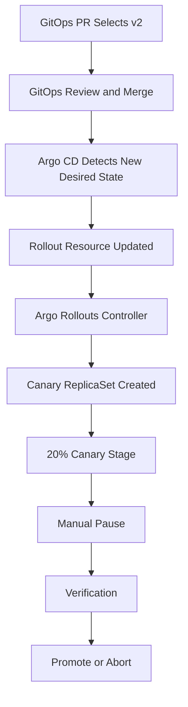
```mermaid
flowchart TD
    A["GitOps PR Selects v2"]
    B["GitOps Review and Merge"]
    C["Argo CD Detects New Desired State"]
    D["Rollout Resource Updated"]
    E["Argo Rollouts Controller"]
    F["Canary ReplicaSet Created"]
    G["20% Canary Stage"]
    H["Manual Pause"]
    I["Verification"]
    J["Promote or Abort"]

    A --> B
    B --> C
    C --> D
    D --> E
    E --> F
    F --> G
    G --> H
    H --> I
    I --> J
```

### Most important result

**A GitOps change now drives progressive delivery.**

Argo CD is not manually deploying Pods.

Argo Rollouts is not independently deciding which source image should be authorized.

The two controllers cooperate through a defined Kubernetes resource.

---

## 61. Observe Argo CD and Argo Rollouts separately

Inspect Argo CD:

```bash
kubectl get application strategy-lab-canary \
  -n argocd
```

Inspect Argo Rollouts:

```bash
kubectl argo rollouts get rollout \
  canary-demo \
  -n "$NS"
```

You may see an interesting state.

Argo CD can be:

```text
Synced
```

While the Rollout is:

```text
Paused
```

or:

```text
Progressing
```

or another controller-reported health state.

### Is this a contradiction?

No.

Argo CD may have successfully applied the desired `Rollout` specification.

But the progressive delivery controller may still be evaluating or waiting before completing the runtime transition.

Argo CD understands Rollout resource health and can report paused Rollouts as suspended. [Argo Project](https://argoproj.github.io/argo-rollouts/FAQ/?utm_source=chatgpt.com)

### Interpret the two controllers

| Component | Question |
|---|---|
| Argo CD | Is the desired Rollout specification represented in Kubernetes? |
| Argo Rollouts | How far has the runtime transition progressed? |
| Kubernetes | Which ReplicaSets and Pods are available? |
| Application monitoring | Is the exposed version behaving acceptably? |

### Fundamental principle

> **Multiple controllers can cooperate safely when their responsibilities and owned state are clearly separated.**

---

## 62. Authorize progression

During the pause, investigate the new revision.

Inspect:

```bash
kubectl get pods \
  -n "$NS" \
  -l app=canary-demo
```

Inspect:

```bash
kubectl argo rollouts get rollout \
  canary-demo \
  -n "$NS"
```

Run appropriate application checks.

If the candidate is acceptable, promote:

```bash
kubectl argo rollouts promote \
  canary-demo \
  -n "$NS"
```

At the next pause, repeat verification.

Finally, promote again.

### Is this a GitOps violation?

Not necessarily.

The GitOps repository declared:

```text
Desired Image:
v2
```

And:

```text
Progressive Rollout Strategy:
20%, pause, 40%, pause, 100%
```

The promotion action advances the rollout controller's operational state toward the already-authorized desired version.

It does not select an unapproved image.

However, the authority to promote should still be controlled by operational policy.

### Security consideration

A production setup should restrict which users or automation identities can promote or abort Rollouts.

Manual promotion is an authorization-sensitive operation even when the desired image was approved earlier.

---

# Part XI — Failure and Recovery in Progressive Delivery

## 63. Aborting a canary is not the same as reverting Git

Suppose the canary begins returning errors.

You decide to stop it.

Argo Rollouts supports an abort operation:

```bash
kubectl argo rollouts abort \
  canary-demo \
  -n "$NS"
```

### What is the purpose?

To stop the current progressive rollout and preserve or restore stable serving behavior according to the rollout strategy and current state.

### But what does Git still declare?

Possibly:

```text
Desired Image:
v2
```

### Why is this important?

Because we now have an important distinction.

**Operational abort:** Stop an unsafe in-progress transition.

**GitOps recovery:** Change the authoritative desired artifact back to a safe, approved version when that is the recovery decision.

Aborting a Rollout does not automatically create a Git revert.

### Recovery architecture

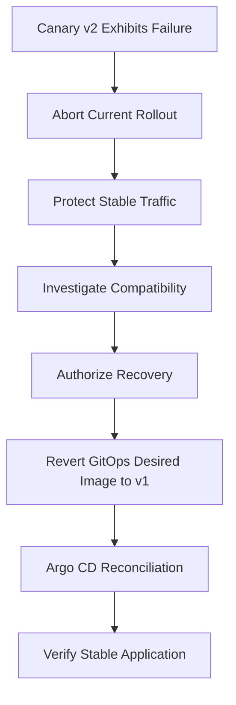
```mermaid
flowchart TD
    A["Canary v2 Exhibits Failure"]
    B["Abort Current Rollout"]
    C["Protect Stable Traffic"]

    D["Investigate Compatibility"]
    E["Authorize Recovery"]
    F["Revert GitOps Desired Image to v1"]
    G["Argo CD Reconciliation"]
    H["Verify Stable Application"]

    A --> B
    B --> C

    C --> D
    D --> E
    E --> F
    F --> G
    G --> H
```

### Important nuance

The exact runtime behavior after abortion depends on whether the Rollout is canary or blue-green, whether traffic routing is configured, and which promotion stage has been reached.

Do not treat `abort` as a universal restoration of all application, database, and traffic state.

For a durable GitOps recovery, restore the authorized desired state and verify the result.

---

## 64. Database compatibility during progressive rollout

Consider a PostgreSQL-backed application.

Version v1 expects:

```text
orders.total_cents
```

Version v2 expects:

```text
orders.amount_cents
```

Now our canary strategy creates a period where both versions are running.

```text
Stable v1:
80%
```

```text
Canary v2:
20%
```

Both versions use the same database.

What happens if we immediately rename the column?

```sql
ALTER TABLE orders
RENAME COLUMN total_cents TO amount_cents;
```

Version v1 may fail.

Even though v2 is healthy.

### The underlying issue

**A progressive rollout creates an intentional mixed-version operating period.**

Therefore, compatibility requirements become more important, not less.

### Safer migration sequence

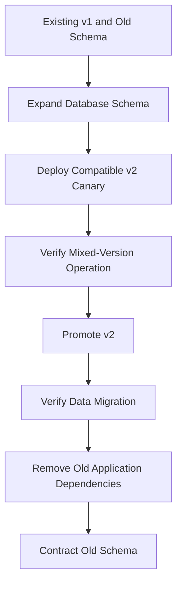
```mermaid
flowchart TD
    A["Existing v1 and Old Schema"]
    B["Expand Database Schema"]
    C["Deploy Compatible v2 Canary"]
    D["Verify Mixed-Version Operation"]
    E["Promote v2"]
    F["Verify Data Migration"]
    G["Remove Old Application Dependencies"]
    H["Contract Old Schema"]

    A --> B
    B --> C
    C --> D
    D --> E
    E --> F
    F --> G
    G --> H
```

### Key design questions

- Can v1 read data written by v2?
- Can v2 read data written by v1?
- Can both versions operate during partial data migration?
- Are background workers compatible?
- Can older versions be restored after the migration?
- Does the change introduce irreversible external effects?

### Most important principle

> **A deployment strategy can reduce exposure to application defects, but it cannot compensate for fundamentally incompatible shared-state changes.**

---

## 65. Feature flags are not deployment strategies

Imagine version v2 contains a new checkout feature.

We deploy v2 successfully.

But we do not want to enable the new checkout experience for everyone.

A feature flag can control exposure independently of the deployed artifact.

### Two different questions

**Deployment strategy:**

Which software version handles a request?

**Feature flag:**

Which feature behavior is enabled for that request or user?

### Architecture

```mermaid
flowchart TD
    A["Application v2 Deployed"]
    B["Feature Flag Decision"]
    C{"Feature Enabled?"}
    D["New Checkout Experience"]
    E["Existing Checkout Experience"]

    A --> B
    B --> C
    C -->|Yes| D
    C -->|No| E
```

### Why is this useful?

It separates:

```text
Deploying New Code
```

From:

```text
Releasing New Functionality
```

A team can deploy compatible code ahead of a feature launch.

However, feature flags introduce their own operational responsibilities:

- Flag ownership.
- Evaluation consistency.
- Cleanup of obsolete flags.
- Configuration availability.
- Testing both enabled and disabled paths.
- Security-sensitive behavior.

### Important distinction

A feature flag can sometimes mitigate a faulty feature without rolling back the entire application.

But it does not replace a deployment recovery strategy for defects outside the flagged functionality.

---

# Part XII — Designing a Production Deployment Strategy

## 66. Build the strategy from requirements

Imagine your engineering manager says:

> We need zero-downtime deployment for our Node.js API running on AKS.

Don't immediately reply:

> Use canary with Argo Rollouts.

First identify what zero downtime means for the organization.

### Step 1 — Define availability requirements

Ask:

- What is the acceptable request failure rate during deployment?
- What is the current peak request rate?
- How many healthy replicas are required?
- What additional capacity is available?
- Are there latency requirements?

### Step 2 — Define compatibility requirements

Ask:

- Can v1 and v2 run simultaneously?
- Is the API backward-compatible?
- Are database schema changes involved?
- Do background workers process version-sensitive jobs?
- Are external service contracts changing?

### Step 3 — Define exposure requirements

Ask:

- Must the new version be tested before user exposure?
- Is partial user exposure acceptable?
- Must certain customers be excluded?
- Is regional or tenant-specific rollout required?

### Step 4 — Define evidence requirements

Ask:

- Which metrics indicate failure?
- What is the observation window?
- What is the minimum meaningful traffic volume?
- Which business checks must pass?
- What happens when metric collection is unavailable?

### Step 5 — Define recovery requirements

Ask:

- Is the previous image still available?
- Can it operate with the current database?
- Can traffic return to the previous revision?
- Which configuration changes must be reverted?
- Who authorizes recovery?

Only then select a strategy.

### Design process

```mermaid
flowchart TD
    A["Business Requirements"]
    B["Availability Objectives"]
    C["Compatibility Constraints"]
    D["Capacity Constraints"]
    E["Exposure Requirements"]
    F["Verification Requirements"]
    G["Recovery Requirements"]
    H["Choose Deployment Strategy"]
    I["Implement and Test"]

    A --> B
    B --> C
    C --> D
    D --> E
    E --> F
    F --> G
    G --> H
    H --> I
```

This process applies regardless of whether you use Kubernetes, Azure App Service, AWS ECS, or another runtime platform.

---

## 67. Strategy selection case studies

### Case Study A — Small internal dashboard

Characteristics:

```text
Users:
20 employees

Traffic:
Low

Downtime:
A short interruption is acceptable

Extra capacity:
Limited
```

**Reasonable choice:** Recreate or basic RollingUpdate.

A sophisticated canary system may not provide enough additional value to justify its complexity.

### Case Study B — Stateless SaaS API

Characteristics:

```text
Users:
Many

Traffic:
Steady

Downtime:
Should be avoided

Multiple replicas:
Available

Old/New Compatibility:
Supported
```

**Reasonable choice:** RollingUpdate.

Use:

- Multiple replicas.
- Meaningful readiness.
- Graceful shutdown.
- Appropriate surge and unavailable limits.
- Rollout verification.
- Recovery planning.

### Case Study C — Critical checkout service

Characteristics:

```text
User impact:
High

New feature risk:
High

Request telemetry:
Available

Traffic routing:
Available

Operational team:
Can respond to failures
```

**Reasonable choice:** Canary with progressive analysis.

The additional complexity may be justified because limiting the initial blast radius has meaningful business value.

### Case Study D — API gateway replacement

Characteristics:

```text
Need:
Test full replacement capacity before cutover

Traffic switch:
Supported

Extra capacity:
Available

Existing and new versions:
Can coexist
```

**Reasonable choice:** Blue-green.

This provides a previewable replacement before an active traffic switch.

### Case Study E — Exclusive background worker

Characteristics:

```text
Worker instances:
Must not process certain jobs concurrently

Old/New processing:
Incompatible

Downtime:
Brief interruption acceptable
```

A controlled stop-and-replace strategy may be preferable.

However, Recreate alone is not a complete distributed exclusivity guarantee.

The application may also require leases, fencing tokens, idempotent job processing, or queue-consumer coordination.

### Lesson

**The best deployment strategy is the simplest one that satisfies the system's failure and availability requirements.**

---

## 68. Deployment strategy and blast radius

The idea of **blast radius** is essential.

It describes the scope of impact when a change causes a failure.

Suppose a bad release causes every request it handles to fail.

If the new version initially handles all requests, potential impact is broad.

If it handles only a small portion of eligible requests, initial impact may be smaller.

Conceptually:

```text
Impact
    ≈
Exposure
    ×
Failure Severity
    ×
Duration
```

This is an engineering intuition, not a rigorous business-impact formula.

### Why canary helps

It attempts to reduce initial exposure.

### Why fast detection helps

It reduces the time before an unsafe change can be stopped.

### Why recovery capability helps

It reduces the duration of unacceptable behavior.

### Why feature flags can help

They may reduce exposure to selected functionality independently from the deployed application version.

### Fundamental insight

> **Production deployment safety improves when we reduce unnecessary exposure, detect failures early, and retain workable recovery options.**

---

## 69. Resource cost and capacity

Deployment strategies consume different amounts of compute.

Suppose our normal application requires four Pods.

### Recreate

During replacement, capacity can fall to zero before the new Pods become ready.

Additional replacement capacity may be limited, but downtime is possible.

### RollingUpdate

With:

```yaml
maxSurge: 1
```

The rollout can request additional capacity for replacement.

### Blue-Green

Both complete versions may be running simultaneously.

With four replicas per version:

```text
Blue:
4 Pods
```

```text
Green:
4 Pods
```

Temporary total:

```text
8 Pods
```

This can approximately double application-Pod capacity requirements during preview.

### Canary

Capacity depends on:

- The rollout strategy.
- Desired replica count.
- Surge settings.
- Whether traffic routing is configured.
- Whether the stable ReplicaSet remains fully scaled.

For example, with advanced traffic routing, retaining all stable Pods while adding canary Pods can temporarily consume substantially more than steady-state resources.

### Important principle

**A strategy that improves rollout safety can increase infrastructure cost and capacity requirements.**

On AKS, consider:

- Available node CPU.
- Available memory.
- Node autoscaling behavior.
- Pod scheduling constraints.
- Network limits.
- Resource quotas.
- Startup duration.
- Additional node costs.

Do not choose blue-green without checking whether the environment can actually run both versions simultaneously.

---

## 70. The problem of readiness that lies

Suppose a new application exposes:

```text
/readyz
```

And always returns:

```text
HTTP 200
```

Even when it cannot serve real requests.

Kubernetes considers the Pod ready.

The rollout continues.

Users begin receiving failures.

### What went wrong?

The readiness check did not accurately represent the condition it was supposed to validate.

### Better readiness design

For an API, consider whether the application can:

- Accept connections.
- Initialize required routes.
- Load necessary configuration.
- Access indispensable local resources.
- Safely handle requests.

But avoid blindly checking every external dependency.

If every Pod marks itself unready whenever a shared database experiences a brief interruption, the system may lose all ready endpoints and amplify the outage.

### First-principles lesson

> **Readiness is an application-specific serving contract, not simply an HTTP endpoint that returns success.**

The correct design depends on whether the dependency is necessary for serving the application's intended traffic.

---

## 71. An important failure: rollback is unavailable

Imagine your canary fails.

The team wants to return to v1.

But v1's image was deleted from the registry.

Or the previous image is incompatible with the current database.

What happens?

The deployment strategy cannot invent a recoverable previous system state.

### Recovery prerequisites

A trustworthy release system should retain:

1. Previous approved artifact identity.
2. Availability of the previous artifact.
3. Previous desired configuration.
4. Relevant database compatibility information.
5. Authorization to perform recovery.
6. Verification procedures.

### What does this mean for GitOps?

The Git history may preserve:

```text
Previous Image Digest
```

But the image must still be available and compatible.

### Fundamental principle

**Deployment history is necessary for recovery traceability, but it is not sufficient to guarantee recoverability.**

---

# Part XIII — Production Failure Experiments

## 72. Failure experiment matrix

Use this matrix to understand how strategies behave differently.

| Failure | Recreate | Rolling | Blue-Green | Canary |
|---|---|---|---|---|
| New image cannot start | Service may remain unavailable | Healthy old replicas may remain | Active old version can remain | Stable version can remain |
| New Pods fail readiness | Outage likely during replacement | Rollout may stall | Preview may remain unpromoted | Canary progression may stall |
| Business logic is defective | Broad exposure after replacement | Exposure grows as Pods replace | Broad exposure at active switch | Initial exposure can be limited |
| Insufficient extra capacity | May still proceed | Surge may be blocked | Preview may be blocked | Depends on replica strategy |
| Database incompatible | High risk | High risk during overlap | High risk during overlap or cutover | High risk during mixed-version period |
| Metrics unavailable | External verification affected | External verification affected | Promotion policy must define behavior | Analysis may become inconclusive |
| Previous artifact unavailable | Recovery impaired | Recovery impaired | Previous capacity might still exist temporarily | Stable ReplicaSet may still exist temporarily |

This table describes possible behavior under correctly configured strategies.

It is not a universal availability guarantee.

---

## 73. Failure experiment — Canary has insufficient evidence

Suppose we deploy a new version to approximately 5% of traffic.

During the first five minutes:

```text
Canary requests:
20
```

```text
Canary errors:
0
```

Can we conclude that the canary is safe?

No.

Twenty successful requests provide limited evidence about rare failure modes.

The canary may not have encountered:

- A complex checkout.
- A large database transaction.
- A specific customer permission.
- A regional dependency failure.
- High concurrency.
- A rarely used API endpoint.

### Engineering response

Define an evidence policy that considers:

- Representative traffic.
- Minimum observation duration.
- Sufficient request volume.
- Error severity.
- Baseline comparison.
- Synthetic business tests.
- Operational judgment.

### Key lesson

**A canary rollout is only as useful as the behavior it actually observes.**

---

## 74. Failure experiment — Healthy infrastructure, broken business behavior

Suppose Kubernetes reports:

```text
Ready Replicas:
5
```

Argo CD reports:

```text
Synced
```

Argo Rollouts reports:

```text
Healthy
```

But payment authorization requests fail.

How can this happen?

Because:

- Pods are running.
- Readiness checks pass.
- Deployment configuration matches Git.
- Yet business behavior is incorrect.

### What detects the failure?

Potentially:

- Application metrics.
- Error budgets.
- Synthetic transactions.
- End-to-end tests.
- Business event monitoring.

### What should happen next?

The release decision system should evaluate whether to pause, abort, restore stable traffic, or roll forward.

### Important principle

**Infrastructure health, resource health, and business correctness are different forms of evidence.**

---

## 75. Failure experiment — Recovery changes the database unexpectedly

Suppose a release uses expand–migrate–contract.

Version v2 begins writing both old and new database fields.

A canary detects a serious issue.

The team restores v1.

If v1 still understands the old field and the migration preserved it, recovery may be straightforward.

Now consider a different release.

Version v2 deletes the old column before the canary completes.

Restoring v1 will not restore the deleted column or its original data.

### Why is this important?

Because **database changes can outlive application deployment changes**.

### Engineering decision

For progressive delivery, prefer compatibility-preserving schema evolution and delay destructive contract changes until old-version dependencies have been safely removed.

This is one reason Phase 09's database migration principles are essential to deployment strategy design.

---

# Part XIV — Evidence, Review, and Practice

## 76. What evidence should you collect?

A good deployment-strategy project should demonstrate the transition, not merely display a final healthy state.

| Experiment | Useful evidence |
|---|---|
| RollingUpdate | Old and new ReplicaSets during replacement |
| Rolling failure | Unready new Pod and stalled rollout |
| Recreate | Old Pods terminating before new Pods appear |
| Blue-green preview | Active Service on v1 and preview Service on v2 |
| Blue-green promotion | Active Service selecting v2 |
| Canary first stage | Stable and canary ReplicaSets |
| Canary pause | Paused rollout status |
| Canary promotion | Advancement to subsequent step |
| Canary abort | Aborted rollout status and stable serving behavior |
| GitOps integration | Approved commit and Argo CD Application |
| Recovery | Git revert, reconciliation, and application verification |

### Suggested evidence layout

```text
docs/
└── evidence/
    └── phase-13/
        ├── 01-rolling-baseline.png
        ├── 02-rolling-transition.png
        ├── 03-rolling-readiness-failure.png
        ├── 04-recreate-transition.png
        ├── 05-bluegreen-preview.png
        ├── 06-bluegreen-promotion.png
        ├── 07-canary-initial-stage.png
        ├── 08-canary-manual-pause.png
        ├── 09-canary-promotion.png
        ├── 10-argocd-gitops-canary.png
        ├── 11-canary-abort.png
        └── 12-recovery-verification.png
```

Capture these only when you actually execute the corresponding experiment.

### Why does this matter?

Because a project becomes more convincing when it explains:

```text
Requirement
    |
    v
Architecture
    |
    v
Transition
    |
    v
Observed Evidence
    |
    v
Engineering Conclusion
```

Screenshots alone are not the goal.

The goal is to demonstrate the reasoning behind the system.

---

## 77. Cleanup

When you've completed the experiments, decide whether you want to retain the GitOps-managed canary Application for Phase 14.

If you're finished with the entire disposable local cluster, you can remove it:

```bash
kind delete cluster --name argocd-lab
```

That removes the local Kubernetes cluster.

It does not remove your local Docker images or Git repositories.

If you want to retain Argo CD and the earlier exercises but remove only the unmanaged rolling, recreate, and blue-green lab resources, use:

```bash
kubectl delete -f rolling/deployment.yaml
```

```bash
kubectl delete -f recreate/deployment.yaml
```

```bash
kubectl delete -f bluegreen/rollout.yaml
```

Run these only against the intended kind context.

For the GitOps-managed canary, first update the authoritative GitOps configuration and choose the desired Application/resource deletion behavior.

Do not delete the live canary resources while Argo CD is still configured to recreate them automatically.

### Engineering principle

**Cleanup must respect resource ownership and reconciliation authority.**

---

# Part XV — Memorization and Engineering Practice

## 78. Eight deployment strategy mental models

You mentioned earlier that memorization is difficult.

Don't memorize every YAML field independently.

Memorize the relationships that explain why those fields exist.

### Mental Model 1 — Deployment is a state transition

```text
Stable Version A
       |
       v
Controlled Transition
       |
       v
Stable Version B
```

**Remember:** The deployment strategy controls the intermediate states.

### Mental Model 2 — Recreate stops before starting

```text
Stop Old
    |
    v
Start New
```

**Remember:** Simple replacement, but potential downtime.

### Mental Model 3 — RollingUpdate replaces gradually

```text
Start New
    |
    v
Wait for Readiness
    |
    v
Remove Old
    |
    v
Repeat
```

**Remember:** Availability depends on capacity and meaningful readiness.

### Mental Model 4 — Blue-green separates preparation from activation

```text
Blue Serves Users
        |
        v
Green Starts Separately
        |
        v
Verify Green
        |
        v
Switch Active Traffic
```

**Remember:** Preview first, activate after acceptance.

### Mental Model 5 — Canary limits initial exposure

```text
Small Exposure
       |
       v
Observe
       |
       v
Evaluate
       |
       v
Increase or Abort
```

**Remember:** Progressive exposure requires useful evidence.

### Mental Model 6 — Controllers have different responsibilities

```text
Argo CD
    =
Desired Configuration Reconciliation
```

```text
Argo Rollouts
    =
Progressive Workload Transition
```

```text
Kubernetes
    =
Workload Execution and Resource Control
```

### Mental Model 7 — Readiness is not business correctness

```text
Ready Pod
     !=
Correct Business Behavior
```

**Remember:** Runtime verification must match the application's actual requirements.

### Mental Model 8 — Rollback is not complete system recovery

```text
Restore Previous Image
         !=
Restore Previous Database State
```

**Remember:** Recovery depends on compatibility across the whole system.

---

## 79. Active recall questions

Try answering these without looking at the notes.

### Fundamentals

**Q1.** Why do deployment strategies exist?

**Q2.** What is the difference between a deployment, a release, and a rollout?

**Q3.** Why is deployment a state-transition problem?

**Q4.** What conditions are necessary for a zero-downtime deployment?

**Q5.** Why can an application have multiple ready Pods and still fail user requests?

### Kubernetes

**Q6.** What is the role of the Deployment controller?

**Q7.** What is a ReplicaSet?

**Q8.** What does a readiness probe establish?

**Q9.** How does readiness differ from liveness?

**Q10.** Why is graceful shutdown important during rolling deployments?

**Q11.** What does `maxSurge` control?

**Q12.** What does `maxUnavailable` control?

**Q13.** What happens when `maxSurge: 1` is configured but no additional cluster capacity exists?

**Q14.** Does `ProgressDeadlineExceeded` automatically restore a previous Deployment revision?

### Strategies

**Q15.** When is Recreate preferable to RollingUpdate?

**Q16.** How does RollingUpdate preserve available capacity?

**Q17.** Why does blue-green generally require more temporary resources?

**Q18.** What is the difference between `activeService` and `previewService`?

**Q19.** Why can a blue-green traffic switch still affect established connections?

**Q20.** What problem does canary deployment solve?

**Q21.** Why isn't one canary Pod among five guaranteed to receive exactly 20% of requests?

**Q22.** When is an ingress controller or service mesh useful for canary deployments?

### Progressive delivery

**Q23.** What is the difference between a timed canary and an evidence-based canary?

**Q24.** What is an AnalysisTemplate?

**Q25.** What is an AnalysisRun?

**Q26.** Why should insufficient telemetry not automatically count as successful validation?

**Q27.** How can feature flags reduce release risk independently of deployment strategy?

### GitOps integration

**Q28.** What does Argo CD manage?

**Q29.** What does Argo Rollouts manage?

**Q30.** Can an Argo CD Application be synchronized while an Argo Rollouts rollout is paused?

**Q31.** Why should a new application version be selected through an approved GitOps change?

**Q32.** What is the difference between aborting an in-progress canary and reverting the authoritative GitOps image reference?

### Recovery

**Q33.** Why might restoring the old image fail after a PostgreSQL migration?

**Q34.** What is expand–migrate–contract?

**Q35.** What evidence should be gathered before authorizing a rollback?

---

## 80. Interview and system-design questions

### Question 1

Your application has three replicas.

You configure:

```yaml
strategy:
  type: RollingUpdate
  rollingUpdate:
    maxSurge: 1
    maxUnavailable: 0
```

Explain exactly what Kubernetes attempts to guarantee during an update.

What happens if the fourth Pod cannot be scheduled?

### Question 2

Your new application Pods pass readiness but return HTTP 500 for critical checkout requests.

Why did the deployment system fail to detect this?

How would you improve the architecture?

### Question 3

Design a blue-green deployment for a Node.js API running on AKS.

Explain the roles of Services, ReplicaSets, readiness, preview verification, traffic switching, and recovery.

### Question 4

Your canary targets 10% exposure, but you have only five replicas.

Can you accurately direct 10% of requests to the new version using replica scaling alone?

Explain the limitations and possible solutions.

### Question 5

What is the difference between Argo CD and Argo Rollouts?

Explain how they cooperate during a GitOps-managed canary deployment.

### Question 6

A canary has run for ten minutes without errors.

Is it safe to promote?

What additional evidence might you require?

### Question 7

A rollout fails because its new Pods cannot pull the image.

Which components would you investigate?

How would you distinguish a registry-access failure from a GitOps reconciliation failure?

### Question 8

A progressive deployment starts while old and new application versions share PostgreSQL.

What compatibility requirements must hold?

Explain how an incompatible migration could cause an outage even with a canary strategy.

### Question 9

A blue-green promotion succeeds.

Thirty seconds later, business metrics indicate a serious problem.

How would you evaluate whether switching back to the previous version is safe?

### Question 10

Design a production deployment system that combines:

- GitHub Actions.
- Immutable container digests.
- GitOps release approvals.
- Argo CD.
- Argo Rollouts.
- Prometheus.
- Kubernetes.

Explain how a defective release is detected, stopped, and recovered.

---

# Part XVI — Official Documentation

## 81. Kubernetes Deployments

**Official documentation:**  
https://kubernetes.io/docs/concepts/workloads/controllers/deployment/

Study:

- RollingUpdate.
- Recreate.
- `maxSurge`.
- `maxUnavailable`.
- `minReadySeconds`.
- `progressDeadlineSeconds`.
- Revision history.
- Rollout status.

**Engineering question:** How does Kubernetes control availability while replacing Pods?

## 82. Kubernetes probes

**Official documentation:**  
https://kubernetes.io/docs/tasks/configure-pod-container/configure-liveness-readiness-startup-probes/

Study:

- Readiness.
- Liveness.
- Startup probes.
- Probe timing.
- Failure thresholds.

**Engineering question:** What does the application need to prove before receiving traffic?

## 83. Argo Rollouts

**Official documentation:**  
https://argoproj.github.io/argo-rollouts/

Study the controller's architecture and its relationship to Kubernetes.

## 84. Argo Rollouts blue-green

**Official documentation:**  
https://argoproj.github.io/argo-rollouts/features/bluegreen/

Study:

- Active Service.
- Preview Service.
- Manual promotion.
- Scale-down delay.
- Pre-promotion and post-promotion analysis.

**Engineering question:** How can the new version be verified before changing active traffic routing?

## 85. Argo Rollouts canary

**Official documentation:**  
https://argoproj.github.io/argo-rollouts/features/canary/

Study:

- Canary ReplicaSets.
- `setWeight`.
- `pause`.
- Manual promotion.
- Traffic-routing integrations.

**Engineering question:** How can user exposure increase progressively while limiting initial impact?

## 86. Argo Rollouts analysis

**Official documentation:**  
https://argoproj.github.io/argo-rollouts/features/analysis/

Study:

- AnalysisTemplate.
- AnalysisRun.
- Background analysis.
- Inline analysis.
- Success and failure conditions.
- Inconclusive measurements.

**Engineering question:** How can observable application behavior control deployment progression?

## 87. Argo Rollouts traffic management

**Official documentation:**  
https://argoproj.github.io/argo-rollouts/features/traffic-management/

Study:

- Ingress and service-mesh integration.
- Stable and canary Services.
- Weighted routing.
- Replica scaling versus traffic allocation.

**Engineering question:** When is Pod-based canary allocation insufficient?

## 88. Argo CD and Argo Rollouts integration

**Official documentation:**  
https://argoproj.github.io/argo-rollouts/FAQ/

Study how Argo CD can manage Rollout resources and interpret their health.

**Engineering question:** Which controller owns desired configuration, and which controller owns progressive runtime transitions?

---

# 89. Phase 13 — Engineering Takeaways

| Principle | Engineering meaning |
|---|---|
| **Deployment is a state transition** | Intermediate states must be controlled |
| **Availability requires healthy capacity** | Running replicas alone do not guarantee service |
| **Readiness is an application contract** | Unready Pods should not receive normal traffic |
| **Graceful termination protects existing work** | Old Pods need safe shutdown behavior |
| **Recreate favors simple replacement** | It can introduce downtime |
| **RollingUpdate replaces gradually** | Surge and unavailable limits shape the transition |
| **Blue-green separates preview and active** | Complete new capacity can be tested before cutover |
| **Canary reduces initial exposure** | Risk is introduced progressively |
| **Replica percentage is not traffic percentage** | Accurate traffic control requires suitable routing |
| **Progressive delivery needs evidence** | Time passing is not proof of correctness |
| **Argo CD and Argo Rollouts are complementary** | Desired-state reconciliation differs from runtime progression |
| **Metrics can control rollout decisions** | Analysis must have meaningful thresholds and failure policies |
| **Database compatibility matters** | Mixed-version operation can break shared-state dependencies |
| **Rollback is not always safe** | Previous software may not understand current data |
| **Feature release differs from deployment** | Feature flags can control functionality separately |
| **Deployment strategy affects cost** | Additional availability may require additional capacity |
| **Recovery requires verification** | Restoring a previous artifact does not prove service recovery |

---

# 90. Final Understanding

Let's return to our original engineering question:

**How do we introduce a new software version into a running environment while controlling risk and preserving acceptable service behavior?**

We begin with the system's availability, compatibility, exposure, and recovery requirements.

We evaluate whether old and new versions can coexist.

We identify how many healthy instances must remain available.

We verify that the cluster has sufficient capacity.

We define meaningful readiness and graceful termination behavior.

Then we choose an appropriate deployment strategy.

**Recreate** removes the old version before introducing the new one.

**RollingUpdate** gradually replaces old instances with new ones.

**Blue-green** prepares and verifies a replacement version before switching active traffic.

**Canary** introduces a new version to a limited portion of traffic and progressively expands exposure according to policy.

For more advanced progressive delivery, **Argo Rollouts** manages rollout stages, pauses, and analysis.

**Argo CD** remains responsible for reconciling approved desired configuration from Git.

**Kubernetes** maintains the underlying workloads.

**Observability** evaluates whether the new version behaves acceptably.

**Release Engineering** determines which artifact is authorized and which recovery decisions are permissible.

These responsibilities form one production delivery system.

## Complete architecture

```mermaid
flowchart TD
    A["Developer"]
    B["GitHub Actions CI"]
    C["Validated Container Artifact"]
    D["Container Registry"]

    E["Release Authorization"]
    F["Protected GitOps Repository"]
    G["Argo CD"]
    H["Rollout Desired State"]

    I["Argo Rollouts Controller"]
    J["Stable ReplicaSet"]
    K["Canary or Preview ReplicaSet"]
    L["Traffic Routing"]

    M["Application Metrics"]
    N["Analysis or Operator Decision"]
    O{"Progression Acceptable?"}

    P["Promote New Version"]
    Q["Pause, Abort, or Recover"]

    R["Production Verification"]
    S["Operational Feedback"]

    A --> B
    B --> C
    C --> D

    D --> E
    E --> F
    F --> G
    G --> H

    H --> I

    I --> J
    I --> K
    I --> L

    J --> M
    K --> M

    M --> N
    N --> O

    O -->|Yes| P
    O -->|No| Q

    P --> R
    R --> S
```

The registry distributes the approved image to the Kubernetes runtime; that retrieval path is omitted from this diagram to keep the rollout-control responsibilities clear.

### The most important principle of Phase 13

> **A deployment strategy is a risk-management policy for transitioning a running system between software versions. Its effectiveness depends on capacity, readiness, version compatibility, controlled exposure, trustworthy verification, and viable recovery—not merely Kubernetes configuration.**

That is the difference between knowing the names of deployment strategies and understanding how to engineer them.

---

# Phase 13 Complete

**Completed:** Level 4 — Phase 13: Deployment Strategies

## Course Progress — 5 Levels, 16 Phases

| Level | Phase | Topic | Status |
|---|---|---|---|
| **1 — Fundamentals** | 01 | Why CI/CD Exists | Completed |
| | 02 | Feedback and Control Systems | Completed |
| | 03 | Delivery Architecture | Completed |
| | 04 | Git Lifecycle | Completed |
| **2 — Continuous Integration** | 05 | CI Architecture | Completed |
| | 06 | Testing and Quality Gates | Completed |
| | 07 | Build Artifacts | Completed |
| | 08 | GitHub Actions | Completed |
| **3 — Continuous Delivery** | 09 | Release Engineering | Completed |
| | 10 | GitOps | Completed |
| | 11 | Argo CD | Completed |
| | 12 | End-to-End Integration | Completed |
| **4 — Production Engineering** | **13** | **Deployment Strategies** | **Completed** |
| | **14** | **CI/CD Security** | **Next** |
| | 15 | Reliability and Observability | Upcoming |
| **5 — System Design** | 16 | Complete CI/CD Project | Upcoming |

---

## Next: Phase 14 — CI/CD Security

**File:** `Level-4-Production-Engineering/Phase-14-CICD-Security.md`

We have now designed a complete delivery system and learned how to introduce software changes safely.

But a new question arises:

**What happens if the software delivery system itself becomes a target of attack?**

In Phase 14, we'll investigate:

- CI/CD threat modeling from first principles.
- Trust boundaries between source, CI, registries, GitOps, and Kubernetes.
- Untrusted pull-request execution.
- GitHub Actions workflow permissions.
- `GITHUB_TOKEN` and OIDC.
- Credential and secret exposure.
- Dependency and third-party action risks.
- Build provenance and artifact attestations.
- Software supply-chain attacks.
- Artifact integrity versus artifact trust.
- GitOps repository compromise.
- Argo CD controller permissions.
- Secure release authorization.
- Preventing unauthorized artifact promotion.
- Incident response after a delivery-system compromise.
- Practical attack-and-defense experiments in a disposable lab.

### Central engineering question

> **How do we establish and preserve trust across the entire software delivery chain—from source code to running production workloads—when repositories, workflows, dependencies, identities, and deployment controllers can all become attack surfaces?**

**Send `next` to begin Phase 14 — CI/CD Security.**