# Phase 14 — CI/CD Security: Engineering Trust Across the Software Delivery System

**Level 4 — Production Engineering | CI/CD From First Principles**

**File:** `Level-4-Production-Engineering/Phase-14-CICD-Security.md`

**Previous:** Phase 13 — Deployment Strategies  
**Next:** Phase 15 — Reliability and Observability

---

# Part I — First Principles of CI/CD Security

## 1. Why CI/CD Security Exists

We have designed a complete software delivery architecture:

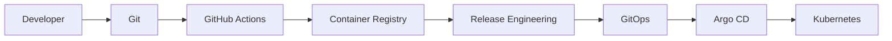

So far, we have mainly asked:

> How can this system deliver software correctly and reliably?

Now we must ask a different question:

> **What happens if someone manipulates the delivery system itself?**

Imagine an attacker cannot log in to your production AKS cluster.

They cannot execute `kubectl`.

They cannot access the production database.

But they manage to modify a GitHub Actions workflow.

That workflow can publish images to GHCR.

The GitOps process trusts images published by that workflow.

The production GitOps repository permits an automated identity to propose image updates.

Could the attacker indirectly influence production?

Potentially, yes.

They do not necessarily need direct access to Kubernetes.

They may instead compromise a trusted upstream system.

This is the fundamental problem of **software supply-chain security**.

### Our central engineering question

> **How do we ensure that every transition—from source code to production—is performed by an authorized identity, using trustworthy inputs, with verifiable evidence and limited permissions?**

This phase will derive that security model from first principles.

---

## 2. Learning Objectives

By the end of Phase 14, you should be able to:

1. Explain CI/CD security without starting with tools.
2. Identify valuable assets in a software delivery system.
3. Distinguish threats, vulnerabilities, attack surfaces, and trust boundaries.
4. Threat-model GitHub Actions, registries, GitOps, and Kubernetes.
5. Design isolated pull-request validation.
6. Understand dangerous GitHub Actions event and permission combinations.
7. Prevent common script-injection mistakes.
8. Apply least privilege to GitHub tokens and workflow jobs.
9. Explain why CI runners are security-sensitive execution environments.
10. Understand dependency, action, and cache supply-chain risks.
11. Use workload identity and OIDC appropriately.
12. Distinguish image digests, signatures, provenance, attestations, and SBOMs.
13. Design verifiable artifact-promotion policies.
14. Protect the GitOps-to-Kubernetes trust boundary.
15. Distinguish preventive, detective, and recovery controls.
16. Build a practical security-focused CI/CD workflow.
17. Perform safe security-failure simulations.
18. Design a complete CI/CD threat model for production AKS.

Our implementation will use:

- GitHub Actions.
- GitHub Container Registry.
- GitHub artifact attestations.
- GitHub CLI.
- Docker.
- GitOps.
- Argo CD.
- Kubernetes.

The main lab will not require paid cloud infrastructure.

---

## 3. First Principle: Security Is About Controlling Authority

Before discussing attacks, we need to define what security is protecting.

Consider a GitHub Actions workflow.

It can perform operations such as:

```text
Read source code

Execute commands

Download dependencies

Read secrets

Publish artifacts

Modify repositories

Request cloud credentials

Change deployment configuration
```

Not every workflow needs all these abilities.

For example, unit testing requires:

```text
Read source
    +
Execute tests
```

It does not normally require:

```text
Production cluster administrator
```

A publishing workflow needs authority to publish a package.

That does not imply it should be authorized to deploy to production.

### Derive the core problem

An attacker gains control of some input or component.

That component has certain capabilities.

The attacker attempts to use those capabilities to cause an unauthorized outcome.

Conceptually:

```text
Attacker-Controlled Input
          +
Privileged Execution Context
          |
          v
Potential Unauthorized Operation
```

The severity of a compromise depends partly on the authority available to the compromised component.

### Fundamental security principle

> **Give each delivery component only the authority it requires, and prevent lower-trust inputs from acquiring higher-trust authority without validation and authorization.**

This is the foundation of CI/CD security.

---

## 4. Assets, Threats, Vulnerabilities, and Attack Surfaces

You encountered these concepts while studying DevSecOps.

Now let's apply them to the delivery system.

### 4.1 Asset

Something valuable that requires protection.

Examples:

- Application source code.
- GitHub repository write access.
- Container publishing credentials.
- Cloud identities.
- Production GitOps configuration.
- Kubernetes credentials.
- Release signing or attestation authority.
- Customer-facing application integrity.

### 4.2 Threat

A potential event or actor capable of causing harm.

Examples:

- An attacker submits malicious source code.
- A dependency is compromised.
- A privileged workflow executes untrusted input.
- A deployment automation identity is stolen.
- An unauthorized image is promoted.

### 4.3 Vulnerability

A weakness that can allow a threat to succeed.

Examples:

- Workflow uses unnecessarily broad permissions.
- Untrusted pull-request data is executed as shell code.
- Production accepts arbitrary container images.
- A privileged runner executes unreviewed code.
- Repository protection can be bypassed.

### 4.4 Attack surface

The interfaces and components through which attackers might influence the system.

For CI/CD, these include:

```text
Pull Requests

GitHub Actions Workflows

Runner Environments

Third-Party Actions

Package Dependencies

Container Registries

GitOps Repositories

Deployment Controllers

Kubernetes APIs
```

### 4.5 Trust boundary

A point where information or execution passes between components with different levels of trust or authority.

Example:

```text
Untrusted Pull Request
          |
          v
GitHub Actions Runner
```

Another:

```text
Published Container Image
          |
          v
Production Release Authorization
```

The second boundary matters because publication does not automatically make an image an approved production release.

---

## 5. Build the CI/CD Threat Model

We will use a simple, repeatable method.

For every component, answer five questions:

1. **What does it protect?**
2. **Who or what can influence its inputs?**
3. **What permissions does it possess?**
4. **What can happen if it is compromised?**
5. **Which controls prevent, detect, or contain that outcome?**

This produces a practical threat model.

### Our system

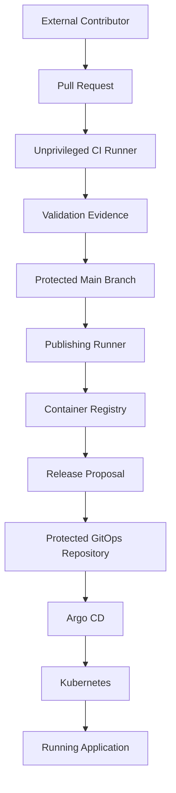

The transition from validation to integration assumes that repository merge policies enforce the required checks.

### Threat model

| Boundary | Possible threat | Required protection |
|---|---|---|
| Contributor → PR | Malicious source or scripts | Unprivileged validation |
| PR → runner | Code execution with excessive permissions | Least privilege and isolation |
| Runner → dependency registry | Malicious dependency | Dependency controls and validation |
| Workflow → third-party action | Compromised executable action | Trusted dependencies and immutable references |
| Publishing runner → GHCR | Unauthorized image publication | Restricted publishing identity |
| Image → release process | Untrusted image selected | Artifact identity and provenance verification |
| Release proposal → GitOps | Unauthorized environment update | Required review and checks |
| GitOps → Argo CD | Malicious desired configuration | Protected repositories and AppProjects |
| Argo CD → Kubernetes | Excessive controller authority | Authorization boundaries and RBAC |
| Kubernetes → application | Malicious or defective workload | Runtime restrictions and verification |

### Important insight

Security is not one final stage:

```text
Build
  |
  v
Test
  |
  v
Security Scan
  |
  v
Deploy
```

Security controls must exist at the boundaries where authority is exercised.

---

# Part II — Trust and Execution in GitHub Actions

## 6. Not All GitHub Events Have the Same Trust Level

Consider two events.

### Event A — Pull request from an external contributor

An external contributor proposes a source-code change.

They may control:

- Source files.
- Package scripts.
- Test files.
- Dependency definitions.
- Pull-request title and body.

They should not automatically receive production deployment authority.

### Event B — Push to protected `main`

A change has entered the authoritative branch after the repository's configured checks and review policies.

A workflow triggered from this revision can be eligible for additional operations, such as publishing.

However, this is only meaningful if branch protection and bypass permissions are correctly configured.

### Compare

| Event | Source trust | Appropriate responsibility |
|---|---|---|
| `pull_request` | May contain untrusted code | Validate with restricted authority |
| `push` to protected `main` | Authorized integrated revision under repository policy | Validate and potentially publish |
| `workflow_dispatch` | Depends on who can invoke it and chosen ref | Controlled operator-initiated operation |
| `workflow_run` | Depends on preceding workflow and consumed data | Carefully designed cross-workflow handoff |
| `pull_request_target` | Privileged base-repository context | Narrow metadata-oriented automation with strict controls |

GitHub documents special risks for `pull_request_target` and workflows that mix privileged execution with untrusted pull-request code. [GitHub Docs](https://docs.github.com/en/actions/reference/security/securely-using-pull_request_target?utm_source=chatgpt.com)

### Fundamental principle

> **The event that starts a workflow affects the trust assumptions of the code, data, and credentials used by that workflow.**

---

## 7. Why Pull-Request Code Must Be Treated as Untrusted

Imagine your CI contains:

```yaml
- name: Install dependencies
  run: npm ci
```

This looks harmless.

But `npm ci` may execute lifecycle scripts defined by packages or project configuration.

If the workflow checks out untrusted source, parts of the installation process can execute contributor-influenced code.

Now imagine the same job also has:

```yaml
permissions:
  contents: write
  packages: write
  id-token: write
```

The job may have unnecessarily powerful capabilities.

### The security problem

The workflow has mixed:

```text
Untrusted Executable Input
```

with:

```text
Privileged Execution Authority
```

This is an avoidable trust-boundary violation.

### Safer design

Separate the responsibilities.

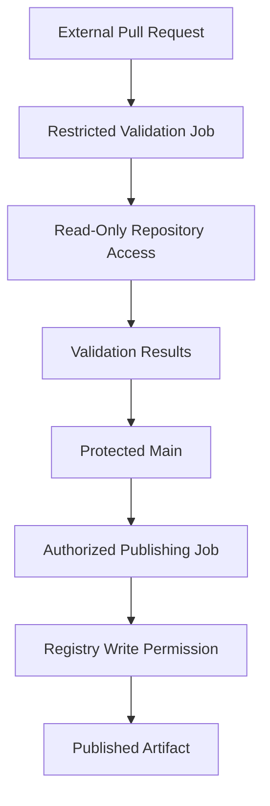

The pull-request job does not receive registry publishing or cloud-deployment authority.

The publishing job processes an authorized integrated revision.

---

## 8. Design a Secure Pull-Request Workflow

Here is a practical baseline.

Create:

```text
.github/workflows/pr-validation.yml
```

```yaml
name: PR Validation

on:
  pull_request:
    branches:
      - main

  merge_group:
    types:
      - checks_requested

permissions:
  contents: read

jobs:
  validate:
    name: Required PR Validation
    runs-on: ubuntu-latest
    timeout-minutes: 15

    steps:
      - name: Checkout source
        uses: actions/checkout@v4
        with:
          persist-credentials: false

      - name: Configure Node.js
        uses: actions/setup-node@v4
        with:
          node-version: "22"

      - name: Install dependencies
        run: npm ci

      - name: Typecheck
        run: npm run typecheck

      - name: Run tests
        run: npm test

      - name: Build application
        run: npm run build
```

This is a baseline for a repository whose tests do not require additional services. Add the PostgreSQL integration-test job from Phase 06 when working with that project.

### Understand every security decision

**`pull_request`:** Runs validation for proposed source.

**`contents: read`:** Prevents the job's GitHub token from receiving repository write authority.

**`persist-credentials: false`:** Prevents checkout from leaving its configured authentication credentials in the local Git checkout.

**GitHub-hosted runner:** Provides a managed execution environment rather than reusing a personal workstation as the CI worker.

**No registry credentials:** The job does not need permission to publish images.

**No cloud credentials:** The job does not need permission to modify cloud resources.

### Important qualification

`persist-credentials: false` does not make the runner unable to access its job-scoped `GITHUB_TOKEN` through every other mechanism.

It only changes checkout credential persistence.

Also, a read-only token can still expose private source or other readable data if compromised.

Least privilege reduces impact; it does not make untrusted code harmless.

GitHub documents its job-scoped token model and permission behavior. [GitHub Docs](https://docs.github.com/en/actions/concepts/security/github_token?utm_source=chatgpt.com)

---

## 9. The Dangerous `pull_request_target` Pattern

A common mistake is to think:

> We need access to repository secrets while validating external pull requests. Let's use `pull_request_target`.

That can introduce serious risk.

A `pull_request_target` workflow executes in the base-repository security context and can receive more privileged repository access.

If it then checks out and executes code from an external contributor's pull request, the contributor-controlled code may execute in a privileged context.

### Dangerous conceptual design

```text
External PR
     |
     v
Privileged pull_request_target Workflow
     |
     v
Checkout Contributor Code
     |
     v
Execute Contributor Scripts
     |
     v
Access to Privileged Context
```

### Safer architectural alternatives

For ordinary source validation, use an appropriately restricted `pull_request` workflow.

For privileged PR metadata automation, avoid checking out or executing untrusted contributor code.

If a privileged follow-up workflow consumes output from an untrusted workflow, treat that output as untrusted data and independently validate it.

GitHub's current guidance explicitly addresses these risks, including protections around untrusted checkout and privileged workflow execution. [GitHub Docs](https://docs.github.com/en/actions/reference/security/securely-using-pull_request_target?utm_source=chatgpt.com)

### Key principle

**Do not solve an authentication problem by silently promoting untrusted code into a privileged execution context.**

---

## 10. Script Injection: Data Must Not Become Shell Code

Consider a workflow that prints the title of a pull request.

A developer writes:

```yaml
- name: Show pull request title
  run: echo "${{ github.event.pull_request.title }}"
```

This appears straightforward.

But GitHub Actions expressions are evaluated before the runner executes the generated shell script.

If untrusted text is placed directly into executable shell syntax, special characters can change how the shell interprets the command.

### The underlying issue

```text
Untrusted Text
       |
       v
Generated Shell Script
       |
       v
Shell Interpreter
```

The problem is crossing the boundary between **data** and **code**.

GitHub explicitly identifies event fields such as PR titles, bodies, branch names, and commit messages as possible sources of script injection. [GitHub Docs](https://docs.github.com/en/actions/concepts/security/script-injections?utm_source=chatgpt.com)

### Safer pattern

Pass the value through an environment variable.

```yaml
- name: Safely print pull request title
  env:
    PR_TITLE: ${{ github.event.pull_request.title }}
  run: |
    printf '%s\n' "$PR_TITLE"
```

### Why is this better?

The expression becomes an environment-variable value instead of being directly inserted into the shell program.

Quoting `"$PR_TITLE"` ensures the shell treats the expanded value as data in this command.

### Important qualification

Environment variables do not automatically make every downstream operation safe.

If you later execute:

```bash
eval "$PR_TITLE"
```

you have reintroduced code execution.

If you construct SQL, YAML, URLs, or command arguments unsafely, other injection risks may remain.

### General principle

> **Keep untrusted information as data. Do not interpolate it into executable instructions or privileged operations.**

---

## 11. `GITHUB_TOKEN`: Understand Its Authority

GitHub Actions automatically provides a job-scoped `GITHUB_TOKEN`.

It is a GitHub App installation token associated with the workflow repository.

Its effective permissions depend on workflow configuration and platform rules. [GitHub Docs](https://docs.github.com/en/actions/concepts/security/github_token?utm_source=chatgpt.com)

### Three important properties

**Property 1 — It is scoped to a repository.**

Do not assume it can modify every repository in your organization.

**Property 2 — Permissions are configurable.**

For example:

```yaml
permissions:
  contents: read
```

Or:

```yaml
permissions:
  contents: read
  packages: write
```

**Property 3 — Jobs should request only the permissions they need.**

A unit-test job and a publishing job have different responsibilities.

### Example: Job-level permissions

```yaml
permissions:
  contents: read

jobs:
  test:
    runs-on: ubuntu-latest

    steps:
      - run: echo "Validation job"

  publish:
    runs-on: ubuntu-latest

    permissions:
      contents: read
      packages: write

    steps:
      - run: echo "Publishing job"
```

This illustrates permission separation.

The example is not a complete publishing workflow.

### Important reminder

A token is an identity credential.

Its permissions are an authorization decision.

We should not confuse the two.

---

## 12. CI Runners Are Part of the Security Boundary

A workflow job executes somewhere.

That execution environment matters.

A runner can potentially access:

- Checked-out source.
- Environment variables.
- Files generated by previous steps.
- Available credentials.
- Cached dependencies.
- Container tools.
- Network resources.

### GitHub-hosted runners

These provide managed execution environments and are generally appropriate for untrusted public pull-request validation.

They still require least-privilege workflow design.

### Self-hosted runners

These introduce additional concerns:

- Persistent filesystem state.
- Access to internal networks.
- Docker daemon access.
- Shared host resources.
- Credentials available outside the job.
- Compromise persistence between executions.

GitHub warns that self-hosted runners handling untrusted workflows do not have the same guarantees as clean ephemeral hosted virtual machines. [GitHub Docs](https://docs.github.com/en/actions/reference/security/secure-use?utm_source=chatgpt.com)

### Architectural decision

For our course:

**Use GitHub-hosted runners for ordinary PR validation.**

For production systems requiring self-hosted runners, prefer strong isolation, short-lived execution environments, tightly scoped network access, and a clearly defined cleanup model.

### Important principle

> **A runner is not merely a place where commands execute. It is an environment whose permissions and reachable resources determine the impact of a compromised job.**

---

# Part III — Software Supply-Chain Security

## 13. A Successful Build Does Not Prove the Inputs Were Trustworthy

Consider this Docker build:

```bash
docker build -t ecommerce-api:v2 .
```

The build might succeed.

The tests might pass.

But suppose one dependency was compromised.

The resulting application might contain malicious behavior even though the build process executed successfully.

### The build dependency graph

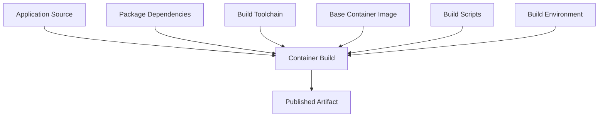

Every input can influence the output.

This gives us a more accurate security question:

> **Which inputs are trusted, which are controlled, and which could change without our approval?**

---

## 14. Dependency Security: Why Lockfiles Matter

Suppose a Node.js project depends on:

```json
{
  "dependencies": {
    "some-package": "^2.0.0"
  }
}
```

The version range may permit multiple compatible package releases.

Without appropriate dependency resolution controls, the dependencies installed at different times can differ.

### What does a lockfile provide?

A `package-lock.json` records resolved dependency information, including versions and integrity metadata.

Using:

```bash
npm ci
```

helps install dependencies according to the existing lockfile.

### Security benefit

It reduces uncontrolled variation in dependency resolution.

### What does it not guarantee?

A lockfile does not prove that every dependency is:

- Nonmalicious.
- Free from vulnerabilities.
- Correctly implemented.
- Properly maintained.

It can consistently install a malicious dependency too.

### Security model

```text
Lockfile
    =
Dependency Resolution Control
```

```text
Vulnerability Scanning
    =
Known Vulnerability Detection
```

```text
Dependency Review
    =
Change Risk Evaluation
```

These controls are complementary.

### Practical checks

```bash
npm ci
```

```bash
npm audit --omit=dev
```

The second command checks npm's known vulnerability information for the selected production dependency set.

It is useful evidence, but it cannot prove that an application is secure.

For a real repository, also review:

- Unexpected new dependencies.
- Changes to package lifecycle scripts.
- Dependency ownership and maintenance.
- Transitive dependency changes.
- Build-time versus runtime dependencies.

---

## 15. Third-Party GitHub Actions Are Executable Dependencies

Consider:

```yaml
- uses: some-organization/some-action@v1
```

That action can execute code inside your workflow job.

If the job has registry or cloud permissions, the action may have access to capabilities associated with that execution environment.

### The trust relationship

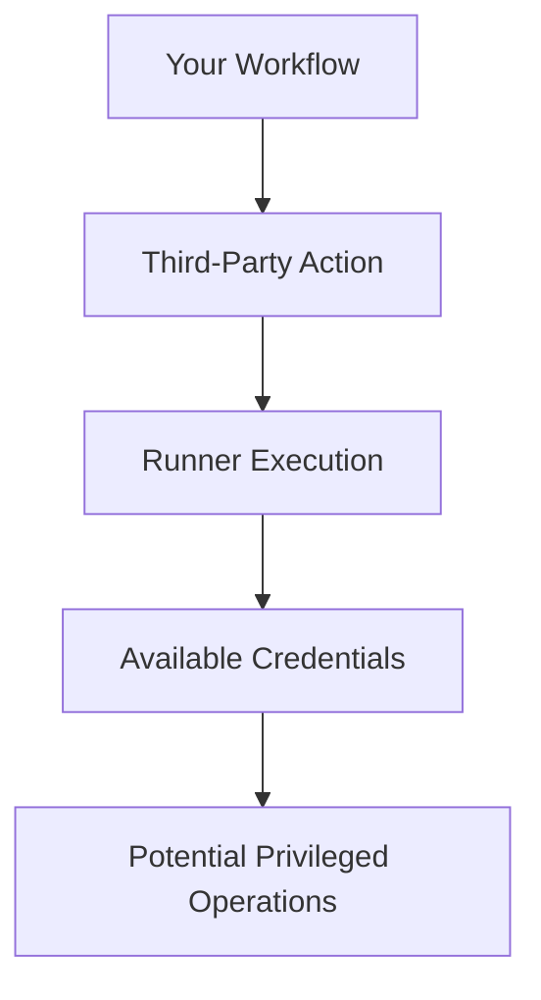

This does not imply every third-party action is malicious.

It means executable dependencies are part of your security model.

### Why pin to a full commit SHA?

A tag is a Git reference that can potentially move.

For example:

```yaml
uses: actions/checkout@v4
```

is convenient and readable.

But a full commit SHA identifies a specific revision of the action's code.

GitHub recommends full-length commit SHA pinning for the strongest immutable action references. [GitHub Docs](https://docs.github.com/en/actions/reference/security/secure-use?utm_source=chatgpt.com)

### Secure practice

For production workflows:

1. Choose a reputable action.
2. Inspect its permissions and behavior.
3. Identify the intended released commit.
4. Pin the action to its full commit SHA.
5. Update the pinned revision deliberately.
6. Review updates before accepting them.

### Important limitation

Pinning does not prove that the pinned code is safe.

It controls the identity of the executable dependency.

---

## 16. Why CI Caches Need Security Boundaries

Caching improves build speed.

But what happens if an untrusted workflow can modify data later consumed by a privileged workflow?

Imagine:

```text
Untrusted PR Runner
        |
        v
Writable Shared Cache
        |
        v
Privileged Publishing Runner
        |
        v
Execute Cached Content
```

This creates an opportunity for cache poisoning.

The trusted workflow may execute or use attacker-influenced files.

GitHub's current dependency-caching documentation includes cache access modes such as `read`, `write`, `write-only`, and `none`, and warns against granting untrusted runs unnecessary write access. [GitHub Docs](https://docs.github.com/en/actions/reference/workflows-and-actions/dependency-caching?utm_source=chatgpt.com)

### Basic rule

**A cache is a performance optimization, not a trusted software artifact.**

Avoid:

- Storing credentials in caches.
- Granting untrusted jobs unnecessary cache-write authority.
- Treating restored cache contents as verified release outputs.
- Passing executable artifacts through caches without appropriate validation.

### Better separation

```text
Dependency Cache
      =
Performance Data
```

```text
Published Image Digest
      =
Identifiable Artifact
```

```text
Verified Attestation
      =
Evidence About Artifact Origin
```

These are not interchangeable.

---

# Part IV — Identity, Credentials, and OIDC

## 17. Authentication and Authorization Are Different

Suppose a GitHub Actions job wants to access Azure.

Two questions must be answered.

**Authentication:**

Who is this workflow?

**Authorization:**

What is this workflow allowed to do?

These are separate decisions.

### Example

A workflow proves that it belongs to:

```text
Repository:
OWNER/REPO
```

And was executed from:

```text
Protected production environment
```

Azure may recognize that identity.

But successful authentication should not automatically grant subscription-wide administrative permission.

### Fundamental principle

> **Identity establishes who is making a request. Authorization determines which operations that identity may perform.**

---

## 18. Why Long-Lived Cloud Credentials Are Risky

A traditional CI workflow may use a stored cloud credential.

```text
GitHub Secret
     |
     v
Workflow Runner
     |
     v
Azure Authentication
```

If the secret is exposed, it may remain usable until it expires or is revoked.

Problems include:

- Credential leakage.
- Difficult rotation.
- Accidental broad permissions.
- Credentials copied into logs or files.
- Secrets surviving longer than necessary.

A more suitable approach for many cloud operations is short-lived federated identity.

---

## 19. How OIDC Works From First Principles

OIDC allows a workflow to request an identity token from a trusted identity provider.

An external service can evaluate the token's claims and decide whether to exchange it for a credential with the required permissions.

### Simplified architecture

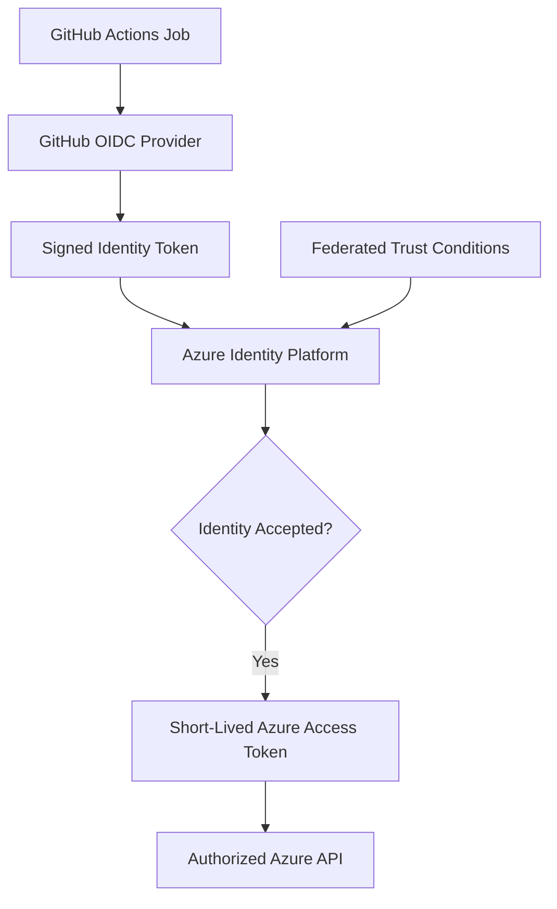

### What should Azure verify?

Relevant conditions can include:

- Token issuer.
- Token audience.
- Repository identity.
- Branch, environment, or other permitted subject context.
- Associated federated identity configuration.

The exact conditions depend on the provider and selected federation mechanism.

### What does this solve?

It can remove the need to store certain long-lived cloud credentials in GitHub secrets.

### What does it not solve?

It does not automatically enforce correct Azure RBAC.

It does not prevent malicious authorized workflow code from abusing the permissions it receives.

It does not make every GitHub event equally trustworthy.

GitHub explicitly states that `id-token: write` permits requesting an OIDC token; it does not itself grant permission to modify cloud resources. [GitHub Docs](https://docs.github.com/en/actions/how-tos/secure-your-work/security-harden-deployments/oidc-in-cloud-providers?utm_source=chatgpt.com)

---

## 20. Azure OIDC Example

Since we have been using Azure and AKS in our architecture, let's examine the integration.

A workflow job might use:

```yaml
permissions:
  contents: read
  id-token: write
```

And authenticate through:

```yaml
- name: Authenticate to Azure
  uses: azure/login@v2
  with:
    client-id: ${{ vars.AZURE_CLIENT_ID }}
    tenant-id: ${{ vars.AZURE_TENANT_ID }}
    subscription-id: ${{ vars.AZURE_SUBSCRIPTION_ID }}
```

This is an authentication example, not a complete workflow.

It requires the Azure-side federated identity configuration to exist and match the workflow's identity claims.

The `azure/login` action version is a readable example. For production, review and pin the action's full commit SHA.

### Important architectural decision

Does our application image-publishing workflow need Azure authentication?

If it publishes to GHCR, probably not.

Does a GitOps promotion PR need Azure credentials?

Not necessarily.

Does Argo CD need GitHub Actions to authenticate to AKS?

No. Argo CD uses its own configured Kubernetes access.

### First-principles conclusion

**Do not add cloud credentials to a workflow simply because the application eventually runs in the cloud.**

Give cloud permissions only to jobs whose actual responsibilities require them.

---

# Part V — Artifact Trust and Provenance

## 21. An Image Digest Proves Identity, Not Trustworthiness

Consider:

```text
ghcr.io/example/ecommerce-api@sha256:<digest>
```

The digest identifies a particular registry object using content-addressed hashing.

This is extremely useful.

We can select the same artifact repeatedly without relying on a mutable tag.

But ask:

> Does the digest prove that the image was produced by our approved release workflow?

No.

An attacker could publish a different malicious image and obtain a perfectly valid digest for that image.

### Distinguish the concepts

| Concept | Question answered |
|---|---|
| Digest | Which exact artifact content is identified? |
| Publisher authorization | Who was allowed to publish into the registry? |
| Provenance | Where, when, and how was the artifact built? |
| Attestation | What verifiable statement is associated with the artifact? |
| Signature | Can we verify a signer or signing identity for some data? |
| SBOM | Which software components are declared or discovered? |
| Vulnerability scan | Which known vulnerabilities were detected under the scanner's coverage? |
| Release policy | Is this artifact acceptable for this environment? |

### Important principle

> **Content integrity, origin authenticity, vulnerability assessment, and release authorization are different security properties.**

A secure supply chain needs the relevant combination.

---

## 22. Build Provenance: Where Did This Artifact Come From?

Imagine you are investigating:

```text
Production Image Digest:
sha256:...
```

You want to know:

- Which repository supplied the source?
- Which source revision was built?
- Which workflow executed the build?
- Which build system produced the artifact?
- What build information was recorded?

This is the purpose of build provenance.

SLSA describes provenance as verifiable information used to trace an artifact through the supply chain to its origin and production process. [SLSA](https://slsa.dev/spec/v1.2/provenance?utm_source=chatgpt.com)

### Provenance relationship

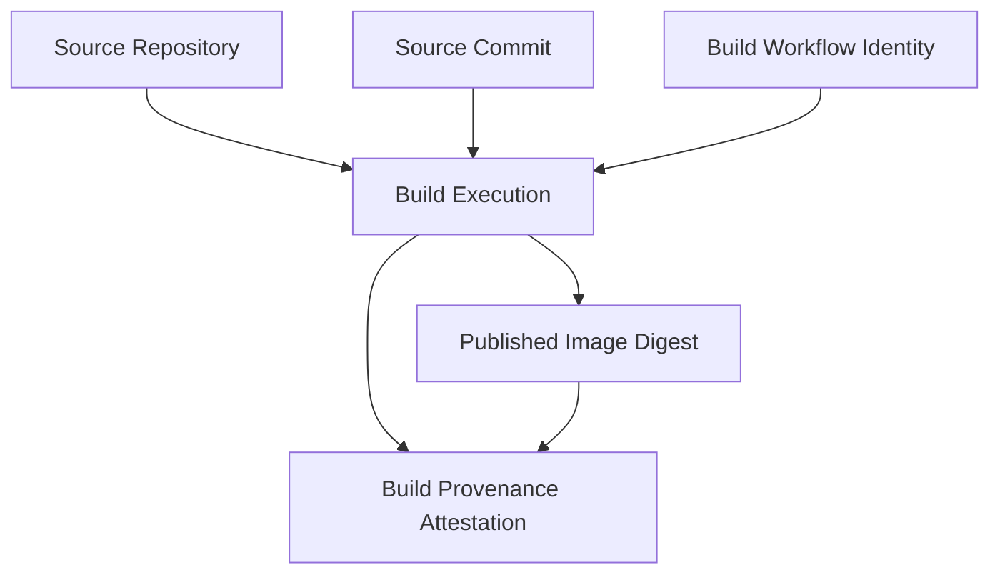

### Important qualification

Provenance is not a guarantee that source code is free from malicious behavior.

If an attacker gets malicious code approved into `main`, a legitimate build can faithfully produce a malicious image.

The provenance may be accurate.

The software may still be harmful.

### Security insight

**Provenance helps establish origin and build-process identity. Source authorization and code security remain separate controls.**

---

## 23. Artifact Attestations

GitHub Actions supports generating artifact attestations for binaries and container images.

An attestation can associate a software artifact with authenticated information about its build.

For container images, GitHub's current documentation uses `actions/attest@v4` and supports publishing attestations alongside OCI artifacts. [GitHub Docs](https://docs.github.com/en/actions/how-tos/secure-your-work/use-artifact-attestations/use-artifact-attestations?utm_source=chatgpt.com)

### Conceptual lifecycle

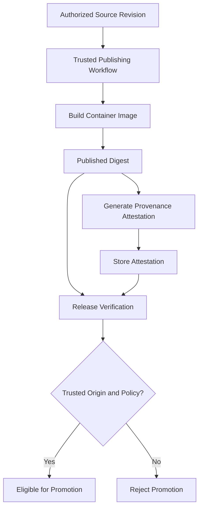

### The crucial distinction

Creating an attestation is one operation.

**Verifying the attestation against a trusted identity and release policy is another.**

A pipeline that generates attestations but never verifies them at the release boundary has not implemented the full trust control.

---

## 24. SBOM: Understanding What We Ship

SBOM means **Software Bill of Materials**.

It provides an inventory of software components associated with an artifact.

For example, an SBOM might identify:

```text
Application

Runtime

Direct Dependencies

Transitive Dependencies

Component Versions
```

### Why does this matter?

Imagine a critical vulnerability is disclosed in a particular library.

If you know which deployed images contain that component, you can identify affected releases more quickly.

### What an SBOM does not prove

It does not automatically prove that:

- Every component was detected.
- No hidden malicious component exists.
- All dependencies are vulnerability-free.
- The application is operationally correct.

### Relationships to remember

```text
SBOM
    =
Component Inventory
```

```text
Vulnerability Scanner
    =
Known Vulnerability Evaluation
```

```text
Provenance
    =
Artifact Origin and Build Information
```

```text
Release Policy
    =
Decision About Acceptability
```

These are different parts of a software supply-chain security system.

---

# Part VI — Securing GitOps and Kubernetes

## 25. A Protected GitOps Repository Is a Security Control

Our architecture uses GitOps to record deployment decisions.

Consider this production configuration:

```yaml
images:
  - name: app-image-placeholder
    newName: ghcr.io/example/ecommerce-api
    digest: sha256:aaaaaaaaaaaaaaaaaaaaaaaaaaaaaaaaaaaaaaaaaaaaaaaaaaaaaaaaaaaaaaaa
```

Suppose an attacker can modify the production overlay and merge it into the branch watched by Argo CD.

They change the image to an unauthorized artifact.

Argo CD may then reconcile that image into Kubernetes.

The attacker does not need direct Kubernetes credentials.

### Attack path

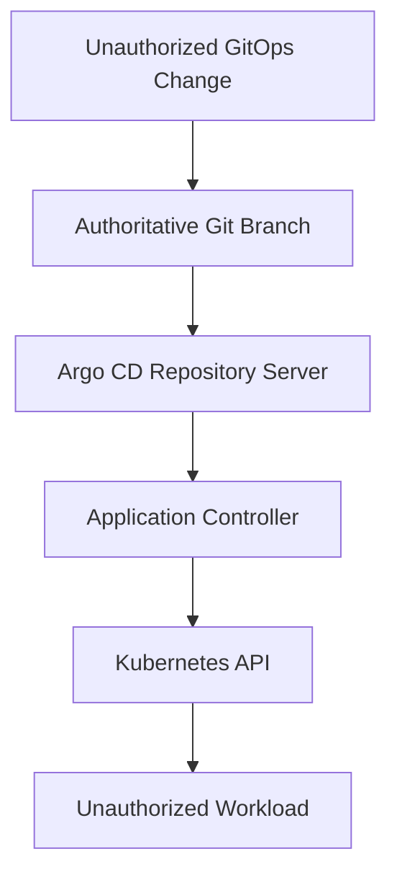

### Security consequences

**GitOps write authority can become indirect deployment authority.**

This is why GitOps repositories require controls such as:

- Restricted write access.
- Required pull requests.
- Required status checks.
- Required reviewers.
- Code-owner review for sensitive paths.
- Restricted bypass permissions.
- Protected production configuration.

For example, a `CODEOWNERS` file may contain:

```text
/applications/ecommerce-api/overlays/production/ @YOUR_ORG/platform-team
/argocd/bootstrap/ @YOUR_ORG/platform-team
```

This associates sensitive paths with designated code owners.

But a `CODEOWNERS` file alone does not enforce approval.

The repository must also have appropriate review and branch rules.

### Important principle

> **A system that continuously trusts Git configuration must protect changes to that configuration as privileged operations.**

---

## 26. Argo CD Is a Privileged Consumer of Git

Argo CD reads Git and applies Kubernetes changes.

That means it connects two security domains:

```text
Git Repository
      |
      v
Argo CD
      |
      v
Kubernetes
```

The controller must possess sufficient permissions to manage its intended resources.

But what if it has excessive permissions?

A malicious or incorrect GitOps change may be able to influence more resources than intended.

### Defense-in-depth controls

**GitHub repository permissions**

Control who may modify desired state.

**Argo CD RBAC**

Controls who may manage Applications and request privileged operations through Argo CD.

**Argo CD AppProjects**

Restrict permitted source repositories, destinations, and resource kinds.

**Kubernetes RBAC**

Constrains the operations the controller's Kubernetes identity can perform.

Argo CD's documentation describes AppProjects as an important boundary for restricting trusted sources, destinations, and resource kinds. ([argo-cd.readthedocs.io](https://argo-cd.readthedocs.io/en/stable/user-guide/projects/?utm_source=chatgpt.com))

### Example AppProject

```yaml
apiVersion: argoproj.io/v1alpha1
kind: AppProject
metadata:
  name: ecommerce-dev
  namespace: argocd

spec:
  sourceRepos:
    - https://github.com/YOUR_OWNER/release-gitops-lab.git

  destinations:
    - server: https://kubernetes.default.svc
      namespace: ecommerce-dev

  clusterResourceWhitelist: []
```

This example limits the source and destination and does not grant broad cluster-scoped resource permissions through the project.

### Important limitation

AppProjects do not replace Kubernetes RBAC.

They also do not guarantee that an application container is safe.

For example, an ordinary Deployment may still run a privileged container if the relevant Kubernetes workload-security policies do not prohibit it.

### General principle

**Restrict both what the deployment controller is allowed to manage and what deployed workloads are allowed to do.**

---

## 27. Secrets: Prevent Exposure at Every Stage

Secrets can be exposed through many paths.

Consider a workflow that uses:

```text
DATABASE_PASSWORD
```

Potential exposure points include:

- Workflow environment variables.
- Process arguments.
- Console logs.
- Debug output.
- Generated files.
- Uploaded artifacts.
- Docker image layers.
- Build caches.
- Kubernetes manifests.

### Important distinction

Storing a value in GitHub Actions secrets is not sufficient to guarantee safe handling.

If a workflow copies it into a public file or sends it to an external endpoint, the secret is still exposed.

Similarly, GitHub's log masking should not be treated as a guarantee against every form of secret leakage.

### Secure design principles

1. Avoid secrets when workload identity can provide an appropriate alternative.
2. Give secrets only to the jobs that actually need them.
3. Avoid exposing production secrets to untrusted PR execution.
4. Do not embed secrets into Docker image layers.
5. Do not store plaintext production credentials in GitOps configuration.
6. Limit the lifetime and permissions of credentials.
7. Plan how to revoke and rotate them after exposure.

### Docker-specific example

Avoid embedding credentials through:

```dockerfile
ARG API_TOKEN
ENV API_TOKEN=${API_TOKEN}
```

Build arguments and image configuration are not appropriate general-purpose secret stores.

If a build genuinely needs a secret, use a supported build-secret mechanism with narrowly scoped credentials.

Prefer separating build-time dependencies from runtime credentials entirely.

### Fundamental lesson

**A secret's security depends on where it can flow, not merely on where it was originally stored.**

---

## 28. Secure the Runtime Boundary Too

Suppose our CI/CD system successfully publishes and verifies an image.

Argo CD deploys it.

Now Kubernetes starts the container.

The runtime still needs appropriate restrictions.

Questions include:

- Does the Pod require root?
- Does it need privileged mode?
- Does it need host filesystem access?
- Does it need a Kubernetes service account token?
- Which namespaces and network destinations can it reach?
- Which cloud resources can its workload identity access?
- Which Secrets can it read?

### Example baseline container configuration

```yaml
securityContext:
  allowPrivilegeEscalation: false
  runAsNonRoot: true
  capabilities:
    drop:
      - ALL
```

This is an illustrative container-level security context.

It may require application and image changes to operate successfully.

For example, `runAsNonRoot: true` requires a compatible non-root runtime identity.

### Why include runtime security in CI/CD security?

Because delivery decisions determine which workloads are introduced into the cluster.

A verified build origin does not guarantee the deployed Pod has appropriate runtime permissions.

### Important distinction

**Supply-chain controls establish relevant confidence in the artifact and its origin. Kubernetes security controls limit what the running artifact can do.**

Both matter.

---

# Part VII — Complete Secure Delivery Architecture

## 29. Connect the Controls

We have now identified several independent controls.

Let's assemble them.

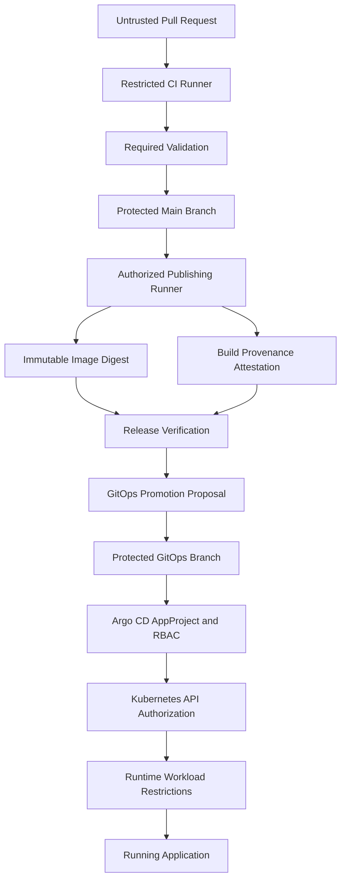

### Notice the separation

**Validation** decides whether configured checks pass.

**Publishing permission** controls who can create official artifacts.

**Attestation** provides verifiable build-origin information.

**Release policy** decides whether an artifact is eligible.

**GitOps approval** authorizes desired-state changes.

**Argo CD policy** restricts managed sources and destinations.

**Kubernetes policy** restricts cluster operations and runtime behavior.

### The central security design

> **No single green CI check or successful authentication event should implicitly grant unrestricted authority across the entire software delivery chain.**

---

# Part VIII — Practical Lab 14: Secure the Existing CI/CD Pipeline

## 30. Lab Requirements

We will extend the same project we have used throughout the course.

### Application repository

```text
ci-artifact-lab/
```

### GitOps repository

```text
release-gitops-lab/
```

### Tools

- GitHub Actions.
- GHCR.
- Docker.
- GitHub CLI.
- Python.
- Existing GitOps configuration.

### What we will implement

**SEC-01:** Pull requests use a restricted validation workflow.

**SEC-02:** Publishing runs only for the intended authorized source event.

**SEC-03:** Publishing permissions are isolated from ordinary validation.

**SEC-04:** Published images are identified by digest.

**SEC-05:** The publishing workflow generates build provenance attestations.

**SEC-06:** Release verification checks the expected signer workflow and source revision.

**SEC-07:** GitOps promotion uses the verified artifact identity.

**SEC-08:** Required release evidence is preserved.

**SEC-09:** Invalid or unauthorized artifacts are rejected before promotion.

**SEC-10:** We test security failures without using real cloud credentials.

### Important prerequisite

The attestation portion requires a repository eligible for GitHub artifact attestations.

GitHub's current documentation states that artifact attestations are available for public repositories on Free, Pro, and Team plans; private/internal use requires the applicable Enterprise Cloud eligibility. Check the current feature availability for your repository. ([docs.github.com](https://docs.github.com/en/actions/how-tos/secure-your-work/use-artifact-attestations/use-artifact-attestations?utm_source=chatgpt.com))

If the repository is not eligible, complete the local policy and identity exercises, but do not claim that a provenance-verification control is operational.

---

## 31. Lab Part A — Audit the Existing Workflow

Open:

```text
ci-artifact-lab/.github/workflows/
```

Inspect the validation and release workflows.

Before editing, answer:

| Question | Expected secure design |
|---|---|
| Do PR jobs publish images? | No |
| Do PR jobs receive cloud credentials? | No |
| Do test jobs need package write access? | No |
| Does publication require successful validation? | Yes |
| Does the release workflow publish from authorized `main`? | Yes |
| Are artifact digests recorded? | Yes |
| Are actions reviewed and pinned? | Required for stronger production hardening |
| Can untrusted data become shell code? | Should be prevented |
| Does the GitOps repository require approval? | According to its release policy |
| Is the deployment artifact verified before promotion? | Must be verified for the stronger design |

### First-principles exercise

For every permission, write:

```text
Permission:

Which job requires it?

Which operation uses it?

What happens if it is stolen or misused?

Can the job operate without it?
```

This is more useful than blindly copying a security checklist.

---

## 32. Lab Part B — Separate Validation From Publishing

Use the restricted PR workflow from Section 8 as the starting point.

Then modify the **existing** `release.yml` from Phase 12.

Do not create a second independent publishing workflow that publishes the same release without a clear reason.

The intended structure is:

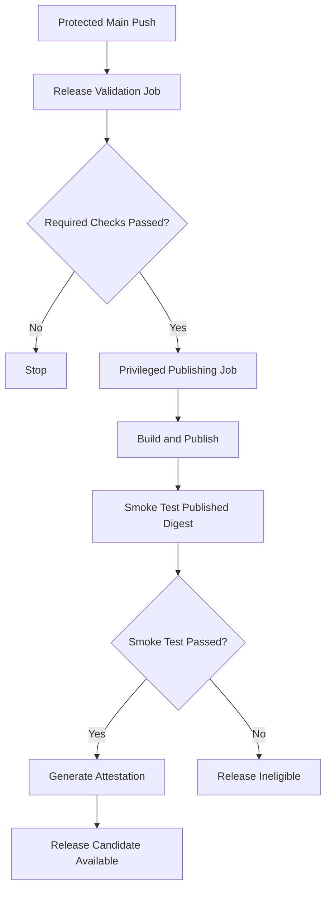

### Why two jobs?

Because the first job only needs source-read authority.

The second job needs registry and attestation permissions.

The second should not start until the required validation succeeds.

This is a security boundary expressed through the workflow dependency graph.

---

## 33. Lab Part C — Implement the Secure Publishing Workflow

The following is a complete reference workflow for our existing Node.js application.

It assumes:

- `npm ci` works.
- `npm run typecheck` exists.
- `npm test` runs the required tests.
- `npm run build` works.
- The Dockerfile runs an HTTP server on port 3000.
- `/health` returns HTTP 200 when the application is ready.

If your Phase 06 project requires PostgreSQL integration tests, retain their required CI jobs and make publishing depend on that complete validation gate—not just the simplified validation job below.

Replace the relevant logic in the existing:

```text
.github/workflows/release.yml
```

```yaml
name: Publish Verified Image

on:
  push:
    branches:
      - main

permissions:
  contents: read

jobs:
  validate:
    name: Validate Release Source
    runs-on: ubuntu-latest
    timeout-minutes: 15

    permissions:
      contents: read

    steps:
      - name: Checkout source
        uses: actions/checkout@v4
        with:
          persist-credentials: false

      - name: Setup Node.js
        uses: actions/setup-node@v4
        with:
          node-version: "22"

      - name: Install dependencies
        run: npm ci

      - name: Typecheck
        run: npm run typecheck

      - name: Test
        run: npm test

      - name: Build application
        run: npm run build

  publish:
    name: Publish and Attest Image
    needs:
      - validate

    runs-on: ubuntu-latest
    timeout-minutes: 20

    permissions:
      contents: read
      packages: write
      id-token: write
      attestations: write

    steps:
      - name: Checkout authorized source
        uses: actions/checkout@v4
        with:
          persist-credentials: false

      - name: Determine image name
        id: image
        shell: bash
        run: |
          IMAGE_NAME="ghcr.io/${GITHUB_REPOSITORY,,}"
          echo "name=$IMAGE_NAME" >> "$GITHUB_OUTPUT"

      - name: Setup Docker Buildx
        uses: docker/setup-buildx-action@v3

      - name: Login to GHCR
        uses: docker/login-action@v3
        with:
          registry: ghcr.io
          username: ${{ github.actor }}
          password: ${{ secrets.GITHUB_TOKEN }}

      - name: Build and publish image
        id: build
        uses: docker/build-push-action@v6
        with:
          context: .
          push: true
          platforms: linux/amd64
          tags: ${{ steps.image.outputs.name }}:${{ github.sha }}

      - name: Verify published image runs
        shell: bash
        env:
          IMAGE_NAME: ${{ steps.image.outputs.name }}
          IMAGE_DIGEST: ${{ steps.build.outputs.digest }}
        run: |
          set -euo pipefail

          IMAGE_REF="${IMAGE_NAME}@${IMAGE_DIGEST}"
          CONTAINER="smoke-${GITHUB_RUN_ID}-${GITHUB_RUN_ATTEMPT}"

          docker pull "$IMAGE_REF"

          docker run --detach \
            --name "$CONTAINER" \
            -p 127.0.0.1:18094:3000 \
            "$IMAGE_REF"

          trap 'docker rm -f "$CONTAINER" >/dev/null 2>&1 || true' EXIT

          READY=false

          for attempt in $(seq 1 20); do
            if curl --fail --silent \
              http://127.0.0.1:18094/health \
              >/dev/null; then
              READY=true
              break
            fi

            sleep 2
          done

          if [ "$READY" != "true" ]; then
            echo "Published image failed smoke testing"
            docker logs "$CONTAINER"
            exit 1
          fi

          echo "Published image smoke test passed"

      - name: Generate build provenance attestation
        uses: actions/attest@v4
        with:
          subject-name: ${{ steps.image.outputs.name }}
          subject-digest: ${{ steps.build.outputs.digest }}
          push-to-registry: true

      - name: Record release identity
        env:
          IMAGE_NAME: ${{ steps.image.outputs.name }}
          IMAGE_DIGEST: ${{ steps.build.outputs.digest }}
        run: |
          {
            echo "## Verified Release Candidate"
            echo
            echo "Source SHA: $GITHUB_SHA"
            echo
            echo "Image: $IMAGE_NAME@$IMAGE_DIGEST"
            echo
            echo "Published image smoke test: passed"
            echo
            echo "Build provenance attestation: generated"
          } >> "$GITHUB_STEP_SUMMARY"
```

### Understand the permissions

The validation job has:

```yaml
permissions:
  contents: read
```

The publishing job has:

```yaml
permissions:
  contents: read
  packages: write
  id-token: write
  attestations: write
```

Each permission corresponds to a responsibility.

| Permission | Purpose |
|---|---|
| `contents: read` | Read source |
| `packages: write` | Publish container package |
| `id-token: write` | Obtain identity token used for attestation |
| `attestations: write` | Write GitHub artifact attestation |

### Why attest after the published-image smoke test?

Because our release policy requires a successful runtime smoke test before the artifact becomes eligible for promotion.

There is one subtle limitation:

**The registry push happens before the smoke test.**

If smoke testing fails, the image may already exist in GHCR.

Therefore, **registry existence must not be treated as release eligibility**.

Only the successful publishing-and-verification workflow result should establish eligibility under this lab's policy.

### Important production hardening

The workflow uses readable action-version tags so that you can understand the architecture.

For a production security baseline, resolve and review the intended action revisions, then pin each `uses:` reference to a full-length commit SHA.

Pinning should be accompanied by controlled dependency updates and source review.

---

## 34. Lab Part D — Execute and Inspect the Publishing Workflow

Commit the workflow change through a pull request.

Ensure the required validation and review policies are satisfied.

After it merges into protected `main`, inspect the publishing workflow run.

Using GitHub CLI:

```bash
export APP_REPO="YOUR_OWNER/ci-artifact-lab"
```

List recent runs:

```bash
gh run list \
  --repo "$APP_REPO" \
  --workflow release.yml \
  --branch main \
  --limit 5
```

Set the successful run ID:

```bash
export RUN_ID="YOUR_SUCCESSFUL_RUN_ID"
```

Inspect its result:

```bash
gh run view "$RUN_ID" \
  --repo "$APP_REPO"
```

Record the actual source revision:

```bash
export SOURCE_SHA="$(
  gh run view "$RUN_ID" \
    --repo "$APP_REPO" \
    --json headSha \
    --jq '.headSha'
)"
```

### Find the published image digest

Open the workflow summary.

Copy the digest-based image reference.

Set:

```bash
export IMAGE_REF="ghcr.io/YOUR_OWNER/ci-artifact-lab@sha256:YOUR_DIGEST"
```

Now we have:

```text
Source revision:
SOURCE_SHA
```

```text
Build execution:
RUN_ID
```

```text
Published image:
IMAGE_REF
```

But there is still one important question:

**Can we verify that this artifact came from the expected publishing workflow?**

That's the next lab step.

---

## 35. Lab Part E — Verify Build Provenance

GitHub CLI supports verifying artifact attestations.

For container images, provide an OCI reference and the expected repository identity.

The CLI also supports constraints such as the signer workflow, source revision, and source Git ref. ([GitHub CLI reference](https://cli.github.com/manual/gh_attestation_verify))

### Step 1 — Confirm authentication

```bash
gh auth status
```

If required, authenticate to GHCR with a token authorized to read the package:

```bash
gh auth token \
  | docker login ghcr.io \
      --username YOUR_OWNER \
      --password-stdin
```

Do not print the token to terminal logs.

### Step 2 — Verify the artifact

Run:

```bash
gh attestation verify \
  "oci://${IMAGE_REF}" \
  --repo "$APP_REPO"
```

If an attestation is available and valid, the command should succeed.

### Step 3 — Enforce the expected signer workflow

Now make the identity requirement more specific:

```bash
gh attestation verify \
  "oci://${IMAGE_REF}" \
  --repo "$APP_REPO" \
  --signer-workflow "${APP_REPO}/.github/workflows/release.yml"
```

### Step 4 — Enforce the expected source revision

```bash
gh attestation verify \
  "oci://${IMAGE_REF}" \
  --repo "$APP_REPO" \
  --signer-workflow "${APP_REPO}/.github/workflows/release.yml" \
  --source-ref "refs/heads/main" \
  --source-digest "$SOURCE_SHA"
```

### What does this establish?

The verifier evaluates the cryptographic attestation and checks the requested source and signer identity conditions.

### What does it not establish?

It does not prove that:

- The source has no malicious logic.
- The application has no vulnerabilities.
- The publishing workflow cannot be compromised.
- Production approval exists.
- The application will behave correctly after deployment.

### Important principle

**Provenance verification establishes selected origin and build-identity properties. Release authorization still requires separate policy decisions.**

---

## 36. Lab Part F — Reject the Wrong Signer

Now perform a negative test.

We want to verify that an artifact is not accepted merely because some attestation exists.

Run the verifier with a workflow identity that should not match the legitimate publishing workflow:

```bash
if gh attestation verify \
  "oci://${IMAGE_REF}" \
  --repo "$APP_REPO" \
  --signer-workflow "${APP_REPO}/.github/workflows/untrusted-publisher.yml"
then
  echo "ERROR: Unexpected signer accepted"
  exit 1
else
  echo "PASS: Unexpected signer rejected"
fi
```

### Expected outcome

Verification should fail unless a valid attestation from the specified unexpected workflow actually exists.

### What security property did we test?

**Signer identity enforcement.**

The goal is not merely to prove that the image has an attestation.

The goal is to establish that the attestation comes from an identity permitted by our release policy.

---

## 37. Lab Part G — Reject the Wrong Source Revision

Next, verify source identity.

Take a source SHA that does not correspond to the release.

For example:

```bash
export WRONG_SHA="0000000000000000000000000000000000000000"
```

Run:

```bash
if gh attestation verify \
  "oci://${IMAGE_REF}" \
  --repo "$APP_REPO" \
  --source-digest "$WRONG_SHA"
then
  echo "ERROR: Unexpected source revision accepted"
  exit 1
else
  echo "PASS: Incorrect source revision rejected"
fi
```

### What did we demonstrate?

The image should not satisfy an arbitrary source-revision claim merely because its digest is valid.

### Think from first principles

We now have three independent identities:

```text
Expected Source SHA
```

```text
Expected Builder Workflow
```

```text
Expected Image Digest
```

A trustworthy release decision must bind the relevant identities together.

---

# Part IX — Turn Provenance Into an Enforceable Release Decision

## 38. A Valid Attestation Is Not Yet a Complete Release Gate

Let's imagine we successfully verified:

```text
Image Digest:
Correct
```

```text
Source Revision:
Correct
```

```text
Signer Workflow:
Correct
```

Is the image now automatically approved for production?

No.

We also need to know whether the required workflow execution completed successfully and whether the source revision was authorized for release.

For example, the workflow might have published an image but failed its later smoke test.

The image could remain in the registry.

### Required release conditions

For our reference architecture:

```text
Expected Source Revision
              +
Successful Authorized Workflow Run
              +
Expected Publishing Workflow
              +
Verified Image Attestation
              +
Existing Registry Artifact
              +
GitOps Authorization
              |
              v
Eligible Deployment
```

The important principle is that each condition answers a different question.

---

## 39. Verify the Workflow Run Independently

We already have:

```bash
export APP_REPO="YOUR_OWNER/ci-artifact-lab"
```

```bash
export RUN_ID="YOUR_SUCCESSFUL_RUN_ID"
```

```bash
export SOURCE_SHA="YOUR_EXPECTED_SOURCE_SHA"
```

Retrieve the actual workflow execution metadata:

```bash
RUN_DATA="$(
  gh run view "$RUN_ID" \
    --repo "$APP_REPO" \
    --json conclusion,headSha,headBranch,event
)"
```

Now check the expected values:

```bash
printf '%s\n' "$RUN_DATA" \
  | jq -e \
      --arg source "$SOURCE_SHA" \
      '
        .conclusion == "success"
        and .headSha == $source
        and .headBranch == "main"
        and .event == "push"
      '
```

### Why do this?

Because we should not trust a file containing:

```json
{
  "status": "passed"
}
```

as sufficient evidence of an actual successful workflow run.

The GitHub API is queried for the execution result.

We also independently verify the image attestation.

### Important qualification

The workflow file itself must be trusted and reviewed.

A successful run is useful evidence only when the workflow's configured steps actually enforce the required checks.

For example, if someone removes the smoke test from the trusted publishing workflow, the successful run no longer proves that the smoke test executed.

### The deeper principle

> **Release security requires trusted policies, trusted execution identities, and evidence that the required policies were actually evaluated.**

---

## 40. Build a Pre-Promotion Verification Script

Let's combine the relevant verification steps into one operation.

In your GitOps repository, create:

```text
scripts/verify_release_candidate.sh
```

Add:

```bash
#!/usr/bin/env bash

set -euo pipefail

APP_REPO="${1:?Usage: verify_release_candidate.sh OWNER/REPO RUN_ID SOURCE_SHA IMAGE_REF}"
RUN_ID="${2:?Missing workflow run ID}"
SOURCE_SHA="${3:?Missing source SHA}"
IMAGE_REF="${4:?Missing image reference}"

echo "====================================="
echo " Verifying Release Candidate"
echo "====================================="

echo "Repository: $APP_REPO"
echo "Run ID: $RUN_ID"
echo "Source SHA: $SOURCE_SHA"
echo "Image: $IMAGE_REF"

# --------------------------------------------------
# 1. Validate required input formats
# --------------------------------------------------

if [[ ! "$SOURCE_SHA" =~ ^[0-9a-f]{40}$ ]]; then
  echo "ERROR: Invalid source SHA format"
  exit 1
fi

if [[ ! "$IMAGE_REF" =~ ^ghcr\.io/[a-z0-9._/-]+@sha256:[0-9a-f]{64}$ ]]; then
  echo "ERROR: Expected an immutable GHCR image reference"
  exit 1
fi

# --------------------------------------------------
# 2. Verify successful workflow execution
# --------------------------------------------------

RUN_DATA="$(
  gh run view "$RUN_ID" \
    --repo "$APP_REPO" \
    --json conclusion,headSha,headBranch,event
)"

printf '%s\n' "$RUN_DATA" \
  | jq -e \
      --arg source "$SOURCE_SHA" \
      '
        .conclusion == "success"
        and .headSha == $source
        and .headBranch == "main"
        and .event == "push"
      ' >/dev/null

echo "PASS: Authorized main-branch execution succeeded"

# --------------------------------------------------
# 3. Verify registry artifact availability
# --------------------------------------------------

docker buildx imagetools inspect \
  "$IMAGE_REF" \
  >/dev/null

echo "PASS: Registry artifact exists and is accessible"

# --------------------------------------------------
# 4. Verify provenance identity
# --------------------------------------------------

gh attestation verify \
  "oci://${IMAGE_REF}" \
  --repo "$APP_REPO" \
  --signer-workflow "${APP_REPO}/.github/workflows/release.yml" \
  --source-ref "refs/heads/main" \
  --source-digest "$SOURCE_SHA" \
  >/dev/null

echo "PASS: Artifact provenance identity verified"

echo "====================================="
echo " RELEASE CANDIDATE VERIFIED"
echo "====================================="
```

Make it executable:

```bash
chmod +x scripts/verify_release_candidate.sh
```

### Dependencies

The script requires:

```text
GitHub CLI

Docker with Buildx

jq

Bash
```

It also requires suitable authentication and access to the repository and image.

### What does this script enforce?

It rejects release candidates when:

- The source SHA has an invalid format.
- The image lacks a digest.
- The GitHub workflow run did not succeed.
- The run's source SHA does not match.
- The run was not a push event from `main`.
- The registry artifact is unavailable.
- Provenance verification fails.
- The attestation does not match the expected workflow or source.

### What remains outside this script?

The script is not a complete production release authorization system.

For example, it does not prove:

- The GitHub branch rules cannot be bypassed.
- The artifact has no known vulnerabilities.
- The workflow's test coverage is sufficient.
- The Kubernetes configuration is valid.
- Production approval exists.
- A previous release can be safely restored.

Also, this script trusts its supplied repository name and run ID. In a centrally enforced system, those values should be constrained by the release policy rather than accepted from an arbitrary contributor.

### Important distinction

**This script evaluates selected artifact eligibility properties. GitOps repository policies still authorize the environment change.**

---

## 41. Execute the Pre-Promotion Gate

Use your actual release values:

```bash
./scripts/verify_release_candidate.sh \
  "$APP_REPO" \
  "$RUN_ID" \
  "$SOURCE_SHA" \
  "$IMAGE_REF"
```

Expected conceptual result:

```text
PASS: Authorized main-branch execution succeeded

PASS: Registry artifact exists and is accessible

PASS: Artifact provenance identity verified

RELEASE CANDIDATE VERIFIED
```

If any check fails, the script should return a nonzero exit code.

### What should happen next?

Only after artifact verification should the release process propose the corresponding GitOps configuration change.

This gives us:

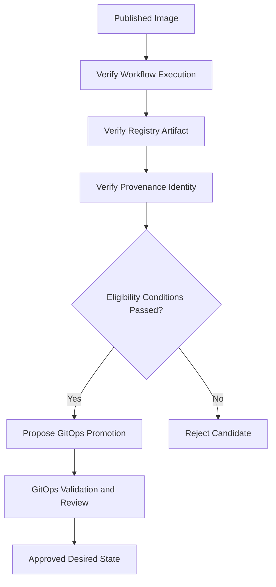

### Important production requirement

A human running this script voluntarily is not equivalent to an enforced release gate.

To enforce it, the verification logic must execute under a trusted policy boundary before deployment configuration can become authoritative.

For example:

- A centrally controlled GitOps pull-request check.
- A protected reusable workflow.
- An independent release authorization service.
- A suitable deployment admission policy.

Protecting the verification code from unreviewed modification is part of the security design.

---

## 42. Connect Artifact Verification to GitOps Promotion

Now use the Phase 09 promotion mechanism.

First verify the image repository matches the expected application.

Then extract the digest:

```bash
export IMAGE_DIGEST="${IMAGE_REF##*@}"
```

Prepare development promotion:

```bash
python3 scripts/promote.py \
  dev \
  "$IMAGE_DIGEST"
```

Inspect:

```bash
git diff
```

Then validate the desired Kubernetes configuration:

```bash
python scripts/validate_gitops.py
```

Finally, create a GitOps pull request and apply the required review rules.

### The complete authorization sequence

```text
Successful CI
      |
      v
Verified Published Artifact
      |
      v
Release Candidate Eligible
      |
      v
GitOps Change Proposed
      |
      v
GitOps Policy Validation
      |
      v
Required Review
      |
      v
Approved Git Commit
      |
      v
Argo CD Reconciliation
```

### Why is this architecture powerful?

Because the artifact producer does not need direct production Kubernetes permissions.

The release verifier does not need permission to run arbitrary code inside production.

The GitOps reviewer does not need to rebuild the application.

Argo CD does not need to determine which GitHub workflow was trustworthy by itself if the protected upstream release policy has already enforced that condition.

### Security architecture insight

> **A strong delivery system narrows responsibilities so that compromising one stage does not automatically provide every capability needed to change production.**

This is defense in depth.

---

# Part X — Security Failure Experiments

## 43. Failure Experiment 1 — Attempt Publication From an Untrusted Pull Request

Create a normal source pull request.

Inspect which workflows execute.

Expected:

```text
PR Validation:
Runs
```

```text
Main-Branch Publishing:
Does Not Run
```

### Why?

The publishing workflow uses:

```yaml
on:
  push:
    branches:
      - main
```

The pull request should not invoke that workflow merely because a contributor opened a PR.

### What are we testing?

**Event authorization boundaries.**

### Important limitation

The trigger does not prevent a collaborator with sufficient permission from changing the workflow or pushing to `main`.

That is why branch protection, workflow-file review, and restricted bypass permissions are required.

---

## 44. Failure Experiment 2 — Remove Registry Authority From a Test Job

Inspect the pull-request validation job.

It should contain:

```yaml
permissions:
  contents: read
```

It should not contain:

```yaml
permissions:
  packages: write
```

### Why test this?

Because a validation job should not need registry publishing permission to execute tests.

A useful security audit asks:

> If this job were compromised, what could it do using its available credentials?

With read-only source access, the job's authorized GitHub operations are narrower than those of a publishing job.

### What this does not prove

The job may still execute untrusted code.

It may still access data available in the runner.

It may still make network requests.

Least privilege limits the consequences of compromise, but it does not prevent all compromise.

---

## 45. Failure Experiment 3 — Reject Missing Provenance

Choose a test image that has no acceptable attestation from your expected release workflow.

Run:

```bash
gh attestation verify \
  "oci://${TEST_IMAGE_REF}" \
  --repo "$APP_REPO" \
  --signer-workflow "${APP_REPO}/.github/workflows/release.yml"
```

### Expected result

Verification should fail if there is no valid attestation satisfying the requested identity constraints.

### What should release engineering do?

Reject the candidate under a policy requiring that attestation.

### What should it not do?

Automatically change the policy to:

```text
If attestation missing, allow deployment anyway.
```

That would turn a required security control into an informational check.

### Fundamental lesson

**Required evidence must fail closed when the relevant evidence is missing or invalid.**

---

## 46. Failure Experiment 4 — Detect a Mutable GitOps Image Tag

Open the GitOps development overlay.

Temporarily replace:

```yaml
digest: sha256:aaaaaaaaaaaaaaaaaaaaaaaaaaaaaaaaaaaaaaaaaaaaaaaaaaaaaaaaaaaaaaaa
```

with a mutable tag configuration:

```yaml
newTag: latest
```

Remove the `digest` field in that temporary test.

Run:

```bash
python scripts/validate_gitops.py
```

The Phase 10 validator should reject the rendered image because it requires a digest-based reference.

Restore the original overlay afterward.

### What did we test?

The policy:

```text
Deployment Image
    MUST
Use Immutable Artifact Identity
```

### Important distinction

A digest does not establish that the artifact is approved.

It establishes a specific artifact identity.

The provenance and authorization checks add other required properties.

---

## 47. Failure Experiment 5 — Simulate a Compromised Publishing Identity

This is a **tabletop experiment**. Do not create or steal credentials.

Assume an attacker obtains the ability to publish images to your GHCR package.

They publish:

```text
sha256:UNAUTHORIZED_IMAGE
```

Now ask:

1. Can they modify the application repository?
2. Can they produce a valid attestation from the trusted workflow?
3. Can they change the GitOps repository?
4. Can they bypass the required release approval?
5. Will the release verifier accept the image?
6. Can Kubernetes pull it if it is selected?
7. Could another authorized user accidentally promote it?

### Expected defensive reasoning

Registry publication alone should not grant production release eligibility.

A release verification policy should require the expected source and build identity.

The GitOps repository should enforce its own authorization process.

Argo CD should only reconcile approved desired configuration within its permitted scope.

### Fundamental lesson

**An attacker compromising one delivery component should encounter additional independent controls before affecting production.**

---

## 48. Failure Experiment 6 — Simulate a Compromised GitOps Repository

Assume an attacker can submit a GitOps pull request.

They propose:

```text
Production Image:
Unauthorized Digest
```

What should stop the change?

Potential controls include:

- Required review from an authorized team.
- Required GitOps validation.
- Artifact provenance verification.
- Allowed registry policies.
- Restricted merge permissions.
- Restricted bypass permissions.

### Important nuance

If the attacker can also modify the policy workflow or bypass branch protection, the security model becomes weaker.

For stronger separation, sensitive policy definitions may need to be maintained under a separate trusted ownership boundary.

### Security principle

> **A security gate is only as trustworthy as the system that controls the gate's configuration and execution.**

---

# Part XI — Incident Response for a Compromised Delivery System

## 49. What Happens After a Supply-Chain Compromise?

Imagine you discover that a publishing workflow was compromised.

A successful response must consider more than the current Kubernetes Pods.

The incident may involve:

- Repository history.
- Workflow configuration.
- CI execution environments.
- Registry artifacts.
- Credentials.
- Attestations.
- GitOps release records.
- Running workloads.

### Response model

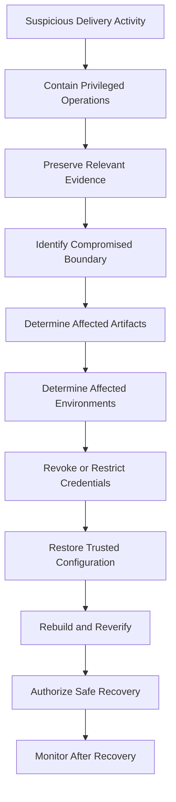

The exact sequence may change during a live incident. Urgent containment and evidence preservation may need to proceed in parallel.

### Important operational questions

**Which workflow runs were affected?**

Identify their execution IDs and source revisions.

**Which images were produced?**

Record their digests.

**Which GitOps commits selected those images?**

Inspect release history.

**Which environments ran them?**

Inspect deployment records and observed runtime state.

**Which credentials could have been accessed?**

Evaluate token and secret exposure.

**Which artifacts should no longer be trusted?**

Update release eligibility and deployment policies accordingly.

### Important distinction

Deleting a malicious image from a registry is not automatically sufficient if an environment has already pulled and started it.

Similarly, restoring a previous GitOps image reference does not automatically reverse malicious data or external side effects.

---

## 50. Security Metrics for a Delivery Platform

Security is not measured by the number of scanning tools installed.

We should evaluate meaningful properties.

| Metric | Engineering question |
|---|---|
| Workflows using least privilege | How many jobs still have excessive permissions? |
| Untrusted jobs with privileged credentials | Are trust boundaries being violated? |
| Third-party action SHA pinning | Are executable action dependencies controlled? |
| Artifact provenance coverage | How many published artifacts have required provenance? |
| Attestation verification coverage | Are releases verified before promotion? |
| Digest-based deployment coverage | Are environments selecting immutable artifacts? |
| Protected GitOps path coverage | Are critical deployment paths governed by review policies? |
| Unauthorized promotion attempts blocked | Are policy boundaries effective? |
| Credential rotation time | How quickly can compromised credentials be revoked? |
| Artifact-to-runtime traceability | Can running versions be linked to source and build identity? |
| Time to contain a delivery compromise | How quickly can unsafe publication or promotion stop? |

### Example

Suppose a team reports:

```text
100% of images scanned
```

But:

```text
Production accepts arbitrary images.
```

The scan coverage is useful but insufficient.

The organization still lacks an effective deployment authorization control.

### Engineering principle

**Measure whether required security properties are enforced, not just whether security tools ran.**

---

# Part XII — Independent System-Design Exercise

## 51. Design a Secure CI/CD Platform for AKS

Imagine you join a company as a DevSecOps or Platform Engineer.

The company operates:

```text
Backend:
Node.js + TypeScript

Database:
PostgreSQL

Cloud:
Azure

Runtime:
AKS

Infrastructure:
Terraform

CI:
GitHub Actions

Registry:
Azure Container Registry

Deployment:
Argo CD
```

There are three environments:

```text
Development

Staging

Production
```

The company has fifteen developers.

External contributors can submit pull requests.

Production deployments require authorization.

Your task is to design the security architecture.

### Exercise A — Identify the assets

Identify at least ten assets that require protection.

For each, document:

```text
Asset:

Why It Matters:

Who Needs Access:

What Happens if Compromised:
```

### Exercise B — Identify trust boundaries

Draw a diagram including:

```text
External Pull Request

Validation Runner

Protected Main

Publishing Runner

Container Registry

Release Authorization

GitOps Repository

Argo CD

AKS
```

For every connection, identify:

- Input.
- Trust level.
- Identity.
- Required permission.
- Possible compromise.
- Security control.

### Exercise C — Design workflow permissions

You have four jobs:

```text
Unit Tests

Integration Tests

Image Publishing

Release Promotion
```

Decide which require:

```text
contents: read

contents: write

packages: write

id-token: write

attestations: write
```

Explain every permission.

Do not grant a permission merely because it might be useful later.

### Exercise D — Design OIDC authentication

Assume one workflow genuinely requires Azure access.

Define:

```text
Trusted Repository

Trusted Branch or Environment

OIDC Audience

Federated Identity

Azure Role Assignment

Permitted Azure Resource Scope
```

Explain why OIDC authentication does not automatically imply permission to modify AKS.

### Exercise E — Design artifact trust

Your release must provide:

```text
Source SHA

Build Workflow Identity

CI Run ID

Artifact Digest

Verified Provenance

GitOps Revision
```

Explain how you would reject:

- An image from an unexpected repository.
- An image without a required attestation.
- An image built from an unapproved source revision.
- An image from an unexpected workflow.
- An image whose publishing workflow failed.

### Exercise F — Design GitOps authorization

Production GitOps changes must require approval.

Explain:

1. Who can propose promotion?
2. Who can approve it?
3. What configuration checks are mandatory?
4. How is artifact provenance verified?
5. Which GitHub App permissions are required for automated PR creation?
6. How do you prevent bypassing the intended policy?
7. Which AppProject restrictions should apply?
8. How do Kubernetes RBAC permissions constrain the controller?

### Exercise G — Design incident response

Assume a dependency used by the build was compromised.

Some images containing that dependency were published.

Two of those images reached production.

Design an incident procedure covering:

- Detection.
- Affected image identification.
- Build and source traceability.
- Credential exposure assessment.
- Promotion suspension.
- Trusted recovery artifact selection.
- Kubernetes workload verification.
- Post-incident improvements.

### Final deliverable

Write a short security design document with this structure:

```text
Requirements
     |
     v
Assets and Threats
     |
     v
Trust Boundaries
     |
     v
Required Security Properties
     |
     v
Identity and Authorization
     |
     v
Artifact Verification
     |
     v
GitOps Controls
     |
     v
Implementation
     |
     v
Negative Testing
     |
     v
Recovery
```

Do not begin by listing scanners.

Begin by explaining **what must be trusted, who is allowed to act, and what evidence establishes authorization**.

---

# Part XIII — Memorization and Active Recall

## 52. Ten Security Mental Models

These are the relationships to memorize.

### Mental Model 1 — Security protects authority

```text
Identity
    +
Permissions
    +
Execution Context
    =
Available Capabilities
```

A compromised job can misuse capabilities available to its context.

### Mental Model 2 — Untrusted code needs isolation

```text
Untrusted Pull Request
        |
        v
Restricted Validation
```

Do not combine untrusted execution with unnecessary privileged credentials.

### Mental Model 3 — Authentication is not authorization

```text
Who Are You?
      !=
What May You Do?
```

OIDC proves selected identity properties. Cloud-side authorization still matters.

### Mental Model 4 — A digest is not a signature

```text
Image Digest
      =
Artifact Identity
```

```text
Verified Provenance
      =
Evidence About Origin and Build
```

Neither proves complete application correctness.

### Mental Model 5 — Publication is not release approval

```text
Image Exists in Registry
            !=
Image Authorized for Production
```

### Mental Model 6 — Trust boundaries must be explicit

```text
Lower-Trust Input
        |
        v
Validation and Authorization
        |
        v
Higher-Impact Operation
```

### Mental Model 7 — GitOps write access matters

```text
Modify Trusted GitOps State
            |
            v
Influence Kubernetes Deployment
```

Repository permissions can become indirect deployment authority.

### Mental Model 8 — Security is defense in depth

```text
Protected Source
      +
Restricted Build
      +
Verified Artifact
      +
Authorized Release
      +
Restricted Deployment
```

One control should not silently replace all others.

### Mental Model 9 — Scanning is not proof

```text
No Known Vulnerability Detected
                !=
Software Guaranteed Secure
```

### Mental Model 10 — Recovery requires traceability

```text
Source SHA
     |
     v
Build Run
     |
     v
Image Digest
     |
     v
GitOps Revision
     |
     v
Observed Runtime
```

This chain helps determine what was deployed and what needs recovery.

---

## 53. Active Recall Questions

Close your notes and answer without looking.

### First principles

**Q1.** What is the fundamental purpose of CI/CD security?

**Q2.** What is an asset?

**Q3.** How does a vulnerability differ from a threat?

**Q4.** What is a trust boundary?

**Q5.** Why is least privilege more useful than simply adding more scanners?

### GitHub Actions

**Q6.** Why should external PR validation use restricted permissions?

**Q7.** Why is `pull_request_target` security-sensitive?

**Q8.** Why can directly interpolating PR titles into shell scripts be dangerous?

**Q9.** What does `persist-credentials: false` accomplish?

**Q10.** Why isn't `GITHUB_TOKEN` automatically authorized to modify other repositories?

**Q11.** Why can a self-hosted runner create additional risks?

**Q12.** Why should third-party actions be pinned to full commit SHAs?

### Software supply chain

**Q13.** Why doesn't `npm ci` prove dependency security?

**Q14.** What is cache poisoning?

**Q15.** What is the difference between a registry image digest and provenance?

**Q16.** What does an artifact attestation establish?

**Q17.** Why must the consumer verify attestations?

**Q18.** What is an SBOM?

**Q19.** Why is an SBOM not the same as a vulnerability scan?

### Identity

**Q20.** What is the difference between authentication and authorization?

**Q21.** Why is OIDC useful for cloud workflows?

**Q22.** What does `id-token: write` permit?

**Q23.** Does an OIDC token automatically grant Azure Contributor access?

### GitOps

**Q24.** Why can modifying GitOps configuration become indirect production deployment authority?

**Q25.** What does an AppProject restrict?

**Q26.** Why is AppProject authorization not a replacement for Kubernetes RBAC?

**Q27.** Why must sensitive policy workflow files themselves be protected?

### Recovery

**Q28.** How would you identify every release produced by a compromised build workflow?

**Q29.** Why is deleting a compromised registry image not necessarily enough?

**Q30.** What evidence would you preserve during a CI/CD supply-chain incident?

---

# Part XIV — Interview Questions

## 54. Security System-Design Questions

**Question 1:** Design a GitHub Actions pipeline that validates external pull requests without exposing production credentials.

**Question 2:** Why is running contributor-controlled code inside a privileged `pull_request_target` workflow dangerous?

**Question 3:** Compare `GITHUB_TOKEN`, GitHub App installation tokens, long-lived secrets, and OIDC-based cloud authentication.

**Question 4:** A workflow publishes a container image with a SHA-256 digest. Is that sufficient to trust the image? Explain.

**Question 5:** How would you prove that an image running in AKS was produced by a specific authorized GitHub Actions workflow?

**Question 6:** A publishing workflow passes, but its image contains a compromised dependency. Which security controls could have reduced the risk?

**Question 7:** What is the difference between an SBOM, vulnerability scan, signature, and provenance attestation?

**Question 8:** How would you restrict a GitOps controller so an application team cannot deploy arbitrary cluster-scoped resources?

**Question 9:** A GitOps promotion PR changes production to an image with valid provenance, but the image was built from an unapproved branch. What should happen?

**Question 10:** Design an incident-response process for a compromised CI runner that had access to registry publishing credentials.

The strongest interview answers explain the assets, authorities, trust boundaries, failure scenarios, and controls **before mentioning specific YAML configuration**.

---

# Part XV — Official Documentation

## 55. GitHub Actions Security

**GitHub Actions secure-use reference**

https://docs.github.com/en/actions/reference/security/secure-use

Focus on:

- Untrusted workflow inputs.
- Third-party actions.
- Least privilege.
- Self-hosted runners.
- Executable dependency risks.

**Script injections**

https://docs.github.com/en/actions/concepts/security/script-injections

Focus on separating untrusted event data from executable shell code.

**`pull_request_target` security**

https://docs.github.com/en/actions/reference/security/securely-using-pull_request_target

Focus on privileged workflow execution and untrusted code.

**`GITHUB_TOKEN`**

https://docs.github.com/en/actions/concepts/security/github_token

Focus on token identity, permissions, and repository scope.

---

## 56. Cloud Authentication and Software Provenance

**OIDC authentication for cloud providers**

https://docs.github.com/en/actions/how-tos/secure-your-work/security-harden-deployments/oidc-in-cloud-providers

**Artifact attestations**

https://docs.github.com/en/actions/how-tos/secure-your-work/use-artifact-attestations/use-artifact-attestations

**Verifying artifact attestations**

https://cli.github.com/manual/gh_attestation_verify

**SLSA specification**

https://slsa.dev/spec/v1.2/

**SLSA provenance**

https://slsa.dev/spec/v1.2/provenance

Study how artifact identity, build-system identity, and verifiable provenance relate to one another.

---

## 57. GitOps and Kubernetes Security

**Argo CD AppProjects**

https://argo-cd.readthedocs.io/en/stable/user-guide/projects/

**Argo CD security**

https://argo-cd.readthedocs.io/en/stable/operator-manual/security/

**Kubernetes RBAC**

https://kubernetes.io/docs/reference/access-authn-authz/rbac/

**Kubernetes Pod Security Standards**

https://kubernetes.io/docs/concepts/security/pod-security-standards/

**GitHub artifact-attestation enforcement in Kubernetes**

https://docs.github.com/en/actions/how-tos/secure-your-work/use-artifact-attestations/enforce-artifact-attestations

The final reference describes a stronger deployment-time model: enforcing artifact trust through Kubernetes admission controls.

We did not install an admission controller in this lab. That requires additional policy configuration, trusted-root management, and careful testing.

---

# 58. Phase 14 — Engineering Takeaways

| Principle | Engineering meaning |
|---|---|
| **Security begins with authority** | Identify what each component can do |
| **Threat models identify trust boundaries** | Find where lower-trust inputs influence higher-trust operations |
| **PR code is potentially untrusted** | Validate it in restricted environments |
| **Workflow permissions should be minimal** | Test jobs should not receive publishing or deployment authority |
| **Actions are executable dependencies** | Review and pin them |
| **Caches are not trusted artifacts** | Avoid uncontrolled cross-trust cache use |
| **OIDC establishes identity** | External systems still enforce authorization |
| **Digests identify artifacts** | They do not prove trustworthy origin |
| **Provenance supports traceability** | Verify the expected source and builder |
| **SBOMs improve component visibility** | They do not guarantee security |
| **Release eligibility requires evidence** | Publication alone is insufficient |
| **GitOps configuration is privileged input** | Protect authoritative branches and paths |
| **AppProjects restrict Argo CD scope** | Kubernetes RBAC remains necessary |
| **Security controls must be enforced** | Informational checks are not authorization gates |
| **Runtime security still matters** | Trusted images can still have excessive permissions |
| **Incident response needs release identity** | Preserve source-to-runtime traceability |

---

# 59. Final Understanding

Let's return to our central engineering question:

**How do we preserve trust across the entire software delivery system?**

We start by identifying the assets that matter.

We determine which actors and systems can influence those assets.

We identify trust boundaries.

We ensure untrusted source code executes with restricted permissions.

We protect the integrated source branch.

We separate validation authority from artifact-publication authority.

We control build inputs and executable dependencies.

We publish artifacts using defined identities.

We record immutable artifact digests.

We generate and verify provenance.

We check that the expected source and publishing workflow were used.

We make release eligibility an explicit policy decision.

We protect the authoritative GitOps repository.

We constrain Argo CD's source, destination, and resource authority.

We restrict the runtime workload.

Finally, we preserve enough evidence to investigate and recover from a delivery-system compromise.

## 59.1 Complete security architecture

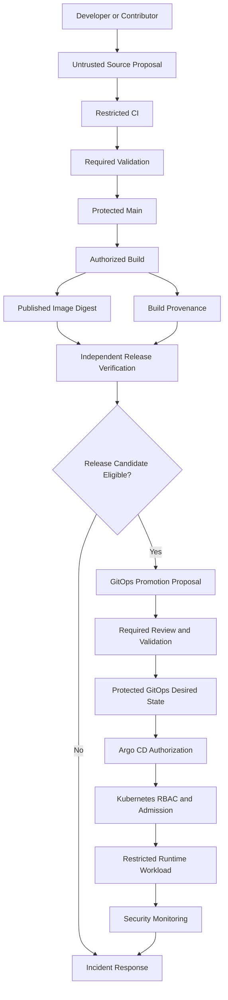

### The most important principle of Phase 14

> **CI/CD security is the engineering discipline of controlling identities, permissions, executable inputs, artifact origins, and release authority across every boundary of the software delivery system.**

A secure CI/CD architecture does not assume that passing tests makes software trustworthy.

It does not assume that an immutable digest establishes origin.

It does not assume that a verified image is automatically approved for production.

And it does not assume that removing direct Kubernetes credentials from CI eliminates all paths to deployment authority.

Instead, each system receives the authority it needs, important claims are verified, and higher-impact changes require explicit authorization.

**That is security designed into the delivery architecture rather than added at the end.**

---

# Phase 14 Complete

**Completed:** Level 4 — Phase 14: CI/CD Security

## Course Progress — 5 Levels, 16 Phases

| Level | Phase | Topic | Status |
|---|---|---|---|
| **1 — Fundamentals** | 01 | Why CI/CD Exists | Completed |
| | 02 | Feedback and Control Systems | Completed |
| | 03 | Delivery Architecture | Completed |
| | 04 | Git Lifecycle | Completed |
| **2 — Continuous Integration** | 05 | CI Architecture | Completed |
| | 06 | Testing and Quality Gates | Completed |
| | 07 | Build Artifacts | Completed |
| | 08 | GitHub Actions | Completed |
| **3 — Continuous Delivery** | 09 | Release Engineering | Completed |
| | 10 | GitOps | Completed |
| | 11 | Argo CD | Completed |
| | 12 | End-to-End Integration | Completed |
| **4 — Production Engineering** | 13 | Deployment Strategies | Completed |
| | **14** | **CI/CD Security** | **Completed** |
| | **15** | **Reliability and Observability** | **Next** |
| **5 — System Design** | 16 | Complete CI/CD Project | Upcoming |

---

## Next: Phase 15 — Reliability and Observability

**File:** `Level-4-Production-Engineering/Phase-15-Reliability-Observability.md`

We have now designed a secure delivery system.

But another production question remains:

> **How do we know that the delivery platform itself is reliable, and how do we detect, diagnose, and recover when software changes or delivery-system components fail?**

Phase 15 will connect:

- CI pipeline reliability.
- Delivery lead time.
- Failure propagation.
- GitHub Actions execution telemetry.
- GitOps reconciliation health.
- Argo CD metrics and alerts.
- Kubernetes rollout verification.
- Application logs, metrics, and traces.
- OpenTelemetry.
- Prometheus and Grafana.
- SLIs, SLOs, and error budgets.
- Release health and change failure rate.
- Progressive delivery verification.
- Incident investigation.
- Recovery-time measurement.
- Continuous improvement of delivery architecture.

### Central engineering question

**How do we design CI/CD as an observable and reliable production system that detects unsafe changes, explains failures, and supports rapid recovery?**

**Send `next` to begin Phase 15 — Reliability and Observability.**