# Phase 15 — Reliability and Observability: Engineering a Delivery System That Can Explain Its Own Failures

**Level 4 — Production Engineering | CI/CD From First Principles**

**File:** `Level-4-Production-Engineering/Phase-15-Reliability-Observability.md`

**Previous:** Phase 14 — CI/CD Security  
**Next:** Phase 16 — Complete CI/CD System Design Project

---

# 1. Why This Phase Matters

We have reached an important point in our CI/CD journey.

In previous phases, we designed a system that can:

- Validate application changes using GitHub Actions.
- Build container images.
- Publish immutable artifacts.
- Verify artifact provenance.
- Authorize releases through GitOps.
- Reconcile Kubernetes using Argo CD.
- Perform progressive deployments using Argo Rollouts.
- Restrict permissions across the delivery chain.

But one question remains unanswered:

**How do we know whether the complete delivery system is actually reliable?**

Imagine this scenario.

A developer merges a change at 10:00 AM.

GitHub Actions reports success at 10:05 AM.

The image appears in GHCR at 10:06 AM.

A GitOps pull request merges at 10:10 AM.

Argo CD reports `Synced` at 10:12 AM.

Kubernetes reports all Pods ready at 10:13 AM.

But at 10:14 AM, customers begin receiving HTTP 500 errors.

Was the release successful?

**No.**

Different components succeeded at different responsibilities, but the overall change did not produce acceptable application behavior.

Now imagine another situation.

GitHub Actions is unavailable for one hour.

All previously deployed applications continue serving customers normally.

Is the application unavailable?

Not necessarily.

Is the delivery platform degraded?

Yes.

These two scenarios reveal an important distinction:

> **The reliability of the software delivery system and the reliability of the software it delivers are related but different engineering problems.**

We must observe both.

---

# 2. What You Will Learn

By the end of Phase 15, you should understand:

1. Reliability engineering from first principles.
2. Why successful automation does not guarantee reliable delivery.
3. The difference between monitoring and observability.
4. Logs, metrics, traces, and Kubernetes events.
5. SLIs, SLOs, SLAs, and error budgets.
6. How to define reliability objectives for CI/CD systems.
7. How to measure GitHub Actions execution reliability.
8. Why queue time, execution time, and approval time must be measured separately.
9. How to observe artifact publication and release promotion.
10. Argo CD synchronization and reconciliation metrics.
11. Kubernetes workload availability and deployment progress.
12. Application-level latency, errors, traffic, and saturation.
13. Prometheus metrics and PromQL.
14. Grafana dashboards and alert design.
15. OpenTelemetry and distributed tracing.
16. Error-budget burn rates.
17. How runtime metrics control progressive delivery.
18. How to detect and investigate deployment failures.
19. How to measure recovery effectiveness.
20. How to use operational evidence to improve the delivery architecture.

### Practical lab

We will build a small local observability system using:

- GitHub Actions execution data.
- Argo CD metrics.
- Kubernetes.
- Prometheus.
- A small instrumented Python HTTP application.
- Controlled failure injection.
- Runtime verification.
- Recovery measurements.

We will not need paid Azure or GCP resources.

Our existing Node.js, GitOps, and Argo CD projects will remain the reference delivery architecture.

---

# Part I — Reliability From First Principles

## 3. What Is Reliability?

Suppose we have a system.

Users expect it to perform certain operations.

For example:

```text
Submit Order

Retrieve Product

Authenticate User

Process Payment
```

Reliability concerns how consistently the system satisfies those expectations under defined conditions and over time.

Now apply the same reasoning to CI/CD.

Developers expect the delivery system to:

```text
Accept a Change
       |
       v
Run Required Validation
       |
       v
Publish an Artifact
       |
       v
Authorize Promotion
       |
       v
Reconcile Deployment
       |
       v
Verify the Result
```

A reliable delivery platform performs these operations predictably and makes failures understandable and recoverable.

### Important distinction

Reliability is not:

```text
All Components Are Currently Running
```

A pipeline can have all components available but repeatedly produce incorrect or delayed outcomes.

Instead, we must evaluate whether the system meets its intended service expectations.

### A useful mental model

```text
Reliability
    =
Consistently Satisfying Defined Expectations
```

The expectations must be measurable.

Otherwise, statements such as *our CI/CD is reliable* are difficult to verify.

---

## 4. First Principle: Every System Needs a Definition of Success

Consider two statements.

**Statement A:**

> Our CI/CD pipeline is fast.

**Statement B:**

> At least 95% of eligible development promotions reach verified application availability within 15 minutes of authorization.

Which is more useful?

Statement B.

It defines:

- A population of operations.
- A measurable outcome.
- A time constraint.
- An acceptable success ratio.

This gives us a reliability objective.

### Derive the design process

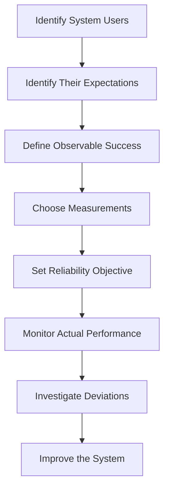

### Fundamental principle

> **You cannot meaningfully engineer reliability until you define what successful system behavior looks like.**

---

# 5. Two Reliability Domains in Our Architecture

Our system has two distinct customers.

### Customer A — Developers and release engineers

They use the delivery platform.

They care about:

- CI feedback time.
- Test reliability.
- Build success.
- Artifact availability.
- Release traceability.
- Promotion latency.
- Deployment verification.
- Recovery capability.

### Customer B — Application users

They consume the deployed application.

They care about:

- Request success.
- Response latency.
- Correct transactions.
- Availability.
- Data consistency.
- Predictable behavior.

### Architecture

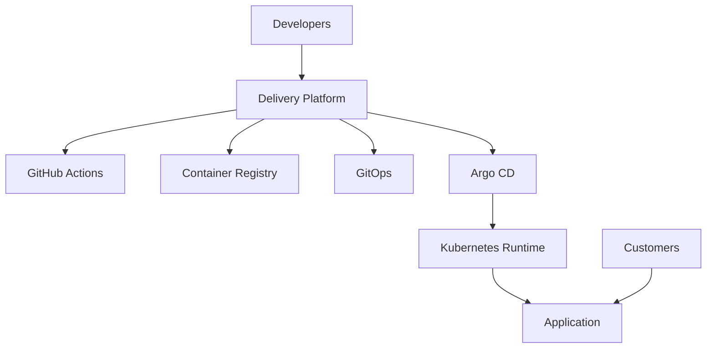

Now imagine:

```text
GitHub Actions:
Unavailable
```

But:

```text
Application:
Healthy
```

Developers cannot deliver new changes, but existing customers may remain unaffected.

Now reverse it.

```text
GitHub Actions:
Healthy
```

But:

```text
Application:
Unavailable
```

The delivery platform may be functioning while the application fails.

### Engineering lesson

**Define separate reliability objectives for delivery operations and application behavior.**

Do not combine them into one meaningless green status.

---

# 6. Monitoring vs Observability

These terms are related but not identical.

### Monitoring

Monitoring answers questions about known conditions.

For example:

- Is the API reachable?
- Is the error rate above 1%?
- Did the deployment fail?
- Is the Argo CD Application `OutOfSync`?
- Did a GitHub Actions job exceed its usual duration?

Monitoring is useful for detecting expected classes of problems.

### Observability

Observability helps us understand the internal behavior of a system using evidence it exposes.

It becomes particularly valuable when diagnosing failures we did not anticipate.

For example:

> Why did the release take 25 minutes when its usual duration is 7 minutes?

A useful investigation might discover:

```text
CI Queue Delay:
8 minutes
```

```text
Dependency Installation:
2 minutes
```

```text
Build:
3 minutes
```

```text
GitOps Approval:
1 minute
```

```text
Kubernetes Scheduling Delay:
9 minutes
```

```text
Application Verification:
2 minutes
```

The system becomes observable when we can explain the delay across component boundaries.

OpenTelemetry describes observability in terms of understanding system behavior from emitted signals, including metrics, logs, and traces. [OpenTelemetry](https://opentelemetry.io/docs/concepts/observability-primer/?utm_source=chatgpt.com)

### Key distinction

```text
Monitoring:
Is Something Wrong?
```

```text
Observability:
What Happened, Where, and Why?
```

Both are necessary.

---

# 7. The Three Main Telemetry Signals

We will organize observability around:

1. Metrics.
2. Logs.
3. Traces.

Kubernetes events and deployment records provide additional operational evidence.

## 7.1 Metrics

Metrics represent numerical observations over time.

Examples:

```text
HTTP Requests per Second

HTTP Error Rate

P95 Latency

Available Replicas

CI Job Duration

Argo CD Reconciliation Duration
```

Metrics are useful for:

- Detecting trends.
- Alerting.
- Capacity analysis.
- Measuring objectives.
- Comparing releases.

## 7.2 Logs

Logs represent discrete events and contextual information.

Example:

```json
{
  "timestamp": "2026-10-09T10:14:32Z",
  "level": "error",
  "service": "ecommerce-api",
  "release": "1.4.0",
  "event": "payment_authorization_failed",
  "request_id": "req-example-123"
}
```

This is an illustrative log record, not an event observed from your system.

Logs help answer:

- What operation failed?
- Which dependency was involved?
- Which release produced the event?
- What error was returned?

Do not log passwords, authentication tokens, payment details, or other sensitive customer information.

## 7.3 Traces

A distributed trace connects operations across services.

Imagine a checkout request:

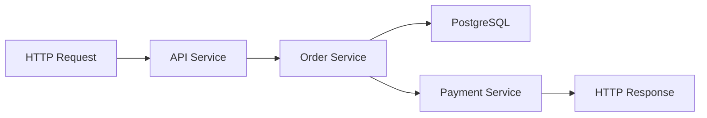

A trace can provide timing and contextual relationships between the operations.

For example:

```text
Total request latency:
800 ms
```

```text
Database work:
90 ms
```

```text
Payment authorization:
650 ms
```

That helps explain where time is being spent.

### Comparison

| Signal | Best suited to |
|---|---|
| Metrics | Trends, ratios, thresholds, alerting |
| Logs | Detailed events and errors |
| Traces | Request paths and timing relationships |
| Kubernetes events | Scheduling, image pulls, probes, and resource lifecycle |
| GitHub run records | Workflow execution and step results |
| Git history | Desired-state change history |

### Fundamental insight

> **Different signals answer different questions. Good observability joins them through shared identities and timestamps.**

---

# 8. The Importance of Correlation

Suppose a customer reports:

> Checkout failed after the latest deployment.

We need to answer:

1. Which application version processed the request?
2. Which image digest was deployed?
3. Which GitOps commit selected it?
4. Which workflow produced the image?
5. Which source revision was built?
6. Which dependency failed?
7. Did the error begin during the rollout?

The five release identities from Phase 12 are therefore useful for observability too.

### End-to-end correlation

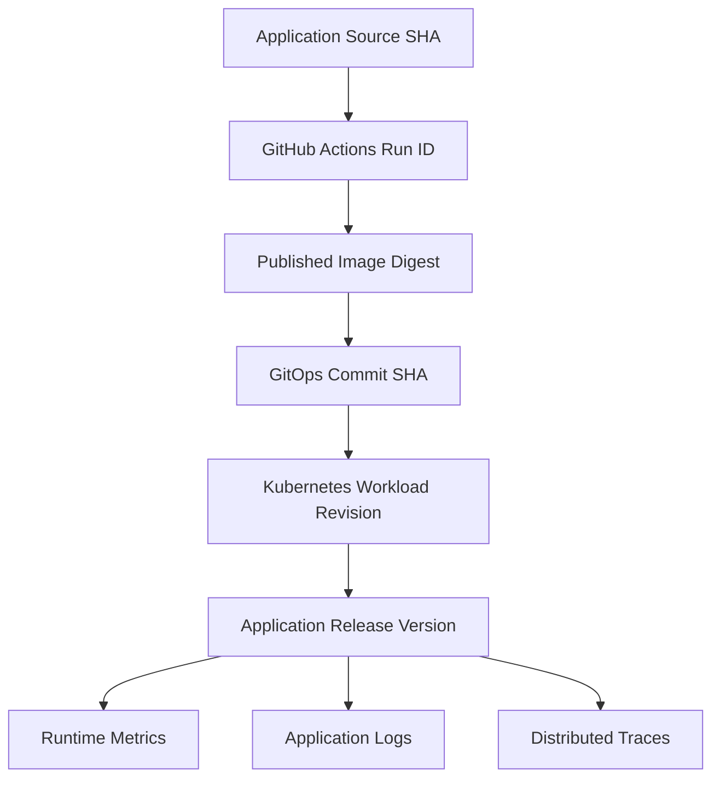

### Good practice

Use release identity as bounded metadata.

For example:

```text
service=ecommerce-api

environment=production

version=1.4.0
```

Do not add unbounded values such as every request ID as Prometheus metric labels.

That would cause high cardinality.

Request IDs belong more naturally in logs and trace context.

---

# Part II — SLIs, SLOs, and Error Budgets

## 9. What Is an SLI?

SLI means **Service Level Indicator**.

It is a measurable indicator of system behavior.

For an API, one possible SLI is:

```text
Successful Requests / Eligible Requests
```

Suppose we receive:

```text
Total Eligible Requests:
10,000
```

And:

```text
Successful Requests:
9,970
```

The success ratio is:

```text
9,970 / 10,000 = 99.7%
```

That is a measured SLI value.

### Important question

What counts as successful?

For example, does an intentional HTTP 404 response count as a server failure?

Usually not automatically.

An availability SLI should have a clear definition of eligible requests and acceptable responses.

You may define success using HTTP status, business outcome, or another application-specific condition.

### Fundamental principle

**An SLI is only useful when its numerator and denominator reflect a meaningful user or platform experience.**

---

## 10. What Is an SLO?

SLO means **Service Level Objective**.

It is the target value for an SLI over a defined period.

Example:

> At least 99.9% of eligible API requests should succeed over a rolling 28-day window.

This specifies:

```text
SLI:
Successful request ratio
```

```text
SLO:
99.9%
```

```text
Evaluation window:
28 days
```

Google's SRE guidance recommends starting with a small number of user-relevant indicators and using them to define explicit reliability objectives. [Google SRE](https://sre.google/workbook/implementing-slos/?utm_source=chatgpt.com)

### SLI vs SLO vs SLA

| Concept | Meaning |
|---|---|
| SLI | What we measure |
| SLO | What performance target we intend to meet |
| SLA | A formal agreement that may include contractual consequences |

An internal CI/CD platform can have SLOs even without a customer-facing SLA.

---

## 11. Error Budgets: Reliability Has a Tolerance Boundary

Suppose our target is:

```text
99.9% Successful Requests
```

That leaves:

```text
0.1% Unsuccessful Requests
```

as the allowed error proportion during the objective's window.

If we expect one million eligible requests during that period:

```text
Allowed Errors:
1,000
```

This is a request-based error budget.

### Why does an error budget matter?

Because it creates a decision framework.

Instead of arguing:

> We should deploy faster.

Versus:

> We should stop deploying because deployments are risky.

The team can examine whether current reliability remains within its agreed tolerance.

### Important qualification

An error budget is not permission to knowingly cause customer harm.

It is a planning and risk-management tool.

It also depends on correctly measured demand and meaningful success criteria.

---

## 12. Error-Budget Burn Rate

Suppose your service has a 99.9% success SLO.

The allowed error ratio is:

```text
0.1%
```

Now imagine your measured error ratio is:

```text
2%
```

The service is consuming error budget at approximately:

```text
2 / 0.1 = 20 times
```

the sustainable error rate.

This is called **20× error-budget burn**.

### Why is burn rate useful?

Because raw error counts can be misleading.

Ten errors during ten requests represent a severe issue.

Ten errors during ten million requests may represent a much smaller proportion of traffic.

Burn rate normalizes current failure behavior against the reliability target.

### Important distinction

```text
Error Count
       !=
Error Rate
```

And:

```text
Error Rate
       !=
Error-Budget Burn Rate
```

They answer different questions.

Google's SRE Workbook discusses alerting on error-budget consumption using multiple observation windows rather than relying exclusively on simple fixed thresholds. [Google SRE](https://sre.google/workbook/alerting-on-slos/?utm_source=chatgpt.com)

---

# 13. Define SLOs for the Delivery Platform

Now apply the same ideas to CI/CD.

What does a developer expect from the delivery system?

Let's define three example SLOs.

These are **proposed learning objectives**, not measured commitments.

### SLO A — CI feedback latency

> At least 95% of eligible pull-request validation runs should complete with a decisive result within 10 minutes of triggering.

The important word is **decisive**.

A test failure is valid feedback.

A workflow that reports a meaningful test failure may still satisfy the feedback-latency objective.

### SLO B — Artifact publication reliability

> At least 99% of eligible authorized publishing requests should produce a verified registry artifact.

A deliberate rejection caused by invalid source should not automatically count as a platform infrastructure failure.

We need to define eligibility and failure classification carefully.

### SLO C — Development delivery verification

> At least 95% of authorized development promotions should reach verified application behavior within 15 minutes of approval.

This measures a larger system:

```text
GitOps
   +
Argo CD
   +
Kubernetes
   +
Application Verification
```

### Compare the objectives

| SLO | Main users | What it measures |
|---|---|---|
| CI feedback | Developers | Time to validation feedback |
| Artifact publication | Release engineers | Ability to produce verified artifacts |
| Development promotion | Developers and operators | Authorized intent to verified runtime |
| Application availability | Application users | Successful requests or business operations |

### Engineering lesson

**Different user expectations deserve different reliability objectives.**

A single CI/CD success percentage is rarely sufficient.

---

# 14. Define the Measurement Boundaries Precisely

Consider:

```text
Pull Request Opened
       |
       v
Workflow Queued
       |
       v
Runner Starts
       |
       v
Tests Execute
       |
       v
Workflow Completes
```

There are several durations.

**Trigger-to-feedback time**

How long did the developer wait for the result?

**Queue latency**

How long did execution wait before starting?

**Execution duration**

How long did the workflow actually run?

**Individual job duration**

How long did a particular validation job take?

These measurements are related but not interchangeable.

### Example

```text
Workflow queue:
7 minutes
```

```text
Tests:
2 minutes
```

```text
Total feedback:
9 minutes
```

If we optimize tests from two minutes to one minute, total feedback decreases only modestly.

The main bottleneck is queue latency.

### Fundamental principle

> **Optimize the bottleneck revealed by evidence, not the component that happens to be easiest to modify.**

---

# 15. Release Lead Time Also Has Multiple Parts

Consider this release timeline.

| Event | Time |
|---|---|
| Source merged | 10:00 |
| Artifact published | 10:05 |
| GitOps promotion proposed | 10:07 |
| Release authorized | 10:15 |
| Argo CD observes revision | 10:17 |
| Kubernetes rollout completes | 10:19 |
| Application verification passes | 10:20 |

What is the total time from source integration to verification?

Twenty minutes.

But the stages serve different responsibilities.

### Artifact production

```text
10:00 → 10:05
```

### Release preparation and approval

```text
10:05 → 10:15
```

### Reconciliation and runtime verification

```text
10:15 → 10:20
```

### Why separate these measurements?

Because different interventions improve different problems.

If approval takes too long, adding more Kubernetes replicas may not help.

If image pulls are slow, optimizing GitHub review workflows may not help.

### Important insight

**A release timeline is a causal map of the delivery system.**

It should let us explain where time was spent and which boundary created delay.

---

# Part III — Observing Each Delivery Component

## 16. A Delivery System Needs Multiple Observation Points

We cannot understand the complete system by monitoring only GitHub Actions.

Our architecture contains several independently operating components.

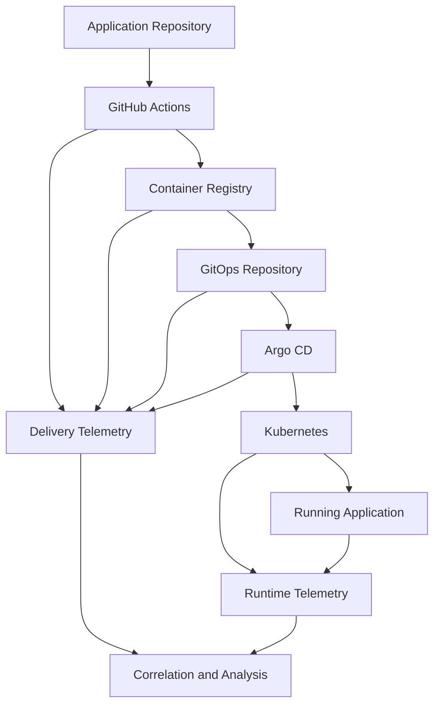

We should observe three categories of behavior.

**Delivery execution:** Did the required steps run successfully?

**State convergence:** Did the system reach the selected desired configuration?

**Operational outcome:** Is the deployed application behaving acceptably?

### Evidence contract

| System | Important signals | Main question |
|---|---|---|
| GitHub Actions | Run status, duration, job results | Did validation and publication execute correctly? |
| Container registry | Artifact identity, pullability | Is the selected artifact available? |
| GitOps repository | Approved commit, selected digest | What deployment state was authorized? |
| Argo CD | Sync, health, reconciliation metrics | Has the desired configuration been processed? |
| Kubernetes | Deployment conditions, Pods, events | Did the workload reach its requested state? |
| Application | Error rate, latency, logs, traces | Does the software work for users? |

The important thing is to **connect these observations to the same release**.

---

## 17. Observing GitHub Actions

GitHub Actions provides information about:

- Workflow runs.
- Trigger events.
- Source revisions.
- Job conclusions.
- Step conclusions.
- Job start and completion timestamps.
- Workflow logs.
- Artifacts.

GitHub's REST API exposes workflow runs and jobs, including job start and completion timestamps. ([GitHub workflow-run API](https://docs.github.com/en/rest/actions/workflow-runs), [GitHub workflow-job API](https://docs.github.com/en/rest/actions/workflow-jobs))

### Four useful measurements

**Workflow feedback time:** Trigger to terminal result.

**Runner waiting time:** Time spent waiting for execution capacity.

**Job execution duration:** Start to completion for a specific job.

**Validation outcome:** Did the run produce successful or unsuccessful feedback?

### Important classification problem

Suppose a unit test fails because the code is incorrect.

Should that count as a CI infrastructure outage?

No.

The CI system successfully detected a source defect.

Now suppose the workflow cannot execute because GitHub runners are unavailable.

That is a different failure.

### Separate these categories

```text
Source Validation Failed
        !=
CI Platform Failed
```

Similarly:

```text
Workflow Cancelled Intentionally
        !=
Workflow Execution Failed Unexpectedly
```

### Why does classification matter?

If all failing tests count against a CI infrastructure reliability SLO, a team introducing more bugs could make the platform appear less reliable even when CI is functioning correctly.

Define SLO eligibility and outcomes precisely.

---

## 18. CI Reliability Is Not Just Pass Percentage

Imagine two pipelines.

### Pipeline A

```text
Workflow Success Rate:
99%
```

But:

```text
Average Feedback:
45 minutes
```

### Pipeline B

```text
Workflow Success Rate:
90%
```

But:

```text
Average Feedback:
4 minutes
```

Can we conclude A is better?

Not from these numbers alone.

The success ratio may include application test failures.

Those failures could indicate that validation is doing its job.

We should examine:

- How quickly CI gives valid feedback.
- How often CI fails because of infrastructure.
- How often tests are flaky.
- Whether required checks execute.
- Whether the correct source revision is tested.
- Whether results are reproducible.

### Flaky-test reliability

Suppose the same source revision produces:

```text
Run 1: Failed
Run 2: Passed
Run 3: Failed
Run 4: Passed
```

Without any relevant source or environment change.

That suggests nondeterministic behavior.

Possible causes include:

- Timing assumptions.
- Shared mutable test data.
- Network dependencies.
- Insufficient resource limits.
- Concurrent tests modifying shared state.
- Uncontrolled clocks or randomness.

### Why do flaky tests matter?

Because developers begin to distrust feedback.

They may repeatedly rerun failed jobs rather than investigate failures.

That weakens the purpose of CI.

### Engineering principle

> **Reliable CI produces timely, reproducible, and interpretable feedback—not merely a high percentage of green badges.**

---

## 19. Observing Argo CD

Argo CD is a continuously operating reconciliation system.

Therefore, we should observe both its Applications and the controller itself.

Useful measurements include:

- Application synchronization state.
- Resource health.
- Reconciliation latency.
- Synchronization history.
- Application conditions.
- Repository access failures.
- Kubernetes API interaction problems.

Argo CD exposes Prometheus metrics through its controller and supporting services.

Its official documentation identifies the controller metrics endpoint as:

```text
argocd-metrics:8082/metrics
```

The endpoint exposes metrics including `argocd_app_info` and `argocd_app_reconcile`. ([Argo CD metrics documentation](https://argo-cd.readthedocs.io/en/stable/operator-manual/metrics/))

### Example: Application state

```promql
argocd_app_info
```

This metric provides Application information, including labels representing synchronization and health state.

For example:

```promql
argocd_app_info{sync_status="OutOfSync"}
```

Or:

```promql
argocd_app_info{health_status="Degraded"}
```

### Important distinction

An Application may be intentionally `OutOfSync`.

For example, production may require an explicit manual synchronization after a GitOps change is approved.

Therefore:

```text
OutOfSync
       !=
Always an Incident
```

An alert should consider:

- Environment.
- Synchronization policy.
- Duration.
- Deployment window.
- Expected behavior.
- Operational impact.

### More useful question

> Has a required deployment remained unable to reach its expected configuration or health state beyond the allowed duration?

That is much closer to a reliability objective.

---

## 20. Argo CD Reconciliation Duration

The metric:

```promql
argocd_app_reconcile
```

is a histogram representing reconciliation performance.

Depending on metric configuration, its classic histogram series can be queried using the `_bucket` suffix.

For example:

```promql
histogram_quantile(
  0.95,
  sum by (le) (
    rate(argocd_app_reconcile_bucket[5m])
  )
)
```

This estimates the 95th percentile of recorded application reconciliation durations over the selected window.

### What does this measure?

Controller reconciliation performance.

### What does it not measure?

It does not necessarily represent the total time from:

```text
Git Commit Merged
```

to:

```text
Application Business Verification Passed
```

That larger duration includes several other stages.

### Why is the distinction important?

Because a fast Argo CD reconciliation can still be followed by:

- Slow Pod scheduling.
- Large image downloads.
- Container initialization.
- Readiness delays.
- Database initialization.
- Failing smoke tests.

### Engineering principle

**Controller performance metrics and end-to-end delivery latency are different measurements.**

---

## 21. Observing Kubernetes

Kubernetes provides several useful sources of evidence.

### Deployment status

```bash
kubectl get deployment \
  -n ecommerce-dev
```

### Pod readiness

```bash
kubectl get pods \
  -n ecommerce-dev
```

### Resource events

```bash
kubectl get events \
  -n ecommerce-dev \
  --sort-by=.lastTimestamp
```

### Application logs

```bash
kubectl logs \
  deployment/ecommerce-api \
  -n ecommerce-dev \
  --tail=100
```

### Rollout progress

```bash
kubectl rollout status \
  deployment/ecommerce-api \
  -n ecommerce-dev
```

### Why observe all of these?

Because different failure modes leave different evidence.

| Failure | Likely evidence |
|---|---|
| No cluster capacity | Pending Pod and scheduling events |
| Image unavailable | `ErrImagePull` or `ImagePullBackOff` |
| Process repeatedly crashes | Restarts and container logs |
| Readiness fails | Unready Pods and probe events |
| Wrong image selected | Deployment Pod template |
| Deployment progresses too slowly | Deployment conditions and rollout status |
| Application returns business errors | Application metrics and logs |

### The diagnostic principle

**Identify the first system boundary that failed, then inspect the evidence produced by that boundary.**

---

# Part IV — Application Reliability Signals

## 22. The Four Golden Signals

A widely used SRE model organizes service monitoring around four signals:

1. Latency.
2. Traffic.
3. Errors.
4. Saturation.

These help explain whether a service can handle its workload.

### Latency

How long do requests take?

Examples:

```text
P50 Response Time

P95 Response Time

P99 Response Time
```

### Traffic

How much work is arriving?

Examples:

```text
Requests per Second

Orders per Minute

Jobs per Second
```

### Errors

How much work fails?

Examples:

```text
HTTP 5xx Percentage

Payment Failures

Job Processing Failures
```

### Saturation

How close is the system to capacity?

Examples:

```text
CPU Utilization

Memory Pressure

Connection Pool Usage

Queue Depth

Thread Pool Saturation
```

### Why all four?

Imagine latency suddenly increases.

Possible causes include:

- Increased traffic.
- Database saturation.
- Network delay.
- Slow dependency.
- Application regression.

Latency alone tells us something is wrong.

Traffic, errors, and saturation help explain what might be causing it.

---

## 23. Percentiles Matter More Than Averages Alone

Suppose these requests have latencies:

```text
20 ms

22 ms

24 ms

25 ms

26 ms

28 ms

30 ms

35 ms

40 ms

2000 ms
```

Most requests are fast.

One request is extremely slow.

An average alone cannot fully describe the tail behavior.

Percentiles help us understand how many requests experience longer delays.

### Common measurements

**P50:** Median latency.

**P95:** Approximately 95% of observations are at or below this latency.

**P99:** Approximately 99% are at or below this latency.

### Why does this matter during deployments?

A new version might improve average latency while introducing a small number of extremely slow requests.

For a payment or checkout service, tail latency may be operationally important.

### Prometheus example

For a classic histogram called:

```text
http_request_duration_seconds
```

You can estimate P95 using:

```promql
histogram_quantile(
  0.95,
  sum by (le) (
    rate(http_request_duration_seconds_bucket[5m])
  )
)
```

Prometheus documents histogram quantiles and rate calculations, including the differences between classic and native histograms. ([prometheus.io](https://prometheus.io/docs/prometheus/latest/querying/functions/))

### Important qualification

A histogram-derived percentile is an estimate dependent on the histogram's buckets and observation distribution.

Do not treat it as an exact per-request measurement.

---

## 24. The Problem of High-Cardinality Metrics

Imagine you add:

```text
request_id
```

as a Prometheus label.

Every request has a different ID.

That can create a new time series for every request.

This is usually a poor metrics design.

### Better metric labels

```text
service

environment

route

status_class
```

Use bounded values.

### Better log and trace attributes

```text
request_id

trace_id

error_message

release_identity
```

These may be appropriate when handled with suitable privacy and access controls.

### Important principle

> **Metrics should aggregate behavior. Logs and traces should preserve the detail needed for investigation.**

Do not use high-cardinality metric labels as a substitute for structured logging.

---

# Part V — Practical Lab 15: Build an Observable Delivery Environment

## 25. Lab Overview

We will now create a real observability experiment.

Our goal is not to install as many monitoring tools as possible.

Our goal is to answer three questions:

**Question 1:** Can we measure how our CI workflow behaves?

**Question 2:** Can we observe whether Argo CD is reconciling applications successfully?

**Question 3:** Can we detect an application failure even when Kubernetes reports the workload as ready?

The third question is especially important.

We will deliberately introduce an application-level failure while keeping its readiness endpoint healthy.

This will demonstrate why Kubernetes readiness alone is not sufficient evidence of business correctness.

### Lab architecture

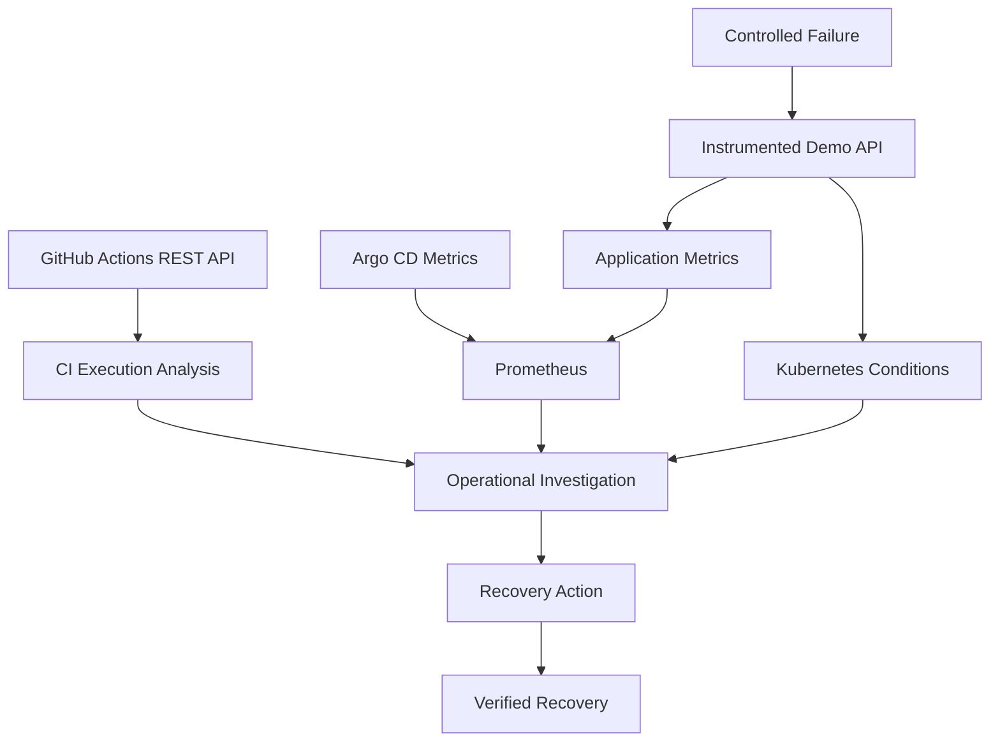

### Lab boundaries

We will use:

```text
Existing cluster:
kind-argocd-lab
```

```text
New namespace:
delivery-observability-lab
```

This namespace will not be managed by our earlier Argo CD Applications.

We will create and modify resources directly for controlled experimentation.

Later, we will discuss how the same observations apply to GitOps-managed releases.

### What we will implement

| Component | Purpose |
|---|---|
| Small Python HTTP API | Generate observable application behavior |
| `/healthz` | Report process liveness |
| `/readyz` | Report basic serving readiness |
| `/business` | Simulate a critical user operation |
| `/metrics` | Expose Prometheus metrics |
| Prometheus | Collect and query metrics |
| Argo CD metrics endpoint | Expose GitOps controller state |
| Failure mode | Intentionally return HTTP 503 |
| Recovery mode | Restore successful business behavior |
| GitHub API analysis | Inspect CI execution timing |

This lab uses a single API replica so we can inspect the emitted metrics without introducing fleet-wide service-discovery complexity.

**A single replica is not an example of high availability.**

---

## 26. Prepare the Lab Directory

Create a new directory:

```bash
mkdir -p ~/Desktop/delivery-observability-lab
cd ~/Desktop/delivery-observability-lab
```

Create its structure:

```bash
mkdir -p app k8s scripts evidence
```

Result:

```text
delivery-observability-lab/
│
├── app/
│   ├── server.py
│   └── Dockerfile
│
├── k8s/
│   ├── application.yaml
│   └── prometheus.yaml
│
├── scripts/
│   └── analyze_ci_jobs.py
│
└── evidence/
```

---

## 27. Build an Instrumented HTTP Application

Create:

```text
app/server.py
```

Add:

```python
#!/usr/bin/env python3

import json
import os
import threading
import time

from http.server import (
    BaseHTTPRequestHandler,
    ThreadingHTTPServer,
)


PORT = 8080

VERSION = os.getenv("APP_VERSION", "v1")

FAIL_MODE = os.getenv("FAIL_MODE", "none")

BUCKETS = (
    0.01,
    0.05,
    0.1,
    0.25,
    0.5,
    1.0,
    2.5,
)

LOCK = threading.Lock()

REQUEST_COUNTS = {
    200: 0,
    503: 0,
}

BUCKET_COUNTS = {
    boundary: 0
    for boundary in BUCKETS
}

DURATION_SUM = 0.0
DURATION_COUNT = 0


def record_business_request(status, duration):
    global DURATION_SUM
    global DURATION_COUNT

    with LOCK:
        REQUEST_COUNTS[status] += 1

        DURATION_SUM += duration
        DURATION_COUNT += 1

        for boundary in BUCKETS:
            if duration <= boundary:
                BUCKET_COUNTS[boundary] += 1


def prometheus_metrics():
    with LOCK:
        counts = dict(REQUEST_COUNTS)
        buckets = dict(BUCKET_COUNTS)
        duration_sum = DURATION_SUM
        duration_count = DURATION_COUNT

    lines = [
        "# HELP demo_business_requests_total Business requests by HTTP status",
        "# TYPE demo_business_requests_total counter",
    ]

    for status in (200, 503):
        lines.append(
            'demo_business_requests_total'
            f'{{status="{status}"}} {counts[status]}'
        )

    lines.extend([
        "# HELP demo_business_request_duration_seconds Business request latency",
        "# TYPE demo_business_request_duration_seconds histogram",
    ])

    for boundary in BUCKETS:
        lines.append(
            'demo_business_request_duration_seconds_bucket'
            f'{{le="{boundary}"}} {buckets[boundary]}'
        )

    lines.extend([
        'demo_business_request_duration_seconds_bucket'
        f'{{le="+Inf"}} {duration_count}',
        f"demo_business_request_duration_seconds_sum {duration_sum}",
        f"demo_business_request_duration_seconds_count {duration_count}",
        "# HELP demo_release_info Release identity",
        "# TYPE demo_release_info gauge",
        f'demo_release_info{{version="{VERSION}"}} 1',
    ])

    return "\n".join(lines) + "\n"


class Handler(BaseHTTPRequestHandler):

    def send_body(self, status, body, content_type):
        self.send_response(status)

        self.send_header(
            "Content-Type",
            content_type,
        )

        self.send_header(
            "Content-Length",
            str(len(body)),
        )

        self.end_headers()
        self.wfile.write(body)

    def send_json(self, status, payload):
        body = json.dumps(payload).encode("utf-8")

        self.send_body(
            status,
            body,
            "application/json",
        )

    def do_GET(self):
        path = self.path.split("?", 1)[0]

        if path == "/healthz":
            self.send_json(
                200,
                {"status": "alive"},
            )
            return

        if path == "/readyz":
            self.send_json(
                200,
                {"ready": True},
            )
            return

        if path == "/metrics":
            body = prometheus_metrics().encode("utf-8")

            self.send_body(
                200,
                body,
                "text/plain; version=0.0.4",
            )
            return

        if path == "/business":
            start = time.perf_counter()

            if FAIL_MODE == "slow":
                time.sleep(0.5)

            status = (
                503
                if FAIL_MODE == "error"
                else 200
            )

            response = {
                "version": VERSION,
                "success": status == 200,
            }

            elapsed = time.perf_counter() - start

            record_business_request(
                status,
                elapsed,
            )

            print(
                json.dumps({
                    "event": "business_request",
                    "status": status,
                    "duration_seconds": elapsed,
                    "version": VERSION,
                }),
                flush=True,
            )

            self.send_json(
                status,
                response,
            )
            return

        self.send_json(
            404,
            {"error": "not_found"},
        )


if __name__ == "__main__":
    server = ThreadingHTTPServer(
        ("0.0.0.0", PORT),
        Handler,
    )

    print(
        f"Starting {VERSION}; failure mode={FAIL_MODE}",
        flush=True,
    )

    server.serve_forever()
```

### Understand the instrumentation

Our application produces three important metric families.

**Request count**

```text
demo_business_requests_total
```

**Request latency**

```text
demo_business_request_duration_seconds
```

**Release identity**

```text
demo_release_info
```

### Why expose these?

Because we want to distinguish:

```text
Application Is Running
```

from:

```text
Business Requests Are Succeeding
```

The `/healthz` endpoint can remain healthy even when `/business` returns HTTP 503.

That is intentional.

### What does this teach?

An application can pass a basic health probe while failing its actual business responsibility.

This is precisely why observability must include user-relevant behavior.

---

## 28. Understand the Three Failure Modes

Our application supports:

```text
FAIL_MODE=none
```

Business requests succeed.

```text
FAIL_MODE=error
```

Business requests return HTTP 503.

```text
FAIL_MODE=slow
```

Business requests succeed but incur an artificial delay.

### Why introduce three modes?

They represent different operational problems.

| Mode | Availability impact | Latency impact |
|---|---|---|
| `none` | Normal | Normal |
| `error` | HTTP 503 for business requests | Not necessarily high |
| `slow` | Requests still succeed | Elevated latency |

These illustrate an important distinction:

**A service can satisfy its availability objective while violating its latency objective.**

A complete reliability design may need separate SLIs for availability and latency.

---

## 29. Create the Dockerfile

Create:

```text
app/Dockerfile
```

Add:

```dockerfile
FROM python:3.12-slim

WORKDIR /app

COPY server.py .

USER 65532:65532

EXPOSE 8080

CMD ["python", "-u", "server.py"]
```

This image does not require additional Python packages.

It uses only the standard library.

### Why keep the application simple?

Because this phase is about observability architecture.

We do not want debugging package installation or application frameworks to obscure the monitoring concepts.

For a production image, the base-image identity and runtime security should be reviewed and controlled as discussed in Phases 07 and 14.

---

## 30. Build and Load the Image Into kind

Build:

```bash
docker build \
  -f app/Dockerfile \
  -t observability-lab:v1 \
  app/
```

Verify the cluster:

```bash
kubectl config current-context
```

Expected:

```text
kind-argocd-lab
```

Load the image:

```bash
kind load docker-image \
  observability-lab:v1 \
  --name argocd-lab
```

### Important distinction

The image is locally loaded for our disposable lab.

It is not a published production release artifact.

We are isolating observability mechanics from registry and release-authentication concerns.

---

## 31. Deploy the Instrumented Application

Create:

```text
k8s/application.yaml
```

Add:

```yaml
apiVersion: apps/v1
kind: Deployment
metadata:
  name: obs-demo
  namespace: delivery-observability-lab

spec:
  replicas: 1

  selector:
    matchLabels:
      app: obs-demo

  template:
    metadata:
      labels:
        app: obs-demo

    spec:
      containers:
        - name: api
          image: observability-lab:v1
          imagePullPolicy: IfNotPresent

          ports:
            - name: http
              containerPort: 8080

          env:
            - name: APP_VERSION
              value: "v1"

            - name: FAIL_MODE
              value: "none"

          readinessProbe:
            httpGet:
              path: /readyz
              port: http
            periodSeconds: 3

          livenessProbe:
            httpGet:
              path: /healthz
              port: http
            periodSeconds: 5

          resources:
            requests:
              cpu: 25m
              memory: 32Mi

            limits:
              cpu: 250m
              memory: 128Mi

---
apiVersion: v1
kind: Service
metadata:
  name: obs-demo
  namespace: delivery-observability-lab

spec:
  selector:
    app: obs-demo

  ports:
    - name: http
      port: 8080
      targetPort: http
```

### Why only one replica?

Because we want a clearly attributable metric source.

A production Prometheus setup should discover and scrape all relevant application instances, rather than relying on a Service that may route each scrape to only one of several Pods.

For this small lab:

```text
One application Pod
      +
One Prometheus scrape target
```

is sufficient.

### Create the namespace

Run:

```bash
kubectl create namespace delivery-observability-lab
```

### Deploy

```bash
kubectl apply -f k8s/application.yaml
```

Wait:

```bash
kubectl rollout status \
  deployment/obs-demo \
  -n delivery-observability-lab
```

Inspect:

```bash
kubectl get pods \
  -n delivery-observability-lab
```

### Expected state

```text
Deployment:
Available
```

```text
Pod:
Ready
```

```text
Failure mode:
none
```

---

## 32. Verify the Baseline

Port-forward the application:

```bash
kubectl port-forward \
  -n delivery-observability-lab \
  service/obs-demo \
  18095:8080
```

Keep this command running.

Open another terminal.

Check liveness:

```bash
curl -fsS \
  http://127.0.0.1:18095/healthz
```

Check readiness:

```bash
curl -fsS \
  http://127.0.0.1:18095/readyz
```

Check the business endpoint:

```bash
curl -fsS \
  http://127.0.0.1:18095/business
```

Expected:

```json
{
  "version": "v1",
  "success": true
}
```

Now inspect raw metrics:

```bash
curl -fsS \
  http://127.0.0.1:18095/metrics
```

You should see metric families resembling:

```text
demo_business_requests_total{status="200"} 1

demo_business_requests_total{status="503"} 0
```

The exact counts depend on the requests you have made.

### What have we proved?

The application emits metric data.

But we have not yet installed a system that collects the data over time.

That is Prometheus's responsibility.

---

# Part VI — Prometheus as a Measurement System

## 33. Derive Why Prometheus Exists

Suppose the application exposes:

```text
/metrics
```

Does that automatically give us historical monitoring?

No.

The endpoint only reports the current values available from that process.

We need a system that:

1. Discovers the target.
2. Requests metric values periodically.
3. Records samples with timestamps.
4. Stores those samples.
5. Supports time-based queries.
6. Evaluates alert rules.

This is the role Prometheus will play.

### Architecture

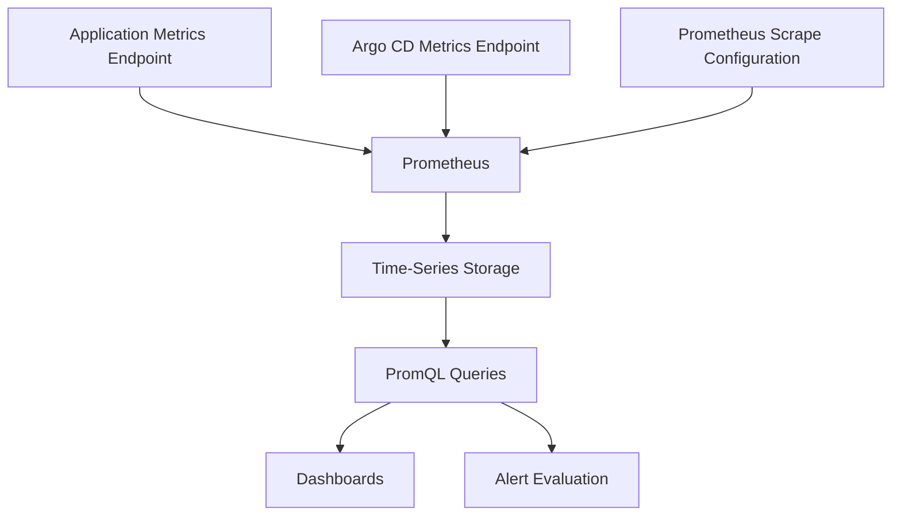

Prometheus supports configuring scrape jobs with static targets or dynamic service discovery. ([prometheus.io](https://prometheus.io/docs/prometheus/latest/configuration/configuration/))

For this lab, we will use static targets.

---

## 34. Deploy Prometheus

Create:

```text
k8s/prometheus.yaml
```

Add:

```yaml
apiVersion: v1
kind: ConfigMap
metadata:
  name: prometheus-config
  namespace: delivery-observability-lab

data:
  prometheus.yml: |
    global:
      scrape_interval: 5s
      evaluation_interval: 5s

    scrape_configs:
      - job_name: obs-demo
        static_configs:
          - targets:
              - obs-demo.delivery-observability-lab.svc.cluster.local:8080

      - job_name: argocd
        static_configs:
          - targets:
              - argocd-metrics.argocd.svc.cluster.local:8082

---
apiVersion: apps/v1
kind: Deployment
metadata:
  name: prometheus
  namespace: delivery-observability-lab

spec:
  replicas: 1

  selector:
    matchLabels:
      app: prometheus

  template:
    metadata:
      labels:
        app: prometheus

    spec:
      securityContext:
        fsGroup: 65534

      containers:
        - name: prometheus
          image: prom/prometheus:v3.5.0

          args:
            - --config.file=/etc/prometheus/prometheus.yml
            - --storage.tsdb.path=/prometheus
            - --storage.tsdb.retention.time=2h

          ports:
            - name: web
              containerPort: 9090

          volumeMounts:
            - name: configuration
              mountPath: /etc/prometheus
              readOnly: true

            - name: storage
              mountPath: /prometheus

          resources:
            requests:
              cpu: 50m
              memory: 128Mi

            limits:
              cpu: 500m
              memory: 512Mi

      volumes:
        - name: configuration
          configMap:
            name: prometheus-config

        - name: storage
          emptyDir: {}

---
apiVersion: v1
kind: Service
metadata:
  name: prometheus
  namespace: delivery-observability-lab

spec:
  selector:
    app: prometheus

  ports:
    - name: web
      port: 9090
      targetPort: web
```

We use a pinned Prometheus image version available from the official Docker image repository. This is a short-lived, disposable lab installation rather than a production monitoring stack. ([Prometheus installation](https://prometheus.io/docs/prometheus/latest/installation/))

### Important design decisions

**Five-second scrape interval**

Gives us relatively frequent observations for a short experiment.

**Two-hour retention**

Keeps local storage requirements limited.

**`emptyDir`**

Prometheus data disappears when the Pod's storage is destroyed.

That is acceptable for this disposable lab, but not a durable production design.

**One replica**

Keeps the architecture simple.

Again, this is not high availability.

**Argo CD metrics target**

Allows us to observe the Argo CD installation from Phase 11.

If Argo CD has not been installed, that target will be unavailable; the application metrics experiment can still proceed.

### Deploy

```bash
kubectl apply -f k8s/prometheus.yaml
```

Wait:

```bash
kubectl rollout status \
  deployment/prometheus \
  -n delivery-observability-lab \
  --timeout=180s
```

---

## 35. Access Prometheus

Start port forwarding:

```bash
kubectl port-forward \
  -n delivery-observability-lab \
  service/prometheus \
  19090:9090
```

Open:

**http://localhost:19090**

Navigate to:

```text
Status → Targets
```

Check:

```text
obs-demo
```

And:

```text
argocd
```

### Expected behavior

If the application and Argo CD endpoints are reachable, both targets should become healthy.

If Argo CD is absent or its metrics Service is unavailable, the corresponding target will be down.

That is meaningful diagnostic information.

### First PromQL query

```promql
up
```

This reports whether Prometheus successfully scraped each configured target during its latest attempt.

### Important distinction

```text
up = 1
```

means Prometheus could scrape the metrics endpoint.

It does **not** mean the application's critical business operation is successful.

This distinction is central to the next experiment.

---

## 36. Query Application Request Counts

Run:

```promql
demo_business_requests_total
```

You should see time series for:

```text
status="200"
```

and:

```text
status="503"
```

Now send some successful requests.

In a terminal with the application port-forward available:

```bash
for i in $(seq 1 100); do
  curl \
    --silent \
    --output /dev/null \
    http://127.0.0.1:18095/business

  sleep 0.1
done
```

This generates demonstration traffic.

### Query request rate

```promql
sum(
  rate(demo_business_requests_total[2m])
)
```

This estimates business requests per second over the selected window.

### Query error rate

```promql
sum(
  rate(
    demo_business_requests_total{status="503"}[2m]
  )
)
/
sum(
  rate(demo_business_requests_total[2m])
)
```

With enough healthy traffic and no failures, the error ratio should be near zero.

### Important PromQL detail

If no traffic exists, the denominator may be zero or there may be insufficient samples.

That is not proof of a healthy service.

A robust monitoring design must distinguish:

```text
No Errors Observed
```

from:

```text
No Relevant Requests Observed
```

Never silently interpret missing data as successful application behavior.

---

## 37. Query Application Latency

Our Python application also exports a latency histogram.

Query estimated P95:

```promql
histogram_quantile(
  0.95,
  sum by (le) (
    rate(
      demo_business_request_duration_seconds_bucket[2m]
    )
  )
)
```

Because our baseline endpoint does almost no work, its latency should normally be low in this local experiment.

The exact measured value depends on execution and collection conditions.

### What is the unit?

Seconds.

### How do we interpret it?

A result such as:

```text
0.05
```

means an estimated 50 milliseconds.

### What happens in slow mode?

The application adds an artificial delay.

We would expect the observed latency distribution to move toward higher values.

### Important qualification

This is a tiny synthetic workload.

It is not a representative production latency benchmark.

The purpose is to learn the relationship between emitted observations, histogram buckets, and time-window queries.

---

# Part VII — Failure Injection and Recovery

## 38. Experiment 1 — Kubernetes Healthy, Business Operation Failing

This is the central experiment of Phase 15.

We will deliberately break the business endpoint.

But we will leave:

```text
/healthz
```

and:

```text
/readyz
```

working normally.

### Our hypothesis

> Kubernetes can report a successful rollout and ready Pod while the application fails an important business operation.

We will now test that hypothesis.

### Step 1 — Verify the namespace and context

```bash
kubectl config current-context
```

Expected:

```text
kind-argocd-lab
```

Confirm the target Deployment:

```bash
kubectl get deployment obs-demo \
  -n delivery-observability-lab
```

### Step 2 — Enable failure mode

Run:

```bash
kubectl set env \
  deployment/obs-demo \
  -n delivery-observability-lab \
  FAIL_MODE=error
```

This updates the Deployment's Pod template.

Kubernetes will replace the application Pod.

### Step 3 — Wait for the rollout

```bash
kubectl rollout status \
  deployment/obs-demo \
  -n delivery-observability-lab
```

The rollout should be able to complete.

Why?

Because the new container starts successfully.

Its readiness endpoint still returns HTTP 200.

### Step 4 — Check Kubernetes health

```bash
kubectl get pods \
  -n delivery-observability-lab
```

The application Pod should become ready.

Now look at the application behavior.

### Step 5 — Restart the port-forward if necessary

A port-forward attached to an old Pod may terminate when that Pod is replaced.

Stop the existing application port-forward and start a new one:

```bash
kubectl port-forward \
  -n delivery-observability-lab \
  service/obs-demo \
  18095:8080
```

### Step 6 — Verify liveness

```bash
curl -i \
  http://127.0.0.1:18095/healthz
```

Expected:

```text
HTTP 200
```

### Step 7 — Verify readiness

```bash
curl -i \
  http://127.0.0.1:18095/readyz
```

Expected:

```text
HTTP 200
```

### Step 8 — Test business behavior

```bash
curl -i \
  http://127.0.0.1:18095/business
```

Expected:

```text
HTTP 503
```

### Interpret the results

| Check | Expected |
|---|---|
| Deployment rollout | Successful |
| Pod readiness | Ready |
| Liveness endpoint | HTTP 200 |
| Readiness endpoint | HTTP 200 |
| Business endpoint | HTTP 503 |

These results are not contradictory.

They demonstrate different system properties.

### Most important finding

> **A successful Kubernetes deployment is not proof of successful application behavior.**

This is why Phase 12 required application-level verification after rollout.

---

## 39. Observe the Failure in Prometheus

Now generate business requests while failure mode is enabled.

```bash
for i in $(seq 1 100); do
  curl \
    --silent \
    --output /dev/null \
    http://127.0.0.1:18095/business

  sleep 0.1
done
```

These requests will return HTTP 503.

Because `curl` is not using `--fail`, the loop continues despite the HTTP error responses.

### Query total request rate

```promql
sum(
  rate(demo_business_requests_total[2m])
)
```

### Query error rate

```promql
sum(
  rate(
    demo_business_requests_total{status="503"}[2m]
  )
)
/
sum(
  rate(demo_business_requests_total[2m])
)
```

Once Prometheus has collected enough post-failure samples, the observed error ratio should increase.

### What did Prometheus detect?

It detected deterioration in business-request success.

### What did Kubernetes readiness miss?

The readiness probe did not include the application's simulated business failure.

### Should we simply make readiness call `/business`?

Not automatically.

Readiness should reflect whether the Pod is capable of serving traffic, but its design needs care.

A readiness probe that executes expensive or state-changing business transactions may create additional problems.

For production, we often combine:

- Lightweight readiness checks.
- Synthetic business tests.
- Request error metrics.
- Dependency-specific monitoring.

### Engineering lesson

**Readiness and business monitoring serve overlapping but distinct responsibilities.**

---

## 40. Correlate Metrics With Logs

Now inspect application logs:

```bash
kubectl logs \
  deployment/obs-demo \
  -n delivery-observability-lab \
  --tail=50
```

Our application emits structured JSON records.

You should see records similar to:

```json
{
  "event": "business_request",
  "status": 503,
  "duration_seconds": 0.0001,
  "version": "v1"
}
```

The exact durations will differ.

### What do metrics tell us?

The error rate increased.

### What do logs tell us?

The application returned errors for the business operation.

### What do Kubernetes events tell us?

Whether the container was scheduled, started, and passed its probes.

### Correlation

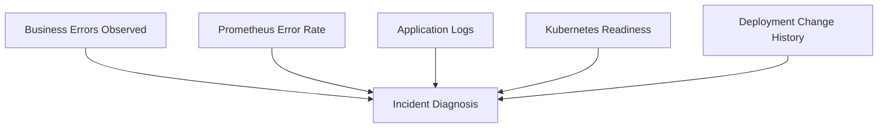

### Why do we need multiple signals?

Because:

```text
Error Rate Increased
```

does not immediately tell us why.

Logs and deployment history provide additional context.

Here, the Deployment environment-variable change is the likely cause because we deliberately introduced it.

In a real incident, we would verify the causal relationship rather than assume every problem occurring after a deployment was caused by that deployment.

---

## 41. Recover the Application

Now restore normal behavior.

### Step 1 — Change the failure mode

```bash
kubectl set env \
  deployment/obs-demo \
  -n delivery-observability-lab \
  FAIL_MODE=none
```

### Step 2 — Wait for the rollout

```bash
kubectl rollout status \
  deployment/obs-demo \
  -n delivery-observability-lab
```

### Step 3 — Restart the application port-forward

Stop the previous port-forward and start:

```bash
kubectl port-forward \
  -n delivery-observability-lab \
  service/obs-demo \
  18095:8080
```

### Step 4 — Verify the business endpoint

```bash
curl -fsS \
  http://127.0.0.1:18095/business
```

Expected:

```json
{
  "version": "v1",
  "success": true
}
```

### Step 5 — Generate recovered traffic

```bash
for i in $(seq 1 100); do
  curl \
    --silent \
    --output /dev/null \
    http://127.0.0.1:18095/business

  sleep 0.1
done
```

### Step 6 — Query Prometheus

Run:

```promql
sum(
  rate(
    demo_business_requests_total{status="503"}[2m]
  )
)
/
sum(
  rate(demo_business_requests_total[2m])
)
```

### Important observation

The error ratio may not immediately return to zero.

Why?

Because the query looks back over a two-minute window.

Recent failure observations can remain relevant until they age out of that window.

Also, replacing a Pod resets its in-process counters. Prometheus's counter-rate functions account for detected counter resets, but short windows and limited samples can still produce transient or incomplete results.

### Engineering principle

> **Recovery verification requires understanding observation windows, sampling delays, and metric semantics.**

Do not assume a single momentary metric reading tells the complete story.

---

## 42. Measuring Recovery Time

Let's define three timestamps.

```text
T1:
Failure First Detected
```

```text
T2:
Recovery Action Initiated
```

```text
T3:
Required Application Behavior Verified
```

Now we can define:

### Detection-to-action time

```text
T2 - T1
```

### Action-to-verification time

```text
T3 - T2
```

### Observed detection-to-recovery time

```text
T3 - T1
```

But there is another important timestamp.

```text
T0:
Actual Failure Began
```

If we know T0, then:

```text
T3 - T0
```

measures the full duration from failure onset to verified recovery.

### Why distinguish T0 and T1?

Because a failure may exist before anyone detects it.

For example:

```text
Failure begins:
10:00
```

```text
Alert fires:
10:08
```

```text
Engineer begins recovery:
10:12
```

```text
Service verified:
10:20
```

The system was unhealthy for twenty minutes.

But the observed detection-to-recovery interval was twelve minutes.

### Fundamental lesson

**Recovery metrics must define their starting and ending events precisely.**

Otherwise, two teams may report different recovery times for the same incident.

---

# Part VIII — Observe GitHub Actions Execution

## 43. Lab: Collect Real CI Job Timings

We have measured application behavior.

Now let's measure the delivery platform.

We will use GitHub's workflow-job API.

This avoids inventing timing data from screenshots.

### Step 1 — Identify your repository

Set:

```bash
export APP_REPO="YOUR_OWNER/ci-artifact-lab"
```

### Step 2 — List release runs

```bash
gh run list \
  --repo "$APP_REPO" \
  --workflow release.yml \
  --branch main \
  --limit 10
```

Choose a completed run.

```bash
export RUN_ID="YOUR_COMPLETED_RUN_ID"
```

### Step 3 — Download job metadata

```bash
mkdir -p evidence/phase-15
```

Run:

```bash
gh api \
  "repos/${APP_REPO}/actions/runs/${RUN_ID}/jobs?per_page=100" \
  > evidence/phase-15/ci-jobs.json
```

This uses the real GitHub API.

The result contains job information such as:

```text
Job Name

Status

Conclusion

Started At

Completed At
```

GitHub documents these fields in its workflow-jobs API. ([docs.github.com](https://docs.github.com/en/rest/actions/workflow-jobs))

---

## 44. Analyze the CI Job Durations

Create:

```text
scripts/analyze_ci_jobs.py
```

Add:

```python
#!/usr/bin/env python3

import json
import sys

from datetime import datetime


def parse_timestamp(value):
    return datetime.fromisoformat(
        value.replace("Z", "+00:00")
    )


def main():
    if len(sys.argv) != 2:
        print(
            "Usage: python analyze_ci_jobs.py ci-jobs.json"
        )
        raise SystemExit(2)

    with open(
        sys.argv[1],
        encoding="utf-8",
    ) as file:
        data = json.load(file)

    jobs = data.get("jobs", [])

    if not jobs:
        print("No jobs found")
        raise SystemExit(1)

    print("CI Job Execution Analysis")
    print("-" * 65)

    for job in jobs:
        name = job.get("name", "unknown")

        conclusion = job.get(
            "conclusion",
            "unknown",
        )

        started = job.get("started_at")
        completed = job.get("completed_at")

        if started and completed:
            duration = (
                parse_timestamp(completed)
                - parse_timestamp(started)
            ).total_seconds()

            duration_text = f"{duration:.1f}s"
        else:
            duration_text = "incomplete"

        print(
            f"{name:35} "
            f"{str(conclusion):12} "
            f"{duration_text}"
        )


if __name__ == "__main__":
    main()
```

Run:

```bash
python3 scripts/analyze_ci_jobs.py \
  evidence/phase-15/ci-jobs.json
```

### Expected output format

```text
CI Job Execution Analysis
-----------------------------------------------------------------

Validate Release Source             success      42.0s

Publish and Attest Image            success      105.0s
```

These numbers are illustrative.

Your script will calculate durations from the actual job timestamps.

### Important distinction

If two jobs run concurrently, do not add their durations and call the result total workflow time.

For example:

```text
Job A:
3 minutes
```

```text
Job B:
4 minutes
```

If both run in parallel:

```text
Overall elapsed time
```

may be closer to four minutes than seven.

We studied this in Phase 05 when designing job dependency graphs.

### Engineering principle

**Measure wall-clock delivery latency separately from the sum of component execution durations.**

---

## 45. Identify the Critical Path

Consider this workflow:

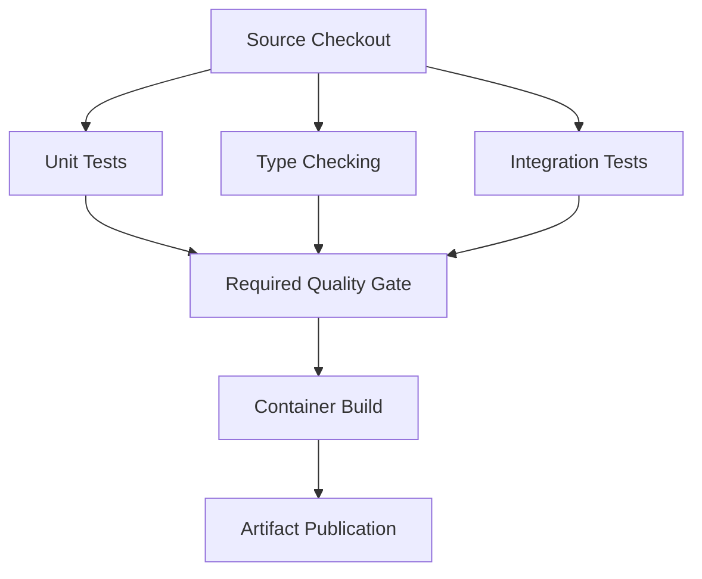

Suppose:

```text
Unit Tests:
2 minutes
```

```text
Type Checking:
1 minute
```

```text
Integration Tests:
5 minutes
```

The quality gate cannot complete before the longest required branch finishes.

Here, integration testing is on the critical path.

Optimizing type checking from one minute to thirty seconds may not reduce total workflow time if integration testing remains the bottleneck.

### Questions to ask

- Which jobs execute concurrently?
- Which jobs block downstream work?
- Which job has the longest duration?
- Which jobs experience queue delays?
- Which operations are repeated unnecessarily?
- Which validation is mandatory versus redundant?

### Important warning

Do not remove important validation merely to improve pipeline speed.

The correct optimization is to reduce unnecessary cost while preserving required evidence.

---

# Part IX — Alerts, Dashboards, and Incident Response

## 46. A Dashboard Is Not an Alerting Strategy

Suppose Grafana displays:

```text
HTTP Error Rate:
25%
```

But nobody is looking at the dashboard.

What happens?

The problem may continue unnoticed.

Dashboards help people investigate and understand.

Alerts notify responders when relevant conditions require attention.

### Different responsibilities

```text
Metrics
   |
   v
Detection Rules
   |
   v
Alert
   |
   v
Responder
   |
   v
Investigation
```

And:

```text
Metrics
   |
   v
Dashboard
   |
   v
Context and Diagnosis
```

### The important distinction

**Dashboards support investigation. Alerts support timely response.**

A well-designed observability platform needs both, but only where they serve a clear purpose.

---

## 47. Design an Error-Rate Alert

For our demonstration application, consider this alerting condition:

> Notify if more than 5% of recent business requests fail and enough requests have occurred to make the signal meaningful.

Conceptually:

```promql
(
  sum(
    rate(
      demo_business_requests_total{status="503"}[5m]
    )
  )
  /
  sum(
    rate(demo_business_requests_total[5m])
  )
) > 0.05
```

But this is incomplete.

We should also ensure there is meaningful traffic.

For example:

```promql
sum(
  increase(demo_business_requests_total[5m])
) > 20
```

These could be combined into a Prometheus alert rule.

### Why include a traffic condition?

Because a single error out of two requests can produce a 50% error ratio.

That may be relevant for a critical low-volume operation, but it needs a deliberately chosen alerting policy rather than an arbitrary global threshold.

### Important qualification

Traffic thresholds must reflect the application's real usage.

Do not copy `20 requests` into production without reasoning about the service.

---

## 48. Missing Data Is Also a Failure Mode

Consider:

```text
Application Metric:
No Recent Samples
```

Why might this happen?

Possible reasons:

- Application unavailable.
- Prometheus scrape failing.
- Network interruption.
- Instrumentation removed.
- Application receiving no traffic.
- Metrics endpoint failing.
- Prometheus itself unavailable.

These are different problems.

### Scrape availability

Query:

```promql
up{job="obs-demo"}
```

A value of zero indicates that Prometheus failed to scrape the configured target.

### Missing target

You can also inspect:

```promql
absent(up{job="obs-demo"})
```

This detects the absence of that expected series.

### Why both?

Because:

```text
Target Exists but Scrape Fails
```

differs from:

```text
Expected Target Series Is Missing
```

### Important observability limitation

If Prometheus itself becomes unavailable, its own alert evaluations may stop.

For higher-reliability monitoring, consider independent monitoring of the monitoring system and resilient alert delivery.

### Fundamental principle

> **A monitoring system must distinguish bad measurements, missing measurements, and absent user demand.**

Never silently treat all three as zero errors.

---

## 49. Alert on GitOps Problems Without Creating Noise

Suppose an Argo CD Application reports:

```text
OutOfSync
```

Should we immediately page an engineer?

Not necessarily.

The Application might intentionally require manual synchronization.

A better alert might involve:

```text
Application:
Production
```

```text
Expected state:
Automatically reconciled
```

```text
Observed state:
OutOfSync
```

```text
Duration:
Longer than allowed
```

Or:

```text
Health:
Degraded
```

### Example query

```promql
argocd_app_info{health_status="Degraded"}
```

This identifies applications whose resource health is reported as degraded.

To turn this into an alert, you must also decide:

- Which applications matter.
- How long the state may persist.
- Which severity applies.
- Whether the environment is under planned maintenance.
- Who should respond.

### Important lesson

**An alert should represent an actionable reliability condition, not merely an unusual metric value.**

---

## 50. Designing a Useful Grafana Dashboard

A good delivery-system dashboard should answer a small set of questions quickly.

### Dashboard area 1 — Delivery health

Show:

- Recent CI workflow results.
- Validation latency.
- Publishing failures.
- Recent approved deployments.
- Release verification status.

GitHub Actions data generally needs an API-based collector or an appropriate data-source integration before it can appear as time-series data in Grafana.

We have not installed that collector in this lab.

### Dashboard area 2 — GitOps state

Show:

- Argo CD sync status.
- Argo CD resource health.
- Reconciliation latency.
- Persistent drift.
- Sync failures.

### Dashboard area 3 — Kubernetes runtime

Show:

- Desired replicas.
- Available replicas.
- Pod restarts.
- Scheduling issues.
- Image-pull failures.
- Resource saturation.

These require the relevant Kubernetes metrics exporters and data sources.

### Dashboard area 4 — Application behavior

Show:

- Request rate.
- Error ratio.
- P95 latency.
- Business-operation success.
- Release version.

### Layout

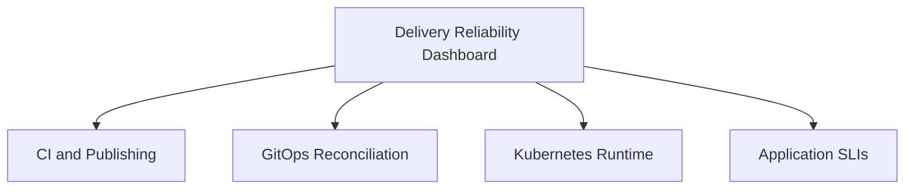

### Important principle

**A dashboard should reflect the questions an engineer needs to answer, not simply display every metric available.**

---

# Part X — Distributed Tracing and OpenTelemetry

## 51. Metrics Tell Us Where to Look. Traces Help Explain the Path.

Our local demonstration application has only one service.

Real applications often contain many components.

For example:

```text
API Gateway

Backend API

Order Service

PostgreSQL

Redis

Payment Provider
```

Imagine checkout latency increases from 300 milliseconds to two seconds.

Prometheus can detect the latency regression.

But which component caused it?

This is where distributed tracing becomes useful.

### Request path

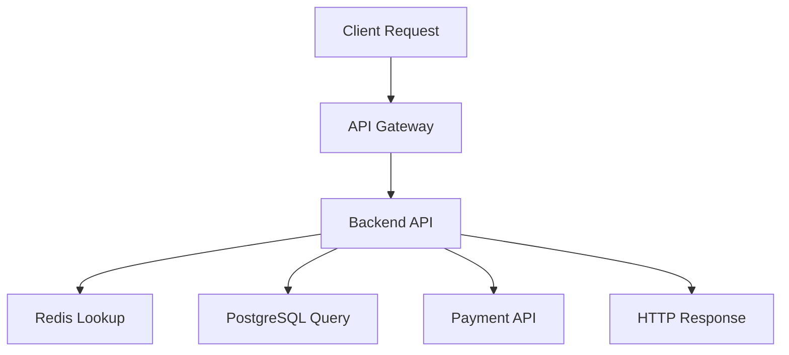

A distributed trace records spans corresponding to important operations in this request.

### Example trace structure

```text
Trace: checkout-request

  API Gateway
    Backend API
      Redis Lookup
      PostgreSQL Query
      Payment Authorization
```

Each span can record:

- Start time.
- Duration.
- Operation name.
- Parent-child relationship.
- Status.
- Selected attributes.

### What would we investigate?

Suppose the overall request is slow.

The trace may show that most latency occurs during payment authorization.

That helps narrow the investigation.

---

## 52. How OpenTelemetry Fits Into the Architecture

OpenTelemetry provides vendor-neutral APIs, SDKs, protocols, and collector components for generating and processing telemetry.

It can help connect application instrumentation to supported observability backends. ([opentelemetry.io](https://opentelemetry.io/docs/))

### Conceptual architecture

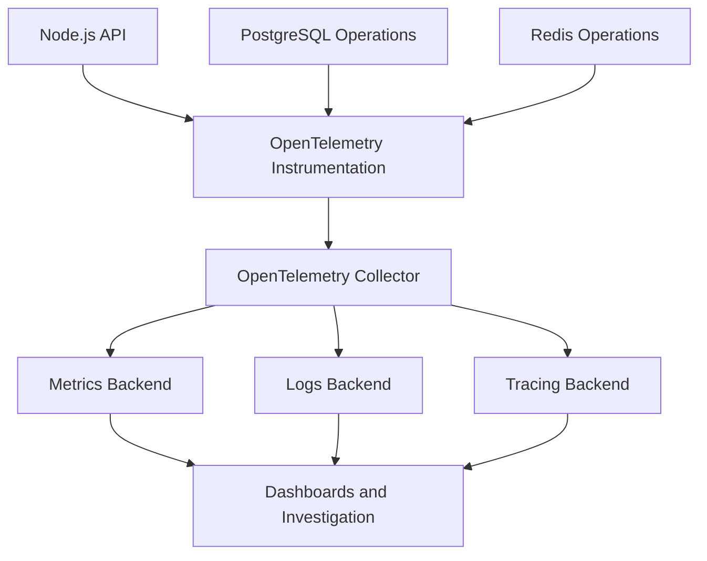

### What does OpenTelemetry not replace?

It is not automatically a complete time-series database.

It is not inherently a Grafana dashboard.

It is not a replacement for an incident-response process.

Instrumentation, collection, storage, analysis, and response are separate responsibilities.

### Engineering principle

**OpenTelemetry helps standardize telemetry production and transport. Observability still requires useful signals, storage, queries, and operational decisions.**

---

## 53. Correlate a Trace With a Release

Imagine we deploy:

```text
Release:
1.5.0
```

The corresponding image was produced from:

```text
Source SHA:
abc123
```

We want to compare behavior before and after deployment.

The application telemetry should carry bounded release metadata.

For example:

```text
service.name:
ecommerce-api
```

```text
deployment.environment.name:
production
```

```text
service.version:
1.5.0
```

A request trace can identify the service version that handled it.

This helps answer:

> Did the latency regression begin with the new application version?

### Important nuance

Temporal correlation does not automatically prove causation.

A deployment might coincide with:

- Increased traffic.
- Database saturation.
- External API degradation.
- Infrastructure changes.

We should use metrics, traces, logs, and deployment history together to evaluate the cause.

### Recommended investigation

1. Identify when the failure began.
2. Identify the deployed release at that time.
3. Compare the affected and unaffected versions.
4. Inspect request-level traces.
5. Examine downstream dependency behavior.
6. Test the suspected cause.
7. Choose an appropriate recovery action.

---

# Part XI — Observability as a Deployment Gate

## 54. Connect Observability to Argo Rollouts

In Phase 13, we introduced canary deployments.

Remember the core problem:

> How do we know whether a canary is safe to promote?

A simple timed rollout might do:

```text
Deploy 20%
       |
       v
Wait 5 Minutes
       |
       v
Promote
```

But time passing is not evidence.

A better design evaluates real measurements.

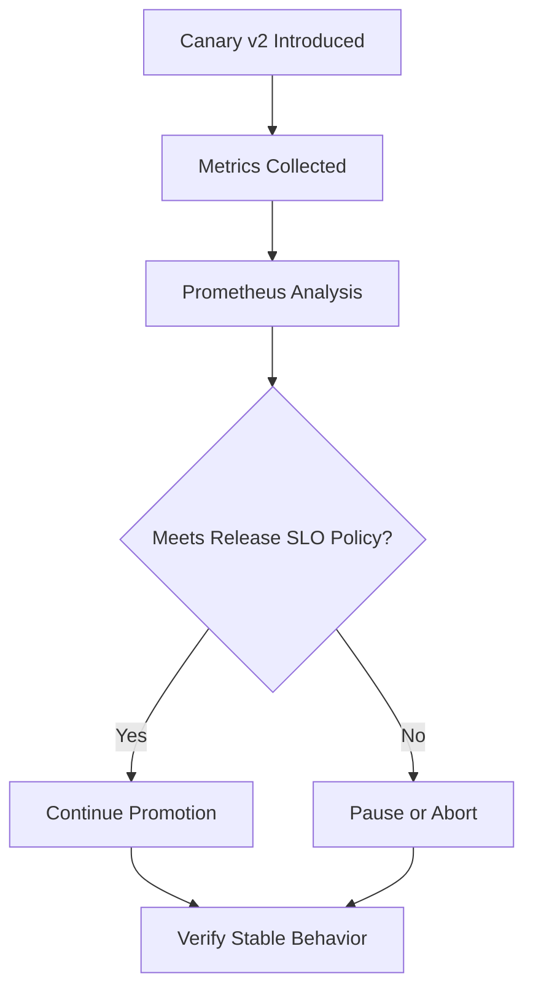

Argo Rollouts can use Prometheus-based AnalysisTemplates to evaluate metrics during progressive deployment. ([Argo Rollouts documentation](https://argoproj.github.io/argo-rollouts/analysis/prometheus/))

### Important distinction

Our Phase 15 demo metrics are not yet suitable for a production canary comparison.

Why?

Because our lab has only one replica and does not separate stable-versus-canary observations.

A real canary analysis needs to distinguish the relevant request populations.

For example:

```text
Stable Version:
v1
```

```text
Canary Version:
v2
```

Without that separation, an aggregate metric may hide canary-specific failures.

---

## 55. Design a Better Canary Analysis

Suppose our application exposes metrics with a bounded `version` label.

We can evaluate the new version separately.

### Example metric

```text
http_requests_total{
  service="ecommerce-api",
  version="v2",
  status="503"
}
```

A conceptual PromQL expression for the canary error ratio is:

```promql
sum(
  rate(
    http_requests_total{
      service="ecommerce-api",
      version="v2",
      status=~"5.."
    }[5m]
  )
)
/
sum(
  rate(
    http_requests_total{
      service="ecommerce-api",
      version="v2"
    }[5m]
  )
)
```

This expression assumes those metric names and labels exist.

Our local Python demo does not implement that exact metric family.

### Required checks

A safe progressive-delivery policy should consider:

1. Is telemetry available?
2. Has enough canary traffic occurred?
3. Is the canary error ratio acceptable?
4. Is latency acceptable?
5. Is the stable version behaving normally?
6. Are critical synthetic transactions passing?
7. Is there evidence of a shared dependency failure?

### Why compare stable and canary?

Suppose both versions suddenly experience increased latency.

That may indicate a shared dependency problem.

If only v2 experiences increased latency, the new release becomes a stronger suspect.

### Most important principle

> **Progressive delivery should evaluate the behavior of the version being introduced, not merely the aggregate health of the application.**

---

## 56. What Happens When Telemetry Is Unavailable?

Imagine a canary begins.

But Prometheus stops responding.

Should the rollout automatically continue?

There is no universal answer, but for a high-risk production release, **missing required evidence should not silently count as success**.

Possible policies include:

- Pause and require investigation.
- Retry measurement.
- Treat persistent analysis failure as a reason to abort.
- Require explicit operator authorization to continue.

### Why is this important?

The monitoring system is part of the release decision loop.

If it fails, the release system may no longer know whether its progression criteria are satisfied.

### New dependency relationship

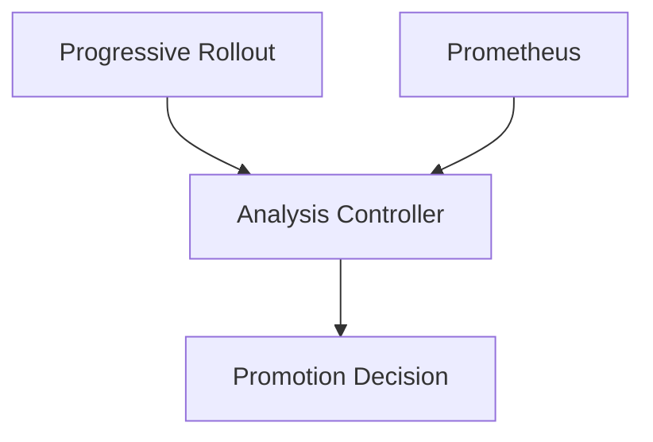

This creates a new reliability requirement:

**The telemetry system must be sufficiently available and trustworthy for the release decisions that depend on it.**

---

# Part XII — Incident Investigation as a Repeatable Process

## 57. A Production Incident Scenario

Imagine the following timeline.

```text
10:00
Production GitOps promotion approved

10:02
Argo CD detects new desired state

10:04
Kubernetes rollout completes

10:05
Error rate begins increasing

10:08
Error-budget burn alert fires

10:10
Engineer begins investigation

10:14
Recovery authorized

10:18
Previous compatible release restored

10:20
Application behavior verified
```

What would a weak incident response look like?

```text
The deployment is probably bad.
Rollback immediately.
```

That might be correct.

But it is not sufficient reasoning.

### Better investigation

Identify:

**Expected state**

Which release should production run?

**Observed state**

Which image and configuration are actually running?

**Application impact**

Which user operations are failing?

**Scope**

Which customers, regions, or endpoints are affected?

**Recent changes**

Which source, configuration, and infrastructure changes occurred?

**Dependency behavior**

Are PostgreSQL, Redis, and other services operating normally?

**Recovery options**

Can the previous application version run safely against current state?

---

## 58. Use the First Failed Boundary

Our delivery chain is:

```text
Source
   |
   v
CI
   |
   v
Registry
   |
   v
GitOps
   |
   v
Argo CD
   |
   v
Kubernetes
   |
   v
Application
```

Now examine several symptoms.

### Symptom A — CI has not started

Investigate:

- Workflow trigger.
- Repository event.
- Runner availability.
- Queue state.
- Workflow authorization.

Do not start by investigating Kubernetes Pods.

### Symptom B — Registry image unavailable

Investigate:

- Publishing workflow.
- Registry authorization.
- Artifact digest.
- Package visibility.
- Network access.

### Symptom C — Argo CD cannot render manifests

Investigate:

- Selected Git revision.
- Repository credentials.
- Kustomize or Helm configuration.
- Repository-server logs.

### Symptom D — Kubernetes Pods remain Pending

Investigate:

- Scheduling events.
- Resource requests.
- Node availability.
- Taints and tolerations.
- Storage requirements.

### Symptom E — Pods are Ready but transactions fail

Investigate:

- Business metrics.
- Application logs.
- Request traces.
- Dependency health.
- Release-specific behavior.

### Core debugging model

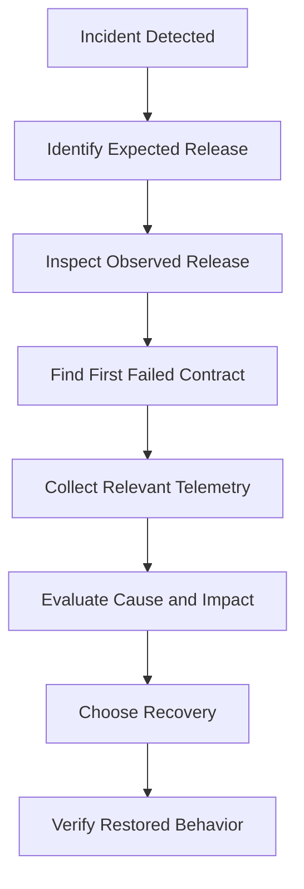

### Engineering principle

> **Observability becomes useful when it reduces the time required to locate the failed contract and choose a safe response.**

---

## 59. Recovery Must Be Measured Against Outcomes

Suppose an engineer restores the previous image.

Argo CD reports:

```text
Synced
```

Kubernetes reports:

```text
Available
```

Should the incident be closed immediately?

Not necessarily.

We should verify the actual service objective.

For example:

```text
Checkout Success Rate:
Restored
```

```text
Payment Latency:
Acceptable
```

```text
Database Compatibility:
Verified
```

```text
Critical Synthetic Transaction:
Passed
```

### Important distinction

```text
Recovery Command Completed
       !=
Service Recovered
```

Recovery should be considered verified when the required operational behavior has been restored.

### Another important nuance

Some metrics use rolling windows.

Even after service recovery, an error-rate graph may continue reflecting historical failures.

Therefore, verification should combine:

- Recent successful transactions.
- Current runtime state.
- Appropriately selected metric windows.
- Dependency health.
- Any residual incident impact.

---

## 60. Build an Incident Evidence Timeline

For a real incident, create a timeline.

Example:

| Timestamp | Observation | Evidence |
|---|---|---|
| 10:00 | GitOps promotion merged | Git commit |
| 10:02 | Argo CD observed revision | Application status |
| 10:04 | Deployment rollout finished | Kubernetes conditions |
| 10:05 | Error rate increased | Prometheus |
| 10:08 | Alert triggered | Alert history |
| 10:10 | Investigation began | Incident record |
| 10:14 | Recovery approved | Change record |
| 10:18 | Previous image selected | GitOps commit |
| 10:20 | Critical business test passed | Verification result |

The example timestamps are illustrative.

### Why create a timeline?

Because it helps answer:

- When did user impact begin?
- How quickly was it detected?
- Which system changed immediately beforehand?
- Which recovery action was taken?
- When did acceptable service behavior return?
- Which delays could be reduced next time?

### Reliability improvement is based on evidence

A useful post-incident review should identify the conditions that allowed the incident and the mechanisms that could reduce future impact.

The goal is improved system behavior—not simply assigning blame to the person who triggered the deployment.

---

# Part XIII — Optional Grafana Lab

## 61. Turn Prometheus Measurements Into a Dashboard

We now have:

```text
Application Metrics
       |
       v
Prometheus
```

Grafana will provide an interface to visualize those measurements.

### Why add Grafana?

Prometheus already supports querying metrics.

Grafana helps us:

- Combine multiple measurements.
- Compare trends.
- Organize dashboards.
- Add deployment context.
- Investigate changes over time.

We will use an internal Kubernetes Service and local port forwarding.

There is no need to expose Grafana to the internet.

---

## 62. Provision Grafana's Prometheus Data Source

Create:

```text
k8s/grafana.yaml
```

Add:

```yaml
apiVersion: v1
kind: ConfigMap
metadata:
  name: grafana-datasources
  namespace: delivery-observability-lab

data:
  prometheus.yaml: |
    apiVersion: 1

    datasources:
      - name: Prometheus
        type: prometheus
        access: proxy
        isDefault: true

        url: http://prometheus.delivery-observability-lab.svc.cluster.local:9090

---
apiVersion: apps/v1
kind: Deployment
metadata:
  name: grafana
  namespace: delivery-observability-lab

spec:
  replicas: 1

  selector:
    matchLabels:
      app: grafana

  template:
    metadata:
      labels:
        app: grafana

    spec:
      securityContext:
        fsGroup: 472

      containers:
        - name: grafana
          image: grafana/grafana:12.2.0

          ports:
            - name: web
              containerPort: 3000

          env:
            - name: GF_SECURITY_ADMIN_USER
              value: admin

            - name: GF_SECURITY_ADMIN_PASSWORD
              valueFrom:
                secretKeyRef:
                  name: grafana-local-admin
                  key: password

          volumeMounts:
            - name: datasources
              mountPath: /etc/grafana/provisioning/datasources
              readOnly: true

            - name: storage
              mountPath: /var/lib/grafana

          resources:
            requests:
              cpu: 50m
              memory: 128Mi

            limits:
              cpu: 500m
              memory: 512Mi

      volumes:
        - name: datasources
          configMap:
            name: grafana-datasources

        - name: storage
          emptyDir: {}

---
apiVersion: v1
kind: Service
metadata:
  name: grafana
  namespace: delivery-observability-lab

spec:
  selector:
    app: grafana

  ports:
    - name: web
      port: 3000
      targetPort: web
```

This uses a specific available Grafana OSS image rather than a moving tag. The deployment is for local experimentation, not a production installation. ([Grafana Docker documentation](https://grafana.com/docs/grafana/latest/setup-grafana/configure-docker/))

Grafana supports provisioning data sources using YAML files, which is useful when building reproducible observability environments. ([Grafana provisioning](https://grafana.com/docs/grafana/latest/administration/provisioning/))

### Create a local administrator password

Run:

```bash
export GRAFANA_PASSWORD="$(openssl rand -hex 18)"
```

Create a Kubernetes Secret:

```bash
kubectl create secret generic grafana-local-admin \
  -n delivery-observability-lab \
  --from-literal=password="$GRAFANA_PASSWORD"
```

This Secret is for the local disposable lab.

Do not commit the password to Git.

### Deploy Grafana

```bash
kubectl apply -f k8s/grafana.yaml
```

Wait:

```bash
kubectl rollout status \
  deployment/grafana \
  -n delivery-observability-lab \
  --timeout=180s
```

### Access Grafana

```bash
kubectl port-forward \
  -n delivery-observability-lab \
  service/grafana \
  13000:3000
```

Open:

**http://localhost:13000**

Log in with:

```text
Username:
admin
```

Use the password stored in your `GRAFANA_PASSWORD` shell variable.

For a production installation, use a proper authentication, persistence, access-control, and secret-management design.

---

## 63. Create Your First Reliability Dashboard

In Grafana, create a dashboard with four panels.

### Panel 1 — Business request rate

Use:

```promql
sum(
  rate(demo_business_requests_total[2m])
)
```

Unit:

```text
Requests per second
```

### Panel 2 — Business error percentage

Use:

```promql
100 *
sum(
  rate(
    demo_business_requests_total{status="503"}[2m]
  )
)
/
sum(
  rate(demo_business_requests_total[2m])
)
```

Unit:

```text
Percent
```

### Panel 3 — P95 business latency

Use:

```promql
histogram_quantile(
  0.95,
  sum by (le) (
    rate(
      demo_business_request_duration_seconds_bucket[2m]
    )
  )
)
```

Unit:

```text
Seconds
```

### Panel 4 — Argo CD degraded applications

Use:

```promql
count(
  argocd_app_info{health_status="Degraded"}
)
```

This panel requires the Argo CD metrics target to be reachable.

### Now repeat the failure experiment

1. Generate healthy requests.
2. Enable `FAIL_MODE=error`.
3. Generate failed requests.
4. Restore `FAIL_MODE=none`.
5. Generate healthy requests again.

Observe how the dashboard changes.

### What have you demonstrated?

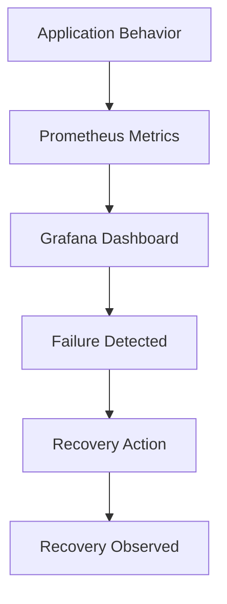

### Important limitation

Our Grafana dashboard visualizes available metrics.

It does not automatically know:

- Which GitHub Actions run published the release.
- Which GitOps pull request was approved.
- Whether a database migration occurred.

A complete production dashboard would need those release events supplied by integrations or telemetry pipelines.

---

# Part XIV — Reliability Engineering Beyond Tool Configuration

## 64. Reliability Patterns for CI/CD Systems

We have learned how to observe failures.

Now we should ask how to make the delivery system itself more reliable.

Consider five important patterns.

### Pattern 1 — Timeouts

A CI job that hangs forever prevents useful feedback.

Use appropriate timeouts for:

- Workflow jobs.
- Integration tests.
- External API requests.
- Deployment verification.
- Artifact publication.

But avoid arbitrary timeouts that interrupt legitimate operations under normal load.

### Pattern 2 — Retries

Some failures are transient.

For example:

```text
Registry API:
Temporary unavailable
```

A bounded retry with backoff may succeed.

But retrying every failure blindly can:

- Hide deterministic defects.
- Amplify outages.
- Duplicate side effects.
- Increase costs.

### Pattern 3 — Idempotency

A repeated release operation should not unpredictably change the intended artifact.

For example:

```text
Promote Digest BBB to Development
```

Repeated with the same inputs should have predictable effects.

This is especially important when retries occur after uncertain partial completion.

### Pattern 4 — Isolation

A failed development deployment should not automatically affect production.

A failed PR test should not compromise a publishing runner.

A stalled application rollout should not prevent unrelated services from operating.

Isolation limits the blast radius of failures.

### Pattern 5 — Recovery

The platform must know how to restore acceptable behavior.

This requires:

- Previous artifact identity.
- Previous desired configuration.
- Compatible database state.
- Authorized recovery workflow.
- Runtime verification.

### General principle

> **Reliability improves when operations are bounded, repeatable, isolated, observable, and recoverable.**

---

## 65. The Difference Between Retry and Recovery

Suppose Argo CD cannot contact Git.

It retries.

This may be appropriate because the failure could be temporary.

Now suppose a new application image contains a deterministic startup bug.

Will retrying the same deployment indefinitely fix the application?

Probably not.

### Decision model

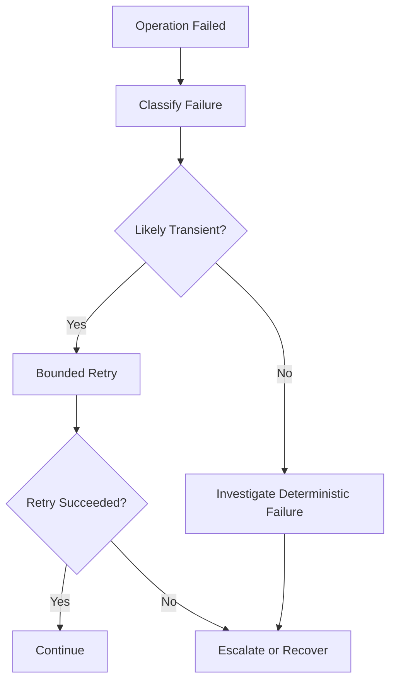

### Important lesson

Retries are useful only when their expected benefit exceeds their cost and risk.

A retry policy should consider:

- Idempotency.
- Backoff.
- Maximum attempts.
- Timeouts.
- Failure classification.
- Downstream capacity.

A recovery decision is broader.

It may require changing the intended system state.

---

## 66. When Should the Delivery System Stop a Release?

Imagine a release candidate.

Its image is valid.

Argo CD applies the configuration.

Kubernetes creates the new Pods.

But business errors increase.

Should the release continue?

That depends on the defined release policy.

For a progressive rollout, an automated analysis gate may stop further exposure.

For a standard rolling Deployment, external verification may identify the failure and initiate a separate recovery procedure.

### The control relationship

```text
Deployment Strategy
        +
Runtime Observability
        +
Release Policy
        |
        v
Continue / Pause / Abort / Recover
```

### Why is this important?

Because observability should influence operational decisions.

A dashboard that shows failures but never informs deployment control may provide visibility without effective risk reduction.

### Important qualification

Automatic decisions should use sufficiently trustworthy evidence.

A broken or missing metric should not silently satisfy a required release gate.

---

## 67. Designing Reliability Across Failure Domains

Consider the delivery architecture:

```text
GitHub Actions

GHCR

GitHub GitOps Repository

Argo CD

AKS
```

Different components can fail independently.

But some failures may affect multiple components.

For example, a GitHub outage might affect both:

- Source repository availability.
- GitOps repository access.
- GitHub Actions execution.

### Shared-failure model

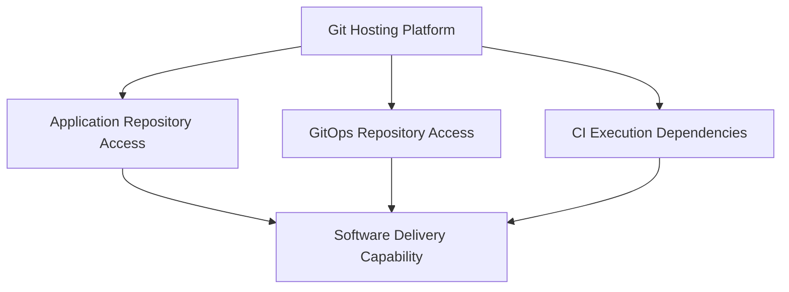

### What should we learn?

Two components are not necessarily independent merely because they have different names.

They may share:

- Network dependencies.
- Authentication systems.
- Cloud regions.
- DNS.
- Registry infrastructure.
- Git hosting platforms.

### Engineering lesson

**Reliability architecture must consider shared failure domains, not merely the number of components or replicas.**

---

## 68. How to Improve the System Using Evidence

Imagine your team observes:

```text
CI feedback latency:
High
```

Investigation shows:

```text
Runner queue delay:
70% of total time
```

Would rewriting unit tests provide the biggest improvement?

Probably not.

Now imagine:

```text
Kubernetes rollout latency:
High
```

Investigation shows:

```text
Image pull duration:
Dominant
```

Possible improvements might include:

- Reducing image size.
- Improving image distribution.
- Ensuring adequate network capacity.
- Examining image caching.
- Avoiding unnecessary rebuilds.

Now imagine:

```text
Release failure rate:
High
```

Investigation shows:

```text
Database compatibility failures:
Frequent
```

A stronger migration policy may provide more value than adding more Argo CD replicas.

### Improvement process

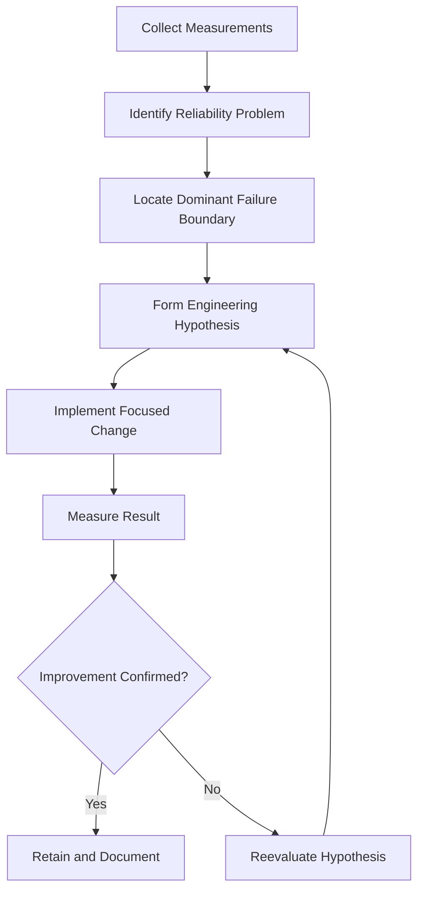

This is the same feedback-control philosophy we established in Phase 02.

We have now applied it to the reliability of the delivery platform itself.

---

# Part XV — Final Validation and Evidence

## 69. Define Lab Acceptance Criteria

We should not call the lab complete merely because Prometheus and Grafana are running.

Our objective was to demonstrate that the system can detect, explain, and verify recovery from an application-level failure.

Use the following acceptance criteria.

| ID | Requirement | Evidence |
|---|---|---|
| OBS-01 | Application starts successfully | Kubernetes Deployment status |
| OBS-02 | Business endpoint works normally | Successful HTTP response |
| OBS-03 | Application exposes metrics | `/metrics` output |
| OBS-04 | Prometheus collects application metrics | Healthy `obs-demo` target |
| OBS-05 | Argo CD metrics can be collected | Healthy `argocd` target, if installed |
| OBS-06 | Failed business requests are measurable | HTTP 503 counter |
| OBS-07 | Business failure is visible despite readiness | Pod Ready + HTTP 503 |
| OBS-08 | Application logs explain the failed operation | Structured log records |
| OBS-09 | Recovery restores application behavior | Successful business response |
| OBS-10 | Historical observations remain interpretable | Prometheus time-window queries |
| OBS-11 | CI job execution time can be measured | GitHub job metadata |
| OBS-12 | Resource cleanup is controlled | Namespace deletion |

### Critical distinction

We have **implemented metrics collection and manual verification**.

We have **not implemented a production-grade alert-delivery system, long-term metrics storage, highly available monitoring, or complete distributed tracing**.

Those would require additional architecture and deployment work.

This distinction matters when documenting the project.

---

## 70. Capture Meaningful Evidence

Create an evidence directory:

```bash
mkdir -p evidence/phase-15
```

### Record Kubernetes state

```bash
kubectl get deployments,pods,services \
  -n delivery-observability-lab \
  -o wide \
  > evidence/phase-15/kubernetes-state.txt
```

### Record Argo CD Application state

If Argo CD is installed:

```bash
kubectl get applications \
  -n argocd \
  -o wide \
  > evidence/phase-15/argocd-applications.txt
```

### Record relevant application logs

```bash
kubectl logs \
  deployment/obs-demo \
  -n delivery-observability-lab \
  --tail=100 \
  > evidence/phase-15/application-logs.txt
```

### Record Prometheus target health

With the Prometheus port-forward running:

```bash
curl -fsS \
  http://127.0.0.1:19090/api/v1/targets \
  > evidence/phase-15/prometheus-targets.json
```

### Record error-rate measurements

```bash
curl -fsSG \
  http://127.0.0.1:19090/api/v1/query \
  --data-urlencode \
  'query=sum(rate(demo_business_requests_total{status="503"}[2m])) / sum(rate(demo_business_requests_total[2m]))' \
  > evidence/phase-15/error-rate.json
```

### Important qualification

These commands collect observations at the time you run them.

If you want before/during/after comparisons, record separate snapshots at each stage.

Also, verify that the output files do not contain sensitive information before committing or sharing them.

---

## 71. Recommended Screenshots

For your portfolio or learning documentation, capture:

| Screenshot | What it demonstrates |
|---|---|
| GitHub Actions execution | CI jobs and real execution duration |
| Prometheus Targets | Metrics collection connectivity |
| Healthy application dashboard | Baseline behavior |
| Kubernetes ready Pod | Orchestration-level health |
| HTTP 503 response | Actual business failure |
| Error-rate increase | Detection through application metrics |
| Structured application logs | Diagnostic context |
| Argo CD metrics | Delivery-controller observability |
| Recovery operation | Corrective action |
| Recovered HTTP response | Restored business behavior |
| Grafana timeline | Failure and recovery over time |

### Write an engineering conclusion

A strong project explanation would say:

> We observed a Kubernetes Deployment that completed successfully while its application returned HTTP 503 for critical business requests. Readiness and liveness checks remained healthy, demonstrating that orchestration-level health was insufficient to establish business correctness. Application request metrics detected the failure, logs provided context, and a controlled recovery restored successful responses. We also measured CI job durations and collected Argo CD controller metrics to distinguish delivery-platform reliability from runtime reliability.

Use this statement only after executing and verifying the relevant experiments.

---

## 72. Cleanup

This lab used a dedicated namespace.

If you want to preserve the GitHub Actions and GitOps projects but remove the observability experiment, delete only its namespace.

First confirm:

```bash
kubectl config current-context
```

Expected:

```text
kind-argocd-lab
```

Then:

```bash
kubectl delete namespace delivery-observability-lab
```

The command removes the application's Deployment, Services, ConfigMaps, Prometheus, and optional Grafana resources in that namespace.

It does not delete the existing Argo CD installation or the earlier `ecommerce-dev` application.

If your local cluster is no longer needed for the remaining course work, you may instead delete the dedicated kind cluster:

```bash
kind delete cluster --name argocd-lab
```

Do not delete an existing cloud cluster or shared Kubernetes environment.

---

# Part XVI — Independent System-Design Exercise

## 73. Design Reliability and Observability for an AKS Delivery Platform

Imagine you join a company operating this architecture:

```text
Developer
    |
    v
GitHub
    |
    v
GitHub Actions
    |
    v
Azure Container Registry
    |
    v
GitOps
    |
    v
Argo CD
    |
    v
Azure Kubernetes Service
    |
    v
Node.js API
    |
    v
PostgreSQL
```

The organization has:

```text
Development

Staging

Production
```

It deploys multiple times per day.

Recently, the team experienced:

- Long CI queue times.
- Intermittent integration-test failures.
- Slow Kubernetes rollouts.
- Argo CD synchronization delays.
- Production application errors after successful deployments.
- Recovery procedures taking longer than expected.

Your task is to design the reliability architecture.

### Exercise A — Define the users

Identify the users of:

- CI validation.
- Artifact publishing.
- GitOps deployment.
- Production application services.

What does each user expect?

### Exercise B — Define SLOs

Create at least four objectives covering:

```text
CI Feedback

Artifact Publishing

Deployment Verification

Application Availability
```

For every objective, define:

```text
SLI:

SLO:

Measurement Window:

Eligible Operations:

Successful Operations:

Failure Classification:

Source of Evidence:
```

### Exercise C — Design telemetry collection

Choose the appropriate signals for:

- GitHub Actions.
- Container registry.
- Argo CD.
- Kubernetes.
- Node.js API.
- PostgreSQL.

Explain which signals are metrics, logs, traces, events, or audit records.

### Exercise D — Design dashboard architecture

Draw a dashboard architecture connecting:

```text
CI Telemetry

GitOps Telemetry

Kubernetes Telemetry

Application Metrics

Distributed Traces

Release Events
```

Explain how you would identify the release associated with a performance regression.

### Exercise E — Design alerts

Create alerting policies for:

1. Critical application error-budget burn.
2. Failed or stalled production deployment.
3. Persistent Argo CD reconciliation failure.
4. Missing telemetry from a critical application.
5. Excessive CI platform queue delay.

For every alert, define:

```text
Condition:

Duration:

Severity:

Responsible Team:

Required Response:

Runbook:
```

### Exercise F — Design canary verification

Suppose a new release receives 10% of production traffic.

Define:

- Availability acceptance criteria.
- Latency acceptance criteria.
- Minimum observation requirements.
- Stable-versus-canary comparison.
- Insufficient-data handling.
- Automatic-abort conditions.
- Manual-promotion conditions.

Explain which parts belong to Argo Rollouts and which belong to the monitoring platform.

### Exercise G — Design recovery

A deployment causes 25% HTTP errors.

Explain how you would:

1. Identify the deployment.
2. Confirm the active image digest.
3. Inspect the GitOps revision.
4. Compare stable and new-version metrics.
5. Identify affected user operations.
6. Evaluate database compatibility.
7. Authorize recovery.
8. Restore an acceptable release.
9. Verify operational behavior.
10. Measure recovery effectiveness.

### Final architecture process

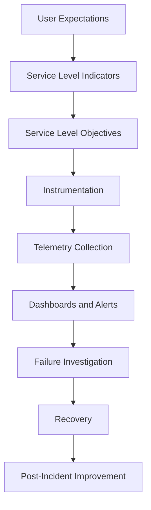

### Main design question

**How can the delivery platform prove not only that a deployment happened, but that the intended release reached acceptable operational behavior?**

---

# Part XVII — Memorization

## 74. Ten Reliability Mental Models

### Mental Model 1 — Reliability begins with expectations

```text
User Expectation
       |
       v
Measurable Success
       |
       v
Reliability Objective
```

### Mental Model 2 — Monitoring differs from observability

```text
Monitoring:
Detect Known Problems
```

```text
Observability:
Explain System Behavior
```

### Mental Model 3 — Three main telemetry signals

```text
Metrics
    =
Numerical Behavior Over Time
```

```text
Logs
    =
Detailed Events
```

```text
Traces
    =
Related Operations Across a Request
```

### Mental Model 4 — SLI, SLO, and error budget

```text
SLI:
Measured Behavior
```

```text
SLO:
Target Behavior
```

```text
Error Budget:
Allowed Deviation From Target
```

### Mental Model 5 — CI success is not application success

```text
CI Passed
     !=
Deployment Verified
```

### Mental Model 6 — Synced is not healthy

```text
Argo CD Synced
       !=
Business Operations Successful
```

### Mental Model 7 — Ready is not correct

```text
Kubernetes Pod Ready
         !=
Application Business Correctness
```

### Mental Model 8 — A useful release has traceable identities

```text
Source SHA
    |
    v
CI Run
    |
    v
Image Digest
    |
    v
GitOps Revision
    |
    v
Runtime Version
```

### Mental Model 9 — Recovery must be verified

```text
Failure Detected
       |
       v
Recovery Action
       |
       v
Operational Verification
```

### Mental Model 10 — Optimize based on evidence

```text
Measure
   |
   v
Identify Bottleneck
   |
   v
Improve
   |
   v
Measure Again
```

These ten relationships are more valuable to memorize than dozens of individual PromQL functions.

---

# Part XVIII — Active Recall and Interview Preparation

## 75. Active Recall Questions

### First principles

**Q1.** What is reliability?

**Q2.** Why must success be defined before reliability can be measured?

**Q3.** What is the difference between delivery-platform reliability and application reliability?

**Q4.** How does monitoring differ from observability?

**Q5.** Why does observability need multiple signals?

### SLIs and SLOs

**Q6.** What is an SLI?

**Q7.** What is an SLO?

**Q8.** How does an SLA differ from an SLO?

**Q9.** What is an error budget?

**Q10.** What does a 20× error-budget burn rate mean?

**Q11.** Why must an SLI define eligible requests?

### CI/CD reliability

**Q12.** Why isn't CI pass percentage a complete reliability measure?

**Q13.** What is a flaky test?

**Q14.** How do workflow queue time and execution time differ?

**Q15.** Why must parallel job durations not simply be added together?

**Q16.** What is the critical path through a workflow?

### GitOps

**Q17.** What does Argo CD `Synced` mean?

**Q18.** What does Argo CD `Healthy` mean?

**Q19.** Why can an Application be synchronized while the workload is unavailable?

**Q20.** Which Argo CD metrics help evaluate reconciliation behavior?

### Kubernetes and applications

**Q21.** Why can a ready Pod still produce HTTP 500 errors?

**Q22.** What are the four golden signals?

**Q23.** Why are latency percentiles useful?

**Q24.** What is metric cardinality?

**Q25.** Why should request IDs not normally be Prometheus labels?

### Progressive delivery

**Q26.** How can Prometheus influence a canary deployment?

**Q27.** Why should the canary version be measured separately from the stable version?

**Q28.** What should happen when required canary metrics are unavailable?

### Incident response

**Q29.** How do detection time and recovery time differ?

**Q30.** Why is successful rollback not necessarily verified recovery?

**Q31.** How would you correlate a production error spike with a specific artifact?

**Q32.** Why is a release timeline useful during incident investigation?

---

## 76. Interview and System-Design Questions

### Question 1

Your GitHub Actions workflow succeeds, Argo CD reports `Synced`, and Kubernetes reports three ready Pods.

Users are still experiencing HTTP 500 errors.

Explain the system boundaries involved and how you would investigate.

### Question 2

How would you define an SLO for an internal CI/CD platform?

Explain why test failures should not automatically count as CI infrastructure failures.

### Question 3

A CI workflow takes twenty minutes to complete.

How would you identify whether queueing, testing, build execution, or artifact publication is responsible?

### Question 4

Explain the difference between metrics, logs, and traces using a real checkout request.

### Question 5

How would you instrument a Node.js API to detect a release that increases P95 latency without increasing its HTTP error rate?

### Question 6

Why might a Kubernetes readiness probe be insufficient to verify that a release is safe?

### Question 7

How would you design Prometheus and Grafana monitoring for Argo CD?

Which conditions would justify alerts?

### Question 8

A canary rollout has no reported errors because it has received almost no requests.

Should it automatically promote?

Explain your acceptance policy.

### Question 9

An application has a 99.9% request-success SLO.

Its recent error rate is 2%.

Explain the meaning of error-budget burn and how it could influence release decisions.

### Question 10

Design an observable GitOps delivery platform connecting GitHub Actions, a container registry, Argo CD, Kubernetes, and application telemetry.

Explain how an engineer can determine:

- What changed.
- When it changed.
- Who authorized it.
- Which artifact was deployed.
- Where the transition failed.
- Whether recovery succeeded.

---

# Part XIX — Official Documentation

## 77. Google SRE: Service Level Objectives

https://sre.google/workbook/implementing-slos/

Study:

- Choosing user-relevant SLIs.
- Defining SLOs.
- Request-based success ratios.
- Error budgets.
- Reliability decision-making.

## 78. Google SRE: Alerting on SLOs

https://sre.google/workbook/alerting-on-slos/

Study:

- Error-budget consumption.
- Burn-rate alerting.
- Multiple observation windows.
- Alerting trade-offs.

## 79. GitHub Actions Execution Data

**Workflow runs:**

https://docs.github.com/en/rest/actions/workflow-runs

**Workflow jobs:**

https://docs.github.com/en/rest/actions/workflow-jobs

Study:

- Run states.
- Job conclusions.
- Timestamps.
- Execution metadata.
- Logs and artifacts.

## 80. Argo CD Metrics

https://argo-cd.readthedocs.io/en/stable/operator-manual/metrics/

Study:

- Application information.
- Reconciliation duration.
- Synchronization metrics.
- Controller health.

## 81. Prometheus

**Configuration:**

https://prometheus.io/docs/prometheus/latest/configuration/configuration/

**PromQL functions:**

https://prometheus.io/docs/prometheus/latest/querying/functions/

Study:

- Scrape targets.
- Counters.
- Gauges.
- Histograms.
- `rate()`.
- `increase()`.
- `histogram_quantile()`.

## 82. Grafana

**Provisioning:**

https://grafana.com/docs/grafana/latest/administration/provisioning/

**Prometheus data source:**

https://grafana.com/docs/grafana/latest/datasources/prometheus/configure/

Study:

- Data-source configuration.
- Dashboards.
- Visualization.
- Alerting.

## 83. OpenTelemetry

https://opentelemetry.io/docs/

Study:

- Metrics.
- Logs.
- Traces.
- Instrumentation.
- Context propagation.
- OpenTelemetry Collector.

## 84. Argo Rollouts Analysis

https://argoproj.github.io/argo-rollouts/features/analysis/

**Prometheus provider:**

https://argoproj.github.io/argo-rollouts/analysis/prometheus/

Study how progressive-delivery decisions can be based on measured application behavior.

---

# 85. Phase 15 — Engineering Takeaways

| Principle | Engineering meaning |
|---|---|
| **Reliability requires expectations** | Define measurable success before choosing monitoring tools |
| **CI reliability and application reliability differ** | They serve different users |
| **Monitoring detects conditions** | Observability helps explain behavior |
| **Metrics, logs, and traces are complementary** | Each reveals different aspects of a failure |
| **Release correlation matters** | Connect source, build, artifact, GitOps, and runtime identities |
| **SLIs measure behavior** | Choose user-relevant indicators |
| **SLOs define targets** | Reliability objectives require time windows |
| **Error budgets quantify tolerance** | Use them to inform risk decisions |
| **CI pass rate is not platform reliability** | Distinguish source defects from infrastructure failures |
| **Queue latency and execution duration differ** | Optimize the real bottleneck |
| **Argo CD `Synced` is not operational success** | Configuration convergence is only one condition |
| **Pod readiness is not business correctness** | Verify critical application operations |
| **Missing data is meaningful** | Never equate absent telemetry with health |
| **Prometheus records behavior over time** | Queries must account for windows and sample availability |
| **Grafana organizes investigation** | Dashboards are not automatically an alerting strategy |
| **OpenTelemetry helps correlate operations** | Traces explain distributed request paths |
| **Canary analysis requires representative evidence** | Limited traffic can create false confidence |
| **Recovery must be verified** | A successful corrective command is not enough |
| **Reliable systems improve through feedback** | Measure, diagnose, improve, and measure again |

---

# 86. Final Understanding — CI/CD as an Observable Control System

We started Level 4 by learning how to introduce software changes safely.

Then we studied how to secure the delivery chain.

Now we have learned how to measure whether the system is working and explain what happens when it fails.

Let's connect the complete architecture.

```mermaid
flowchart TD
    A["Developer"]
    B["Application Repository"]
    C["GitHub Actions"]
    D["Validated Artifact"]
    E["Container Registry"]

    F["Release Authorization"]
    G["GitOps Repository"]
    H["Argo CD"]
    I["Argo Rollouts"]
    J["Kubernetes"]
    K["Running Application"]

    L["CI Execution Telemetry"]
    M["GitOps Metrics"]
    N["Kubernetes Events"]
    O["Application Metrics and Logs"]
    P["Distributed Traces"]

    Q["Observability Platform"]
    R["Reliability Objectives"]
    S["Operational Decision"]

    T["Continue Release"]
    U["Pause or Recover"]

    A --> B
    B --> C
    C --> D
    D --> E

    E --> F
    F --> G
    G --> H
    H --> I
    I --> J
    J --> K

    C --> L
    H --> M
    J --> N
    K --> O
    K --> P

    L --> Q
    M --> Q
    N --> Q
    O --> Q
    P --> Q

    Q --> R
    R --> S

    S --> T
    S --> U
```

This architecture contains multiple feedback loops.

### Feedback loop 1 — Developer feedback

```text
Code Change
     |
     v
CI Validation
     |
     v
Developer Feedback
```

### Feedback loop 2 — Deployment reconciliation

```text
Approved GitOps State
          |
          v
Argo CD
          |
          v
Kubernetes
          |
          v
Observed Configuration
```

### Feedback loop 3 — Runtime reliability

```text
Running Application
          |
          v
Metrics, Logs, and Traces
          |
          v
Reliability Assessment
          |
          v
Operational Decision
```

### Feedback loop 4 — Engineering improvement

```text
Incident or Bottleneck
          |
          v
Evidence Analysis
          |
          v
Architecture Improvement
          |
          v
New Measurements
```

These loops form a complete engineering system.

### The most important principle of Phase 15

> **A reliable CI/CD platform must not only execute changes correctly. It must measure the complete journey from approved source to verified runtime, detect when expectations are violated, explain failures across component boundaries, and provide evidence that recovery has restored acceptable behavior.**

That is the difference between installing monitoring tools and engineering an observable delivery system.

---

# Phase 15 Complete

**Completed:** Level 4 — Phase 15: Reliability and Observability

## Level 4 — Production Engineering Is Complete

| Phase | Topic | Status |
|---|---|---|
| 13 | Deployment Strategies | Completed |
| 14 | CI/CD Security | Completed |
| 15 | Reliability and Observability | Completed |

## Course Progress — 5 Levels, 16 Phases

| Level | Phase | Topic | Status |
|---|---|---|---|
| **1 — Fundamentals** | 01 | Why CI/CD Exists | Completed |
| | 02 | Feedback and Control Systems | Completed |
| | 03 | Delivery Architecture | Completed |
| | 04 | Git Lifecycle | Completed |
| **2 — Continuous Integration** | 05 | CI Architecture | Completed |
| | 06 | Testing and Quality Gates | Completed |
| | 07 | Build Artifacts | Completed |
| | 08 | GitHub Actions | Completed |
| **3 — Continuous Delivery** | 09 | Release Engineering | Completed |
| | 10 | GitOps | Completed |
| | 11 | Argo CD | Completed |
| | 12 | End-to-End Integration | Completed |
| **4 — Production Engineering** | 13 | Deployment Strategies | Completed |
| | 14 | CI/CD Security | Completed |
| | **15** | **Reliability and Observability** | **Completed** |
| **5 — System Design** | **16** | **Complete CI/CD Project** | **Next** |

---

# Next: Phase 16 — Complete CI/CD System Design Project

**File:** `Level-5-System-Design/Phase-16-Complete-CICD-Project.md`

We have completed the theoretical and practical foundations.

The final phase will be different.

Instead of studying another individual topic, **we will design one complete production-style delivery platform from requirements to implementation and verification**.

The project will connect:

- Node.js and TypeScript.
- PostgreSQL.
- GitHub Actions.
- Docker.
- Immutable container artifacts.
- Artifact provenance.
- GitOps.
- Argo CD.
- Kubernetes.
- Progressive delivery.
- Prometheus and Grafana.
- Release verification.
- Recovery procedures.
- Security and reliability controls.

We will approach it as a real Platform Engineering assignment.

The process will be:

```text
Business Requirements
        |
        v
Functional and Nonfunctional Requirements
        |
        v
Threat and Failure Models
        |
        v
System Architecture
        |
        v
Component Contracts
        |
        v
Repository Architecture
        |
        v
CI Workflow Design
        |
        v
Artifact and Release Design
        |
        v
GitOps and Deployment Design
        |
        v
Observability and Recovery
        |
        v
Implementation
        |
        v
Failure Testing
        |
        v
End-to-End Verification
```

We will focus on **engineering decisions, trade-offs, contracts, and evidence—not simply assembling tools**.

### Central question for Phase 16

> **If an organization gives you responsibility for designing its entire software delivery platform, how do you translate business requirements into an integrated, secure, observable, and recoverable CI/CD architecture—and prove that your implementation satisfies those requirements?**

**Send `next` to begin Phase 16 — Complete CI/CD System Design Project.**